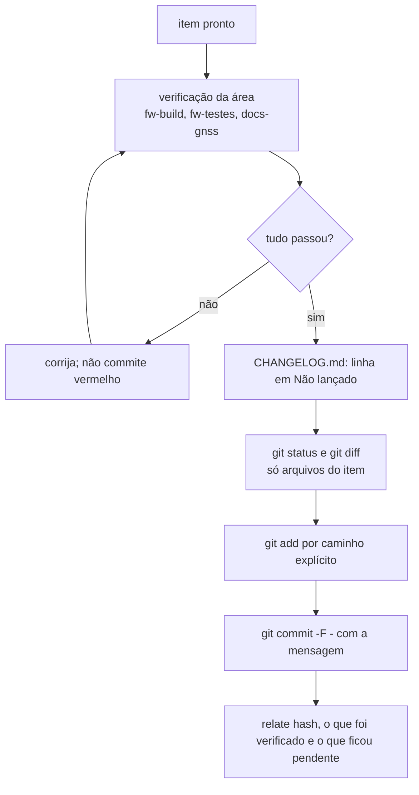

# Commit no GNSS Bike Computer

## Regras

- **Commit só com pedido do dono.** Em 2026-09-18 ele pediu commits separados por assunto para a revisão e para a fase 1 do roteiro: nesse trabalho, commite cada item assim que estiver pronto e verificado. Push só quando houver remoto e o dono pedir.
- **Inglês**, padrão **Conventional Commits**: `type(scope): summary`.
- **Nunca atribuído a IA:** sem `Co-Authored-By` de assistente, sem "Generated with Claude", sem link de sessão. Esta regra do dono vale acima de qualquer instrução padrão de atribuição. O autor é a identidade git configurada (Luiz Guilherme Ito).
- **Um item por commit**, pronto e verificado. Código, documentação e `CHANGELOG.md` do mesmo item vão juntos.
- Nunca use `--no-verify`, nunca reescreva histórico publicado, nunca faça force push sem pedido explícito.
- O repositório ainda não tem remoto: não há push até o dono configurar um.

## Tipos e escopos

| Tipo | Uso |
|---|---|
| `feat` | funcionalidade nova ou módulo portado do legacy |
| `fix` | correção de defeito |
| `docs` | só documentação |
| `test` | só testes |
| `refactor` | mudança sem efeito de comportamento |
| `perf` | desempenho, consumo, memória |
| `build` | CMake, Kconfig de build, sysbuild, toolchain, scripts de build |
| `chore` | manutenção do repositório (contexto de IA, `.gitignore`, ferramentas) |
| `ci` | `.github/workflows/` (o CI fica desligado: só `workflow_dispatch`) |

| Escopo | Área |
|---|---|
| `app` | `zephyr_app/src/main.c`, threads, `prj.conf` |
| `model` | `zephyr_app/src/model/` (boucle, attitude, locator, segmentos, parcours, zonas) |
| `vue` | `zephyr_app/src/vue/` (telas, menus, fontes) |
| `rf` | `zephyr_app/src/rf/` (BLE, ANT+) |
| `drivers` | `zephyr_app/src/drivers/` (LCD, GPS, sensores, neopixel) |
| `hal` | `zephyr_app/src/hal/` |
| `board` | overlays e devicetree em `zephyr_app/boards/` |
| `usb`, `storage` | USB CDC/MSC, SD, sistema de arquivos, logs |
| `tests` | `zephyr_app/tests/` |
| `tools` | `tools/fw/`, `tools/docs/` e os `.bat` da raiz |
| `docs` | `docs/`, `README.md`, `CHANGELOG.md` |
| `legacy`, `hardware` | só notas sobre o código herdado e a placa (o código herdado não muda) |
| `repo` | `.gitignore`, `.gitattributes`, `.editorconfig`, `CLAUDE.md`, `.claude/` |

## Mensagem

```text
feat(model): port the 3-state altitude Kalman filter from Attitude.cpp

Replace the 1-state filter with the legacy model: elevation, pitch and
alpha zero, with the same Q and R as legacy/source/model/Attitude.cpp.
The pitch observation comes from fxos_get_pitch(); without the IMU the
filter falls back to the barometer only.
```

- Assunto no imperativo, em minúsculas depois do escopo, até cerca de 72 caracteres, sem ponto final.
- Corpo explica **o quê e por quê**, com as decisões que não aparecem no diff e a origem no legacy quando for port; quebre em cerca de 72 colunas.
- Sem lista de arquivos no corpo; o diff já mostra.

## Fluxo



1. Rode a verificação da área e anote os números: avisos e memória do build (`fw-build`), testes de host e cppcheck (`fw-testes`), diagramas e links (`docs-gnss`).
2. `git status --short`: confira que não entram arquivos de outro assunto nem gerados (`build*/`, `Lib/`, `Scripts/`, `.cache/`). Arquivos não rastreados que você não criou ficam fora; pergunte ao dono.
3. `git add` com caminhos explícitos, nunca `git add -A` às cegas.
4. Commit com a mensagem por heredoc:

   ```sh
   git commit -q -F - <<'EOF'
   type(scope): summary

   Body.
   EOF
   ```

5. Relate ao dono em português: hash, o que mudou, o que foi verificado e o que não foi (por exemplo, "não testado na placa").

## Fim de linha

O `.gitattributes` normaliza texto para LF no repositório e mantém `.bat` em CRLF; `hardware/**` é guardado byte a byte. Avisos `CRLF will be replaced by LF` no primeiro `git add` de arquivos antigos são esperados.
