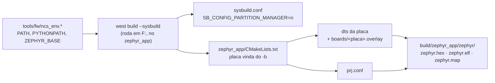

# Compilar, gravar e monitorar o firmware

Tudo parte da raiz do repositório. O firmware ativo é o `zephyr_app/`; o `legacy/` não compila nesta máquina (não há nRF5 SDK instalado) e serve só de referência.

## Ambiente verificado

| Item | Valor |
|---|---|
| SDK | nRF Connect SDK v3.3.0 em `C:\ncs\v3.3.0` (Zephyr 4.3.99) |
| Toolchain | `C:\ncs\toolchains\936afb6332` (Zephyr SDK 0.17.0, GCC 12.2.0, CMake 4.2.1, west 1.5.0, Python 3.12.4) |
| Alvo | `nrf52840dk/nrf52840` com os pinos da placa myStravaB (`zephyr_app/boards/nrf52840dk_nrf52840.overlay`); nRF54LM20 DK com `BOARD=nrf54lm20dk/nrf54lm20a/cpuapp` (use outra `BUILD_DIR`, por exemplo `zephyr_app/build_54`) |
| Gravação | `nrfutil device` 2.17.5 do toolchain, pelo J-Link OB do DK |
| Debug | SEGGER J-Link V8.76, V8.96 e V9.24a em `C:\Program Files\SEGGER` |

O `tools/fw/ncs_env.sh` (Git Bash) e o `tools/fw/ncs_env.bat` (cmd) montam o ambiente a partir do `environment.json` do toolchain. O `.sh` descobre o toolchain pelo `C:\ncs\toolchains\toolchains.json`; o `.bat` usa `NCS_TOOLCHAIN=936afb6332`. Para trocar de versão, defina `NCS_VERSION` e `NCS_TOOLCHAIN` antes.

## Comandos

| Tarefa | Git Bash (assistente) | cmd / duplo clique |
|---|---|---|
| Build incremental | `bash tools/fw/fw.sh build` | `build.bat` |
| Build do zero | `bash tools/fw/fw.sh build pristine` | `build.bat pristine` ou `build_ncs.bat` |
| Gravar apagando tudo | `bash tools/fw/fw.sh flash` | `flash.bat` |
| Gravar mantendo settings/bonds | `bash tools/fw/fw.sh flash keep` | `flash.bat keep` |
| Desbloquear chip protegido | `bash tools/fw/fw.sh recover` | `recover.bat` |
| Listar placas | `bash tools/fw/fw.sh devices` | `nrfutil device list` |
| Memória e maiores símbolos | `bash tools/fw/fw.sh size` | — |
| Console serial | — | `serial.bat COMx` (115200) |

Variáveis úteis: `BUILD_DIR` (outra pasta de build), `BOARD` (outro alvo; a família do `nrfutil` vem dela, ou de `FAMILY`), `ANT=1` (build com o add-on `sdk-ant`; troque só com `pristine`), `NRF_SERIAL` (escolhe o J-Link quando há mais de um), `NOPAUSE=1` (os `.bat` não esperam tecla).

## Como o build funciona

- **Sysbuild** é o fluxo padrão do NCS; `--no-sysbuild` ainda funciona para imagem única, mas está depreciado.
- **Partition Manager desligado** em `zephyr_app/sysbuild.conf`: ele está depreciado no NCS 3.3. O layout vem do devicetree: aplicação em `0x0` e `storage_partition` (settings/NVS dos bonds BLE e das configurações) com 32 KB em `0xF8000`.
- A placa vem do `-b` (`BOARD` no `fw.sh` e no `build.bat`, padrão `nrf52840dk/nrf52840`), e o Zephyr aplica sozinho o `boards/<placa>.overlay` com o nome dela, por exemplo `boards/nrf52840dk_nrf52840.overlay` (pinos da V3 no DK).
- O firmware sai em `build/zephyr_app/zephyr/zephyr.hex` (sem `merged.hex`, porque não há MCUboot).

## Conferir o resultado

Números de referência (build de 2026-09-19, NCS v3.3.0, nRF52840 DK; o nRF54LM20 DK e o `ANT=1` estão em `docs/03-ambiente-build.md#resultado-de-referência`):

| Região | Uso | Limite |
|---|---|---|
| FLASH | 473.952 B (45,2 %) | 1 MB |
| RAM | 220.352 B (84,1 %) | 256 KB |

- **Avisos esperados: 0** (com `ANT=1`, só o do símbolo obsoleto do `sdk-ant`). Qualquer aviso é defeito seu: corrija.
- Maiores consumidores de RAM: heap do LVGL (32 KB, `CONFIG_LV_Z_MEM_POOL_SIZE`), `seg_runtime` (22 KB), buffer de desenho do LVGL (19,2 KB), heap do sistema (16 KB, `CONFIG_HEAP_MEM_POOL_SIZE`), quadro da tela (12,5 KB da Sharp; 36,5 KB do JDI no nRF54LM20), `points` (8 KB), as pilhas das threads de serviço e quatro cópias do retrato da tela (2,4 KB cada). Confira com `bash tools/fw/fw.sh size` depois de mexer em buffers estáticos.
- Reporte números exatos ("FLASH 473.952 B, 0 avisos"), nunca "compilou".

## Gravar e ver o log

1. Ligue o nRF52840-DK pela USB do interface MCU (J-Link), não pela marcada "nRF USB", e confira com `bash tools/fw/fw.sh devices`: precisa aparecer um dispositivo com o trait `jlink`.
2. `bash tools/fw/fw.sh flash`. O padrão `ERASE_ALL` apaga também a `storage_partition` (bonds e configurações); use `flash keep` para preservá-las.
3. Console: o `zephyr,console` é o `uart0` do DK (TX P0.06, RX P0.08, 115200) pela porta VCOM do J-Link. O log usa o backend UART (`CONFIG_LOG_BACKEND_UART=y`); o RTT está desligado no `prj.conf`.
4. Nada disso substitui teste na placa myStravaB: o alvo atual é o DK com a pinagem da placa (ver skill `fw-hardware`).

## Problemas comuns

| Sintoma | Causa e solução |
|---|---|
| `ValueError: path is on mount 'F:', start on mount 'C:'` | o west rodou com o diretório atual em `C:` e o projeto em `F:`; rode de dentro do `zephyr_app` (os scripts já fazem isso) |
| `include could not find requested file: .../936afb6332/cmake/toolchain/zephyr/generic.cmake` | a variável de ambiente `TOOLCHAIN_ROOT` está definida; o Zephyr a usa como raiz das definições de toolchain. Não a defina (os scripts usam `NCS_TOOLCHAIN_DIR`) |
| `Build directory ... is for application ...` ou cache de outro caminho | a pasta de build veio de outro caminho ou de outro SDK; `-p auto` refaz do zero, ou use `build pristine` |
| `.config` ou tamanho que não batem com a mudança (ex.: `NRFX_QSPI=y` depois de desligar o QSPI) | o build incremental guarda símbolos Kconfig antigos; antes de afirmar algo sobre `.config`, devicetree ou memória, compile com `build pristine` |
| `fatal error: opening dependency file ... No such file or directory` com aviso de `CMAKE_OBJECT_PATH_MAX` | caminho longo demais (passa de 250 caracteres nos objetos, por exemplo numa pasta temporária do usuário); compile dentro do repositório (`zephyr_app/build` ou `build/`) |
| aviso `SB_CONFIG_PARTITION_MANAGER is enabled` | faltou o `zephyr_app/sysbuild.conf` |
| `nrfutil` grava no dispositivo errado ou reclama de vários | há um ST-LINK e outras seriais nesta máquina; os scripts filtram `--traits jlink`, ou defina `NRF_SERIAL` |
| gravação falha por proteção | `recover` apaga tudo e libera o APPROTECT; depois grave de novo |
| `JLink.exe` abre a ferramenta do Java | o `JLink.exe` do PATH é do Eclipse Adoptium; use `C:\Program Files\SEGGER\JLink_V924a\JLink.exe` |
| pino da placa se comportando como outro periférico no DK | um nó do DK voltou a ocupar o pino (o overlay desliga `qspi`/`mx25r64`, `spi3`, `pwm0` e tira RTS/CTS do `uart0`); confira o `zephyr.dts` gerado e a skill `fw-hardware` |

Depois de compilar: testes de host e análise estática na skill `fw-testes`.
