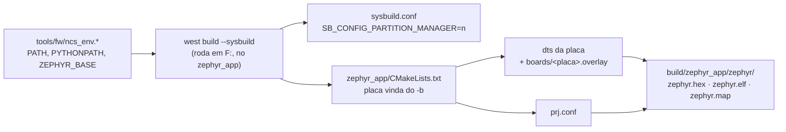

# Compilar, gravar e monitorar o firmware

Tudo parte da raiz do repositório. O firmware ativo é o `zephyr_app/`; o `legacy/` não compila nesta máquina (não há nRF5 SDK instalado) e serve só de referência.

## Ambiente verificado

| Item | Valor |
|---|---|
| SDK | nRF Connect SDK v3.3.0 em `C:\ncs\v3.3.0` (Zephyr 4.3.99) |
| Toolchain | `C:\ncs\toolchains\936afb6332` (Zephyr SDK 0.17.0, GCC 12.2.0, CMake 4.2.1, west 1.5.0, Python 3.12.4) |
| Alvo padrão | `nrf54lm20dk/nrf54lm20a/cpuapp` (`tools/fw/fw.sh:33`), com `zephyr_app/boards/nrf54lm20dk_nrf54lm20a_cpuapp.overlay` e `.conf` |
| Placa do projeto | `BOARD=gnssbike/nrf54lm20a/cpuapp`, em `zephyr_app/boards/gnss/gnssbike/` mais `boards/gnssbike_nrf54lm20a_cpuapp.overlay` e `.conf`; use outra `BUILD_DIR` (`zephyr_app/build_custom`). **Existe como alvo que compila: não há placa física nem esquemático** |
| Alvo antigo | `BOARD=nrf52840dk/nrf52840` com os pinos da myStravaB (`zephyr_app/boards/nrf52840dk_nrf52840.overlay`) ainda compila, mas não é mais usado (`tools/fw/fw.sh:11-12`) |
| Gravação | `nrfutil device` 2.17.5 do toolchain, pelo J-Link OB do DK |
| Debug | SEGGER J-Link V8.76, V8.96 e V9.24a em `C:\Program Files\SEGGER` |

O `tools/fw/ncs_env.sh` (Git Bash) e o `tools/fw/ncs_env.bat` (cmd) montam o ambiente a partir do `environment.json` do toolchain. O `.sh` descobre o toolchain pelo `C:\ncs\toolchains\toolchains.json`; o `.bat` usa `NCS_TOOLCHAIN=936afb6332`. Para trocar de versão, defina `NCS_VERSION` e `NCS_TOOLCHAIN` antes.

## Comandos

| Tarefa | Git Bash (assistente) | cmd / duplo clique |
|---|---|---|
| Build incremental | `bash tools/fw/fw.sh build` | `build.bat` |
| Build do zero | `bash tools/fw/fw.sh build pristine` | `build.bat pristine` ou `build_ncs.bat` |
| Build da placa do projeto | `BOARD=gnssbike/nrf54lm20a/cpuapp BUILD_DIR=zephyr_app/build_custom bash tools/fw/fw.sh build` | — |
| Conferir o mapa de pinos da placa | `python tools/fw/board_check.py` | — |
| Gravar apagando tudo | `bash tools/fw/fw.sh flash` | `flash.bat` |
| Gravar mantendo settings/bonds | `bash tools/fw/fw.sh flash keep` | `flash.bat keep` |
| Desbloquear chip protegido | `bash tools/fw/fw.sh recover` | `recover.bat` |
| Listar placas | `bash tools/fw/fw.sh devices` | `nrfutil device list` |
| Memória e maiores símbolos | `bash tools/fw/fw.sh size` | — |
| Console serial | — | `serial.bat COMx` (115200) |

Variáveis úteis: `BUILD_DIR` (outra pasta de build), `BOARD` (outro alvo; a família do `nrfutil` vem dela, ou de `FAMILY`), `ANT=1` (build com o add-on `sdk-ant`; troque só com `pristine`), `NRF_SERIAL` (escolhe o J-Link quando há mais de um), `NOPAUSE=1` (os `.bat` não esperam tecla).

## Como o build funciona

- **Sysbuild** é o fluxo padrão do NCS; `--no-sysbuild` ainda funciona para imagem única, mas está depreciado.
- **Partition Manager desligado** em `zephyr_app/sysbuild.conf`: ele está depreciado no NCS 3.3. O layout vem do devicetree. Nos alvos nRF54LM20A ele sai de `nrf54lm20a_cpuapp_partition.dtsi` do Zephyr (que inclui `nrf54lm20_a_b_cpuapp_partition.dtsi`): MCUboot com 64 KB em `0x0`, `slot0` e `slot1` com 920 KB cada (`0x10000` e `0xF6000`) e `storage_partition` de 36 KB em `0x1DC000`. No nRF52840 o layout é o antigo, com a aplicação em `0x0` e 32 KB de `storage_partition` em `0xF8000`.
- A placa vem do `-b`: `BOARD` no `fw.sh` tem o padrão `nrf54lm20dk/nrf54lm20a/cpuapp` (`fw.sh:33`); o `build.bat:27` ainda tem `nrf52840dk/nrf52840`. O Zephyr aplica sozinho o `boards/<placa>.overlay` com o nome dela (`/` vira `_`), por exemplo `boards/nrf54lm20dk_nrf54lm20a_cpuapp.overlay`.
- A placa do projeto mora fora da árvore do Zephyr, e é o `-DBOARD_ROOT` que a faz ser achada: o `fw.sh:95-100` passa `-DBOARD_ROOT` e `-Dmcuboot_BOARD_ROOT` apontando para `zephyr_app`, porque a imagem do MCUboot é construída à parte pelo sysbuild.
- O MCUboot entra nos alvos com o nRF54LM20A (`zephyr_app/Kconfig.sysbuild`), não no nRF52840. O firmware do app sai em `build/zephyr_app/zephyr/zephyr.hex` e `zephyr.signed.hex`; o `fw.sh` grava o `merged.hex` quando existe e, senão, o `zephyr.hex`.

## Conferir o resultado

Números de referência (build de 2026-09-22, NCS v3.3.0, imagem da aplicação; o `ANT=1` está em `docs/03-ambiente-build.md#resultado-de-referência`):

| Alvo | FLASH | RAM |
|---|---|---|
| nRF54LM20 DK | 636.144 B de 921.456 B do slot (69,04 %) | 393.080 B (75,12 %) |
| placa `gnssbike` | 636.360 B (69,06 %) | 369.120 B (70,54 %) |

- **Avisos esperados: 0** (com `ANT=1`, só o do símbolo obsoleto do `sdk-ant`). Qualquer aviso é defeito seu: corrija.
- Maiores consumidores de RAM: heap do LVGL (32 KB, `CONFIG_LV_Z_MEM_POOL_SIZE`), `seg_runtime` (22 KB), buffer de desenho do LVGL (19,2 KB), heap do sistema (16 KB, `CONFIG_HEAP_MEM_POOL_SIZE`), quadro da tela (12,5 KB da Sharp; 36,5 KB do JDI no nRF54LM20), `points` (8 KB), as pilhas das threads de serviço e quatro cópias do retrato da tela (2,4 KB cada). Confira com `bash tools/fw/fw.sh size` depois de mexer em buffers estáticos.
- Reporte números exatos ("FLASH 636.144 B, 0 avisos"), nunca "compilou".

## Gravar e ver o log

1. Ligue o nRF54LM20 DK pela USB do interface MCU (J-Link) e confira com `bash tools/fw/fw.sh devices`: precisa aparecer um dispositivo com o trait `jlink`. O `fw.sh` deduz a família do `nrfutil` (`nrf54l` ou `nrf52`) da `BOARD`.
2. `bash tools/fw/fw.sh flash`. O padrão `ERASE_ALL` apaga também a `storage_partition` (bonds e configurações); use `flash keep` para preservá-las.
3. Console, 115200 baud, com o backend UART do log (`CONFIG_LOG_BACKEND_UART=y`; o RTT está desligado no `prj.conf`):
   - **nRF54LM20 DK:** `zephyr,console` no `uart20` (TX P1.16, RX P1.17), pela VCOM0 do J-Link.
   - **placa `gnssbike`:** `zephyr,console` no `uart20` (TX P1.00, RX P1.31), em dois pads de teste, sem conector na caixa.
   - **nRF52840 DK (alvo antigo):** `uart0` (TX P0.06, RX P0.08).
4. Nada disso substitui teste em placa: **nada neste projeto rodou em hardware**, nem no DK. O alvo da placa do projeto compila, mas a placa não existe fisicamente (ver skill `fw-hardware`).

## Problemas comuns

| Sintoma | Causa e solução |
|---|---|
| `ValueError: path is on mount 'F:', start on mount 'C:'` | o west rodou com o diretório atual em `C:` e o projeto em `F:`; rode de dentro do `zephyr_app` (os scripts já fazem isso) |
| `include could not find requested file: .../936afb6332/cmake/toolchain/zephyr/generic.cmake` | a variável de ambiente `TOOLCHAIN_ROOT` está definida; o Zephyr a usa como raiz das definições de toolchain. Não a defina (os scripts usam `NCS_TOOLCHAIN_DIR`) |
| `Build directory ... is for application ...` ou cache de outro caminho | a pasta de build veio de outro caminho ou de outro SDK; `-p auto` refaz do zero, ou use `build pristine` |
| `.config` ou tamanho que não batem com a mudança (ex.: `NRFX_QSPI=y` depois de desligar o QSPI) | o build incremental guarda símbolos Kconfig antigos; antes de afirmar algo sobre `.config`, devicetree ou memória, compile com `build pristine` |
| `fatal error: opening dependency file ... No such file or directory` com aviso de `CMAKE_OBJECT_PATH_MAX` | caminho longo demais (passa de 250 caracteres nos objetos, por exemplo numa pasta temporária do usuário); compile dentro do repositório (`zephyr_app/build` ou `build/`) |
| aviso `SB_CONFIG_PARTITION_MANAGER is enabled` | faltou o `zephyr_app/sysbuild.conf` |
| `nrfutil` grava no dispositivo errado ou reclama de vários | há um ST-LINK e outras seriais nesta máquina; os scripts filtram `--traits jlink`, ou defina `NRF_SERIAL` |
| gravação falha por proteção | `recover` apaga tudo e libera o APPROTECT; depois grave de novo |
| `JLink.exe` abre a ferramenta do Java | o `JLink.exe` do PATH é do Eclipse Adoptium; use `C:\Program Files\SEGGER\JLink_V924a\JLink.exe` |
| pino se comportando como outro periférico no DK | um nó do DK voltou a ocupar o pino. No `nrf52840dk_nrf52840.overlay` isso é resolvido desligando `qspi`/`mx25r64`, `spi3` e `pwm0` e tirando RTS/CTS do `uart0`; no `nrf54lm20dk_nrf54lm20a_cpuapp.overlay` não há nó desligado (o `mx25r64` do DK é reaproveitado como disco de armazenamento). Confira o `zephyr.dts` gerado e a skill `fw-hardware` |
| pino errado ou apelido faltando na placa do projeto | `python tools/fw/board_check.py` confere o mapa de pinos antes do build; ver skill `fw-hardware` |

Depois de compilar: testes de host e análise estática na skill `fw-testes`.
