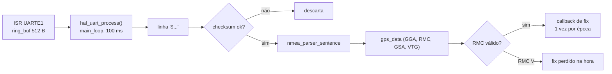

# GPS e sensores

## GNSS: Antenova M10578-A3 (MediaTek MT3333)

- UART 9600 no boot; saída padrão GGA, GSA, GSV, RMC, VTG por época (1 Hz); multi-constelação (pode mandar `GN`/`GL`).
- Pinos: reset e standby **ativos baixos**, FIX **alto com fix** (datasheet: "indicates once a GPS fix has been obtained").
- Backup (BV) na bateria: configurações feitas por PMTK (inclusive baud) sobrevivem ao desligamento. Se o legacy deixou o módulo em 115200, o port a 9600 fica surdo até um reset de fábrica ou um WDT de baud.

### Caminho dos dados no port

- `nmea_parser_sentence()` aceita a linha com ou sem `$`; não valida checksum (o `gps_mgmt` valida antes com `nmea_verify_checksum()`); o caminho `nmea_parser_char()` valida sozinho.
- Coordenadas convertidas em `double` antes de virar `float`.
- Testes: `test_nmea_parser` e `test_gps_mgmt` (skill `fw-testes`).

### PMTK do legacy (`libraries/GlobalTop/LocusCommands.h`)

| Comando | Uso no legacy |
|---|---|
| `$PMTK010` (recebido) | módulo pronto: dispara a troca de baud |
| `$PMTK251,115200` | troca para 115200; WDT de baud alterna 9600 e 115200 se nada chega por 3 s |
| `$PMTK741,lat,lon,alt,AAAA,MM,DD,hh,mm,ss` | host aiding com a posição do celular (LNS) |
| `$PMTK721,...` | EPO, desativado no legacy |
| `$PMTK253,1` | **modo binário**: nunca envie no fluxo NMEA (o `gps_epo.c` do port envia: defeito aberto) |
| `$PMTK220,<ms>` | intervalo de fix (no legacy com bug, sem uso) |

Antes de mandar PMTK novo: checksum XOR entre `$` e `*`, com `*` fora da conta (o `gps_mgmt_set_rate()` do port inclui o `*`: defeito).

## BME280 (altitude)

- Driver nativo do Zephyr (`bosch,bme280` em 0x76) com `baro.c` por cima (`sensor_sample_fetch`).
- Legacy: pressão ×16, temperatura ×1, umidade desligada, IIR ×16, standby 62,5 ms, média de 10 leituras. Port (Kconfig padrão): pressão ×16, temperatura ×2, umidade ×16, IIR ×4, standby 1000 ms. Para aproximar: `CONFIG_BME280_STANDBY_62MS`, `CONFIG_BME280_FILTER_16`, `CONFIG_BME280_TEMP_OVER_1X`.
- Altitude e referência ao nível do mar: fórmulas em `docs/06-algoritmos.md#barômetro-e-drift`.

## FXOS8700CQ (pitch e rumo)

- Driver nativo (`nxp,fxos8700` em 0x1E) com `fxos.c` por cima; `reset-gpios` ativo alto no overlay.
- Legacy: ±4 g, 50 Hz por interrupção, média de 50 amostras, pitch `−atan2f(Ay, −Az)` nos eixos da V11, calibração do magnetômetro salva na FRAM. Port: ±8 g, 6,25 Hz por polling, uma amostra, fórmulas genéricas, magnetômetro com 10 µT por contagem. Diferenças catalogadas em `docs/10-status-do-port.md`.

## STC3100 (bateria e latch)

- Driver próprio (`stc3100.c`, I2C 0x70). `stc3100_init()` segura o latch de energia (ver skill `fw-hardware`); **bit 0 do `REG_CONTROL` em 1 desliga a placa**.
- Conversões: V = raw·2,44 mV, I = raw·11,77 µV/Rs, Q = raw·6,7 µVh/Rs, T = raw·0,125 °C. Rs = 100 mΩ no código, 20 mΩ no esquema: confirme antes de confiar.
- SOC: o legacy compensa a resistência interna (0,273 Ω) e usa curva não linear; o port é linear de 3,3 a 4,2 V.

## FRAM FM24CL16B

2 KB em 0x50 a 0x57 (página nos bits baixos do endereço). O legacy guarda nela as configurações (24 B em 0x0000, versão 0x0002, CRC). O port usa NVS; para ler a FRAM há o binding `fujitsu,mb85rcxx` do Zephyr (`size = <2048>`, `address-width = <8>`).

## Antes de terminar

Testes de host verdes, build sem aviso novo e, se mudou pino ou polaridade, o `zephyr.dts` gerado conferido. Hardware: diga explicitamente o que não foi testado na placa.
