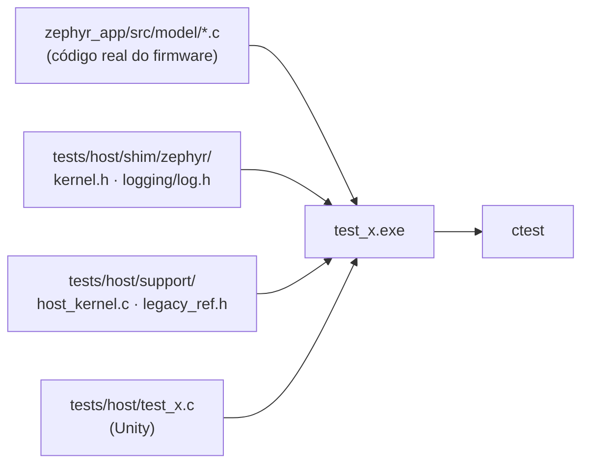

# Testes de host e análise estática

## Rodar

```sh
bash tools/fw/host_tests.sh             # configura, compila e roda todos
bash tools/fw/host_tests.sh -R power    # só os conjuntos que casam com o filtro
```

Por baixo, em `zephyr_app/tests/host/`: `cmake --preset host-tests`, `cmake --build --preset host-tests`, `ctest --preset host-tests`.

- Compilador: GCC do PC (MinGW-w64 15.2 em `C:\ProgramData\mingw64\mingw64\bin`), CMake 4.x e Ninja do pip. **Não** rode no mesmo shell em que fez `source tools/fw/ncs_env.sh`: o ambiente do NCS troca o `cmake` e o `PATH`.
- O Unity v2.6.1 vem por `FetchContent` com SHA-256 fixo (download único para `build/host-tests/_deps`).
- Um conjunto sozinho: `zephyr_app/tests/host/build/host-tests/test_power_zone.exe` mostra arquivo, linha e mensagem de cada falha.
- Reporte o número exato ("3 de 3 conjuntos, 20 casos"), nunca "os testes passam".

## Como funciona



- Os módulos de lógica dependem quase só de `<zephyr/logging/log.h>` e, alguns, de `k_mutex` e `k_uptime_get*`. Os shims em `tests/host/shim/` transformam o log em nada, fazem o mutex nunca bloquear e dão um relógio controlável (`host_uptime_set()`/`host_uptime_advance()` em `support/host_kernel.h`, ligado com `SUPPORT host_kernel.c`).
- Módulos que usam `fs_*`, BLE, SPI, I2C ou UART ainda não têm shim: para testá-los, crie o shim mínimo em `tests/host/shim/zephyr/...` ou separe a lógica pura do acesso ao hardware.
- As mesmas flags de aviso do firmware (`-Wall -Wextra -Wno-unused-parameter`) mais `-Werror`.

## Oráculo: o legacy

O port precisa reproduzir o comportamento do `legacy/`. Um teste de fidelidade:

1. Lê a função original em `legacy/source/...` e anota regras, limites e constantes no comentário do topo do teste, com `arquivo:linha`.
2. Quando a fórmula é curta, transcreve a função original em `tests/host/support/legacy_ref.h` (prefixo `legacy_`, com a origem no comentário) e compara o port com ela em várias entradas.
3. Usa pontos reais: Nancy (48.6921, 6.1844), onde foram gravados os traços de simulação do legacy (`tools/TDD/GPX_simu*.csv`).
4. Quando o port **diverge de propósito** do legacy, o teste documenta a diferença no nome e no comentário, e a diferença entra em `docs/06-algoritmos.md`.

## Escrever um conjunto

1. Crie `zephyr_app/tests/host/test_<módulo>.c` com `setUp`, `tearDown`, funções `static void test_<comportamento>(void)` e um `main` com `UNITY_BEGIN`, `RUN_TEST` e `UNITY_END`.
2. Registre em `zephyr_app/tests/host/CMakeLists.txt`: `gnss_add_test(test_<módulo> SOURCES model/<módulo>.c [SUPPORT host_kernel.c])`.
3. Nomeie cada teste pelo comportamento garantido, como frase: `test_power_outside_50_to_1950_watts_is_not_binned_but_moves_the_clock`.
4. Teste números concretos e bordas: limites de zona, primeira amostra, relógio parado, virada de `uint32_t`, entradas fora de faixa, divisão por zero.
5. Floats com `TEST_ASSERT_FLOAT_WITHIN(tolerância, esperado, obtido)`; justifique a tolerância no comentário quando não for óbvia.

## Testes de mutação

Um teste só vale se falhar quando o comportamento some:

1. Copie o arquivo original para o scratchpad.
2. Quebre o comportamento (mude um limite, inverta uma condição, apague uma linha).
3. Rode `bash tools/fw/host_tests.sh -R <conjunto>`: precisa falhar. Se passar, o teste está fraco; melhore o teste.
4. Restaure o arquivo e confirme que tudo volta a passar. Nunca deixe uma mutação no código: confira `git status` e `git diff` no fim.

## cppcheck

```sh
cppcheck --enable=warning,style,performance,portability --std=c11 --inline-suppr --quiet \
  --suppress=missingIncludeSystem --suppress=missingInclude --suppress=unusedFunction \
  -I zephyr_app/include zephyr_app/src
```

- `syntaxError` em `ble_*.c` e `neopixel.c` vem das macros do Zephyr (`BT_GATT_*`, `DT_*`) sem os headers: falso positivo.
- Achados reais conhecidos estão em `docs/11-qualidade-misra.md`. Corrija o que for seu; supressão só inline, `// cppcheck-suppress <id>`, com o motivo na linha de cima.

## Antes de dizer que passou

- Rode de novo depois da última edição; não confie em resultado antigo.
- Firmware também: `bash tools/fw/fw.sh build` sem aviso novo (os 7 de `vue.c` são conhecidos).
- Diga o que não foi testado: nada disto substitui teste na placa.
