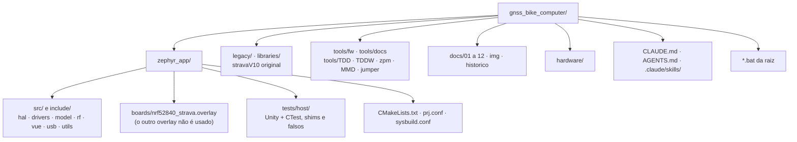
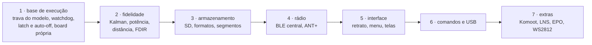

# CLAUDE.md · GNSS Bike Computer

Contexto e regras para assistentes de IA que trabalham neste repositório. Leia inteiro antes de mexer em qualquer coisa. As skills em [`.claude/skills/`](.claude/skills/) trazem os procedimentos passo a passo; a documentação técnica está em [`docs/`](docs/README.md).

## 1. Missão

Portar para **Zephyr / nRF Connect SDK** o **stravaV10**, computador de bordo GPS para ciclismo de Vincent Gollé, que roda na placa **myStravaB V3** (nRF52840 no módulo BMD-340, GNSS M10578-A3, LCD Sharp LS027 em retrato, BME280, FXOS8700, STC3100, microSD, ANT+ e BLE).

| Parte | Pasta | Papel |
|---|---|---|
| Port Zephyr | `zephyr_app/` | o firmware ativo, em C puro sobre NCS v3.3.0 |
| Original | `legacy/` | nRF5 SDK 16 + S340, C/C++: **especificação de comportamento**, só leitura |
| Bibliotecas do original | `libraries/` | Adafruit GFX, TinyGPS++, Kalman, SEGGER, etc.: só leitura |
| Ferramentas | `tools/` | `fw/` e `docs/` são do projeto; `TDD/`, `TDDW/`, `zpm/`, `MMD/`, `jumper/` vêm do legacy |
| Placa | `hardware/` | Eagle da V3 (os Gerbers da pasta são da **V2**) |

O dono do projeto é um desenvolvedor brasileiro de eletrônica embarcada que quer investigação completa, código nativo e verificação de verdade, não atalhos.

## 2. Regras que não se discutem

### Comunicação

- **Responda sempre em português do Brasil.** Código, identificadores e comentários de código ficam em inglês.
- Não afirme nada sem verificar. O que não foi testado na placa é dito como "não testado na placa".
- Em tarefas longas, mande um status curto de vez em quando.

### Firmware

- **O legacy é a referência.** Antes de portar ou mudar um comportamento, leia o original e cite `legacy/<arquivo>:<linha>`. Toda diferença de constante ou fórmula é corrigida ou registrada em `docs/06-algoritmos.md` e `docs/10-status-do-port.md`.
- **Nunca altere `legacy/`, `libraries/` nem `hardware/`** (a exceção é o `legacy/README.md`).
- **Zephyr nativo:** devicetree, Kconfig, drivers e subsistemas do Zephyr/NCS. Nada de Arduino nem de bibliotecas do legacy compiladas no port.
- **ISR não processa:** só copia dados para um buffer e acorda uma thread. Nada de mutex, arquivo, `snprintf` com float ou trigonometria em ISR.
- **Sem alocação dinâmica depois do boot**; buffers estáticos dimensionados e documentados.
- **Pilha medida:** thread nova ou cadeia pesada nova passa por `CONFIG_STACK_USAGE` (skill `fw-threads`) com pelo menos 1 KB de folga.
- **Verificação antes de dizer que terminou:** build sem aviso novo (os 7 de `vue.c` são conhecidos), testes de host, cppcheck nos arquivos tocados e, se mexeu em docs, `tools/docs/*.py`.

### Commits

- **Commit só com pedido do dono.** Em 2026-09-18 ele pediu commits separados por assunto para a revisão e para a fase 1 do roteiro: nesse trabalho, cada item pronto e verificado vira um commit. Push só com remoto configurado e pedido do dono. Mensagens em **inglês**, Conventional Commits com escopo (`fix(hal): ...`, `feat(model): ...`, `docs(docs): ...`).
- **Nunca atribua commit a IA:** sem `Co-Authored-By` de assistente, sem "Generated with", sem menção a Claude. O autor é a identidade git configurada (Luiz Guilherme Ito). Procedimento na skill `commit-gnss`.
- Nunca faça commit de credenciais nem de arquivos gerados (`build*/`, `Lib/`, `Scripts/`).

### Documentação

- Português do Brasil, direto, voz ativa; **diagramas sempre em Mermaid**, nunca em texto puro; README no padrão industrial. Skill `docs-gnss`.
- Quando o comportamento muda, a documentação e o `CHANGELOG.md` mudam junto.

### Ambiente

- **Nunca use WSL**, máquinas virtuais nem Docker local.
- Não instale pacotes na máquina do dono sem perguntar (downloads de dependência de build, como o Unity via FetchContent, são aceitos).
- Não há CI: a verificação é local.

## 3. Mapa do repositório

## 4. Comandos essenciais

| Tarefa | Comando (Git Bash, na raiz) |
|---|---|
| Build incremental / do zero | `bash tools/fw/fw.sh build` / `bash tools/fw/fw.sh build pristine` |
| Gravar no DK (apaga tudo / mantém settings) | `bash tools/fw/fw.sh flash` / `bash tools/fw/fw.sh flash keep` |
| Desbloquear chip | `bash tools/fw/fw.sh recover` |
| Placas conectadas | `bash tools/fw/fw.sh devices` |
| Memória e maiores símbolos | `bash tools/fw/fw.sh size` |
| Testes de host | `bash tools/fw/host_tests.sh` (6 conjuntos, 42 casos) |
| Diagramas e links da documentação | `python tools/docs/mermaid_check.py` e `python tools/docs/links_check.py` |
| Ambiente do NCS no shell | `source tools/fw/ncs_env.sh` |

Equivalentes no `cmd`: `build.bat [pristine]`, `flash.bat [keep]`, `recover.bat`, `serial.bat COMx`. Variáveis: `BUILD_DIR`, `NRF_SERIAL`, `NCS_VERSION`, `NCS_TOOLCHAIN`, `NOPAUSE`.

Referência de 2026-09-18: FLASH 294.796 B (28,1 %), RAM 118.080 B (45,0 %), 7 avisos (`vue.c`).

## 5. Estado e próximos passos

- **Port:** compila no NCS v3.3.0 e passa nos testes de host; **nunca rodou em placa nem no DK**. Matriz completa em [`docs/10-status-do-port.md`](docs/10-status-do-port.md).
- **Feito em 2026-09-18:** revisão completa do legacy e do port (7 análises), build com sysbuild, scripts novos, testes de host, documentação, e 13 correções críticas: pilha da `main_loop` (4 KB), GPS fora da ISR (ring buffer + processamento na thread), um callback de fix por época, checksum NMEA, parser NMEA, estouro do `sd_logger`, botões, polaridades do GPS e do FXOS, nós do DK desligados, reset em erro fatal, símbolo do SoC.
- **Ordem proposta do que falta:**

- **Decidido em 2026-09-18:** ANT+ **e** BLE (os equipamentos externos são ANT+), pelo add-on `sdk-ant`; **board própria** com MCU da Nordic. Detalhes em [`docs/10-status-do-port.md`](docs/10-status-do-port.md#decisões-do-dono).
- **Em aberto:** MCU da placa nova (nRF52840, nRF54LM20, nRF54L15 ou nRF5340), instalação do workspace do `sdk-ant` (exige o dono aceitar o ANT+ Adopter Agreement; usa o sdk-nrf v3.2.4), formatos no SD, orientação da tela, licença do port (o legacy é CC BY-NC 4.0).

## 6. Armadilhas conhecidas

| Armadilha | Como evitar |
|---|---|
| `ValueError: path is on mount 'F:', start on mount 'C:'` no `west` | rode o `west` de dentro do `zephyr_app` (os scripts fazem isso); o NCS está em `C:` e o projeto em `F:` |
| `TOOLCHAIN_ROOT` definido quebra o CMake do Zephyr (`.../cmake/toolchain/zephyr/generic.cmake` não encontrado) | nunca exporte esse nome; os scripts usam `NCS_TOOLCHAIN_DIR` |
| No Windows, `Scripts/` (o que um `pip install` sem venv cria na raiz) e `scripts/` são a mesma pasta | ferramentas do projeto ficam em `tools/fw/` e `tools/docs/`; nunca rode `pip install` na raiz sem venv |
| ANT+ só funciona no workspace do add-on `sdk-ant`, preso ao sdk-nrf v3.2.4 | não misture as bibliotecas ANT com o NCS v3.3.0; o workspace do add-on fica ao lado do atual (fase 4 do roteiro) |
| A camada de comandos do Git Bash transforma `\\n` em quebra de linha real | para caminhos com `\` (arquivos `.bat`), use a ferramenta de edição, não `sed` com `\\` |
| As ferramentas de escrita gravam LF | depois de editar um `.bat`, volte para CRLF: `sed -i 's/\r$//; s/$/\r/' arquivo.bat` |
| `DTC_OVERLAY_FILE` fixo no `CMakeLists.txt` | o `boards/nrf52840dk_nrf52840.overlay` nunca entra no build |
| Desligar um nó do DK não desliga os filhos | o `mx25r64` precisa de `status = "disabled"` próprio, senão o driver `qspi-nor` volta |
| Builds antigos (`zephyr_app/build`, `zephyr_app/build_dk`, `build/`) de outra pasta e do NCS v3.1.0 | `-p auto` refaz; use `BUILD_DIR` para compilar em outra pasta sem apagá-los |
| `--no-sysbuild` e o Partition Manager estão depreciados no NCS 3.3 | sysbuild com `zephyr_app/sysbuild.conf` (`SB_CONFIG_PARTITION_MANAGER=n`) |
| `JLink.exe` do PATH é a ferramenta do Java | use o da SEGGER em `C:\Program Files\SEGGER\JLink_V924a\` |
| ST-LINK e outras seriais conectadas nesta máquina | os scripts usam `--traits jlink`; com vários J-Link, `NRF_SERIAL` |
| Console no `uart0` (P0.06/P0.08) | só existe no DK; na placa real esses pinos não têm ligação |
| cppcheck acusa `syntaxError` nos `ble_*.c` e no `neopixel.c` | macros do Zephyr sem os headers: falso positivo |
| clangd do editor reclama dos testes de host | ele usa o `compile_commands.json` do firmware; `tests/host/.clangd` aponta para o dos testes depois do primeiro `host_tests.sh` |
| Testes de host no mesmo shell do `ncs_env.sh` | o ambiente do NCS troca o `cmake`; use um shell limpo |
| Mermaid: `;` numa mensagem de `sequenceDiagram` | é separador de comandos; escreva "e" |
| Gerbers em `hardware/myStravaB_V3_2018-12-12/` | são da V2; não fabrique a V3 com eles |
| Shunt do STC3100 | esquema: 20 mΩ; código: 100 mΩ; confirme na placa antes de confiar em corrente e carga |
| `legacy/` não compila aqui | faltam o nRF5 SDK 16, o S340 e os submódulos `libraries/ant_profiles` e `ble_services` |

## 7. Skills do projeto

| Skill | Use para |
|---|---|
| `fw-build` | ambiente, build, gravação, console, memória, erros de build |
| `fw-testes` | testes de host, oráculo do legacy, mutação, cppcheck |
| `fw-threads` | threads, ISR, pilhas, prioridades, concorrência |
| `fw-port-legacy` | portar um módulo do legacy com fidelidade |
| `fw-hardware` | placa, pinagem, devicetree, overlay, alimentação |
| `fw-gps-sensores` | GPS MTK/NMEA/PMTK/EPO, BME280, FXOS8700, STC3100, FRAM |
| `fw-radio` | BLE central e periférico, clientes de sensores, ANT+, stravaAP, Komoot |
| `fw-vue` | LCD LS027, telas, menus, botões, notificações |
| `docs-gnss` | escrever e validar documentação |
| `commit-gnss` | preparar e fazer commits |

## 8. Onde está cada coisa

| Assunto | Documento |
|---|---|
| Visão geral e início rápido | [README.md](README.md), [docs/01-visao-geral.md](docs/01-visao-geral.md) |
| Placa e pinagem | [docs/02-hardware.md](docs/02-hardware.md) |
| Build e ambiente | [docs/03-ambiente-build.md](docs/03-ambiente-build.md) |
| Legacy | [docs/04-arquitetura-legacy.md](docs/04-arquitetura-legacy.md), [legacy/README.md](legacy/README.md) |
| Port | [docs/05-arquitetura-zephyr.md](docs/05-arquitetura-zephyr.md) |
| Algoritmos | [docs/06-algoritmos.md](docs/06-algoritmos.md) |
| Rádio, interface, armazenamento | [docs/07](docs/07-radio-ant-ble.md), [docs/08](docs/08-interface.md), [docs/09](docs/09-armazenamento-usb.md) |
| Status, defeitos e roteiro | [docs/10-status-do-port.md](docs/10-status-do-port.md) |
| Qualidade e testes | [docs/11-qualidade-misra.md](docs/11-qualidade-misra.md), [docs/12-ferramentas-testes.md](docs/12-ferramentas-testes.md) |
| Histórico de mudanças | [CHANGELOG.md](CHANGELOG.md) |
