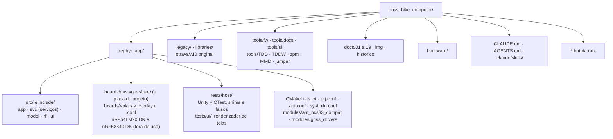
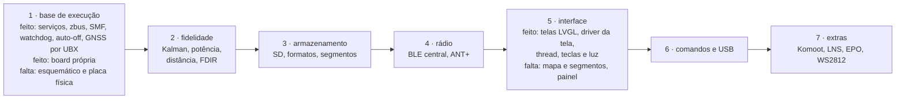

# CLAUDE.md · GNSS Bike Computer

Contexto e regras para assistentes de IA que trabalham neste repositório. Leia inteiro antes de mexer em qualquer coisa. As skills em [`.claude/skills/`](.claude/skills/) trazem os procedimentos passo a passo; a documentação técnica está em [`docs/`](docs/README.md).

## 1. Missão

Portar para **Zephyr / nRF Connect SDK** o **stravaV10**, computador de bordo GPS para ciclismo de Vincent Gollé, que roda na placa **myStravaB V3** (nRF52840 no módulo BMD-340, GNSS M10578-A3, LCD Sharp LS027 em retrato, BME280, FXOS8700, STC3100, microSD, ANT+ e BLE).

| Parte | Pasta | Papel |
|---|---|---|
| Port Zephyr | `zephyr_app/` | o firmware ativo, em C puro sobre NCS v3.3.0 |
| Original | `legacy/` | nRF5 SDK 16 + S340, C/C++: **especificação de comportamento**, só leitura |
| Bibliotecas do original | `libraries/` | Adafruit GFX, TinyGPS++, Kalman, SEGGER, etc.: só leitura |
| Ferramentas | `tools/` | `fw/`, `docs/` e `ui/` são do projeto; `TDD/`, `TDDW/`, `zpm/`, `MMD/`, `jumper/` vêm do legacy |
| Placa | `hardware/` | Eagle da V3 (os Gerbers da pasta são da **V2**) |

O dono do projeto é um desenvolvedor brasileiro de eletrônica embarcada que quer investigação completa, código nativo e verificação de verdade, não atalhos.

## 2. Regras que não se discutem

### Comunicação

- **Responda sempre em português do Brasil.** Código, identificadores e comentários de código ficam em inglês.
- Não afirme nada sem verificar. O que não foi testado na placa é dito como "não testado na placa".
- Em tarefas longas, mande um status curto de vez em quando.

### Firmware

- **O legacy é a referência.** Antes de portar ou mudar um comportamento, leia o original e cite `legacy/<arquivo>:<linha>`. Toda diferença de constante ou fórmula é corrigida ou registrada em `docs/06-algoritmos.md` e `docs/10-status-do-port.md`.
- **Nunca altere `legacy/`, `libraries/` nem `hardware/`** (a exceção é o `legacy/README.md`).
- **Zephyr nativo:** devicetree, Kconfig, drivers e subsistemas do Zephyr/NCS. Nada de Arduino nem de bibliotecas do legacy compiladas no port.
- **ISR não processa:** só copia dados para um buffer e acorda uma thread. Nada de mutex, arquivo, `snprintf` com float ou trigonometria em ISR.
- **Sem alocação dinâmica depois do boot**; buffers estáticos dimensionados e documentados.
- **Pilha medida:** thread nova ou cadeia pesada nova passa por `CONFIG_STACK_USAGE` (skill `fw-threads`) com pelo menos 1 KB de folga.
- **Verificação antes de dizer que terminou:** build sem aviso (com `ANT=1`, só o do símbolo obsoleto), testes de host, cppcheck nos arquivos tocados e, se mexeu em docs, `tools/docs/*.py`.

### Commits

- **Commit de cada item assim que ele estiver pronto e verificado** (regra do dono para este projeto, confirmada em 2026-09-18). Push só com pedido do dono, para o `origin` ([`Guiimartinho/gnss-bike-computer`](https://github.com/Guiimartinho/gnss-bike-computer), **público**). Mensagens em **inglês**, Conventional Commits com escopo (`fix(hal): ...`, `feat(model): ...`, `docs(docs): ...`).
- **Branches:** o trabalho vai na `develop`; a `main` guarda as versões estáveis e só recebe merge da `develop` quando o dono pedir. Não existe `master`. O histórico antigo do GitHub (stravaV11 de 2025-11, 817 commits, sem ligação com o atual) fica no ramo `archive/stravav11-2025-11`: não apague nem reescreva.
- **Nunca atribua commit a IA:** sem `Co-Authored-By` de assistente, sem "Generated with", sem menção a Claude. O autor é a identidade git configurada (Luiz Guilherme Ito). Procedimento na skill `commit-gnss`.
- Nunca faça commit de credenciais nem de arquivos gerados (`build*/`, `Lib/`, `Scripts/`).
- Nunca faça commit de material do ANT+ (perfis de dispositivo, ferramentas, código sob a ANT+ Shared Source License, chave de rede): o ANT+ Adopter Agreement proíbe distribuir, e o repositório é público ([07](docs/07-radio-ant-ble.md#decisão-ant-e-ble)).

### Documentação

- Português do Brasil, direto, voz ativa; **diagramas sempre em Mermaid**, nunca em texto puro; README no padrão industrial. Skill `docs-gnss`.
- Quando o comportamento muda, a documentação e o `CHANGELOG.md` mudam junto.

### Ambiente

- **Nunca use WSL**, máquinas virtuais nem Docker local.
- Não instale pacotes na máquina do dono sem perguntar (downloads de dependência de build, como o Unity via FetchContent, são aceitos).
- **CI desligado:** `.github/workflows/ci.yml` só roda à mão (`workflow_dispatch`), para não gastar minutos do GitHub Actions. Não acrescente gatilhos (push, pull request, agendamento) nem outros workflows sem o dono pedir. A verificação é local.

## 3. Mapa do repositório

## 4. Comandos essenciais

| Tarefa | Comando (Git Bash, na raiz) |
|---|---|
| Build incremental / do zero (nRF54LM20 DK, o alvo) | `bash tools/fw/fw.sh build` / `bash tools/fw/fw.sh build pristine` |
| Build para a placa própria | `BOARD=gnssbike/nrf54lm20a/cpuapp BUILD_DIR=zephyr_app/build_custom bash tools/fw/fw.sh build` |
| Conferir o mapa de pinos da placa própria | `python tools/fw/board_check.py` |
| Build para o nRF52840 DK (não é mais usado) | `BOARD=nrf52840dk/nrf52840 bash tools/fw/fw.sh build` |
| Build com ANT (add-on em `C:\ncs\sdk-ant`) | `ANT=1 bash tools/fw/fw.sh build pristine` |
| Gravar no DK (apaga tudo / mantém settings) | `bash tools/fw/fw.sh flash` / `bash tools/fw/fw.sh flash keep` |
| Desbloquear chip | `bash tools/fw/fw.sh recover` |
| Placas conectadas | `bash tools/fw/fw.sh devices` |
| Memória e maiores símbolos | `bash tools/fw/fw.sh size` |
| Testes de host | `bash tools/fw/host_tests.sh` (53 conjuntos, 714 casos) |
| Telas da interface no PC (LVGL) | `python tools/ui/render_screens.py` (44 quadros, 2 temas cada, gera `docs/img/telas-lvgl/` e `docs/telas/`) |
| Converter um percurso do Strava para o formato do projeto | `python tools/route_convert.py entrada.gpx saida.RTE` (e `--selftest`) |
| Diagramas e links da documentação | `python tools/docs/mermaid_check.py` e `python tools/docs/links_check.py` |
| Ambiente do NCS no shell | `source tools/fw/ncs_env.sh` |

Equivalentes no `cmd`: `build.bat [pristine]`, `flash.bat [keep]`, `recover.bat`, `serial.bat COMx`. Variáveis: `BUILD_DIR`, `NRF_SERIAL`, `NCS_VERSION`, `NCS_TOOLCHAIN`, `NOPAUSE`.

Referência de 2026-09-22, com a interface, a energia, o GNSS, os segmentos, a atualização por BLE, o USB, o percurso pelo telefone (RTE, GPX e o texto do legacy), o perfil, as voltas e o arquivo FIT: nRF54LM20 DK FLASH 636.144 B de 921.456 B do slot (69,04 %), RAM 393.080 B (75,12 %); placa própria FLASH 636.360 B (69,06 %), RAM 369.120 B (70,54 %), mais o MCUboot com 45.676 B de FLASH e 22.880 B de RAM no DK e 45.880 B e 22.888 B na placa; **0 avisos de compilador** (o CMake dá quatro, todos esperados: ver as armadilhas).

## 5. Estado e próximos passos

- **Port:** compila no NCS v3.3.0 e passa nos testes de host; **nunca rodou em placa nem no DK**. Matriz completa em [`docs/10-status-do-port.md`](docs/10-status-do-port.md).
- **Feito em 2026-09-18:** revisão completa do legacy e do port (7 análises), build com sysbuild, scripts novos, testes de host, documentação, e 13 correções críticas: pilha da `main_loop` (4 KB), GPS fora da ISR (ring buffer + processamento na thread), um callback de fix por época, checksum NMEA, parser NMEA, estouro do `sd_logger`, botões, polaridades do GPS e do FXOS, nós do DK desligados, reset em erro fatal, símbolo do SoC. Depois, da fase 1: a `main_loop` como única escritora do modelo, com `model_lock()` para a tela; `task_wdt` com um canal de 4 s por thread; auto-off de 15 min e desligamento pelo STC3100 (`power_scheduler`).
- **Feito em 2026-09-19:** a base da arquitetura nova ([`docs/05`](docs/05-arquitetura-zephyr.md)): oito serviços com thread e caixa de entrada, eventos no zbus, máquinas de sistema e de modo no SMF, watchdog por serviço, hardware pelas APIs do Zephyr por aliases do devicetree; saíram o HAL próprio, os drivers da V3, a interface em paisagem e a USB antiga. E a interface da placa nova em LVGL (`src/ui`, `include/ui`): as telas em retrato, nos temas de 8 cores e preto e branco, com os arranjos e formatos do legacy, testadas no PC pelo renderizador de host (`tests/ui`). Depois, a interface no firmware: driver próprio da tela em `zephyr_app/modules/gnss_drivers` (JDI LPM027M128B/C e Sharp LS027B7DH01, retrato, só as linhas que mudaram), thread `ui` com o LVGL (6 KB de pilha), teclas por `zephyr,input-longpress`, máquina da luz; nada visto num painel. E o medidor MAX17262 por driver próprio (`adi,max17262`, API de fuel gauge), com bateria fraca e crítica no serviço de energia, o nPM1300 (trilhos travados, limite do VBUS pela fonte USB-C, eventos, máquina de carga) e o AEM10900 por driver próprio (`e-peas,aem10900`, API de carregadores; a potência em mW espera o fator da e-peas). E o GNSS: driver próprio do u-blox por UBX (`modem_ubx` sobre a UART, configuração por `CFG-VALSET` nas camadas RAM e BBR, `UBX-NAV-PVT` e `UBX-NAV-SAT` a 1 Hz, standby por `UBX-RXM-PMREQ` e reinício por silêncio) com a máquina de energia do receptor em `gnss_power.c`; não testado com nenhum desses componentes.
- **Feito em 2026-09-20:** oito itens, todos verificados no build e nos testes, nenhum em placa.
  1. **Segmentos** de ponta a ponta: pool de 3 × 256 pontos com decimação, janela do histórico que anda, alocador a cada época no serviço do modelo, constantes do legacy.
  2. **Atualização por BLE**: MCUboot pelo sysbuild e mcumgr SMP, só no alvo nRF54LM20A, com recusa em atividade ou bateria fraca, tela de progresso e confirmação da imagem; ainda com a chave de desenvolvimento do MCUboot ([07](docs/07-radio-ant-ble.md#atualização-por-ble-dfu)).
  3. **BLE central**: o rádio passou a anunciar e varrer (nada começava), a inscrição GATT ganhou `disc_params` e `end_handle` (escrevia em ponteiro nulo) e a referência de conexão é liberada (o pool esgotava).
  4. **Percursos**: formato do legacy (`lat lon [alt]`, CRLF, metadados), `.PAR` aceito, saída do estado fora do percurso e carga do percurso escolhido na tela.
  5. **Mapa e segmentos na tela**: projeção pura em `map_project.c`, zoom do legacy em cinco passos e barra de escala.
  6. **Comandos do legacy** pelo NUS, com os destrutivos recusados pelo rádio.
  7. **Memória soldada** no lugar do cartão na placa nova (decisão do dono): FatFs sobre `zephyr,flash-disk`, com `/SD:` de sempre.
  8. **USB**: serviço novo com porta serial dos comandos e o disco do ciclista no PC no modo USB.
- **Em aberto da fase 6:** o teste com cabo (o `$QRY` foi respondido em 2026-09-22).
- **Ordem proposta do que falta:**

- **Decidido em 2026-09-20:** o GNSS passa a ser o **u-blox MAX-F10S**, de banda dupla L1 + L5 (1 m de CEP contra 1,5 m), no mesmo encapsulamento MAX e com o mesmo driver UBX do MAX-M10N-10B, que fica como alternativa econômica no mesmo footprint. Custa autonomia: o aparelho vai de cerca de 21 mW para cerca de 58 mW e de cerca de 310 h para cerca de 115 h sem sol, e o painel solar deixa de cobrir o consumo. O F10S **não tem modo econômico** (a firmware do F10 não tem o grupo `CFG-PM`), não faz banda única e é ROM, sem o AssistNow Live Orbits. Detalhes em [`docs/15`](docs/15-avaliacao-componentes.md#escolha-max-f10s).
- **Decidido em 2026-09-19:** a tela é o **JDI LPM027M128B** (AliExpress; peças do AliExpress têm preferência), com a Sharp LS027B7DH01A de reserva; a lista de compras não muda.
- **Decidido em 2026-09-18:** ANT+ **e** BLE (os equipamentos externos são ANT+), pelo add-on `sdk-ant` v2.1.1 **sobre o NCS v3.3.0** (obrigatório; build com `ANT=1`); **board própria** com o **nRF54LM20A** e esquemático próprio (GNSS, bateria e display melhores, painel solar pequeno na caixa); tela retangular no formato do legacy (2,7", em retrato); CI desligado; um commit por item verificado, na `develop`. Detalhes em [`docs/10-status-do-port.md`](docs/10-status-do-port.md#decisões-do-dono).
- **Em aberto:** aprovação dos componentes da placa nova (proposta em [`docs/13-placa-nova.md`](docs/13-placa-nova.md), especificação em [`docs/14-hardware-placa-nova.md`](docs/14-hardware-placa-nova.md), avaliação em [`docs/15-avaliacao-componentes.md`](docs/15-avaliacao-componentes.md) e lista de compras validada em [`docs/19-lista-de-compras.md`](docs/19-lista-de-compras.md): carga dupla com o USB bloqueando o solar, e o isolamento entre as antenas do GNSS e do rádio, a confirmar na bancada), hardware de teste (nRF54LM20 DK e placas de avaliação), formatos no SD, licença do port (o legacy é CC BY-NC 4.0).

## 6. Armadilhas conhecidas

| Armadilha | Como evitar |
|---|---|
| `ValueError: path is on mount 'F:', start on mount 'C:'` no `west` | rode o `west` de dentro do `zephyr_app` (os scripts fazem isso); o NCS está em `C:` e o projeto em `F:` |
| `TOOLCHAIN_ROOT` definido quebra o CMake do Zephyr (`.../cmake/toolchain/zephyr/generic.cmake` não encontrado) | nunca exporte esse nome; os scripts usam `NCS_TOOLCHAIN_DIR` |
| No Windows, `Scripts/` (o que um `pip install` sem venv cria na raiz) e `scripts/` são a mesma pasta | ferramentas do projeto ficam em `tools/fw/` e `tools/docs/`; nunca rode `pip install` na raiz sem venv |
| O `sdk-ant` v2.1.1 é feito para o sdk-nrf v3.2.4 e testa `SOC_SERIES_NRF52X` e `SOC_SERIES_NRF54LX`, que o NCS v3.3.0 não liga mais | compile com `ANT=1` pelos scripts: `zephyr_app/modules/ant_ncs33_compat` religa os símbolos; o aviso "Deprecated symbol ... is enabled" é esperado |
| O `sdk-ant` já define `ant_stack_init()` e outras funções `ant_*` | código do port usa nomes fora desse prefixo (`rf_ant_init()`) |
| A camada de comandos do Git Bash transforma `\\n` em quebra de linha real | para caminhos com `\` (arquivos `.bat`), use a ferramenta de edição, não `sed` com `\\` |
| As ferramentas de escrita gravam LF | depois de editar um `.bat`, volte para CRLF: `sed -i 's/\r$//; s/$/\r/' arquivo.bat` |
| `modem_ubx` compara todo quadro recebido com o filtro do script em curso sem conferir se existe um | o driver do F10 e do M10 aponta `ubx.inst.script` para o seu script, com o filtro zerado, logo depois do `modem_ubx_init()`; sem isso, um receptor já configurado na BBR responde antes do primeiro script e o ponteiro é nulo |
| Configuração do receptor só na camada RAM se perde | o standby por software apaga a RAM do receptor, inclusive a configuração (manual de integração do M10, 3.7.4.2): o driver grava em RAM **e** BBR |
| O MAX-F10S não tem o grupo `CFG-PM`: não existe LEAP nem economia de rastreio | escrever `CFG-PM-OPERATEMODE` nele dá NAK; o driver devolve `-ENOTSUP` e a máquina de `gnss_power.c` recebe `has_leap = false` ([15](docs/15-avaliacao-componentes.md#firmware)) |
| Toda escrita em `CFG-SIGNAL` reinicia o subsistema GNSS | mande as chaves num `UBX-CFG-VALSET` só (`ubx_m10_valset_many()`) e espere 0,5 s depois do reconhecimento (UBX-23002975 R02, 4.9.20) |
| Esperar resposta do receptor dentro do workqueue do modem trava | a resposta chega num item de trabalho do mesmo workqueue: quem manda comando e espera é a thread `gnss` |
| O overlay entra pelo nome da placa | `boards/<placa>.overlay`, com `/` trocado por `_` (`nrf52840dk_nrf52840.overlay`); com outro nome ele é ignorado sem aviso |
| No nRF54LM20A, o SCL do TWIM e o SCK do SPIM precisam de pino de clock (tabela 79), e P1.01 e P1.02 saem do reset como antena NFC, sem GPIO | pinos de clock e pads do NFC na skill `fw-hardware` e em [14](docs/14-hardware-placa-nova.md#alocação-de-pinos); no DK, o I2C dos sensores usa SDA P1.29 e SCL P1.03, e o de energia, SDA P1.11 e SCL P1.14 |
| Desligar um nó do DK não desliga os filhos | o `mx25r64` precisa de `status = "disabled"` próprio, senão o driver `qspi-nor` volta |
| Build incremental guarda símbolos Kconfig que saíram (`NRFX_QSPI=y` continuou depois de desligar o QSPI) | afirmações sobre `.config`, devicetree ou tamanho só com `bash tools/fw/fw.sh build pristine` |
| Caminho de build longo (pasta temporária do usuário) passa do limite de 250 caracteres dos objetos | compile dentro do repositório: `zephyr_app/build` ou uma pasta `build/` da raiz |
| `--no-sysbuild` e o Partition Manager estão depreciados no NCS 3.3 | sysbuild com `zephyr_app/sysbuild.conf` (`SB_CONFIG_PARTITION_MANAGER=n`) |
| `JLink.exe` do PATH é a ferramenta do Java | use o da SEGGER em `C:\Program Files\SEGGER\JLink_V924a\` |
| ST-LINK e outras seriais conectadas nesta máquina | os scripts usam `--traits jlink`; com vários J-Link, `NRF_SERIAL` |
| Console no `uart0` (P0.06/P0.08) | só existe no DK; na placa real esses pinos não têm ligação |
| Breakpoint longo com o `task_wdt` ligado | a placa reinicia ao continuar (o timer do kernel não pausa); para depurar passo a passo, compile com `-DCONFIG_TASK_WDT=n` |
| O WDT do nRF52 continua contando depois de um reset por software (`sys_reboot`, erro fatal) | o `main()` o alimenta até os serviços criarem os canais (`app_wdt_feed_if_running()`); inicialização nova e demorada precisa alimentá-lo também |
| cppcheck acusa `syntaxError` nos `ble_*.c` ou nos `#if DT_...` dos serviços | macros do Zephyr sem os headers: falso positivo nos `ble_*.c`; nos serviços, passe `"-DDT_NODE_HAS_STATUS(n,s)=1" "-DDT_ALIAS(a)=a"` |
| Script (Python, `cmd`) chama `bash` | no Windows isso abre o `bash.exe` do `System32`, o lançador do **WSL**, que o projeto proíbe; chame as ferramentas direto (`cmake`, `ctest`) ou o Git Bash pelo caminho completo, e confira o código de saída |
| clangd do editor reclama dos testes de host ou da interface | ele usa o `compile_commands.json` do firmware; `tests/host/.clangd` aponta para o dos testes depois do primeiro `host_tests.sh`, e `tests/ui/.clangd` e `src/ui/.clangd` para `build/ui` depois do primeiro `render_screens.py` |
| O LVGL 9.5 não desliga a suavização das primitivas | `lv_display_set_antialiasing()` só vale para camadas e imagens; círculos, linhas inclinadas e cantos saem suavizados, e o driver quantiza para as cores do painel ([18](docs/18-interface-telas.md#implementação)) |
| Num `choice` do Kconfig o **primeiro** `default` que se aplica ganha | para trocar o padrão de um `choice` do Zephyr, escreva o seu `default` **antes** do `source` (foi assim que o MCUboot entrou no `zephyr_app/Kconfig.sysbuild`) |
| `CONFIG_LV_Z_BITS_PER_PIXEL` fica em 32 qualquer que seja a cor (o primeiro `default` do Kconfig do Zephyr ganha) | `CONFIG_LV_Z_BITS_PER_PIXEL=16` no `prj.conf`; sem ele o buffer de desenho do LVGL dobra (38.400 B) |
| Pilha da thread `ui` | o desenho do LVGL é recursivo, 624 B por nível da árvore de objetos; objeto aninhado a mais ou o log do LVGL ligado pedem nova medição com `CONFIG_STACK_USAGE` |
| O LPM027M128B quer os sinais no nível do VDD dele (3,0 V; alto acima de VDD − 0,1 V) | confira a tensão de I/O do DK antes de ligar o painel; se não for 3,0 V, tradutor de nível |
| `Path.write_text()` do Python grava CRLF no Windows | passe `newline="\n"`; o `.gitattributes` normaliza no commit, mas a cópia de trabalho fica misturada |
| Testes de host no mesmo shell do `ncs_env.sh` | o ambiente do NCS troca o `cmake`; use um shell limpo |
| Mermaid: `;` numa mensagem de `sequenceDiagram` | é separador de comandos; escreva "e" |
| Gerbers em `hardware/myStravaB_V3_2018-12-12/` | são da V2; não fabrique a V3 com eles |
| Shunt do STC3100 | esquema: 20 mΩ; código: 100 mΩ; confirme na placa antes de confiar em corrente e carga |
| `git push` já foi bloqueado pelo classificador do auto mode; em 2026-09-22 passou a funcionar | tente o push quando o dono pedir, com o ramo explícito (`git push origin develop`); se voltar a ser recusado, peça a ele que rode no prompt, no modo bash, um comando por vez (`! git push origin develop`). Nunca crie regra de permissão para você, nunca use `--force` |
| A `main` do GitHub pode ter merge de pull request feito pela interface, que a `main` local não tem, e o push é recusado como non-fast-forward | `git fetch origin` e confira com `git log --oneline --no-merges origin/main --not main`: se não sair nada, o commit remoto não traz conteúdo novo e um `git merge origin/main` junta as histórias sem mexer em arquivo nenhum (compare `main^{tree}` antes e depois). Nunca resolva com `--force` |
| O CMake dá quatro avisos em todo build, e eles não são regressão | três são `No SOURCES given to Zephyr library: drivers__charger`, `drivers__display` e `drivers__fuel_gauge`: os drivers dessas classes são do projeto e moram em `zephyr_app/modules/gnss_drivers`, então a biblioteca da árvore do Zephyr fica vazia e é excluída. O quarto é a chave de desenvolvimento do MCUboot. **Aviso de compilador é que tem de ser zero** |
| `legacy/` não compila aqui | faltam o nRF5 SDK 16, o S340 e os submódulos `libraries/ant_profiles` e `ble_services` |

## 7. Skills do projeto

| Skill | Use para |
|---|---|
| `fw-build` | ambiente, build, gravação, console, memória, erros de build |
| `fw-testes` | testes de host, oráculo do legacy, mutação, cppcheck |
| `fw-threads` | threads, ISR, pilhas, prioridades, concorrência |
| `fw-port-legacy` | portar um módulo do legacy com fidelidade |
| `fw-hardware` | placa, pinagem, devicetree, overlay, alimentação |
| `fw-gps-sensores` | GPS MTK/NMEA/PMTK/EPO, BME280, FXOS8700, STC3100, FRAM |
| `fw-radio` | BLE central e periférico, clientes de sensores, ANT+, stravaAP, Komoot |
| `fw-vue` | LCD LS027, interface LVGL da placa nova, telas, menus, botões, notificações |
| `docs-gnss` | escrever e validar documentação |
| `commit-gnss` | preparar e fazer commits |

## 8. Onde está cada coisa

| Assunto | Documento |
|---|---|
| Visão geral e início rápido | [README.md](README.md), [docs/01-visao-geral.md](docs/01-visao-geral.md) |
| Placa e pinagem | [docs/02-hardware.md](docs/02-hardware.md) |
| Proposta da placa nova | [docs/13-placa-nova.md](docs/13-placa-nova.md) |
| Especificação de hardware da placa nova | [docs/14-hardware-placa-nova.md](docs/14-hardware-placa-nova.md) |
| Avaliação dos componentes da placa nova | [docs/15-avaliacao-componentes.md](docs/15-avaliacao-componentes.md) |
| Arquitetura do firmware e máquinas de estado da placa nova | [docs/16-arquitetura-firmware.md](docs/16-arquitetura-firmware.md) |
| Dispositivos BLE e ANT+ | [docs/17-dispositivos-ble-ant.md](docs/17-dispositivos-ble-ant.md) |
| Interface e telas da placa nova | [docs/18-interface-telas.md](docs/18-interface-telas.md) |
| Os 44 quadros da interface, um a um | [docs/telas/README.md](docs/telas/README.md) |
| Lista de compras da placa nova | [docs/19-lista-de-compras.md](docs/19-lista-de-compras.md) |
| Build e ambiente | [docs/03-ambiente-build.md](docs/03-ambiente-build.md) |
| Legacy | [docs/04-arquitetura-legacy.md](docs/04-arquitetura-legacy.md), [legacy/README.md](legacy/README.md) |
| Port | [docs/05-arquitetura-zephyr.md](docs/05-arquitetura-zephyr.md) |
| Algoritmos | [docs/06-algoritmos.md](docs/06-algoritmos.md) |
| Rádio, interface, armazenamento | [docs/07](docs/07-radio-ant-ble.md), [docs/08](docs/08-interface.md), [docs/09](docs/09-armazenamento-usb.md) |
| Status, defeitos e roteiro | [docs/10-status-do-port.md](docs/10-status-do-port.md) |
| Qualidade e testes | [docs/11-qualidade-misra.md](docs/11-qualidade-misra.md), [docs/12-ferramentas-testes.md](docs/12-ferramentas-testes.md) |
| Histórico de mudanças | [CHANGELOG.md](CHANGELOG.md) |
