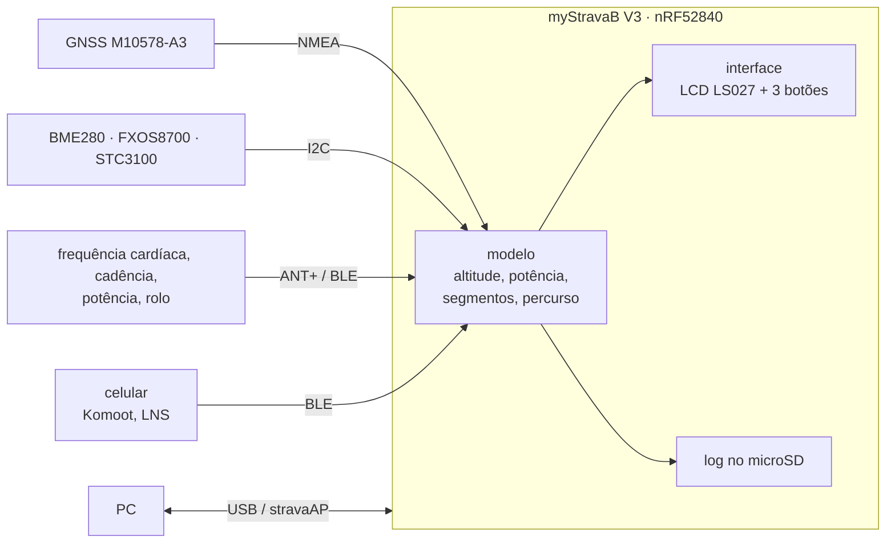
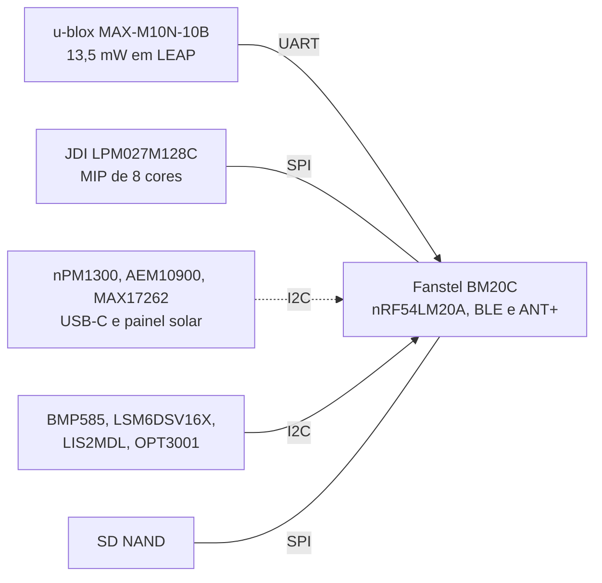
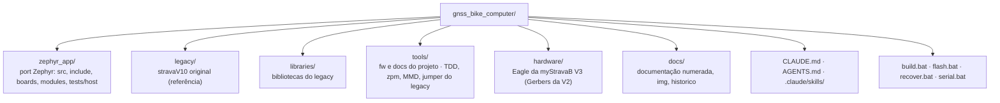

<div align="center">

# GNSS Bike Computer

**Computador de bordo para ciclismo com GPS: segmentos do Strava em tempo real, percursos, altimetria por fusão de sensores e sensores sem fio. Portado do stravaV10 para Zephyr, do nRF52840 da myStravaB V3 para o nRF54LM20A de uma placa própria com painel solar.**


</div>

O projeto leva para o nRF Connect SDK o **stravaV10**, firmware aberto de Vincent Gollé para a placa **myStravaB V3**: um aparelho em retrato com LCD de memória Sharp, GNSS MediaTek, barômetro, acelerômetro, medidor de bateria, microSD e rádio BLE + ANT+. O código original fica em [`legacy/`](legacy/) como referência de comportamento; o port em C puro sobre Zephyr fica em [`zephyr_app/`](zephyr_app/) e compila para o nRF52840-DK e para o nRF54LM20 DK. A próxima placa é própria, com o nRF54LM20A, tela colorida e painéis solares na caixa; a especificação e a avaliação dos componentes estão em [`docs/`](docs/README.md).

> [!WARNING]
> O port **compila e passa nos testes de host, mas nunca rodou em placa nem nos DKs**. Segmentos, percursos, sensores BLE e ANT+, log no SD e a interface do legacy ainda não funcionam de ponta a ponta. A placa nova ainda não existe: nenhum componente foi comprado nem medido. O estado de cada área está em [docs/10-status-do-port.md](docs/10-status-do-port.md).

## Índice

- [Visão geral](#visão-geral)
- [Placa nova](#placa-nova)
- [Funcionalidades](#funcionalidades)
- [Início rápido](#início-rápido)
- [Estrutura](#estrutura)
- [Documentação](#documentação)
- [Estado e próximos passos](#estado-e-próximos-passos)
- [Créditos e licenças](#créditos-e-licenças)

## Visão geral



## Placa nova


Conceito em escala, a partir da caixa da V3: 62 × 104 × 19 mm, PCB de 55 × 97 mm em 4 camadas, 6 módulos solares na frente inclinada e nos chanfros laterais. A escolha de cada componente, com os números dos datasheets, está em [docs/15-avaliacao-componentes.md](docs/15-avaliacao-componentes.md).



| Bloco | Escolha | Por quê |
|---|---|---|
| Carga | nPM1300 no USB-C, AEM10900 no painel, MAX17262 na célula | o painel carrega com o aparelho desligado e corte térmico próprio; o USB bloqueia a carga solar no hardware |
| GNSS | u-blox MAX-M10N-10B, com o MAX-F10S (L1 + L5) no mesmo footprint | o aparelho gasta cerca de 21 mW contra 58 mW com o F10S: cerca de 320 h sem sol, e o painel cobre o consumo num pedal de sol (estimativa) |
| Tela | JDI LPM027M128C, com o Sharp LS027B7DH01 previsto no mesmo conector | cor e 30 µW a 1 quadro/s; o Sharp cobre o risco de compra do JDI |
| USB e armazenamento | USB-C IPX8 e SD NAND soldado | caixa sem tampas e sem cartão solto na vibração |

## Funcionalidades

| Funcionalidade | Legacy | Port |
|---|---|---|
| Segmentos do Strava com avanço contra o recorde | sim | lógica portada, sem carga de dados |
| Percurso com mapa e zoom | sim | parcial, não ligado |
| Altitude por Kalman de 3 estados, subida, inclinação | sim | portado com diferenças |
| Potência estimada | sim | fórmula diferente |
| Sensores ANT+ (FC, velocidade e cadência, rolo FE-C) | sim | a pilha do add-on `sdk-ant` compila com o NCS v3.3.0 (`ANT=1`); perfis na fase 4 |
| BLE (potência, posição do celular, Komoot) | sim | parcial |
| Zonas de potência, suffer score, variabilidade da FC | sim | portados e testados, sem dados reais |
| Log no microSD e download pelo PC | sim | log em stub |
| USB serial e mass storage | sim | fora do build |

## Início rápido

**Pré-requisitos** (Windows): nRF Connect SDK v3.3.0 em `C:\ncs` com o toolchain `936afb6332`, SEGGER J-Link, nRF52840-DK ou nRF54LM20 DK. Para o ANT, o add-on `sdk-ant` em `C:\ncs\sdk-ant`, depois de aceitar o acordo ANT+ ([07](docs/07-radio-ant-ble.md#ant-no-ncs-v330)). Para os testes de host: MinGW-w64 GCC, CMake e Ninja. Detalhes em [docs/03-ambiente-build.md](docs/03-ambiente-build.md).

Código: [github.com/Guiimartinho/gnss-bike-computer](https://github.com/Guiimartinho/gnss-bike-computer) (`git clone https://github.com/Guiimartinho/gnss-bike-computer.git`).

```sh
# Git Bash, na raiz do repositório
bash tools/fw/fw.sh build          # compila o zephyr_app (sysbuild) para o nRF52840-DK
bash tools/fw/fw.sh flash          # grava no DK pelo J-Link
BOARD=nrf54lm20dk/nrf54lm20a/cpuapp BUILD_DIR=zephyr_app/build_54 bash tools/fw/fw.sh build
ANT=1 bash tools/fw/fw.sh build pristine   # com a pilha ANT do sdk-ant
bash tools/fw/host_tests.sh        # 7 conjuntos de testes de host
python tools/docs/mermaid_check.py # valida os diagramas da documentação
```

No `cmd` ou com duplo clique: `build.bat`, `flash.bat`, `recover.bat`, `serial.bat COMx`.

O CI (`.github/workflows/ci.yml`) está **desligado**: só roda à mão, pela aba Actions do GitHub ([detalhes](docs/03-ambiente-build.md#ci)).

## Estrutura



## Documentação

| Documento | Assunto |
|---|---|
| [01 · Visão geral](docs/01-visao-geral.md) | produto, modos, legacy e port |
| [02 · Hardware](docs/02-hardware.md) | placa, pinagem, alimentação, alvo no DK |
| [03 · Ambiente e build](docs/03-ambiente-build.md) | NCS v3.3.0, scripts, gravação, problemas conhecidos |
| [04 · Arquitetura do legacy](docs/04-arquitetura-legacy.md) | tasks, modos, glossário |
| [05 · Arquitetura do port](docs/05-arquitetura-zephyr.md) | threads, fluxo de dados, pilhas, devicetree |
| [06 · Algoritmos](docs/06-algoritmos.md) | fórmulas e constantes, legacy × port |
| [07 · Rádio](docs/07-radio-ant-ble.md) | ANT+, BLE, stravaAP, Komoot |
| [08 · Interface](docs/08-interface.md) | telas, menus, botões |
| [09 · Armazenamento e USB](docs/09-armazenamento-usb.md) | formatos de arquivo, SD, USB |
| [10 · Status do port](docs/10-status-do-port.md) | matriz, correções, defeitos, roteiro, decisões |
| [11 · Qualidade e MISRA](docs/11-qualidade-misra.md) | regras e análise estática |
| [12 · Ferramentas e testes](docs/12-ferramentas-testes.md) | testes de host, simulador do legacy, licenças |
| [13 · Placa nova](docs/13-placa-nova.md) | proposta de hardware da placa própria |
| [14 · Hardware da placa nova](docs/14-hardware-placa-nova.md) | especificação técnica: alimentação, lista de materiais, pinos, PCB |
| [15 · Avaliação dos componentes](docs/15-avaliacao-componentes.md) | escolha de cada componente da placa nova, com números de datasheet |
| [16 · Arquitetura do firmware](docs/16-arquitetura-firmware.md) | arquitetura-alvo e máquinas de estado para a placa nova |
| [17 · Dispositivos BLE e ANT+](docs/17-dispositivos-ble-ant.md) | catálogo de sensores e acessórios, prioridades e limites do rádio |
| [CHANGELOG](CHANGELOG.md) | histórico de mudanças |

## Estado e próximos passos

- **Feito em 2026-09-18:** build no NCS v3.3.0 com sysbuild; correção de 13 defeitos críticos (estouro de pilha no Kalman, GPS e modelo dentro de ISR, corrupção de memória no log, botões e pinos do GPS invertidos, conflitos de pinos com o DK); testes de host; documentação e contexto para assistentes de IA.
- **Fase 1 do roteiro:** a `main_loop` é a única escritora do modelo e a tela lê com trava, watchdog por thread e desligamento automático pelo STC3100 depois de 15 min parado.
- **Novos alvos e rádio:** o port compila para o nRF54LM20 DK, e a pilha ANT do add-on `sdk-ant` v2.1.1 compila sobre o NCS v3.3.0 nos dois DKs (`ANT=1`); nada disso foi testado em placa.
- **Placa nova:** desenho do aparelho, especificação ([14](docs/14-hardware-placa-nova.md)) e avaliação dos componentes ([15](docs/15-avaliacao-componentes.md)). O esquemático é do dono; antes do layout vêm os testes de bancada da carga dupla, do GNSS, da coexistência dos rádios e do display.
- **Decidido:** ANT+ e BLE juntos (os equipamentos externos falam ANT+) e placa própria com o nRF54LM20A. Decisões e pendências em [docs/10-status-do-port.md](docs/10-status-do-port.md#decisões-do-dono).
- **Próximo:** bancada e esquemático da placa nova, depois fidelidade dos algoritmos, armazenamento, rádio e interface. Roteiro em [docs/10-status-do-port.md](docs/10-status-do-port.md#roteiro).

## Créditos e licenças

- **stravaV10** e **myStravaB**: Vincent Gollé ([vincent290587/stravaV10](https://github.com/vincent290587/stravaV10)), licenciado sob **Creative Commons Atribuição-NãoComercial 4.0 (CC BY-NC 4.0)**. O port deriva desse código; ver [`legacy/README.md`](legacy/README.md).
- Bibliotecas de terceiros em `libraries/` e `tools/` mantêm suas licenças (BSD, LGPL-2.1, GPL-2.0, Nordic, SEGGER): tabela em [docs/12-ferramentas-testes.md](docs/12-ferramentas-testes.md#bibliotecas-e-licenças).
- O add-on `sdk-ant` e o material ANT+ não fazem parte do repositório: o ANT+ Adopter Agreement proíbe redistribuir ([07](docs/07-radio-ant-ble.md#decisão-ant-e-ble)).
- A licença do port ainda não foi definida.
