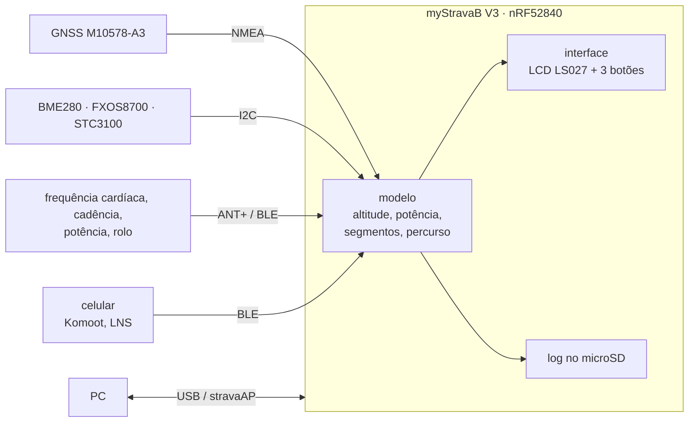
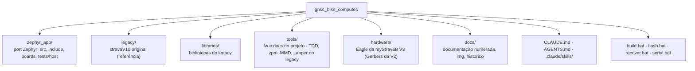

<div align="center">

# GNSS Bike Computer

**Computador de bordo para ciclismo com GPS no nRF52840: segmentos do Strava em tempo real, percursos, altimetria por fusão de sensores e sensores sem fio, portado do stravaV10 para Zephyr.**


</div>

O projeto leva para o nRF Connect SDK o **stravaV10**, firmware aberto de Vincent Gollé para a placa **myStravaB V3**: um aparelho em retrato com LCD de memória Sharp, GNSS MediaTek, barômetro, acelerômetro, medidor de bateria, microSD e rádio BLE + ANT+. O código original fica em [`legacy/`](legacy/) como referência de comportamento; o port em C puro sobre Zephyr fica em [`zephyr_app/`](zephyr_app/).

> [!WARNING]
> O port **compila e passa nos testes de host, mas nunca rodou na placa nem no nRF52840-DK**. Segmentos, percursos, sensores BLE, log no SD e a interface do legacy ainda não funcionam de ponta a ponta. O estado de cada área está em [docs/10-status-do-port.md](docs/10-status-do-port.md).

## Índice

- [Visão geral](#visão-geral)
- [Funcionalidades](#funcionalidades)
- [Início rápido](#início-rápido)
- [Estrutura](#estrutura)
- [Documentação](#documentação)
- [Estado e próximos passos](#estado-e-próximos-passos)
- [Créditos e licenças](#créditos-e-licenças)

## Visão geral



## Funcionalidades

| Funcionalidade | Legacy | Port |
|---|---|---|
| Segmentos do Strava com avanço contra o recorde | sim | lógica portada, sem carga de dados |
| Percurso com mapa e zoom | sim | parcial, não ligado |
| Altitude por Kalman de 3 estados, subida, inclinação | sim | portado com diferenças |
| Potência estimada | sim | fórmula diferente |
| Sensores ANT+ (FC, velocidade e cadência, rolo FE-C) | sim | a pilha do add-on `sdk-ant` compila com o NCS v3.3.0 (`ANT=1`); perfis na fase 4 |
| BLE (potência, posição do celular, Komoot) | sim | parcial |
| Zonas de potência, suffer score, variabilidade da FC | sim | portados e testados, sem dados reais |
| Log no microSD e download pelo PC | sim | log em stub |
| USB serial e mass storage | sim | fora do build |

## Início rápido

**Pré-requisitos** (Windows): nRF Connect SDK v3.3.0 em `C:\ncs` com o toolchain `936afb6332`, SEGGER J-Link, nRF52840-DK. Para os testes de host: MinGW-w64 GCC, CMake e Ninja. Detalhes em [docs/03-ambiente-build.md](docs/03-ambiente-build.md).

Código: [github.com/Guiimartinho/gnss-bike-computer](https://github.com/Guiimartinho/gnss-bike-computer) (`git clone https://github.com/Guiimartinho/gnss-bike-computer.git`).

```sh
# Git Bash, na raiz do repositório
bash tools/fw/fw.sh build          # compila o zephyr_app (sysbuild)
bash tools/fw/fw.sh flash          # grava no nRF52840-DK pelo J-Link
bash tools/fw/host_tests.sh        # 7 conjuntos de testes de host
python tools/docs/mermaid_check.py # valida os diagramas da documentação
```

No `cmd` ou com duplo clique: `build.bat`, `flash.bat`, `recover.bat`, `serial.bat COMx`.

O CI (`.github/workflows/ci.yml`) está **desligado**: só roda à mão, pela aba Actions do GitHub ([detalhes](docs/03-ambiente-build.md#ci)).

## Estrutura



## Documentação

| Documento | Assunto |
|---|---|
| [01 · Visão geral](docs/01-visao-geral.md) | produto, modos, legacy e port |
| [02 · Hardware](docs/02-hardware.md) | placa, pinagem, alimentação, alvo no DK |
| [03 · Ambiente e build](docs/03-ambiente-build.md) | NCS v3.3.0, scripts, gravação, problemas conhecidos |
| [04 · Arquitetura do legacy](docs/04-arquitetura-legacy.md) | tasks, modos, glossário |
| [05 · Arquitetura do port](docs/05-arquitetura-zephyr.md) | threads, fluxo de dados, pilhas, devicetree |
| [06 · Algoritmos](docs/06-algoritmos.md) | fórmulas e constantes, legacy × port |
| [07 · Rádio](docs/07-radio-ant-ble.md) | ANT+, BLE, stravaAP, Komoot |
| [08 · Interface](docs/08-interface.md) | telas, menus, botões |
| [09 · Armazenamento e USB](docs/09-armazenamento-usb.md) | formatos de arquivo, SD, USB |
| [10 · Status do port](docs/10-status-do-port.md) | matriz, correções, defeitos, roteiro, decisões |
| [11 · Qualidade e MISRA](docs/11-qualidade-misra.md) | regras e análise estática |
| [12 · Ferramentas e testes](docs/12-ferramentas-testes.md) | testes de host, simulador do legacy, licenças |
| [13 · Placa nova](docs/13-placa-nova.md) | proposta de hardware da placa própria |
| [CHANGELOG](CHANGELOG.md) | histórico de mudanças |

## Estado e próximos passos

- **Feito em 2026-09-18:** build no NCS v3.3.0 com sysbuild; correção de 13 defeitos críticos (estouro de pilha no Kalman, GPS e modelo dentro de ISR, corrupção de memória no log, botões e pinos do GPS invertidos, conflitos de pinos com o DK); testes de host; documentação e contexto para assistentes de IA.
- **Decidido:** ANT+ e BLE juntos (os equipamentos externos falam ANT+) e board própria com o nRF54LM20A e esquemático próprio: GNSS, bateria e display colorido melhores e um painel solar pequeno na caixa. Decisões e pendências em [docs/10-status-do-port.md](docs/10-status-do-port.md#decisões-do-dono).
- **Fase 1 do roteiro, 2026-09-18:** a `main_loop` é a única escritora do modelo e a tela lê com trava, watchdog por thread e desligamento automático pelo STC3100 depois de 15 min parado. Falta a board própria: o MCU está escolhido (nRF54LM20A) e o esquemático novo está em projeto.
- **Próximo:** board própria, depois fidelidade dos algoritmos, armazenamento, rádio e interface. Roteiro em [docs/10-status-do-port.md](docs/10-status-do-port.md#roteiro).

## Créditos e licenças

- **stravaV10** e **myStravaB**: Vincent Gollé ([vincent290587/stravaV10](https://github.com/vincent290587/stravaV10)), licenciado sob **Creative Commons Atribuição-NãoComercial 4.0 (CC BY-NC 4.0)**. O port deriva desse código; ver [`legacy/README.md`](legacy/README.md).
- Bibliotecas de terceiros em `libraries/` e `tools/` mantêm suas licenças (BSD, LGPL-2.1, GPL-2.0, Nordic, SEGGER): tabela em [docs/12-ferramentas-testes.md](docs/12-ferramentas-testes.md#bibliotecas-e-licenças).
- A licença do port ainda não foi definida.
