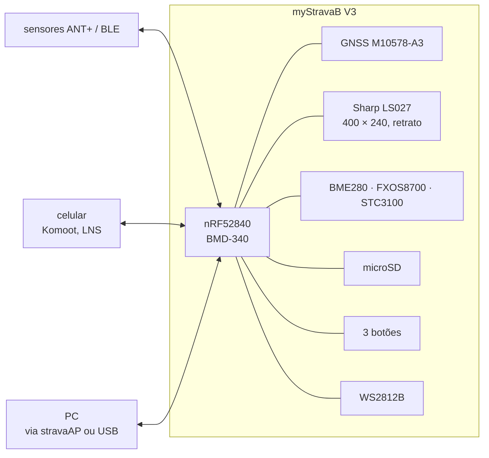
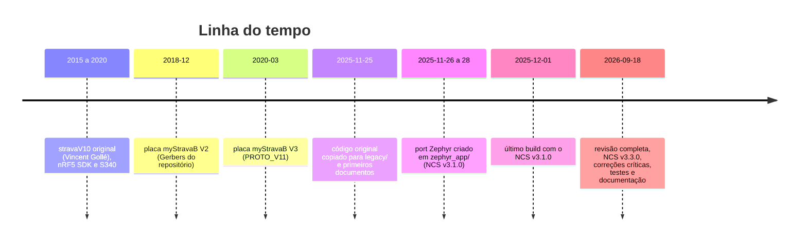

# Visão geral

O GNSS Bike Computer é um computador de bordo para ciclismo com GPS, baseado no nRF52840, que disputa segmentos do Strava em tempo real, segue percursos GPX, mede a altimetria com barômetro e acelerômetro e fala com sensores e com o celular. O projeto porta para Zephyr (nRF Connect SDK) o firmware aberto **stravaV10**, de Vincent Gollé, que roda na placa **myStravaB V3**.

**Nesta página:** [Funcionalidades](#funcionalidades) · [O aparelho](#o-aparelho) · [Modos](#modos) · [Legacy e port](#legacy-e-port) · [Onde começar](#onde-começar)

## Funcionalidades

Funcionalidades do stravaV10 original e o estado no port em 2026-09-18 (detalhes em [10-status-do-port.md](10-status-do-port.md)).

| Funcionalidade | No legacy | No port |
|---|---|---|
| Segmentos do Strava em tempo real (avanço contra o recorde, até 2 na tela, LED azul ou vermelho) | sim | lógica portada, sem carga de dados |
| Percurso GPX com mapa e zoom | sim (`.PAR`) | parcial, não ligado |
| Altitude por fusão barômetro + acelerômetro (Kalman de 3 estados), subida, inclinação | sim | portado com diferenças |
| Potência estimada pela física (peso, subida, rolamento, arrasto) | sim | fórmula diferente |
| Sensores ANT+: frequência cardíaca, velocidade e cadência, rolo FE-C | sim | trocados por BLE, não funcionais |
| BLE: medidor de potência, posição do celular (LNS), navegação Komoot | sim | parcial |
| Zonas de potência, suffer score, variabilidade da FC | sim | módulos portados, sem dados reais |
| Log da atividade no microSD e download pelo PC (stravaAP) | sim | log em stub, sem comandos |
| USB: comandos seriais e mass storage | sim | fora do build |
| Recuperação do estado depois de uma falha (FDIR) | sim | não funciona |
| Autonomia: menos de 8 mA em rolo, ~35 mA com GPS | medido pelo autor original | não medido |

## O aparelho

Componentes, pinagem e alimentação em [02-hardware.md](02-hardware.md); fotos em [`img/`](img/).

## Modos

| Modo | Para quê | GPS | Sensores |
|---|---|---|---|
| CRS | pedal ao ar livre com segmentos | ligado | barômetro, acelerômetro, FC, cadência |
| PRC | seguir um percurso | ligado | idem |
| FEC | treino no rolo | standby | rolo FE-C, FC |
| Zwift | posição simulada vinda do PC | standby | — |
| MSC | expor o cartão por USB | — | — |

No port, `boucle_set_mode()` ainda só guarda o modo; o ciclo é sempre o de CRS, com start, pause e stop pelo botão central.

## Legacy e port

| | Legacy (`legacy/`) | Port (`zephyr_app/`) |
|---|---|---|
| Base | nRF5 SDK 16.0.0 + SoftDevice S340 | nRF Connect SDK v3.3.0 (Zephyr 4.3.99) |
| Linguagem | C/C++ com Adafruit GFX e TinyGPS++ | C puro |
| Execução | task manager cooperativo | threads preemptivas |
| Rádio | ANT+ e BLE central | BLE periférico + central |
| Estado | completo, testado pelo autor, não compila aqui | compila, 40 testes de host, sem teste na placa |
| Licença | CC BY-NC 4.0 | a definir (deriva do legacy) |

## Onde começar

| Quero | Leia |
|---|---|
| compilar e gravar | [03-ambiente-build.md](03-ambiente-build.md) |
| entender o código original | [04-arquitetura-legacy.md](04-arquitetura-legacy.md) |
| entender o port | [05-arquitetura-zephyr.md](05-arquitetura-zephyr.md) |
| saber o que falta | [10-status-do-port.md](10-status-do-port.md) |
