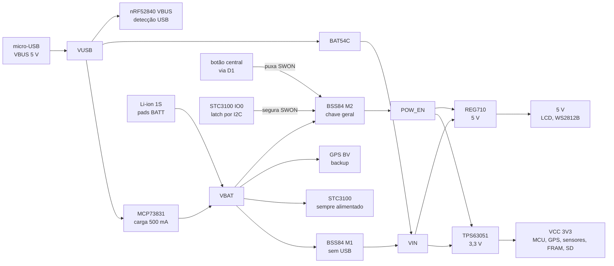

# Hardware

A placa myStravaB V3 de Vincent Gollé (`hardware/`), seus componentes, a pinagem das três revisões usadas pelo legacy, a alimentação com latch pelo STC3100 e como o port a reproduz em cima do nRF52840-DK. Os dados vêm do esquema e da placa Eagle, conferidos contra `legacy/custom_board_v3.h` e o overlay do port.

**Nesta página:** [Arquivos](#arquivos) · [Componentes](#componentes) · [Pinagem](#pinagem) · [Alimentação](#alimentação) · [Endereços I2C](#endereços-i2c) · [Alvo híbrido no DK](#alvo-híbrido-no-dk) · [Mecânica](#mecânica) · [Próxima placa](#próxima-placa) · [Riscos](#riscos)

## Arquivos

| Arquivo | Conteúdo |
|---|---|
| `hardware/myStravaB_V3.sch`, `.brd` | projeto Eagle 9.6.2 da V3: 5 folhas, 72 componentes, 2 camadas, 0,77 mm, 52,35 × 77,47 mm; esquema e placa batem em 60 de 60 nets |
| `hardware/eagle.epf` | projeto do Eagle 9.3.0 |
| `hardware/myStravaB_V3_2018-12-12/` e o `.zip` | **Gerbers da V2** (`myStravaB_V2`, 12/12/2018), não da V3: mesmo contorno, outro layout e a pinagem do `custom_board_v2.h`. **Não fabrique a V3 com eles**; gere o CAM a partir do `.brd` |

## Componentes

| Ref | Peça | Função | Interface |
|---|---|---|---|
| IC2 | Rigado BMD-340-A-R (nRF52840) | MCU, BLE e ANT+ | SWD, USB |
| U$5 | Antenova M10578-A3 (MediaTek MT3333) | GNSS GPS/GLONASS/Galileo/BeiDou | UART 9600, reset (HW_R) e standby (HW_S) ativos baixos, FIX alto com fix; PPS não ligado |
| U$4 | Antenova SR4G008 | antena GNSS em chip | — |
| U$16 | Sharp LS027B7DH01 (conector FPC) | LCD de memória 400 × 240, 5 V | SPI; EXTMODE e EXTCOMIN em GND por 10 kΩ (R13, R16), DISP no VCC por 10 kΩ e 0,1 µF (R17, C43): VCOM por software, tela sempre acesa |
| IC3 | Bosch BME280 | pressão e temperatura | I2C 0x76 |
| U1 | NXP FXOS8700CQ | acelerômetro e magnetômetro | I2C 0x1E; INT1; RST ativo alto sem resistor |
| U$6 | ST STC3100 | medidor de bateria e **latch de energia** (IO0) | I2C 0x70; shunt R15 |
| U3 | Cypress FM24CL16B | FRAM de 2 KB (configurações do legacy) | I2C 0x50 a 0x57 |
| U$2 | flash NOR SOIC-8 (provável SST26) | armazenamento das V1/V2; sem uso na V3 | QSPI em P0.18 a P0.24 |
| SD | Molex 47571-0001 | slot microSD | SPI em P0.25 a P0.28, sem card-detect |
| J1 | Molex 47571-0001 | **soquete microSD usado como porta de debug**: DAT1 = SWDIO, DAT2 = SWDCLK, DAT3 = SDA, CMD = SCL | SWD, sem reset nem SWO |
| L4 + Q2 | WS2812B + BSS138 | LED RGB e conversor de nível 3,3 → 5 V | P1.13 |
| SPST1/2/3 | C&K PTS526 | botões esquerdo, centro, direito; **o centro também liga a placa** | P0.14, P0.13, P0.11 |
| U$3 | micro-USB B | USB 2.0 e VBUS | USB nativo do nRF |
| U2 | Microchip MCP73831 | carregador Li-ion de 500 mA (R27 = 2 kΩ) | STAT sem ligação |
| IC1 | TI TPS63051 | buck-boost de 3,3 V | EN = POW_EN |
| U4 | TI REG710 (5 V) | bomba de carga para o LCD e o LED | EN = POW_EN |
| Y3 | cristal de 32,768 kHz | LFXO | P0.00/P0.01 |

A V3 **não tem** VEML6075, MS5637, backlight, `KILL_PIN` nem LED discreto: o `LED_1` em P1.04 do `custom_board_v3.h` e o `led0` do overlay apontam para um pino sem ligação.

## Pinagem

Sinal por revisão (`legacy/custom_board.h` escolhe `PROTO_V11` → v3 por padrão) e no overlay do port.

| Sinal | v1 | v2 (`PROTO_V10`) | **v3 (`PROTO_V11`)** | Overlay do port |
|---|---|---|---|---|
| Botão esquerdo / centro / direito | P0.17 / P0.15 / P0.13 | P0.14 / P0.13 / P0.11 | **P0.14 / P0.13 / P0.11** | igual à v3 |
| I2C SDA / SCL | P1.15 / P1.13 | P0.26 / P0.25 | **P1.00 / P1.01** | igual |
| UART do GPS TX / RX | P1.09 / P0.12 | P0.05 / P0.07 | **P0.05 / P0.07** | igual |
| LCD MOSI / SCK / CS | P0.22 / P0.20 / P1.06 | P0.16 / P0.15 / P0.17 | **P0.16 / P0.15 / P0.17** | igual |
| QSPI SCK / IO0 / IO1 / CSN / IO2 / IO3 | P0.06 / P1.04 / P0.24 / P1.02 / — / — | P0.18 / P0.19 / P0.24 / P0.22 / P0.23 / P0.21 | igual à v2 (sem uso) | ausente |
| SD MOSI / CS / SCK / MISO | — | — | **P0.25 / P0.26 / P0.27 / P0.28** | igual |
| FXOS INT1 / RST | P0.31 / P0.02 | P0.28 / P0.27 | **P1.02 / P1.03** | igual; RST com `reset-gpios` ativo alto |
| GPS reset / standby / FIX | P0.26 / P0.25 / P0.08 | P0.03 / P1.15 / P1.14 | **P0.03 / P1.15 / P1.14** | igual; reset e standby ativos baixos |
| NeoPixel | P0.04 | P1.13 | **P1.13** | nó GPIO sem driver |
| LED | P0.19 | P1.03 | P1.04 (sem ligação na placa) | `led0` |
| Backlight / KILL | P1.00 / P1.10 | P1.08 / P0.12 | — (desligamento pelo STC3100) | — |
| Memória | NOR | NOR | **SD** | SD |

## Alimentação

Sequência de liga e desliga:

1. **Desligado:** IO0 do STC3100 solto, SWON em VBAT pelo R3, M2 cortado, POW_EN em 0; só o STC3100 e o backup do GPS consomem.
2. **Botão central:** SWON vai a zero pelo D1, M2 conduz, os reguladores ligam e o nRF inicia.
3. **Latch:** o firmware escreve `REG_CONTROL = 0x02` no STC3100 (IO0 em 0), mantendo SWON baixo; o botão pode ser solto. O port fazia isso em `stc3100_init()`, que saiu em 2026-09-19 com os drivers da V3 (a placa nova liga pelo nPM1300).
4. **Desligar:** `REG_MODE = 0` e `REG_CONTROL = 0x01` soltam o IO0 e a placa apaga. O port fazia isso em `stc3100_shutdown()` até 2026-09-19; hoje o desligamento é da máquina de sistema do serviço de energia ([05](05-arquitetura-zephyr.md#máquinas-de-estado)), com o ship mode do nPM1300 da placa nova.

Não há enable separado para o GPS ou o LCD, nem medição de bateria pelo ADC: só pelo STC3100.

## Endereços I2C

Barramento único em P1.00/P1.01 com pull-ups de 4,7 kΩ: FXOS8700 0x1E, BME280 0x76, STC3100 0x70, FM24CL16B 0x50 a 0x57 (a página vai nos bits baixos do endereço). Sem conflito.

## Alvo híbrido no DK

O port compila para `nrf52840dk/nrf52840` e aplica os pinos da V3 por overlay. Resultado:

- **O que o overlay desliga:** o QSPI e a flash `mx25r64` (CSN em P0.17, o CS do LCD), o `spi3` (P1.13 a P1.15: NeoPixel, FIX e standby do GPS) e o `pwm0` (P0.13, o botão central). O `uart0` perdeu RTS e CTS, que caíam em P0.05/P0.07, os pinos do GPS.
- **O que continua do DK:** o console no `uart0` (P0.06/P0.08, pela VCOM do J-Link), os LEDs 2 a 4 em P0.14 a P0.16 e o botão 4 em P0.25; nenhum deles é usado pela aplicação.
- **Na placa real**, P0.06/P0.08 não têm ligação: o log só aparece no DK. A board própria já existe como alvo de build (`gnssbike/nrf54lm20a/cpuapp`, em [`zephyr_app/boards/gnss/gnssbike/`](../zephyr_app/boards/gnss/gnssbike/)), então o port não depende mais deste alvo híbrido; `nrf52840dk/nrf52840` ainda compila, mas saiu de uso. **A placa física e o esquemático dela ainda não existem.**
- Os nós `gps_ctrl`, `imu_ctrl` e `neopixel_pin` usam `compatible = "gpio-keys"` para pinos de saída; funciona enquanto `CONFIG_INPUT` estiver desligado.

## Mecânica

Aparelho em retrato: LCD na face de cima (62,8 × 42,8 mm), três botões na aba inferior, WS2812B e antena GNSS na faixa direita fora do LCD; MCU, GPS, slot SD, J1, sensores e fonte na face de baixo; micro-USB na borda direita. Fotos em [`img/front1.png`](img/front1.png), [`img/side1.png`](img/side1.png) e [`img/back1.png`](img/back1.png).

## Próxima placa

Decidido em 2026-09-18: o produto terá uma **board própria com MCU da Nordic**, e o port deixará de depender do DK com overlay. Na mesma data o dono escolheu o **nRF54LM20A** e pediu um **esquemático próprio**, não uma cópia da V3 (que só existe como esquema): GNSS, bateria e display melhores, um display colorido do mesmo tamanho, um painel solar pequeno na caixa e os componentes que fizerem sentido. Todos os candidatos abaixo estão na lista de SoCs do add-on ANT (`sdk-ant` v2.1.x), requisito porque o aparelho mantém ANT+ e BLE; a tabela registra a comparação que levou à escolha.

| Requisito do aparelho | Origem |
|---|---|
| ANT+ e BLE ao mesmo tempo, vários sensores | [07-radio-ant-ble.md](07-radio-ant-ble.md#decisão-ant-e-ble) |
| USB para carregar, comandos e mass storage do cartão | legacy (CDC + MSC) |
| SPI para o LCD e para o microSD, UART para o GNSS, I2C para os sensores | placa V3 |
| RAM para framebuffer, segmentos, pilhas e rádio | em 2026-09-22 o port usa 369.120 B de RAM na placa própria (70,54 % dos 511 KB) e 393.080 B no nRF54LM20 DK (75,12 %) |

| MCU | CPU | NVM / RAM | USB | Observação |
|---|---|---|---|---|
| nRF52840 | Cortex-M4F 64 MHz | 1 MB / 256 KB | Full Speed | o da placa V3 (módulo BMD-340); o port já roda nele; menor risco |
| nRF54LM20 | Cortex-M33 128 MHz | 2 MB / 512 KB | High Speed | mais memória e menor consumo, até 66 GPIO; geração nova |
| nRF54L15 | Cortex-M33 128 MHz | 1,5 MB / 256 KB | **não tem** | menor e mais barato, mas perde USB (comandos e mass storage teriam de ir por BLE ou um conversor externo) |
| nRF5340 | 2 × Cortex-M33 (aplicação 128 MHz, rede 64 MHz) | 1 MB / 512 KB + 256 KB / 64 KB | Full Speed | ANT no núcleo de rede (`CONFIG_ANT_LIBRARY_CORE`), duas imagens pelo sysbuild |

O nRF54LM20A e o nRF54LM20B são a mesma peça, a não ser pela NPU Axon do B, que o ciclocomputador não usa. O nRF54LM20 DK vem com o B, e o NCS v3.3.0 compila para os dois com o mesmo devicetree (`nrf54lm20dk/nrf54lm20a/cpuapp` desenvolve o A no DK do B).

A proposta de componentes da placa nova (display, GNSS e antena, energia com painel solar, sensores e periféricos) está em [13-placa-nova.md](13-placa-nova.md), e a especificação técnica que sai dela, em [14-hardware-placa-nova.md](14-hardware-placa-nova.md).

"nRF53840", citado na conversa, foi entendido como nRF5340. A board entrou em [`zephyr_app/boards/gnss/gnssbike/`](../zephyr_app/boards/gnss/gnssbike/) no modelo de hardware v2 do Zephyr (`board.yml`, `.dts`, `-pinctrl.dtsi`, `Kconfig.*` e `_defconfig`), com o `zephyr_app/boards/gnssbike_nrf54lm20a_cpuapp.overlay` e o `.conf` da aplicação; a lógica do port não depende do MCU: só o devicetree, o Kconfig da board e o rádio mudam.

## Riscos

| Risco | Detalhe |
|---|---|
| Shunt do STC3100 | o esquema mostra R15 = 0,02 Ω; o firmware usa 100 mΩ: confira a placa montada |
| Latch frágil | se a escrita no STC3100 falhar na partida, a placa desliga ao soltar o botão |
| 5 V do REG710 | 30 mA (REG710-5) ou 60 mA (REG71050); o WS2812B em branco pleno chega perto disso e divide o trilho com o LCD |
| Conversor do WS2812B | pull-ups de 47 kΩ deixam a borda lenta para o T0H de ~0,4 µs; 4,7 a 10 kΩ seria mais seguro |
| Porta de debug J1 | é um soquete microSD: não confunda com o slot de cartão; o 3,3 V é chaveado, então para gravar é preciso segurar o botão central ou alimentar o trilho |
| P0.18 é o nRESET | usado como SCK da NOR; nunca habilite `PSELRESET` |
| Pinos "nota 2" do BMD-340 | SCL, SD_MISO a 8 MHz e NEO perto do rádio podem reduzir a sensibilidade BLE |
