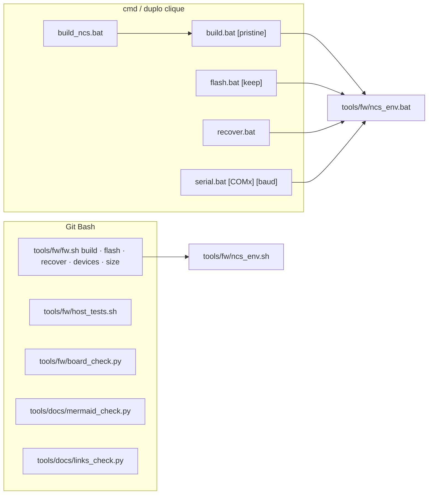

# Ambiente, build, gravação e console

Como montar o ambiente do nRF Connect SDK no Windows, compilar o port Zephyr, gravar o DK, ver o log, rodar os testes de host e validar a documentação. Tudo aqui foi executado nesta máquina em 2026-09-18, salvo onde está dito o contrário.

**Nesta página:** [Ferramentas](#ferramentas) · [Scripts](#scripts) · [Build do firmware](#build-do-firmware) · [Gravar e ver o log](#gravar-e-ver-o-log) · [Testes e análise estática](#testes-e-análise-estática) · [Documentação](#documentação) · [CI](#ci) · [Legacy](#legacy) · [Problemas conhecidos](#problemas-conhecidos)

## Ferramentas

| Ferramenta | Versão | Onde | Uso |
|---|---|---|---|
| nRF Connect SDK | v3.3.0 (Zephyr 4.3.99) | `C:\ncs\v3.3.0` | firmware |
| Toolchain do NCS | `936afb6332`: Zephyr SDK 0.17.0, GCC 12.2.0, CMake 4.2.1, Ninja, west 1.5.0, Python 3.12.4, dtc 1.4.7 | `C:\ncs\toolchains\936afb6332` | firmware |
| nrfutil | 8.1.1 com o comando `device` 2.17.5 | no toolchain (`nrfutil\bin`) | gravar, recover, listar placas |
| SEGGER J-Link | V8.76, V8.96, V9.24a | `C:\Program Files\SEGGER` | driver do J-Link OB do DK |
| MinGW-w64 GCC | 15.2.0 (com gcov) | `C:\ProgramData\mingw64\mingw64\bin` | testes de host |
| CMake / Ninja | 4.1.2 / 1.13 | `C:\Program Files\CMake`, pip do Python 3.11 | testes de host |
| cppcheck | 2.20.0 | scoop | análise estática |
| clang-format / clang-tidy | LLVM do scoop | scoop | formatação e lint (sem configuração no projeto ainda) |
| Node.js | 22.18.0 | `C:\Program Files\nodejs` | mermaid-cli (cache do npx) e `tools/zpm` |
| Python | 3.11.9 | usuário | scripts de documentação |

O NCS v3.1.0 e o toolchain `b8b84efebd`, usados até dezembro de 2025, **não existem mais** nesta máquina. Os builds gerados com eles, em outras pastas (`C:\Users\...\Documents\88.Personal\1.Projects\gnss-bike-computer` e `...\stravaV10`), foram apagados em 2026-09-18.

## Scripts



| Variável | Onde vale | Efeito |
|---|---|---|
| `NCS_ROOT`, `NCS_VERSION`, `NCS_TOOLCHAIN` | `ncs_env.*` | trocam o SDK (padrão `C:\ncs`, `v3.3.0`, `936afb6332`; o `.sh` descobre o toolchain pelo `toolchains.json`) |
| `BUILD_DIR` | `build.bat`, `flash.bat`, `fw.sh` | outra pasta de build (padrão `zephyr_app/build`); relativa, vale a partir da pasta atual |
| `BOARD` | `build.bat`, `flash.bat`, `recover.bat`, `fw.sh` | outro alvo. Os padrões **não são os mesmos**: no `fw.sh` é `nrf54lm20dk/nrf54lm20a/cpuapp` (`tools/fw/fw.sh:33`), nos `.bat` ainda é `nrf52840dk/nrf52840` (`build.bat:27`, `flash.bat:32`, `recover.bat:16`). A placa do projeto é `gnssbike/nrf54lm20a/cpuapp`; o overlay `zephyr_app/boards/<placa>.overlay` entra pelo nome |
| `ANT` | `build.bat`, `fw.sh` | `1` compila com o ANT: o add-on `sdk-ant` em `SDK_ANT_DIR`, `zephyr_app/modules/ant_ncs33_compat` e `zephyr_app/ant.conf`; ao trocar, use `pristine` ou outra `BUILD_DIR` |
| `SDK_ANT_DIR` | `build.bat`, `fw.sh` | pasta do add-on (padrão `C:\ncs\sdk-ant`) |
| `FAMILY` | `flash.bat`, `recover.bat`, `fw.sh` | família do `nrfutil`; sem ela, vem da `BOARD` (`nrf54l` para as placas nRF54L, `nrf52` no resto) |
| `NRF_SERIAL` | `flash.bat`, `recover.bat`, `fw.sh` | escolhe o J-Link pelo número de série |
| `SERIAL_PORT` | `serial.bat` | porta padrão do console (padrão `COM11`) |
| `NOPAUSE` | todos os `.bat` | não espera tecla no fim |

Os `ncs_env.*` reproduzem o `environment.json` do toolchain (PATH, `PYTHONPATH`, `NRFUTIL_HOME`, `ZEPHYR_TOOLCHAIN_VARIANT=zephyr`, `ZEPHYR_SDK_INSTALL_DIR`) e definem `ZEPHYR_BASE`. Eles **não** definem `TOOLCHAIN_ROOT` (ver [problemas conhecidos](#problemas-conhecidos)).

## Build do firmware

```sh
bash tools/fw/fw.sh build            # incremental
bash tools/fw/fw.sh build pristine   # do zero
```

Ou `build.bat` / `build.bat pristine` no cmd. Por baixo (`tools/fw/fw.sh:97-100`):

```sh
source tools/fw/ncs_env.sh
cd zephyr_app
python -m west build -p auto -b nrf54lm20dk/nrf54lm20a/cpuapp -d build --sysbuild . \
  -- -DBOARD_ROOT=<caminho do zephyr_app> -Dmcuboot_BOARD_ROOT=<caminho do zephyr_app>
```

- **Alvo padrão:** `nrf54lm20dk/nrf54lm20a/cpuapp`, com `boards/nrf54lm20dk_nrf54lm20a_cpuapp.overlay` (pinos no conector de expansão do DK) e `boards/nrf54lm20dk_nrf54lm20a_cpuapp.conf` (configurações no ZMS), que o Zephyr aplica pelo nome da placa. Detalhes em [05](05-arquitetura-zephyr.md#devicetree-e-alvos).
- **Placa do projeto:** `BOARD=gnssbike/nrf54lm20a/cpuapp BUILD_DIR=zephyr_app/build_custom bash tools/fw/fw.sh build`. A board mora em `zephyr_app/boards/gnss/gnssbike/`, fora do caminho padrão do Zephyr: quem a encontra são os `-DBOARD_ROOT` e `-Dmcuboot_BOARD_ROOT` que o `fw.sh` passa, o segundo porque o sysbuild constrói o MCUboot à parte. **Não existe placa física:** por enquanto o alvo só compila.
- **nRF52840 DK:** `BOARD=nrf52840dk/nrf52840 bash tools/fw/fw.sh build` ainda compila, com os pinos da myStravaB em `zephyr_app/boards/nrf52840dk_nrf52840.overlay`, mas o alvo **saiu de uso**. Nos `.bat` ele continua sendo o padrão, então ali o alvo do projeto pede `set BOARD=nrf54lm20dk/nrf54lm20a/cpuapp`.
- **ANT:** `ANT=1 bash tools/fw/fw.sh build pristine` (ou `set ANT=1` antes do `build.bat`). Precisa do add-on em `C:\ncs\sdk-ant` ([07](07-radio-ant-ble.md#ant-no-ncs-v330)); mostra um aviso esperado a mais, `Deprecated symbol SOC_SERIES_NRF54LX is enabled` (ou `SOC_SERIES_NRF52X`).
- **Sysbuild** é o fluxo padrão do NCS. O `zephyr_app/sysbuild.conf` desliga o Partition Manager (`SB_CONFIG_PARTITION_MANAGER=n`), depreciado no NCS 3.3; o layout vem do devicetree. O MCUboot entra só nos alvos com o nRF54LM20A (`zephyr_app/Kconfig.sysbuild`): no nRF52840 não cabem dois slots.
- **Saída:** `zephyr_app/build/zephyr_app/zephyr/zephyr.hex` (e `.elf`, `.map`, `.config`, `zephyr.dts`). Nos alvos com o nRF54LM20A o sysbuild gera também `mcuboot/zephyr/zephyr.hex`, a imagem assinada `zephyr_app/zephyr/zephyr.signed.hex` e o `dfu_application.zip` da atualização por BLE. Não há `merged.hex` em nenhum alvo.

### Mapa de memória

**nRF54LM20A** (nRF54LM20 DK e placa do projeto usam o mesmo layout, o do `nrf54lm20_a_b_cpuapp_partition.dtsi`). Dos 2.036 KB de RRAM, os últimos 96 KB são do FLPR: sobram cerca de 1.940 KB.

| Região | Endereço | Tamanho | Conteúdo |
|---|---|---|---|
| RRAM: `mcuboot` | `0x000000` | 64 KB | gerenciador de boot |
| RRAM: `image-0` (slot0) | `0x010000` | 920 KB | firmware; a imagem cabe em 921.456 B, o resto é o rodapé do MCUboot (`CONFIG_ROM_END_OFFSET=0x5090`) |
| RRAM: `image-1` (slot1) | `0x0F6000` | 920 KB | imagem recebida pela atualização por BLE |
| RRAM: `storage` | `0x1DC000` | 36 KB | settings no ZMS: bonds BLE e configurações do usuário |
| RAM | `0x20000000` | 511 KB | tudo |

**nRF52840 DK**, o alvo fora de uso, sem MCUboot:

| Região | Endereço | Tamanho | Conteúdo |
|---|---|---|---|
| flash: aplicação | `0x00000` | até 992 KB | firmware (`CONFIG_FLASH_LOAD_OFFSET=0`) |
| flash: `storage_partition` | `0xF8000` | 32 KB | settings/NVS: bonds BLE e configurações do usuário |
| RAM | `0x20000000` | 256 KB | tudo |

### Resultado de referência

Build com sysbuild da `develop` em 2026-09-22 (atualizado a cada commit que muda o tamanho):

| Alvo | FLASH | RAM | MCUboot | Avisos |
|---|---|---|---|---|
| `nrf54lm20dk/nrf54lm20a/cpuapp` | 636.144 B (69,04 % dos 921.456 B do slot) | 393.080 B (75,12 % dos 511 KB) | 45.676 B de FLASH, 22.880 B de RAM | 0 |
| `gnssbike/nrf54lm20a/cpuapp` | 636.360 B (69,06 %) | 369.120 B (70,54 %) | 45.880 B de FLASH, 22.888 B de RAM | 0 |

Erros: 0 nos dois alvos.

Medidas antigas, de 2026-09-19, não refeitas desde então:

| Item | Valor |
|---|---|
| Tempo de build | cerca de 1 min do zero (pelos horários dos logs) |
| nRF52840 DK | FLASH 474.268 B (45,23 % de 1 MB), RAM 220.352 B (84,06 % de 256 KB), 0 avisos |
| Com `ANT=1` | nRF52840 DK: FLASH 502.860 B, RAM 225.152 B; nRF54LM20 DK: FLASH 528.172 B, RAM 254.928 B; só o aviso do símbolo obsoleto |

Maiores consumidores de RAM (`bash tools/fw/fw.sh size`): o heap do LVGL 32.768 B (`CONFIG_LV_Z_MEM_POOL_SIZE`), `seg_runtime` 22.000 B, o buffer de desenho do LVGL 19.200 B, o heap do sistema 16.384 B (`CONFIG_HEAP_MEM_POOL_SIZE`), o quadro da tela (12.482 B da Sharp no nRF52840, 36.482 B do JDI no nRF54LM20), `points` 8.000 B, a pilha da thread `ui` (6.144 B), o pool do controlador BLE 5.247 B, as outras pilhas ([05](05-arquitetura-zephyr.md#pilhas)) e quatro cópias do retrato da tela (`ui_model_t`, 2.404 B: a do modelo, a do canal, a da thread `ui` e a da interface).

A interface ocupa no nRF54LM20 DK cerca de 151 KB de flash: LVGL 92.467 B, telas 28.753 B, fontes 26.904 B e o driver da tela 2.972 B ([18](18-interface-telas.md#memória)).

## Gravar e ver o log

```sh
bash tools/fw/fw.sh devices      # precisa aparecer um dispositivo com o trait jlink
bash tools/fw/fw.sh flash        # apaga tudo (ERASE_ALL) e grava
bash tools/fw/fw.sh flash keep   # apaga só as faixas do firmware: mantém a storage_partition
bash tools/fw/fw.sh recover      # chip protegido: apaga tudo e libera o APPROTECT
```

- Os scripts filtram `--traits jlink` e a família do chip (`nrf52`, ou `nrf54l` quando a `BOARD` é uma placa nRF54L): nesta máquina costuma haver um ST-LINK e outras seriais USB conectados.
- **Console:** no nRF54LM20 DK o `zephyr,console` é o `uart20` (TX P1.16, RX P1.17, 115200 baud), exposto pela porta VCOM do J-Link; na placa do projeto é o mesmo `uart20`, em TX P1.00 e RX P1.31; no nRF52840 DK é o `uart0` (TX P0.06, RX P0.08). `serial.bat COMx` abre o miniterm do Python do toolchain (pyserial 3.5); `Ctrl+]` sai. O log usa o backend UART; o RTT está desligado no `prj.conf`.
- Até 2026-09-22 nenhum DK foi conectado a esta máquina: **nada foi gravado nem testado em placa**.

## Testes e análise estática

```sh
bash tools/fw/host_tests.sh             # configura, compila e roda todos
bash tools/fw/host_tests.sh -R segment  # filtra pelo nome
```

Os testes compilam os módulos de lógica de `zephyr_app/src` com o GCC do PC e shims mínimos do Zephyr: 53 conjuntos, 714 casos, todos verdes em 2026-09-22. Detalhes em [12-ferramentas-testes.md](12-ferramentas-testes.md) e na skill `fw-testes`.

```sh
cppcheck --enable=warning,style,performance,portability --std=c11 --inline-suppr --quiet \
  --suppress=missingIncludeSystem --suppress=missingInclude --suppress=unusedFunction \
  -I zephyr_app/include zephyr_app/src
```

Sem os headers do Zephyr, o cppcheck acusa `syntaxError` nas macros de GATT e devicetree (`BT_GATT_*`, `DT_*`): são falsos positivos. Os achados reais estão em [11-qualidade-misra.md](11-qualidade-misra.md).

```sh
python tools/fw/board_check.py                  # a placa do projeto
python tools/fw/board_check.py <pasta-da-placa>  # outra
```

O `board_check.py` lê o devicetree da placa e procura o que o build aceita calado: pino em duas funções, SCL de TWIM ou SCK de SPIM fora dos pinos de clock da tabela 79, pads do NFC (P1.01 e P1.02) sem `nfct-pins-as-gpios`, cristal em P1.20/P1.21, limite de pinos de cada porta, dois periféricos no mesmo bloco serial e apelido que falta. Sai com 1 se achar problema. Em 2026-09-22 a placa do projeto passa: **31 pinos usados de 66**, 31 livres, 12 deles de clock.

## Documentação

```sh
python tools/docs/mermaid_check.py   # extrai, procura diagramas em texto e renderiza cada Mermaid
python tools/docs/links_check.py     # links relativos e âncoras
```

O `mermaid_check.py` usa o mermaid-cli que já está no cache do npx e o Chrome headless do puppeteer; não instala nada. Padrão de escrita na skill `docs-gnss`.

## CI

O `.github/workflows/ci.yml` existe, mas está **desligado** por decisão do dono (2026-09-18): o único gatilho é `workflow_dispatch`, então nada roda sozinho no GitHub Actions. Para rodar, use "Run workflow" na aba Actions.

| Job | O que faz |
|---|---|
| `host-tests` | os testes de host no Ubuntu com o GCC do sistema |
| `docs` | `links_check.py` e `mermaid_check.py` com o mermaid-cli do npm (`.github/puppeteer-ci.json` passa `--no-sandbox` ao Chrome) |
| `firmware` | build com sysbuild no container `ghcr.io/nrfconnect/sdk-nrf-toolchain:v3.3.0`, com `west init` do sdk-nrf v3.3.0 |

Nenhum job rodou no GitHub até agora; o Linux pode acusar avisos que o MinGW não acusa. Ligar gatilhos automáticos (`push`, `pull_request`) só com pedido do dono.

## Legacy

O firmware original não compila nesta máquina: exige **nRF5 SDK 16.0.0**, **SoftDevice S340 6.1.1** e **GCC 6 2017-q2-update**, que não estão instalados. Os comandos originais (`make`, `make flash_softdevice`, `make flash`, DFU segurando o botão direito) estão em [`legacy/README.md`](../legacy/README.md). O `nrfutil` antigo do pip (para pacotes DFU do nRF5 SDK), em `Python311\Scripts`, está quebrado.

## Problemas conhecidos

| Sintoma | Causa e solução |
|---|---|
| `ValueError: path is on mount 'F:', start on mount 'C:'` | o `west` calcula caminhos relativos a partir do diretório atual; com o NCS em `C:` e o projeto em `F:`, rode de dentro do `zephyr_app` (os scripts fazem isso). Os `.bat` antigos faziam `cd C:\ncs\...` e só funcionavam com o projeto em `C:` |
| `include could not find requested file: ...\936afb6332\cmake\toolchain\zephyr\generic.cmake` | a variável de ambiente `TOOLCHAIN_ROOT` está definida: o Zephyr a lê como raiz das definições de toolchain. Não a defina; os `.bat` antigos a definiam |
| `Build directory ... is for application ...` | build antigo de outra pasta; `-p auto` (padrão dos scripts) refaz do zero |
| aviso `SB_CONFIG_PARTITION_MANAGER is enabled ... deprecated` | falta o `zephyr_app/sysbuild.conf` |
| `multiple definition of 'ant_stack_init'` | o add-on já define `ant_stack_init()`; no código do port use nomes fora do prefixo `ant_` (`rf_ant_init()`) |
| `lib/soft-float/libant.a ... missing` | o `ant_ncs33_compat` não entrou no build: compile pelos scripts com `ANT=1` |
| `--no-sysbuild` | ainda funciona para imagem única, mas está depreciado desde o NCS 2.7 |
| `JLink.exe` abre a ferramenta do Java | o `JLink.exe` do PATH é do Eclipse Adoptium; o da SEGGER fica em `C:\Program Files\SEGGER\JLink_V924a\` |
| pino da placa se comportando como outro periférico no DK | um nó do DK voltou a ocupar o pino; o overlay desliga `qspi` e `mx25r64`, `spi3` e `pwm0` e tira RTS/CTS do `uart0` (ver [02-hardware.md](02-hardware.md#alvo-híbrido-no-dk)) |
| cppcheck com `syntaxError` nos `ble_*.c` ou nos `#if DT_...` dos serviços | macros do Zephyr sem os headers; falso positivo. Nos serviços, passe `"-DDT_NODE_HAS_STATUS(n,s)=1"` e `"-DDT_ALIAS(a)=a"` |
| diagnósticos do clangd nos testes de host | o clangd usa o `compile_commands.json` do firmware; `zephyr_app/tests/host/.clangd` aponta para o dos testes depois do primeiro `host_tests.sh` |
