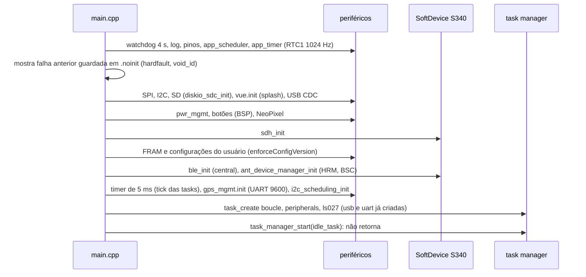
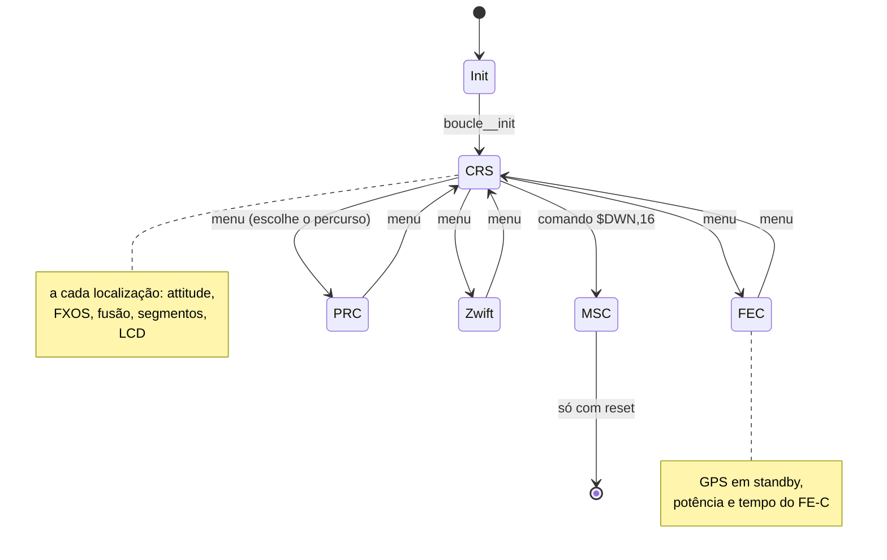

# Arquitetura do legacy (stravaV10)

Como funciona o firmware original de Vincent Gollé em `legacy/`: boot, task manager cooperativo, tasks, interrupções, modos, estruturas globais e constantes. Ele é a especificação de comportamento do port. Origem, licença e build estão em [`legacy/README.md`](../legacy/README.md); algoritmos em [06-algoritmos.md](06-algoritmos.md).

**Nesta página:** [Visão geral](#visão-geral) · [Boot](#boot) · [Task manager](#task-manager) · [Tasks](#tasks) · [Interrupções e timers](#interrupções-e-timers) · [Modos](#modos) · [Estruturas globais](#estruturas-globais) · [Constantes](#constantes) · [Código morto](#código-morto) · [Glossário](#glossário)

## Visão geral

| Item | Valor |
|---|---|
| SDK | nRF5 SDK 16.0.0, SoftDevice S340 6.1.1 (BLE + ANT+), GCC 6 2017-q2-update |
| Linguagem | C e C++ (`-std=gnu++0x`, sem exceções nem RTTI), `-fsingle-precision-constant` |
| Execução | task manager cooperativo do nRF5 SDK com extensões do autor; eventos do SoftDevice pelo `app_scheduler` |
| Placa ativa | `PROTO_V11` → `custom_board_v3.h` (myStravaB V3) |
| Memória | MBR + S340 até `0x31000`; app até o bootloader em `0xF4000`; RAM do app a partir de `0x20004150`, heap de 150.000 B |

## Boot

Referência: `legacy/main.cpp:382-528`.

## Task manager

- É o "experimental task manager" do nRF5 SDK (`libraries/task_manager/`), **cooperativo**: no máximo 5 tasks de 2.048 B de pilha, sem prioridade, escolha round-robin entre as prontas; se nenhuma está pronta, roda a idle.
- Troca de contexto só em `task_yield()`, `task_events_wait()`, `task_delay()` e `task_exit()`. As interrupções continuam preemptivas.
- `task_delay(ms)` suspende até o timeout; um tick de 5 ms decrementa os timeouts, e `task_delay_cancel()` acorda uma task antes (é o mecanismo de "acordar" usado por ISRs e por outras tasks).
- Eventos: 24 bits por task. `TASK_EVENT_LOCATION` (bit 0), `TASK_EVENT_FEC_INFO` (bit 1), `TASK_EVENT_FEC_POWER` (bit 2) e `TASK_EVENT_BOUCLE_RELEASE`.
- O contexto salvo não inclui o estado da FPU.

Consequência importante para o port: no legacy não havia concorrência preemptiva entre as tasks, então as estruturas globais não precisavam de trava. No Zephyr, com threads preemptivas, precisam.

## Tasks

| Task | Gatilho | O que faz |
|---|---|---|
| `usb_cdc_tasks` | espera de 50 ms, acordada por eventos USB | `usb_cdc_process()` |
| `uart_tasks` | espera de 100 ms, acordada pela ISR de RX | trata erros da UARTE, esvazia a fila de RX no TinyGPS++ (**o parse NMEA roda na task, não na ISR**) |
| `boucle_tasks` | espera o evento do modo (localização ou FE-C) | `boucle__run()`: o ciclo do modo atual, alimenta o watchdog |
| `peripherals_task` | espera de 50 ms, acordada por botões e BLE | agendador I2C, `app_sched_execute()` (eventos BLE/ANT), NUS, botões, FE-C, suffer score, zonas RR, comandos virtuais, GPS (WDT de baud e máquina de estados), localização, NeoPixel, power scheduler |
| `ls027_task` | espera de 1.250 ms, cancelada pela boucle a cada atualização | alimenta o watchdog, botões, `vue.refresh()`, envio ao LCD |
| idle | nada pronto | `app_sched_execute()`, `pwr_mgmt_run()` (dorme) |

Referência: `legacy/source/Model.cpp:278-408`.

## Interrupções e timers

| Fonte | Contexto | Efeito |
|---|---|---|
| app_timer de 5 ms | ISR (RTC1) | tick do task manager |
| app_timer de 100 ms | ISR | agendador I2C: barômetro a cada 100 ms em CRS/PRC; STC3100 a cada 1 s; barômetro dorme fora de CRS/PRC |
| UARTE RX | ISR | enfileira bytes e acorda `uart_tasks` |
| botões (BSP) | ISR | guarda o evento num slot único e acorda `peripherals_task` |
| FXOS INT1 (GPIOTE) | ISR | acumula amostras de aceleração (50 Hz) |
| SoftDevice | `app_scheduler` (task) | eventos BLE e ANT+ fora de ISR |
| watchdog | 4 s | alimentado pela boucle e pela task do LCD |

Todas as interrupções da aplicação têm prioridade 6.

## Modos

| Modo | `init` | Ciclo |
|---|---|---|
| CRS (ciclismo ao ar livre) | GPS acordado, barômetro iniciado, `attitude.reset()`, carrega o percurso se houver | espera `TASK_EVENT_LOCATION`; `attitude.addNewLocation()`, `fxos_tasks()`, `computeFusion()`, segmentos (allocator, desempenho, LED), acorda o LCD, ping do power scheduler |
| PRC (percurso) | igual ao CRS com um percurso escolhido | igual, mais a posição relativa no percurso |
| FEC (rolo) | GPS em standby, abre o canal FE-C | espera eventos FE-C; potência em buffer de 120 e nas zonas |
| Zwift | GPS em standby | só aceita a fonte simulada (`$LOC`) |
| MSC | libera o FAT e expõe o cartão pela USB | laço de espera; volta só com reset |

A troca passa por `boucle__change_mode()` (`legacy/source/model/Boucle.cpp:101-143`): libera a espera atual, chama `invalidate()` do modo antigo, zera a carga no STC3100 e ativa o novo; o `init` roda sob demanda.

## Estruturas globais

- `legacy/source/Model.cpp:36-80`: `att`, `suffer_score`, `zPower`, `rrZones`, `u_settings`, `mes_segments`, `mes_parcours`, `mes_points`, `locator`, `segMngr`, `vue`, `stc`, `baro`, `attitude`, `gps_mgmt`, `vparser`, `neopixel`, e `m_app_error` na seção `.noinit` (sobrevive ao reset).
- `legacy/source/g_structs.c`: `hrm_info`, `bsc_info`, `fec_info`, `fec_control`, `m_komoot_nav`.
- `SAtt` (`legacy/source/model/Attitude.h:28-41`): posição, data, subida, velocidade vertical, inclinação, distância, potência, pontos, segmentos ativos, PR, segundos ativos, distância ao próximo segmento.

## Constantes

| Constante | Valor | Uso |
|---|---|---|
| `LS027_TIMEOUT_DELAY_MS` | 1250 | período máximo do LCD |
| `HISTO_POINT_SIZE` | 20 | histórico de pontos do ciclista |
| `LOCATOR_MAX_DATA_AGE_MS` | 6000 | tela GPS quando a posição envelhece |
| `ATT_BUFFER_NB_ELEM` | 5 | snapshots gravados por vez no SD |
| `FILTRE_NB` | 10 | média do barômetro |
| `STC3100_CUR_SENS_RES_MO` | 100 | shunt do STC3100 em mΩ (o esquema da V3 mostra 20 mΩ) |
| `FEC_PW_BUFFER_NB_ELEM` | 120 | buffer de potência no FE-C |
| `USER_WEIGHT` / `USER_FTP` | 79 kg / 256 W | padrões das configurações |
| `DIST_ACT` / `MARGE_ACT` / `PSCAL_LIM` / `DIST_ALLOC` | 50 m / 1,5 / 0 / 300 m | segmentos (`legacy/source/routes/Segment.h`) |
| `POWER_SCHEDULER_MAX_IDLE_MIN` | 15 | desligamento automático |

Lista completa e os algoritmos que as usam em [06-algoritmos.md](06-algoritmos.md).

## Código morto

Não trate como funcional: `Task.hpp` (não compila), `main.old` (versão MK64F), `libraries/filters/order1_filter`, o EKF de `kalman_ext`, `AltiBaro::runFilter()` e `computeVA()`, `ble_api5.c` (substituído pelo `ble_api6.c`), o controle ERG/SIM do FE-C (`roller_manager` sem chamador), o canal ANT "glasses" (sem alocação) e o `MS5637` e o `VEML6075` (não montados na V3).

## Glossário

| Nome no código | Significado |
|---|---|
| `Boucle`, `boucle` | laço: o ciclo de processamento de cada modo |
| `BoucleCRS` | modo "course" (pedal ao ar livre) |
| `Parcours`, PRC | percurso (rota GPX a seguir) |
| `Vue` | tela, camada de interface |
| `cadran` | mostrador (célula da grade de dados) |
| `ListePoints`, `liste` | lista de pontos |
| `Vecteur` | vetor |
| `avance`, `monAvance` | vantagem de tempo sobre o recorde (positivo = adiantado) |
| `majPerformance` | "mise à jour" do desempenho: atualização |
| `testActivation` / `testDesactivation` | teste de entrada e de saída do segmento |
| `pourc`, `pourcentage` | porcentagem |
| `secj` | segundos do dia |
| `vit_asc` | velocidade ascensional (vertical, m/s) |
| `climb`, `denivele` | subida acumulada |
| `ele`, `alti` | elevação, altitude |
| `nbpts`, `nbact` | número de pontos, número de segmentos ativos |
| `lig`, `col` | linha, coluna |
| `p_scal` | produto escalar |
| `marge` | margem |
| `ajouteFin`, `ajouteFinIso` | acrescenta no fim; acrescenta mantendo o tamanho |
| `Retour` | voltar (item de menu nas versões antigas) |
| `SEG_OFF/START/ON/FIN` | segmento fora, iniciando, em curso, terminado |
