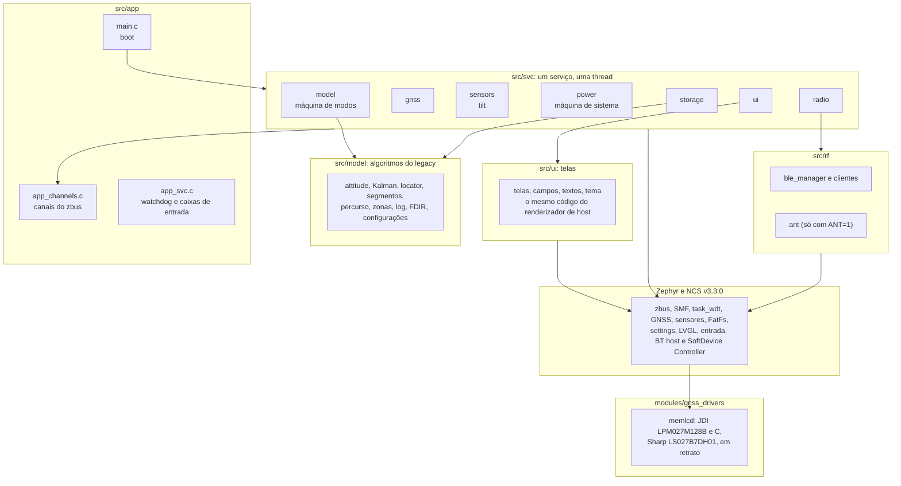
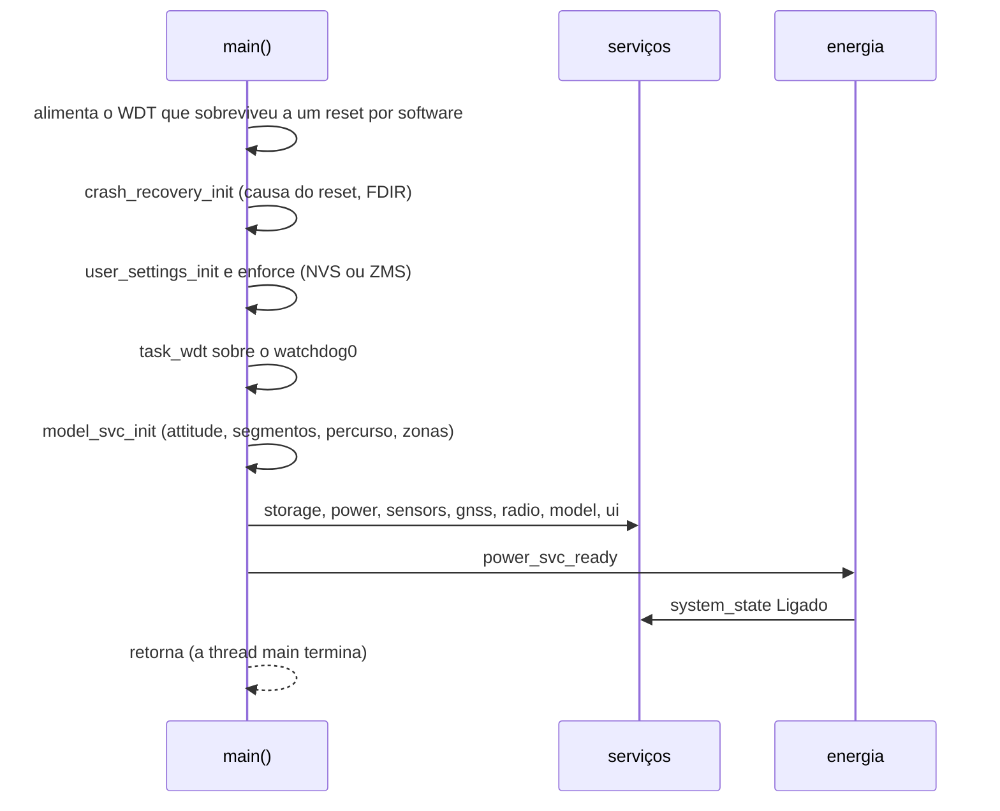
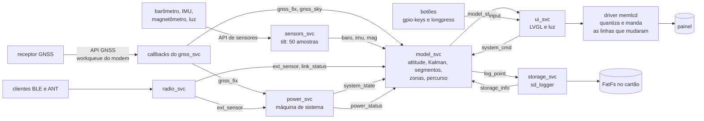
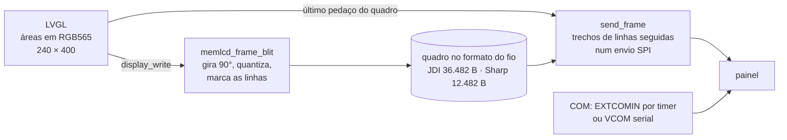

# Arquitetura do port Zephyr

Como o `zephyr_app/` está organizado desde 2026-09-19: um serviço por assunto, cada um com a sua thread, eventos no zbus, máquinas de estado no SMF e o hardware pelas APIs do Zephyr, achado por aliases do devicetree. É a base da arquitetura planejada em [16-arquitetura-firmware.md](16-arquitetura-firmware.md); o que cada serviço já faz, e o que falta, está em [10-status-do-port.md](10-status-do-port.md).

> [!IMPORTANT]
> Build verificado nos dois alvos (nRF52840 DK e nRF54LM20 DK, com e sem ANT) e testes de host; **nada rodou em placa**.

**Nesta página:** [Camadas](#camadas) · [Boot](#boot) · [Threads](#threads) · [Eventos](#eventos) · [Máquinas de estado](#máquinas-de-estado) · [Watchdog](#watchdog) · [Fluxo de dados](#fluxo-de-dados) · [Pilhas](#pilhas) · [Tela](#tela) · [Medidor de bateria](#medidor-de-bateria) · [Carregador](#carregador) · [Módulos](#módulos) · [Devicetree e alvos](#devicetree-e-alvos) · [Configuração](#configuração) · [Regras de concorrência](#regras-de-concorrência)

## Camadas



- Um serviço nunca chama outro: publica num canal, e quem precisa escuta. As chamadas só descem, para o modelo e para o Zephyr.
- Os nomes em francês vêm do legacy (`parcours` = percurso, `liste_points`, `vecteur`); o glossário está em [04-arquitetura-legacy.md](04-arquitetura-legacy.md#glossário).

## Boot



- Os drivers do Zephyr (sensores, receptor GNSS, cartão, tela) iniciam antes do `main()`; um que não responde fica fora, e o serviço dele segue sem ele. O driver da tela limpa a memória do painel (all clear) e liga o COM; o LVGL inicia logo depois (`CONFIG_LV_Z_AUTO_INIT`), ainda sem desenhar.
- A thread `ui` monta a tela de partida, desenha e só então acende a imagem (`display_blanking_off()`, pino DISP); o primeiro retrato do modelo leva à página do modo.
- O `model_svc_init()` roda antes das threads porque o `segment_init()` zera os segmentos: se rodasse depois, apagaria o que o armazenamento acabou de carregar.
- O armazenamento monta o cartão, carrega os segmentos e publica o que achou; o modelo só usa os segmentos depois dessa mensagem.

## Threads

Prioridade no Zephyr: número menor ganha. Pilhas medidas (ver [Pilhas](#pilhas)).

| Thread | Arquivo | Prioridade | Pilha | Acorda com | Faz |
|---|---|---|---|---|---|
| `sensors` | `src/svc/sensors/sensors_svc.c` | 4 | 2048 B | a cada 20 ms | acelerômetro a 50 Hz com média de 1 s, barômetro a 10 Hz, magnetômetro e luz a 1 Hz, como o legacy (`fxos.cpp:600`, `Attitude.cpp`) |
| `model` | `src/svc/model/model_svc.c` | 5 | 4096 B | caixa de entrada; ao menos 1 vez por segundo | o único escritor do modelo: `attitude` e o Kalman, segmentos, zonas, percurso, máquina de modos; publica o retrato da tela e o ponto do log |
| `gnss` | `src/svc/gnss/gnss_svc.c`, `gnss_power.c` | 6 | 2048 B | caixa de entrada | máquina de energia do receptor (backup, aquisição, LEAP, plena), configura o M10 por UBX, publica a época e segue o modo e o desligamento |
| `radio` | `src/svc/radio/radio_svc.c` | 6 | 3072 B | caixa de entrada | sobe o ANT (com `ANT=1`) e o BLE, liga os clientes aos canais, atualiza o nível da bateria no BLE |
| `ui` | `src/svc/ui/ui_svc.c` | 7 | 6144 B | caixa de entrada, o próximo timer do LVGL; ao menos 1 vez por segundo | a única que chama o LVGL: telas do retrato, teclas, notificações, telas de USB e de desligamento, luz e COM; o driver manda ao painel só as linhas que mudaram |
| `storage` | `src/svc/storage/storage_svc.c` | 8 | 3584 B | caixa de entrada | monta o cartão, carrega segmentos, lista percursos, grava o log de atividade |
| `power` | `src/svc/power/power_svc.c` | 9 | 3072 B | caixa de entrada; tique de 1 s; o medidor e o carregador a cada 10 s; eventos do nPM1300 | máquina de sistema, desligamento automático, ship mode ou System OFF; lê o medidor e o carregador e publica `power_status`; bateria fraca e crítica (`battery.c`); estado da carga (`charge.c`) |
| workqueue do modem | Zephyr (`CONFIG_MODEM_DEDICATED_WORKQUEUE`) | do sistema | 2048 B | bytes do receptor | o driver GNSS interpreta e chama os callbacks do serviço: a época vai para a caixa de entrada da thread `gnss`, que a publica, e os satélites saem em `gnss_sky` dali mesmo |
| RX do BT | Zephyr | cooperativa | 3072 B | pacotes do rádio | os clientes BLE chamam os callbacks do serviço de rádio, que publicam `ext_sensor` e `link_status` |
| entrada | Zephyr (`CONFIG_INPUT_THREAD_STACK_SIZE`) | 0 | 2048 B | eventos das teclas | o `zephyr,input-longpress` separa toque curto e longo; o callback de `src/svc/ui/ui_input.c` publica `input` |
| workqueue do sistema | Zephyr | do sistema | 2048 B | trabalhos | o debounce das teclas, os eventos do nPM1300 (o driver lê os registradores e chama o callback do serviço, que só põe a mensagem na caixa) e, na V3, o VCOM serial da tela |

Ficam por conta do Zephyr e do NCS: o log, o TX do BT, o MPSL e o idle.

## Eventos

Cada serviço tem uma **caixa de entrada**, uma `k_msgq` estática que um listener do zbus enche com cópias das mensagens que o serviço usa (`ZBUS_CHAN_ADD_OBS()` no arquivo do serviço). A thread dorme na caixa com um tempo máximo de 1 s, que também dá o trabalho periódico e a alimentação do watchdog (`app_inbox_get()`). Assim nenhum evento se perde entre dois processamentos, nada é alocado depois do boot, e cada thread tem um ponto só de espera. O retrato da tela e as listas grandes (satélites, pareamento, cartão) não vão na caixa: o listener só avisa, e a thread lê o canal. Com a caixa cheia, a mensagem é descartada e contada no log.

| Canal | Mensagem | Publica | Escutam |
|---|---|---|---|
| `chan_gnss_fix` | posição, velocidade, rumo, altitude, hora UTC, satélites, modo do receptor, uma por época | thread `gnss` | modelo, energia |
| `chan_gnss_sky` | satélites em vista | callback do GNSS | modelo |
| `chan_baro` | pressão e temperatura, 10 Hz | sensores | modelo |
| `chan_imu` | inclinação, rolagem e rugosidade, 1 Hz | sensores | modelo |
| `chan_mag` | rumo magnético compensado, 1 Hz | sensores | modelo |
| `chan_ambient` | luz ambiente, 1 Hz | sensores | interface |
| `chan_ext_sensor` | um dado de sensor externo | rádio | modelo, energia |
| `chan_link_status` | sensor conectado, perdido, procurando ou sem par | rádio | modelo |
| `chan_pair_list` | dispositivos achados no pareamento | rádio | modelo |
| `chan_phone_nav` | próxima curva do celular | rádio | modelo |
| `chan_power_status` | bateria e carga, a cada 60 s e quando muda | energia | modelo, rádio |
| `chan_system_cmd` | os pedidos da interface (modo, desligar, parear, FTP, zoom, formatar, MSC) | interface e serviços | cada serviço filtra os seus |
| `chan_system_state` | Partida, Ligado, MSC, Desligando, Desligado | energia | todos |
| `chan_mode` | modo em vigor | modelo | energia, GNSS, interface |
| `chan_shutdown_ack` | um serviço terminou a sua parte do desligamento | serviços | energia, interface (progresso na tela) |
| `chan_notif` | notificação da tela | qualquer um | interface |
| `chan_log_point` | um ponto do log por época | modelo | armazenamento |
| `chan_input` | tecla e tipo de toque | callback das teclas, na thread da entrada | interface |
| `chan_storage_info` | cartão montado, segmentos carregados, percursos | armazenamento | modelo |
| `chan_model_state` | o retrato da tela (`ui_model_t`, [18](18-interface-telas.md#implementação)) | modelo | interface |

As mensagens estão em `zephyr_app/include/app/app_events.h`, em C sem tipos do Zephyr.

## Máquinas de estado

| Máquina | Arquivo | Estados | Teste |
|---|---|---|---|
| Sistema e energia | `src/svc/power/sys_fsm.c` | Partida, Ligado e MSC sob um pai comum que aceita o desligamento; Desligando espera a resposta de cada serviço por até 5 s; Desligado corta a energia (ship mode do nPM1300 sem VBUS, System OFF com VBUS ou sem PMIC) | `test_sys_fsm` (16 casos), com o `lib/smf/smf.c` do Zephyr |
| Modo | `src/svc/model/model_svc.c` | CRS, PRC, FEC, Zwift, DBG, com as entradas e saídas de `boucle__change_mode()` (`legacy/source/model/Boucle.cpp:101-143`): PRC inicia o percurso carregado e o para ao sair, FEC zera as zonas e o score | pelo build; sem teste de host |
| Carga | `src/svc/power/charge.c` | Bateria, Solar, USB, USB cheia, Pausa térmica, Falha, lidos do nPM1300 e do AEM10900 a cada evento e a cada 10 s: com VBUS, o hardware bloqueia o solar | `test_charge` (11 casos) |
| Luz da tela | `src/svc/ui/backlight.c` | Apagada, Temporária (10 s depois de uma tecla) e Automática (pouca luz ambiente, com histerese entre 20 e 50 lux); desligada pelo menu, nada a acende; limites a acertar na bancada | `test_backlight` (11 casos) |

O desligamento automático é o do legacy (`legacy/source/scheduling/power_scheduler.cpp`): cada posição com fix em CRS, PRC e DBG, e cada dado do rolo em FEC, reinicia a contagem de 15 min (`src/model/power_scheduler.c`, `test_power_scheduler`). Diagramas das máquinas em [16](16-arquitetura-firmware.md#máquinas-de-estado).

## Watchdog

O `task_wdt` do Zephyr dá a cada thread de serviço o seu canal de 4 s, o tempo do WDT do legacy (que tinha um canal só, alimentado pelo `boucle` e pelo LCD). São 7 canais (`CONFIG_TASK_WDT_CHANNELS=8`); o WDT do nRF fica por trás e pega um travamento em que nem o timer do kernel roda.

- Cada thread alimenta o seu canal antes de cada espera na caixa, e a espera dura no máximo 1 s: um serviço preso num evento por mais de 4 s reinicia o aparelho, com o nome dele no log (`LOG_PANIC` no expirar).
- O armazenamento carrega os segmentos antes de criar o seu canal, porque a carga pode passar de 4 s com muitos arquivos no cartão.
- `CONFIG_TASK_WDT_MIN_TIMEOUT=4000`: o timer do kernel não acorda a CPU a cada 100 ms só para alimentar o WDT.
- O WDT do nRF52 continua contando depois de um `sys_reboot()`: o `main()` o alimenta (`app_wdt_feed_if_running()`) até os canais existirem. O WDT é o `watchdog0` do devicetree (`wdt0` no nRF52840, `wdt31` no nRF54LM20).
- O timer do kernel não pausa num breakpoint: para depurar passo a passo, compile com `-DCONFIG_TASK_WDT=n`.
- Não testado na placa.

## Fluxo de dados



## Pilhas

Medidas com `CONFIG_STACK_USAGE=y` (arquivos `.su` do GCC) em 2026-09-19, no build do nRF54LM20 DK. A soma segue a cadeia de chamadas mais funda e acrescenta o quadro de exceção com FPU (~100 B) e uma chamada de log (~250 B).

| Thread | Cadeia mais funda | Total | Pilha | Folga |
|---|---|---|---|---|
| `model` | `model_thread` 392 + `attitude_update_baro` 104 + **`measurement_update` 1672** + `udmat_invert` 352; o alocador de segmentos, que abre o arquivo do cartão na mesma thread, é mais raso: `segment_run_allocator` 32 + `segment_allocator` 616 (com o `load_segment_points` embutido) + FatFs e SD por SPI ~0,7 KB | ~2,9 KB | 4096 B | ~1,2 KB |
| `storage` | `storage_thread` 416 + `segment_load_all` 656 + FatFs (`f_open` 96, `follow_path` 56, `dir_find` 64) + SD por SPI (`sdhc_spi_request` 136, `sdhc_spi_send_cmd` 56, `spi_nrfx_transceive` 128) | ~2,2 KB | 3584 B | ~1,4 KB |
| `radio` | `bt_enable` 24 + `bt_init` 168 + `bt_hci_cmd_send_sync` 96 + `settings_zms_load` 144 e o ZMS | ~1,5 KB | 3072 B | ~1,5 KB |
| `sensors` | `sensors_thread` 168 + leitura I2C (`i2c_nrfx_twim_msg_transfer` 56) + publicação no zbus (`zbus_chan_pub` 56, `_zbus_vded_exec` 104, listener até 80, `k_msgq_put`) | ~0,9 KB | 2048 B | ~1,1 KB |
| `power` | `power_thread` 40 + `read_gauge` 64 + bateria crítica pela máquina de sistema (`smf_set_state` 64, `shutdown_entry` 16) + publicação no zbus (`app_publish` 56, `zbus_chan_pub` 56, `_zbus_vded_exec` 104, listener até 80, `app_inbox_put` 56) + log (~0,3 KB); a leitura I2C do medidor fica em ~0,3 KB | ~1,1 KB | 3072 B | ~1,9 KB |
| `gnss` | `gnss_thread` 136 + `apply` 24 + `ublox_m10_configure` 24 + `valset` 32 + `ubx_m10_valset` 48 + `run_script` 32 + `modem_ubx_run_script` 40, ou a publicação no zbus (`zbus_chan_pub` 56, `_zbus_vded_exec` 104, listener até 80, `app_inbox_put` 56) + log | ~0,6 KB | 2048 B | ~1,4 KB |
| `ui` | `ui_thread` 136 + `lv_timer_handler` 40 + `lv_display_refr_timer` 144 + `refr_area` 88 + 4 níveis da árvore de objetos × (`lv_obj_refr` 272 + `lv_obj_redraw` 352) + evento de desenho ~0,3 KB + arco (`ui_draw_disc` 200, `lv_draw_arc` 128, `lv_draw_sw_arc` 600, máscara e mistura ~0,4 KB) | ~4,7 KB | 6144 B | ~1,4 KB |
| entrada | `input_thread` 40 + `ui_keys_cb` 16 + publicação no zbus (`zbus_chan_pub` 56, `ui_listener` 80, `app_inbox_put` 56) + log | ~0,9 KB | 2048 B | ~1,1 KB |
| workqueue do sistema | VCOM serial da V3: `com_work_handler` 16 + `send_mode` 32 + `spi_nrfx_transceive` 128 + `nrfx_spim_xfer` 40 + espera + log; no nRF54LM20, os eventos do nPM1300: `work_callback` 104 + leitura I2C + `pmic_event` 16 + `app_inbox_put` 56 + log, ~0,7 KB | ~1,0 KB | 2048 B | ~1,0 KB |
| workqueue do modem | UBX no nRF54LM20 (`modem_ubx_process_handler` 48 + `pvt_handler` 144 + `ubx_m10_parse_pvt` 16 + `gnss_publish_data` 24 + `gnss_data_cb` 64 + `app_inbox_put`), ou os satélites, que publicam no zbus de lá (`sat_handler` 40, `zbus_chan_pub` 56, `_zbus_vded_exec` 104, listener até 80); com NMEA, `modem_chat_process_handler` 64 e `gnss_nmea0183_parse_rmc` | ~0,7 KB | 2048 B | ~1,3 KB |
| `main` | `settings_zms_save` 144 e o ZMS, ou `zms_mount` 232, com log | ~0,8 KB | 2048 B | ~1,2 KB |

- O workqueue do sistema, de 1024 B, ficaria com ~170 B de folga com os callbacks do GNSS: por isso o modem ganhou workqueue próprio. Com o VCOM serial da tela (V3), o workqueue do sistema subiu para 2048 B.
- A thread RX do BT subiu de 2200 para 3072 B, pelos ~0,45 KB que a publicação dos clientes acrescenta.
- O desenho do LVGL é recursivo: cada nível da árvore de objetos (tela, célula, campo, rótulo) custa 624 B. O log interno do LVGL fica desligado no firmware, porque `lv_log_add()` sozinho tem 848 B de quadro e cairia no fundo dessa cadeia; o renderizador de host o mantém ligado.
- No PC, o renderizador de host mede a pilha das telas pintando-a: 7.359 B em x86-64 (ponteiros de 8 B e 32 B de sombra por chamada no Windows), cota superior do que o Cortex-M33 gasta ([12](12-ferramentas-testes.md#renderizador-de-telas)).
- Na placa, confirme com `CONFIG_THREAD_ANALYZER=y`.

```sh
source tools/fw/ncs_env.sh
cd zephyr_app
python -m west build -p always -b nrf54lm20dk/nrf54lm20a/cpuapp -d build_su --no-sysbuild . -- -DCONFIG_STACK_USAGE=y
find build_su -name "*.su" -exec cat {} + | sort -t$'\t' -k2 -rn | head -40
```

## Tela

O driver de `modules/gnss_drivers/drivers/display/memlcd.c` atende os painéis de memória de 2,7" pela API de tela do Zephyr ([18](18-interface-telas.md#framework)). O Zephyr do NCS não tem driver para o LPM027M128B (o `jdi,lpm013m126` limita a tela a 255 px e usa outro cabeçalho), e o `sharp,ls0xx` não gira a tela.



| Item | Como funciona | Fonte |
|---|---|---|
| Retrato | o LVGL desenha 240 × 400; o ponto (x, y) vai para a coluna y da linha 239 − x, como o `drawPixel()` da V3 com `setRotation(3)` | [08](08-interface.md#pipeline-de-desenho) |
| Cores | cada pixel RGB565 passa pela regra de [18](18-interface-telas.md#implementação) (`memlcd_pixel.h`, a mesma do renderizador de host): 8 cores no JDI; preto e branco na Sharp, com a cor pela luminância | `memlcd_rgb565_to_rgb3()`, `memlcd_rgb565_to_mono()` |
| Quadro | cada linha fica na memória com os bytes de endereço em volta dos pixels; um trecho de linhas seguidas vai num buffer só do SPI, até 16 trechos por quadro (com mais, o último cresce sobre a lacuna) | `memlcd_frame.h` |
| JDI | SPI com o bit mais significativo primeiro; por linha, 6 bits de modo (M0 alto, 3 bits por pixel) e 10 de endereço (linha 1 a 240), 150 B de pixels em vermelho, verde e azul; 16 clocks no fim; all clear com M2 | ficha do LPM027M128B, 6.2, 6.8 e 8 |
| Sharp | SPI com o bit menos significativo primeiro; byte de modo, e por linha o endereço, 50 B (1 é branco) e um byte vazio; mais um byte no fim | ficha do LS027B7DH01, 6-5 |
| COM | com `extcomin-gpios`, um timer do kernel troca o pino (cada subida inverte o COM); sem ele, o bit M1 vai num comando pelo SPI a cada inversão. Inversões por segundo: `extcomin-frequency` na partida, 1 a 20 na Sharp e 1 a 140 no JDI por `memlcd_set_com_hz()` | fichas: JDI 4.2 e 7; Sharp 6-3 |
| Partida | alimentação (`power-gpios`), all clear, 2 ms, COM; o DISP sobe no `display_blanking_off()`, com 200 µs para as travas e a polaridade do COM | JDI 4.3; Sharp 6-2 |
| Desligamento | `memlcd_power_off()`: all clear, DISP baixo, 50 µs, COM parado, alimentação cortada | JDI 4.3 (T5 a T7) |
| Chip select | ativo alto; atrasos em volta dele pelo devicetree (`spi-cs-setup-delay-ns`, `spi-cs-hold-delay-ns`) | JDI 4.2; Sharp 6-3 |

- O JDI com DISP baixo mostra preto e guarda a memória (ficha, 1.4); a Sharp apaga.
- Teste de host: `test_memlcd` (19 casos) confere a quantização, a rotação, o empacotamento de cada painel, o formato do quadro (12.482 B da Sharp, os 10 bits de endereço do JDI), as linhas marcadas e os trechos ([12](12-ferramentas-testes.md#testes-de-host-do-port)).
- Não testado em painel: SPI, COM, tempos e cores ficam para a bancada.

## Medidor de bateria

O MAX17262 da placa nova é lido pela API de fuel gauge do Zephyr, com um driver próprio (`modules/gnss_drivers/drivers/fuel_gauge/max17262.c`, compatível `adi,max17262`). O driver da árvore do Zephyr (`maxim,max17262`, API de sensores) grava a capacidade em mAh onde o registrador conta 0,5 mAh, põe a corrente de carga no `IChgTerm`, que pede a corrente de fim de carga, em passos crus, devolve capacidades sem o fator de 0,5 mAh e lê o tempo até vazio com sinal, de modo que 0xFFFF (desconhecido) nunca é reconhecido.

| Item | Como funciona | Fonte |
|---|---|---|
| Configuração | depois de cada reset do medidor (`Status.POR`): espera `FStat.DNR`, sai da hibernação, grava `DesignCap`, `IChgTerm`, `VEmpty` e `ModelCfg`, espera o `Refresh`, volta a hibernação, zera o `ETHRM` quando não há termistor e limpa o `POR` | ficha do MAX17262 e o guia do ModelGauge m5 EZ |
| Célula | 2000 mAh, fim de carga em 60 mA (10 % dos 600 mA do nPM1300), 4,2 V, vazio em 3,3 V e religamento em 3,88 V (os valores de fábrica) | [14](14-hardware-placa-nova.md#carga) |
| Leituras | tensão, corrente média, carga (`RepSOC`), temperatura do chip, tempo até vazio e até cheio, capacidades, ciclos, nas unidades da API | `max17262_regs.h`, `test_max17262` (10 casos) |
| Serviço | a thread `power` lê a cada 10 s, publica `power_status` quando algo da tela muda ou a cada 60 s, avisa bateria fraca e pede o desligamento com a bateria no fim ([06](06-algoritmos.md#bateria)) | `battery.c`, `test_battery` (10 casos) |

- Não testado com o medidor: a configuração, os tempos de espera e as leituras ficam para a bancada, com a placa de avaliação do MAX17262 no `i2c24` do DK.

## Carregador

O nPM1300 usa os drivers do Zephyr (MFD, reguladores e o carregador pela API de sensores), com a configuração de [14](14-hardware-placa-nova.md#alimentação) no devicetree.

| Item | Como funciona | Fonte |
|---|---|---|
| Trilhos | BUCK1 travado em 1,8 V (o V_IO do GNSS tem máximo absoluto de 1,98 V) e ligado na partida; BUCK2 travado em 3,0 V e sempre ligado (o MCU); LDO1 como chave do cartão, ligada; LDO2 como LDO de 3,3 V da luz, ligado só com a luz acesa pela thread `ui` | [14](14-hardware-placa-nova.md#árvore) |
| Carga | 600 mA, fim em 4,20 V e em 10 % da corrente (60 mA, o `IChgTerm` do medidor), NTC de 10 kΩ B3380 com os limites JEITA de fábrica | [14](14-hardware-placa-nova.md#carga) |
| VBUS | 500 mA na partida; quando o VBUS chega, o serviço lê o que a fonte USB-C oferece pelo CC (500 mA ou 1,5 A) e sobe o limite, que o nPM1300 volta ao padrão quando o cabo sai; o VBUS vai para a máquina de sistema, que escolhe ship mode ou System OFF | ficha do nPM1300; amostras `npm13xx_*` do NCS |
| Eventos | VBUS entrou e saiu, carga completa e erro do carregador: o driver do MFD os recebe pelo GPIO3 e chama o callback no workqueue do sistema, que só põe uma mensagem na caixa da thread `power` | `mfd_npm13xx_add_callback()` |
| Estado | `charge.c` junta o `BCHGCHARGESTATUS`, o `BCHGERRREASON`, o `VBUSINSTATUS` e o `NTCSTATUS` do nPM1300 com o estado do AEM10900 e dá o estado da [máquina de carga](16-arquitetura-firmware.md#carga); pausa térmica e falha viram notificação | `test_charge` (11 casos) |
| Solar | driver próprio do AEM10900 (`modules/gnss_drivers/drivers/charger/aem10900.c`, compatível `e-peas,aem10900`, API de carregadores do Zephyr): na partida confere o número da peça, passa à configuração por I2C para carregar até 4,05 V (os pinos carregam até 3,90 V; os demais registradores ficam no valor de fábrica, que é o dos pinos) e liga o monitor de potência (APM); a thread `power` lê a cada 10 s se o painel carrega, a potência e o limiar em vigor, e devolve o AEM aos pinos antes de cortar a energia; se o AEM reinicia e volta aos pinos, o driver grava a configuração de novo | ficha do AEM1090x, seções 6 e 9; `aem10900_regs.h`, `test_aem10900` (7 casos) |

- O LED de carga do nPM1300 (LED1) acende sozinho, sem firmware ([14](14-hardware-placa-nova.md#componentes-principais)); o devicetree não mexe nos LEDs.
- A potência do painel em mW depende do produto θ·L da seção 9.13 da ficha do AEM1090x, que a e-peas informa para cada aplicação: até lá, `apm-scale-pj` fica em 0, a tela mostra 0 mW e só o estado Solar diz que o painel carrega.
- Não testado com o nPM1300 nem com o AEM10900: as placas de avaliação ligam no `i2c24` do DK, com a interrupção do nPM1300 em P0.04.

## Módulos

| Pasta | Arquivos | Papel |
|---|---|---|
| `src/app/` | `main.c`, `app_channels.c`, `app_svc.c` | boot, canais, watchdog e caixas de entrada |
| `src/svc/power/` | `power_svc.c`, `sys_fsm.c`, `battery.c`, `charge.c` | serviço de energia, máquina de sistema, bateria fraca e crítica, estado da carga |
| `src/svc/gnss/` | `gnss_svc.c`, `gnss_power.c` | receptor pela API GNSS do Zephyr e a máquina de energia dele |
| `src/svc/sensors/` | `sensors_svc.c`, `tilt.c` | sensores pela API de sensores; inclinação, rumo e rugosidade |
| `src/svc/radio/` | `radio_svc.c` | ANT e BLE, clientes para eventos |
| `src/svc/storage/` | `storage_svc.c` | cartão, log, segmentos, percursos |
| `src/svc/model/` | `model_svc.c`, `model_ui.c` | a thread do modelo e o retrato da tela |
| `src/svc/ui/` | `ui_svc.c`, `ui_input.c`, `backlight.c` | a thread da tela; as teclas para o zbus; a máquina de estado da luz ([16](16-arquitetura-firmware.md#luz-do-display)) |
| `src/model/` | `attitude`, `kalman_altitude`, `udmatrix`, `kalman`, `locator`, `loc_source`, `segment`, `liste_points`, `vecteur`, `parcours`, `power_zone`, `suffer_score`, `rr_zone`, `sd_logger`, `crash_recovery`, `user_settings`, `power_scheduler` | os algoritmos do legacy |
| `src/rf/` | `ble/ble_manager.c`, `ble_nus.c`, `ble_lns.c`, `ble_*_client.c`, `ant/ant.c` | BLE (scan ainda não iniciado) e ANT (só com `ANT=1`) |
| `src/ui/`, `include/ui/` | interface LVGL da placa nova ([18](18-interface-telas.md)) | a mesma no firmware e no renderizador de host (`tests/ui`) |
| `modules/gnss_drivers/` | `drivers/display/memlcd.c`, `memlcd_frame.c`, `include/drivers/display/memlcd*.h`, `drivers/fuel_gauge/max17262.c`, `include/drivers/fuel_gauge/max17262_regs.h`, `drivers/charger/aem10900.c`, `include/drivers/charger/aem10900*.h`, `drivers/gnss/gnss_ublox_m10.c`, `ubx_m10.c`, `include/drivers/gnss/ub*_m10.h`, `dts/bindings/` (com o prefixo `e-peas` em `vendor-prefixes.txt`) | drivers próprios num módulo do Zephyr dentro da aplicação: a tela ([Tela](#tela)), o medidor MAX17262 ([Medidor de bateria](#medidor-de-bateria)), o carregador solar AEM10900 ([Carregador](#carregador)) e o receptor u-blox M10 ([Receptor GNSS](#receptor-gnss)) |

Saíram em 2026-09-19, substituídos pelas APIs do Zephyr ou pelos serviços: o HAL próprio (`src/hal`), os drivers da V3 (`ls027`, `baro`, `fxos`, `stc3100`, `gps_mgmt`, `nmea_parser`, `gps_epo`, `neopixel`), a interface em paisagem (`src/vue`), a USB da pilha antiga (`src/usb`), os stubs do sistema de arquivos (`src/utils`), o `boucle`, o `model_lock`, o `zwift` (protocolo próprio, não o do legacy) e o `baro_drift` (duplicado).

## Receptor GNSS

O MAX-M10N-10B da placa nova fala UBX, e o Zephyr do NCS v3.3.0 não tem driver do M10: o do M8 configura pelas mensagens `UBX-CFG-*` antigas, que o M10 não aceita, e o do F9P é um receptor RTK. O port traz o seu, em `modules/gnss_drivers/drivers/gnss/`, sobre a camada UBX do Zephyr (`modem_ubx` num pipe de UART).

| Parte | O que faz | Onde |
|---|---|---|
| Protocolo | `ubx_m10.c` monta e lê os quadros em C puro, sem Zephyr: cabeçalho, checksum de Fletcher de 8 bits, `UBX-CFG-VALSET` e `VALGET` (o tamanho do valor sai dos bits 30 a 28 da chave), `UBX-RXM-PMREQ`, `UBX-CFG-RST`, `UBX-NAV-PVT` e `UBX-NAV-SAT` | ficha "u-blox M10 SPG 5.30 Interface description" (UBXDOC-304424225-20395), seções 3.2, 3.4, 3.10, 3.15 e 3.16; `test_ubx_m10` (20 casos) |
| Driver | `gnss_ublox_m10.c` liga o pipe, trata as mensagens espontâneas e atende a API GNSS do Zephyr (taxa, modelo dinâmico, constelações) | `u-blox,max-m10` no devicetree |
| Configuração | protocolos do UART em UBX, NMEA desligado (14 chaves), `UBX-NAV-PVT` e `UBX-NAV-SAT` a cada época, taxa de 1 Hz, modelo `portable`, pulso de tempo desligado e o modo LEAP; tudo nas camadas RAM **e** BBR | o standby apaga a RAM do receptor (manual de integração 3.7.4.2), e a BBR, que o V_BCKP segura, devolve a configuração |
| Energia | `ublox_m10_set_power_mode()` troca LEAP (`CFG-PM-OPERATEMODE` = 2) e potência plena; `ublox_m10_standby()` manda `UBX-RXM-PMREQ` com backup e force e, se o nó tiver `vcc-supply`, corta o trilho; `ublox_m10_wake()` acorda pela linha RX | manual de integração 3.7.2 e 3.7.4.2 |
| Falhas | `ublox_m10_hw_reset()` puxa o RESET_N por 2 ms quando o receptor para de responder; sem o pino, `UBX-CFG-RST` | `legacy/source/sensors/GPSMGMT.cpp:143-176` reiniciava a UART |

- O receptor pode perder uma mensagem do host enquanto faz o ciclo do LEAP (manual de integração 3.7.2): toda configuração vai com 3 repetições, e o driver leva o receptor à potência plena antes de um lote.
- Os callbacks do driver rodam no workqueue do modem e **não podem esperar resposta**: quem espera é a thread `gnss`, porque a resposta chega num item de trabalho desse mesmo workqueue.
- O `hdop` publicado é o pDOP do `UBX-NAV-PVT` (o horizontal sozinho pediria o `UBX-NAV-DOP`, uma mensagem a mais por época), diferença registrada em [06](06-algoritmos.md#fontes-de-posição).
- Não testado com receptor nenhum: o DK não tem GNSS, e a placa de avaliação ainda não foi comprada.

## Devicetree e alvos

A placa vem do `-b` (variável `BOARD` dos scripts); o Zephyr aplica `boards/<placa>.overlay` pelo nome. O código acha os dispositivos pelos aliases abaixo: uma placa nova só precisa defini-los no overlay dela. Um alias ausente deixa o serviço sem aquele dispositivo.

| Alias | Serviço | nRF54LM20 DK (periféricos da placa nova) | nRF52840 DK (pinos da V3) |
|---|---|---|---|
| `gnss` | GNSS | u-blox MAX-M10N (`u-blox,max-m10`) no `uart21` a 38400 baud (TX P1.04, RX P1.05) | `gnss-nmea-generic` no `uart1` (TX P0.05, RX P0.07), o M10578-A3 da V3 |
| `baro0` | sensores | BMP585 (`bosch,bmp581`) em 0x47 no `i2c23` (SDA P1.29, SCL P1.03) | BME280 em 0x76 no `i2c0` (SDA P1.00, SCL P1.01) |
| `imu0` | sensores | BMI270 em 0x68, INT1 em P3.04 | FXOS8700 em 0x1E |
| `mag0` | sensores | MMC5633NJL (`memsic,mmc56x3`) em 0x30 | FXOS8700 |
| `light0` | sensores | OPT3001 em 0x44 | — |
| `watchdog0` | watchdog | `wdt31`, ligado no overlay | `wdt0` |
| disco `SD` | armazenamento | `sdhc-spi-slot` no `spi00` (SCK P2.01, MOSI P2.02, MISO P2.04, CS P2.03); a flash MX25R64 do DK sai do devicetree | `sdhc-spi-slot` no `spi2` (MOSI P0.25, CS P0.26, SCK P0.27, MISO P0.28) |
| `zephyr,console` | log | `uart20`, VCOM0 do DK | `uart0` (TX P0.06, RX P0.08), só no DK |
| `zephyr,display` | interface | JDI LPM027M128B (`jdi,lpm027m128b`) no `spi22` (SCK P3.03, MOSI P3.00, CS P3.02 ativo alto), DISP P3.05, EXTCOMIN P3.06 | Sharp LS027B7DH01 (`sharp,ls027b7dh01`) no `spi1` (SCK P0.15, MOSI P0.16, CS P0.17 ativo alto), VCOM serial |
| rótulo `longpress` | interface | botões 0, 1 e 2 do DK (`INPUT_KEY_0` a `INPUT_KEY_2`) | B1 P0.14, B2 P0.13, B3 P0.11 (`INPUT_KEY_LEFT`, `ENTER`, `RIGHT`) |
| `backlight` | interface | LED 1 do DK no `pwm20`, no lugar da luz da tela | — (a V3 não tem luz) |
| `fuel-gauge0` | energia | MAX17262 (`adi,max17262`) em 0x36 no `i2c24` (SDA P1.11, o pino das amostras da Nordic para o nPM1300 EK, e SCL P1.14, pino de clock) | — (o STC3100 não tem driver no Zephyr) |
| `pmic`, `pmic-charger`, `pmic-regulators` | energia | nPM1300 em 0x6B no `i2c24`, interrupção do GPIO3 em P0.04 | — |
| `backlight-supply` | interface | LDO2 do nPM1300 em 3,3 V (3V3BL) | — |
| `solar-charger` | energia | AEM10900 (`e-peas,aem10900`) em 0x41 no `i2c24` | — |

- O nRF52840 DK não tem leitura de bateria: o STC3100 da V3 não tem driver no Zephyr. A V3 existe só como esquema.
- Os três botões são `gpio-keys` com códigos de tecla; o nó `longpress` (`zephyr,input-longpress`, 1 s) gera o toque curto (esquerda, `ENTER`, direita) ao soltar e o longo (`HOME`, `MENU`, `END`) depois de 1 s apertado. Os nós falsos de `gpio-keys` que davam nomes a pinos do GPS, do IMU e do NeoPixel saíram, porque o subsistema de entrada os trataria como teclas.
- O JDI quer os sinais no nível do VDD dele (3,0 V; alto acima de VDD − 0,1 V, ficha do LPM027M128B, 3.1): o I/O do DK precisa estar em 3,0 V, ou os sinais precisam de tradutor de nível. Na V3, a Sharp tem EXTMODE e EXTCOMIN em GND por 10 kΩ (R13, R16) e DISP no VCC por 10 kΩ e 0,1 µF (R17, C43), conferido no esquema: o driver inverte o VCOM pelo SPI, como o legacy.
- Nós do DK desligados no overlay da V3 porque ocupam pinos da placa: `qspi` e `mx25r64`, `spi3`, `pwm0`; o `uart0` perdeu RTS/CTS. Detalhes em [02-hardware.md](02-hardware.md).
- `boards/nrf54lm20dk_nrf54lm20a_cpuapp.conf` troca o NVS pelo ZMS: a NVM do nRF54L é RRAM, e a Nordic recomenda o ZMS nela.
- Build do nRF54LM20 DK: `BOARD=nrf54lm20dk/nrf54lm20a/cpuapp bash tools/fw/fw.sh build`.
- Nada disso rodou num DK: é build verificado, não teste em placa.

## Configuração

| Arquivo | O que define |
|---|---|
| `prj.conf` | zbus e SMF, `task_wdt` com 8 canais, `CONFIG_POWEROFF`, a API de fuel gauge, GNSS com satélites e o workqueue próprio do modem, sensores, tela e LVGL (RGB565, pool de 32 KB, buffer de desenho de 10 % a 16 bits, só os formatos RGB565 e A8 no renderizador, sem log, sem temas e só rótulos, como `tests/ui/lv_conf.h`), entrada com a thread de 2048 B, workqueue do sistema de 2048 B, FatFs com nomes longos em buffer estático, BLE central e periférico (4 conexões, RX do BT com 3072 B), settings em NVS, log por UART, `CONFIG_RESET_ON_FATAL_ERROR`, otimização de tamanho |
| `boards/*.conf` | o ZMS, o PWM da luz, os reguladores (`CONFIG_REGULATOR`) e a API de carregadores (`CONFIG_CHARGER`) no nRF54LM20 |
| `sysbuild.conf` | `SB_CONFIG_PARTITION_MANAGER=n` |
| `CMakeLists.txt` | fontes por camada, o módulo `modules/gnss_drivers` por `EXTRA_ZEPHYR_MODULES`, `-Wall -Wextra` |

## Regras de concorrência

1. **ISR não processa**: só copia dados para um buffer e acorda quem processa. Nada de `k_mutex_lock`, arquivo, `snprintf` com float ou trigonometria em ISR. As interrupções dos barramentos e do receptor ficam nos drivers do Zephyr.
2. **Um dono por dado**: o modelo é escrito só pela thread `model`; as outras recebem cópias pelos canais. Serviço que precisa mudar o modelo publica um comando ou um dado.
3. **Callbacks** (BT, GNSS, entrada) rodam em threads do Zephyr: só convertem e publicam. Nada de chamar o modelo, esperar o rádio ou segurar mutex de lá.
4. **Listener do zbus** roda na thread de quem publica, com o canal travado: só copia para a caixa de entrada e retorna.
5. **Pilha**: toda thread nova ou cadeia pesada nova passa pela medição com `CONFIG_STACK_USAGE` e deixa pelo menos 1 KB de folga.
6. **LVGL numa thread só**: só a `ui` chama o LVGL e as funções `ui_*`. O driver da tela tem uma trava própria para o SPI, o quadro e o nível do COM; o VCOM serial (V3) roda no workqueue do sistema e, com um quadro saindo, tenta de novo em 5 ms em vez de esperar. O EXTCOMIN troca de nível num timer do kernel, em ISR: só uma escrita no pino.

Procedimento completo na skill `fw-threads`.
