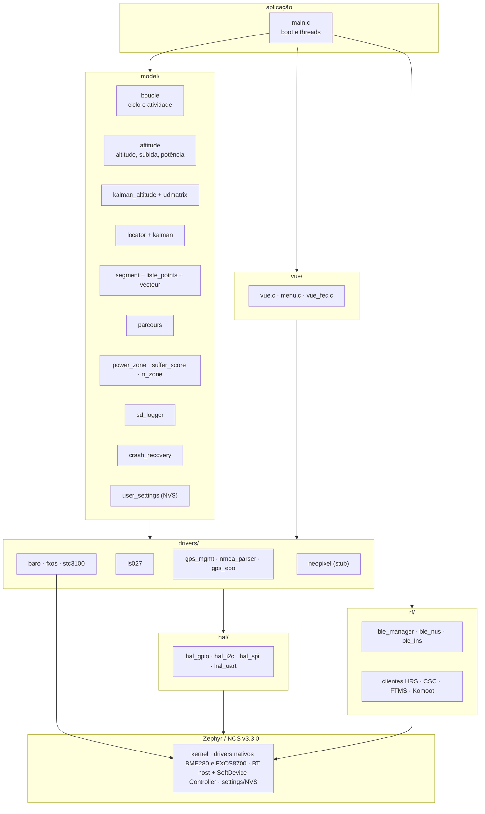
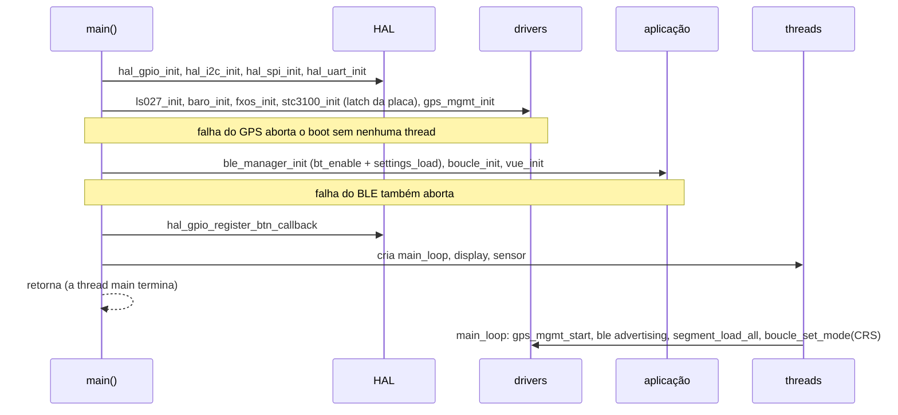
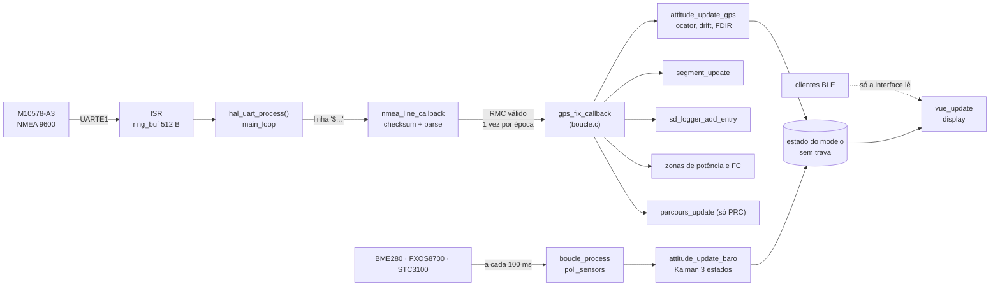

# Arquitetura do port Zephyr

Como o `zephyr_app/` está organizado: camadas, boot, threads, fluxo de dados, pilhas medidas, devicetree e configuração. O estado de cada módulo em relação ao legacy está em [10-status-do-port.md](10-status-do-port.md).

**Nesta página:** [Camadas](#camadas) · [Boot](#boot) · [Threads](#threads) · [Fluxo de dados](#fluxo-de-dados) · [Pilhas](#pilhas) · [Módulos](#módulos) · [Devicetree e alvo](#devicetree-e-alvo) · [Configuração](#configuração) · [Regras de concorrência](#regras-de-concorrência)

## Camadas



Os nomes em francês vêm do legacy (`boucle` = laço, `vue` = tela, `parcours` = percurso, `liste_points`, `vecteur`); o glossário está em [04-arquitetura-legacy.md](04-arquitetura-legacy.md#glossário).

## Boot



- Os drivers nativos do Zephyr (BME280, FXOS8700) iniciam antes do `main()`, no nível POST_KERNEL; o FXOS recebe o pulso de reset pelo `reset-gpios` do overlay.
- O `stc3100_init()` escreve `REG_CONTROL` com IO0 em nível baixo, o que mantém a placa ligada depois de soltar o botão central (ver [02-hardware.md](02-hardware.md#alimentação)). Se o I2C falhar, a placa real desliga ao soltar o botão.
- Um aborto no boot não aparece na tela: só no log.

## Threads

| Thread | Função | Pilha | Prioridade | Período | Faz |
|---|---|---|---|---|---|
| `main_loop` | `main_thread` | 4096 B | 5 | 100 ms | botões (polling), `gps_mgmt_process()` (drena a UART, parseia NMEA, callback de fix), `boucle_process()` (sensores a 100 ms, Kalman, estado), LED a cada 1 s |
| `display` | `display_thread` | 2048 B | 7 | 50 ms | `vue_update()` a cada 250 ms, `ls027_toggle_vcom()` a cada 1 s |
| `sensor` | `sensor_thread` | 1024 B | 6 | 100 ms | a cada 1 s: `baro_trigger`, `fxos_trigger`, `stc3100_trigger`, `ble_manager_update_battery` |
| ISR da UARTE1 | `uart_isr_callback` | pilha de ISR (2048 B) | IRQ | por byte | **só copia bytes** para o `ring_buf` de 512 B |
| sistema | log, BT RX/TX, MPSL, workqueue | do Zephyr | — | — | pilha BLE e log deferido |

A `sensor` e a `main_loop` leem os mesmos sensores sem trava (tráfego I2C dobrado e `latest_data` compartilhado); consolidar numa só é parte da fase 1 do roteiro.

## Fluxo de dados



Até 2026-09-18 tudo o que está depois da ISR rodava dentro dela, uma vez por sentença NMEA.

## Pilhas

Medidas com `CONFIG_STACK_USAGE=y` (arquivos `.su` do GCC) em 2026-09-18; a soma segue a cadeia de chamadas mais funda.

| Cadeia | Quadros (bytes) | Total aproximado |
|---|---|---|
| Kalman, na `main_loop` | `main_thread` 8 + `boucle_process` 48 + `attitude_update_baro` 104 + `kalman_altitude_update` 16 + **`measurement_update` 1672** + `udmat_invert` 352 | **~2.200 B** + quadro de exceção com FPU |
| GPS, na `main_loop` | `gps_mgmt_process` 8 + `hal_uart_process` 80 + `nmea_line_callback` 16 + `gps_fix_callback` 176 + `sd_logger_add_entry` 24 + `write_buffer_to_file` 400 + `snprintf` com float | ~1,2 KB |
| Botão central longo | `process_button` 40 + `boucle_save_activity` 512 + `snprintf` e `fs_*` | ~1,2 KB |
| Tela | `vue_update` 272 + `snprintf` com float | < 1 KB |

A pilha antiga de 2.048 B da `main_loop` estourava na primeira atualização do Kalman (a guarda da MPU transforma o estouro em falha fatal). Para refazer a medição:

```sh
source tools/fw/ncs_env.sh
cd zephyr_app
python -m west build -p always -b nrf52840dk/nrf52840 -d build_su --no-sysbuild . -- -DCONFIG_STACK_USAGE=y
find build_su/CMakeFiles/app.dir -name "*.su" -exec cat {} + | sort -t$'\t' -k2 -rn | head
```

## Módulos

| Pasta | Arquivos | Ligado ao fluxo |
|---|---|---|
| `src/hal/` | `hal_gpio.c`, `hal_i2c.c`, `hal_spi.c`, `hal_uart.c` | sim; `hal_spi` só na inicialização (o LCD usa o SPI direto) |
| `src/drivers/gps/` | `gps_mgmt.c`, `nmea_parser.c`, `gps_epo.c` | sim, exceto EPO e host aiding |
| `src/drivers/lcd/` | `ls027.c` | sim |
| `src/drivers/sensors/` | `baro.c` e `fxos.c` (sobre os drivers nativos), `stc3100.c` (I2C direto) | sim |
| `src/drivers/` | `neopixel.c` | não (stub: falta o nó `led-strip`) |
| `src/model/` | `boucle`, `attitude`, `kalman_altitude`, `udmatrix`, `kalman`, `locator`, `segment`, `liste_points`, `vecteur`, `power_zone`, `suffer_score`, `sd_logger`, `crash_recovery`, `user_settings` | sim |
| `src/model/` | `parcours` | parcial (`load`/`start` sem chamador) |
| `src/model/` | `loc_source`, `baro_drift`, `rr_zone`, `zwift` | não (descartados pelo linker) |
| `src/rf/` | `ble/ble_manager.c`, `ble_nus.c`, `ble_lns.c`, `ble_*_client.c` | parcial (scan nunca iniciado) |
| `src/vue/` | `vue.c` | sim |
| `src/vue/` | `menu.c`, `vue_fec.c`, `vue_crs.c` | não |
| `src/usb/` | `usb_cdc.c`, `usb_msc.c` | fora do `CMakeLists.txt` |
| `src/utils/` | `fs_stubs.c` | sim: todas as chamadas `fs_*` retornam `-ENOTSUP` |
| `src/utils/` | `utils.c`, `ring_buffer.c` | não (sem header, sem chamador) |

## Devicetree e alvo

O build usa a placa `nrf52840dk/nrf52840` com o overlay `boards/nrf52840_strava.overlay`, que aplica os pinos da placa myStravaB V3. O `CMakeLists.txt` fixa `BOARD` e `DTC_OVERLAY_FILE`; por isso o `boards/nrf52840dk_nrf52840.overlay` (console USB CDC) **não é usado**.

| Periférico | Instância | Pinos | Observação |
|---|---|---|---|
| I2C dos sensores | `i2c0` (TWI) 400 kHz | SDA P1.00, SCL P1.01 | BME280 0x76, FXOS8700 0x1E, STC3100 0x70 |
| GPS | `uart1` 9600 | TX P0.05, RX P0.07 | reset P0.03 e standby P1.15 ativos baixos; FIX P1.14 |
| LCD | `spi1` 2 MHz | SCK P0.15, MOSI P0.16, CS P0.17 (ativo alto) | driver próprio `ls027.c` |
| SD | `spi2` 8 MHz | MOSI P0.25, CS P0.26, SCK P0.27, MISO P0.28 | nó `sdhc-spi-slot` presente, FS desligado |
| Console | `uart0` 115200 | TX P0.06, RX P0.08 | pinos sem conexão na placa real: log só no DK |
| Botões | GPIO | P0.14, P0.13, P0.11 | ativos baixos com pull-up |

Nós do DK desligados no overlay porque ocupam pinos da placa: `qspi` e `mx25r64`, `spi3`, `pwm0`; o `uart0` perdeu RTS/CTS. Detalhes e divergências em [02-hardware.md](02-hardware.md).

## Configuração

| Arquivo | O que define |
|---|---|
| `prj.conf` | log por UART (RTT desligado), BLE central + periférico (4 conexões), settings/NVS, SPI, I2C, UART por interrupção, `CONFIG_RING_BUFFER`, `CONFIG_RESET_ON_FATAL_ERROR`, `CONFIG_SENSOR` (liga BME280 e FXOS8700 nativos), otimização de tamanho |
| `sysbuild.conf` | `SB_CONFIG_PARTITION_MANAGER=n` |
| `CMakeLists.txt` | fontes por camada, `-Wall -Wextra`, `BOARD` e overlay fixos |

Flash: aplicação a partir de `0x0`, `storage_partition` de 32 KB em `0xF8000` (NVS: bonds e configurações). RAM: 118.080 de 262.144 B, com `seg_runtime` (22 KB), heap do sistema (16 KB) e framebuffer (12,5 KB) à frente.

## Regras de concorrência

1. **ISR não processa**: só copia dados para um buffer (`ring_buf`, `k_msgq`) e acorda quem processa. Nada de `k_mutex_lock`, arquivo, `snprintf` com float ou trigonometria em ISR.
2. **Um dono por estrutura**: o estado do modelo é escrito pela `main_loop`; quem lê de outra thread (a `display`) precisa de trava ou de uma cópia publicada. Hoje não há trava: é um defeito aberto.
3. **Callbacks do BT** rodam na thread RX do host (cooperativa): copie o dado e saia; não segure mutex por muito tempo nem chame o modelo inteiro de lá.
4. **Pilha**: toda thread nova ou mudança de cadeia pesada passa pela medição com `CONFIG_STACK_USAGE` e deixa pelo menos 1 KB de folga.

Procedimento completo na skill `fw-threads`.
