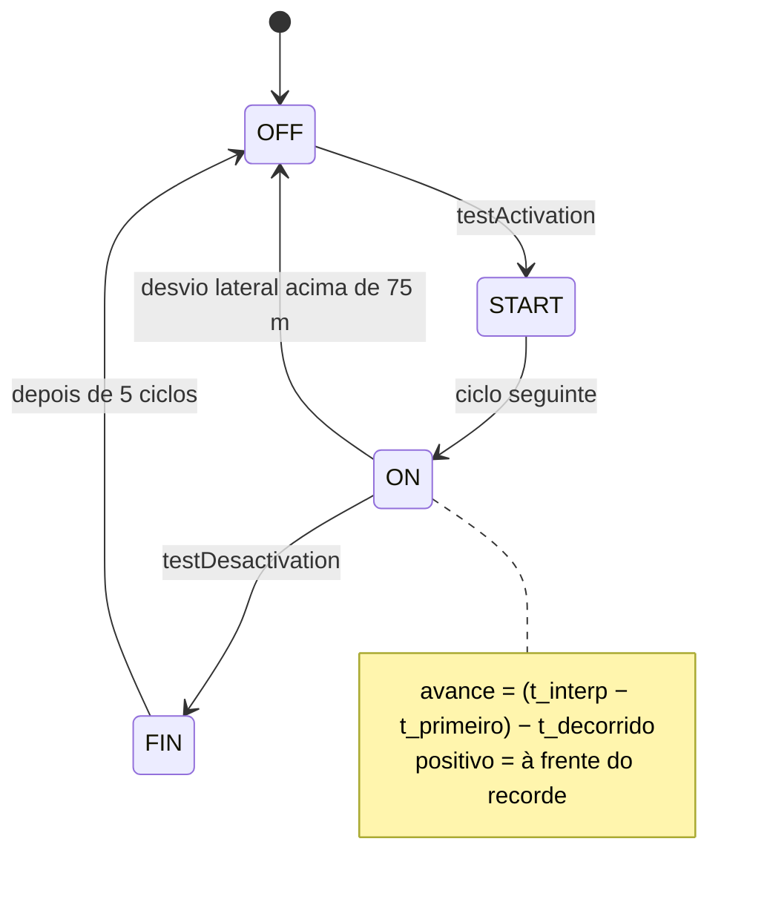

# Algoritmos

Os cálculos do stravaV10 original, com fórmulas, constantes e a origem no código, lado a lado com o que o port faz hoje. Diferença não documentada aqui é defeito: corrija o código ou registre a decisão nesta página. Testes de fidelidade ficam em `zephyr_app/tests/host/` (skill `fw-testes`).

**Nesta página:** [Distância](#distância) · [Vetores e posição relativa](#vetores-e-posição-relativa) · [Segmentos](#segmentos) · [Mapa e zoom](#mapa-e-zoom) · [Altitude: Kalman de 3 estados](#altitude-kalman-de-3-estados) · [Barômetro e drift](#barômetro-e-drift) · [Potência estimada](#potência-estimada) · [Distância acumulada e log](#distância-acumulada-e-log) · [Zonas](#zonas) · [Fontes de posição](#fontes-de-posição) · [Bateria](#bateria)

## Distância

| | Legacy (`libraries/utils/utils.h:36-48`) | Port (`zephyr_app/src/model/vecteur.c`, desde 2026-09-19) |
|---|---|---|
| Fórmula | equiretangular: `d = 2R·√((Δφ/2)² + ½(1 + cos(φ1+φ2))·(Δλ/2)²)` | a mesma |
| Raio | 6.371.008 m | o mesmo |
| Custo | 1 cosseno e 1 raiz | o mesmo |

O port usava haversine com 6.371.000 m até 2026-09-19 (diferença abaixo de 0,5 % em trechos de 5 km, mas 4 senos e cossenos, 2 raízes e um `atan2f`); o `locator_calc_distance()` agora chama a mesma função, e não há duas implementações. Latitude e longitude são `float` nos dois firmwares: cerca de 0,4 m de resolução em latitudes médias.

**Acúmulo** (`legacy/source/model/Attitude.cpp:431-490`, port em `src/model/distance.c` com `test_distance`): soma a distância entre posições **brutas**, qualquer que seja a velocidade; enquanto não começou, o primeiro salto acima de 25 m joga o total fora (a posição anterior à primeira é (0, 0)) e liga a contagem; daí em diante, cada 15 m é um instantâneo, que salva o ponto e o estado para a recuperação de falha. Com épocas de 8 m (30 km/h a 1 Hz) o instantâneo sai a cada duas épocas, isto é, a cada 16 m: a regra pede **mais** de 15 m desde o último.

## Vetores e posição relativa

- `Vecteur(P1, P2)`: `x` = distância leste-oeste, `y` = norte-sul, com sinal pela direção (`legacy/source/routes/Vecteur.cpp:36-52`). Produto escalar só em x e y; normalização ignora vetores menores que 1 mm.
- O `Vecteur::project()` do legacy multiplica componente a componente e **não é usado**; o `vecteur_project()` do port faz projeção de verdade e também não é usado.
- **Posição relativa** (`ListePoints::updateRelativePosition`, `legacy/source/routes/ListePoints.cpp:239-331`; port em `liste_points.c:296-356` e `vecteur.c:222-282`, fórmula fiel):
  1. Menos de 5 pontos: nada.
  2. P1 = ponto mais próximo, P2 = segundo mais próximo.
  3. Se `d(P1) > 50 m` ou `d(P2)² ≥ d(P1P2)² + d(P1)²` (fora do "triângulo"): `pos = (0, 0, P1.alt, P1.t)`.
  4. Senão: `x = P1P·P1P2/|P1P2|`, `y = P1P·orto/|orto|` com `orto = (P1P2.y, −P1P2.x)`, e altitude e tempo interpolados: `z = P1.alt + (P2.alt − P1.alt)·x/|P1P2|`, `t = P1.t + (P2.t − P1.t)·x/|P1P2|`.

## Segmentos

Constantes (`legacy/source/routes/Segment.h:21-38`): `DIST_ACT` 50 m, `MARGE_ACT` 1,5, `PSCAL_LIM` 0, `DIST_ALLOC` 300 m, `MARGE_DESACT` 2,0; estados `SEG_OFF` 0, `SEG_START` 1, `SEG_ON` 2, `SEG_FIN` −5.

- **Ativação** (`Segment.cpp:253-308`): posição atual a no máximo 50 m do 1º ponto; vetor de movimento (histórico[1] → histórico[0]) e vetor do segmento (ponto 1 → ponto 2) normalizados com produto escalar maior que 0; e `d(P2)² < d(P1)² + d(P1P2)²` (o ciclista já passou da perpendicular ao início).
- **Término** (`Segment.cpp:315-351`): com P1 = penúltimo e P2 = último ponto, `d(P2) ≤ 50 m`, `d(P1)² > d(P2)² + d(P1P2)²` e `d(P1) < 50` ou `d(P2) < 50`.
- **Desempenho** (`majPerformance`, `Segment.cpp:357-460`): `_monCur = t − _monStart`, `_monAvance = (t_interp − t_primeiro) − _monCur`, `_monPDist = índice_P1/tamanho`, `_monPElev = (z_interp − alt_atual)/elev_total` quando a subida total passa de 5 m.
- **Alocação** (`sd_functions.cpp:518-598`): carrega um segmento quando o ciclista chega a 300 m do início (posição codificada no nome do arquivo), libera quando se afasta; um segmento ativo a mais de 600 m da polilinha volta a OFF.
- **Prioridade na tela** (`getScore`): FIN 10, ON 3 a 9 conforme o avanço, START 2, OFF 1.

| Item | Legacy | Port |
|---|---|---|
| fórmulas de ativação, término e posição relativa | — | fiéis (`vecteur.c`) |
| ordem do histórico | índice 0 = mais recente | igual desde 2026-09-19 |
| janela do histórico | `push_front` e `pop_back` em `ajouteFinIso` | igual desde 2026-09-19 (antes a lista congelava ao chegar ao máximo) |
| pontos do segmento | limitados pelo heap, ordem do arquivo | pool de 3 × 256 pontos, ordem do arquivo |
| segmento maior que o slot | carrega inteiro até a memória acabar | dividido pela metade a cada vez que o slot enche (`liste_decimate()`), início e fim preservados |
| segmentos carregados ao mesmo tempo | quantos couberem no heap | 3; o quarto espera um slot livre |
| `DIST_ALLOC` / `MARGE_DESACT` | 300 m / 2,0 sobre a polilinha | 300 m / 2,0 sobre o 1º ponto |
| `HISTO_POINT_SIZE` | 20 | 20 desde 2026-09-19 (era 15) |
| FIN | 5 ciclos, mostrado na tela | 16 ciclos, `segment_get_best` ignora FIN |
| `pct_elev` | `(z_interp − alt_atual)/Δalt` | `(z_interp − alt_inicial)/ganho` |

A distância ao segmento mais próximo (`segment_get_nearest_distance()`) e a lista de segmentos vizinhos (`segment_get_nearby()`) saem da posição codificada no **nome** do arquivo, então valem para os segmentos que ainda não foram abertos — é o que o legacy faz no alocador (`sd_functions.cpp:547-556`).

## Mapa e zoom

O que a tela desenha do percurso e dos segmentos sai do modelo já projetado, em **por mil da janela**, com o ciclista no meio (500, 500). O módulo puro `src/model/map_project.c` faz a conta, com `test_map_project` (8 casos).

| Item | Legacy (`display/Zoom.cpp`) | Port |
|---|---|---|
| meia-janela | `nível² × 250 / 10²` m, com 100 níveis e o padrão no nível 10 (250 m) | cinco passos: 100, 250, 500, 1.000 e 2.500 m; o nível 2 é o padrão do legacy |
| vertical | `h_zoom × altura / largura` da janela | igual: a projeção recebe a forma da janela (240 × 107, 2.243 ‰) e mantém o metro do mesmo tamanho nos dois eixos |
| distância | equiretangular de `utils.h` | igual (`distance_between()`) |
| pontos na tela | todos | no máximo 160 do percurso e 64 do segmento, percorridos com passo (`map_stride()`) |
| barra de escala | não tinha | número redondo que ocupa no máximo metade da largura |

## Altitude: Kalman de 3 estados

Estado `X = [h, α_bar, α0]`: elevação, pitch medido e offset de montagem do acelerômetro. Observações `Z = [altitude do barômetro, pitch do FXOS]`. Legacy em `legacy/source/model/Attitude.cpp:113-288` e `libraries/kalman/`; port em `zephyr_app/src/model/kalman_altitude.c` e `udmatrix.c`.

| Item | Legacy | Port |
|---|---|---|
| Transição | `A = [[1, dl, −dl], [0, 1, 0], [0, 0, 1]]`, `dl = v·Δt` | igual |
| Q | `diag(0.03, 0.10, 0.0002)` | igual |
| R | `diag(1000, 600)` | igual |
| P0 | 900 em **todos** os 9 elementos (`matP.ones(900)`) | igual desde 2026-09-19 (o `udmat_ones` gerava identidade) |
| Limite de P⁻ | `fabs(x) < min → +min`, `fabs(x) > max → +max`, em [1e-15, 1e12] | igual desde 2026-09-19 (comparava o valor com sinal e transformava todo negativo em +1e-15, zerando as covariâncias cruzadas: **α0 nunca era estimado**) |
| `P⁻ = A·P·Aᵀ + Q` | soma matricial | igual desde 2026-09-19; o `udmat_add()` do port zerava o destino antes de ler a entrada e, como a soma escreve no próprio `P⁻`, a predição virava só `Q` e o filtro quase não se movia |
| Velocidade mínima | 1,5 m/s | igual |
| Taxa | uma vez por localização (1 Hz), barômetro médio de 1 s (`FILTRE_NB` = 10) | igual desde 2026-09-19 (rodava a cada amostra do barômetro, 10 Hz, com a pressão instantânea) |
| Pitch | `−atan2f(Ay, −Az)` da média de 50 amostras (eixos da V11) | média de 50 amostras a 50 Hz, pelas equações do AN4248 nos eixos da placa ([Inclinação, rumo e rugosidade](#inclinação-rumo-e-rugosidade)) |
| Saídas | `slope = α_bar − α0`; com mais de 60 pontos: `att.slope = 100·slope`, `vit_asc = slope·v` | igual, mas o contador de pontos avançava por sentença NMEA (corrigido: agora por época) |

## Barômetro e drift

- **Altitude** (`libraries/AltiBaro/AltiBaro.cpp:254-272`): `h = 44330·(1 − (P/P0)^0,1903) − correção`, média de 10 amostras (1 s).
- **Referência ao nível do mar** (`:284-305`): `P0 = P / (1 − h_GPS/44330)^5,255`, calculada depois de 15 pontos GPS.
- **Drift** (`Attitude.cpp:306-339`): a cada fix GPS ou LNS, `alt_div = τ·alt_div + (1 − τ)·(h_baro_corrigida − h_GPS)` com `τ = 800/801`, e a correção vira `alt_div`. Como a entrada já vem corrigida, a correção converge para metade do drift real, com constante de cerca de 400 amostras. O port reproduz isso em `attitude.c:225-235`.
- **Subida** (`:342-356`): histerese de 2 m (`CLIMB_ELEVATION_HYSTERESIS_M`); o port usa os mesmos 2 m.
- Configuração do BME280 no legacy: pressão ×16, temperatura ×1, umidade desligada, IIR ×16, standby 62,5 ms (~10 Hz). O driver nativo do Zephyr está em pressão ×16, temperatura ×2, umidade ×16, IIR ×4, standby 1000 ms (~1 Hz).

## Potência estimada

| | Legacy (`Attitude.cpp:556-575`) | Port (`power_estimate.c`, desde 2026-09-19) |
|---|---|---|
| Fórmula | `P = 1,025·[9,81·W·v_z + 0,004·9,81·W·v + 0,204·v³]` | a mesma |
| Massa | só o ciclista (padrão 79 kg) | a mesma (`DEFAULT_WEIGHT` passou a 790, 79,0 kg) |
| Negativo | permitido (`SAtt.pwr` é `int16_t`) | permitido; satura em ±32.767 em vez de dar a volta |
| Velocidade usada | a da posição **anterior**: o legacy chama `computePower()` antes de atualizar `m_speed_ms` (`Attitude.cpp:509-524`) | a mesma, e o filtro de altitude também recebe a anterior |
| 30 km/h no plano | ≈ 147 W | ≈ 147 W |
| 12 km/h a 5 % | ≈ 151 W | ≈ 151 W |

`0,204·v³` equivale a CdA ≈ 0,333 m² com ρ = 1,225. O oráculo do `test_power_estimate` é a transcrição da função do legacy em `tests/host/support/legacy_ref.h`; a fórmula antiga do port (rolamento 0,005, CdA 0,15, massa com 10 kg de bicicleta) dava 88 W a 30 km/h no plano e saiu em 2026-09-19.

## Distância acumulada e log

- Legacy (`Attitude::computeDistance`, `Attitude.cpp:431-490`): soma a distância entre posições brutas; descarta os primeiros 25 m; a cada 15 m guarda um snapshot e, com 5 snapshots, grava no SD e atualiza o estado salvo para FDIR (CRC-8).
- Port: igual ao legacy desde 2026-09-19 (`distance.c`): posições brutas, sem porta de velocidade, com o descarte dos primeiros 25 m e o instantâneo a cada 15 m, que agora é quem salva o estado da recuperação de falha (antes era a cada segundo). O `sd_logger` mantém os mesmos 15 m e lotes de 5 do legacy, e a distância filtrada do `locator.c` continua disponível para quem quiser.

## Zonas

| Módulo | Regras (legacy) | Port |
|---|---|---|
| Potência (`PowerZone.cpp`) | 7 zonas com limites × FTP: −100, 0,55, 0,75, 0,90, 1,05, 1,20, 1,50, 100; só 50 a 1950 W; a primeira amostra só inicia o relógio; alimentado só em FEC, com a potência do rolo a cada dado (`BoucleFEC.cpp:75`) | `power_zone.c` fiel (`test_power_zone`), alimentado da mesma forma; FTP das configurações (200 W sem elas) |
| Suffer score (`SufferScore.cpp`) | FC em (80,120], (120,144], (144,165], (165,176], >176; 16, 33, 72, 85 e 95 pontos por hora; alimentado a cada volta do laço, em todos os modos, com a FC que houver (`Model.cpp:377`, ~50 ms) | `suffer_score.c` fiel (`test_suffer_score`); alimentado a cada 1 s com a FC do momento, 0 com a cinta perdida ou sem dado há 5 s |
| RR (`RRZone.cpp`) | limites de FC −1000, 70, 108, 143, 161, 178, 1000; RMSSD de 20 intervalos por zona; `addRRData` a cada volta do laço, que repete o último RR até o batimento seguinte (`Model.cpp:378`) | `rr_zone.c` fiel, alimentado a cada dado da cinta com RR: cada intervalo entra uma vez |

## Inclinação, rumo e rugosidade

Legacy: `legacy/source/sensors/fxos.cpp`. Port: `zephyr_app/src/svc/sensors/tilt.c`, no serviço de sensores, testado por `test_tilt`.

| Item | Legacy | Port |
|---|---|---|
| Amostragem | FXOS8700 em modo híbrido a 50 Hz (`fxos.cpp:600`), ±4 g (`:484`) | acelerômetro pela API de sensores do Zephyr a 50 Hz, em m/s² |
| Janela | média de 50 amostras, 1 s (`MAX_ACCEL_AVG_COUNT`, `:72`, `:741-758`) | igual |
| Rugosidade | desvio médio absoluto de cada eixo na janela, em contagens (`:761-766`) | igual, convertida para contagens de ±4 g (2048 por g) para os números da tela baterem com os do legacy; o quarto valor, do barômetro (`baro.getRoughness()`), ainda não foi portado |
| Inclinação e rolagem | `atan2f` sobre os eixos da V11 | equações do AN4248 da Freescale sobre os eixos da placa (X à frente, Y à esquerda, Z para cima); a montagem dos sensores na placa nova a confirmar |
| Rumo | magnetômetro médio menos os offsets da calibração (`:776-777`), `atan2f` sem compensação da inclinação (`:815-821`) | AN4248, eq. 22, com a inclinação e a rolagem da janela; calibração ainda não portada |

## Fontes de posição

Legacy (`legacy/source/model/Locator.cpp:111-134`): a simulada (`$LOC`) vence e bloqueia as outras por 2 s; o GPS vence e bloqueia por 1,5 s; o LNS (celular via BLE) só é aceito sem fix no pino FIX. Depois de 5 posições LNS seguidas, envia host aiding (`$PMTK741`) ao GPS. O port tem o árbitro em `loc_source.c`, sem chamador.

### Do MAX-M10N (placa nova)

- Uma época por segundo em `UBX-NAV-PVT`: posição em 1e-7 grau, altitude sobre o nível do mar em mm, velocidade 2D em mm/s, rumo em 1e-5 grau e `numSV`. O port converte para as unidades do Zephyr (nanograus, mm, mm/s, milésimos de grau) no driver, e o serviço para as do modelo.
- **Diferença registrada:** o `hdop` publicado é o **pDOP** do `UBX-NAV-PVT` (escala 0,01, multiplicado por 10 para os milésimos da API do Zephyr). O legacy lia o HDOP do `$GPGSA` (`legacy/source/model/Locator.cpp:24`) e não o usava em conta nenhuma; aqui ele só alimenta o serviço de localização do BLE. O horizontal exato pediria o `UBX-NAV-DOP`, uma mensagem a mais por época.
- A hora só sai do receptor quando `valid` traz data **e** hora (bits 0 e 1); sem isso o campo de hora vai zerado e o modelo não usa.
- O fix vale quando `gnssFixOK` está ligado, `invalidLlh` desligado e o tipo é 2D ou 3D; morto por estimativa (`dead reckoning`) vira "fix estimado" e não conta como posição válida no serviço.

## Recuperação de falha (FDIR)

`legacy/source/model/Attitude.cpp:393-417` e `:480-481`; port em `crash_recovery.c` e `attitude.c` (`test_crash_recovery`).

| Passo | Legacy | Port |
|---|---|---|
| Gravar | a cada 15 m, copia `att` inteira e calcula CRC-8 | igual (o instantâneo da distância manda), com posição, data, distância, subida, pontos, segundos ativos e recorde |
| Restaurar | ao inicializar a referência do nível do mar (depois de 15 pontos), se o CRC bate **e** a data é a mesma | igual |
| Uma vez | zera o CRC depois de restaurar | zera o bloco e marca 0xFF no CRC (o CRC-8 de um bloco de zeros é zero) |
| Avisar | notificação "FDIR / Attitude restored" | `app_notify("FDIR", "Atitude restaurada", ...)` pelo serviço do modelo |
| Causa do reset | `RESETREAS` lido uma vez | `hwinfo` lido e guardado no boot: a leitura limpa o registrador, então o valor fica latcheado |

## Bateria

- Legacy (`libraries/utils/utils.c:290-312`, `percentageBatt`): compensa a queda na resistência interna (0,273 Ω) e usa um polinômio cúbico entre 3,78 e 4,2 V e `10^−11,4·V^22,315` entre 3,2 e 3,78 V.
- Port (placa nova): a carga é o `RepSOC` do MAX17262 (ModelGauge m5 EZ: modelo da célula mais contagem de carga), lido pela API de fuel gauge do Zephyr com o driver próprio de `zephyr_app/modules/gnss_drivers` (as unidades da ficha, tabela 2, em `max17262_regs.h`, com `test_max17262`). O medidor declara 0 % na tensão de vazio (`VEmpty`, 3,3 V, o valor de fábrica). Sem medidor (o alvo da V3, cujo STC3100 não tem driver no Zephyr), a tela não mostra bateria.
- Bateria fraca e crítica (`src/svc/power/battery.c`, `test_battery`), novas: o legacy não tem regra de bateria baixa. Uma notificação ao chegar a 10 % descarregando, outra só depois de subir a 15 %; a 0 % descarregando, a máquina de sistema grava e desliga. Carregando (VBUS ou corrente média positiva, como a do painel), nunca é crítica.
- STC3100 (os dois): V = raw·2,44 mV, I = raw·11,77 µV/Rs, Q = raw·6,7 µVh/Rs, T = raw·0,125 °C, com Rs = 100 mΩ no código. O esquema da V3 mostra R15 = 20 mΩ: se for esse o valor montado, corrente e carga ficam 5 vezes menores que o real.

## Formatação dos números

Legacy: `legacy/source/vue/Screenutils.cpp` (`_fmkstr`, `_secjmkstr`) e `legacy/source/vue/Vue.cpp` (`cadran`, `cadranH`). Port, na interface nova: `zephyr_app/src/ui/ui_fmt.c`, testado por `test_ui_fmt` contra a transcrição do legacy em `zephyr_app/tests/host/support/legacy_ref.h`.

| Regra | Legacy | Port |
|---|---|---|
| Casas decimais | truncadas dígito a dígito em `float`: 0,21 vira `0.20` e 23,4 vira `23.39` | igual |
| Separador decimal | ponto | igual |
| Valor absoluto acima de 100000 | `---` | igual |
| Negativo entre −1 e 0 | o sinal fica (`-0.5`) | igual |
| NaN | `(int)NaN`, comportamento indefinido em C | `---` |
| Hora do dia ou tempo decorrido | `HH:MM:SS`; de 24 h em diante, ` --:--:--`, com um espaço na frente | igual, mas `--:--:--` sem o espaço |
| Texto do `cadran` | `---` acima de 6 caracteres | igual |
| Texto do `cadranH` | `-----` acima de 9 caracteres | igual |
