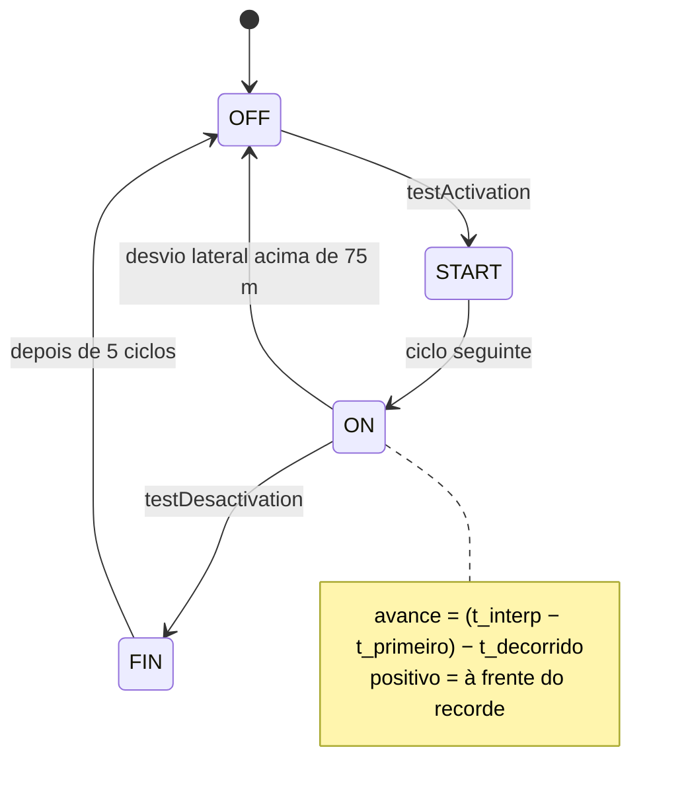

# Algoritmos

Os cálculos do stravaV10 original, com fórmulas, constantes e a origem no código, lado a lado com o que o port faz hoje. Diferença não documentada aqui é defeito: corrija o código ou registre a decisão nesta página. Testes de fidelidade ficam em `zephyr_app/tests/host/` (skill `fw-testes`).

**Nesta página:** [Distância](#distância) · [Vetores e posição relativa](#vetores-e-posição-relativa) · [Segmentos](#segmentos) · [Altitude: Kalman de 3 estados](#altitude-kalman-de-3-estados) · [Barômetro e drift](#barômetro-e-drift) · [Potência estimada](#potência-estimada) · [Distância acumulada e log](#distância-acumulada-e-log) · [Zonas](#zonas) · [Fontes de posição](#fontes-de-posição) · [Bateria](#bateria)

## Distância

| | Legacy (`libraries/utils/utils.h:36-48`) | Port (`zephyr_app/src/model/vecteur.c:72`) |
|---|---|---|
| Fórmula | equiretangular: `d = 2R·√((Δφ/2)² + ½(1 + cos(φ1+φ2))·(Δλ/2)²)` | haversine completa |
| Raio | 6.371.008 m | 6.371.000 m |
| Custo | 1 cosseno e 1 raiz | 4 senos/cossenos, 2 raízes e 1 `atan2f` |

Em trechos de até 5 km a diferença fica abaixo de 0,5 % (`test_vecteur`). Latitude e longitude são `float` nos dois firmwares: cerca de 0,4 m de resolução em latitudes médias.

## Vetores e posição relativa

- `Vecteur(P1, P2)`: `x` = distância leste-oeste, `y` = norte-sul, com sinal pela direção (`legacy/source/routes/Vecteur.cpp:36-52`). Produto escalar só em x e y; normalização ignora vetores menores que 1 mm.
- O `Vecteur::project()` do legacy multiplica componente a componente e **não é usado**; o `vecteur_project()` do port faz projeção de verdade e também não é usado.
- **Posição relativa** (`ListePoints::updateRelativePosition`, `legacy/source/routes/ListePoints.cpp:239-331`; port em `liste_points.c:296-356` e `vecteur.c:222-282`, fórmula fiel):
  1. Menos de 5 pontos: nada.
  2. P1 = ponto mais próximo, P2 = segundo mais próximo.
  3. Se `d(P1) > 50 m` ou `d(P2)² ≥ d(P1P2)² + d(P1)²` (fora do "triângulo"): `pos = (0, 0, P1.alt, P1.t)`.
  4. Senão: `x = P1P·P1P2/|P1P2|`, `y = P1P·orto/|orto|` com `orto = (P1P2.y, −P1P2.x)`, e altitude e tempo interpolados: `z = P1.alt + (P2.alt − P1.alt)·x/|P1P2|`, `t = P1.t + (P2.t − P1.t)·x/|P1P2|`.

## Segmentos

Constantes (`legacy/source/routes/Segment.h:21-38`): `DIST_ACT` 50 m, `MARGE_ACT` 1,5, `PSCAL_LIM` 0, `DIST_ALLOC` 300 m, `MARGE_DESACT` 2,0; estados `SEG_OFF` 0, `SEG_START` 1, `SEG_ON` 2, `SEG_FIN` −5.

- **Ativação** (`Segment.cpp:253-308`): posição atual a no máximo 50 m do 1º ponto; vetor de movimento (histórico[1] → histórico[0]) e vetor do segmento (ponto 1 → ponto 2) normalizados com produto escalar maior que 0; e `d(P2)² < d(P1)² + d(P1P2)²` (o ciclista já passou da perpendicular ao início).
- **Término** (`Segment.cpp:315-351`): com P1 = penúltimo e P2 = último ponto, `d(P2) ≤ 50 m`, `d(P1)² > d(P2)² + d(P1P2)²` e `d(P1) < 50` ou `d(P2) < 50`.
- **Desempenho** (`majPerformance`, `Segment.cpp:357-460`): `_monCur = t − _monStart`, `_monAvance = (t_interp − t_primeiro) − _monCur`, `_monPDist = índice_P1/tamanho`, `_monPElev = (z_interp − alt_atual)/elev_total` quando a subida total passa de 5 m.
- **Alocação** (`sd_functions.cpp:518-598`): carrega um segmento quando o ciclista chega a 300 m do início (posição codificada no nome do arquivo), libera quando se afasta; um segmento ativo a mais de 600 m da polilinha volta a OFF.
- **Prioridade na tela** (`getScore`): FIN 10, ON 3 a 9 conforme o avanço, START 2, OFF 1.

| Item | Legacy | Port |
|---|---|---|
| fórmulas de ativação, término e posição relativa | — | fiéis (`vecteur.c`) |
| ordem do histórico | índice 0 = mais recente | índice 0 = mais antigo (**defeito**) |
| pontos do segmento | limitados pelo heap, ordem do arquivo | 20, ordem invertida (**defeito**) |
| `DIST_ALLOC` / `MARGE_DESACT` | 300 m / 2,0 sobre a polilinha | 3000 m / 1,5 sobre o 1º ponto |
| `HISTO_POINT_SIZE` | 20 | 15 |
| FIN | 5 ciclos, mostrado na tela | 16 ciclos, `segment_get_best` ignora FIN |
| `pct_elev` | `(z_interp − alt_atual)/Δalt` | `(z_interp − alt_inicial)/ganho` |

## Altitude: Kalman de 3 estados

Estado `X = [h, α_bar, α0]`: elevação, pitch medido e offset de montagem do acelerômetro. Observações `Z = [altitude do barômetro, pitch do FXOS]`. Legacy em `legacy/source/model/Attitude.cpp:113-288` e `libraries/kalman/`; port em `zephyr_app/src/model/kalman_altitude.c` e `udmatrix.c`.

| Item | Legacy | Port |
|---|---|---|
| Transição | `A = [[1, dl, −dl], [0, 1, 0], [0, 0, 1]]`, `dl = v·Δt` | igual |
| Q | `diag(0.03, 0.10, 0.0002)` | igual |
| R | `diag(1000, 600)` | igual |
| P0 | 900 em **todos** os 9 elementos (`matP.ones(900)`) | 900·I (`udmat_ones` gera identidade) |
| Limite de P⁻ | valor absoluto em [1e-15, 1e12], sinal preservado | com sinal: todo negativo vira +1e-15, zerando as covariâncias cruzadas (**α0 nunca é estimado**) |
| Velocidade mínima | 1,5 m/s | igual |
| Taxa | uma vez por localização (1 Hz), barômetro médio de 1 s | a cada 100 ms com a mesma amostra do barômetro |
| Pitch | `−atan2f(Ay, −Az)` da média de 50 amostras (eixos da V11) | `atan2f(−ax, √(ay² + az²))` de uma amostra |
| Saídas | `slope = α_bar − α0`; com mais de 60 pontos: `att.slope = 100·slope`, `vit_asc = slope·v` | igual, mas o contador de pontos avançava por sentença NMEA (corrigido: agora por época) |

## Barômetro e drift

- **Altitude** (`libraries/AltiBaro/AltiBaro.cpp:254-272`): `h = 44330·(1 − (P/P0)^0,1903) − correção`, média de 10 amostras (1 s).
- **Referência ao nível do mar** (`:284-305`): `P0 = P / (1 − h_GPS/44330)^5,255`, calculada depois de 15 pontos GPS.
- **Drift** (`Attitude.cpp:306-339`): a cada fix GPS ou LNS, `alt_div = τ·alt_div + (1 − τ)·(h_baro_corrigida − h_GPS)` com `τ = 800/801`, e a correção vira `alt_div`. Como a entrada já vem corrigida, a correção converge para metade do drift real, com constante de cerca de 400 amostras. O port reproduz isso em `attitude.c:225-235`.
- **Subida** (`:342-356`): histerese de 2 m (`CLIMB_ELEVATION_HYSTERESIS_M`); o port usa os mesmos 2 m.
- Configuração do BME280 no legacy: pressão ×16, temperatura ×1, umidade desligada, IIR ×16, standby 62,5 ms (~10 Hz). O driver nativo do Zephyr está em pressão ×16, temperatura ×2, umidade ×16, IIR ×4, standby 1000 ms (~1 Hz).

## Potência estimada

| | Legacy (`Attitude.cpp:556-575`) | Port (`attitude.c:260-287`) |
|---|---|---|
| Fórmula | `P = 1,025·[9,81·W·v_z + 0,004·9,81·W·v + 0,204·v³]` | `0,005·(W+10)·9,81·v + 0,091875·v³ + (W+10)·9,81·(slope/100)·v` |
| Massa | só o ciclista (padrão 79 kg) | ciclista + 10 kg (padrão 75 kg) |
| Negativo | permitido (int16) | limitado a 0; zero abaixo de 0,5 km/h |
| 30 km/h no plano | ≈ 147 W | ≈ 88 W |
| 12 km/h a 5 % | ≈ 151 W | ≈ 156 W |

`0,204·v³` equivale a CdA ≈ 0,333 m² com ρ = 1,225. A troca para a fórmula do legacy está na fase 2 do roteiro.

## Distância acumulada e log

- Legacy (`Attitude::computeDistance`, `Attitude.cpp:431-490`): soma a distância entre posições brutas; descarta os primeiros 25 m; a cada 15 m guarda um snapshot e, com 5 snapshots, grava no SD e atualiza o estado salvo para FDIR (CRC-8).
- Port: soma posições filtradas pelo Kalman 1D do `locator.c` só acima de 2 km/h, sem o descarte inicial; o `sd_logger` mantém 15 m e lotes de 5.

## Zonas

| Módulo | Regras (legacy) | Port |
|---|---|---|
| Potência (`PowerZone.cpp`) | 7 zonas com limites × FTP: −100, 0,55, 0,75, 0,90, 1,05, 1,20, 1,50, 100; só 50 a 1950 W; a primeira amostra só inicia o relógio | `power_zone.c` fiel (`test_power_zone`); recebe a potência estimada e FTP fixo de 200 W |
| Suffer score (`SufferScore.cpp`) | FC em (80,120], (120,144], (144,165], (165,176], >176; 16, 33, 72, 85 e 95 pontos por hora | `suffer_score.c` fiel (`test_suffer_score`); recebe BPM 0 |
| RR (`RRZone.cpp`) | limites de FC −1000, 70, 108, 143, 161, 178, 1000; RMSSD de 20 intervalos por zona | `rr_zone.c` fiel, sem chamador |

## Fontes de posição

Legacy (`legacy/source/model/Locator.cpp:111-134`): a simulada (`$LOC`) vence e bloqueia as outras por 2 s; o GPS vence e bloqueia por 1,5 s; o LNS (celular via BLE) só é aceito sem fix no pino FIX. Depois de 5 posições LNS seguidas, envia host aiding (`$PMTK741`) ao GPS. O port tem o árbitro em `loc_source.c`, sem chamador.

## Bateria

- Legacy (`libraries/utils/utils.c:290-312`, `percentageBatt`): compensa a queda na resistência interna (0,273 Ω) e usa um polinômio cúbico entre 3,78 e 4,2 V e `10^−11,4·V^22,315` entre 3,2 e 3,78 V.
- Port: linear entre 3,3 e 4,2 V.
- STC3100 (os dois): V = raw·2,44 mV, I = raw·11,77 µV/Rs, Q = raw·6,7 µVh/Rs, T = raw·0,125 °C, com Rs = 100 mΩ no código. O esquema da V3 mostra R15 = 20 mΩ: se for esse o valor montado, corrente e carga ficam 5 vezes menores que o real.
