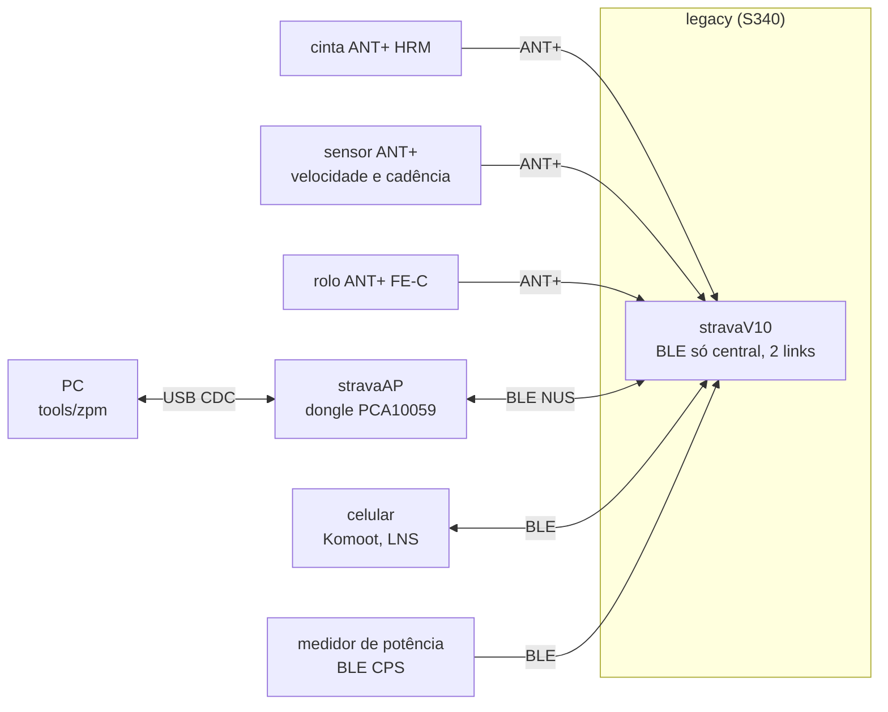
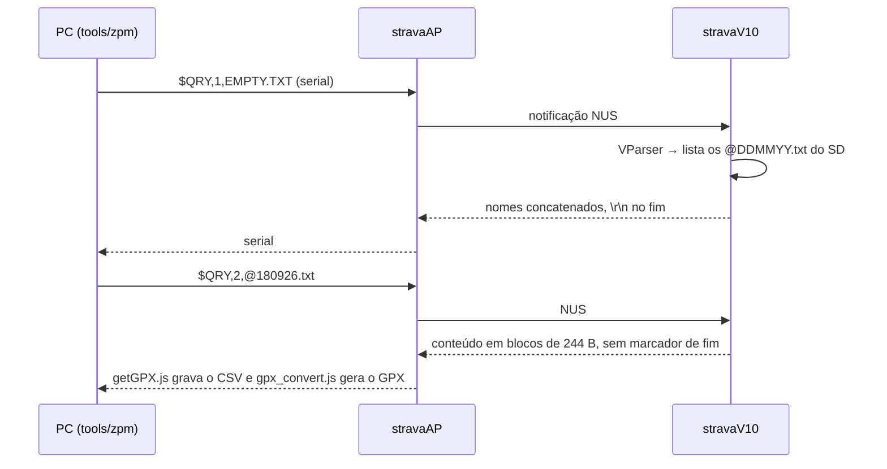

# Rádio: ANT+ e BLE

Como o stravaV10 original usa ANT+ e BLE, o que é o stravaAP, como o port Zephyr trocou os sensores ANT+ por clientes BLE e o que falta para o rádio funcionar. A decisão sobre ANT+ está em [10-status-do-port.md](10-status-do-port.md#decisões-do-dono).

**Nesta página:** [Topologia](#topologia) · [ANT+ no legacy](#ant-no-legacy) · [BLE no legacy](#ble-no-legacy) · [stravaAP e comandos](#stravaap-e-comandos) · [Komoot](#komoot) · [Rádio no port](#rádio-no-port) · [Opções para ANT+](#opções-para-ant) · [O que falta](#o-que-falta)

## Topologia

## ANT+ no legacy

Pilha do SoftDevice S340; eventos pelo `app_scheduler` (fora de ISR). Rede `ANTPLUS_NETWORK_NUMBER 0`; a chave de rede ANT+ vem do `ant_key_manager` do nRF5 SDK e **não está no repositório**.

| Canal | Uso | Device type | Número padrão |
|---|---|---|---|
| 0 | busca em background (pareamento) | curinga; troca para HRM, BSC ou FE-C na busca | 0 |
| 1 | BSC combinado (velocidade + cadência) | 0x79 | 15568, depois o salvo nas configurações |
| 2 | HRM | 0x78 (perfil) | 17334, depois o salvo |
| 3 | FE-C, aberto só ao entrar no modo FEC | 0x11 (perfil) | 15568 (Tacx do autor), depois o salvo |
| 4 | "glasses" (display remoto) | — | desativado: só 4 canais alocados |

- **HRM** (`legacy/rf/hrm.c`): BPM e intervalo RR em ms a cada batimento; até 5 reaberturas do canal.
- **BSC** (`legacy/rf/bsc.c`): só o sensor combinado; o firmware usa só a cadência.
- **FE-C** (`legacy/rf/fec.c`): lê as páginas 16 (tempo decorrido) e 25 (potência); o controle ERG/SIM (páginas 49/51) existe mas **nunca é enviado**.
- **Pareamento** (`legacy/rf/ant_device_manager.cpp`): o menu inicia a busca, lista até 7 sensores com ID e RSSI e grava o escolhido na FRAM.
- **Coexistência** com o BLE: prioridade de busca mínima e o bit de coexistência de busca de alta prioridade desligado (`legacy/rf/ant.c:297-313`); o scan BLE usa 5 ms a cada 200 ms.

## BLE no legacy

`legacy/rf/ble_api6.c` (o `ble_api5.c` é antigo e não compila com o resto). Só **central**, 2 links, MTU 247, sem pareamento (rejeita com `PAIRING_NOT_SUPP`).

| Serviço cliente | UUID | Uso |
|---|---|---|
| NUS | `6E400001-B5A3-F393-E0A9-E50E24DCCA9E` | ponte com o stravaAP: comandos e transferência de arquivos |
| LNS | 0x1819 | posição do celular para o Locator e host aiding do GPS |
| Cycling Power | 0x1818 | potência e vetor de torque (gráfico polar na tela FEC) |
| Komoot | `71C1E128-D92F-4FA8-A2B2-0F171DB3436C` | navegação curva a curva |

Scan ativo (200 ms / 5 ms) por 3 minutos com filtros "OU": nome `stravaAP`, CPS, LNS ou Komoot; conecta no primeiro que casar. Os clientes LNS, CPS e Komoot eram submódulos do autor (`libraries/ble_services`, vazio nesta cópia).

## stravaAP e comandos

O stravaAP (`legacy/AP/`) é um firmware para o dongle nRF52840 PCA10059 (S140 7.0.1, SDK 16): **ponte USB CDC ↔ BLE NUS**, periférico que anuncia "stravaAP". Os mesmos comandos também entram pela USB CDC do próprio aparelho.

| Comando | Efeito |
|---|---|
| `$LOC,secj,lat×1e7,lon×1e7,ele×100,v_cm/s` | posição simulada (fonte SIM, prioridade máxima); usado pelo `LNS.js` com o Zwift |
| `$DWN,n` | 12 teste de hardfault, 13 formata, 14 teste de memória, 15 `mkfs`, 16 modo MSC, 17 DFU (não implementado), 18 calibra o magnetômetro |
| `$QRY,tipo,arquivo` | 1 lista os logs, 2 envia um arquivo, 3 apaga |

Sem autenticação: qualquer periférico chamado "stravaAP" pode formatar a memória. O `LNS.js` depende do tráfego do Zwift, criptografado desde 2022.

## Komoot

- O celular com o app Komoot é periférico; o aparelho conecta, recebe notificação e lê a característica de navegação (`503DD605-9BCB-4F6E-B235-270A57483026`, segundo a documentação do Komoot BLE Connect).
- Pacote: identificador (4 B), direção (1 B), distância (4 B, little endian), nome da rua (UTF-8).
- O legacy mostra "Next turn" e um ícone de 110 × 110 (30 bitmaps em `libraries/komoot/komoot_icons.h`, códigos 1 a 30 mapeados em `komoot_nav.c`).

## Rádio no port

| Arquivo | Papel | Estado |
|---|---|---|
| `rf/ble/ble_manager.c` | periférico (advertising com BAS e DIS) e central (HRS 0x180D, CSC 0x1816, FTMS 0x1826) | scan **nunca iniciado**; `bt_conn_le_create` vaza referências |
| `rf/ble/ble_nus.c` | **servidor** NUS | papel invertido em relação ao legacy; RX descartado |
| `rf/ble/ble_lns.c` | **servidor** LNS | sem chamador; falta a característica LN Feature |
| `rf/ble_hrs_client.c` | cliente de frequência cardíaca | inscrição com `ccc_handle=0`: `memset(NULL)` no Zephyr 4.3; só o 1º RR |
| `rf/ble_bsc_client.c` | cliente CSC | mesma inscrição; velocidade 3600 vezes menor |
| `rf/ble_fec_client.c` | cliente FTMS (substitui o FE-C) | mesma inscrição; flags e offsets errados; control point sem indicações |
| `rf/ble_komoot_client.c` | cliente Komoot | UUID de característica, layout e papel errados |
| `include/rf/ant.h`, `glasses.h` | só stubs `static inline` | ninguém inclui |

- Os dados dos sensores BLE chegam só à tela; o modelo (log, suffer score, zonas) não recebe BPM, cadência nem potência medida.
- `CONFIG_BT_MAX_CONN=4` dá 1 conexão periférica e 3 centrais no SoftDevice Controller: exatamente o que o código tenta (1 celular, HRS, CSC, FTMS), sem folga.
- APIs conferidas no Zephyr 4.3: `bt_le_scan_start` (o `timeout = 30` vale 300 ms, não 30 s), `BT_LE_ADV_OPT_CONN` (o advertising para ao conectar), `BT_CONN_CB_DEFINE` sem `recycled`.
- Sem `CONFIG_BT_SMP`: servidores abertos e endereço fixo.

## Opções para ANT+

| Caminho | Situação |
|---|---|
| **ANT for nRF Connect SDK** (add-on da Garmin/ANT com a Nordic) | existe; suporta nRF52840 e ANT + BLE simultâneos; versão listada compatível com o sdk-nrf 3.2.4 (confirmar com o NCS 3.3.0); exige aceitar o ANT+ Adopter Agreement; chave de avaliação ou comercial; royalty para uso comercial; exemplos de HRM, BSC e potência, sem FE-C |
| **Só BLE** | HRS, CSC, CPS e FTMS; sem licença; o NCS tem cliente HRS pronto (`bt_hrs_client`), os outros são próprios; muitos sensores aceitam só 1 ou 2 conexões BLE |
| SoftDevice S340 com Zephyr, ANT sobre rádio bruto | inviáveis |

## O que falta

1. **Crítico:** iniciar o scan; inscrição com `disc_params` e `end_handle` (ou descoberta do CCC); `bt_conn_unref` depois do create; classificar conexões por papel; sensores com vários serviços.
2. **Crítico:** corrigir os parsers (velocidade CSC, flags do FTMS, vários RR) e levar os dados ao modelo (`boucle_update_hrm/bsc`, zonas, log).
3. **Importante:** pareamento com lista de sensores e `bt_addr_le_t` salvo; decisão sobre ANT+.
4. **Importante:** canal de comandos (`$LOC`, `$DWN`, `$QRY`) por NUS e USB, com o papel NUS de volta a cliente ou com uma ponte nova no PC.
5. **Importante:** cliente LNS (fonte de posição e host aiding), cliente CPS, Komoot como central com os 30 ícones do legacy.
6. **Segurança e consumo:** LESC com passkey no display, lista de permitidos, comandos destrutivos protegidos; intervalos de conexão de 100 a 500 ms e scan de baixo ciclo.

## Referências

- ANT for nRF Connect SDK: [documentação](https://ant-nrfconnect.github.io/), [compatibilidade](https://ant-nrfconnect.github.io/doc/compatibility.html), [licença](https://developer.garmin.com/ant-program/nrf-connect-sdk/).
- Komoot BLE Connect: [documentação (fork)](https://github.com/palto42/BLEConnect).
- Submódulos do autor que faltam nesta cópia: [vincent290587/ble_services](https://github.com/vincent290587/ble_services), [vincent290587/ant_profiles](https://github.com/vincent290587/ant_profiles).
