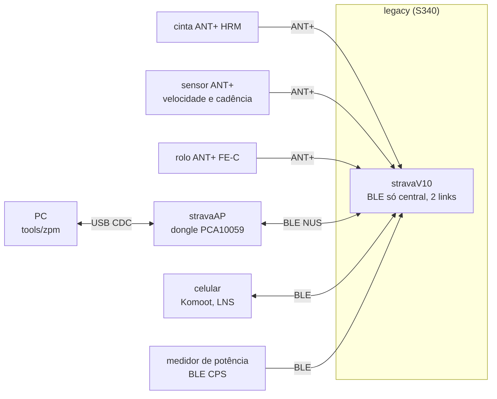
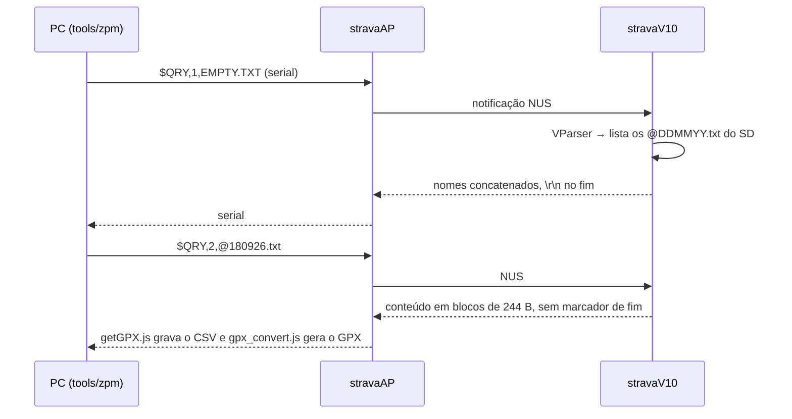
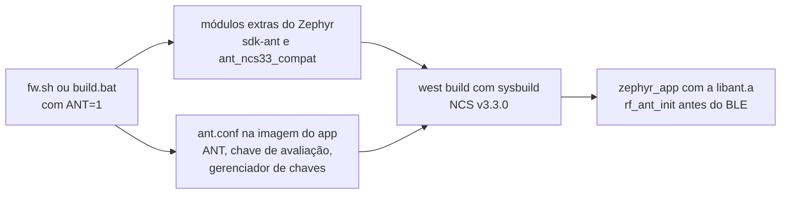
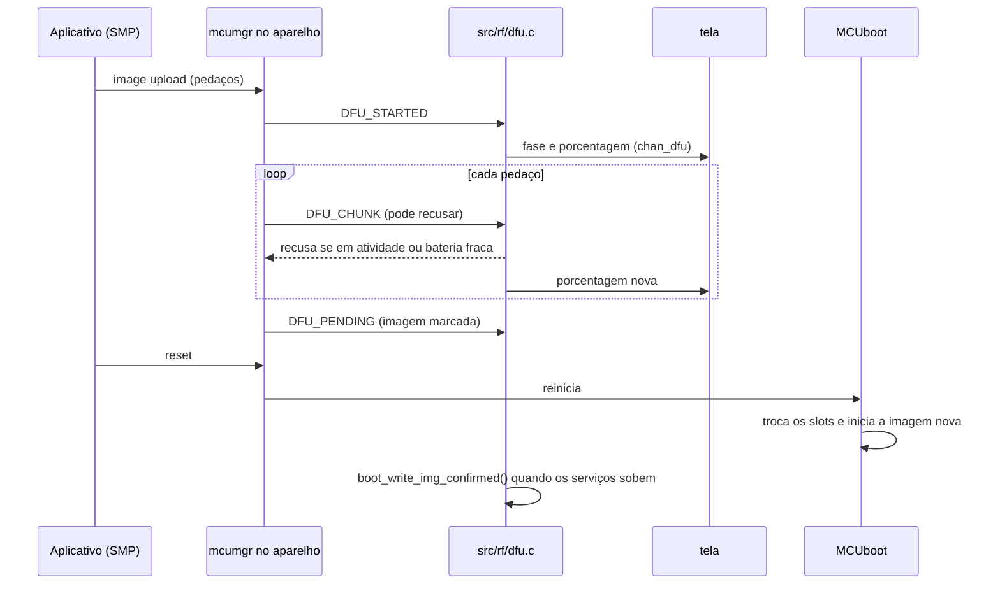

# Rádio: ANT+ e BLE

Como o stravaV10 original usa ANT+ e BLE, o que é o stravaAP, como o port Zephyr trocou os sensores ANT+ por clientes BLE, a decisão de manter ANT+ e BLE e o que falta para o rádio funcionar. O catálogo de todos os dispositivos BLE e ANT+ que o aparelho pode aceitar, com prioridades, está em [17-dispositivos-ble-ant.md](17-dispositivos-ble-ant.md).

**Nesta página:** [Topologia](#topologia) · [ANT+ no legacy](#ant-no-legacy) · [BLE no legacy](#ble-no-legacy) · [stravaAP e comandos](#stravaap-e-comandos) · [Komoot](#komoot) · [Rádio no port](#rádio-no-port) · [Decisão: ANT+ e BLE](#decisão-ant-e-ble) · [Atualização por BLE (DFU)](#atualização-por-ble-dfu) · [O que falta](#o-que-falta)

## Topologia

## ANT+ no legacy

Pilha do SoftDevice S340; eventos pelo `app_scheduler` (fora de ISR). Rede `ANTPLUS_NETWORK_NUMBER 0`; a chave de rede ANT+ vem do `ant_key_manager` do nRF5 SDK e **não está no repositório**.

| Canal | Uso | Device type | Número padrão |
|---|---|---|---|
| 0 | busca em background (pareamento) | curinga; troca para HRM, BSC ou FE-C na busca | 0 |
| 1 | BSC combinado (velocidade + cadência) | 0x79 | 15568, depois o salvo nas configurações |
| 2 | HRM | 0x78 (perfil) | 17334, depois o salvo |
| 3 | FE-C, aberto só ao entrar no modo FEC | 0x11 (perfil) | 15568 (Tacx do autor), depois o salvo |
| 4 | "glasses" (display remoto) | — | desativado: só 4 canais alocados |

- **HRM** (`legacy/rf/hrm.c`): BPM e intervalo RR em ms a cada batimento; até 5 reaberturas do canal.
- **BSC** (`legacy/rf/bsc.c`): só o sensor combinado; o firmware usa só a cadência.
- **FE-C** (`legacy/rf/fec.c`): lê as páginas 16 (tempo decorrido) e 25 (potência); o controle ERG/SIM (páginas 49/51) existe mas **nunca é enviado**.
- **Pareamento** (`legacy/rf/ant_device_manager.cpp`): o menu inicia a busca, lista até 7 sensores com ID e RSSI e grava o escolhido na FRAM.
- **Coexistência** com o BLE: prioridade de busca mínima e o bit de coexistência de busca de alta prioridade desligado (`legacy/rf/ant.c:297-313`); o scan BLE usa 5 ms a cada 200 ms.

## BLE no legacy

`legacy/rf/ble_api6.c` (o `ble_api5.c` é antigo e não compila com o resto). Só **central**, 2 links, MTU 247, sem pareamento (rejeita com `PAIRING_NOT_SUPP`).

| Serviço cliente | UUID | Uso |
|---|---|---|
| NUS | `6E400001-B5A3-F393-E0A9-E50E24DCCA9E` | ponte com o stravaAP: comandos e transferência de arquivos |
| LNS | 0x1819 | posição do celular para o Locator e host aiding do GPS |
| Cycling Power | 0x1818 | potência e vetor de torque (gráfico polar na tela FEC) |
| Komoot | `71C1E128-D92F-4FA8-A2B2-0F171DB3436C` | navegação curva a curva |

Scan ativo (200 ms / 5 ms) por 3 minutos com filtros "OU": nome `stravaAP`, CPS, LNS ou Komoot; conecta no primeiro que casar. Os clientes LNS, CPS e Komoot eram submódulos do autor (`libraries/ble_services`, vazio nesta cópia).

## stravaAP e comandos

O stravaAP (`legacy/AP/`) é um firmware para o dongle nRF52840 PCA10059 (S140 7.0.1, SDK 16): **ponte USB CDC ↔ BLE NUS**, periférico que anuncia "stravaAP". Os mesmos comandos também entram pela USB CDC do próprio aparelho.

| Comando | Efeito |
|---|---|
| `$LOC,secj,lat×1e7,lon×1e7,ele×100,v_cm/s` | posição simulada (fonte SIM, prioridade máxima); usado pelo `LNS.js` com o Zwift |
| `$DWN,n` | 12 teste de hardfault, 13 formata, 14 teste de memória, 15 `mkfs`, 16 modo MSC, 17 DFU (não implementado), 18 calibra o magnetômetro |
| `$QRY,tipo,arquivo` | 1 lista os logs, 2 envia um arquivo, 3 apaga |

Sem autenticação: qualquer periférico chamado "stravaAP" pode formatar a memória. O `LNS.js` depende do tráfego do Zwift, criptografado desde 2022.

## Komoot

- O celular com o app Komoot é periférico; o aparelho conecta, recebe notificação e lê a característica de navegação (`503DD605-9BCB-4F6E-B235-270A57483026`, segundo a documentação do Komoot BLE Connect).
- Pacote: identificador (4 B), direção (1 B), distância (4 B, little endian), nome da rua (UTF-8).
- O legacy mostra "Next turn" e um ícone de 110 × 110 (30 bitmaps em `libraries/komoot/komoot_icons.h`, códigos 1 a 30 mapeados em `komoot_nav.c`).

## Rádio no port

| Arquivo | Papel | Estado |
|---|---|---|
| `rf/ble/ble_manager.c` | periférico (advertising com BAS e DIS) e central (HRS 0x180D, CSC 0x1816, FTMS 0x1826) | scan **nunca iniciado**; `bt_conn_le_create` vaza referências |
| `rf/ble/ble_nus.c` | **servidor** NUS | papel invertido em relação ao legacy; RX descartado |
| `rf/ble/ble_lns.c` | **servidor** LNS | sem chamador; falta a característica LN Feature |
| `rf/ble_hrs_client.c` | cliente de frequência cardíaca | inscrição com `ccc_handle=0`: `memset(NULL)` no Zephyr 4.3; só o 1º RR |
| `rf/ble_bsc_client.c` | cliente CSC | mesma inscrição; velocidade 3600 vezes menor |
| `rf/ble_fec_client.c` | cliente FTMS (substitui o FE-C) | mesma inscrição; flags e offsets errados; control point sem indicações |
| `rf/ble_komoot_client.c` | cliente Komoot | UUID de característica, layout e papel errados |
| `rf/ant/ant.c`, `include/rf/ant.h` | `rf_ant_init()`: sobe a pilha ANT e grava a chave ANT+, antes do BLE (só com `ANT=1`) | compila; sem perfis; não testado em placa |

- Os dados dos sensores BLE chegam só à tela; o modelo (log, suffer score, zonas) não recebe BPM, cadência nem potência medida.
- `CONFIG_BT_MAX_CONN=4` dá 1 conexão periférica e 3 centrais no SoftDevice Controller: exatamente o que o código tenta (1 celular, HRS, CSC, FTMS), sem folga.
- APIs conferidas no Zephyr 4.3: `bt_le_scan_start` (o `timeout = 30` vale 300 ms, não 30 s), `BT_LE_ADV_OPT_CONN` (o advertising para ao conectar), `BT_CONN_CB_DEFINE` sem `recycled`.
- Sem `CONFIG_BT_SMP`: servidores abertos e endereço fixo.

## Decisão: ANT+ e BLE

Decidido em 2026-09-18: o aparelho mantém **ANT+ e BLE juntos**, porque os sensores e equipamentos externos (cinta, sensor de velocidade e cadência, rolo) falam ANT+. O caminho é o add-on **ANT for nRF Connect SDK** (`sdk-ant`), da Garmin/ANT com a Nordic.

| Item | Situação conferida em 2026-09-18 |
|---|---|
| Versão atual | `sdk-ant` v2.1.1, acoplada ao **sdk-nrf v3.2.4**; o v3.3.0 instalado não consta da tabela de compatibilidade e a documentação desaconselha usar as bibliotecas ANT com outra revisão; o port a usa no NCS v3.3.0 por decisão do dono ([ANT no NCS v3.3.0](#ant-no-ncs-v330)) |
| SoCs | nRF52832, nRF52840, nRF5340, nRF54L05, nRF54L10, nRF54L15, nRF54LM20 |
| Acesso | o repositório é público, mas o uso exige **aceitar dois acordos**: o ANT+ Adopter Agreement ([página](https://developer.garmin.com/ant-program/licensing/adopter-agreement/), botão "Accept & Download the ANT+ Adopter Agreement") e o ANT License Agreement do add-on ([página do add-on](https://developer.garmin.com/ant-program/nrf-connect-sdk/), botão "Accept & Download the ANT License Agreement"); produto comercial exige a licença comercial ([formulário](https://www.garmin.com/forms/licenserequest-antstacks-softdevices/), US$ 0,08 por unidade, mínimo de US$ 800 por semestre) |
| ANT+ Adopter Agreement | versão 20250103 ([PDF](https://developer.garmin.com/downloads/ant/ANT+_Adopter_Agreement.pdf)); aceito por pessoa física, vale só para uso pessoal e não se transfere. Cláusula (c): os ANT+ Documents (os perfis de dispositivo) e as ANT+ Design Tools não podem ser distribuídos a ninguém fora da organização, então **nada deles entra neste repositório, que é público**. Cláusula (a): o produto segue os requisitos mínimos de interoperabilidade dos perfis. Cláusula (e): a marca e o logo ANT+ só aparecem num produto vendido ou público se ele cumprir esses requisitos, testados por você |
| Programas ANT+ | o programa de membros ANT+ e a certificação de produtos ANT+, com o suporte de engenharia, **terminaram em 2025-06-30** (aviso na [página de downloads](https://developer.garmin.com/ant-program/downloads/)); a página não diz o que os substitui |
| Downloads | depois do aceite, a [página de downloads](https://developer.garmin.com/ant-program/downloads/) oferece as ferramentas de PC (ANTware II, testes IQC), o SimulANT+ (simula sensores ANT+ no PC, com um adaptador ANT USB), as ANT Libraries, os projetos de referência embarcados ANT e ANT+ (potência, velocidade e cadência, cinta, passo, balança) e o ANT-FS; software com o logo ANT+ segue a ANT+ Shared Source License, e o software aberto, a Apache 2.0 ou a licença do FIT |
| Instalação | no port, clone da tag em `C:\ncs\sdk-ant` e build com `ANT=1` ([ANT no NCS v3.3.0](#ant-no-ncs-v330)); o caminho do [guia](https://ant-nrfconnect.github.io/doc/getting_started.html) (`west init -m https://github.com/ant-nrfconnect/sdk-ant --mr main` + `west update`, ou o [índice de add-ons](https://nrfconnect.github.io/ncs-app-index/) do VS Code, "ANT Wireless SDK") monta um workspace com o sdk-nrf v3.2.4 |
| Relógio | a pilha ANT exige o relógio de baixa frequência de 32,768 kHz com no máximo ±50 ppm, ou seja, cristal (o X2 dos DKs), segundo a [compatibilidade](https://ant-nrfconnect.github.io/doc/compatibility.html); os dois alvos do port já compilam com `CONFIG_CLOCK_CONTROL_NRF_K32SRC_XTAL=y` e `CONFIG_CLOCK_CONTROL_NRF_K32SRC_50PPM=y`, e a V3 tem o cristal Y3 |
| Kconfig | `CONFIG_ANT` e `CONFIG_BT` juntos; `CONFIG_ANT_EVALUATION_KEY=y` para desenvolvimento não comercial; `CONFIG_ANT_LICENSE_KEY` para produto (licença comercial obrigatória antes de vender); no nRF5340, `CONFIG_ANT_LIBRARY_CORE` e imagens de rede pelo sysbuild |
| Exemplos | HRM, BSC e potência; **sem FE-C**: o perfil do rolo precisa ser escrito a partir do legacy (`legacy/rf/fec.c`) |
| Conexões | ANT e BLE dividem o rádio: `CONFIG_BT_MAX_CONN` pode precisar cair |

Próximos passos, na fase 4 do roteiro: portar HRM, BSC e FE-C sobre a API do add-on (o port já compila com ele no NCS v3.3.0, ver abaixo), com a busca em background e o pareamento do `ant_device_manager` do legacy. O BLE continua para o celular (Komoot, LNS), o medidor de potência e os comandos.

Alternativas descartadas: só BLE (os equipamentos externos são ANT+), SoftDevice S340 com Zephyr e ANT sobre rádio bruto (inviáveis).

## ANT no NCS v3.3.0

Decidido pelo dono em 2026-09-18: o ANT roda sobre o **NCS v3.3.0**, o mesmo SDK do resto do port, e não sobre o sdk-nrf v3.2.4 para o qual o `sdk-ant` v2.1.1 foi feito. Instalado e verificado por build na mesma data; **não testado em placa** (não há DK).

| Item | Situação |
|---|---|
| Instalação | `git clone --branch v2.1.1 https://github.com/ant-nrfconnect/sdk-ant C:\ncs\sdk-ant` (5,2 MB), sem `west update`: o manifesto do add-on só traz o sdk-nrf v3.2.4, que o port não usa. O add-on fica fora do repositório (a licença dele não permite redistribuir) e fora do NCS v3.3.0, que não muda |
| Build | `ANT=1 bash tools/fw/fw.sh build pristine`, ou `set ANT=1` antes do `build.bat`: o add-on e `zephyr_app/modules/ant_ncs33_compat` entram como módulos extras do Zephyr, e `zephyr_app/ant.conf` liga o ANT só na imagem do app; `SDK_ANT_DIR` troca o caminho do add-on |
| Incompatibilidade | o add-on testa `SOC_SERIES_NRF52X` (pasta da `libant.a` do nRF52) e `SOC_SERIES_NRF54LX` (pasta do nRF54L e nomes `SWI0x_IRQn` das interrupções de software), que o NCS v3.3.0 deixou obsoletos e não liga mais: sem eles o caminho da biblioteca sai `lib/soft-float/libant.a` e o link falha. O `ant_ncs33_compat` os religa a partir dos símbolos do SoC (condicionar pela série daria laço de dependência no Kconfig), e o build mostra um aviso esperado, "Deprecated symbol ... is enabled" |
| Nome | o add-on já define `ant_stack_init()` na API da pilha: a função do port que substitui a do legacy chama `rf_ant_init()` (`src/rf/ant/ant.c`) |
| Interfaces binárias | a `libant.a` vem compilada e chama 4 funções do MPSL (relógio de alta frequência e criptografia ECB), 4 do nrfx (`nrfx_gppi_conn_*`), o `SystemCoreClock` e símbolos internos do MPSL; os headers dessas funções são idênticos no v3.2.4 e no v3.3.0 e o link fecha, o que não prova o comportamento em tempo de execução |
| Chave de rede ANT+ | vem do `ant_key_manager` do add-on (`ant_plus_key_set()`); nunca entra no repositório |
| Relógio | cristal de 32,768 kHz a 50 ppm, já configurado nos dois alvos |

Builds verificados em 2026-09-18 com o NCS v3.3.0 e a chave de avaliação (FLASH / RAM):

| Build | nRF52840 DK | nRF54LM20 DK |
|---|---|---|
| exemplo `hrm_rx` (HRM) | 99.196 B / 25.216 B | 96 KB / 24.616 B |
| exemplo `ble_ant_app_hrm` (BLE e ANT juntos) | 211.500 B / 44.520 B | 210.088 B / 44.360 B |
| exemplo `bsc_rx` (velocidade e cadência) | 100.200 B / 25.280 B | 99.292 B / 24.688 B |
| exemplo `bpwr_rx` (potência) | 103.812 B / 25.344 B | 102.552 B / 24.752 B |
| exemplo `ant_bgnd_scan` (busca em background) | 99.304 B / 25.152 B | 98.400 B / 24.584 B |
| **port com `ANT=1`** | 324.912 B / 121.536 B (+28.592 / +4.608) | 328.408 B / 122.248 B (+29.940 / +4.592) |

O build padrão, sem `ANT`, continua idêntico byte a byte ao anterior.

### Mapa de integração

| Recurso | Legacy | `sdk-ant` v2.1.1 | No port | Quando |
|---|---|---|---|---|
| Pilha ANT e chave ANT+ | `ant_stack_init()` (`legacy/rf/ant.c:139-146`) | `ant_init()` e `ant_plus_key_set()` | **feito**: `rf_ant_init()` antes do BLE, com `ANT=1` | 2026-09-18 |
| Cinta de frequência cardíaca (HRM) | canal 2, `legacy/rf/hrm.c` | perfil `ant_hrm` e exemplo `hrm_rx` | portar o `hrm.c`: as funções do nRF5 SDK que ele usa existem no add-on | fase 4 |
| Velocidade e cadência (BSC) | canal 1, sensor combinado, `legacy/rf/bsc.c` | perfil `ant_bsc` e exemplo `bsc_rx` | portar o `bsc.c` | fase 4 |
| Rolo (FE-C) | canal 3, `legacy/rf/fec.c` (páginas 16 e 25; 49 e 51 nunca enviadas) | **não existe** | portar o `fec.c` do legacy sobre `ant_channel_config` e `ant_common`; o controle ERG e SIM seria novo | fase 4 |
| Busca e pareamento | canal 0 curinga, `legacy/rf/ant_device_manager.cpp` (até 7 sensores com RSSI) | exemplo `ant_bgnd_scan` e `ant_search_config` | portar o `ant_device_manager` | fase 4 |
| Convivência com o BLE | prioridade de busca e coexistência (`legacy/rf/ant.c:297-313`) | `ant_search_channel_priority_set()`, `ant_coex_config_set()` e o exemplo `ble_ant_app_hrm` | os mesmos ajustes | fase 4 |
| Potência ANT+ (BPWR) | não usa: lê potência pelo BLE CPS | perfil `ant_bpwr` e exemplo `bpwr_rx` | novo: medidores de potência ANT+ | fase 4, opcional |
| Páginas comuns (bateria do sensor, fabricante) | parcial no FE-C | `ant_common` (`ant_request_controller`) | novo: bateria dos sensores na tela | fase 4, opcional |
| "Glasses" (tela remota) | canal 4, desligado | transmissão (exemplo `ant_broadcast_tx`) | opcional | futuro |
| Criptografia, burst, ANT-FS | não usa | `ant_encryption` e o exemplo `ant_advanced_burst`; o ANT-FS fica nos downloads da Garmin, fora do add-on | não previsto | — |
| Outros perfis de ciclismo (radar, luzes, câmbio eletrônico, e-bike, controle remoto, temperatura) | não usa | não existem no add-on | exigem os documentos de perfil ANT+ (acordo do dono; nada deles entra no repositório) | futuro |

API: as 12 funções `sd_ant_*` que o legacy chama (em `ant.c`, `hrm.c`, `bsc.c` e `fec.c`) existem no add-on como `ant_*` (`include/ant_interface.h`), uma para uma. Dos 21 identificadores de perfis e bibliotecas do nRF5 SDK que o legacy usa, os únicos ausentes no add-on (`ant_search_start`, `ant_search_end` e os dois `*_evt_handler`) são funções do próprio legacy: o port dos perfis pode seguir o legacy linha a linha.

## Atualização por BLE (DFU)

O legacy não atualizava pelo ar: o firmware entrava pelo J-Link ou pelo cartão. O port ganha atualização por Bluetooth com as peças oficiais do NCS v3.3.0 — **MCUboot** pelo sysbuild e **mcumgr SMP sobre BLE** — controladas por um módulo próprio (`zephyr_app/src/rf/dfu.c`) e pela máquina pura de `src/model/dfu_state.c`. O aplicativo do telefone não é deste projeto: qualquer cliente SMP serve (o nRF Connect Device Manager, da Nordic, é o de referência).

| Peça | Escolha | Onde |
|---|---|---|
| Bootloader | MCUboot pelo sysbuild, modo `swap_using_offset` (padrão do NCS 3.3) | `zephyr_app/Kconfig.sysbuild` |
| Alvo | **só o nRF54LM20A**: slots de 920 KB contra os ~525 KB do firmware. No nRF52840 o slot tem 481 KB contra 480 KB de firmware, e nada caberia | `Kconfig.sysbuild` (`default BOOTLOADER_MCUBOOT if BOARD_NRF54LM20DK`) |
| Partições | as padrão do SoC: MCUboot 64 KB, `slot0` e `slot1` de 920 KB, `storage` de 36 KB | `zephyr/dts/vendor/nordic/nrf54lm20_a_b_cpuapp_partition.dtsi` |
| Setores por imagem | 256 fixos (a RRAM apaga em 4096 B; 920 KB dão 230 setores) | `zephyr_app/sysbuild/mcuboot.conf` |
| Transporte | SMP sobre BLE com remontagem, MTU de 498 B e buffer de 2475 B, como o exemplo `smp_svr` | `boards/nrf54lm20dk_nrf54lm20a_cpuapp.conf` |
| Confirmação | `boot_write_img_confirmed()` quando os serviços sobem: imagem que não inicia volta sozinha no reset seguinte | `src/rf/dfu.c` |
| Assinatura | **ainda a chave de desenvolvimento do MCUboot** (decisão do dono em 2026-09-20: sem chave por enquanto) | ver o aviso abaixo |

> [!WARNING]
> A imagem é assinada com a **chave de desenvolvimento pública do MCUboot**, que está no repositório do bootloader e é conhecida por qualquer pessoa. Enquanto for assim, qualquer um com acesso ao Bluetooth do aparelho pode gravar firmware nele. Antes de sair da bancada: gerar uma chave ED25519 própria (o padrão do nRF54L), guardá-la **fora** deste repositório (que é público) e apontá-la com `SB_CONFIG_BOOT_SIGNATURE_KEY_FILE`.

**Regras do aparelho durante a atualização** (`src/model/dfu_state.c`, testadas em `test_dfu_state`):

- **Em atividade, não atualiza.** Um reset no meio de um passeio perde o que não foi gravado; o alvo recusa o pedaço com `MGMT_ERR_EACCESSDENIED` e avisa na tela.
- **Bateria abaixo de 30 % e fora do carregador, não atualiza.** Com o USB ligado, qualquer carga serve.
- A tela de atualização (`docs/telas/28_atualizacao_cor.png`) toma a frente enquanto a imagem chega, mostra a porcentagem e volta para as páginas quando acaba.
- O log da atividade fecha o arquivo a cada ponto (`sd_logger`), então o reset do mcumgr não perde dados no cartão.

Nada disso foi testado em placa: não há hardware ainda.

## O que falta

1. **Crítico:** iniciar o scan; inscrição com `disc_params` e `end_handle` (ou descoberta do CCC); `bt_conn_unref` depois do create; classificar conexões por papel; sensores com vários serviços.
2. **Crítico:** corrigir os parsers (velocidade CSC, flags do FTMS, vários RR) e levar os dados ao modelo (`boucle_update_hrm/bsc`, zonas, log).
3. **Importante:** ANT+ pelo `sdk-ant` (HRM, BSC, FE-C, busca em background); pareamento com lista de sensores ANT+ e BLE e identificadores salvos (número do dispositivo ANT, `bt_addr_le_t`).
4. **Importante:** canal de comandos (`$LOC`, `$DWN`, `$QRY`) por NUS e USB, com o papel NUS de volta a cliente ou com uma ponte nova no PC.
5. **Importante:** cliente LNS (fonte de posição e host aiding), cliente CPS, Komoot como central com os 30 ícones do legacy.
6. **Segurança e consumo:** LESC com passkey no display, lista de permitidos, comandos destrutivos protegidos; intervalos de conexão de 100 a 500 ms e scan de baixo ciclo.

## Referências

- ANT for nRF Connect SDK: [documentação](https://ant-nrfconnect.github.io/), [compatibilidade](https://ant-nrfconnect.github.io/doc/compatibility.html), [licença](https://developer.garmin.com/ant-program/nrf-connect-sdk/).
- Komoot BLE Connect: [documentação (fork)](https://github.com/palto42/BLEConnect).
- Submódulos do autor que faltam nesta cópia: [vincent290587/ble_services](https://github.com/vincent290587/ble_services), [vincent290587/ant_profiles](https://github.com/vincent290587/ant_profiles).
