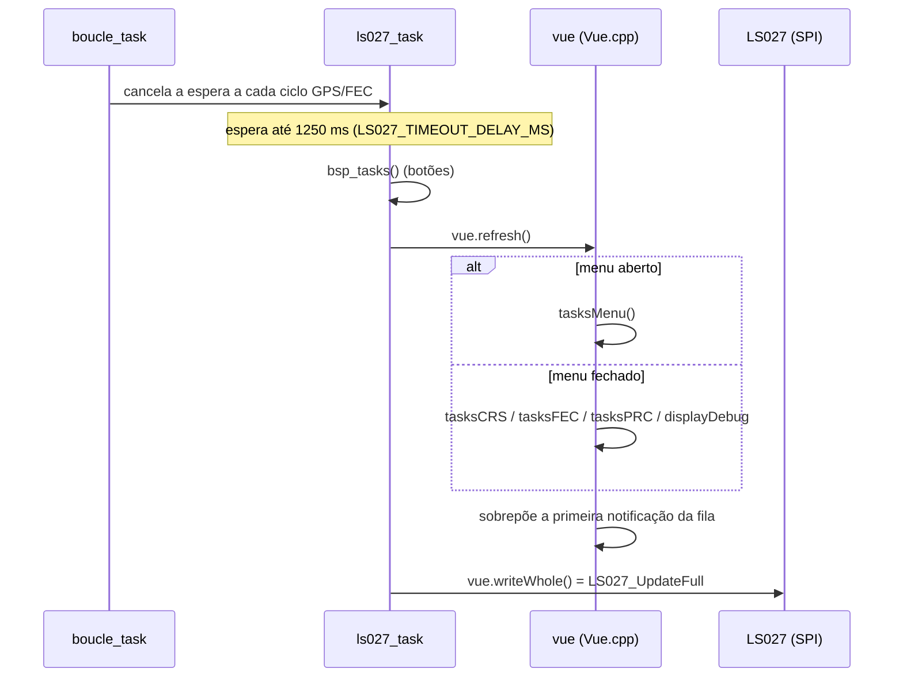
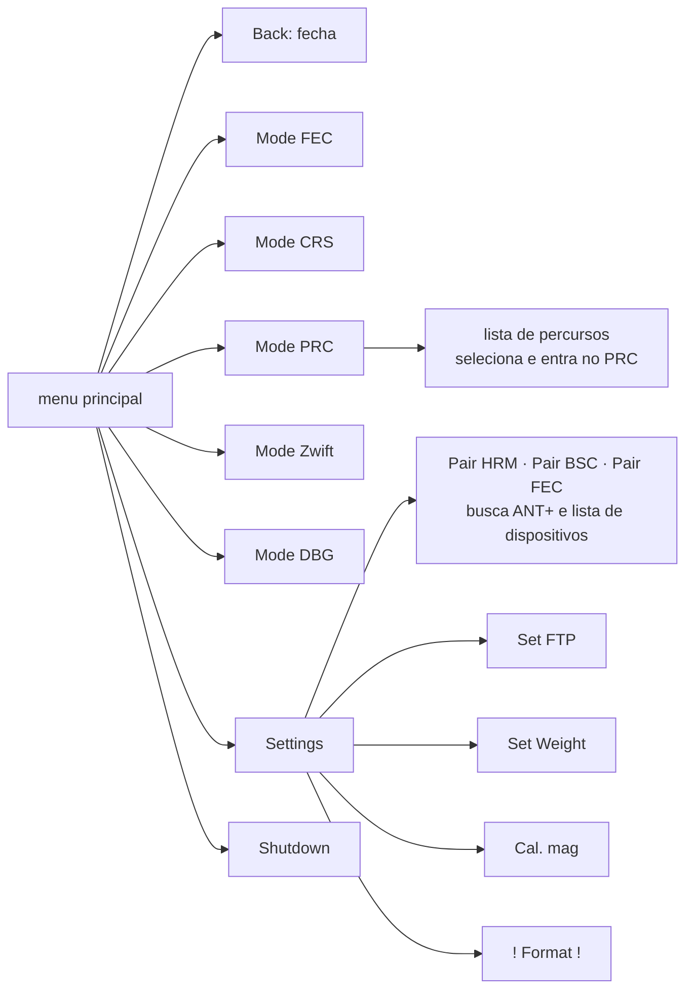
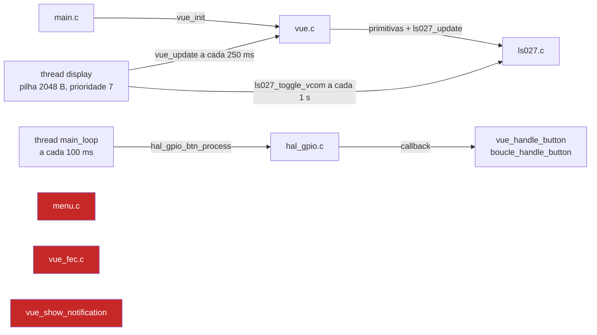

# Interface: telas, menus, botões e notificações

Como o stravaV10 original desenha as telas no Sharp Memory LCD, como os três botões navegam pelos modos e menus, e em que pé está a interface do port Zephyr. A interface do port **não é uma tradução** da original: é uma interface nova, em paisagem, com várias partes ainda desligadas.

**Nesta página:** [Display](#display) · [Interface original](#interface-original) · [Imagens](#imagens) · [Interface do port](#interface-do-port) · [Comparação](#comparação) · [Defeitos conhecidos](#defeitos-conhecidos) · [O que falta](#o-que-falta)

## Display

| Item | Valor |
|---|---|
| Painel | Sharp Memory LCD LS027, 400 × 240 pixels, 1 bit por pixel, sem backlight |
| Montagem no aparelho | **retrato**: 240 de largura × 400 de altura (foto `img/front1.png`) |
| Interface | SPI a 2 MHz, LSB primeiro, CS ativo em nível alto |
| Buffer | 12.482 B: `[comando][endereço][50 B de pixels][dummy] × 240 linhas + [dummy]`; bit menos significativo = pixel da esquerda |
| VCOM | precisa alternar: o legacy alterna pelo bit M1 a cada envio; o port envia o comando VCOM a cada 1 s |
| Refresh | legacy: por evento, cerca de 1 Hz; port: fixo a cada 250 ms (4 Hz, ~50 ms de SPI por quadro) |

O buffer tem o mesmo layout nos dois firmwares (`legacy/drivers/lcd/ls027.c:22-24`, `zephyr_app/src/drivers/lcd/ls027.c:22,45`).

## Interface original

### Pipeline de desenho

- `Vue` herda de `VueCRS`, `VueFEC`, `VuePRC`, `VueDebug`, `NotifiableDevice` e `Menuable` (`legacy/source/vue/Vue.h:28`); o objeto global é `vue` (`legacy/source/Model.cpp:56`).
- **Retrato:** `setRotation(3)` (`Vue.cpp:25`) e `drawPixel(x, y)` → `LS027_drawPixel(y, 239 - x)` (`Vue.cpp:164`). Uma linha vertical lógica é uma linha física, então `drawFastVLine` escreve bits contíguos (`Vue.cpp:209-215`).
- **Uma fonte só:** `Org_01` da Adafruit GFX (glifos de 5 px), escalada de 1 a 4. As outras 53 fontes de `libraries/AdafruitGFX/Fonts/` não são usadas.
- A Adafruit GFX do projeto é modificada: linha espessa, linha tracejada, impressão da direita para a esquerda (`printRev`), `drawBitmap` com escala e fonte fixa em `static` (uma por execução).
- Números: `_fmkstr` **trunca** as casas decimais e mostra `---` acima de 100000 (`Screenutils.cpp`).

### Cadrans

A tela é uma grade de **2 colunas × 7 linhas** (6 no FEC): 57 px por linha com 7 linhas, colunas de 120 px.

| Widget | Arquivo | O que desenha |
|---|---|---|
| `cadran` | `Vue.cpp:264-310` | rótulo pequeno no canto, valor em tamanho 3 centralizado, unidade à direita; mais de 6 caracteres vira `---` |
| `cadranH` | `Vue.cpp:225-261` | o mesmo em largura total |
| `cadranRR` | `Vue.cpp:389-439` | barras por zona de variabilidade RR, com `>` na zona atual |
| `cadranZones` | `VueFEC.cpp:170-209` | barras do tempo em cada zona de potência |
| `HistoH` | `Vue.cpp:312-353` | histograma em torno de uma linha de referência tracejada |
| `cadranPowerVector` | `VueFEC.cpp:95-168` | polígono polar do torque pelo ângulo do pedivela |
| `partner` | `VueCRS.cpp:550-596` | "avião" de desempenho no segmento: triângulo na posição `avance / curtime` entre −25 % e +25 % |

### Telas por modo

| Modo | Tela | Conteúdo |
|---|---|---|
| CRS | GPS (automática) | quando a última posição tem mais de 6 s (`LOCATOR_MAX_DATA_AGE_MS`) |
| CRS | página 1, sem segmento | Dist · Pwr / Speed · Climb / CAD · HRM / SL · VA / Next · Alt / Avg · Score / STC · SOC |
| CRS | página 1, 1 segmento | 4 linhas de dados, mini-mapa do segmento nas linhas 5–6 e `partner` (ou Next) na 7 |
| CRS | página 1, 2+ segmentos | SL · HRM e dois segmentos, com mini-mapa e `partner` conforme o estado de cada um |
| CRS | página 2 | dados, "Next turn" (distância Komoot), `cadranRR` e ícone Komoot de 110 × 110 |
| CRS | página 3 | barra e histograma de pitch, bússola, "rugosidade" (FXOS e barômetro) |
| PRC | mapa | 4 linhas de dados, mapa do percurso nas linhas 5–6 com zoom, corrente média e SOC |
| FEC | trainer | Time / CAD · HRM / Score · PZone / Pwr · RR / vetor de potência |
| DBG | debug | satélites e SNR, idade da posição, pino de fix, estado do GPS, corrente e tensão do STC3100, segmentos carregados |

Mapa e mini-mapa usam projeção equiretangular linear (`regFenLim`, com saturação na borda), norte para cima. O zoom do PRC é `nível² × 250 / 100` metros de meia-largura (nível 10 = 250 m, `legacy/source/display/Zoom.cpp:52-88`).

### Botões

Três botões ativos em nível baixo: esquerda P0.14, centro P0.13, direita P0.11 (`legacy/custom_board_v3.h:36-51`). O legacy só usa **pressão curta** (ação padrão do BSP do nRF5 SDK).

| Contexto | Esquerda | Centro | Direita |
|---|---|---|---|
| CRS | página anterior | abre o menu | próxima página |
| PRC | afasta o zoom | abre o menu | aproxima o zoom |
| FEC, DBG | — | abre o menu | — |
| menu de itens | item anterior | executa | próximo item |
| menu de valor (FTP, peso) | −1 | grava e volta | +1 |

Nos primeiros 5 s após o boot os eventos de menu são ignorados (`Menuable.cpp:326`).

### Menu

- Árvore em `legacy/source/vue/Menuable.cpp:255-294`; cada página tem "Back" no índice 0 (`MenuObjects.cpp:135-139`).
- O item selecionado recebe um retângulo arredondado em XOR: texto branco sobre barra preta (`img/menu1.png`).
- FTP e peso gravam na hora, na FRAM (`UserSettings::writeConfig`).
- Não há item de MSC: o modo USB Mass Storage entra por comando na serial.

### Notificações

- **Tela:** fila de até 10 (`legacy/source/vue/Notif.h:33-53`); só a primeira aparece, numa faixa no topo, por `persist + 1` refreshes (≈6 s). Tipos `Partial` (só a mensagem) e `Complete` ("título: mensagem").
- **Produtores:** hardfault e "last void" no boot, FDIR "Attitude restored", carga de PRC, pareamento ANT+, FE-C, calibração do magnetômetro, reset do GPS, EPO e host aiding.
- **LED (NeoPixel):** pulso vermelho no boot; durante um segmento, pisca vermelho quando atrás do recorde e azul quando à frente, mais rápido perto do empate (`legacy/source/display/SegmentManager.cpp:43-100`).
- **Splash:** silhueta de um quadro de bicicleta (`legacy/drivers/lcd/ls027_splash.h`) até o primeiro refresh.
- Não há tela de bateria fraca; o desligamento automático após 15 min sem atividade não avisa.

## Imagens

As capturas vêm de versões anteriores do firmware original, provavelmente do simulador `tools/TDD` com o `LS027simulator.jar`.

| Imagem | O que mostra | Tela |
|---|---|---|
|  | Dist, Pwr, Speed, Climb, CAD, HRM, PR, VA, Next (largura total), Avg, Score, STC, SOC | CRS página 1 sem segmento (versão antiga: hoje a linha 4 é SL · VA) |
|  | dois mini-mapas de segmento com % percorrido e dois `partner` | CRS página 1 com 2 segmentos ativos |
|  | Time, CAD, HRM, Score, PZone, Pwr, Speed, histograma de potência, Cur, SOC | FEC (versão antiga: histograma e Cur · SOC hoje estão em `#if 0`) |
|  | dados e mapa do percurso com zoom de 3802 m | PRC |
|  | menu principal com "Mode CRS" selecionado | menu (versão antiga: "Retour", sem "Mode Zwift") |
|  | Settings com "Erase GPX" | Settings (versão antiga) |

| Foto | O que mostra |
|---|---|
| [img/front1.png](img/front1.png) | aparelho em retrato com a tela DBG, três botões abaixo do LCD |
| [img/side1.png](img/side1.png) | perfil da caixa em duas partes, botões numa extremidade |
| [img/back1.png](img/back1.png) | tampa traseira com micro-USB e encaixe circular de suporte |

## Interface do port

### Arquivos

| Arquivo | Estado |
|---|---|
| `src/vue/vue.c` (1747 linhas) | ligado: primitivas, cabeçalho, 9 páginas e notificação num arquivo só |
| `src/vue/menu.c` | implementado, **nunca inicializado nem aberto** |
| `src/vue/vue_fec.c` | 3 páginas de trainer, **nunca chamadas**; a página de zonas usa dados de exemplo fixos |
| `src/vue/vue_crs.c` | placeholder vazio |
| `include/vue/font_5x7.h` | fonte 5×7 de 256 glifos (`static` no header: uma cópia por arquivo que a inclui) |
| `include/vue/gfxfont.h` | tipos compatíveis com a Adafruit GFX, sem renderizador nem fonte |
| `src/drivers/lcd/ls027.c` | driver próprio; o nó `sharp,ls0xx` do devicetree fica sem uso porque `CONFIG_DISPLAY` está desligado |

### Como é ligado

Em vermelho, o que existe no código mas ninguém chama (o linker descarta).

### Telas

Todas em **paisagem 400 × 240**, com cabeçalho de 24 px (texto "GPS" fixo, hora e contorno de bateria sem nível) e fonte 5×7 escalada (1, 2 ou 3). Esquerda e direita percorrem as páginas:

| Página | Conteúdo |
|---|---|
| `VUE_PAGE_MAIN` | velocidade, distância, subida, inclinação, potência, tempo |
| `VUE_PAGE_SEGMENT` | melhor segmento: nome, % percorrido, diferença para o PR, barra de progresso |
| `VUE_PAGE_PARCOURS` | percurso: progresso, distância restante, fora da rota; sempre "No route loaded" (sem sistema de arquivos) |
| `VUE_PAGE_MAP` | mapa com rota, ciclista e rumo; o rodapé promete zoom, que não existe |
| `VUE_PAGE_STATS` | distância, subida, velocidade máxima e média, tempo em movimento (não existe no legacy) |
| `VUE_PAGE_SENSORS` | seis caixas de sensores com estado de conexão |
| `VUE_PAGE_GPS` | estado do fix, satélites, HDOP, posição |
| `VUE_PAGE_DEBUG` | uptime, heap, "BLE: Active" fixo, estado do boucle, versão |
| `VUE_PAGE_MENU` | renderizador do menu; mostra "Menu not available" |

### Botões no port

`hal_gpio_btn_process()` lê os botões por polling na thread `main_loop` a cada 100 ms: pressão longa com 1 s ou mais, curta na liberação. Esquerda e direita trocam de página; **centro** inicia, pausa ou retoma a atividade; **centro longo** para e grava a atividade (`zephyr_app/src/model/boucle.c:452-486`). É um mapa diferente do legacy, onde o centro abre o menu.

## Comparação

| Legacy | Port | Estado |
|---|---|---|
| retrato 240 × 400, `Org_01`, grade de cadrans | paisagem 400 × 240, fonte 5×7, listas de texto | diferente |
| splash | — | ausente |
| CRS página 1 (14 cadrans, 3 variantes por número de segmentos) | `VUE_PAGE_MAIN` (6 valores) e `VUE_PAGE_SEGMENT` (texto e barra) | simplificado |
| CRS páginas 2 (Komoot, RR) e 3 (pitch, bússola) | — | ausente |
| troca automática para a tela GPS sem posição | página GPS manual | simplificado |
| PRC com mapa, zoom e segmentos | `VUE_PAGE_PARCOURS` e `VUE_PAGE_MAP` sem zoom | simplificado |
| FEC | `vue_fec.c` não ligado | não ligado |
| menu com modos, pareamento, FTP, peso, calibração, formatação, desligar | `menu.c` com controle de atividade e FTP/peso, não ligado | não ligado |
| fila de 10 notificações e produtores | um slot, sem produtores | não ligado |
| LED (pulsos e pisca de segmento) | `neopixel.c` sem alias `led-strip` no overlay | ausente |

## Defeitos conhecidos

| Gravidade | Onde | Defeito |
|---|---|---|
| crítico | `src/drivers/lcd/ls027.c:179-189` | as transformações de retrato estão erradas (usam largura no lugar de altura e vice-versa); a interface é desenhada em paisagem num aparelho montado em retrato |
| alto | `src/vue/vue.c:1421-1456` | item selecionado do menu em texto preto sobre barra preta: ilegível (falta XOR ou texto branco) |
| alto | `src/vue/vue_fec.c:481-486` | `suffer_score_t ss` local e não inicializado; a pontuação (float) é comparada com `APP_OK` e o valor real, guardado em `boucle.c`, nunca aparece |

Corrigidos em 2026-09-18: a leitura dos botões invertida duas vezes em `src/hal/hal_gpio.c` (em repouso os botões pareciam pressionados e, 1 s depois, saía um `LONG_CENTER` que parava e gravava a atividade) e a pilha de 1024 B da thread de display, agora com 2048 B.
| médio | `src/drivers/lcd/ls027.c:306-403` | primitivas de desenho sem mutex; seguro só enquanto a thread de display for a única a desenhar |
| médio | `src/vue/vue.c:673-682, 803, 915` | conversão float → `int16_t` sem saturação no mapa e barras de progresso sem limite |
| baixo | `src/vue/vue.c:1274, 898, 1504` | textos que prometem funções inexistentes ("L/R: Zoom", "Press START", "BLE: Active" fixo) |

Nada disso foi testado na placa.

## O que falta

Em ordem de prioridade (P = até 1 dia, M = 2 a 5 dias, G = mais de uma semana):

1. **P** · fechar o mapa de eventos dos botões (centro abre o menu, como no legacy, ou controla a atividade) e usar o `BTN_DEBOUNCE_MS`, hoje sem uso.
2. **M** · retrato 240 × 400: corrigir `transform_coords` e fazer a vue usar `ls027_get_width/height`.
3. **M** · ligar o menu com troca de modo (`boucle_set_mode` + `vue_set_mode`), destaque em XOR e roteamento dos botões.
4. **M** · cadrans e renderizador da fonte `Org_01` (portar `Org_01.h` sobre `gfxfont.h`).
5. **G** · CRS página 1 completa com mini-mapa de segmento e `partner`.
6. **M** · troca automática para a tela GPS quando a posição tem mais de 6 s.
7. **M** · fila de notificações e produtores.
8. **P** · display como dono único do framebuffer (a pilha já tem 2 KB).
9. **M** · PRC com zoom, FEC com dados reais, CRS página 2 com ícones Komoot, menus de configuração do legacy.
10. **P** · refresh por evento (≈1 Hz) em vez de 4 Hz fixos, splash, limpeza do código morto.
