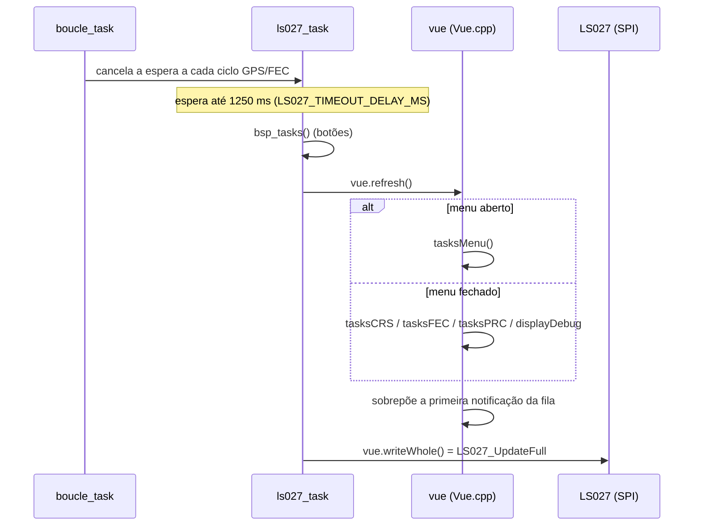
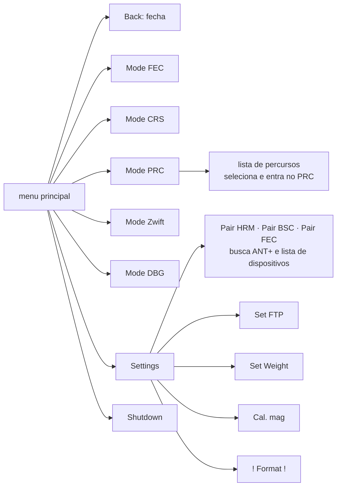
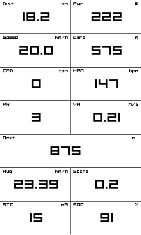
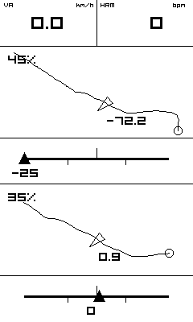
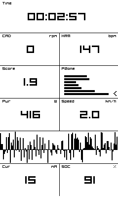
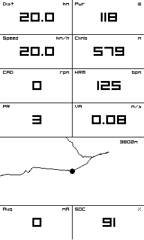
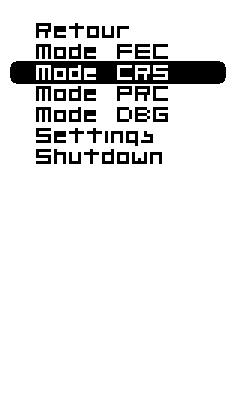
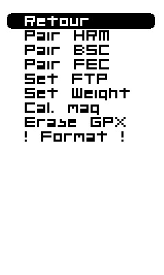

# Interface: telas, menus, botões e notificações

Como o stravaV10 original desenha as telas no Sharp Memory LCD, como os três botões navegam pelos modos e menus, e em que pé está a interface do port Zephyr. A interface em paisagem que o port teve até 2026-09-19 não traduzia a original e saiu. A interface da placa nova (LVGL, retrato, 8 cores ou preto e branco, com os arranjos do legacy), com todas as telas desenhadas e testadas no PC, está em [18-interface-telas.md](18-interface-telas.md).

**Nesta página:** [Display](#display) · [Interface original](#interface-original) · [Imagens](#imagens) · [Interface do port](#interface-do-port) · [Comparação](#comparação) · [O que falta](#o-que-falta)

## Display

| Item | Valor |
|---|---|
| Painel | Sharp Memory LCD LS027, 400 × 240 pixels, 1 bit por pixel, sem backlight |
| Montagem no aparelho | **retrato**: 240 de largura × 400 de altura (foto `img/front1.png`) |
| Interface | SPI a 2 MHz, LSB primeiro, CS ativo em nível alto |
| Buffer | 12.482 B: `[comando][endereço][50 B de pixels][dummy] × 240 linhas + [dummy]`; bit menos significativo = pixel da esquerda |
| VCOM | precisa alternar: o legacy alterna pelo bit M1 a cada envio; na V3, EXTMODE e EXTCOMIN vão ao GND por 10 kΩ (R13, R16) e o DISP ao VCC por 10 kΩ e 0,1 µF (R17, C43); a placa nova usa o EXTCOMIN ([18](18-interface-telas.md#atualização-e-luz)) |
| Refresh | legacy: por evento, cerca de 1 Hz; placa nova: a cada época do GNSS ou botão, só as linhas que mudaram |

O layout do buffer é o de `legacy/drivers/lcd/ls027.c:22-24`; o driver do port antigo, removido em 2026-09-19, usava o mesmo, e o driver novo (`memlcd`, [05](05-arquitetura-zephyr.md#tela)) guarda o quadro da Sharp nos mesmos 12.482 B.

## Interface original

### Pipeline de desenho

- `Vue` herda de `VueCRS`, `VueFEC`, `VuePRC`, `VueDebug`, `NotifiableDevice` e `Menuable` (`legacy/source/vue/Vue.h:28`); o objeto global é `vue` (`legacy/source/Model.cpp:56`).
- **Retrato:** `setRotation(3)` (`Vue.cpp:25`) e `drawPixel(x, y)` → `LS027_drawPixel(y, 239 - x)` (`Vue.cpp:164`). Uma linha vertical lógica é uma linha física, então `drawFastVLine` escreve bits contíguos (`Vue.cpp:209-215`).
- **Uma fonte só:** `Org_01` da Adafruit GFX (glifos de 5 px), escalada de 1 a 4. As outras 53 fontes de `libraries/AdafruitGFX/Fonts/` não são usadas.
- A Adafruit GFX do projeto é modificada: linha espessa, linha tracejada, impressão da direita para a esquerda (`printRev`), `drawBitmap` com escala e fonte fixa em `static` (uma por execução).
- Números: `_fmkstr` **trunca** as casas decimais e mostra `---` acima de 100000 (`Screenutils.cpp`).

### Cadrans

A tela é uma grade de **2 colunas × 7 linhas** (6 no FEC): 57 px por linha com 7 linhas, colunas de 120 px.

| Widget | Arquivo | O que desenha |
|---|---|---|
| `cadran` | `Vue.cpp:264-310` | rótulo pequeno no canto, valor em tamanho 3 centralizado, unidade à direita; mais de 6 caracteres vira `---` |
| `cadranH` | `Vue.cpp:225-261` | o mesmo em largura total |
| `cadranRR` | `Vue.cpp:389-439` | barras por zona de variabilidade RR, com `>` na zona atual |
| `cadranZones` | `VueFEC.cpp:170-209` | barras do tempo em cada zona de potência |
| `HistoH` | `Vue.cpp:312-353` | histograma em torno de uma linha de referência tracejada |
| `cadranPowerVector` | `VueFEC.cpp:95-168` | polígono polar do torque pelo ângulo do pedivela |
| `partner` | `VueCRS.cpp:550-596` | "avião" de desempenho no segmento: triângulo na posição `avance / curtime` entre −25 % e +25 % |

### Telas por modo

| Modo | Tela | Conteúdo |
|---|---|---|
| CRS | GPS (automática) | quando a última posição tem mais de 6 s (`LOCATOR_MAX_DATA_AGE_MS`) |
| CRS | página 1, sem segmento | Dist · Pwr / Speed · Climb / CAD · HRM / SL · VA / Next · Alt / Avg · Score / STC · SOC |
| CRS | página 1, 1 segmento | 4 linhas de dados, mini-mapa do segmento nas linhas 5–6 e `partner` (ou Next) na 7 |
| CRS | página 1, 2+ segmentos | SL · HRM e dois segmentos, com mini-mapa e `partner` conforme o estado de cada um |
| CRS | página 2 | dados, "Next turn" (distância Komoot), `cadranRR` e ícone Komoot de 110 × 110 |
| CRS | página 3 | barra e histograma de pitch, bússola, "rugosidade" (FXOS e barômetro) |
| PRC | mapa | 4 linhas de dados, mapa do percurso nas linhas 5–6 com zoom, corrente média e SOC |
| FEC | trainer | Time / CAD · HRM / Score · PZone / Pwr · RR / vetor de potência |
| DBG | debug | satélites e SNR, idade da posição, pino de fix, estado do GPS, corrente e tensão do STC3100, segmentos carregados |

Mapa e mini-mapa usam projeção equiretangular linear (`regFenLim`, com saturação na borda), norte para cima. O zoom do PRC é `nível² × 250 / 100` metros de meia-largura (nível 10 = 250 m, `legacy/source/display/Zoom.cpp:52-88`).

### Botões

Três botões ativos em nível baixo: esquerda P0.14, centro P0.13, direita P0.11 (`legacy/custom_board_v3.h:36-51`). O legacy só usa **pressão curta** (ação padrão do BSP do nRF5 SDK).

| Contexto | Esquerda | Centro | Direita |
|---|---|---|---|
| CRS | página anterior | abre o menu | próxima página |
| PRC | afasta o zoom | abre o menu | aproxima o zoom |
| FEC, DBG | — | abre o menu | — |
| menu de itens | item anterior | executa | próximo item |
| menu de valor (FTP, peso) | −1 | grava e volta | +1 |

Nos primeiros 5 s após o boot os eventos de menu são ignorados (`Menuable.cpp:326`).

### Menu

- Árvore em `legacy/source/vue/Menuable.cpp:255-294`; cada página tem "Back" no índice 0 (`MenuObjects.cpp:135-139`).
- O item selecionado recebe um retângulo arredondado em XOR: texto branco sobre barra preta (`img/menu1.png`).
- FTP e peso gravam na hora, na FRAM (`UserSettings::writeConfig`).
- Não há item de MSC: o modo USB Mass Storage entra por comando na serial.

### Notificações

- **Tela:** fila de até 10 (`legacy/source/vue/Notif.h:33-53`); só a primeira aparece, numa faixa no topo, por `persist + 1` refreshes (≈6 s). Tipos `Partial` (só a mensagem) e `Complete` ("título: mensagem").
- **Produtores:** hardfault e "last void" no boot, FDIR "Attitude restored", carga de PRC, pareamento ANT+, FE-C, calibração do magnetômetro, reset do GPS, EPO e host aiding.
- **LED (NeoPixel):** pulso vermelho no boot; durante um segmento, pisca vermelho quando atrás do recorde e azul quando à frente, mais rápido perto do empate (`legacy/source/display/SegmentManager.cpp:43-100`).
- **Splash:** silhueta de um quadro de bicicleta (`legacy/drivers/lcd/ls027_splash.h`) até o primeiro refresh.
- Não há tela de bateria fraca; o desligamento automático após 15 min sem atividade não avisa.

## Imagens

As capturas vêm de versões anteriores do firmware original, provavelmente do simulador `tools/TDD` com o `LS027simulator.jar`.

| Imagem | O que mostra | Tela |
|---|---|---|
|  | Dist, Pwr, Speed, Climb, CAD, HRM, PR, VA, Next (largura total), Avg, Score, STC, SOC | CRS página 1 sem segmento (versão antiga: hoje a linha 4 é SL · VA) |
|  | dois mini-mapas de segmento com % percorrido e dois `partner` | CRS página 1 com 2 segmentos ativos |
|  | Time, CAD, HRM, Score, PZone, Pwr, Speed, histograma de potência, Cur, SOC | FEC (versão antiga: histograma e Cur · SOC hoje estão em `#if 0`) |
|  | dados e mapa do percurso com zoom de 3802 m | PRC |
|  | menu principal com "Mode CRS" selecionado | menu (versão antiga: "Retour", sem "Mode Zwift") |
|  | Settings com "Erase GPX" | Settings (versão antiga) |

| Foto | O que mostra |
|---|---|
| [img/front1.png](img/front1.png) | aparelho em retrato com a tela DBG, três botões abaixo do LCD |
| [img/side1.png](img/side1.png) | perfil da caixa em duas partes, botões numa extremidade |
| [img/back1.png](img/back1.png) | tampa traseira com micro-USB e encaixe circular de suporte |

## Interface do port

A interface em paisagem do port (`src/vue`: 9 páginas em fonte 5×7, com o driver `ls027.c`) saiu em 2026-09-19, na migração para os serviços ([05](05-arquitetura-zephyr.md)); a descrição dela e dos seus defeitos fica no histórico do git. A interface nova, em LVGL e em retrato, com os arranjos do legacy, está em `zephyr_app/src/ui` e em [18-interface-telas.md](18-interface-telas.md). Desde 2026-09-19 ela roda no firmware: a thread `ui` recebe o retrato do modelo e as teclas, o driver próprio (`zephyr_app/modules/gnss_drivers`) desenha no JDI LPM027M128B ou na Sharp LS027B7DH01 em retrato, e as ações viram comandos ([05](05-arquitetura-zephyr.md#tela)). Build verificado; nada visto em tela de verdade.

## Comparação

| Legacy | Interface nova (`src/ui`) | Estado |
|---|---|---|
| retrato 240 × 400, `Org_01`, grade de cadrans | retrato, DejaVu Sans de 1 bit, a mesma grade com barra de estado | diferente ([18](18-interface-telas.md#diferenças-para-o-legacy)) |
| splash | partida com a bicicleta desenhada em linhas | diferente |
| CRS página 1, com os arranjos de 0, 1 e 2 segmentos | os mesmos arranjos | igual no PC |
| CRS páginas 2 (Komoot, RR) e 3 (pitch, bússola) | as mesmas, com seta desenhada, rua, rumo em graus e rugosidade com nome | diferente |
| troca automática para a tela GPS sem posição | igual, com posição mais velha que 6 s | igual no PC |
| PRC com mapa, zoom e segmentos | igual, **projetado pelo modelo**: `src/svc/model/model_ui.c:556-603` e `:645-676` sobre `src/model/map_project.c` (`test_map_project`, 8 casos) | igual no PC; falta ver num painel |
| FEC | igual, na grade de 7 linhas | diferente |
| menu com modos, percursos, pareamento, FTP, peso, calibração, formatação, desligar | igual, com Sensores, Tela e luz e confirmação da formatação | diferente |
| fila de 10 notificações e produtores | a fila; os produtores chegam com cada serviço | parcial |
| LED (pulsos e pisca de segmento) | LED RGB por `pwm-leds` na placa nova | ausente |

A interface está no firmware desde 2026-09-19, testada no PC e no build, não na placa.

## O que falta

Em ordem de prioridade (P = até 1 dia, M = 2 a 5 dias, G = mais de uma semana):

Feitos em 2026-09-19, no build: o driver próprio da tela (JDI em 3 bits e Sharp em 1 bit, retrato, quantização da interface, só as linhas que mudaram, EXTCOMIN ou VCOM serial), o LVGL na thread `ui` com as ações publicadas como comandos, as teclas pelo subsistema de entrada (`gpio-keys` e `zephyr,input-longpress`) e a máquina da luz. Feito em 2026-09-20: os mini-mapas dos segmentos e o mapa do PRC projetados pelo modelo, como `afficheSegment` e `Zoom.cpp`, em `src/model/map_project.c`. Falta:

1. **M** · notificações dos serviços (boot, GPS, pareamento, FDIR).
2. **M** · na placa nova, o centro pelo SHPHLD e pelo GPIO3 do nPM1300, e a luz de verdade (o LPM027M128B não tem luz própria).
3. **P** · ver tudo num painel: SPI, COM, cores, tempos e legibilidade ao sol.
