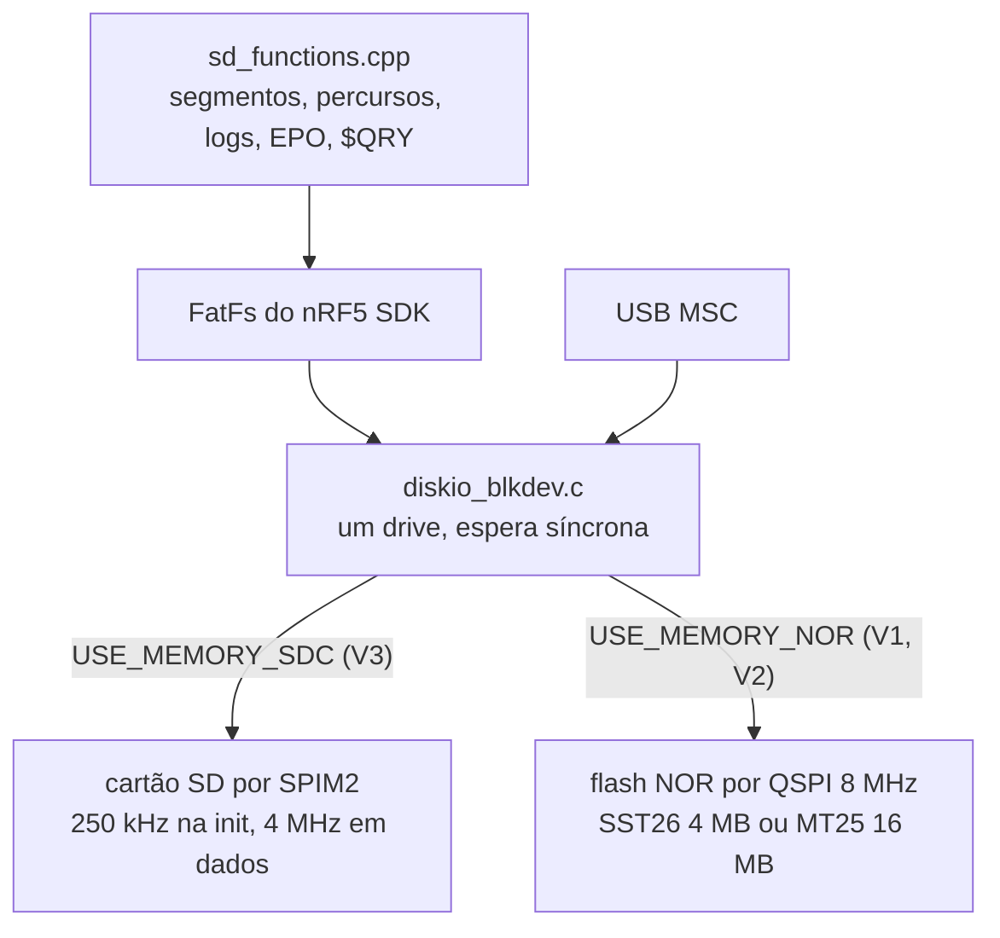

# Armazenamento e USB

Onde e como o stravaV10 guarda segmentos, percursos, logs e EPO, a pilha FatFs sobre SD ou flash NOR, a USB composta (CDC + MSC) e o estado disso no port, onde o sistema de arquivos ainda está em stub.

**Nesta página:** [Arquivos do legacy](#arquivos-do-legacy) · [Pilha de armazenamento](#pilha-de-armazenamento) · [USB](#usb) · [Armazenamento no port](#armazenamento-no-port) · [Para ligar o SD](#para-ligar-o-sd) · [RAM](#ram)

## Arquivos do legacy

Tudo na **raiz** do cartão; o tipo é decidido pelo nome (`legacy/source/sd/sd_functions.cpp:279-333`).

| Tipo | Nome | Formato |
|---|---|---|
| Segmento Strava | `LLLLL#OO.OOO` (12 caracteres, `#` na posição 5 e `.` na 8, resto `[0-9A-Z]`) | texto; linha `<Name>...</Name>` ignorada; pontos `lat ; lon ; rtime ; alt` |
| Percurso | `*.PAR` (maiúsculas) | texto `lat lon [ele]` separado por espaço; a elevação é descartada |
| Log de atividade | `@<DDMMYY>.txt` (sem zero à esquerda no dia: `@50925.txt` é 5/9/25) | texto com `;`, 19 campos, `CRLF` |
| EPO do GPS | `MTK14.EPO` | binário MTK, registros de 72 B por satélite |

- **O nome do segmento codifica a posição inicial** em base 36 (`calculePos`, `libraries/utils/utils.c:201-227`): `lat = base36(c0..c4)/1e5 − 90`, `lon = base36(c6 c7 c9 c10 c11)/1e5 − 180`, resolução de 1e-5° (~1,1 m). Isso permite decidir a carga sem abrir o arquivo.
- O tempo de referência `rtime` de cada ponto é relativo ao primeiro (o parser subtrai o `rtime` do 1º ponto).
- Campos do log: `lat;lon;alt;secj;pwr;bpm;cadence;alpha_bar;alpha_zero;baro_ele;baro_corr;climb;filt_ele;gps_ele;vit_asc;rough0;rough1;rough2;b_rough;`.
- Amostras reais: 138 segmentos (4 a 1291 pontos, mediana 57) e 2 percursos (`MJ_40.PAR` com 848 linhas, `ROTT.PAR` com 950) em `tools/TDD/DB/`.

## Pilha de armazenamento

- A escolha entre SD e NOR é feita na compilação, pela placa (`legacy/custom_board_v3.h:87-88`).
- `f_mount` com 5 tentativas; sem sistema de arquivos, dá erro (o `mkfs` automático está comentado). `$DWN,15` formata; `$DWN,13` apaga a NOR inteira.

## USB

- Dispositivo composto `app_usbd` (`legacy/source/usb/usb_cdc.c`): CDC ACM nas interfaces 0 e 1 e, na interface 2, uma classe vazia trocada por **MSC** no modo mass storage. VID 0x1915, PID 0x520F, produto "StravaV10".
- O CDC recebe os comandos do VParser (`$LOC`, `$DWN`, `$QRY`) e, com `USE_VCOM_LOGS`, leva o log. As respostas de `$QRY` saem só pelo BLE NUS.
- `$DWN,16` entra em MSC: desmonta o FAT, para a boucle e troca as classes USB. Só volta com reset.

## Armazenamento no port

| Item | Port | Diferença |
|---|---|---|
| Sistema de arquivos | `src/utils/fs_stubs.c`: todo `fs_*` retorna `-ENOTSUP` | `CONFIG_FILE_SYSTEM` comentado no `prj.conf` |
| Nó do SD | `spi2` + `sdhc0` (`zephyr,sdhc-spi-slot`, disco "SD") no overlay, 8 MHz | legacy usava 4 MHz e pinos com alta corrente |
| Segmentos | binário em `/SD:/segments/*.seg` (`seg_header_t` 32 B + `seg_point_t` 20 B), nome `<header.name>.seg` | incompatível com o texto do legacy e sem ferramenta que gere o binário |
| Percursos | `.CRS` com `lat;lon;alt`, até 500 pontos | legacy usa `.PAR` com espaço; loader para no primeiro CRLF |
| Log | `/SD:/logs/AAMMDD_HHMMSS.csv`, 13 colunas | legacy `@DDMMYY.txt`, 19 campos; `baro_alt` e `filt_alt` recebem a altitude do GPS |
| EPO | `/SD:/MTK14.EPO` | offset de cabeçalho e comandos errados (ver [10](10-status-do-port.md#defeitos-abertos)) |
| USB | `src/usb/usb_cdc.c` e `usb_msc.c` fora do `CMakeLists.txt` | usam o stack USB antigo, depreciado no Zephyr 4.3; `CONFIG_USB_DEVICE_MSC` não existe |

Em 2026-09-18 o estouro do `sd_logger` com o cartão indisponível foi corrigido (`test_sd_logger`).

## Para ligar o SD

1. Kconfig: `CONFIG_FILE_SYSTEM`, `CONFIG_FAT_FILESYSTEM_ELM`, `CONFIG_DISK_ACCESS`, `CONFIG_SDHC`, `CONFIG_SPI_SDHC` (LFN só se os nomes longos forem mantidos) e tirar `fs_stubs.c` do build.
2. Montagem: `fs_mount()` de `/SD:` no boot ou um nó `zephyr,fstab,fatfs` com `automount`; tratar cartão ausente.
3. Tirar `hal_spi` do SPI2 (ele também configura o CS do SD, sem uso).
4. Escrever em arquivo só fora de ISR (já garantido depois da correção de 2026-09-18) e decidir os formatos (legacy ou novos, ver [decisões](10-status-do-port.md#decisões-do-dono)).
5. USB: migrar para o `usb device_next` (`CONFIG_USB_DEVICE_STACK_NEXT`, `CONFIG_USBD_CDC_ACM_CLASS`, `CONFIG_USBD_MSC_CLASS` com `USBD_DEFINE_MSC_LUN`), com `fs_unmount` real antes de expor o cartão.

## RAM

Buffers estáticos desta área no build de 2026-09-18:

| Símbolo | Bytes | Composição |
|---|---|---|
| `seg_runtime` | 22.000 | 50 segmentos × 440 B |
| `points` (parcours) | 8.000 | 500 × 16 B |
| `segments` | 2.200 | 50 × 44 B |
| `seg_headers` | 1.600 | 50 × 32 B |
| `sd_logger` | 444 | 5 entradas de 72 B + controle |
| `user_history` | 408 | histórico do ciclista |

São 34,6 KB para funções que hoje não carregam dados. O legacy alocava os pontos no heap só para os segmentos a menos de 300 m; o port precisa de um pool dimensionado por distância, não 50 segmentos fixos.
