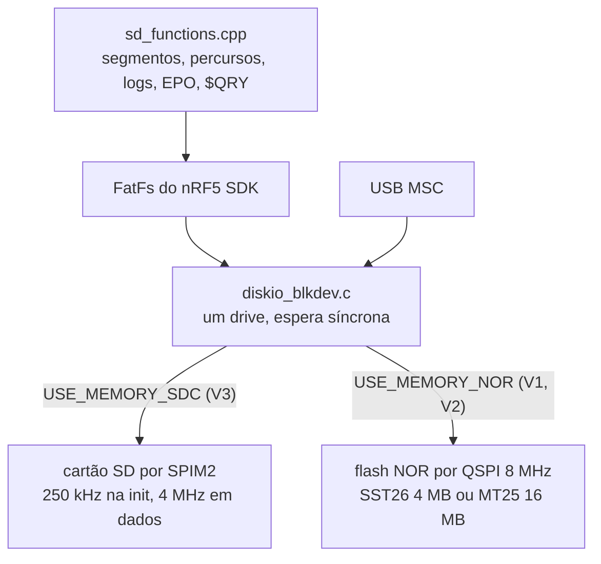

# Armazenamento e USB

Onde e como o stravaV10 guarda segmentos, percursos, logs e EPO, a pilha FatFs sobre SD ou flash NOR, a USB composta (CDC + MSC) e o estado disso no port, onde o sistema de arquivos ainda está em stub.

**Nesta página:** [Arquivos do legacy](#arquivos-do-legacy) · [Pilha de armazenamento](#pilha-de-armazenamento) · [USB](#usb) · [Armazenamento no port](#armazenamento-no-port) · [Estado do SD no port](#estado-do-sd-no-port) · [RAM](#ram)

## Arquivos do legacy

Tudo na **raiz** do cartão; o tipo é decidido pelo nome (`legacy/source/sd/sd_functions.cpp:279-333`).

| Tipo | Nome | Formato |
|---|---|---|
| Segmento Strava | `LLLLL#OO.OOO` (12 caracteres, `#` na posição 5 e `.` na 8, resto `[0-9A-Z]`) | texto; linha `<Name>...</Name>` ignorada; pontos `lat ; lon ; rtime ; alt` |
| Percurso | `*.PAR` (maiúsculas) | texto `lat lon [ele]` separado por espaço; a elevação é descartada |
| Log de atividade | `@<DDMMYY>.txt` (sem zero à esquerda no dia: `@50925.txt` é 5/9/25) | texto com `;`, 19 campos, `CRLF` |
| EPO do GPS | `MTK14.EPO` | binário MTK, registros de 72 B por satélite |

- **O nome do segmento codifica a posição inicial** em base 36 (`calculePos`, `libraries/utils/utils.c:201-227`): `lat = base36(c0..c4)/1e5 − 90`, `lon = base36(c6 c7 c9 c10 c11)/1e5 − 180`, resolução de 1e-5° (~1,1 m). Isso permite decidir a carga sem abrir o arquivo.
- O tempo de referência `rtime` de cada ponto é relativo ao primeiro (o parser subtrai o `rtime` do 1º ponto).
- Campos do log: `lat;lon;alt;secj;pwr;bpm;cadence;alpha_bar;alpha_zero;baro_ele;baro_corr;climb;filt_ele;gps_ele;vit_asc;rough0;rough1;rough2;b_rough;`.
- Amostras reais: 138 segmentos (4 a 1291 pontos, mediana 57) e 2 percursos (`MJ_40.PAR` com 848 linhas, `ROTT.PAR` com 950) em `tools/TDD/DB/`.

## Pilha de armazenamento

- A escolha entre SD e NOR é feita na compilação, pela placa (`legacy/custom_board_v3.h:87-88`).
- `f_mount` com 5 tentativas; sem sistema de arquivos, dá erro (o `mkfs` automático está comentado). `$DWN,15` formata; `$DWN,13` apaga a NOR inteira.

## USB

- Dispositivo composto `app_usbd` (`legacy/source/usb/usb_cdc.c`): CDC ACM nas interfaces 0 e 1 e, na interface 2, uma classe vazia trocada por **MSC** no modo mass storage. VID 0x1915, PID 0x520F, produto "StravaV10".
- O CDC recebe os comandos do VParser (`$LOC`, `$DWN`, `$QRY`) e, com `USE_VCOM_LOGS`, leva o log. As respostas de `$QRY` saem só pelo BLE NUS.
- `$DWN,16` entra em MSC: desmonta o FAT, para a boucle e troca as classes USB. Só volta com reset.

## Armazenamento no port

| Item | Port | Diferença |
|---|---|---|
| Sistema de arquivos | FatFs do Zephyr, montado em `/SD:` pelo serviço de armazenamento (`src/svc/storage/storage_svc.c`), com nomes longos num buffer estático | o legacy usa o FatFs do nRF5 SDK; não testado com cartão |
| Nó do SD | `spi2` + `sdhc0` (`zephyr,sdhc-spi-slot`, disco "SD") no overlay, 8 MHz | legacy usava 4 MHz e pinos com alta corrente |
| Segmentos | os arquivos do legacy, na raiz do cartão: a varredura só lê os nomes (posição em base 36) e o alocador abre o arquivo quando o ciclista chega a menos de 300 m, como no legacy | igual ao legacy na leitura; a escrita de segmentos pelo aparelho ainda não existe |
| Percursos | texto `lat lon [alt]` do legacy, `.PAR` e `.CRS`, até 500 pontos | desde 2026-09-20 é o formato do legacy, com CRLF, linhas `<meta>` e ponto sem altitude; um percurso maior que 500 pontos é dividido pela metade enquanto carrega (os dois reais, de 848 e 950 pontos, ficam em 424 e 475), o que o legacy não fazia por usar o heap |
| Log | `@<data>.txt` na raiz, 19 campos com `;` e CRLF, como o legacy | igual desde 2026-09-19; o ponto leva os ângulos do filtro, a correção do barômetro, a velocidade vertical e as rugosidades do acelerômetro e do barômetro |
| EPO | `/SD:/MTK14.EPO` | offset de cabeçalho e comandos errados (ver [10](10-status-do-port.md#defeitos-abertos)) |
| USB | nada: os arquivos da pilha USB antiga saíram em 2026-09-19 | a USB `device_next` (CDC ACM e MSC) é o passo da USB |

Em 2026-09-18 o estouro do `sd_logger` com o cartão indisponível foi corrigido (`test_sd_logger`).

## Estado do SD no port

Desde 2026-09-20 o alvo nRF54LM20 não usa cartão: a placa nova leva **flash NOR soldada** (decisão do dono, [15](15-avaliacao-componentes.md#armazenamento)), e o firmware monta o FatFs sobre um `zephyr,flash-disk` na partição dela, com o mesmo ponto de montagem `/SD:`, o mesmo código de arquivos e o mesmo disco indo ao PC quando o USB chegar. O build usa o MX25R6435F de 8 MB que o nRF54LM20 DK traz no `spi00`; uma parte em branco é formatada na primeira montagem (`CONFIG_FS_FATFS_MKFS`). O alvo nRF52840 DK, que representa a placa V3, continua com o cartão pelo `zephyr,sdhc-spi-slot`.

Desde 2026-09-19 o cartão é do serviço de armazenamento: ele monta o FatFs, carrega os segmentos, lista os percursos (`*.PAR` do legacy e `*.CRS` do port, na raiz) e grava o log com os pontos que o modelo publica, fora das outras threads. Os formatos do legacy estão lidos e escritos (segmentos em texto, `.PAR`, `@DDMMYY.txt`), e o modelo abre o percurso que a tela escolhe. Falta: a formatação do cartão e o MSC. Nada disso foi testado com cartão.

## RAM

Buffers estáticos desta área no build de 2026-09-18:

| Símbolo | Bytes | Composição |
|---|---|---|
| `seg_runtime` | 22.000 | 50 segmentos × 440 B |
| `points` (parcours) | 8.000 | 500 × 16 B |
| `segments` | 2.200 | 50 × 44 B |
| `seg_headers` | 1.600 | 50 × 32 B |
| `sd_logger` | 444 | 5 entradas de 72 B + controle |
| `user_history` | 408 | histórico do ciclista |

São 34,6 KB para funções que hoje não carregam dados. O legacy alocava os pontos no heap só para os segmentos a menos de 300 m; o port precisa de um pool dimensionado por distância, não 50 segmentos fixos.
