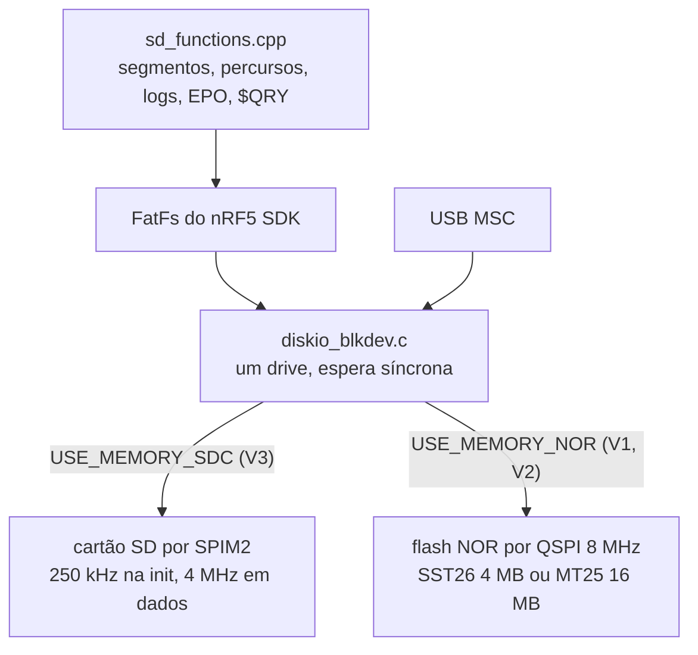

# Armazenamento e USB

Onde e como o stravaV10 guarda segmentos, percursos, logs e EPO, a pilha FatFs sobre SD ou flash NOR, a USB composta (CDC + MSC) e o estado disso no port, onde o sistema de arquivos é FatFs de verdade desde 2026-09-19, mas nunca foi exercitado com cartão nem com cabo.

**Nesta página:** [Arquivos do legacy](#arquivos-do-legacy) · [Arquivo da atividade em FIT](#arquivo-da-atividade-em-fit) · [Pilha de armazenamento](#pilha-de-armazenamento) · [USB](#usb) · [Armazenamento no port](#armazenamento-no-port) · [Estado do SD no port](#estado-do-sd-no-port) · [RAM](#ram)

## Arquivos do legacy

Tudo na **raiz** do cartão; o tipo é decidido pelo nome (`legacy/source/sd/sd_functions.cpp:279-333`).

| Tipo | Nome | Formato |
|---|---|---|
| Segmento Strava | `LLLLL#OO.OOO` (12 caracteres, `#` na posição 5 e `.` na 8, resto `[0-9A-Z]`) | texto; linha `<Name>...</Name>` ignorada; pontos `lat ; lon ; rtime ; alt` |
| Percurso | `*.PAR` (maiúsculas) | texto `lat lon [ele]` separado por espaço; a elevação é descartada |
| Log de atividade | `@<DDMMYY>.txt` (sem zero à esquerda no dia: `@50925.txt` é 5/9/25) | texto com `;`, 19 campos, `CRLF` |
| EPO do GPS | `MTK14.EPO` | binário MTK, registros de 72 B por satélite |

- **O nome do segmento codifica a posição inicial** em base 36 (`calculePos`, `libraries/utils/utils.c:201-227`): `lat = base36(c0..c4)/1e5 − 90`, `lon = base36(c6 c7 c9 c10 c11)/1e5 − 180`, resolução de 1e-5° (~1,1 m). Isso permite decidir a carga sem abrir o arquivo.
- O tempo de referência `rtime` de cada ponto é relativo ao primeiro (o parser subtrai o `rtime` do 1º ponto).
- Campos do log: `lat;lon;alt;secj;pwr;bpm;cadence;alpha_bar;alpha_zero;baro_ele;baro_corr;climb;filt_ele;gps_ele;vit_asc;rough0;rough1;rough2;b_rough;`.
- Amostras reais: 138 segmentos (4 a 1291 pontos, mediana 57) e 2 percursos (`MJ_40.PAR` com 848 linhas, `ROTT.PAR` com 950) em `tools/TDD/DB/`.

## Arquivo da atividade em FIT

Desde 2026-09-21 o aparelho grava **um arquivo FIT por passeio**, ao lado do `@DDMMYY.txt` do legacy, porque é o formato que Strava, Garmin Connect e Komoot leem sem conversor. O codificador é `zephyr_app/src/model/fit_encode.c`, C puro sobre um buffer de quem chama, e quem grava é o serviço de armazenamento (`CONFIG_GNSS_FIT`, ligado de fábrica).

| Item | Escolha | Porquê |
|---|---|---|
| Nome | `<DDMMYY>.FIT` na raiz; o segundo passeio do dia ganha uma letra (`210926A.FIT`) | oito caracteres e três de extensão, que a FAT aceita sem nomes longos, e a mesma data do log do legacy |
| Ritmo | uma mensagem `record` por época, 1 Hz, também com o cronômetro parado | é o que o mercado grava; o log de texto do legacy fica nos seus 15 m |
| Fabricante | 255, "development" | o formato reserva esse número para aparelho que não é produto |
| Pausa | uma mensagem `event` de cronômetro em cada pausa e cada retomada | o leitor sabe que o buraco nos pontos é parada, e não receptor mudo |
| Voltas | uma `lap` a cada volta fechada, automática ou pela tecla | cada uma com distância, tempo, subida, descida e médias próprias |
| Fim | `timer stop`, a última `lap`, a `session`, a `activity` e o CRC do arquivo | é o que faz do arquivo uma atividade e não uma lista de pontos |
| Cabeçalho | escrito de novo no fim, com o tamanho que o arquivo ficou | o tamanho só se sabe no fim, e reescrever o cabeçalho **não** estraga o CRC: ver abaixo |

**O cabeçalho no fim não estraga o CRC.** Os dois últimos bytes de um cabeçalho FIT são o CRC dos doze anteriores, e alimentar uma mensagem seguida do próprio CRC deixa esse CRC em zero. Então o estado depois de **qualquer** cabeçalho válido é zero, diga ele o tamanho que disser, e o CRC do arquivo nunca depende do tamanho escrito ali. É isso que deixa o aparelho fechar um arquivo de centenas de quilobytes sem reler um byte do que gravou. `test_fit_encode` confere a propriedade em separado e o CRC final contra o cálculo direto em 33 tamanhos de arquivo.

**Tamanho.** Uma mensagem `record` tem 26 bytes: hora, posição, altitude, frequência, cadência, distância, velocidade, potência e temperatura. A 1 Hz isso dá cerca de 94 KB por hora, ou **380 KB num passeio de quatro horas**. Os 8 MB da placa nova ([19](19-lista-de-compras.md#armazenamento)) guardam perto de vinte passeios desses ao lado dos segmentos; quando encher, o ciclista apaga pelo USB ou pelo telefone.

**O que fica de fora.** O telefone **não** manda um `.FIT` para o aparelho: quem grava um passeio é o aparelho, e um arquivo de fora seria falsificação ([`file_policy.c`](../zephyr_app/src/model/file_policy.c)). Nada disso foi gravado em cartão nem lido por um leitor de verdade: o que existe é o teste de host que monta o arquivo e o lê de volta mensagem a mensagem.

## Pilha de armazenamento

- A escolha entre SD e NOR é feita na compilação, pela placa (`legacy/custom_board_v3.h:87-88`).
- `f_mount` com 5 tentativas; sem sistema de arquivos, dá erro (o `mkfs` automático está comentado). `$DWN,15` formata; `$DWN,13` apaga a NOR inteira.

## USB

- Dispositivo composto `app_usbd` (`legacy/source/usb/usb_cdc.c`): CDC ACM nas interfaces 0 e 1 e, na interface 2, uma classe vazia trocada por **MSC** no modo mass storage. VID 0x1915, PID 0x520F, produto "StravaV10".
- O CDC recebe os comandos do VParser (`$LOC`, `$DWN`, `$QRY`) e, com `USE_VCOM_LOGS`, leva o log. As respostas de `$QRY` saem só pelo BLE NUS.
- `$DWN,16` entra em MSC: desmonta o FAT, para a boucle e troca as classes USB. Só volta com reset.

## Armazenamento no port

| Item | Port | Diferença |
|---|---|---|
| Sistema de arquivos | FatFs do Zephyr, montado em `/SD:` pelo serviço de armazenamento (`src/svc/storage/storage_svc.c`), com nomes longos num buffer estático | o legacy usa o FatFs do nRF5 SDK; não testado com cartão |
| Nó do SD | `spi2` + `sdhc0` (`zephyr,sdhc-spi-slot`, disco "SD") no overlay, 8 MHz | legacy usava 4 MHz e pinos com alta corrente |
| Segmentos | os arquivos do legacy, na raiz do cartão: a varredura só lê os nomes (posição em base 36) e o alocador abre o arquivo quando o ciclista chega a menos de 300 m, como no legacy | igual ao legacy na leitura; a escrita de segmentos pelo aparelho ainda não existe |
| Percursos | texto `lat lon [alt]` do legacy, `.PAR` e `.CRS`, até 500 pontos | desde 2026-09-20 é o formato do legacy, com CRLF, linhas `<meta>` e ponto sem altitude; um percurso maior que 500 pontos é dividido pela metade enquanto carrega (os dois reais, de 848 e 950 pontos, ficam em 424 e 475), o que o legacy não fazia por usar o heap |
| Log | `@<data>.txt` na raiz, 19 campos com `;` e CRLF, como o legacy | igual desde 2026-09-19; o ponto leva os ângulos do filtro, a correção do barômetro, a velocidade vertical e as rugosidades do acelerômetro e do barômetro |
| EPO | `/SD:/MTK14.EPO` | offset de cabeçalho e comandos errados (ver [10](10-status-do-port.md#defeitos-abertos)) |
| USB | serviço próprio, `src/svc/usb/usb_svc.c`, no build do alvo que tem a pilha `device_next` (`zephyr_app/CMakeLists.txt:199`): porta serial com os comandos do legacy e, no modo USB, o disco do ciclista no PC ([Estado do SD no port](#estado-do-sd-no-port)). Os arquivos da pilha USB antiga saíram em 2026-09-19 | o legacy usava o `app_usbd` composto do nRF5 SDK; **não testada com cabo** |

Em 2026-09-18 o estouro do `sd_logger` com o cartão indisponível foi corrigido (`test_sd_logger`).

## Estado do SD no port

**USB, desde 2026-09-20** (`src/svc/usb/usb_svc.c`, só no alvo com a pilha `device_next`): o serviço oitavo liga o barramento quando o cabo entra e mostra ao PC uma **porta serial** com os mesmos comandos do legacy (`$LOC`, `$DWN`, `$QRY`...), lidos pelo mesmo `cmd_parser`; a interrupção do CDC só enfileira bytes, e a thread lê. O **disco** só aparece no modo USB, que o menu ou um `$DWN,16` pedem: aí o serviço de armazenamento já desmontou o sistema de arquivos e o PC fica dono da mídia, e sair dele pede reset, como no legacy. Enquanto o ciclista pedala, o disco é do firmware e o PC só vê a serial. Identificadores: VID 0x1209 e PID 0x0001, os de teste do pid.codes — um número próprio precisa ser pedido lá antes de qualquer venda. Nada disso foi testado com cabo.

### Formatos de percurso

O aparelho aceita **três**, e escolhe pelo conteúdo do arquivo, não pela extensão:

| Formato | De onde vem | Tamanho de 100 km a cada 10 m | O que traz |
|---|---|---|---|
| **`.RTE`** | `tools/route_convert.py`, do GPX ou do TCX | **100 KB** | nome, distância, subida e caixa no cabeçalho de 64 B; **CRC-32** do corpo; lista de curvas com o nome da rua |
| `.GPX`, `.TCX` | Strava, Komoot, RideWithGPS, direto | 1 a 3 MB | o traçado e a altitude; sem verificação |
| `.PAR`, `.CRS` | o legacy | 303 KB | o traçado e a altitude |

O `.RTE` é o formato deste projeto, descrito em `zephyr_app/include/model/route_file.h`: binário, little endian, versionado. Vale a pena porque o envio por Bluetooth fica 10 a 30 vezes mais rápido, o menu mostra nome e distância sem abrir o arquivo inteiro, um envio cortado no meio é pego pelo CRC antes de o ciclista sair seguindo uma rota que acaba no nada, e as curvas chegam padronizadas.

O GPX passa direto porque **ninguém deve ser obrigado a converter**: o leitor (`src/model/gpx_scan.c`) é uma máquina de estados que varre os bytes conforme chegam, sem montar o XML na memória, e aguenta o que os serviços escrevem — prefixos de namespace, extensões desconhecidas, atributos em qualquer ordem, aspas simples ou duplas e o arquivo chegando em pedaços. Como um GPX grande leva segundos para ser lido, o carregador alimenta o watchdog pelo caminho.

### Arquivos pelo telefone

O percurso entra no aparelho como num Garmin: o aplicativo manda o arquivo por Bluetooth, pelo **grupo de arquivos do mcumgr**, no mesmo enlace SMP da atualização ([07](07-radio-ant-ble.md#atualização-por-ble-dfu)). O aplicativo não é deste projeto; qualquer cliente SMP serve, e o nRF Connect Device Manager da Nordic é o de referência.

O firmware não entrega o armazenamento inteiro. As regras estão em `src/model/file_policy.c`, com `test_file_policy`, e valem para cada pedido que chega:

| Pedido | Resposta do aparelho |
|---|---|
| gravar `.PAR` ou `.CRS` (percurso) | aceita |
| gravar um nome de segmento do legacy | aceita |
| gravar `@DDMMYY.txt` (atividade) | **recusa**: quem escreve a atividade é o aparelho |
| gravar qualquer outra coisa | **recusa**: o firmware não saberia ler |
| ler, tamanho ou checksum de qualquer arquivo do cartão | aceita: é assim que o ciclista baixa o pedal |
| qualquer caminho fora da raiz do armazenamento, com `/` ou `..` | **recusa** |

Quando um arquivo chega, `src/rf/file_xfer.c` avisa na tela e pede ao serviço de armazenamento que liste o cartão de novo, então o percurso novo aparece no menu sem reiniciar. Não testado com telefone.

### Quanto cabe

| O que | Tamanho | Na flash de 8 MB |
|---|---|---|
| Segmento do legacy | mediana 3 KB, maior 52 KB | os 138 de exemplo somam 0,44 MB |
| Percurso de 100 km, ponto a cada 25 m | 121 KB (4.000 pontos de 31 B) | **68 percursos** |
| Percurso de 100 km, ponto a cada 10 m | 303 KB | 27 percursos |
| Log de um pedal de 10 h | 1,9 MB | cerca de 35 pedais, se nada mais estivesse guardado |

O limite prático não é a flash e sim a memória do aparelho: um percurso é lido para um array estático de `CONFIG_GNSS_ROUTE_POINTS` pontos (16 B cada) e um arquivo maior é dividido pela metade enquanto carrega. Na placa nova são **4.000 pontos**, o que dá um ponto a cada 25 m num percurso de 100 km — a mesma densidade que o Strava e o Komoot exportam; no alvo nRF52840, que tem um quarto da RAM, ficam os 500 de antes. Os segmentos guardam 768 pontos cada, três ao mesmo tempo.

Desde 2026-09-20 o alvo nRF54LM20 não usa cartão: a placa nova leva **flash NOR soldada** (decisão do dono, [15](15-avaliacao-componentes.md#armazenamento)), e o firmware monta o FatFs sobre um `zephyr,flash-disk` na partição dela, com o mesmo ponto de montagem `/SD:`, o mesmo código de arquivos e o mesmo disco indo ao PC quando o USB chegar. O build usa o MX25R6435F de 8 MB que o nRF54LM20 DK traz no `spi00`; uma parte em branco é formatada na primeira montagem (`CONFIG_FS_FATFS_MKFS`). O alvo nRF52840 DK, que representa a placa V3, continua com o cartão pelo `zephyr,sdhc-spi-slot`.

Desde 2026-09-19 o cartão é do serviço de armazenamento: ele monta o FatFs, carrega os segmentos, lista os percursos (`*.PAR` do legacy e `*.CRS` do port, na raiz) e grava o log com os pontos que o modelo publica, fora das outras threads. Os formatos do legacy estão lidos e escritos (segmentos em texto, `.PAR`, `@DDMMYY.txt`), e o modelo abre o percurso que a tela escolhe. Falta: a formatação do cartão e o MSC. Nada disso foi testado com cartão.

## RAM

Buffers estáticos desta área no build de 2026-09-18:

| Símbolo | Bytes | Composição |
|---|---|---|
| `seg_runtime` | 22.000 | 50 segmentos × 440 B |
| `points` (parcours) | 8.000 | 500 × 16 B |
| `segments` | 2.200 | 50 × 44 B |
| `seg_headers` | 1.600 | 50 × 32 B |
| `sd_logger` | 444 | 5 entradas de 72 B + controle |
| `user_history` | 408 | histórico do ciclista |

São 34,6 KB para funções que hoje não carregam dados. O legacy alocava os pontos no heap só para os segmentos a menos de 300 m; o port precisa de um pool dimensionado por distância, não 50 segmentos fixos.
