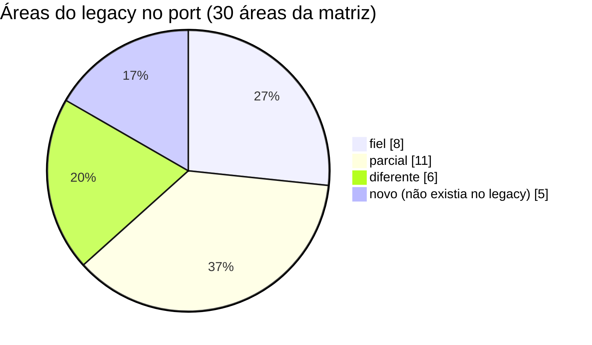
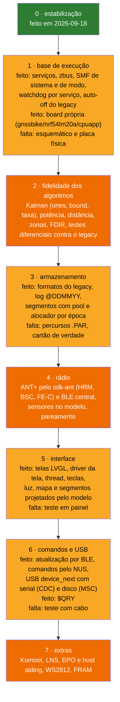

# Status do port

Onde o port Zephyr (`zephyr_app/`) está em relação ao firmware original (`legacy/`), o que foi corrigido na revisão de 2026-09-18, a migração para serviços de 2026-09-19, os defeitos que continuam abertos e a ordem proposta para o que falta. Substitui o gap analysis de novembro de 2025 (`historico/2025-11/`), que listava como ausentes módulos portados logo depois e trazia constantes erradas.

**Nesta página:** [Resumo](#resumo) · [Matriz por área](#matriz-por-área) · [Correções de 2026-09-18](#correções-de-2026-09-18) · [Migração de 2026-09-19](#migração-de-2026-09-19) · [Defeitos abertos](#defeitos-abertos) · [Roteiro](#roteiro) · [Decisões do dono](#decisões-do-dono)

## Resumo

- **Compila** no NCS v3.3.0 sem nenhum aviso de compilador (nRF54LM20 DK, o alvo principal: FLASH 636.144 B de 921.456 B do slot, RAM 393.080 B; a placa do projeto, `gnssbike/nrf54lm20a/cpuapp`: FLASH 636.376 B, RAM 393.120 B; mais o MCUboot com 45.676 B de FLASH e 22.880 B de RAM no DK e 45.880 B e 22.888 B na placa) e **passa em 53 conjuntos de testes de host** (714 casos). Números conferidos em 2026-09-23 com build do zero nos dois alvos. **Nada foi testado na placa** nem no DK.
- Desde 2026-09-19 o firmware é a base da arquitetura de [16](16-arquitetura-firmware.md): oito serviços com thread própria, eventos no zbus, máquinas de sistema e de modo no SMF, hardware pelas APIs do Zephyr ([05](05-arquitetura-zephyr.md)). O HAL próprio, os drivers da V3 e a interface em paisagem saíram.
- Os algoritmos do legacy continuam no `src/model` e rodam na thread do modelo; os segmentos, os formatos de arquivo e o BLE central foram fechados entre 2026-09-20 e 2026-09-23 e **nenhum deles foi exercitado fora do PC**. A interface nova, em LVGL, está no firmware com o driver próprio da tela (JDI LPM027M128B e C, e Sharp LS027B7DH01, em retrato; a placa declara o **C** desde 2026-09-23), as teclas com toque longo e a luz; foi testada no PC (44 quadros em 2 temas), mas nunca vista em tela de verdade ([18](18-interface-telas.md)).
- ANT+: a pilha do add-on `sdk-ant` entra no build com `ANT=1`, sobe no boot e **abre canal escravo** (`rf/ant/ant_channel.c`), mas **nenhum canal abre de fato**: os `CONFIG_GNSS_ANT_*_DEV_TYPE` valem 0 e os arquivos de decodificação de página ficam fora do repositório, porque o ANT+ Adopter Agreement proíbe redistribuir e o repositório é público. Os clientes BLE (HRS, CSC, FTMS, CPS, LNS, ANCS, Komoot, radar) estão ligados de ponta a ponta no código, e nenhum foi testado com dispositivo.

## Matriz por área

Estados: **fiel** (mesmo comportamento), **diferente** (existe com regras ou constantes diferentes), **parcial** (existe e falta parte, quase sempre o teste em hardware) e **novo** (não existia no legacy). Desde 2026-09-23 nenhuma área está **ausente**, **em stub**, **não ligada** nem **quebrada**.

| Área | Legacy | Port | Estado | Detalhe |
|---|---|---|---|---|
| Execução | task manager cooperativo, eventos, tick de 5 ms | oito threads preemptivas de serviço, cada uma dormindo na sua caixa de entrada; eventos no zbus; a thread `model` é a única escritora do modelo | diferente | preemptivo, com cópias no lugar de estado compartilhado ([05](05-arquitetura-zephyr.md#threads)) |
| Watchdog | 4 s, alimentado por boucle e LCD | `task_wdt`: um canal de 4 s por thread de serviço, oito no total (`CONFIG_TASK_WDT_CHANNELS=10`), sobre o WDT do nRF | diferente | mais estrito que o legacy (cada thread responde pelo seu canal); não testado na placa ([05](05-arquitetura-zephyr.md#watchdog)) |
| Energia | latch pelo IO0 do STC3100, auto-off 15 min | máquina de sistema no SMF (`sys_fsm.c`): auto-off de 15 min com os pings do legacy (posição em CRS, PRC e DBG; rolo em FEC), desligamento em etapas com a resposta de cada serviço, ship mode do nPM1300 ou System OFF; medidor MAX17262 por driver próprio, com bateria fraca (10 %) e crítica (0 %); nPM1300 com os trilhos travados, o limite do VBUS pela fonte USB-C e a máquina de carga; AEM10900 por driver próprio, em 4,05 V com a placa ligada e de volta aos pinos antes de desligar | parcial | a potência do painel em mW espera o fator θ·L da e-peas; `test_sys_fsm`, `test_max17262`, `test_battery`, `test_charge`, `test_aem10900`; não testado na placa |
| Modos | CRS, PRC, FEC, Zwift, MSC com `init`/`invalidate` | máquina de modos no SMF na thread do modelo: CRS, PRC, FEC, Zwift, DBG; o GNSS dorme em FEC e Zwift | parcial | o laço do Zwift (`$LOC`) e o MSC ainda não existem |
| GPS e NMEA | TinyGPS++ com checksum, PMTK010→PMTK251, WDT de baud | API de GNSS do Zephyr pelo alias `gnss`: driver próprio do u-blox F10 e M10 por UBX no alvo da placa nova (`u-blox,max-f10` na peça escolhida, com L1 + L5, NavIC, standby e reinício por silêncio; `u-blox,max-m10` com LEAP na alternativa) e `gnss-nmea-generic` no alvo da V3, uma posição por época | parcial | falta AssistNow (no F10S, só Offline e Autonomous, e só de L1: o módulo é ROM) e o teste com receptor de verdade |
| Sensores (inclinação, rumo, rugosidade) | FXOS8700 a 50 Hz, média de 50 amostras, rugosidade por desvio médio (`fxos.cpp`) | serviço de sensores pela API do Zephyr (aliases `baro0`, `imu0`, `mag0`, `light0`) e `tilt.c`: mesmo ritmo e janela, rugosidade na unidade do legacy, rumo compensado pelo AN4248 | parcial | `test_tilt`; os eixos dos sensores na placa nova a confirmar; sem calibração do magnetômetro |
| Altitude (Kalman 3 estados) | `Attitude::computeFusion` | `kalman_altitude.c` + `udmatrix.c` | fiel | corrigidos em 2026-09-19 o P0 (900 em todos os elementos), o `bound` (valor absoluto) e a soma de matrizes que zerava o destino, além da taxa (uma fusão por época, com a pressão média de 1 s); `test_kalman_altitude`, `test_udmatrix` ([06](06-algoritmos.md#altitude-kalman-de-3-estados)) |
| Distância | equiretangular com 6.371.008 m, posições brutas, descarte dos primeiros 25 m, instantâneo a cada 15 m | a mesma fórmula (`vecteur.c`) e a mesma regra (`distance.c`) | fiel | `test_vecteur`, `test_distance`; em 2026-09-21 saíram as duas segundas fórmulas, a do `locator.c` (com o módulo inteiro) e a do `parcours.c` |
| Drift barômetro/GPS | τ = 800/801 por fix | igual em `attitude.c` | fiel | uma vez por época; o `baro_drift.c` duplicado saiu |
| Potência estimada | `1.025·(9.81·W·vz + 0.004·9.81·W·v + 0.204·v³)` | a mesma fórmula em `power_estimate.c`, com a velocidade da posição anterior e o peso só do ciclista | fiel | `test_power_estimate` contra a transcrição do legacy; satura em vez de dar a volta no `int16_t`; desde 2026-09-23 só vale quando **não** há medidor (`ride_power_w()` no serviço do modelo) |
| Medidor de potência | CPS pelo BLE | `model/cps_parse.c` (caminhada pelos campos, relógio da roda a 1/2048 s) + `rf/ble_cps_client.c`; ANT+ só com a tubulação | novo | `test_cps_parse`; a ordem dos campos vem da especificação como o port a entende e **nenhum medidor foi à bancada** |
| NP, IF, TSS e VI | não existem | `model/power_metrics.c`, método de Coggan (média móvel de 30 s, quarta potência) | novo | `test_power_metrics`, com todos os valores calculados da definição antes do teste |
| Treino estruturado e ERG | não existe | `model/workout.c`: arquivo `.WKT`, repetições achatadas, alvo por potência, FC ou cadência; o rolo recebe o meio da faixa só dentro de casa | novo | `test_workout`; **nenhum rolo foi à bancada** |
| Alertas do ciclista | não existem | `model/alerts.c`: doze alertas com margem de rearme e intervalo mínimo | novo | `test_alerts` |
| Notificações do celular | não existem (o `$ANCS` do legacy é comando serial) | `ancs_client` do NCS + `model/notif_filter.c`; só iPhone | novo | `test_notif_filter`; **nenhum celular foi à bancada** |
| Posição do celular (LNS) | cliente do serviço 0x1819 | `model/lns_parse.c` + `rf/ble_lns_client.c`; entra como época com o sinalizador `phone` e o árbitro decide | fiel | `test_lns_parse`; só `LNS_POS_OK` é aceito; **nenhum celular foi à bancada** |
| Navegação do Komoot | serviço próprio, curva a curva | cliente ligado ao modelo; `model/komoot_turn.c` traduz 24 direções em 9 setas | fiel | `test_komoot_turn`; **nenhum telefone foi à bancada** |
| ANT+ | canais para FC, cadência, potência e radar | `rf/ant/ant_channel.c` abre canal escravo com busca de 30 s e travamento no sensor, sobre a pilha do `sdk-ant` (`ANT=1`) | parcial | **nenhum canal abre de fato**: os `CONFIG_GNSS_ANT_*_DEV_TYPE` valem 0 e `radar_pages.c`, `power_pages.c` e `sensor_pages.c` não estão no repositório nem na máquina, porque o ANT+ Adopter Agreement proíbe redistribuir e o repositório é público; um canal com tipo zero devolve `-ENOTSUP`. **Nenhum sensor foi à bancada** ([07](07-radio-ant-ble.md#ant-no-ncs-v330)) |
| WS2812 (NeoPixel) | LED endereçável do legacy | **não existe e não vai existir**: a placa própria leva um LED RGB simples em `pwm22`, que gasta menos e não precisa de temporização rígida ([14](14-hardware-placa-nova.md#alocação-de-pinos)) | diferente | decisão registrada em 2026-09-23 |
| Zonas de potência e suffer score | PowerZone, SufferScore | `power_zone.c`, `suffer_score.c`, alimentados como no legacy | diferente | zonas de potência com o rolo em FEC (`BoucleFEC.cpp:75`); o score a cada 1 s com a FC do momento (o legacy, a cada volta do laço, `Model.cpp:377`) |
| Zonas RR | RRZone | `rr_zone.c`, a cada dado da cinta com RR | diferente | o legacy chama a cada volta do laço e repete o último RR ([06](06-algoritmos.md#zonas)) |
| Segmentos Strava | carga por distância, ativação, desempenho, até 2 na tela | `segment.c`, `liste_points.c`, `vecteur.c`, com os arquivos do legacy lidos por `segment_file.c` | parcial | a varredura, a carga e o alocador são os do legacy (nome com a posição, 300 m para alocar, texto `lat ; lon ; rtime ; alt`, alocador a cada época no serviço do modelo), com os pontos num pool de 3 × 256 e decimação do que passa disso; `test_segment` (14 casos) e `test_segment_file` nos 138 arquivos reais; falta mostrar o segmento na tela e testar com cartão de verdade |
| Parcours | `.PAR` texto, seleção no menu | `parcours.c`, com o texto do legacy (`lat lon [alt]`, CRLF, linhas de metadados) | parcial | a tela escolhe e o modelo abre; percurso maior que 500 pontos perde resolução (decimação); `test_parcours` (10 casos, com os dois percursos reais); falta mostrar o percurso na tela e testar com cartão |
| Log no SD | `@DDMMYY.txt`, 19 campos | o mesmo arquivo e os mesmos 19 campos (`sd_logger.c`), gravados de 15 em 15 m em lotes de 5 | fiel | `test_sd_logger`; não testado com cartão |
| Configurações | FRAM 0x50, versão 0x0002 | NVS no nRF52840 e ZMS no nRF54LM20 (`user_settings.c`) | diferente | lidas e validadas no boot; FTP e peso gravados pelos comandos da interface |
| Recuperação de falha (FDIR) | `.noinit` + CRC-8, restauração por data ao achar a referência do nível do mar, uma vez, com notificação | `crash_recovery.c` e `attitude.c` | fiel | corrigidos em 2026-09-19 o CRC (cobria o próprio campo), o `has_data` (exigia falha registrada) e o momento da restauração (era no `attitude_init`, antes de saber a data); `test_crash_recovery` |
| BLE | só central (NUS→stravaAP, LNS, CPS, Komoot) | periférico **e** central (HRS, CSC, FTMS, CPS, LNS, ANCS, Komoot, radar) | parcial | os três defeitos de 2026-09-20 foram corrigidos: a varredura começa, a inscrição GATT recebe `disc_params` e `end_handle`, e a referência de conexão é liberada; **nada foi testado com dispositivo nenhum** ([07](07-radio-ant-ble.md)) |
| Atualização por BLE | não existia: firmware pelo J-Link | MCUboot pelo sysbuild e mcumgr SMP sobre BLE, com `src/rf/dfu.c`, a máquina pura `model/dfu_state.c` e a tela de atualização | parcial | só no alvo nRF54LM20A (no nRF52840 os slots não cabem); assinada com a **chave de desenvolvimento** do MCUboot, a trocar antes de sair da bancada; `test_dfu_state` (12 casos); não testado em placa ([07](07-radio-ant-ble.md#atualização-por-ble-dfu)) |
| Interface | retrato, `Org_01`, cadrans, menu, notificações | LVGL em retrato, 44 quadros (`src/ui`) testados no PC; no firmware, a thread `ui` com o retrato do modelo, o driver `memlcd` (`modules/gnss_drivers`), as teclas por `zephyr,input-longpress` e a luz | parcial | o mapa e os segmentos são projetados pelo modelo (`model/map_project.c`) desde 2026-09-20; falta **ver tudo num painel**; a interface em paisagem (`src/vue`) saiu em 2026-09-19 ([18](18-interface-telas.md#diferenças-para-o-legacy)) |
| Comandos (`$LOC`, `$DWN`, `$QRY`) e USB | VParser via USB CDC e NUS; MSC | `model/cmd_parser.c` e `app/app_cmd.c` pelo NUS e pela serial USB, com `model/qry.c`; serviço `usb` com CDC e o disco do ciclista | parcial | `$QRY,2` recusa de propósito e aponta o SMP; os comandos destrutivos são recusados pelo rádio; `test_cmd_parser` e `test_qry`; **não testada com cabo** |

## Correções de 2026-09-18

Todas compiladas no NCS v3.3.0; as marcadas com teste têm teste de host que falha quando a correção é revertida (mutação conferida).

| # | Defeito | Correção | Verificação |
|---|---|---|---|
| 1 | Pilha da `main_loop` estourava: `measurement_update()` tem quadro de 1.672 B e a cadeia do Kalman soma ~2.200 B, acima dos 2.048 B | `MAIN_STACK_SIZE` 4096 e `DISPLAY_STACK_SIZE` 2048 (`src/main.c`) | `CONFIG_STACK_USAGE`: cadeias medidas em [05](05-arquitetura-zephyr.md#pilhas) |
| 2 | Todo o GPS e o modelo rodavam na ISR da UARTE1, por sentença, com `k_mutex_lock(K_FOREVER)` e escrita em arquivo no caminho | a ISR só enfileira bytes num `ring_buf`; `hal_uart_process()` monta as linhas na `main_loop` (`src/hal/hal_uart.c`, `gps_mgmt_process()`) | build; `test_gps_mgmt` |
| 3 | Callback de fix disparava 5 a 7 vezes por segundo com o mesmo ponto | um callback por época, no RMC válido; RMC `V` encerra o fix na hora (`src/drivers/gps/gps_mgmt.c`) | `test_gps_mgmt` (mutação: 5 callbacks por época) |
| 4 | Sentenças NMEA sem validação de checksum no caminho usado | `nmea_verify_checksum()` antes do parse | `test_gps_mgmt` |
| 5 | Caminho caractere a caractere do parser nunca reconhecia sentença (sem `$`), milissegundos errados (`.200` virava 2000 ms), coordenada convertida em `float` antes da divisão, `position_valid` nunca voltava a falso | `identify_sentence()` aceita com e sem `$`; fração de segundo; conversão em `double`; posição decidida por GGA/RMC (`src/drivers/gps/nmea_parser.c`) | `test_nmea_parser` (12 casos) |
| 6 | `sd_logger_add_entry()` escrevia além de `buffer[5]` quando o flush falhava (sempre, com o FS em stub): corrupção da `.bss` depois de ~90 m de atividade | tenta o flush de novo e descarta as entradas se o cartão continua indisponível (`src/model/sd_logger.c`) | `test_sd_logger` com canário (mutação conferida) |
| 7 | Botões invertidos duas vezes: em repouso pareciam pressionados e 1 s depois saía `LONG_CENTER`, que para e grava a atividade | leitura direta do nível lógico de `gpio_pin_get_dt()` (`src/hal/hal_gpio.c`) | build; revisão da semântica `GPIO_ACTIVE_LOW` |
| 8 | Reset e standby do GPS com polaridade invertida: o M10578 ficaria preso em reset e em standby | `GPIO_ACTIVE_LOW` em `gps_reset` e `gps_stdby` (overlay) | DTS gerado; `test_gps_mgmt` confere os níveis lógicos |
| 9 | Reset do FXOS8700 flutuando no boot (sem resistor na placa) e com semântica invertida | `reset-gpios` ativo alto no nó `fxos`; `imu_reset` ativo alto e inativo no HAL | DTS gerado |
| 10 | Nós do DK nos pinos da placa: QSPI (CSN = CS do LCD), `spi3` (NeoPixel, FIX, STDBY), `pwm0` (botão central), RTS/CTS do `uart0` (UART do GPS) | desligados no overlay; `uart0` só com TX/RX; `uart1` sem o pull-up herdado no TX | `.config` sem `NORDIC_QSPI_NOR`/`NRFX_QSPI`; FLASH −4,3 KB no build final |
| 11 | Erro fatal travava o aparelho | `CONFIG_RESET_ON_FATAL_ERROR=y` (loga e reinicia) | `.config` |
| 12 | O NCS v3.3.0 (Zephyr 4.3.99) trocou `CONFIG_SOC_SERIES_NRF52X` por `CONFIG_SOC_SERIES_NRF52`: a causa do reset era sempre "desconhecida" | `CONFIG_SOC_SERIES_NRF52` (`src/model/crash_recovery.c`) | build |
| 13 | Aparência BLE 1157 (sensor de velocidade e cadência) | 1153, Cycling Computer | `.config` |

Também nesta revisão: build com sysbuild e sem Partition Manager (`zephyr_app/sysbuild.conf`), scripts novos (`tools/fw/`), testes de host (`zephyr_app/tests/host/`) e validação da documentação (`tools/docs/`).

Os arquivos das correções 1 a 5, 7 e 9 saíram na migração de 2026-09-19 (o GPS passou para a API de GNSS do Zephyr, os botões para o subsistema de entrada, as threads para os serviços), junto com os testes `test_gps_mgmt` e `test_nmea_parser`; as correções 6 e 10 a 13 continuam no código.

## Migração de 2026-09-19

A base da arquitetura de [16](16-arquitetura-firmware.md), descrita em [05](05-arquitetura-zephyr.md).

| Item | O que mudou | Verificação |
|---|---|---|
| Serviços | oito threads (`storage`, `usb`, `power`, `sensors`, `gnss`, `radio`, `model`, `ui`), cada uma dormindo na sua caixa de entrada, uma `k_msgq` enchida por listeners do zbus; nenhuma alocação depois do boot | build no nRF54LM20 DK e na placa do projeto, com e sem ANT, sem aviso |
| Eventos | 20 canais do zbus com as mensagens de `include/app/app_events.h` | build |
| Máquina de sistema | Partida, Ligado, MSC, Desligando (espera cada serviço por até 5 s) e Desligado, no SMF | `test_sys_fsm` (16 casos, com o `smf.c` do Zephyr); mutação: 6 de 6 mortas |
| Máquina de modos | CRS, PRC, FEC, Zwift, DBG, com as entradas e saídas de `boucle__change_mode()` | build |
| Desligamento automático | as regras do legacy na máquina de sistema; o `power_scheduler` só conta o tempo | `test_power_scheduler` (7 casos); mutação morta |
| Sensores | API de sensores do Zephyr por aliases; inclinação, rumo e rugosidade em `tilt.c`, no ritmo do legacy | `test_tilt` (8 casos, contra leituras construídas e o laço do legacy); mutação: 3 de 3 mortas |
| GNSS | API de GNSS do Zephyr com driver próprio do u-blox F10 e M10 (UBX, sinais de L1 e L5, standby, reinício por silêncio; LEAP só no M10) e a máquina de energia em `gnss_power.c` | `test_ubx_m10` (24 casos), `test_gnss_power` (21); build |
| Armazenamento | FatFs de verdade (saíram os stubs), log pelo `sd_logger`, carga de segmentos e lista de percursos | build; não testado com cartão |
| Zonas | potência com o rolo em FEC, score a cada 1 s com a FC do momento, como o legacy (antes: por posição e só com valor acima de zero) | build; leitura do legacy |
| Pilhas | medidas com `CONFIG_STACK_USAGE`, todas com pelo menos 1 KB de folga ([05](05-arquitetura-zephyr.md#pilhas)) | `.su` do GCC |
| Removidos | HAL próprio, drivers da V3 (LCD, BME280, FXOS8700, STC3100, GPS MediaTek, EPO, NeoPixel), `src/vue`, `src/usb`, stubs do sistema de arquivos, `boucle`, `model_lock`, `zwift` (protocolo próprio) e `baro_drift` (duplicado) | build |

## Defeitos abertos

Ordenados por gravidade. Linhas conferidas em 2026-09-18. Saíram em 2026-09-21, com a lógica tirada dos clientes BLE para módulos puros e cobertos por teste: a velocidade CSC 3600 vezes menor (`model/csc_calc.c`) e os flags do FTMS (`model/ftms_parse.c`). Saíram com o código em 2026-09-19: o retrato errado do `ls027.c`, o EPO do `gps_epo.c`, o menu ilegível do `vue.c`, o score não inicializado do `vue_fec.c`, o campo sem uso do `hal_gpio.c` e o shunt do STC3100; as zonas que só recebiam amostra acima de zero foram corrigidas na migração.

**A lista está vazia desde 2026-09-23.** Os dois últimos saíram com o código: o `udmat_ones` que gerava identidade e o `bound` com sinal em `src/model/udmatrix.c`, e o CRC de `src/model/crash_recovery.c`, que incluía o próprio campo `crc` e fazia a restauração falhar em 255 de 256 casos (hoje o cálculo para em `offsetof(saved_data_t, crc)`).

Vazia **não quer dizer correto**: quer dizer que não há defeito conhecido no código. O que continua em aberto não é defeito, é trabalho que falta, e está no [roteiro](#roteiro):

| Em aberto | Onde |
|---|---|
| A chave do MCUboot é a **de desenvolvimento**, pública: qualquer um assina uma imagem para o aparelho. Trocar antes de a placa sair da bancada | [07](07-radio-ant-ble.md#atualização-por-ble-dfu) |
| **Nenhum canal ANT+ abre**: os `CONFIG_GNSS_ANT_*_DEV_TYPE` valem 0 e os arquivos de decodificação de página não estão no repositório nem na máquina | [07](07-radio-ant-ble.md#ant-no-ncs-v330) |
| **AssistNow não existe**: o MAX-F10S é ROM, só Offline e Autonomous, e só de L1 | [15](15-avaliacao-componentes.md#firmware) |
| A potência do painel em mW espera o fator θ·L da e-peas | [14](14-hardware-placa-nova.md) |
| Falta o **pad LGA** de cada GPIO no módulo BM20C. A contagem já bate (o módulo expõe 64 GPIO, todos menos o par do cristal, e o mapa usa 31 fora dele): o que falta é o de-para para o layout rotear | [14](14-hardware-placa-nova.md#alocação-de-pinos) |
| **Ninguém liga a chave de alimentação da flash** (`LDSW1` do nPM1300): o nó existe no devicetree sem `regulator-boot-on` e sem apelido, a `mx25r6435f@0` não declara `supply` e nada em `src/` referencia o regulador. Na placa do projeto isso é armazenamento sem energia, em silêncio; no DK não aparece | [esquemático, folha 5](../hardware_gnssbike/01-esquematico.md#folha-5--memória-e-sensores) |
| O firmware **não assina `NPM13XX_EVENT_SHIPHOLD_PRESS`**: hoje ele lê a tecla central por P1.27, que é justamente a ligação em conflito com a especificação de hardware | [esquemático, lista de nós](../hardware_gnssbike/03-netlist.md#interface) |
| **O buzzer e o LED RGB não têm código nem canal.** O devicetree declara **um** canal de PWM em cada (`rgb_pwm` e `buzzer_pwm`, os dois `PWM_POLARITY_NORMAL`), e nada em `src/` menciona buzzer ou LED. Os 6 Vpp em contrafase que o hardware promete não são produzíveis pelo que está declarado, e das três cores só a primeira acenderia | [esquemático, folha 6](../hardware_gnssbike/01-esquematico.md#folha-6--interface) |
| **O driver do AEM10900 não grava `TMONEN`, `HPEN` nem `KEEPALEN`.** Ele escreve `VOVDIS`, `VOVCH`, `APM` e `CTRL` e valida com `CTRL.UPDATE = 1`; a [avaliação](15-avaliacao-componentes.md#detalhes-para-o-esquemático) diz que os registradores partem dos valores de fábrica, **não dos pinos**, e que os três têm de ser mantidos em 1 | [esquemático, folha 1](../hardware_gnssbike/01-esquematico.md#folha-1--energia) |
| **A flash se alimenta pelos pinos de sinal.** Dois defeitos já registrados se somam: ninguém liga a `LDSW1`, e o serviço de armazenamento aciona um SPI de 8 MHz contra uma peça com `VCC` em 0 V. Ela conduz pelos diodos de grampo do `SCK` e do `MOSI` — agora através dos 33 Ω, que limitam mas não impedem | [esquemático, folha 5](../hardware_gnssbike/01-esquematico.md#folha-5--memória-e-sensores) |
| **Falta a ordem das cinco vias do conector da luz do JDI LPM027M128C.** A ficha dele, achada em 2026-09-23, dá **duas interfaces**: o FPC de 10 vias do sinal e um de **5 vias só para a luz**, com 16 mA a 2,67 V — o que confirma os 39 Ω que o esquemático já calculara. O que não está em fonte nenhuma é qual via é anodo, qual é catodo e quais não se usam, porque os PDF da JDI respondem 404. **Não trava mais o layout**: posicionar o conector já dá, rotear é que espera. Falta também escolher a **peça** de 5 vias | [esquemático, J402](../hardware_gnssbike/06-conectores-e-pontos-de-teste.md#j402--luz-do-lpm027m128c) |
| **Nada rodou em hardware**: nem placa, nem DK, nem painel, nem receptor, nem sensor, nem cartão, nem cabo | este documento inteiro |

> [!NOTE]
> **Um defeito saiu daqui em 2026-09-23 sem ninguém escrever código.** O
> "COM da tela em 1 Hz com a luz acesa" existia porque a placa declarava
> `sharp,ls027b7dh01`, e o driver **recusa** qualquer valor acima de
> **20 Hz** nesse painel (`MEMLCD_COM_HZ_MAX_SHARP`,
> `zephyr_app/modules/gnss_drivers/drivers/display/memlcd.c:45`): os 120 Hz
> que `ui_svc.c:67` pede voltavam como `-EINVAL`, que `ui_svc.c:277`
> ignorava. Com a **troca da tela para o JDI LPM027M128C**, o limite passa a
> ser **140 Hz** (`MEMLCD_COM_HZ_MAX_JDI`, linha 46) e os 120 Hz **passam**.
> O defeito deixou de existir por escolha de hardware — e voltaria a existir
> se alguém montasse o plano B, com a Sharp, sem mexer no firmware.

## Roteiro

Proposta de ordem; cada fase fecha com build, testes de host e, a partir da fase 1, teste na placa.

Tamanhos estimados pelos relatórios de análise: fase 1 M, fase 2 M, fase 3 G, fase 4 G (com ANT+) ou M (só BLE), fase 5 G, fase 6 M a G, fase 7 M a G.

### Andamento da fase 1

| Item | Estado | Onde |
|---|---|---|
| Thread de modelo única | feito em 2026-09-18 e refeito em 2026-09-19: a thread `model` é a única escritora do modelo e recebe tudo pela caixa de entrada | `src/svc/model/model_svc.c` |
| Trava do modelo | substituída em 2026-09-19: a tela recebe uma cópia do modelo pelo `chan_model_state` | `src/svc/model/model_ui.c` |
| Mensagens dos clientes BLE para o modelo | feito em 2026-09-19: os callbacks publicam `ext_sensor` e `link_status` | `src/svc/radio/radio_svc.c` |
| Watchdog | feito em 2026-09-18 e refeito em 2026-09-19: um canal de 4 s por thread de serviço, oito no total; não testado na placa | `src/app/app_svc.c`, `prj.conf` |
| Auto-off e desligamento | feito em 2026-09-18 pelo STC3100 e refeito em 2026-09-19 na máquina de sistema: 15 min sem posição em CRS, PRC e DBG, ou sem dado do rolo em FEC; desligamento em etapas; ship mode do nPM1300 ou System OFF (o latch do STC3100 saiu com a V3); não testado na placa | `src/svc/power/sys_fsm.c`, `test_sys_fsm` |
| Board própria | feito em 2026-09-23: o alvo `gnssbike/nrf54lm20a/cpuapp` existe e compila, com devicetree, pinctrl, Kconfig e defconfig próprios, e `tools/fw/board_check.py` confere o mapa de pinos (31 usados de 66). Escrever o devicetree derrubou parte do plano de pinos do [14](14-hardware-placa-nova.md#o-que-mudou-do-plano-para-a-placa). **Não há placa física**, e falta o de-para entre cada GPIO e o pad LGA do módulo BM20C, que o layout precisa | `boards/gnss/gnssbike/`, `boards/gnssbike_nrf54lm20a_cpuapp.{overlay,conf}` |

### Andamento da fase 5

| Item | Estado | Onde |
|---|---|---|
| Telas | feito em 2026-09-19 e ampliado depois, no PC: 44 quadros em LVGL nos temas de 8 cores e preto e branco, com os arranjos, os campos e os formatos do legacy e as diferenças registradas em [18](18-interface-telas.md#diferenças-para-o-legacy); o renderizador de host confere cores, textos e navegação | `src/ui/`, `include/ui/`, `tests/ui/`, `tools/ui/` |
| Formatação dos números | feito em 2026-09-19: `_fmkstr`, `_secjmkstr` e os limites do `cadran`, com duas diferenças de propósito ([06](06-algoritmos.md#formatação-dos-números)) | `src/ui/ui_fmt.c`, `test_ui_fmt` |
| Driver da tela | feito em 2026-09-19, no build: JDI LPM027M128B e C em 3 bits e Sharp LS027B7DH01 em 1 bit, retrato, a quantização do renderizador, só as linhas que mudaram, COM pelo EXTCOMIN ou pelo SPI, sequência de partida e de desligamento das fichas ([05](05-arquitetura-zephyr.md#tela)); `test_memlcd` (19 casos), mutação 14 de 14 mortas; não testado em painel | `modules/gnss_drivers/` |
| Thread da tela, teclas e ligação ao modelo | feito em 2026-09-19, no build: thread `ui` com o LVGL (6 KB de pilha, ~4,7 KB medidos), o retrato do modelo, notificações, telas de USB e de desligamento com o progresso dos serviços, teclas com toque longo, tema e luz guardados em `ui/prefs`; não testado na placa | `src/svc/ui/` |
| Luz da tela | feito em 2026-09-19: a máquina de [16](16-arquitetura-firmware.md#luz-do-display), com PWM pelo alias `backlight` e o COM a 120 Hz no JDI com a luz acesa; `test_backlight` (11 casos), mutação 8 de 8 mortas; limites a acertar na bancada | `src/svc/ui/backlight.c` |
| Percurso pelo telefone | não existia: o percurso entrava pelo cartão | grupo de arquivos do mcumgr no mesmo enlace da atualização, com as regras de `model/file_policy.c` e o aviso de `rf/file_xfer.c` | parcial | `test_file_policy` (9 casos) e `test_e2e_route` (5 casos, do arquivo à tela); falta testar com telefone |
| Perfil de elevação | não existia | `model/route_profile.c` e a tela 30, no modo PRC com toque longo na direita | parcial | `test_route_profile` (8 casos); não visto em painel |
| Mapa e segmentos na tela | feito em 2026-09-20: o modelo projeta o percurso e até dois segmentos em por mil da janela, com o zoom do legacy em cinco passos e a barra de escala (`model/map_project.c`, `test_map_project`); não visto em painel | `src/svc/model/model_ui.c`, `src/model/map_project.c` |

## Decisões do dono

Tomadas em 2026-09-18:

| Decisão | Escolha | Consequência |
|---|---|---|
| Rádio | **ANT+ e BLE juntos**: os sensores e equipamentos externos falam ANT+ | ANT+ pelo add-on **ANT for nRF Connect SDK** (`sdk-ant`); a v2.1.1 foi feita para o **sdk-nrf v3.2.4**, e o port a usa no NCS v3.3.0 com o módulo `ant_ncs33_compat` (ver a linha seguinte); exige aceitar o ANT+ Adopter Agreement e usar a chave de avaliação (`CONFIG_ANT_EVALUATION_KEY`) até haver licença comercial (ver [07](07-radio-ant-ble.md#decisão-ant-e-ble)) |
| ANT no NCS v3.3.0 | **obrigatório**: o `sdk-ant` v2.1.1 roda sobre o NCS v3.3.0, não sobre o v3.2.4 | add-on clonado em `C:\ncs\sdk-ant` e usado como módulo extra do Zephyr com `ANT=1`; compila nos dois alvos; não testado em placa ([07](07-radio-ant-ble.md#ant-no-ncs-v330)) |
| Placa | **board própria com o nRF54LM20A**, no lugar do DK com overlay, e **esquemático próprio**: GNSS, bateria e display melhores, painel solar pequeno na caixa e o que mais fizer sentido | a V3 existe só como esquema, não há placa física; o nRF54LM20 DK vem com o nRF54LM20B (a mesma peça com NPU) e o NCS v3.3.0 e o `sdk-ant` v2.1.x suportam os dois (ver [02](02-hardware.md#próxima-placa)) |
| Tela | **retangular, no formato do legacy**: 2,7", 400 × 240, em retrato | a interface nova já é retrato ([18](18-interface-telas.md)) e substitui a do `src/vue`, em paisagem; o display novo mantém o tamanho |
| CI | **desligado**: `.github/workflows/ci.yml` só roda à mão | não gasta minutos do GitHub Actions; ligar só com pedido do dono |
| Commits | um commit por item pronto e verificado, na `develop`; Conventional Commits em inglês, nunca atribuídos a IA | regra permanente deste projeto (skill `commit-gnss`); a `main` só recebe merge da `develop` quando o dono pedir |

Tomada em 2026-09-19:

| Decisão | Escolha | Consequência |
|---|---|---|
| Display | **JDI LPM027M128B**, achado no AliExpress; a Sharp LS027B7DH01A fica de reserva; peças do AliExpress têm preferência | o nRF54LM20 DK usa o LPM027M128B (`jdi,lpm027m128b`) e o tema de 8 cores; o B é refletivo e sem luz própria; a [lista de compras](19-lista-de-compras.md) não muda. **Revisto em 2026-09-23**, abaixo: a tela passou a ser o **C**, que tem luz |

Tomada em 2026-09-20:

| Decisão | Escolha | Consequência |
|---|---|---|
| GNSS | **u-blox MAX-F10S**, banda dupla L1 + L5, no lugar do MAX-M10N-10B; o M10N fica como alternativa econômica no mesmo footprint | 1 m de CEP contra 1,5 m e o código do L5 contra o multipercurso; mesmo encapsulamento MAX, mesma pinagem, mesmo driver UBX (compatível `u-blox,max-f10`), e US$ 1,38 mais barato. **Custa autonomia**: o aparelho vai de cerca de 21 mW para cerca de 58 mW e de cerca de 310 h para cerca de 115 h sem sol, e o painel solar passa a devolver de 23 a 46 min por hora em vez de cobrir o consumo. O F10S não tem o grupo `CFG-PM` (nada de LEAP), não faz banda única e é ROM, sem o AssistNow Live Orbits. O A/B na bancada decide se a troca se paga ([15](15-avaliacao-componentes.md#escolha-max-f10s)) |

Tomada em 2026-09-23:

| Decisão | Escolha | Consequência |
|---|---|---|
| Display | **JDI LPM027M128C**, peça única de 2,7", 400 × 240, MIP de 8 cores e **com luz frontal integrada**, no lugar do par Sharp LS027B7DH01A + filme Azumo 11103-06_A1; a Sharp fica como plano B no mesmo conector | peça única, **sem etapa de laminação**, mesma resolução (a interface não muda), consumo menor e cor. A placa declara `jdi,lpm027m128c` e **o defeito do COM em 1 Hz deixou de existir** (o driver aceita 140 Hz no JDI contra 20 Hz na Sharp). No hardware saem o REG710, o trilho de 5 V, o filme e o conector dele, e o `DISP_PWR_EN` (P3.07) **fica livre** ([esquemático, folha 4](../hardware_gnssbike/01-esquematico.md#folha-4--display)). **Custa mais**: R$ 776 contra US$ 90,06 do par, cerca de **US$ 54 a mais por placa**, **sem canal autorizado e sem garantia** ([19 · Custo](19-lista-de-compras.md#custo)). E custa **RAM**: o quadro do JDI ocupa 36.482 B contra 12.482 B da Sharp, **24.000 B a mais** ([05](05-arquitetura-zephyr.md#tela)); os números de memória do [resumo](#resumo) foram remedidos com a troca, em 2026-09-23, com build do zero. A pendência que ela abriu **estreitou no mesmo dia**: a ficha do C dá duas interfaces, 10 vias de sinal e **5 vias só para a luz**, e confirma os 2,67 V e 16 mA da conta do resistor; falta só a ordem das cinco vias, porque os PDF da JDI respondem 404 |

Ainda em aberto:

| Decisão | Opções | Consequência |
|---|---|---|
| Componentes da placa nova | proposta em [13](13-placa-nova.md), especificação em [14](14-hardware-placa-nova.md), avaliação em [15](15-avaliacao-componentes.md) e lista de compras validada em [19](19-lista-de-compras.md): nRF54LM20A no módulo Fanstel BM20C, display **JDI LPM027M128C** de 8 cores com luz integrada (decidido em 2026-09-23, acima; a Sharp LS027B7DH01A com o filme Azumo fica de plano B no mesmo conector), GNSS u-blox MAX-F10S de banda dupla (o MAX-M10N-10B no mesmo footprint, como alternativa econômica) com antena linear L1/L5 na borda de cima, nPM1300 com MAX17262 e carregador solar AEM10900, BMP585, BMI270, MMC5633NJL e OPT3001 | o dono aprova ou troca cada item; amostras e placas de avaliação antes do esquemático |
| Hardware de teste | nRF54LM20 DK para desenvolver até a placa própria existir, e as placas de avaliação da [proposta](13-placa-nova.md#próximos-passos) | sem placa, nada roda de verdade: hoje só há build e testes de host |
| Formatos no SD | compatíveis com o legacy (segmentos em texto com nome base36, `.PAR`, `@DDMMYY.txt`) ou formatos novos com conversor | há 138 segmentos e 2 percursos de exemplo em `tools/TDD/DB` no formato do legacy |
| Licença do projeto | o legacy é CC BY-NC 4.0; o port deriva dele | afeta uso comercial e a escolha da licença do repositório |
