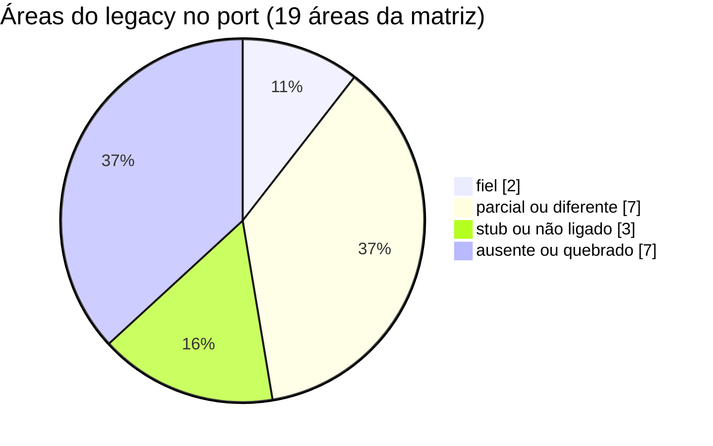
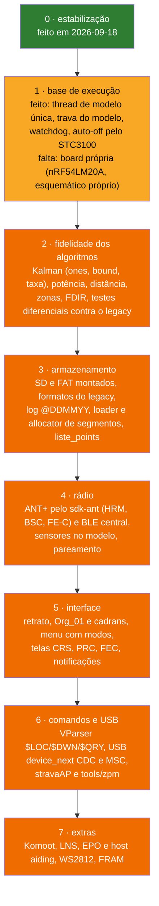

# Status do port

Onde o port Zephyr (`zephyr_app/`) está em relação ao firmware original (`legacy/`), o que foi corrigido na revisão de 2026-09-18, os defeitos que continuam abertos e a ordem proposta para o que falta. Substitui o gap analysis de novembro de 2025 (`historico/2025-11/`), que listava como ausentes módulos portados logo depois e trazia constantes erradas.

**Nesta página:** [Resumo](#resumo) · [Matriz por área](#matriz-por-área) · [Correções de 2026-09-18](#correções-de-2026-09-18) · [Defeitos abertos](#defeitos-abertos) · [Roteiro](#roteiro) · [Decisões do dono](#decisões-do-dono)

## Resumo

- **Compila** no NCS v3.3.0 (FLASH 296.208 B, RAM 116.928 B, 7 avisos conhecidos) e **passa em 7 conjuntos de testes de host** (50 casos). **Nada foi testado na placa** nem no nRF52840-DK.
- A maior parte dos módulos do legacy **existe** no port, mas muitos **não estão ligados** ao fluxo principal (menu, FEC, notificações, zonas RR, fontes de posição, allocator de segmentos, parcours, EPO, USB) e alguns **não funcionariam** mesmo ligados (BLE central, segmentos, formatos de arquivo).
- A interface do port é **nova**, em paisagem; o aparelho é retrato.
- ANT+ **não existe** no port; os sensores foram trocados por clientes BLE que ainda não funcionam de ponta a ponta.

## Matriz por área

Estados: **fiel** (mesmo comportamento), **diferente** (existe com regras ou constantes diferentes), **parcial**, **não ligado** (código existe, ninguém chama), **stub**, **ausente**, **quebrado** (ligado, mas falha).

| Área | Legacy | Port | Estado | Detalhe |
|---|---|---|---|---|
| Execução | task manager cooperativo, eventos, tick de 5 ms | 2 threads preemptivas por polling (`main_loop` 100 ms, `display` 250 ms); a `main_loop` é a única escritora do modelo e a `display` lê sob `model_lock()` | diferente | GPS saiu da ISR e a thread `sensor` duplicada saiu em 2026-09-18 ([05](05-arquitetura-zephyr.md#threads)) |
| Watchdog | 4 s, alimentado por boucle e LCD | `task_wdt`: um canal de 4 s para a `main_loop` e outro para a `display`, sobre o WDT do nRF | diferente | mais estrito que o legacy (cada thread responde pelo seu canal); não testado na placa ([05](05-arquitetura-zephyr.md#watchdog)) |
| Energia | latch pelo IO0 do STC3100, auto-off 15 min | `power_scheduler`: auto-off depois de 15 min sem posição em CRS/PRC, item "Power Off" no menu, `stc3100_shutdown()` | parcial | sem ping do rolo (não há modo FEC) e menu ainda não aberto pelos botões; não testado na placa ([02](02-hardware.md#alimentação)) |
| Modos | CRS, PRC, FEC, Zwift, MSC com `init`/`invalidate` | `boucle_set_mode()` só guarda o valor; start/pause/stop | stub | não há BoucleFEC nem MSC |
| GPS e NMEA | TinyGPS++ com checksum, PMTK010→PMTK251, WDT de baud | parser próprio, 9600 fixo | parcial | checksum, época e precisão corrigidos nesta revisão; sem handshake nem troca de baud |
| Altitude (Kalman 3 estados) | `Attitude::computeFusion` | `kalman_altitude.c` + `udmatrix.c` | diferente | P0 diagonal, `bound` com sinal zera covariâncias (α0 nunca estimado), roda até 10 Hz ([06](06-algoritmos.md)) |
| Drift barômetro/GPS | τ = 800/801 por fix | igual em `attitude.c` | fiel | agora uma vez por época; `baro_drift.c` duplicado e morto |
| Potência estimada | `1.025·(9.81·W·vz + 0.004·9.81·W·v + 0.204·v³)` | fórmula própria | diferente | 88 W contra 147 W a 30 km/h no plano |
| Zonas de potência e suffer score | PowerZone, SufferScore | `power_zone.c`, `suffer_score.c` | fiel (módulo) | testados; mas recebem potência estimada e BPM zero |
| Zonas RR | RRZone | `rr_zone.c` | não ligado | módulo fiel, sem chamador |
| Segmentos Strava | carga por distância, ativação, desempenho, até 2 na tela | `segment.c`, `liste_points.c`, `vecteur.c` | quebrado | fórmulas fiéis; listas invertidas, 20 pontos, allocator sem chamador, formato binário sem gerador ([09](09-armazenamento-usb.md)) |
| Parcours (GPX) | `.PAR` texto, seleção no menu | `parcours.c` com `.CRS` | não ligado | `parcours_load` sem chamador; loader quebra com CRLF |
| Log no SD | `@DDMMYY.txt`, 19 campos | CSV de 13 campos | parcial | FS em stub; estouro corrigido nesta revisão |
| Configurações | FRAM 0x50, versão 0x0002 | NVS (`user_settings.c`) | diferente | sem enforce no boot, setters mortos |
| Recuperação de falha (FDIR) | `.noinit` + CRC-8, restauração por data | `crash_recovery.c` | quebrado | CRC cobre o próprio campo; `has_data` nunca verdadeiro |
| BLE | só central (NUS→stravaAP, LNS, CPS, Komoot) | periférico + central (HRS, CSC, FTMS) | quebrado | scan nunca iniciado; `bt_gatt_subscribe` com `ccc_handle=0` faria `memset(NULL)` ([07](07-radio-ant-ble.md)) |
| ANT+ | HRM, BSC, FE-C, busca em background | stubs em `ant.h` | ausente | há o add-on ANT para NCS (licenciado) |
| Interface | retrato, `Org_01`, cadrans, menu, notificações | paisagem, 5×7, 9 páginas | diferente | menu, FEC e notificações não ligados ([08](08-interface.md)) |
| Comandos (`$LOC`, `$DWN`, `$QRY`) e USB | VParser via USB CDC e NUS; MSC | nada; USB fora do build | ausente | stack USB antigo depreciado no Zephyr 4.3 |

## Correções de 2026-09-18

Todas compiladas no NCS v3.3.0; as marcadas com teste têm teste de host que falha quando a correção é revertida (mutação conferida).

| # | Defeito | Correção | Verificação |
|---|---|---|---|
| 1 | Pilha da `main_loop` estourava: `measurement_update()` tem quadro de 1.672 B e a cadeia do Kalman soma ~2.200 B, acima dos 2.048 B | `MAIN_STACK_SIZE` 4096 e `DISPLAY_STACK_SIZE` 2048 (`src/main.c`) | `CONFIG_STACK_USAGE`: cadeias medidas em [05](05-arquitetura-zephyr.md#pilhas) |
| 2 | Todo o GPS e o modelo rodavam na ISR da UARTE1, por sentença, com `k_mutex_lock(K_FOREVER)` e escrita em arquivo no caminho | a ISR só enfileira bytes num `ring_buf`; `hal_uart_process()` monta as linhas na `main_loop` (`src/hal/hal_uart.c`, `gps_mgmt_process()`) | build; `test_gps_mgmt` |
| 3 | Callback de fix disparava 5 a 7 vezes por segundo com o mesmo ponto | um callback por época, no RMC válido; RMC `V` encerra o fix na hora (`src/drivers/gps/gps_mgmt.c`) | `test_gps_mgmt` (mutação: 5 callbacks por época) |
| 4 | Sentenças NMEA sem validação de checksum no caminho usado | `nmea_verify_checksum()` antes do parse | `test_gps_mgmt` |
| 5 | Caminho caractere a caractere do parser nunca reconhecia sentença (sem `$`), milissegundos errados (`.200` virava 2000 ms), coordenada convertida em `float` antes da divisão, `position_valid` nunca voltava a falso | `identify_sentence()` aceita com e sem `$`; fração de segundo; conversão em `double`; posição decidida por GGA/RMC (`src/drivers/gps/nmea_parser.c`) | `test_nmea_parser` (12 casos) |
| 6 | `sd_logger_add_entry()` escrevia além de `buffer[5]` quando o flush falhava (sempre, com o FS em stub): corrupção da `.bss` depois de ~90 m de atividade | tenta o flush de novo e descarta as entradas se o cartão continua indisponível (`src/model/sd_logger.c`) | `test_sd_logger` com canário (mutação conferida) |
| 7 | Botões invertidos duas vezes: em repouso pareciam pressionados e 1 s depois saía `LONG_CENTER`, que para e grava a atividade | leitura direta do nível lógico de `gpio_pin_get_dt()` (`src/hal/hal_gpio.c`) | build; revisão da semântica `GPIO_ACTIVE_LOW` |
| 8 | Reset e standby do GPS com polaridade invertida: o M10578 ficaria preso em reset e em standby | `GPIO_ACTIVE_LOW` em `gps_reset` e `gps_stdby` (overlay) | DTS gerado; `test_gps_mgmt` confere os níveis lógicos |
| 9 | Reset do FXOS8700 flutuando no boot (sem resistor na placa) e com semântica invertida | `reset-gpios` ativo alto no nó `fxos`; `imu_reset` ativo alto e inativo no HAL | DTS gerado |
| 10 | Nós do DK nos pinos da placa: QSPI (CSN = CS do LCD), `spi3` (NeoPixel, FIX, STDBY), `pwm0` (botão central), RTS/CTS do `uart0` (UART do GPS) | desligados no overlay; `uart0` só com TX/RX; `uart1` sem o pull-up herdado no TX | `.config` sem `NORDIC_QSPI_NOR`/`NRFX_QSPI`; FLASH −4,3 KB no build final |
| 11 | Erro fatal travava o aparelho | `CONFIG_RESET_ON_FATAL_ERROR=y` (loga e reinicia) | `.config` |
| 12 | O NCS v3.3.0 (Zephyr 4.3.99) trocou `CONFIG_SOC_SERIES_NRF52X` por `CONFIG_SOC_SERIES_NRF52`: a causa do reset era sempre "desconhecida" | `CONFIG_SOC_SERIES_NRF52` (`src/model/crash_recovery.c`) | build |
| 13 | Aparência BLE 1157 (sensor de velocidade e cadência) | 1153, Cycling Computer | `.config` |

Também nesta revisão: build com sysbuild e sem Partition Manager (`zephyr_app/sysbuild.conf`), scripts novos (`tools/fw/`), testes de host (`zephyr_app/tests/host/`) e validação da documentação (`tools/docs/`).

## Defeitos abertos

Ordenados por gravidade. Linhas conferidas em 2026-09-18.

| Gravidade | Onde | Defeito |
|---|---|---|
| crítico | `src/rf/ble_hrs_client.c:160`, `ble_bsc_client.c:268`, `ble_fec_client.c:270` | `bt_gatt_subscribe` com `ccc_handle=0` e `CONFIG_BT_GATT_AUTO_DISCOVER_CCC=y` sem `disc_params`: `memset(NULL)` no Zephyr 4.3 assim que o scan for ligado |
| crítico | `src/rf/ble/ble_manager.c:218` | `bt_conn_le_create` sem `bt_conn_unref`: o pool de 4 conexões esgota |
| crítico | `src/model/liste_points.c:47-48, 124-126` | índice 0 é o ponto mais antigo (o legacy usa o mais recente), capacidade de 20 pontos e segmentos invertidos |
| crítico | `src/model/segment.c:852-879` | `dist_to_seg_header` retorna 9999; allocator sem chamador: nenhum segmento carrega |
| crítico | `src/drivers/lcd/ls027.c:179-189` | transformações de retrato erradas; a interface é paisagem num aparelho retrato |
| alto | `src/model/udmatrix.c:64-67, 264-281` | `udmat_ones` gera identidade; `bound` com sinal zera covariâncias negativas: α0 nunca é estimado |
| alto | `src/model/crash_recovery.c:104-118` | CRC inclui o próprio campo `crc`; a restauração falha em 255 de 256 casos |
| alto | `src/rf/ble_fec_client.c:46-48, 166-168` | flags do FTMS erradas (cadência, tempo, energia): a potência sai do offset errado |
| alto | `src/rf/ble_bsc_client.c:136-137` | velocidade CSC 3600 vezes menor |
| alto | `src/drivers/gps/gps_epo.c:150-151, 347` | EPO envia `PMTK253,1` (modo binário) e supõe um cabeçalho de 4 bytes que não existe |
| alto | `src/model/parcours.c:216-218, 375-377` | loader para no CRLF; `OFF_ROUTE` não tem saída |
| médio | `src/vue/vue.c:1421-1456` | item selecionado do menu em preto sobre preto |
| médio | `src/vue/vue_fec.c:481-486` | `suffer_score_t` local não inicializado comparado com `APP_OK` (código hoje não ligado) |
| médio | `src/model/boucle.c:137-144` | zonas só recebem amostra com potência ou BPM > 0: a pausa vai para a zona seguinte |
| médio | `src/drivers/sensors/stc3100.c`, `src/main.c` | shunt de 100 mΩ no código; o esquema da V3 mostra R15 = 20 mΩ (confirmar na placa) |
| baixo | `src/hal/hal_gpio.c:27` | `btn_state_t::current_state` sem uso; `BTN_DEBOUNCE_MS` sem uso |

## Roteiro

Proposta de ordem; cada fase fecha com build, testes de host e, a partir da fase 1, teste na placa.

Tamanhos estimados pelos relatórios de análise: fase 1 M, fase 2 M, fase 3 G, fase 4 G (com ANT+) ou M (só BLE), fase 5 G, fase 6 M a G, fase 7 M a G.

### Andamento da fase 1

| Item | Estado | Onde |
|---|---|---|
| Thread de modelo única | feito em 2026-09-18: a thread `sensor` duplicada saiu e a `main_loop` é a única escritora do modelo | `src/main.c` |
| Trava do modelo | feito em 2026-09-18: `model_lock()` entre a `main_loop` e a composição do quadro na `display` | `src/model/model_lock.c`, `src/vue/vue.c` |
| Mensagens dos clientes BLE para a `main_loop` | fica para a fase 4, quando os callbacks de dados forem registrados | — |
| Watchdog | feito em 2026-09-18: `task_wdt` com canais de 4 s da `main_loop` e da `display` sobre o WDT do nRF; não testado na placa | `src/main.c`, `prj.conf` |
| Latch e auto-off pelo STC3100 | feito em 2026-09-18: 15 min sem posição em CRS/PRC desligam pelo STC3100; item "Power Off" no menu; o ping do rolo fica para quando houver modo FEC; não testado na placa | `src/model/power_scheduler.c`, `src/drivers/sensors/stc3100.c`, `test_power_scheduler` |
| Board própria | MCU escolhido em 2026-09-18 (nRF54LM20A) e esquemático próprio em projeto; o firmware ainda só compila para o nRF52840 | — |

## Decisões do dono

Tomadas em 2026-09-18:

| Decisão | Escolha | Consequência |
|---|---|---|
| Rádio | **ANT+ e BLE juntos**: os sensores e equipamentos externos falam ANT+ | ANT+ pelo add-on **ANT for nRF Connect SDK** (`sdk-ant`); a versão atual, v2.1.1, é acoplada ao **sdk-nrf v3.2.4**, não ao v3.3.0 instalado; exige aceitar o ANT+ Adopter Agreement e usar a chave de avaliação (`CONFIG_ANT_EVALUATION_KEY`) até haver licença comercial (ver [07](07-radio-ant-ble.md#decisão-ant-e-ble)) |
| Placa | **board própria com o nRF54LM20A**, no lugar do DK com overlay, e **esquemático próprio**: GNSS, bateria e display melhores, painel solar pequeno na caixa e o que mais fizer sentido | a V3 existe só como esquema, não há placa física; o nRF54LM20 DK vem com o nRF54LM20B (a mesma peça com NPU) e o NCS v3.3.0 e o `sdk-ant` v2.1.x suportam os dois (ver [02](02-hardware.md#próxima-placa)) |
| Tela | **retangular, no formato do legacy**: 2,7", 400 × 240, em retrato | a interface do port, hoje em paisagem, passa para retrato (fase 5); o display novo mantém o tamanho |
| CI | **desligado**: `.github/workflows/ci.yml` só roda à mão | não gasta minutos do GitHub Actions; ligar só com pedido do dono |
| Commits | um commit por item pronto e verificado, na `develop`; Conventional Commits em inglês, nunca atribuídos a IA | regra permanente deste projeto (skill `commit-gnss`); a `main` só recebe merge da `develop` quando o dono pedir |

Ainda em aberto:

| Decisão | Opções | Consequência |
|---|---|---|
| Componentes da placa nova | display colorido de 2,7" (e-paper colorido ou LCD de memória colorido), GNSS, energia com painel solar, sensores | proposta com pesquisa de mercado em preparo |
| Hardware de teste | nRF54LM20 DK para desenvolver até a placa própria existir | sem placa, nada roda de verdade: hoje só há build e testes de host |
| Workspace do ANT+ | instalar o `sdk-ant` (com o sdk-nrf v3.2.4 e o toolchain dele) depois que o dono aceitar os acordos ([07](07-radio-ant-ble.md#decisão-ant-e-ble)) | o port compila hoje no v3.3.0; voltar ao v3.2.4 precisa ser verificado |
| Formatos no SD | compatíveis com o legacy (segmentos em texto com nome base36, `.PAR`, `@DDMMYY.txt`) ou formatos novos com conversor | há 138 segmentos e 2 percursos de exemplo em `tools/TDD/DB` no formato do legacy |
| Licença do projeto | o legacy é CC BY-NC 4.0; o port deriva dele | afeta uso comercial e a escolha da licença do repositório |
