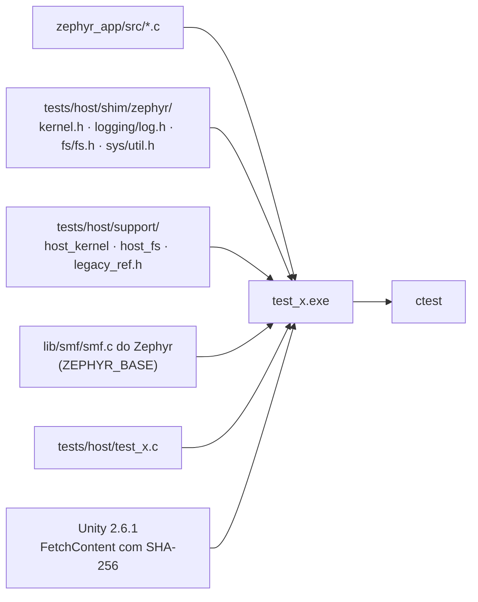

# Ferramentas e testes

As ferramentas herdadas do stravaV10 em `tools/` (simulador de host, scripts Node, debug em monitor mode, emulador), as ferramentas novas do projeto (`tools/fw/`, `tools/docs/`, `tools/ui/`), os testes de host do port, o renderizador das telas e as bibliotecas de terceiros com suas licenças.

**Nesta página:** [Mapa de tools/](#mapa-de-tools) · [Testes de host do port](#testes-de-host-do-port) · [Renderizador de telas](#renderizador-de-telas) · [Simulador TDD do legacy](#simulador-tdd-do-legacy) · [Outras ferramentas herdadas](#outras-ferramentas-herdadas) · [Bibliotecas e licenças](#bibliotecas-e-licenças)

## Mapa de tools/

| Pasta | Origem | Uso |
|---|---|---|
| `tools/fw/` | projeto | `ncs_env.sh`/`.bat` (ambiente do NCS), `fw.sh` (build, flash, recover, devices, size), `host_tests.sh` |
| `tools/docs/` | projeto | `mermaid_check.py` e `links_check.py` (skill `docs-gnss`); `case_drawing.py` gera o desenho do aparelho da [placa nova](13-placa-nova.md#como-fica-o-aparelho) e `screens_drawing.py`, as maquetes das [telas](18-interface-telas.md#telas) |
| `tools/ui/` | projeto | `font_gen.py` (fontes de 1 bit da interface) e `render_screens.py` (compila e roda o [renderizador de telas](#renderizador-de-telas) e gera `docs/img/telas-lvgl/`) |
| `tools/TDD/`, `tools/TDDW/` | stravaV10 | simulador de host do firmware original (Linux e Windows) |
| `tools/zpm/` | stravaV10 | scripts Node: posição do Zwift (`$LOC`), download de logs, conversão para GPX |
| `tools/MMD/` | stravaV10 | monitor mode debugging do J-Link |
| `tools/jumper/` | stravaV10 | descrição de placa para o Jumper Virtual Lab |

## Testes de host do port

Os módulos de lógica do `zephyr_app/src` compilam com o GCC do PC contra shims mínimos do Zephyr e rodam com Unity e CTest.

```sh
bash tools/fw/host_tests.sh             # tudo
bash tools/fw/host_tests.sh -R tilt     # um conjunto
```

| Conjunto | Código testado | Casos | O que garante |
|---|---|---|---|
| `test_vecteur` | `model/vecteur.c` | 9 | distância dentro de 0,5 % da fórmula do legacy, sinais dos eixos, produto escalar, normalização |
| `test_power_zone` | `model/power_zone.c` | 6 | limites das 7 zonas pelo FTP, janela de 50 a 1950 W, acumulação |
| `test_suffer_score` | `model/suffer_score.c` | 5 | zonas de FC e pontos por hora do legacy |
| `test_sd_logger` | `model/sd_logger.c` | 4 | intervalo de 15 m, lote de 5 com cabeçalho CSV, **nenhuma escrita fora do buffer sem cartão** |
| `test_ui_fmt` | `ui/ui_fmt.c` | 10 | números como o `_fmkstr` do legacy numa varredura, truncamento em `float` (0,21 vira `0.20`), negativos, limite de 100000, NaN, buffer pequeno, horas e hora desconhecida, larguras do `cadran` e do `cadranH`, valores com sinal |
| `test_tilt` | `svc/sensors/tilt.c` | 8 | inclinação, rolagem e rumo contra leituras construídas por rotação (aerospacial, norte-leste-baixo), janela de 50 amostras, rugosidade contra o laço de `fxos.cpp:761-766` |
| `test_power_scheduler` | `model/power_scheduler.c` | 7 | 15 min exatos mantêm ligado, pings de posição e do rolo, ping desconhecido não conta, nova tentativa 15 min depois, volta do contador de 32 bits |
| `test_sys_fsm` | `svc/power/sys_fsm.c` + `lib/smf/smf.c` do Zephyr | 16 | Partida e Ligado, desligamento que espera cada serviço por até 5 s, System OFF com USB, auto-off por modo (CRS, PRC e DBG pela posição, FEC pelo rolo), bateria no fim, MSC, desligamento no boot, comandos durante o desligamento, energia cortada uma vez só |



- **Shims**: log vira nada, `k_mutex` nunca bloqueia, relógio controlável (`host_uptime_set/advance`), `k_msleep` avança o relógio.
- **Falsos**: `host_fs` (sistema de arquivos em memória que pode "sumir").
- **Zephyr de verdade**: `test_sys_fsm` compila o `lib/smf/smf.c` do NCS (`ZEPHYR_BASE`, padrão `C:/ncs/v3.3.0/zephyr`), com os headers do Zephyr procurados depois dos shims (`-idirafter`) e o shim `sys/util.h` com os macros `IF_ENABLED` e `COND_CODE_1`; sem o NCS, o conjunto é pulado com um aviso.
- **Oráculo**: `support/legacy_ref.h` transcreve fórmulas do legacy com a origem.
- **Mutação**: as correções de 2026-09-18 do log foram revertidas e o teste falhou, como devia. Em 2026-09-19, com um executor que chama o `cmake` e o `ctest` direto: 6 de 6 mutações do `ui_fmt.c`, 6 de 6 da máquina de sistema, 3 de 3 do `tilt.c` e a do `power_scheduler` mortas, com os conjuntos verdes antes e depois.
- **Cuidado ao automatizar**: no Windows, um `bash` chamado de Python ou do `cmd` é o `bash.exe` do `System32`, o lançador do WSL, que este projeto não usa. Chame o `cmake` e o `ctest` direto, ou o Git Bash pelo caminho completo, e confira o código de saída e se o filtro achou o conjunto.
- Compilador: MinGW-w64 GCC 15.2 no Windows; o mesmo CMake funciona com o GCC do Linux.
- Os testes de ztest do Zephyr (`native_sim`, `unit_testing`) só rodam em Linux e não são usados.

## Renderizador de telas

A interface da placa nova ([18](18-interface-telas.md)) compila no PC com o LVGL do NCS e o GCC do PC, e o `ui_render` desenha cada tela nos dois temas, como o painel mostra.

```sh
python tools/ui/render_screens.py              # compila, desenha, confere e gera docs/img/telas-lvgl
python tools/ui/render_screens.py --no-build   # pula o CMake e usa o ui_render já compilado
```

| Peça | Papel |
|---|---|
| `zephyr_app/tests/ui/CMakeLists.txt` | o LVGL do NCS (`C:/ncs/v3.3.0/modules/lib/gui/lvgl`, ou a variável `NCS_LVGL`) com o `lv_conf.h` da pasta, e a interface de `src/ui` com `-Werror` |
| `zephyr_app/tests/ui/ui_samples.c` | dados de exemplo: pedal com 0, 1 e 2 segmentos, GNSS procurando, rolo, sensores e percursos |
| `zephyr_app/tests/ui/ui_render.c` | monta cada tela, desenha num quadro RGB565 de 240 × 400, quantiza como o painel e grava PPM; confere cores, textos e navegação; mede o heap do LVGL |
| `tools/ui/render_screens.py` | CMake, `ui_render`, PPM para PNG e as folhas por grupo e tema |
| `tools/ui/font_gen.py` | as fontes de 1 bit de `zephyr_app/src/ui/fonts` (DejaVu Sans, sem suavização) |

- O `ui_render` sai com erro quando aparece cor no tema preto e branco, quando um texto sai da caixa, quando a navegação não chega à tela esperada ou quando uma ação não sai.
- Resultado em 2026-09-19: 29 telas em 2 temas, 58 quadros, 0 problemas; 23,7 KB de heap do LVGL no pico, com ponteiros de 64 bits.
- O aviso do LVGL sobre as conferências de objeto e de estilo (`LV_USE_ASSERT_OBJ`, `LV_USE_ASSERT_STYLE`) é esperado: estão ligadas de propósito, para pegar uso errado da API.
- O clangd usa a base de compilação de `build/ui` pelos `.clangd` de `zephyr_app/tests/ui` e `zephyr_app/src/ui`, depois da primeira execução.
- O teste confere o desenho, não o painel: tempo de SPI, COM, luz e leitura ao sol ficam para a bancada.

## Simulador TDD do legacy

`tools/TDD` compila o firmware original inteiro (C/C++ com `-DTDD`) como executável de PC e simula o aparelho:

- **Entradas:** GPS gerado a partir de `GPX_simu.csv` (sem fix nos primeiros 10 s, depois RMC/GGA/VTG, depois posição por LNS), barômetro e acelerômetro sintéticos com ruído, HRM e FE-C falsos, cartão SD mapeado para a pasta `tools/TDD/DB/`, botões por um roteiro de tempo ou pelo teclado.
- **Tela:** framebuffer enviado por TCP (porta 8080, 12.004 bytes por quadro) para o `LS027simulator.jar` (Java), que mostra o LCD e salva capturas. As imagens de `docs/img/` vieram dele.
- **Testes do legacy** (`unit_testing.cpp`, rodam no início de cada execução):

| Teste | Critério | Equivalente no port |
|---|---|---|
| `test_power_zone` | FTP 256: máximo 1831 ± 2 s | `test_power_zone` (regras, não o mesmo cenário) |
| `test_score` | suffer score ≈ 66,46 ± 4 | `test_suffer_score` (regras) |
| `test_liste` | avanço num segmento de 14 ± 0,1 s | a portar junto com a correção do `liste_points` |
| `test_rollover` | tempo do FE-C com virada de 8 bits | a portar com o FTMS |
| `test_projection`, `test_fusion`, `test_fram`, `test_lsq` | projeção, fusão (só loga), configurações, regressão linear | parcialmente cobertos |

- **Não compila neste repositório:** a `CMakeLists.txt` de host do upstream não veio, `legacy/` e `libraries/` foram separados, e os submódulos `ant_profiles` e `ble_services` estão vazios. O `tools/TDDW` (MinGW) tem shims para Windows, mas herda os mesmos problemas.
- Útil como referência para um simulador do port: replay de GPX em NMEA (corrigindo a data fixa e o hemisfério do gerador) e a fonte de posição simulada.

## Outras ferramentas herdadas

| Ferramenta | Situação |
|---|---|
| `tools/zpm` | `LNS.js` (Zwift → `$LOC`, obsoleto desde a criptografia do Zwift em 2022), `LNS_test.js`, `getGPX.js` (`$QRY`), `gpx_convert.js` (CSV → GPX); `serialport` 8 e `cap` precisam de rebuild para o Node 22; incompatíveis com o port enquanto não houver comandos |
| `tools/MMD` | monitor mode do J-Link para depurar sem derrubar o BLE; no Zephyr o equivalente é `CONFIG_CORTEX_M_DEBUG_MONITOR_HOOK` + `CONFIG_SEGGER_DEBUGMON` |
| `tools/jumper` | pinos da placa v1 para o Jumper Virtual Lab; ferramenta não instalada |

## Bibliotecas e licenças

Nenhuma pasta de `libraries/` é compilada pelo port; ele reimplementa o que precisa.

| Pasta | Origem | Licença | No port |
|---|---|---|---|
| `AdafruitGFX` | Adafruit GFX + Print (Arduino) + fontes | BSD; `Print.cpp` LGPL-2.1; fonte `Tiny3x3a` **CC BY-NC-SA 3.0** (sem uso) | substituída pelo LVGL do NCS (a interface em paisagem que a reimplementava saiu em 2026-09-19) |
| `TinyGPSPlus` | TinyGPS++ (Mikal Hart) | LGPL-2.1+ | substituída pela API de GNSS do Zephyr (o parser próprio do port saiu em 2026-09-19) |
| `rtt`, `sysview` | SEGGER | estilo BSD da SEGGER | sem uso |
| `task_manager`, `SST/app_sdcard.c` | nRF5 SDK | Nordic 5 cláusulas | substituídas pelo Zephyr |
| `utils/WString` | Arduino | LGPL-2.1 | sem uso |
| `kalman`, `filters`, `AltiBaro`, `GlobalTop`, `hardfault`, `jscope`, `komoot`, `utils`, `VParser`, `SST` (resto) | autor do stravaV10 | a do repositório original: CC BY-NC 4.0 | reimplementadas em parte (`kalman_altitude`, `udmatrix`, `gps_epo`, `crash_recovery`) |
| `ant_profiles`, `ble_services` | submódulos do autor | — | **vazias** nesta cópia |
| `tools/TDD/timer` | Teunis van Beelen | **GPL-2.0** | sem uso |
| `tools/TDD/sd/fatfs` | FatFs R0.12b (ChaN) | licença do FatFs | sem uso |

O código do stravaV10 é CC BY-NC 4.0 (atribuição e uso não comercial) e o port deriva dele: a licença do projeto é uma [decisão pendente do dono](10-status-do-port.md#decisões-do-dono).
