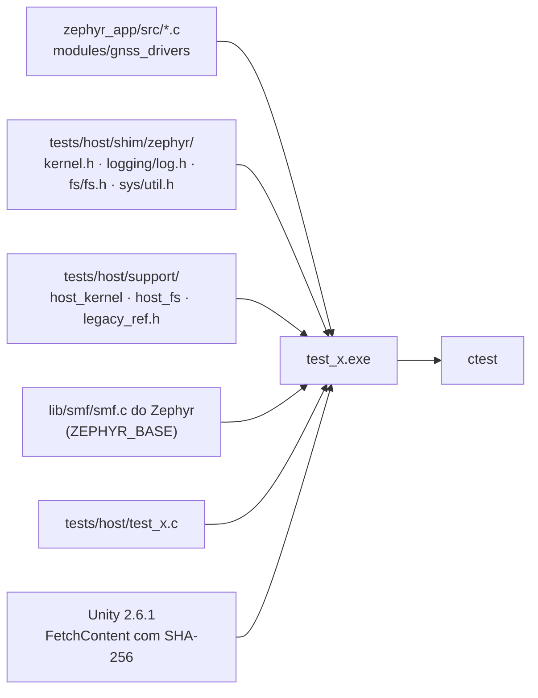

# Ferramentas e testes

As ferramentas herdadas do stravaV10 em `tools/` (simulador de host, scripts Node, debug em monitor mode, emulador), as ferramentas novas do projeto (`tools/fw/`, `tools/docs/`, `tools/ui/`), os testes de host do port, o renderizador das telas e as bibliotecas de terceiros com suas licenças.

**Nesta página:** [Mapa de tools/](#mapa-de-tools) · [Testes de host do port](#testes-de-host-do-port) · [Renderizador de telas](#renderizador-de-telas) · [Simulador TDD do legacy](#simulador-tdd-do-legacy) · [Outras ferramentas herdadas](#outras-ferramentas-herdadas) · [Bibliotecas e licenças](#bibliotecas-e-licenças)

## Mapa de tools/

| Pasta | Origem | Uso |
|---|---|---|
| `tools/fw/` | projeto | `ncs_env.sh`/`.bat` (ambiente do NCS), `fw.sh` (build, flash, recover, devices, size), `host_tests.sh`, `board_check.py` (confere o mapa de pinos de uma placa do projeto: pino em dois lugares, SCL de TWIM ou SCK de SPIM fora dos pinos de clock da tabela 79, pads do NFC e do cristal, limite de cada porta, dois periféricos no mesmo bloco serial e apelido faltando) |
| `tools/docs/` | projeto | `mermaid_check.py` e `links_check.py` (skill `docs-gnss`); `case_drawing.py` gera o desenho do aparelho da [placa nova](13-placa-nova.md#como-fica-o-aparelho) e `screens_drawing.py`, as maquetes das [telas](18-interface-telas.md#telas) |
| `tools/ui/` | projeto | `font_gen.py` (fontes de 1 bit da interface) e `render_screens.py` (compila e roda o [renderizador de telas](#renderizador-de-telas) e gera `docs/img/telas-lvgl/`) |
| `tools/TDD/`, `tools/TDDW/` | stravaV10 | simulador de host do firmware original (Linux e Windows) |
| `tools/zpm/` | stravaV10 | scripts Node: posição do Zwift (`$LOC`), download de logs, conversão para GPX |
| `tools/MMD/` | stravaV10 | monitor mode debugging do J-Link |
| `tools/jumper/` | stravaV10 | descrição de placa para o Jumper Virtual Lab |

## Testes de host do port

Os módulos de lógica do `zephyr_app/src` compilam com o GCC do PC contra shims mínimos do Zephyr e rodam com Unity e CTest.

```sh
bash tools/fw/host_tests.sh             # tudo
bash tools/fw/host_tests.sh -R tilt     # um conjunto
```

São **53 conjuntos e 714 casos**, todos verdes em 2026-09-22 (`ctest`: 53/53).

| Conjunto | Código testado | Casos | O que garante |
|---|---|---|---|
| `test_segment_file` | `model/segment_file.c` | 6 | nome de segmento do legacy (12 caracteres, `#` e `.` nas posições certas), posição em base 36 no nome, leitura da linha `lat ; lon ; rtime ; alt`, ida e volta nome↔posição e a conferência dos **138 segmentos reais** de `tools/TDD/DB`: o nome tem de bater com o primeiro ponto de dentro |
| `test_segment` | `model/segment.c`, com `liste_points.c`, `vecteur.c` e `segment_file.c` | 14 | o cartão sem segmento não carrega nada, a varredura pega os nomes do legacy sem abrir os arquivos, o segmento longe fica fechado e o a menos de 300 m entra, o mais comprido que a fatia é partido ao meio, o quarto espera vaga, afastar-se descarrega, entrar ativa e chegar ao fim conclui, a posição ruim é recusada e a lista dos próximos sai em ordem de distância |
| `test_liste_points` | `model/liste_points.c` | 15 | ordem das listas (segmento em ordem de arquivo, histórico com o mais novo no índice 0), corte do histórico, distância à lista, caixa e centro em graus, e a posição relativa com cinco pontos, projetada e fora do triângulo |
| `test_vecteur` | `model/vecteur.c` | 25 | distância dentro de 0,5 % da fórmula do legacy, sinais dos eixos, produto escalar, normalização |
| `test_crash_recovery` | `model/crash_recovery.c` | 8 | a partida limpa não restaura nada, o bloco volta inteiro (com o recorde), não depende de falha registrada, um byte trocado quebra o CRC, o bloco limpo não é aceito e a segunda gravação vale |
| `test_kalman_altitude` | `model/kalman_altitude.c`, `udmatrix.c` | 6 | a elevação acompanha a subida pelo pitch, a rampa e a velocidade vertical saem do filtro, o offset de montagem é estimado, parado não atualiza e a descida dá velocidade vertical negativa |
| `test_udmatrix` | `model/udmatrix.c` | 8 | `ones` preenche tudo (P0 = 900), `bound` compara valor absoluto e mantém covariância negativa, e soma e subtração com o destino igual a uma das entradas |
| `test_distance` | `model/distance.c` | 9 | descarte dos primeiros 25 m, instantâneo a cada 15 m (e um só quando a época traz 100 m), parado não soma, total igual ao do legacy em 300 m e a volta do total pela recuperação de falha |
| `test_attitude` | `model/attitude.c`, com `distance.c`, `power_estimate.c`, `kalman_altitude.c`, `udmatrix.c` e `crash_recovery.c` | 18 | a época pedalada que conta um segundo ativo e o limiar de 7 do legacy, as épocas pouco abaixo de um segundo que ainda contam, a bicicleta parada e o receptor calado que não somam nada, a coordenada zerada e a fora do planeta recusadas, o primeiro salto descartado, a distância que conta qualquer que seja a velocidade, a potência pela velocidade com que a época chegou, a rugosidade como desvio médio absoluto, a referência que espera 15 pontos, o pedal retomado depois de uma queda que mantém os segundos e o de outro dia recusado |
| `test_power_estimate` | `model/power_estimate.c` | 7 | a fórmula do legacy em 64 pontos de velocidade e rampa contra a transcrição em `legacy_ref.h`, os 147 W a 30 km/h no plano, os 151 W a 12 km/h em 5 %, potência negativa na descida e a saturação do `int16_t` |
| `test_power_zone` | `model/power_zone.c` | 6 | limites das 7 zonas pelo FTP, janela de 50 a 1950 W, acumulação |
| `test_power_metrics` | `model/power_metrics.c` | 19 | as métricas de Coggan: nada antes de 30 s e a NP no trigésimo segundo, uma hora no limiar dando TSS 100, meia hora dando metade, o pedal irregular custando mais do que a média diz, a oscilação mais rápida que a janela que não conta, a janela de exatamente 30 s, o pico impossível valendo um segundo de zero, sem FTP não há IF nem TSS, e trocar o FTP muda o que o pedal valeu |
| `test_suffer_score` | `model/suffer_score.c` | 5 | zonas de FC e pontos por hora do legacy |
| `test_rr_zone` | `model/rr_zone.c` | 14 | os intervalos RR por zona: a amostra sem relógio ignorada, a primeira só acertando o relógio, o coração estável sem variabilidade, o denominador que é o buffer e não as diferenças, cada limite do legacy, a faixa pela FC da última amostra, a zona lida como a sua média, os totais e o buffer que nunca passa do fim |
| `test_alerts` | `model/alerts.c` | 22 | os 12 alertas: quem não configurou nada nunca é interrompido, passar do limite avisa uma vez, o limite em si não é passar dele, o rearme com margem (15 W na potência, décimos de km/h na velocidade), o sensor ausente que não dispara alerta de mínimo, a cada 10 km, o intervalo contando só tempo em movimento, mais de um alerta na mesma época e o pedal novo que recomeça |
| `test_workout` | `model/workout.c` | 32 | os arquivos `.WKT`: a sessão mais simples, linhas em branco e comentários, cada tipo de duração e de alvo, a repetição achatada em ordem, a aninhada recusada, a nunca fechada, a sessão grande demais recusada inteira, os passos em sequência, o fim uma vez só, o passo que acaba por distância e o que espera o ciclista, o rolo recebendo o meio da faixa e onde o ciclista está em relação ao alvo |
| `test_sd_logger` | `model/sd_logger.c` | 7 | intervalo de 15 m, lote de 5 com cabeçalho CSV, **nenhuma escrita fora do buffer sem cartão** |
| `test_ui_fmt` | `ui/ui_fmt.c` | 10 | números como o `_fmkstr` do legacy numa varredura, truncamento em `float` (0,21 vira `0.20`), negativos, limite de 100000, NaN, buffer pequeno, horas e hora desconhecida, larguras do `cadran` e do `cadranH`, valores com sinal |
| `test_tilt` | `svc/sensors/tilt.c` | 8 | inclinação, rolagem e rumo contra leituras construídas por rotação (aerospacial, norte-leste-baixo), janela de 50 amostras, rugosidade contra o laço de `fxos.cpp:761-766` |
| `test_backlight` | `svc/ui/backlight.c` | 11 | luz por 10 s depois de uma tecla, nova tecla reinicia, automática com pouca luz até a luz voltar, histerese entre 20 e 50 lux, desligada pelo menu, volta do contador de 32 bits |
| `test_max17262` | `modules/gnss_drivers`: `max17262_regs.h` | 10 | passos da tabela 2 da ficha (78,125 µV, 156,25 µA com sinal, 1/256 %, 0,5 mAh, 5,625 s, 1/256 °C), tempo desconhecido, arredondamento da carga, `DesignCap`, `IChgTerm`, `VEmpty` (o 0xA561 de fábrica) e `ModelCfg` |
| `test_aem10900` | `modules/gnss_drivers`: `aem10900_regs.h` | 7 | limiares de carga e de descarga da ficha (0x32 é 4,05 V, 0x2D é 3,04 V, passos de 56,25 mV, mínimos de 2,70 V e 2,51 V), tensão da bateria (4,8 V em 256 passos), energia do APM (`POWER << OFFSET`, além de 32 bits) e potência em µW sem calibração |
| `test_ubx_m10` | `modules/gnss_drivers`: `ubx_m10.c` | 24 | quadros UBX com o checksum de Fletcher, `UBX-CFG-VALSET` de uma chave e de um lote (`ubx_m10_valset_many()`, usado nos sinais de L5 do F10) e `VALGET` (tamanho do valor pelos bits 30 a 28 da chave, camadas RAM e BBR), `UBX-RXM-PMREQ` com backup e force, `UBX-CFG-RST` de partida fria, e a leitura do `UBX-NAV-PVT` (92 B, Nancy, bits de `valid`, psmState, rumo negativo) e do `UBX-NAV-SAT` (truncado e com elevação negativa); os vetores vêm de uma implementação independente das seções das fichas do F10 SPG 6.00 e do M10 SPG 5.30 |
| `test_activity` | `model/activity.c` | 19 | o cronômetro que conta só em movimento, o semáforo que o para depois de 3 s e o retomar acima de 3 km/h, a bicicleta empurrada a 2 km/h que não faz o cronômetro oscilar, a volta automática por distância e a volta pela tecla, a volta aberta que fecha no fim, a descida com a banda morta de 2 m contra o ruído do barômetro, as médias só do tempo em movimento e a cinta que cai sem derrubar a média |
| `test_fit_encode` | `model/fit_encode.c` | 15 | o cabeçalho de 14 bytes e o `.FIT`, as mensagens de definição e de dados, os tipos base, as escalas de altitude, distância e velocidade, os valores "inválidos" do formato, os semicírculos, a data do legacy virando `date_time`, as voltas numeradas, o CRC-16 conferido contra o cálculo direto para 33 tamanhos de arquivo, o resíduo zero do cabeçalho (que é o que deixa o arquivo fechar sem reler o que foi gravado) e um passeio inteiro lido de volta mensagem a mensagem |
| `test_climb` | `model/climb.c` | 16 | o que é e o que não é subida (a ponte curta demais, o falso plano de 1 %), os números de uma subida de verdade, o falso plano que não parte um colo em dois e o vale que parte, o percurso que acaba no topo, as categorias pelo ganho, o que falta ao ciclista em cada ponto da subida, a próxima subida anunciada no vale, a inclinação dos próximos 200 m e o percurso com mais subidas do que cabem |
| `test_parcours` | `model/parcours.c`, com `route_file.c` e `gpx_scan.c` | 10 | o percurso no formato do legacy, o fim de linha dele que não trava o carregador, o ponto sem altitude, a última linha sem fim de linha, o percurso de um ponto recusado, o arquivo que não existe, a carga que substitui a anterior, o comprimento e o desnível, o ciclista que anda pelo percurso e sai dele, e os percursos reais de `tools/TDD/DB` |
| `test_route_file` | `model/route_file.c` | 11 | a assinatura que separa o `.RTE` do texto do legacy, o cabeçalho que o menu precisa, os pontos que saem como entraram, o ponto abaixo do nível do mar e ao sul do equador, a curva com o nome da rua, a direção desconhecida virando "siga em frente", a versão errada e o arquivo cortado recusados, o CRC do zlib e o do corpo conferido contra o do cabeçalho |
| `test_gpx_scan` | `model/gpx_scan.c` | 11 | a trilha do Strava, os espaços de nomes e as extensões, os atributos em qualquer ordem, o ponto sem altitude tomado como zero, a rota de waypoints valendo como percurso, o arquivo que chega em pedaços, o último ponto que ainda vem, o que não é ponto ignorado, o arquivo que não é GPX reconhecido, o elemento maior que o buffer e mil pontos em ordem |
| `test_route_profile` | `model/route_profile.c`, com `map_project.c` e `vecteur.c` | 8 | o percurso curto que guarda cada ponto e o longo percorrido com passo, a coluna do ciclista, a subida que falta contando só o que está à frente, o percurso plano sem subida nem faixa, o abaixo do nível do mar, a falta de percurso e o ciclista além do fim |
| `test_map_project` | `model/map_project.c` e `vecteur.c` | 8 | o ciclista no centro, a borda da janela igual ao alcance, o metro igual nos dois eixos, o norte para cima e o leste para a direita, o ponto distante que fica fora, os cinco passos de zoom do port, a barra de escala em número redondo e a lista longa percorrida com passo |
| `test_csc_calc` | `model/csc_calc.c` | 13 | a volta de roda por segundo que são 7,58 km/h (o número que o port devolvia como zero), a velocidade de pedalada, a roda de 29", a bicicleta parada com o sensor ainda mandando, a volta do contador de tempo a cada 64 s e a do contador de voltas, a leitura impossível descartada sem travar o sensor, a cadência de 90 rpm, a roda-livre e a volta do contador de pedivela |
| `test_ftms_parse` | `model/ftms_parse.c` | 10 | o pacote que a maioria dos rolos manda (velocidade, cadência e potência instantâneas), o bit *More Data* invertido, os campos de média que têm de ser pulados e não lidos, a notificação com todos os campos, os quatro bytes da energia, a potência negativa, a notificação que mente sobre o próprio tamanho, e a checagem de que as constantes dos flags são uma sequência sem lacuna nem repetição |
| `test_cps_parse` | `model/cps_parse.c` | 23 | o medidor de potência pelo BLE: o que manda só a potência, a potência com sinal, o sprint de 1500 W, o payload curto demais e a notificação que mente sobre o próprio tamanho, o balanço em passos de meio por cento com a perna nomeada, uma volta de pedivela por segundo dando 60 rpm, o relógio da roda ao dobro do relógio do pedivela, 30 km/h, a volta dos contadores, a cadência e a velocidade impossíveis descartadas, os campos de análise de pedalada pulados pela largura certa e o pedido de offset zero |
| `test_lns_parse` | `model/lns_parse.c` | 17 | a posição do celular: só `LNS_POS_OK` é aceito, a estimada e a antiga são recusadas, o status bom sem coordenadas não vale, a velocidade em centésimos de m/s, a posição a sul e a oeste, a elevação abaixo e acima do mar, o rumo, todos os campos de uma vez com o último no lugar certo, a lacuna no meio que não desloca o resto e o payload curto para os flags |
| `test_komoot_turn` | `model/komoot_turn.c` | 13 | as 24 direções do Komoot nas 9 setas: as curvas simples, o início apontando em frente, o fim dizendo que chegou, a bifurcação que não é esquina, todo retorno na mesma seta, a rotatória pelo lado em que se pedala e sem saída nomeada, as duas que são mensagem e não curva, a direção desconhecida, a distância que passa direto e a curva mais longe do que a tela sabe dizer |
| `test_notif_filter` | `model/notif_filter.c` | 23 | o filtro das notificações do iPhone: as categorias que um ciclista quer e a que ele desligou, tudo o que o celular já tinha antes descartado, a notificação retirada, a chamada que ignora as outras regras e a que passa a segui-las, "só chamadas", a chamada perdida que não é recebida, a silenciosa, a repetida, os últimos identificadores lembrados, o intervalo mínimo com a importante furando a fila, e o celular que reconecta começando limpo |
| `test_radar` | `model/radar.c` e `model/radar_wire.c` | 20 | o carro que aparece com a distância, o mais perto vindo primeiro, o mesmo veículo mantendo o lugar enquanto se aproxima, o quadro perdido que não faz a marca piscar, o que sai de alcance, o nível de ameaça por distância e velocidade, o nível que o rádio manda ganhando do palpite, mais veículos do que o modelo guarda, o radar que se desconecta limpando a pista, e os quadros do Varia pelo BLE (dois carros, pista limpa, casa vazia, pacote que não é nosso) |
| `test_incident` | `model/incident.c` | 20 | sobretudo o lado do **não**: pedalar não é incidente, meio-fio não é queda, semáforo não é queda, bicicleta que volta a rolar cancela, vento não toca o alarme; e o lado do sim: a queda que abre contagem, a contagem que zera, a tecla que cancela e desarma, o carro que bate na bicicleta parada, e a amostra sem número que não pode parecer queda |
| `test_e2e_activity` | `model/activity.c` e `model/fit_encode.c` juntos | 6 | um passeio inteiro saindo de Nancy — plano, subida de 400 m, semáforo de 3 min, descida e arrancada — que vira arquivo FIT: as 2.100 mensagens de ponto, as marcas de cronômetro da pausa, a sessão com os mesmos números do modelo, as voltas automáticas a cada 5 km, o CRC do arquivo e o tamanho por ponto |
| `test_e2e_route` | `model/parcours.c`, `route_file.c`, `gpx_scan.c`, `route_profile.c`, `map_project.c`, `file_policy.c` e `vecteur.c` juntos | 9 | um percurso de 100 km que o celular manda: a política aceita percurso e recusa o resto, o percurso vai até o fim, o ciclista o segue e a tela mostra, o perfil sai do mesmo percurso, um segundo substitui o primeiro, o GPX do celular dispensa conversão, o convertido é menor e conferido, o cortado no meio pelo rádio é recusado e as curvas saem em ordem |
| `test_loc_arbiter` | `model/loc_arbiter.c` | 14 | quem manda na posição: sem nada chegando não há fonte, o receptor sozinho é tomado, a amostra é oferecida uma vez só, o pedal simulado ganha do receptor e nada se intromete entre dois quadros dele, o receptor volta quando a simulação para, o celular é recusado com fix e aceito sem, um receptor recente ainda bloqueia o celular, a idade de cada fonte e a volta do contador de 32 bits |
| `test_gnss_power` | `svc/gnss/gnss_power.c` | 21 | backup fora de CRS e PRC, aquisição até o primeiro fix, configuração de novo com 10 s de silêncio e reset com 30 s. Com LEAP (o MAX-M10N): LEAP no rastreio, potência plena depois de 10 épocas sem fix e volta ao LEAP depois de 60 s com fix. **Sem LEAP** (o MAX-F10S, que não tem o grupo `CFG-PM`): os mesmos cinco cenários, conferindo que a máquina nunca pede um modo de energia e mostra o rastreio como potência plena |
| `test_battery` | `svc/power/battery.c` | 10 | bateria fraca uma vez a 10 %, de novo só depois de 15 %, crítica a 0 % descarregando e nunca carregando (VBUS ou corrente do painel) |
| `test_charge` | `svc/power/charge.c` | 11 | cada estado da máquina de carga pelos bits do `BCHGCHARGESTATUS`, do `BCHGERRREASON` e do `NTCSTATUS`; VBUS acima do sol; frio e quente pausam, fresco e morno não; erro vira falha só com VBUS |
| `test_memlcd` | `modules/gnss_drivers`: `memlcd_frame.c` e `memlcd_pixel.h` | 19 | quantização (cores puras, bordas cinza pela média, luminância na Sharp), retrato do legacy e as outras rotações, bits de cada painel, quadro da Sharp com os 12.482 B do legacy e endereços de 10 bits do JDI, linhas marcadas, `pitch`, área fora da tela, trechos de linhas |
| `test_power_scheduler` | `model/power_scheduler.c` | 7 | 15 min exatos mantêm ligado, pings de posição e do rolo, ping desconhecido não conta, nova tentativa 15 min depois, volta do contador de 32 bits |
| `test_sys_fsm` | `svc/power/sys_fsm.c` + `lib/smf/smf.c` do Zephyr | 16 | Partida e Ligado, desligamento que espera cada serviço por até 5 s, System OFF com USB, auto-off por modo (CRS, PRC e DBG pela posição, FEC pelo rolo), bateria no fim, MSC, desligamento no boot, comandos durante o desligamento, energia cortada uma vez só |
| `test_mode_fsm` | `model/mode_fsm.c` + `lib/smf/smf.c` do Zephyr | 22 | começa em CRS e publica o modo na entrada e uma vez por troca, o modo que não existe é recusado, pedir o modo em que já se está não muda nada, o PRC é recusado sem percurso e abre com ele, o percurso que some derruba o ciclista para CRS, a gravação não pula de família mas anda livre dentro dela, e a família de cada modo |
| `test_cmd_parser` | `model/cmd_parser.c` | 12 | as sentenças do legacy: posição do PC, posição a sul e a oeste, FC e cadência, ordem e pergunta, notificação do celular; a sentença que chega pedaço a pedaço, o lixo antes dela jogado fora, o tipo desconhecido ignorado, a que não tem fim de linha e ainda conta, a nova que derruba a anterior, o termo maior que a linha que não transborda e as ordens destrutivas que só saem do menu |
| `test_file_policy` | `model/file_policy.c` e `segment_file.c` | 10 | o que cada nome é (percurso, segmento do legacy, atividade, desconhecido), a transferência presa à raiz, o celular que manda percurso e segmento mas não atividade nem `.FIT`, o arquivo que o firmware não lê e não ocupa espaço, e o nome mais longo do que o armazenamento aceita |
| `test_qry` | `model/qry.c`, com `file_policy.c` e `segment_file.c` | 17 | o `$QRY`: uma linha da listagem, o total no fim, o armazenamento vazio que ainda termina, o arquivo sem tamanho e o maior do que caberia, o nome que não cabe na linha, as respostas de sucesso e de erro com uma palavra por motivo, o pedido de arquivo que aponta para o outro caminho (`USESMP`), o percurso que pode ser apagado e a atividade que não, o nome que sobe para fora do armazenamento e o que não existe |
| `test_dfu_state` | `model/dfu_state.c` | 12 | a atualização recusada em atividade e com bateria fraca e aceita no carregador com qualquer bateria, o progresso que acompanha a imagem, o pedaço repetido que não anda para trás, os bytes além do anunciado que param no fim, a falta de tamanho sem porcentagem, a imagem marcada para bootar que está pronta e a transferência que desistiu |



- **Shims**: log vira nada, `k_mutex` nunca bloqueia, relógio controlável (`host_uptime_set/advance`), `k_msleep` avança o relógio.
- **Falsos**: `host_fs` (sistema de arquivos em memória que pode "sumir").
- **Zephyr de verdade**: `test_sys_fsm` compila o `lib/smf/smf.c` do NCS (`ZEPHYR_BASE`, padrão `C:/ncs/v3.3.0/zephyr`), com os headers do Zephyr procurados depois dos shims (`-idirafter`) e o shim `sys/util.h` com os macros `IF_ENABLED` e `COND_CODE_1`; sem o NCS, o conjunto é pulado com um aviso.
- **Oráculo**: `support/legacy_ref.h` transcreve fórmulas do legacy com a origem.
- **Mutação**: as correções de 2026-09-18 do log foram revertidas e o teste falhou, como devia. Em 2026-09-19, com um executor que chama o `cmake` e o `ctest` direto: 6 de 6 mutações do `ui_fmt.c`, 6 de 6 da máquina de sistema, 3 de 3 do `tilt.c` e a do `power_scheduler` mortas, com os conjuntos verdes antes e depois. No driver da tela e na luz, 22 de 22 (14 do quadro e da quantização, 8 da luz), depois de reforçar o teste do `pitch`, que deixava passar a troca do `pitch` pela largura. No medidor e na bateria, 15 de 15 (9 das unidades do MAX17262, 6 da bateria), depois de acrescentar o caso de 1 %. Na máquina de carga, 7 de 7. Nas unidades do AEM10900, 10 de 10. Na distância, na potência e na fórmula do legacy, 14 de 15: a sobrevivente troca `>` por `>=` no limiar dos 15 m, que só mudaria de resultado se a distância caísse exatamente em 15,000 m de `float`, o que a fórmula não produz. No UBX e na máquina de energia do GNSS, 22 de 22 (13 dos quadros e das mensagens, 9 da máquina), depois de acrescentar o caso que separa os bits de `valid` do `UBX-NAV-PVT` e de tirar uma condição que nenhum caminho alcançava. Em 2026-09-20, com a troca para o MAX-F10S, a condição `has_leap` do `gnss_power.c` foi apagada e os casos novos falharam, como deviam.
- **Cuidado ao automatizar**: no Windows, um `bash` chamado de Python ou do `cmd` é o `bash.exe` do `System32`, o lançador do WSL, que este projeto não usa. Chame o `cmake` e o `ctest` direto, ou o Git Bash pelo caminho completo, e confira o código de saída e se o filtro achou o conjunto.
- Compilador: MinGW-w64 GCC 15.2 no Windows; o mesmo CMake funciona com o GCC do Linux.
- Os testes de ztest do Zephyr (`native_sim`, `unit_testing`) só rodam em Linux e não são usados.

## Renderizador de telas

A interface da placa nova ([18](18-interface-telas.md)) compila no PC com o LVGL do NCS e o GCC do PC, e o `ui_render` desenha cada tela nos dois temas, como o painel mostra.

```sh
python tools/ui/render_screens.py              # compila, desenha, confere e gera docs/img/telas-lvgl
python tools/ui/render_screens.py --no-build   # pula o CMake e usa o ui_render já compilado
```

| Peça | Papel |
|---|---|
| `zephyr_app/tests/ui/CMakeLists.txt` | o LVGL do NCS (`C:/ncs/v3.3.0/modules/lib/gui/lvgl`, ou a variável `NCS_LVGL`) com o `lv_conf.h` da pasta, e a interface de `src/ui` com `-Werror` |
| `zephyr_app/tests/ui/ui_samples.c` | dados de exemplo: pedal com 0, 1 e 2 segmentos, GNSS procurando, rolo, sensores e percursos |
| `zephyr_app/tests/ui/ui_render.c` | monta cada tela, desenha num quadro RGB565 de 240 × 400, quantiza pelas regras do driver da tela (`memlcd_pixel.h`) e grava PPM; confere cores, textos e navegação; mede o heap do LVGL e a pilha das telas |
| `tools/ui/render_screens.py` | CMake, `ui_render`, PPM para PNG, as folhas por grupo e tema e uma imagem por tela e tema em `docs/telas/` |
| `tools/ui/font_gen.py` | as fontes de 1 bit de `zephyr_app/src/ui/fonts` (DejaVu Sans, sem suavização) |

- O `ui_render` sai com erro quando aparece cor no tema preto e branco, quando um texto sai da caixa, quando a navegação não chega à tela esperada ou quando uma ação não sai.
- Resultado em 2026-09-22: 44 telas em 2 temas, 88 quadros, 0 problemas; 23.696 B de heap do LVGL no pico (na tela com notificação) e 7.359 B de pilha, com ponteiros de 64 bits (x86-64).
- A pilha é medida pintando a pilha antes de desenhar e procurando o ponto mais fundo que mudou; o `snap()` mede antes das próprias conferências e da gravação do arquivo e pinta de novo. No PC, com ponteiros de 8 B e os 32 B de sombra por chamada do Windows, é uma cota superior da pilha do Cortex-M33 ([05](05-arquitetura-zephyr.md#pilhas)).
- O aviso do LVGL sobre as conferências de objeto e de estilo (`LV_USE_ASSERT_OBJ`, `LV_USE_ASSERT_STYLE`) é esperado: estão ligadas de propósito, para pegar uso errado da API.
- O clangd usa a base de compilação de `build/ui` pelos `.clangd` de `zephyr_app/tests/ui` e `zephyr_app/src/ui`, depois da primeira execução.
- O teste confere o desenho, não o painel: tempo de SPI, COM, luz e leitura ao sol ficam para a bancada.

## Simulador TDD do legacy

`tools/TDD` compila o firmware original inteiro (C/C++ com `-DTDD`) como executável de PC e simula o aparelho:

- **Entradas:** GPS gerado a partir de `GPX_simu.csv` (sem fix nos primeiros 10 s, depois RMC/GGA/VTG, depois posição por LNS), barômetro e acelerômetro sintéticos com ruído, HRM e FE-C falsos, cartão SD mapeado para a pasta `tools/TDD/DB/`, botões por um roteiro de tempo ou pelo teclado.
- **Tela:** framebuffer enviado por TCP (porta 8080, 12.004 bytes por quadro) para o `LS027simulator.jar` (Java), que mostra o LCD e salva capturas. As imagens de `docs/img/` vieram dele.
- **Testes do legacy** (`unit_testing.cpp`, rodam no início de cada execução):

| Teste | Critério | Equivalente no port |
|---|---|---|
| `test_power_zone` | FTP 256: máximo 1831 ± 2 s | `test_power_zone` (regras, não o mesmo cenário) |
| `test_score` | suffer score ≈ 66,46 ± 4 | `test_suffer_score` (regras) |
| `test_liste` | avanço num segmento de 14 ± 0,1 s | a portar junto com a correção do `liste_points` |
| `test_rollover` | tempo do FE-C com virada de 8 bits | a portar com o FTMS |
| `test_projection`, `test_fusion`, `test_fram`, `test_lsq` | projeção, fusão (só loga), configurações, regressão linear | parcialmente cobertos |

- **Não compila neste repositório:** a `CMakeLists.txt` de host do upstream não veio, `legacy/` e `libraries/` foram separados, e os submódulos `ant_profiles` e `ble_services` estão vazios. O `tools/TDDW` (MinGW) tem shims para Windows, mas herda os mesmos problemas.
- Útil como referência para um simulador do port: replay de GPX em NMEA (corrigindo a data fixa e o hemisfério do gerador) e a fonte de posição simulada.

## Outras ferramentas herdadas

| Ferramenta | Situação |
|---|---|
| `tools/zpm` | `LNS.js` (Zwift → `$LOC`, obsoleto desde a criptografia do Zwift em 2022), `LNS_test.js`, `getGPX.js` (`$QRY`), `gpx_convert.js` (CSV → GPX); `serialport` 8 e `cap` precisam de rebuild para o Node 22. Os comandos do legacy existem no port (`model/cmd_parser.c`, `app/app_cmd.c`, `model/qry.c`, pelo NUS em `svc/radio/radio_svc.c:317-318` e pelo CDC ACM em `svc/usb/usb_svc.c`), então o `$LOC` e o `$QRY,1` têm com quem falar. O `getGPX.js` esbarra no `$QRY,2`: baixar arquivo pela sentença responde `ERR,USESMP` **de propósito** (`model/qry.c:29`), porque o mcumgr sobre SMP já faz isso melhor |
| `tools/MMD` | monitor mode do J-Link para depurar sem derrubar o BLE; no Zephyr o equivalente é `CONFIG_CORTEX_M_DEBUG_MONITOR_HOOK` + `CONFIG_SEGGER_DEBUGMON` |
| `tools/jumper` | pinos da placa v1 para o Jumper Virtual Lab; ferramenta não instalada |

## Bibliotecas e licenças

Nenhuma pasta de `libraries/` é compilada pelo port; ele reimplementa o que precisa.

| Pasta | Origem | Licença | No port |
|---|---|---|---|
| `AdafruitGFX` | Adafruit GFX + Print (Arduino) + fontes | BSD; `Print.cpp` LGPL-2.1; fonte `Tiny3x3a` **CC BY-NC-SA 3.0** (sem uso) | substituída pelo LVGL do NCS (a interface em paisagem que a reimplementava saiu em 2026-09-19) |
| `TinyGPSPlus` | TinyGPS++ (Mikal Hart) | LGPL-2.1+ | substituída pela API de GNSS do Zephyr (o parser próprio do port saiu em 2026-09-19) |
| `rtt`, `sysview` | SEGGER | estilo BSD da SEGGER | sem uso |
| `task_manager`, `SST/app_sdcard.c` | nRF5 SDK | Nordic 5 cláusulas | substituídas pelo Zephyr |
| `utils/WString` | Arduino | LGPL-2.1 | sem uso |
| `kalman`, `filters`, `AltiBaro`, `GlobalTop`, `hardfault`, `jscope`, `komoot`, `utils`, `VParser`, `SST` (resto) | autor do stravaV10 | a do repositório original: CC BY-NC 4.0 | reimplementadas em parte (`kalman_altitude`, `udmatrix`, `gps_epo`, `crash_recovery`) |
| `ant_profiles`, `ble_services` | submódulos do autor | — | **vazias** nesta cópia |
| `tools/TDD/timer` | Teunis van Beelen | **GPL-2.0** | sem uso |
| `tools/TDD/sd/fatfs` | FatFs R0.12b (ChaN) | licença do FatFs | sem uso |

O código do stravaV10 é CC BY-NC 4.0 (atribuição e uso não comercial) e o port deriva dele: a licença do projeto é uma [decisão pendente do dono](10-status-do-port.md#decisões-do-dono).
