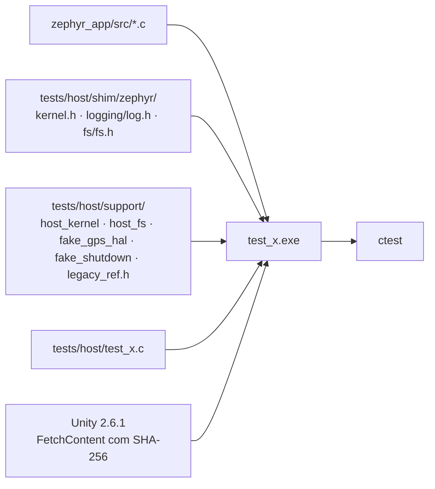

# Ferramentas e testes

As ferramentas herdadas do stravaV10 em `tools/` (simulador de host, scripts Node, debug em monitor mode, emulador), as ferramentas novas do projeto (`tools/fw/`, `tools/docs/`), os testes de host do port e as bibliotecas de terceiros com suas licenças.

**Nesta página:** [Mapa de tools/](#mapa-de-tools) · [Testes de host do port](#testes-de-host-do-port) · [Simulador TDD do legacy](#simulador-tdd-do-legacy) · [Outras ferramentas herdadas](#outras-ferramentas-herdadas) · [Bibliotecas e licenças](#bibliotecas-e-licenças)

## Mapa de tools/

| Pasta | Origem | Uso |
|---|---|---|
| `tools/fw/` | projeto | `ncs_env.sh`/`.bat` (ambiente do NCS), `fw.sh` (build, flash, recover, devices, size), `host_tests.sh` |
| `tools/docs/` | projeto | `mermaid_check.py` e `links_check.py` (skill `docs-gnss`); `case_drawing.py` gera o desenho do aparelho da [placa nova](13-placa-nova.md#como-fica-o-aparelho) |
| `tools/TDD/`, `tools/TDDW/` | stravaV10 | simulador de host do firmware original (Linux e Windows) |
| `tools/zpm/` | stravaV10 | scripts Node: posição do Zwift (`$LOC`), download de logs, conversão para GPX |
| `tools/MMD/` | stravaV10 | monitor mode debugging do J-Link |
| `tools/jumper/` | stravaV10 | descrição de placa para o Jumper Virtual Lab |

## Testes de host do port

Os módulos de lógica do `zephyr_app/src` compilam com o GCC do PC contra shims mínimos do Zephyr e rodam com Unity e CTest.

```sh
bash tools/fw/host_tests.sh             # tudo
bash tools/fw/host_tests.sh -R nmea     # um conjunto
```

| Conjunto | Código testado | Casos | O que garante |
|---|---|---|---|
| `test_vecteur` | `model/vecteur.c` | 9 | distância dentro de 0,5 % da fórmula do legacy, sinais dos eixos, produto escalar, normalização |
| `test_power_zone` | `model/power_zone.c` | 6 | limites das 7 zonas pelo FTP, janela de 50 a 1950 W, acumulação |
| `test_suffer_score` | `model/suffer_score.c` | 5 | zonas de FC e pontos por hora do legacy |
| `test_nmea_parser` | `drivers/gps/nmea_parser.c` | 12 | GGA, RMC, GSA, GSV, hemisférios, fração de segundo, checksum, linha longa, caminho caractere a caractere, posição que volta a falso com RMC `V` |
| `test_sd_logger` | `model/sd_logger.c` | 4 | intervalo de 15 m, lote de 5 com cabeçalho CSV, **nenhuma escrita fora do buffer sem cartão** |
| `test_gps_mgmt` | `drivers/gps/gps_mgmt.c` + parser | 6 | um callback por época, checksum, fim do fix no RMC `V`, níveis lógicos de reset e standby |
| `test_power_scheduler` | `model/power_scheduler.c` | 8 | 15 min exatos mantêm ligado, depois zera a atividade salva antes de soltar o latch, pings de posição e do rolo, nova tentativa 15 min depois, volta do contador de 32 bits |



- **Shims**: log vira nada, `k_mutex` nunca bloqueia, relógio controlável (`host_uptime_set/advance`), `k_msleep` avança o relógio.
- **Falsos**: `host_fs` (sistema de arquivos em memória que pode "sumir"), `fake_gps_hal` (linhas de UART, GPIO e EPO para o `gps_mgmt`), `fake_shutdown` (`stc3100_shutdown()` e `crash_recovery_clear_saved_state()` contados, para o `power_scheduler`).
- **Oráculo**: `support/legacy_ref.h` transcreve fórmulas do legacy com a origem.
- **Mutação**: as correções de 2026-09-18 do parser NMEA, do log e do GPS e as regras do `power_scheduler` foram revertidas uma a uma e os testes falharam, como deviam (a exceção é a conta em `double` do parser, cujo ganho fica dentro da resolução do `float`).
- Compilador: MinGW-w64 GCC 15.2 no Windows; o mesmo CMake funciona com o GCC do Linux.
- Os testes de ztest do Zephyr (`native_sim`, `unit_testing`) só rodam em Linux e não são usados.

## Simulador TDD do legacy

`tools/TDD` compila o firmware original inteiro (C/C++ com `-DTDD`) como executável de PC e simula o aparelho:

- **Entradas:** GPS gerado a partir de `GPX_simu.csv` (sem fix nos primeiros 10 s, depois RMC/GGA/VTG, depois posição por LNS), barômetro e acelerômetro sintéticos com ruído, HRM e FE-C falsos, cartão SD mapeado para a pasta `tools/TDD/DB/`, botões por um roteiro de tempo ou pelo teclado.
- **Tela:** framebuffer enviado por TCP (porta 8080, 12.004 bytes por quadro) para o `LS027simulator.jar` (Java), que mostra o LCD e salva capturas. As imagens de `docs/img/` vieram dele.
- **Testes do legacy** (`unit_testing.cpp`, rodam no início de cada execução):

| Teste | Critério | Equivalente no port |
|---|---|---|
| `test_power_zone` | FTP 256: máximo 1831 ± 2 s | `test_power_zone` (regras, não o mesmo cenário) |
| `test_score` | suffer score ≈ 66,46 ± 4 | `test_suffer_score` (regras) |
| `test_liste` | avanço num segmento de 14 ± 0,1 s | a portar junto com a correção do `liste_points` |
| `test_rollover` | tempo do FE-C com virada de 8 bits | a portar com o FTMS |
| `test_projection`, `test_fusion`, `test_fram`, `test_lsq` | projeção, fusão (só loga), configurações, regressão linear | parcialmente cobertos |

- **Não compila neste repositório:** a `CMakeLists.txt` de host do upstream não veio, `legacy/` e `libraries/` foram separados, e os submódulos `ant_profiles` e `ble_services` estão vazios. O `tools/TDDW` (MinGW) tem shims para Windows, mas herda os mesmos problemas.
- Útil como referência para um simulador do port: replay de GPX em NMEA (corrigindo a data fixa e o hemisfério do gerador) e a fonte de posição simulada.

## Outras ferramentas herdadas

| Ferramenta | Situação |
|---|---|
| `tools/zpm` | `LNS.js` (Zwift → `$LOC`, obsoleto desde a criptografia do Zwift em 2022), `LNS_test.js`, `getGPX.js` (`$QRY`), `gpx_convert.js` (CSV → GPX); `serialport` 8 e `cap` precisam de rebuild para o Node 22; incompatíveis com o port enquanto não houver comandos |
| `tools/MMD` | monitor mode do J-Link para depurar sem derrubar o BLE; no Zephyr o equivalente é `CONFIG_CORTEX_M_DEBUG_MONITOR_HOOK` + `CONFIG_SEGGER_DEBUGMON` |
| `tools/jumper` | pinos da placa v1 para o Jumper Virtual Lab; ferramenta não instalada |

## Bibliotecas e licenças

Nenhuma pasta de `libraries/` é compilada pelo port; ele reimplementa o que precisa.

| Pasta | Origem | Licença | No port |
|---|---|---|---|
| `AdafruitGFX` | Adafruit GFX + Print (Arduino) + fontes | BSD; `Print.cpp` LGPL-2.1; fonte `Tiny3x3a` **CC BY-NC-SA 3.0** (sem uso) | reimplementada em `vue.c`; `font_5x7.h` deriva do `glcdfont` (manter o aviso BSD) |
| `TinyGPSPlus` | TinyGPS++ (Mikal Hart) | LGPL-2.1+ | reimplementada em `nmea_parser.c` |
| `rtt`, `sysview` | SEGGER | estilo BSD da SEGGER | sem uso |
| `task_manager`, `SST/app_sdcard.c` | nRF5 SDK | Nordic 5 cláusulas | substituídas pelo Zephyr |
| `utils/WString` | Arduino | LGPL-2.1 | sem uso |
| `kalman`, `filters`, `AltiBaro`, `GlobalTop`, `hardfault`, `jscope`, `komoot`, `utils`, `VParser`, `SST` (resto) | autor do stravaV10 | a do repositório original: CC BY-NC 4.0 | reimplementadas em parte (`kalman_altitude`, `udmatrix`, `gps_epo`, `crash_recovery`) |
| `ant_profiles`, `ble_services` | submódulos do autor | — | **vazias** nesta cópia |
| `tools/TDD/timer` | Teunis van Beelen | **GPL-2.0** | sem uso |
| `tools/TDD/sd/fatfs` | FatFs R0.12b (ChaN) | licença do FatFs | sem uso |

O código do stravaV10 é CC BY-NC 4.0 (atribuição e uso não comercial) e o port deriva dele: a licença do projeto é uma [decisão pendente do dono](10-status-do-port.md#decisões-do-dono).
