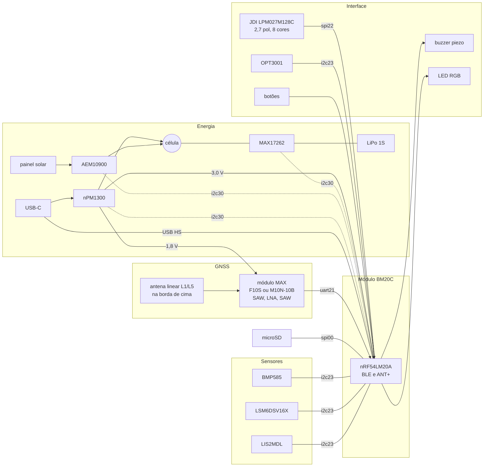
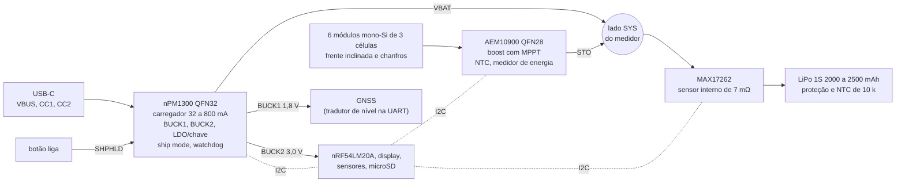

# Placa nova

Proposta de hardware da placa própria do GNSS Bike Computer, com o nRF54LM20A e esquemático novo, no lugar da myStravaB V3 ([02](02-hardware.md)): requisitos, escolha de cada bloco com as alternativas, orçamentos de pinos e de energia, riscos e próximos passos. Vem de pesquisa de mercado e de datasheets feita em 2026-09-18. **Nenhum componente foi comprado nem testado**; consumo, autonomia e ganho do painel são estimativas até a medição na bancada, e preço e estoque mudam rápido. A especificação técnica que sai desta proposta (alimentação, lista de materiais, pinos, placa e empilhamento) está em [14-hardware-placa-nova.md](14-hardware-placa-nova.md).

**Nesta página:** [Resumo](#resumo) · [Requisitos](#requisitos) · [Diagrama de blocos](#diagrama-de-blocos) · [Como fica o aparelho](#como-fica-o-aparelho) · [MCU](#mcu-nrf54lm20a) · [Display](#display) · [GNSS](#gnss) · [Antena GNSS dentro da caixa](#antena-gnss-dentro-da-caixa) · [Energia](#energia) · [Sensores](#sensores) · [Periféricos](#periféricos) · [Orçamento de pinos](#orçamento-de-pinos) · [Orçamento de energia](#orçamento-de-energia) · [Riscos](#riscos) · [Próximos passos](#próximos-passos) · [Fontes](#fontes)

## Resumo

| Bloco | V3 | Proposta | Alternativa |
|---|---|---|---|
| MCU | nRF52840 no módulo BMD-340 | nRF54LM20A no módulo Fanstel BM20C | o chip em CSP98 com antena própria |
| Display | Sharp LS027B7DH01, monocromático, 5 V | **JDI LPM027M128C**, MIP de 8 cores, 3,0 V, com luz integrada — **decidido em 2026-09-23**, sem canal autorizado de compra | Sharp LS027B7DH01A com o filme Azumo, no mesmo conector (plano B); TFT transflectivo com ST7789 |
| GNSS | Antenova M10578-A3 (MediaTek MT3333), só L1 | u-blox MAX-F10S (L1 + L5) no footprint MAX, 1 m de CEP, 46,8 mW a 1,8 V ([15](15-avaliacao-componentes.md#gnss)) | MAX-M10N-10B (só L1) no mesmo footprint, 13,7 mW em LEAP; Quectel LC76G(PA), com driver no NCS |
| Antena GNSS | chip Antenova SR4G008 na borda | antena linear L1/L5 na borda de cima, como nos ciclocomputadores do mercado | patch cerâmica, com a caixa de 25 a 35 mm mais longa |
| Carregador e reguladores | MCP73831, TPS63051, REG710 | Nordic nPM1300 | TI BQ25798 (carregador único com duas entradas) |
| Medidor de carga e liga/desliga | STC3100 com latch | MAX17262 na célula; ship mode do nPM1300 | medidor do próprio nPM1300, sem enxergar o painel |
| Solar | não tem | e-peas AEM10900 com 6 módulos de silício monocristalino na frente inclinada e nos chanfros laterais (11 cm²) | a entrada solar do BQ25798 |
| Bateria | Li-ion de 1 célula | LiPo de 1 célula, 2000 a 2500 mAh, com proteção e NTC | — |
| Barômetro | Bosch BME280 | Bosch BMP585 | ST LPS28DFW; BMP581 com membrana |
| Movimento | NXP FXOS8700CQ (fora de produção) | ST LSM6DSV16X e LIS2MDL; sem estoque, a [lista de compras](19-lista-de-compras.md#trocas) usa o Bosch BMI270 e o Memsic MMC5633NJL | ST LIS2DW12 e Memsic MMC5603NJ |
| Luz ambiente | não tem | TI OPT3001 | Lite-On LTR-329ALS-01 |
| Armazenamento | microSD por SPI | **flash NOR soldada** no `spi00`, com chave de alimentação (decisão do dono em 2026-09-20: o SD NAND custa mais que o armazenamento inteiro vale) ([15](15-avaliacao-componentes.md#armazenamento)) | microSD em soquete com tampa, só no protótipo; SD NAND se um dia precisar de 1 Gbyte |
| Configurações | FRAM FM24CL16B | ZMS no RRAM do MCU | — |
| USB | micro-USB B | USB-C IPX8, sem tampa, com proteção ESD ([15](15-avaliacao-componentes.md#usb-c-e-proteção)) | USB-C comum com tampa de borracha |
| LED e som | WS2812B; sem buzzer | LED RGB por PWM e buzzer piezo | WS2812B pelo driver SPI; buzzer magnético |

## Requisitos

| Requisito | Origem | Consequência para a placa |
|---|---|---|
| ANT+ e BLE ao mesmo tempo, vários sensores | decisão de 2026-09-18, [07](07-radio-ant-ble.md#decisão-ant-e-ble) | nRF54LM20A com o add-on `sdk-ant`; antena de 2,4 GHz longe da antena GNSS, do display e da bateria |
| Tela retangular no formato do legacy, colorida | decisão de 2026-09-18 | 2,7", 400 × 240, em retrato, legível ao sol, com luz para a noite |
| Dados ao vivo a cada 1 s | legacy (velocidade, tempo, FC, potência, segmentos) | o display precisa redesenhar partes da tela em bem menos de 1 s |
| GNSS melhor que o MT3333 da V3, com a antena dentro da caixa | pedido do dono | mais constelações, banda dupla se a antena permitir, cuidado com o rádio de 2,4 GHz e com o ruído digital |
| Altimetria por fusão | legacy (Kalman de 3 estados, [06](06-algoritmos.md#altitude-kalman-de-3-estados)) | barômetro de baixo ruído e acelerômetro para o pitch |
| Segmentos, percursos e logs trocados com o PC | legacy (microSD e USB mass storage, [09](09-armazenamento-usb.md)) | armazenamento removível ou grande, USB |
| Pedais de 4 a 10 h, sol, chuva e frio | uso | bateria maior, painel solar pequeno, caixa vedada, carga só entre 0 e 45 °C |
| Ligar pelo botão, desligar sozinho | legacy (latch do STC3100, auto-off de 15 min) | PMIC com ship mode e despertar pelo botão |
| Firmware Zephyr nativo | regra do projeto | componentes com driver no Zephyr upstream sempre que houver |

## Diagrama de blocos

## Como fica o aparelho

Conceito em escala a partir da caixa impressa da V3 ([foto](img/front1.png)), gerado por `tools/docs/case_drawing.py`; não há projeto mecânico nem layout ainda.

- **Caixa:** 62 × 104 × 19 mm, mais 3 mm do engate de quarto de volta; a V3 tem cerca de 60 × 85 mm. A frente mantém a moldura elevada, os três botões e o furo de luz da V3.
- **Tela:** JDI LPM027M128C com a interface em 8 cores e a luz frontal integrada, decidida em 2026-09-23; a janela é a mesma do LS027. A Sharp LS027B7DH01A com o filme Azumo continua como plano B, no mesmo conector e na mesma janela ([lista de compras](19-lista-de-compras.md#display)).
- **Painéis:** 6 módulos de 3 células de 23 × 8 mm, 2 numa face inclinada abaixo da tela e 2 em cada chanfro de 45° das bordas longas ([painel solar](#painel-solar)).
- **Antenas:** GNSS L1 e L5 na parede de cima, longe dos painéis; o módulo BM20C (BLE e ANT+) no canto de baixo à direita, com a antena fora da área dos painéis.
- **Conectores:** USB-C IPX8 na base, sem tampa; microSD com tampa na lateral esquerda só no protótipo, porque o produto usa SD NAND soldado ([15](15-avaliacao-componentes.md#armazenamento)); respiro do barômetro com membrana na traseira.

## MCU: nRF54LM20A

| Item | Valor | Fonte |
|---|---|---|
| CPU | Cortex-M33 a 128 MHz, coprocessador RISC-V de 128 MHz (FLPR) | datasheet v1.0 |
| Memória | 2036 KB de NVM (RRAM) e 512 KB de RAM | datasheet v1.0 |
| GPIO | 66 no CSP98 (3,9 × 3,7 mm), 40 no CSP61, 32 no QFN52 (6 × 6 mm) | datasheet v1.0, CNX Software |
| Alimentação e temperatura | 1,7 a 3,6 V; −40 a +85 °C | CNX Software |
| Rádio (a 3,0 V) | RX de 1 Mbps 3,3 mA; TX 5,0 mA a 0 dBm e 10,9 mA a +8 dBm | datasheet v1.0 |
| Processamento e repouso (a 3,0 V) | CoreMark da RRAM com cache 2,6 mA; System ON ocioso 4,3 µA (GRTC e 512 KB de RAM); System OFF 1,0 µA com despertar pelo GRTC, 0,7 µA sem | datasheet v1.0 |
| Periféricos no SDK | 7 blocos seriais (00, 20 a 24, 30; cada um SPIM, TWIM ou UARTE), USB HS com detecção BC1.2, NFC, SAADC, 2 PDM, TDM, 3 PWM, 2 QDEC, WDT30 e WDT31; sem QSPI em hardware | `zephyr/dts/vendor/nordic/nrf54lm20_a_b.dtsi` do NCS v3.3.0 |
| Domínios de pinos | `spi00`/`uart00` (rápidos) na porta P2; blocos 20 a 24 nas portas P1 e P3; bloco 30 na P0 | pinctrl do `nrf54lm20dk` |
| Placa de desenvolvimento | nRF54LM20 DK (vem com o nRF54LM20B; o NCS compila o A nela) | `zephyr/boards/nordic/nrf54lm20dk` |

Para a primeira placa, a proposta é usar um **módulo certificado** em vez do chip solto: o projeto da antena, os cristais e a certificação de rádio já vêm prontos, e o custo por unidade quase não muda em lotes pequenos.

| Módulo | Tamanho | Antena de 2,4 GHz | Preço unitário (1.000 peças) |
|---|---|---|---|
| Fanstel BM20C | 10,0 × 16,2 × 2 mm (a página diz 14,8 mm) | chip | US$ 6,50 (US$ 5,94) |
| Fanstel BM20M | 10,0 × 14,0 × 2 mm | trilha na placa | US$ 6,00 (US$ 5,12) |
| Fanstel BM20E | 10,0 × 15,0 × 2 mm | u.FL para antena externa | US$ 6,00 (US$ 5,57) |

Os três usam o nRF54LM20A (as versões com B no nome trazem o nRF54LM20B), expõem 64 GPIO (o chip tem 66; o cristal de 32,768 kHz do módulo ocupa P1.20 e P1.21), embutem os cristais de 32 MHz e de 32,768 kHz (o de 32,768 kHz é obrigatório para o ANT, que pede no máximo ±50 ppm: confira a tolerância no datasheet do módulo) e têm certificação FCC, ISED, europeia e TELEC; a Fanstel prevê produção em 09/2026. A página não detalha os pinos de USB e de NFC: confira no datasheet do módulo antes do esquemático.

Alternativa: o nRF54LM20A solto, no CSP98 (66 GPIO), com antena própria: mais barato em volume, mas com projeto de RF, casamento de antena e certificação por nossa conta. O QFN52, mais fácil de soldar, tem só 32 GPIO e não comporta o [orçamento de pinos](#orçamento-de-pinos).

## Display

O legacy mostra velocidade, tempo, frequência cardíaca, potência e segmentos com **atualização a cada segundo**, e o aparelho fica no sol, na chuva e no frio. O dono pediu tela colorida, retangular e do tamanho da V3 (2,7", 400 × 240). Isso deixa três tecnologias na mesa:

| Tecnologia | Exemplo | Atualização | Consumo com 1 quadro/s | Sol | Frio | Driver no Zephyr |
|---|---|---|---|---|---|---|
| LCD de memória (MIP) colorido | JDI LPM027M128B/C, 2,7", 400 × 240, 8 cores | por linha, menos de 0,2 s a tela inteira | 30 µW | ótimo (refletivo) | −20 a +70 °C | `jdi,lpm013m126`, com mudanças |
| E-paper colorido | Good Display GDEY029Z95, 2,9", 296 × 128, preto, branco e vermelho | 16 s (11 s no modo rápido); parcial de 1,5 s só em preto e branco | cerca de 9 mW durante 16 s por quadro | ótimo | 0 a 40 °C | só preto e branco (`ssd16xx`, `uc81xx`) |
| TFT transflectivo | ST7789, 2,0" a 2,4", 240 × 320, 262 mil cores | 60 quadros/s | cerca de 20 mW contínuos, mais o backlight | bom, pior sem luz | −20 a +70 °C | `sitronix,st7789v` |

**E-paper colorido fica de fora.** Os painéis coloridos de 2,7" a 3" levam de 11 a 20 s por atualização a 25 °C, não fazem atualização parcial em cor e operam de 0 a 40 °C; o E Ink Spectra 6 só existe a partir de 4" e mira vitrines e sinalização. A pesquisa não achou ciclocomputador com e-paper colorido. Os de maior autonomia usam MIP: o Garmin Edge 540/840 (colorido, 2,6") e o COROS DURA (2,7", 400 × 240, a mesma grade do LS027), que declara 120 h. O Garmin Edge 850 trocou o MIP por LCD transmissivo de 1.000 nits e declara 12 h (36 h no modo de economia).

### Recomendação: JDI LPM027M128C

> [!NOTE]
> **Decidido pelo dono em 2026-09-23: é o LPM027M128C.** A validação da
> [lista de compras](19-lista-de-compras.md#trocas) tinha confirmado que
> nenhum canal autorizado vende o JDI, e a lista passou a usar o par Sharp
> LS027B7DH01A + filme Azumo + REG710. A decisão desfaz isso: **peça única**,
> sem etapa de laminação, mesma resolução (a interface não muda), consumo
> menor e cor. O preço é comprar de revendedor, **sem garantia**, por
> R$ 776 contra os US$ 90,06 do par. A Sharp continua sendo o **plano B** no
> mesmo conector, o Hirose FH28-10S-0.5SH(05), que as fichas das duas telas
> citam.

LCD de memória refletivo de 8 cores, com backlight; o LPM027M128B é a mesma tela sem backlight. Os números abaixo foram conferidos nos dois datasheets (JDI LPM027M128B Ver.01 e Sharp LS027B7DH01) — e **a ficha do C nunca foi lida**, o que é de onde tem de sair por onde a luz dele se liga ([esquemático, folha 4](../hardware_gnssbike/01-esquematico.md#folha-4--display)).

| Item | Sharp LS027B7DH01 (V3) | JDI LPM027M128B/C (proposta) |
|---|---|---|
| Tecnologia | MIP refletivo, monocromático | MIP refletivo LTPS, 8 cores, normalmente preto |
| Área ativa | 58,8 × 35,28 mm | 58,8 × 35,28 mm |
| Contorno | 62,8 × 42,82 × 1,64 mm | 61,8 × 40,08 × 1,39 mm, 7,4 g |
| Resolução | 400 × 240 | 400 × 240, RGB em faixas |
| Pinos (FPC de 10 vias, passo 0,5 mm) | SCLK, SI, SCS, EXTCOMIN, DISP, VDDA, VDD, EXTMODE, VSS, VSSA | os mesmos, na mesma ordem |
| Conector sugerido pelo fabricante | SMK FP12 (CFP-4510-0150F ou CFP-4610-0150F) | Hirose FH28-10S-0.5SH(05) |
| Alimentação | 5,0 V (4,8 a 5,5 V), entradas lógicas de 3 V | 3,0 V (máximo absoluto 3,6 V), entradas lógicas em VDD |
| SPI | 1 MHz típico, 2 MHz máximo | 1 MHz típico, 2 MHz máximo (pode cair no frio com VDD abaixo de 3,0 V) |
| Quadro de uma linha | endereço de 8 bits, LSB primeiro | 6 bits de modo, endereço de 10 bits (linha 1 a 240 em binário, MSB primeiro), 1, 3 ou 4 bits por pixel, 16 clocks no fim |
| Consumo típico a 25 °C | 50 µW parado, 175 µW com 1 atualização/s | 5 µW parado, 30 µW com a tela inteira atualizada a 1 Hz |
| Temperatura de operação | −20 a +70 °C | −20 a +70 °C |
| Luz | não tem | só no C: LED de 16 mA a 2,67 V |
| Driver no Zephyr | `sharp,ls0xx` (só monocromático) | `jdi,lpm013m126` (8 cores), com mudanças |

Por que ele:

1. **Mesmo tamanho, mesma grade e mesma pinagem do LS027**: a mecânica do legacy e o layout das telas continuam valendo, e a interface monocromática atual roda no modo de 1 bit (50 B por linha, framebuffer de 12.000 B) antes de ganhar cor. Em 3 bits o framebuffer tem 36.000 B, que cabem com folga nos 512 KB do nRF54LM20A.
2. **Consome menos que o LS027** e dispensa o 5 V: com a decisão de 2026-09-23 o REG710 deixou de ser montado, e o trilho de 5 V saiu da placa ([esquemático, folha 4](../hardware_gnssbike/01-esquematico.md#folha-4--display)). O `DISP_PWR_EN` (P3.07), que era o `EN` dele, **voltou a ficar livre**.
3. **Legível ao sol sem luz própria**, sem fantasma e sem piscar, na mesma faixa de temperatura do LS027.

Cuidados para o esquemático:

- VDD e VDDA no mesmo trilho de 3,0 V dos pinos do SPI (as entradas pedem nível alto em VDD − 0,1 V); VDD sobe junto ou antes de VDDA.
- EXTMODE em VDD e EXTCOMIN num pino de PWM: com o backlight ligado, o datasheet pede COM perto de 60 Hz.
- Com DISP baixo ou depois do all-clear a tela fica **preta** (no LS027 fica branca): a tela de boot e o desligamento mudam.
- Uma tela inteira em 3 bits são cerca de 296 mil clocks: 0,15 s a 2 MHz.

Riscos:

- **Compra.** A Switch Science, principal revenda, encerrou as vendas do LPM027M128C (¥9.460); a JDI não lista MIP no site; os módulos da Azumo com esse painel constam como obsoletos na DigiKey. Restam AliExpress e brokers, **sem canal autorizado, sem procedência e sem garantia**: o anúncio escolhido em 2026-09-23 é de **R$ 776** ([link](https://pt.aliexpress.com/item/1005011938384752.html)). Antes do layout, compre de 3 a 5 amostras e teste.
- **Por onde a luz se liga é pendência aberta, e de alta prioridade.** O FPC de 10 vias que as duas telas compartilham não tem par para o LED, e na Sharp a luz vinha num filme com cauda própria. O C tem de trazer um FPC com mais vias ou um rabicho separado, e **nenhum documento do projeto registra qual**: a ficha lida é a do B, que não tem luz. Precisa sair da ficha do C ou de uma amostra **antes do layout** ([esquemático, folha 4](../hardware_gnssbike/01-esquematico.md#folha-4--display)).
- **Plano B no mesmo conector.** O LS027 e o JDI usam FPC de 10 vias com passo de 0,5 mm e a mesma ordem de pinos; muda a tensão (5 V contra 3,0 V, e o JDI queima acima de 3,6 V) e talvez o lado de contato. O footprint do regulador de 5 V e a posição de 5 V do jumper ficam na placa **sem peça**, e é isso que deixa a placa aceitar o LS027 monocromático com o filme Azumo se o JDI faltar.
- **Plano C.** MIP de 64 cores ainda em produção, como o Sharp LS021B7DD02 (2,13", 320 × 240, em estoque na DigiKey), muda o tamanho e usa interface paralela de 6 bits, sem driver no Zephyr; o TFT transflectivo com ST7789 tem driver pronto, mas gasta centenas de vezes mais.
- **Software.** O `jdi,lpm013m126` do Zephyr guarda largura e altura em `uint8_t` (máximo 255), manda o endereço de 8 bits com os bits invertidos e não manda os 16 clocks finais; para o LPM027M128 ele precisa de largura e altura em 16 bits, endereço de 10 bits e o modo de 1 bit. A alternativa é estender o `src/drivers/lcd/ls027.c` do port. Nos dois casos, o trabalho é pequeno e testável só com o painel na mão.

## GNSS

A V3 usa o Antenova M10578-A3 (MediaTek MT3333): GPS e GLONASS em L1, 28 mA a 3,3 V (cerca de 92 mW) e menos de 2,5 m de CEP, com a antena de chip SR4G008 na entrada RF externa. Qualquer módulo atual gasta bem menos e rastreia mais constelações. Consumo em rastreio contínuo, pelos datasheets (u-blox a 25 °C e −130 dBm; CEP de 50 % estático em 24 h); preços da DigiKey, 1 unidade, em 2026-09-18:

| Módulo (chip) | Bandas e constelações | Rastreio contínuo | Modo econômico | CEP | Tamanho e tensão | Entrada de RF | Preço | Driver no NCS v3.3.0 |
|---|---|---|---|---|---|---|---|---|
| Antenova M10578-A3 (MT3333), V3 | L1: GPS e GLONASS | 92 mW (28 mA a 3,3 V) | — | < 2,5 m | 3,3 V | LNA | — | `gnss-nmea-generic` |
| **u-blox MAX-M10S** (M10) | L1: GPS, Galileo, BeiDou, GLONASS, QZSS | 27 mW a 1,8 V; 35 mW a 3,0 V | 21 mW a 3,0 V | 1,5 m | 10,1 × 9,7 mm; 1,76 a 3,6 V | LNA → SAW | US$ 11,42 | não |
| **u-blox MAX-M10N-10B** (M10 com flash) | L1: GPS, Galileo, BeiDou, QZSS; sem GLONASS | 27 mW a 1,8 V; 32 mW a 3,0 V | **LEAP: 14 mW a 1,8 V** (17 mW a 3,0 V), só a 1 Hz | 1,5 m | o mesmo footprint, sem I2C | SAW → LNA → SAW | US$ 14,52 | não |
| **u-blox MAX-F10S** (F10) | **L1 + L5**: GPS, Galileo, BeiDou, QZSS, NavIC; sem GLONASS | 47 mW a 1,8 V; 57 mW a 3,0 V | não tem | 1 m | o mesmo footprint | SAW → LNA → SAW | US$ 13,14 | não |
| Quectel LC76G(PA) (Airoha AG3352) | L1: GPS, GLONASS, Galileo, BeiDou, QZSS | 33 mW (10 mA a 3,3 V) | ALP: 18 mW | 1,5 m | 10,1 × 9,7 × 2,4 mm; 3,3 V | LNA | US$ 9,72 | **sim**, `quectel,lc76g` |
| Quectel LC79H(AL) (Airoha AG3335M) | **L1 + L5**, com GLONASS em L1 | 59 mW (33 mA a 1,8 V) | — | 1 m | 10,1 × 9,7 × 2,4 mm; 1,8 V | LNA e SAW | US$ 14,09 | não; os comandos PAIR do driver `lcx6g` existem nele (não testado) |
| Quectel LC29H(AA) | **L1 + L5**, com GLONASS em L1 | 79 mW (24 mA a 3,3 V) | citado sem número | 1 m | 16,0 × 12,2 × 2,5 mm; 3,3 V | não levantada | não levantado | não; NMEA com comandos `PQTM` próprios |

Energia só do GNSS numa pedalada de 10 h: 0,92 Wh no M10578-A3 da V3, 0,79 Wh no LC29H, 0,59 Wh no LC79H, 0,47 Wh no MAX-F10S escolhido, 0,27 Wh no MAX-M10S e 0,14 Wh no MAX-M10N em LEAP (1 Wh é cerca de 270 mAh de LiPo).

### Recomendação: footprint MAX da u-blox

O MAX-M10S, o MAX-M10N e o MAX-F10S têm o mesmo footprint e a mesma pinagem de UART, reset, EXTINT e TIMEPULSE (conferido nas tabelas de pinos; o M10N não tem I2C). A placa sai com esse footprint, e o firmware aceita as duas peças pelo devicetree. A [avaliação](15-avaliacao-componentes.md#gnss) escolheu o F10S pela banda dupla, e o M10N fica como alternativa no mesmo footprint:

- **Escolhido: MAX-F10S (L1 + L5).** 1 m de CEP contra 1,5 m, sensibilidade de rastreio de −167 dBm e o código do L5, dez vezes mais rápido, que ataca o multipercurso de prédio e de mata — o pior caso do legacy. Entrada com SAW, LNA e SAW, que aguenta o BLE de +8 dBm do nRF54LM20A; 46,8 mW a 1,8 V, o menor entre os multibanda; US$ 13,14. Contra: sem GLONASS, **sem modo econômico nenhum** (a firmware do F10 não tem o grupo `CFG-PM`), sem modo só L1, ROM em vez de flash, e a antena de L5 numa caixa pequena é o ponto fraco. Com ele o aparelho gasta cerca de 58 mW e o painel devolve de 23 a 46 min por hora de sol, em vez de cobrir o consumo.
- **Alternativa econômica: MAX-M10N-10B (só L1).** 13,7 mW em LEAP a 1,8 V, um sétimo do módulo da V3, 1,5 m de CEP, AssistNow Live Orbits incluso e firmware atualizável. Com ele o aparelho gasta cerca de 21 mW e o painel cobre o consumo num pedal de sol. Contra: só L1, sem GLONASS, até 1 Hz em LEAP, e o LEAP perde sensibilidade de rastreio (−159 contra −167 dBm). É a peça do teste A/B e a saída se a autonomia pesar mais que o metro de precisão.
- **Se o critério for driver pronto e custo: Quectel LC76G(PA).** Único da lista com driver no NCS v3.3.0; footprint e tensão diferentes (família L76, 3,3 V) e banda única. O caminho de banda dupla dessa família é o LC79H(AL), com o chip AG3335M que aparece no COROS DURA; a compatibilidade de pinos entre os dois não foi confirmada. O LC29H(AA), também de banda dupla e 1 m de CEP, gasta 79 mW a 3,3 V, mede 16,0 × 12,2 mm e fala NMEA com comandos `PQTM` próprios: pediria driver novo.

Como confirmar: protótipos com o F10S e o M10N lado a lado, na caixa real, medindo o C/N0 por banda e o ruído na banda (`UBX-MON-SPAN`), e pedaladas na cidade e sob árvores contra uma referência. Com o módulo alimentado a 1,8 V (pino `VIO_SEL`), o F10S gasta cerca de 17 % menos que a 3,0 V (46,8 contra 57 mW) e o M10N em LEAP cerca de 18 % (13,7 contra 16,8 mW, na ficha do 10B); o MCU fica em 3,0 V por causa do display, então a UART e os sinais de controle do GNSS a 1,8 V passam por um tradutor de nível ([Energia](#energia)).

A altitude continua vindo do barômetro: o GNSS erra mais na vertical (o LC79H declara 1 m na horizontal e 2 m na vertical) e só corrige a deriva do barômetro, como no legacy ([06](06-algoritmos.md#barômetro-e-drift)).

### Impacto no firmware

- **Driver.** O NCS v3.3.0 tem drivers para LC26G, LC76G, LC86G, u-blox M8 e F9P, Air530Z e NMEA genérico, mas não para M10 nem F10. O antigo driver "M10" virou `u-blox,m8` no Zephyr 4.0 porque só servia ao M8 (`doc/releases/migration-guide-4.0.rst:221`): não use o `u-blox,m8` com um M10. Um driver `u-blox,m10` novo entrou no `main` do Zephyr em 2026-06-09 e sai no Zephyr 4.5, sem standby e sem AssistNow. O port tem o seu, em `zephyr_app/modules/gnss_drivers/drivers/gnss/`, com os dois compatíveis: `u-blox,max-f10` para a peça escolhida e `u-blox,max-m10` para a alternativa. A interface de configuração é a mesma; o F10 acrescenta os sinais de L5 e o NavIC no grupo `CFG-SIGNAL` e **não tem** o grupo `CFG-PM`.
- **Comandos do legacy.** O legacy fala PMTK com o MediaTek (`legacy/source/sensors/GPSMGMT.cpp`): velocidade da UART (linha 32), intervalo de fix (`PMTK220`, linha 487), posição do celular (`PMTK741`, linha 458) e o EPO (máquina de estados das linhas 268 a 340). Na u-blox viram `CFG-UART1-BAUDRATE`, `CFG-RATE-MEAS`, `UBX-MGA-INI-POS_LLH` com `UBX-MGA-INI-TIME_UTC` e AssistNow Offline ou Autonomous; o standby por pino vira `UBX-RXM-PMREQ` ou EXTINT. Cada diferença vai para [06](06-algoritmos.md) e [10](10-status-do-port.md) quando for portada.
- **Fim de época.** O `gps_mgmt.c` do port antigo disparava o callback de fix no RMC válido, supondo a ordem dos MediaTek (GGA antes do RMC). Com UBX, a mensagem `NAV-PVT` é uma por época e resolve isso; desde 2026-09-19 o port usa a API de GNSS do Zephyr ([05](05-arquitetura-zephyr.md#threads)).
- **Modelo dinâmico.** No u-blox, o modelo `BIKE` é de motocicleta; para bicicleta vale o padrão `PORT`.
- **Energia do receptor.** Com o M10N havia dois níveis de rastreio (LEAP e potência plena) e o standby; com o F10S só existe o standby por `UBX-RXM-PMREQ`, porque a firmware do F10 não tem o grupo `CFG-PM`. A máquina de `gnss_power.c` continua a mesma e recebe `has_leap = false` ([16](16-arquitetura-firmware.md#gnss)).

## Antena GNSS dentro da caixa

O dono perguntou o que os fabricantes fazem para deixar a antena dentro da caixa sem perder precisão. A resposta veio das fotos internas que eles publicam no FCC:

| Aparelho | Chip GNSS | Bandas | Antena GNSS | Fonte |
|---|---|---|---|---|
| Garmin Edge 540 e 840 | Airoha AG3335M (pelo código do chip nos arquivos FIT; na foto ele está sob blindagem) | L1 + L5 | dois elementos lineares na caixa: L5 ao longo da borda de cima, L1 na parede lateral direita, ligados por um cabo flexível sob a placa; a antena de 2,4 GHz fica no canto de cima, à esquerda | FCC IPH-04394 |
| COROS DURA | Airoha AG3335M | L1 + L5 | duas antenas em suportes plásticos nas bordas da caixa traseira, gravadas "GPS L1" e "GPS L5", com contatos de mola; Wi-Fi e BT numa terceira | FCC 2BBGF-BY01 |
| Wahoo ELEMNT ACE | Sony CXD5610 | L1 + L5 | dois elementos na borda de cima da caixa frontal, com contatos de mola; a blindagem do GNSS e o TCXO ficam junto deles | FCC PADWF149 |
| Wahoo ELEMNT BOLT v2 | ilegível na foto | L1 | um elemento no canto de cima, à direita, da caixa traseira, com contatos de mola | FCC PADWF141 |
| Hammerhead Karoo 2 | Qualcomm MSM8909 com o WTR4905 | L1 | uma antena só, dividida com BT e Wi-Fi, num canto de cima | FCC 2ADMX-HK2 |

O que se repete:

- **Nenhum usa patch cerâmica.** A antena GNSS é um elemento linear (tira metálica ou circuito flexível num suporte de plástico) **na parede da caixa**, na borda de cima e no alto das laterais: a parte que aponta para o céu com o aparelho inclinado no guidão.
- A antena fica **na periferia**, longe da bateria e fora da parte de trás da tela; a ligação com a placa é por contato de mola ou cabo flexível.
- Os aparelhos de banda dupla têm **antenas separadas para L1 e L5**.
- O chip GNSS fica **blindado, perto da borda** de onde saem as antenas, e as antenas de 2,4 GHz vão para **outro canto**.
- Nos testes do DC Rainmaker, Edge 840, Karoo 3 e ROAM v2 (todos de banda dupla) ficaram precisos em cerca de 1.000 km; o ROAM v2 sofreu entre prédios de 25 a 35 andares, onde o Edge 1040 ficou melhor. Nenhum teste publicado isola o efeito da banda dupla em ciclismo.

### O que cabe numa caixa pequena

A V3 (52,35 × 77,47 mm) tem o LCD na face de cima e a antena de chip SR4G008, só de L1, no meio da borda direita (`hardware/myStravaB_V3.brd`, elemento `U$4`). A placa nova mantém o display de 2,7", então vale a mesma geometria, e a borda de cima é a que aponta para o céu com o aparelho inclinado no guidão:

| Opção | O que é | Custo |
|---|---|---|
| **A · Antena linear na borda de cima** (proposta, como nos produtos) | uma antena de chip L1/L5 de alimentação única na borda de cima da placa, com área livre de cobre em todas as camadas e rede de casamento em π (a TE L000670, de 14 × 10,75 mm, tem 66 % de eficiência em L1 e 56 % em L5 num plano de 90 × 41 mm); ou, como Garmin e COROS, elementos separados de L1 e L5 na parede da caixa, ligados por mola ou cabo e unidos por um diplexador na entrada única do módulo (inferência: não há projeto de referência publicado) | perde cerca de 3 dB por ser linear e depende do plano de terra; sintonia com VNA na caixa final; cabe na caixa atual |
| B · Patch cerâmica voltada para o céu | 18 × 18 ou 25 × 25 mm, RHCP, sobre um plano de terra de 50 × 50 a 70 × 70 mm | com 10 mm livres em volta pede cerca de 45 × 45 mm fora do LCD: a caixa cresce de 25 a 35 mm |
| C · Plaquinha de antena na ponta | patch ou chip numa placa separada, ligada por uma linha de 50 Ω de até 10 cm | mais uma peça e um conector; a caixa também cresce |

Debaixo do LCD não: a u-blox cita o LCD entre as peças que deformam o diagrama da antena, e ele emite ruído de banda larga até vários GHz. Números que pesam na escolha, das notas de aplicação da u-blox e da Quectel:

| Antena | Ganho | C/N0 máximo | Observação |
|---|---|---|---|
| Patch 25 × 25 em plano de 70 × 70 mm | +3,5 dBic | 52 dB-Hz | referência |
| Patch 15 × 15 em plano de 50 × 50 mm | +1,5 dBic | 48 dB-Hz | abaixo de 12 × 12 a patch perde a polarização circular |
| Chip em plano de 80 × 40 mm | cerca de 0 dBi | 45 dB-Hz | linear; a u-blox a desaconselha "onde a navegação é essencial" |
| O mesmo chip em plano de 24 × 15 mm | — | 34,7 dB-Hz de média (43,4 no plano de 80 × 40) | o plano de terra é quem irradia |

### Regras de projeto

1. **Plano de terra grande e contínuo** sob a eletrônica, com a antena no lado mais longo; nada de cobre, trilha ou componente na área livre da antena.
2. **Longe de metal:** bateria (a bolsa é metálica), soquete microSD, parafusos e o painel solar não ficam entre a antena e o céu; componentes altos a pelo menos 10 mm e a caixa a pelo menos 3 a 5 mm.
3. **Filtro SAW antes do módulo.** O BLE do nRF54LM20A transmite até +8 dBm (`RADIO_TXPOWER_TXPOWER_MaxdBm` no MDK do NCS), e a isolação entre duas antenas num aparelho pequeno fica entre 6 e 20 dB: chegam de −12 a +2 dBm à entrada do GNSS, acima da imunidade de módulos como o MIA-M10Q (−18 dBm em 2440 MHz). Um módulo com SAW, LNA e SAW internos resolve; um módulo só com LNA na frente precisa do SAW externo. Ajuda também pôr as duas antenas em pontas opostas da placa e limitar a potência do BLE.
4. **Clocks fora das bandas.** Harmônicos de 1, 2, 4, 8 e 25 MHz caem a menos de 0,6 MHz do centro de L1 (1575,42 MHz); 16, 21,33 e 32 MHz ficam fora do lóbulo principal. Em L5, larga demais, nenhuma frequência escapa: sobra borda lenta, trilha curta e blindagem. O microSD roda a 16 ou 21,33 MHz no `spi00` (em modo SPI o cartão vai até 25 MHz), nunca a 8 ou 25 MHz; linhas do LCD e do USB em camada interna entre planos de terra.
5. **Fonte limpa para o GNSS:** ripple abaixo de 50 mV (a u-blox sugere LDO junto do módulo; na proposta, o BUCK1 com filtro LC, a medir), DC-DC e cristais no lado oposto e na diagonal da antena; blindagem sobre o DC-DC, o MCU e os cristais se o ruído aparecer.
6. **Placa de 4 camadas**, com planos sólidos e moldura de terra com vias.
7. **Validar desde o primeiro protótipo:** C/N0 dos satélites mais fortes perto de 50 dB-Hz (45 é aceitável, abaixo de 40 é problema), partida a frio de 30 a 40 s, a placa girada 180°, o espectro na banda (UBX-MON-SPAN nos u-blox) com o BLE transmitindo, e o S11 da antena dentro da caixa final para ajustar a rede em π.

### Banda dupla (L1 + L5)

A banda dupla reduz o erro por multipercurso na cidade e sob árvores: a u-blox declara menos de 2 m de CEP50 em cidade com L1 + L5, contra cerca de 4 m só com L1. Três ressalvas:

- **Antena pequena rende menos em L5** (Kyocera 1005620: 3,3 dBic em L1 e 0,4 dBic em L5; DAN-F10N: 3 e 1 dBic), e nenhum fabricante publica L5 com antena de chip num plano de 50 × 75 mm com LCD por cima.
- **O GPS L5 ainda é pré-operacional** ("unhealthy"); em abril de 2026 a Space Force cancelou o OCX e a capacidade plena ficou para 2030. Hoje o ganho vem do Galileo E5a e do BeiDou B2a.
- **Gasta mais:** nos Garmin, o modo multibanda corta a autonomia pela metade, segundo o DC Rainmaker.

## Energia

A V3 tem carregador linear MCP73831 de 500 mA, buck-boost TPS63051 de 3,3 V, bomba de carga REG710 de 5 V e o STC3100 como medidor e latch de energia ([02](02-hardware.md#alimentação)). A proposta troca tudo por um PMIC da Nordic, um medidor na célula e um carregador solar com MPPT.

| Função | V3 | Proposta | Por quê |
|---|---|---|---|
| Carregador USB e reguladores | MCP73831, TPS63051, REG710 | **Nordic nPM1300** (QFN32 de 5 × 5 mm) | carrega de 32 a 800 mA com power path, VBUS de 4,0 a 5,5 V (tolera 22 V), detecção USB-C pelos pinos CC, 2 bucks de 200 mA e 2 LDO de 50 mA que viram chave de 100 mA; ship mode de 370 nA; drivers no NCS (`nordic,npm1300*`: regulador, carregador, GPIO, LED e watchdog) e amostras com overlay do nRF54LM20 DK |
| Liga e desliga | latch pelo IO0 do STC3100 | ship mode do nPM1300 | o botão no pino SHPHLD acorda a placa; o `power_scheduler` passa a chamar `regulator_parent_ship_mode()` no lugar do `stc3100_shutdown()`; com VBUS presente o PMIC não entra em ship mode, e o firmware desliga os trilhos e põe o MCU em System OFF |
| Medidor de carga | STC3100 (shunt externo) | **Analog Devices MAX17262** na célula | sensor interno de 7 mΩ, algoritmo ModelGauge m5 EZ sem caracterização da célula, 5,2 µA em hibernação, driver `maxim,max17262` no Zephyr; mede a corrente líquida de todas as fontes, inclusive a do painel com a placa desligada |
| Carregador solar | não tem | **e-peas AEM10900** (QFN28 de 4 × 4 mm) | boost com MPPT de 120 mV a 2,73 V, partida a frio com 250 mV, até 175,5 mA de entrada, limiares da bateria por pino ou por I2C, monitor de temperatura próprio que corta a carga fora de 0 a 45 °C mesmo com o MCU desligado, medidor de energia e pino para bloquear a carga; sem driver no Zephyr (poucos registradores por I2C) |
| Bateria | Li-ion de 1 célula; o port supõe 1500 mAh (`zephyr_app/src/main.c`) | **LiPo de 1 célula com proteção (PCM) e NTC de 10 k**, de 2000 mAh (60 × 36 × 7 mm) a 2500 mAh (50 × 60 × 7,3 mm) | carga de 0 a 45 °C, descarga de −20 a 60 °C; pack sob encomenda (as células de catálogo não trazem NTC); UN38.3 para transporte |

Trilhos: o BUCK2, em 3,0 V, alimenta o MCU, o display (que pede as entradas no nível do seu VDD), os sensores e o microSD por uma chave de carga; o BUCK1, em 1,8 V, alimenta só o GNSS (a proposta inicial invertia os dois, mas o resistor do VSET1 não escolhe 3,0 V: ver [19](19-lista-de-compras.md#correções-de-integração)), que a 1,8 V gasta cerca de 17 % menos que a 3,0 V, com filtro LC para o ripple ficar abaixo de 50 mV e tradutor de nível nos sinais com o MCU. Os dois bucks dão 200 mA cada. Os drivers de LED do nPM1300 dão só 5 mA: a luz do display (16 mA) vai por um transistor, alimentada pela LDSW2 como LDO de 3,3 V.

O nPM1304 não serve: o binding do NCS limita a carga a 4 a 100 mA e a descarga a 125 mA fixos. O medidor interno do nPM1300 (nRF Fuel Gauge) também não: ele só enxerga a corrente que passa pelo próprio PMIC, então não vê a carga solar, e não mede nada em ship mode.

### Painel solar

| Tecnologia | Exemplo | Rendimento a 1 sol | Observação |
|---|---|---|---|
| **Silício monocristalino IBC** | ANYSOLAR KXOB25-05X3F (23 × 8 mm, 3 células, 2,07 V em aberto, 30,7 mW) | 17 a 19 mW/cm² | a linha da antiga IXYS IXOLAR; SMD, com relatório de confiabilidade; a ANYSOLAR indica o AEM10900 para ele |
| Silício amorfo | PowerFilm ONP (flexível) | cerca de 3 mW/cm² | seis vezes menos por área |
| Orgânico ou corante | Epishine, Exeger Powerfoyle | não publicado | feitos para luz interna |

Na caixa do [desenho](#como-fica-o-aparelho) (62 × 104 mm) cabem 6 módulos de 3 células e 23 × 8 mm, da classe do ANYSOLAR KXOB25-05X3F (30,7 mW cada a 1 sol, 2,07 V em aberto): 2 na face inclinada abaixo da tela e 2 em cada chanfro de 45° das bordas longas, 11 cm² de módulos. Os chanfros recebem menos sol que a frente, e o conjunto equivale a cerca de 7 a 9 cm² virados para o céu (estimativa); 10 a 15 cm² de frente pediriam uma caixa maior. Cada módulo já é uma string de 3 células: o AEM10900 aceita no máximo 2,73 V de MPPT (3,0 V em aberto), e 3 células dão 2,07 V em aberto a 25 °C e cerca de 2,3 V a −20 °C, enquanto 4 em série chegariam a 2,97 V a −5 °C, no limite do chip. Em paralelo, uma sombra derruba só o módulo atingido, e os 6 somam cerca de 110 mA a 1 sol, abaixo dos 175,5 mA do AEM10900. O painel não precisa entregar a tensão da bateria nem a dos circuitos: o AEM10900 eleva a tensão dos módulos até a de carga da LiPo (4,2 V, ou 4,1 V para vida longa), e os 3,0 V e 1,8 V saem dos reguladores do nPM1300.

O controle remoto da Samsung (Eco Remote) guarda a energia em capacitores híbridos VINATech de 3,8 V, não numa bateria; um capacitor desses de 250 F guarda cerca de 0,3 Wh, ou 6 h a 50 mW. Serve de inspiração para o painel e o harvester, não para o armazenamento, porque a LiPo de 2000 mAh guarda 7,4 Wh.

### Dois carregadores na mesma célula

O nPM1300 (USB) e o AEM10900 (sol) carregam a mesma célula pelo mesmo nó, e o MAX17262 fica entre esse nó e a célula. O datasheet do nPM1300 proíbe fonte externa no VSYS e alimentar a aplicação direto do VBAT, e a Nordic não documenta um segundo carregador no VBAT. Regras da proposta, **a validar na bancada antes do layout**:

1. O limiar de carga do AEM10900 fica abaixo da tensão de término do nPM1300: 3,90 V pelo pino no boot (perfil "Li-ion long life"), e cerca de 4,05 V por I2C com a placa ligada; o nPM1300 termina em 4,20 V (ou 4,10 V para vida longa). O harvester para antes da fase de tensão constante e não confunde a detecção de fim de carga.
2. O corte térmico dos dois carregadores funciona sem o MCU: JEITA no nPM1300 (0, 10, 45 e 60 °C) e TEMPCOLD e TEMPHOT no AEM10900 (0 e 45 °C), com um NTC colado na célula para cada um. Parado ao sol, desligado, o painel continua carregando.
3. Com USB presente, o VBUSOUT do nPM1300 bloqueia o harvester pelo pino `DIS_STO_CH`, sem firmware ([15](15-avaliacao-componentes.md#convivência-das-duas-cargas)).
4. A soma das correntes (até 800 mA do nPM1300 e 175 mA do AEM10900) fica dentro da corrente de carga da célula.

Alternativa sem dois carregadores: o **TI BQ25798**, carregador buck-boost com duas entradas e MPPT. Resolve a disputa na célula, mas pede painel de pelo menos 3,6 V (8 células ou mais em série, sensível a sombra), consome 17 µA só com a bateria, precisa de reguladores externos e não tem driver no NCS.

## Sensores

| Função | V3 | Proposta | Alternativa | Driver no Zephyr |
|---|---|---|---|---|
| Barômetro (altimetria) | Bosch BME280 | **Bosch BMP585** | ST LPS28DFW (10 ATM, o dobro do preço); BMP581 se a caixa tiver membrana de ePTFE | `bosch,bmp581` |
| Acelerômetro e giroscópio (inclinação) | NXP FXOS8700CQ | **ST LSM6DSV16X** (sem estoque na compra: a [lista de compras](19-lista-de-compras.md#trocas) usa o Bosch BMI270 no mesmo footprint) | ST LIS2DW12, só acelerômetro, como no legacy | `st,lsm6dsv16x` / `st,lis2dw12` |
| Magnetômetro (rumo parado) | NXP FXOS8700CQ | **ST LIS2MDL** (sem estoque na compra: a lista usa o Memsic MMC5633NJL) | Memsic MMC5603NJ | `st,lis2mdl` / `memsic,mmc56x3` |
| Luz ambiente (luz do display) | não tem | **TI OPT3001** | Lite-On LTR-329ALS-01 | `ti,opt3001` / `liteon,ltr329` |

- **Barômetro.** O BMP585 tem ruído abaixo de 0,1 Pa RMS sem filtro (menos de 1 cm de altura), deriva de ±0,5 Pa/K, precisão relativa de ±6 Pa, 1,3 µA a 1 Hz em baixo consumo e encapsulamento LGA de 3,25 × 3,25 mm com tampa metálica, feito para contato com o meio: nenhum efeito depois de armazenado a 15 bar, e resiste a cloro, vinagre, acetona e repelente. O driver `bosch,bmp581` aceita os chip IDs 0x50 e 0x51 da família BMP5 (`drivers/sensor/bosch/bmp581/bmp581.h`), e o registrador CHIP_ID do BMP585 vale 0x51; o par nunca foi testado. Seja qual for o sensor, a porta de pressão da caixa precisa de membrana e pouco volume morto.
- **Inclinação.** O legacy mede o pitch com o acelerômetro (média de 50 amostras) e o funde com a altitude do barômetro num Kalman de 3 estados ([06](06-algoritmos.md#altitude-kalman-de-3-estados)). O LSM6DSV16X soma o giroscópio e uma fusão interna (SFLP) que entrega o vetor de gravidade, menos sensível à vibração da estrada; gasta 0,65 mA com os dois sensores em alto desempenho, pouco perto do GNSS, e acorda o MCU por movimento. O LIS2DW12 fica como alternativa fiel ao legacy: 0,38 µA em vigília, triggers de movimento, inatividade e queda livre no driver, US$ 1,90 e com estoque.
- **FXOS8700CQ.** A NXP marca a peça como "No Longer Manufactured" (aviso 202009030DN, de 2020): a placa nova precisa de outro sensor de qualquer jeito.
- **Estoque.** Em 2026-09-18 a DigiKey mostrava LSM6DSV16X e LIS2MDL sem estoque, e o BMP585 com mais de 11 mil peças; a [lista de compras](19-lista-de-compras.md#sensores) trocou os dois primeiros.
- Sem I3C: o nRF54LM20A não tem esse periférico (nenhum nó `i3c` no `nrf54lm20_a_b.dtsi`), então os sensores ficam no I2C.

## Periféricos

| Função | V3 | Proposta | Observação |
|---|---|---|---|
| Armazenamento | microSD por SPI, sem detecção de cartão | **microSD no `spi00`** (o único SPI de 32 MHz; os outros vão até 8 MHz), soquete Hirose DM3AT-SF-PEJM5 com detecção de cartão e chave de alimentação; a [avaliação](15-avaliacao-componentes.md#armazenamento) troca o cartão por SD NAND soldado no produto | pilha upstream de ponta a ponta (`zephyr,sdhc-spi-slot` com `cd-gpios` e `pwr-gpios`, FAT, `usbd_msc`); o fluxo do USB mass storage fica igual ao do legacy; o push-push pode soltar o cartão na vibração: avaliar soquete com trava |
| Alternativa ao microSD | — | flash NOR soldada de 32 a 64 MB (W25Q256JV, W25Q512JV) | mais robusta a água e vibração, como nas V1 e V2; FAT sobre NOR não nivela desgaste |
| Configurações | FRAM FM24CL16B | **ZMS no RRAM do MCU** | a FRAM sai; o port já usa ZMS no nRF54LM20 DK |
| USB | micro-USB B | **USB-C** GCT USB4105-GF-A, CC1 e CC2 direto nos pinos do nPM1300 (que têm o Rd interno), TI TPD4E05U06 nas linhas de dados e TPD1E10B06 no VBUS; a [avaliação](15-avaliacao-componentes.md#usb-c-e-proteção) troca por um receptáculo IPX8 e pelo ESD751 no VBUS, e a [lista de compras](19-lista-de-compras.md#trocas), pelo Molex 2036150003 e pelo ESD761 | USB High Speed do nRF54LM20A; D+ e D− como par diferencial de 90 Ω; o USB4105 não é vedado |
| LED | WS2812B com conversor de nível e 5 V | **LED RGB discreto em 3 canais PWM** (`pwm-leds`) | sem 5 V e sem protocolo de tempo crítico; o driver `ws2812-gpio` do Zephyr não roda no nRF54L (o Kconfig só aceita nRF51, 52, 53 e 91); se o dono quiser o WS2812B, ele vai pelo driver SPI |
| Buzzer | não tem | **piezo** Same Sky CPT-1117-83-SMT-TR, em ponte por dois PWM em contrafase | sem ímã perto do magnetômetro; o volume cai se o I/O rodar abaixo de 3 V |
| Vibração | não tem | não usar | no guidão ela não se sente e gasta dezenas de mA; se o dono quiser, TI DRV2605L com atuador LRA (`ti,drv2605`) |
| Botões | 3 (C&K PTS526), o central liga a placa | 3 ou 4; o de ligar também no SHPHLD do nPM1300 | com vedação da caixa |
| Depuração | soquete microSD J1 usado como SWD | pads de SWD e de console (`uart20`) na placa | o console da V3 só existia no DK |

## Orçamento de pinos

| Bloco | Sinais | Periférico proposto | Porta |
|---|---|---|---|
| Armazenamento | SCK, MOSI, MISO, CS da flash NOR | `spi00` (a 8 MHz) | P2 |
| Display | SCK, MOSI, CS, DISP, EXTCOMIN | `spi22` (o display usa 2 MHz) e um canal de PWM | P1/P3 |
| Luz do display | PWM para um transistor (16 mA; os drivers de LED do nPM1300 dão só 5 mA) | `pwm20` | P1 |
| GNSS | TX, RX, reset, liga/standby, PPS | `uart21` | P1 |
| Sensores | SDA, SCL, 2 interrupções do IMU, 1 do barômetro | `i2c23` | P1/P3 |
| PMIC, medidor e harvester | SDA, SCL, interrupção do nPM1300 (GPIO3), do MAX17262 e do AEM10900, bloqueio da carga solar | `i2c30` | P0 |
| Botões | 3 ou 4 (o de ligar também vai ao SHPHLD) | GPIO com despertar | P0/P1 |
| Buzzer | 2 PWM em contrafase | `pwm21` | P1/P3 |
| LED RGB | 3 PWM | `pwm22` | P1/P3 |
| Console | TX, RX em pads de teste | `uart20` | P1 |
| USB, NFC, SWD, cristais | pinos dedicados | — | — |

Este era o orçamento da proposta. O devicetree da placa fechou em **31 GPIO** e a contagem definitiva, pino a pino, está em [14](14-hardware-placa-nova.md#alocação-de-pinos): o console saiu do `uart30` para o `uart20` porque cada bloco serial do nRF54LM20A tem um periférico só, e `uart30` e `i2c30` são o mesmo bloco. Cabem no módulo (64 GPIO) com folga; **não cabem no QFN52** (32 GPIO), o que reforça a escolha do módulo ou do CSP.

## Orçamento de energia

Estimativa, não medida. A base de cada linha está na coluna do meio.

| Bloco | Base | Econômico | Típico | Pesado |
|---|---|---|---|---|
| GNSS a 1,8 V | típico e pesado: MAX-F10S, o escolhido; econômico: MAX-M10N em LEAP (seção [GNSS](#gnss)) | 14 mW | 47 mW | 47 mW |
| nRF54LM20A com BLE e ANT+ | datasheet a 3,0 V (TX 5,0 mA, RX 3,3 mA, CPU 2,6 mA) com ciclo de trabalho estimado | 1,5 mW | 2,5 mW | 4 mW |
| Display MIP sem luz | 30 µW a 1 quadro/s | 0,1 mW | 0,2 mW | 0,3 mW |
| Luz do display (média) | 16 mA × 2,67 V ≈ 43 mW acesa; 25 % do tempo no pesado | 0 | 0 | 11 mW |
| Sensores e microSD | estimativa | 1,3 mW | 2,5 mW | 4 mW |
| PMIC, medidor e harvester | menos de 20 µA somados | < 0,1 mW | < 0,1 mW | < 0,1 mW |
| **Na bateria** (reguladores a cerca de 90 %) | | cerca de 19 mW | cerca de 58 mW | cerca de 74 mW |

**A tabela é a do JDI**, que voltou a ser a tela decidida em 2026-09-23: 30 µW a 1 quadro/s e 16 mA a 2,67 V na luz. As colunas "típico" e "pesado" usam o MAX-F10S, que a [avaliação](15-avaliacao-componentes.md#efeito-no-aparelho) escolheu. Com o MAX-M10N-10B em LEAP, a alternativa no mesmo footprint, o uso típico cai para cerca de 21 mW e a autonomia sem sol com 2000 mAh sobe para cerca de 310 h. No **plano B**, com a Sharp e o filme de luz, a tela passaria de cerca de 0,2 para 0,4 mW (175 µW a 1 quadro/s e os 65 µA do REG710), e a luz acesa tiraria cerca de 37 mW do VSYS (10 mA pelo LDO de 3,3 V), contra cerca de 59 mW do JDI no mesmo circuito — ou seja, **o JDI gasta menos parado e mais com a luz acesa**.

Autonomia sem sol, com 90 % da energia nominal (3,7 V) utilizável. Para comparar: só o GNSS da V3 gasta 92 mW.

| Bateria | Econômico | Típico | Pesado |
|---|---|---|---|
| 1500 mAh (o que o port supõe hoje) | cerca de 260 h | cerca de 86 h | cerca de 68 h |
| 2000 mAh | cerca de 350 h | cerca de 115 h | cerca de 90 h |
| 2500 mAh | cerca de 440 h | cerca de 143 h | cerca de 113 h |

Firmware que deixa a CPU acordada à toa ou o microSD ligado pode dobrar esses consumos: o número real sai do PPK2.

Ganho do painel, líquido (janela, calor, MPPT e cerca de 85 % do harvester); a coluna do desenho usa os 7 a 9 cm² equivalentes:

| Condição | por cm² | desenho | 10 cm² | 15 cm² |
|---|---|---|---|---|
| Sol a pino, painel de frente para o sol | cerca de 12 mW | 88 a 106 mW | 120 mW | 180 mW |
| Média de um pedal de sol (COROS DURA medido: 3,9 mW/cm²) | 3 a 5 mW | 22 a 44 mW | 30 a 50 mW | 45 a 75 mW |
| Sol entre nuvens | 1,5 a 3 mW | 11 a 26 mW | 15 a 30 mW | 22 a 45 mW |
| Nublado (cerca de 10 klux) | 0,5 a 1 mW | 4 a 9 mW | 5 a 10 mW | 8 a 15 mW |
| Chuva, mata fechada (COROS DURA medido: 0,4 mW/cm²) | 0,2 a 0,5 mW | 1 a 4 mW | 2 a 5 mW | 3 a 8 mW |

Minutos de autonomia devolvidos por hora de pedal, no consumo típico (cerca de 58 mW); a partir de 60 a bateria carrega enquanto se pedala:

| Condição | desenho | 10 cm² | 15 cm² |
|---|---|---|---|
| Média de um pedal de sol | 23 a 46 min | 31 a 52 min | 46 a 77 min |
| Sol entre nuvens | 11 a 27 min | 15 a 31 min | 23 a 46 min |
| Nublado | 4 a 9 min | 5 a 10 min | 8 a 15 min |
| Chuva, mata fechada | 2 a 5 min | 2 a 5 min | 3 a 8 min |

Com o arranjo do desenho, um pedal de sol devolve de 23 a 46 minutos por hora e um dia nublado estende a autonomia de 7 a 15 %; no modo econômico (cerca de 19 mW) o conjunto sustenta o aparelho sozinho no sol. Com 15 cm² de frente, um dia de sol ficaria perto do empate.

> [!IMPORTANT]
> **O painel não sustenta o aparelho no uso normal.** Com o MAX-F10S escolhido em 2026-09-20, o uso típico é de cerca de 58 mW, e a coluna de 23 a 46 min por hora é o que o painel devolve — um terço a dois terços do gasto, não o gasto inteiro. O painel só cobre o consumo no modo econômico, com o GNSS desligado ou parado. Com o MAX-M10N-10B em LEAP, a alternativa de banda única, o uso típico cairia para cerca de 21 mW e o painel passaria a sustentar o aparelho num pedal de sol. Essa é a troca que a [avaliação](15-avaliacao-componentes.md#escolha-max-f10s) registrou, e o que o A/B na bancada tem de decidir. Uma célula de 2500 mAh em vez de 2000 mAh daria cerca de 143 h em vez de 115 h sem sol, se couber na caixa. É coerente com o COROS DURA: com 6,5 cm² de painel, o bikepacking.com mediu 6,2 % de carga ganha contra 9,7 % gasta num pedal de 9 h de sol.

Referências do mercado: o Garmin Edge 1040 Solar declara de 35 para 45 h no uso exigente com 75 mil lux contínuos (+20 min por hora), e o DC Rainmaker mediu cerca de 11 min por hora num pedal de sol; o COROS DURA (painel de 6,5 cm², bateria de 960 mAh, MIP de 2,7" e 400 × 240) declara até 2 h a mais por hora de sol direto.

## Riscos

| Risco | Detalhe | Como reduzir |
|---|---|---|
| Compra do display | o JDI LPM027M128C **é a tela decidida e não tem canal autorizado**: a principal revenda encerrou as vendas, a JDI não lista MIP no site e o que resta é revendedor, a R$ 776 e sem garantia | amostras antes do layout; o conector de 10 vias aceita o LS027 com o filme Azumo como plano B |
| **Ligação da luz do LPM027M128C** | o FPC de 10 vias não tem par de LED e nenhuma fonte do projeto diz por onde a luz do C se liga; a ficha lida é a do B, que não tem luz | ficha do C ou amostra, **antes do layout**: sem isso a folha 4 não fecha ([esquemático](../hardware_gnssbike/01-esquematico.md#folha-4--display)) |
| Dois carregadores na célula | a Nordic não documenta um carregador externo no VBAT do nPM1300 | validar com o nPM1300 EK e a placa de avaliação do AEM10900 antes do esquemático; alternativa BQ25798 |
| Antena GNSS dentro de uma caixa pequena | o LCD ocupa a face de cima, o plano de terra é pequeno e o BLE transmite até +8 dBm a centímetros da antena; com o F10S a banda L5 também precisa casar (56 % de eficiência contra 66 % em L1) | antena linear L1/L5 na borda de cima, como no mercado; módulo com SAW antes do LNA; antenas de GNSS e de 2,4 GHz em cantos opostos; teste A/B do F10S e do M10N na caixa real, com C/N0 medido por banda |
| Calor ao sol | no verão a caixa passa de 45 °C, e o corte térmico da carga zera a colheita no sol forte | afastar a célula do painel; medir a temperatura interna; subir o limite só se o datasheet da célula permitir |
| Estoque | LSM6DSV16X e LIS2MDL sem estoque na DigiKey em 2026-09-18; BM20C sem estoque até 12/11/2026 | a [lista de compras](19-lista-de-compras.md) troca o IMU e o magnetômetro e registra o prazo do BM20C |
| Drivers | o `jdi,lpm013m126` precisa de mudanças para o 2,7"; o AEM10900 não tem driver; o BMP585 nunca rodou no driver do BMP581 | tudo testável no nRF54LM20 DK com as placas de avaliação, antes da placa própria |

## Próximos passos

1. **Aprovação** de cada bloco pelo dono (tabela do [resumo](#resumo)).
2. **Compra:** nRF54LM20 DK; 3 a 5 amostras do JDI LPM027M128C; placas de avaliação do nPM1300 (nPM1300 EK), do AEM10900 e do módulo GNSS; plaquinhas com BMP585, BMI270, MMC5633NJL e OPT3001 ([lista de compras](19-lista-de-compras.md#placas-de-avaliação-e-ferramentas)); células ANYSOLAR; um PPK2 para medir consumo, se ainda não houver.
3. **Bancada:** o display no DK pelo driver do Zephyr modificado; a carga dupla na mesma célula com as duas placas de avaliação; o C/N0 por banda e o ruído na banda do GNSS com a antena dentro de uma caixa de teste, com o BLE transmitindo.
4. **Firmware no DK:** drivers novos, a troca do STC3100 pelo nPM1300 e pelo MAX17262 no `power_scheduler`, e o consumo real de cada bloco no PPK2, que substitui as estimativas deste documento.
5. **Mecânica:** tamanho da caixa (a antena decide entre manter o tamanho da V3 ou alongar a caixa), janela do painel, porta do barômetro com membrana, vedação do USB-C e do microSD.
6. **Esquemático e layout** em 4 camadas, com a lista de materiais conferida contra estoque.

## Fontes

Consultadas em 2026-09-18. Os arquivos do NCS são os de `C:\ncs\v3.3.0`.

**MCU e módulo**
- Nordic, [nRF54LM20A/B Datasheet v1.0](https://files.seeedstudio.com/wiki/XIAO_nRF54LM20A/getting_start/RES/nRF54LM20A_nRF54LM20B_Datasheet_v1.0.pdf) (consumo, encapsulamentos e GPIO)
- [CNX Software, nRF54LM20A](https://www.cnx-software.com/2025/09/26/nordic-nrf54lm20a-cortex-m33-wireless-mcu-doubles-the-sram-to-512-kb-increases-flash-capacity/)
- [Fanstel BM20](https://www.fanstel.com/bm20cnrf54lm20modules) (tamanhos, preços, cristais, certificações, produção prevista)
- NCS: `zephyr/dts/vendor/nordic/nrf54lm20_a_b.dtsi` (periféricos, `max-frequency` dos SPI), `modules/hal/nordic/nrfx/bsp/stable/mdk/nrf54lm20a_types.h` (TX de +8 dBm)

**Display**
- JDI, LPM027M128B Specification Ver.01, 2017-12-15 ([PDF](https://www.sscc.co.jp/wp-content/themes/sscc-template/assets/images/business/otherproducts/jdimiplcd/download/LPM027M128B_specification_ver01_201701215.pdf))
- Sharp, [LS027B7DH01](https://cdn-learn.adafruit.com/assets/assets/000/094/215/original/LS027B7DH01_Rev_Jun_2010.pdf)
- Switch Science, LPM027M128C ([internacional](https://international.switch-science.com/catalog/5395/), [Japão](https://www.switch-science.com/products/5395): vendas encerradas)
- Good Display, [GDEY029Z95](https://www.good-display.com/product/527.html); E Ink, [Spectra 6](https://www.eink.com/brand/detail/Spectra6)
- DC Rainmaker, [Garmin Edge 850](https://www.dcrainmaker.com/2025/09/garmin-edge-850-in-depth-review-brilliance.html); the5krunner, [COROS DURA](https://the5krunner.com/2024/11/13/coros-dura-review-specifications-opinion/); bikepacking.com, [COROS DURA](https://bikepacking.com/gear/coros-dura-review/)
- NCS: `zephyr/drivers/display/display_lpm013m126.c`, `ls0xx.c`, `ssd16xx.c`, `uc81xx.c`

**GNSS**
- u-blox, [MAX-M10S Data sheet](https://content.u-blox.com/sites/default/files/MAX-M10S_DataSheet_UBX-20035208.pdf), [MAX-M10N-00B Data sheet](https://content.u-blox.com/sites/default/files/documents/MAX-M10N-00B_DataSheet_UBXDOC-963802114-13143.pdf), [MAX-F10S Data sheet](https://content.u-blox.com/sites/default/files/documents/MAX-F10S_DataSheet_UBXDOC-963802114-12732.pdf) (consumos, pinos, front-end das variantes), [interface do M10](https://content.u-blox.com/sites/default/files/u-blox-M10-SPG-5.10_InterfaceDescription_UBX-21035062.pdf) e [interface do F10 SPG 6.00](https://content.u-blox.com/sites/default/files/documents/u-blox-F10-SPG-6.00_InterfaceDescription_UBX-23002975.pdf) (grupos de configuração, chaves de `CFG-SIGNAL`, ausência do `CFG-PM`)
- Quectel, [LC76G](https://quectel.com/content/uploads/2024/03/Quectel_LC76G_Series_GNSS_Specification_V1.1-1-1.pdf) e [LC79H](https://www.quectel.com/content/uploads/2024/03/Quectel_LC79H_Series_GNSS_Module_Specification_V1.4.pdf); Antenova, [M10578-A3](https://pdf.datasheet.live/d2484898/antenova.com/M10578-A3.pdf)
- Zephyr: `zephyr/drivers/gnss/` e `zephyr/doc/releases/migration-guide-4.0.rst:221` do NCS; [driver `u-blox,m10` no `main`](https://raw.githubusercontent.com/zephyrproject-rtos/zephyr/main/drivers/gnss/u_blox/gnss_u_blox_m10.c)
- Fotos internas do FCC: [Edge 840/540](https://fccid.io/IPH-04394/Internal-Photos/Internal-Photos-6356485), [COROS DURA](https://fccid.io/2BBGF-BY01/Internal-Photos/Internal-Photos-7458814), [Wahoo ELEMNT ACE](https://fccid.io/PADWF149/Internal-Photos/Internal-photos-7736106), [Wahoo BOLT v2](https://fccid.io/PADWF141/Internal-Photos/Internal-Photos-5303972), [Hammerhead Karoo 2](https://fccid.io/2ADMX-HK2/Internal-Photos/Int-Photos-4974717); chips GNSS dos Garmin pelos arquivos FIT: [logiqx](https://logiqx.github.io/gps-details/chipsets/airoha/devices.html)
- DC Rainmaker: [ROAM v2](https://www.dcrainmaker.com/2022/10/elemnt-computer-review.html), [Karoo 3](https://www.dcrainmaker.com/2024/05/hammerhead-new-karoo-3-review-upgrade.html), [ELEMNT ACE](https://www.dcrainmaker.com/2024/12/wahoo-elemnt-ace-in-depth-review-bike-computer.html)

**Antena**
- u-blox, [GNSS Antennas, UBX-15030289](https://content.u-blox.com/sites/default/files/products/documents/GNSS-Antennas_AppNote_(UBX-15030289).pdf); [SAM-M8Q white paper](https://content.u-blox.com/sites/default/files/SAM-M8Q_WhitePaper_(UBX-16026689).pdf); [MIA-M10Q Integration Manual](https://content.u-blox.com/sites/default/files/documents/MIA-M10Q_IntegrationManual_UBX-21028173.pdf)
- Quectel, [GNSS Antenna Application Note V1.0](https://quectel.com/content/uploads/2024/04/Quectel_GNSS_Antenna_Application_Note_V1.0.pdf)
- Antenova, [SR4G008 Sinica](https://www.antenova.com/storage/media/documents/Sinica-SR4G008.pdf); Kyocera AVX, [1005620](https://datasheets.kyocera-avx.com/1005620.pdf); Taoglas, [datasheets](https://www.taoglas.com/datasheets/); TE, [L000670](https://www.mouser.com/datasheet/2/418/9/ENG_DS_L000670_A2-3400535.pdf); Ignion, [DUO mXTEND](https://ignion.io/files/AN_DUO_mXTEND_Enabling_GNSS_and_Wi-FiBLE_2025.pdf)
- Robustelli, Paziewski e Pugliano, [L5 em celulares](https://pmc.ncbi.nlm.nih.gov/articles/PMC8003122/), Sensors 2021; RNTF, [OCX cancelado e L5](https://rntfnd.org/2026/04/22/ocx-cancelled-space-force-way-forward-for-l-5/)

**Energia**
- Nordic, [nPM1300 Product Specification v1.1](https://download.mikroe.com/documents/datasheets/nPM1300_datasheet.pdf); NCS: `zephyr/dts/bindings/sensor/nordic,npm1300-charger.yaml`, `nordic,npm1304-charger.yaml`, `nrf/samples/pmic/native/`
- Analog Devices, [MAX17262](https://download.mikroe.com/documents/datasheets/MAX17262_datasheet.pdf); NCS: `zephyr/drivers/sensor/maxim/max17262/`
- e-peas, [AEM10900](https://e-peas.com/documents/AEM10900/DS-AEM1090x.pdf); TI, [BQ25798](https://www.ti.com/product/BQ25798)
- ANYSOLAR, [Gen3](https://anysolar.biz/products/gen3/) e [Gen2](https://anysolar.biz/products/gen2/); PowerFilm, [Classic Application Series](https://www.powerfilmsolar.com/products/electronic-component-solar-panels/classic-application-series)
- Garmin, [Edge 1040 Solar](https://www.garmin.com/en-US/newsroom/press-release/sports-fitness/garmin-introduces-the-edge-1040-solar-the-ultimate-gps-bike-computer-featuring-breakthrough-solar-charging-and-multi-band-gnss-technology/); DC Rainmaker, [Garmin Solar](https://www.dcrainmaker.com/2022/06/garmin-solar-review.html)
- TechInsights, [capacitores VINATech no controle da Samsung](https://www.techinsights.com/blog/vinatech-hybrid-capacitors-used-samsung-tv-remote-control)

**Sensores e periféricos**
- Bosch, [BMP585](https://www.bosch-sensortec.com/media/boschsensortec/downloads/datasheets/bst-bmp585-ds003.pdf) e [BMP581](https://www.bosch-sensortec.com/media/boschsensortec/downloads/datasheets/bst-bmp581-ds004.pdf); ST, [LSM6DSV16X](https://docs.sparkfun.com/SparkFun_6DoF_LSM6DSV16X/assets/BoardFiles/lsm6dsv16x.pdf), [LIS2DW12](https://datasheet.octopart.com/LIS2DW12-STMicroelectronics-datasheet-113139632.pdf); Memsic, [MMC5603NJ](https://www.memsic.com/Public/Uploads/uploadfile/files/20220119/MMC5603NJDatasheetRev.B.pdf); TI, [OPT3001](https://www.ti.com/product/OPT3001), [TPD4E05U06](https://www.ti.com/product/TPD4E05U06), [TPD1E10B06](https://www.ti.com/product/TPD1E10B06)
- NXP, [FXOS8700CQ](https://www.nxp.com/products/FXOS8700CQ) e o [aviso de descontinuação 202009030DN](https://media.digikey.com/pdf/PCNs/NXP/202009030DN.pdf)
- NCS: `zephyr/drivers/sensor/bosch/bmp581/bmp581.h` (chip IDs), `zephyr/drivers/led_strip/Kconfig.ws2812`, `zephyr/dts/bindings/sdhc/zephyr,sdhc-spi-slot.yaml`, `nrf/samples/zephyr/subsys/usb/mass/sample.yaml`
