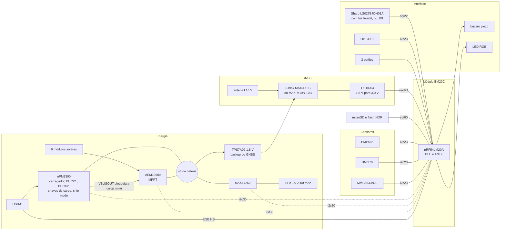
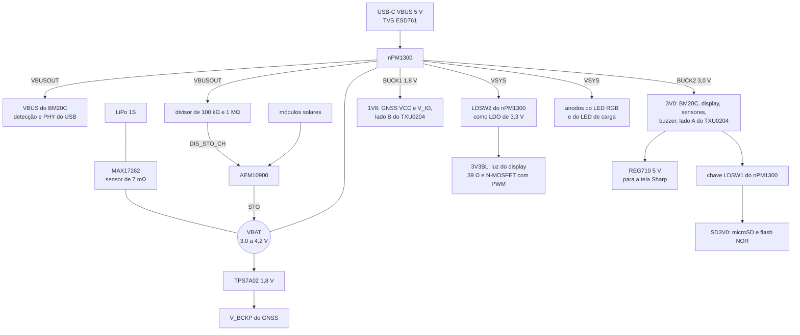
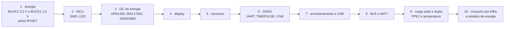

# Arquitetura de hardware da placa nova

Especificação técnica preliminar da placa própria do GNSS Bike Computer: decisões, arquitetura, alimentação, componentes principais, barramentos, alocação de pinos, placa de circuito impresso, empilhamento mecânico, regras de layout e bring-up. A pesquisa de mercado e as alternativas estão em [13-placa-nova.md](13-placa-nova.md); a avaliação que escolheu cada componente, em [15-avaliacao-componentes.md](15-avaliacao-componentes.md); o aparelho desenhado, em [Como fica o aparelho](13-placa-nova.md#como-fica-o-aparelho).

> [!IMPORTANT]
> Especificação de conceito, anterior ao esquemático. O **devicetree da placa já existe e compila** (`zephyr_app/boards/gnss/gnssbike/`, alvo `gnssbike/nrf54lm20a/cpuapp`), mas nenhum componente foi montado nem medido. Tensões, correntes e endereços vêm dos datasheets citados em [Referências](#referências); potências médias e autonomia são estimativas de [13](13-placa-nova.md#orçamento-de-energia).

**Nesta página:** [Estado das decisões](#estado-das-decisões) · [Arquitetura](#arquitetura) · [Alimentação](#alimentação) · [Componentes principais](#componentes-principais) · [GNSS](#gnss) · [Barramentos e endereços](#barramentos-e-endereços) · [Alocação de pinos](#alocação-de-pinos) · [Placa de circuito impresso](#placa-de-circuito-impresso) · [Empilhamento mecânico](#empilhamento-mecânico) · [Regras de layout](#regras-de-layout) · [Teste e bring-up](#teste-e-bring-up) · [Pendências](#pendências) · [Referências](#referências)

## Estado das decisões

| Bloco | Escolha | Estado | Como fechar |
|---|---|---|---|
| MCU e rádio | nRF54LM20A no módulo Fanstel BM20C (antena em chip) | MCU decidido; módulo conferido na ficha Draft 0.99 ([19](19-lista-de-compras.md#mcu-e-rádio)) | tolerância do cristal de 32,768 kHz, que a ficha não dá (o ANT exige no máximo ±50 ppm), e o lote: nenhum em estoque na DigiKey, 1.000 previstos para 12/11/2026 |
| Pilha de rádio | BLE do NCS v3.3.0 e ANT do `sdk-ant` v2.1.1 | decidido | — |
| Display | Sharp LS027B7DH01A (MIP monocromático, 2,7", 400 × 240, 5 V) com o filme de luz frontal Azumo 11103-06_A1; a placa aceita também o JDI LPM027M128C (MIP de 8 cores, 3,0 V) no mesmo conector | validado para compra ([19](19-lista-de-compras.md#display)); o JDI saiu da lista por falta de canal autorizado | voltar à cor é decisão do dono: amostras do JDI de revendedores ou outra tela ([19](19-lista-de-compras.md#antes-de-fechar-o-pedido)) |
| Painéis solares | 6 módulos de 3 células de 23 × 8 mm (classe ANYSOLAR KXOB25-05X3F) na frente inclinada e nos chanfros laterais | arranjo decidido | fixação, janela e vedação na mecânica |
| GNSS | u-blox MAX-F10S (L1 + L5, sem modo econômico) no footprint MAX, que aceita também o MAX-M10N-10B (L1, com LEAP) | recomendado ([15](15-avaliacao-componentes.md#gnss)) | protótipo: C/N0 por banda, trajeto, consumo e isolamento da antena; A/B com o M10N no mesmo footprint |
| Carga e medição | nPM1300 (USB e reguladores), AEM10900 (solar), MAX17262 (medidor na célula); o USB bloqueia o solar no hardware | recomendado ([15](15-avaliacao-componentes.md#carga-usb-c-e-painel-solar)) | bancada com as placas de avaliação do nPM1300 e do AEM10900 e o MAX17262 na mesma célula |
| Bateria | LiPo de 1 célula, 2000 mAh, 60 × 36 × 7 mm, com proteção (PCM) e dois NTC de 10 kΩ | recomendado | especificação com o fornecedor do pack (dois NTC, UN38.3) |
| Sensores | BMP585, BMI270, MMC5633NJL, OPT3001 | validado para compra ([19](19-lista-de-compras.md#sensores)); o LSM6DSV16X e o LIS2MDL saíram por falta de estoque | o footprint do IMU aceita o LSM6DSV16X quando ele voltar |
| Armazenamento | microSD (Hirose DM3AT-SF-PEJM5) e **MX25R6435F** (NOR SPI de 8 MB) no `spi00` no protótipo; só a NOR no produto | ficha lida e comparada com a Winbond W25Q128JV ([15](15-avaliacao-componentes.md#armazenamento)) | confirmar preço e estoque; o FatFs sobre flash já compila e roda no DK, que traz a mesma peça |
| USB | USB-C IPX8 Molex 2036150003 (o Amphenol 12402484E512A fica de alternativa até o desenho), ESD761 no VBUS e TPD4E05U06 nos dados e no CC, USB High Speed | validado ([19](19-lista-de-compras.md#usb)) | placa de 0,8 mm, anel e furo na parede pelo desenho da Molex |

O display é um LCD de memória refletivo (MIP), legível ao sol como o e-paper, e não e-paper: o e-paper colorido leva de 11 a 20 s por quadro em cor e gasta cerca de 144 mJ por atualização, contra menos de 0,2 s e cerca de 30 µJ do MIP, e o aparelho redesenha dados a cada segundo ([13](13-placa-nova.md#display)).

## Arquitetura

## Alimentação

### Árvore

| Trilho | Fonte | Tensão | Limite da fonte | Cargas | Observação |
|---|---|---|---|---|---|
| VBUS | USB-C | 4,0 a 5,5 V (o nPM1300 tolera 22 V em transitório) | limite de entrada do nPM1300, de 100 mA a 1,5 A | nPM1300; pela saída VBUSOUT, o VBUS do BM20C e o divisor do DIS_STO_CH do AEM10900 | o USB do nRF54LM20A exige 5 V no pino VBUS além do VDD; a VBUSOUT tem proteção contra sobretensão e subtensão |
| VBAT | célula, através do MAX17262 | 3,0 a 4,2 V | proteção do pack | VBAT do nPM1300, STO do AEM10900, entrada do TPS7A02 | nenhuma carga da aplicação direto no VBAT: o datasheet do nPM1300 proíbe |
| VSYS | saída do power path do nPM1300 | VBAT; com USB, a tensão do VBUS, até 5,5 V (o limitador de entrada não regula o VSYS) | limite de entrada do VBUS | BUCK1, BUCK2, LDSW2, anodos do LED RGB e do LED de carga | nenhuma fonte externa no VSYS: o datasheet proíbe |
| 3V0 | BUCK2 do nPM1300 | 3,0 V | 200 mA | BM20C, display (VDD e VDDA), sensores, buzzer, I2C_VDD do AEM10900, lado A do TXU0204, entrada da LDSW1 | tensão de partida pelo RVSET2 de 150 kΩ (tolerância de 5 % no máximo): a tabela do VSET1 não tem 3,0 V, a do VSET2 tem (tabelas 18 e 19 do datasheet); o MCU depende dele para ligar |
| 1V8 | BUCK1 do nPM1300 | 1,8 V | 200 mA | VCC e V_IO do módulo GNSS, lado B do TXU0204 | filtro LC (ferrite e 10 µF) junto do módulo; ripple abaixo de 50 mV; partida pelo RVSET1 de 47 kΩ; o devicetree trava o BUCK1 em 1,8 V, porque o V_IO do módulo tem máximo absoluto de 1,98 V e o registrador aceitaria até 3,3 V; a rampa do V_IO fica entre 25 e 35.000 µs/V; o firmware manda `UBX-RXM-PMREQ` antes de desligar o trilho |
| SD3V0 | chave LDSW1 do nPM1300, a partir do 3V0 | 3,0 V | 100 mA | microSD e flash NOR | 22 µF junto do soquete; a NOR gasta dezenas de miliampères apagando e microampères em deep power-down, e fica atrás da chave junto do cartão |
| 3V3BL | LDSW2 do nPM1300 como LDO, a partir do VSYS | 3,3 V | 50 mA | luz do display: 10 mA no filme da Sharp, 16 mA no JDI | ligado só com a luz acesa; entrada de 2,6 V ao VSYS; com o VBAT abaixo de cerca de 3,4 V o LDO sai de regulação e a luz enfraquece; a corrente depende da tensão do LED, medida na amostra |
| VBCKP | TPS7A02, a partir do VBAT | 1,8 V | 200 mA, 25 nA de consumo próprio | V_BCKP do GNSS (28 µA em backup de hardware no F10S) | mantém efemérides e relógio do GNSS em ship mode, para partidas a quente |
| 5V0 | TI REG710NA-5/3K, a partir do 3V0, com o EN num pino do MCU | 5,0 V | 30 mA | VDD e VDDA da Sharp LS027B7DH01A | montado com a Sharp, a tela da lista de compras; o EN corta os 65 µA do REG710 com a tela desligada; o JDI tem máximo absoluto de 3,6 V e queima com 5 V ([15](15-avaliacao-componentes.md#display)) |

Pico estimado no 3V0: rádio a +8 dBm (10,9 mA), CPU (2,6 mA), sensores (cerca de 1 mA), buzzer e o armazenamento pela LDSW1 (até 100 mA), perto de 120 mA contra os 200 mA do BUCK2. A luz do display (até 16 mA) sai da LDSW2, e o LED RGB (até 6 mA), do VSYS. No 1V8, o MAX-F10S consome 21 mA de VCC e 3 mA de V_IO na aquisição e 16 mais 3 mA em rastreio, medidos a 3,0 V (26 mA no total a 1,8 V); o MAX-M10N-10B, até 16 mA de VCC e 3,7 mA de V_IO na aquisição. Os dois podem puxar até 100 mA de pico na partida, segundo as fichas.

### Carga

| Caminho | Parâmetros | Origem |
|---|---|---|
| USB (nPM1300) | 600 mA de carga (0,3C da célula de 2000 mAh; o chip vai de 32 a 800 mA); término em 4,20 V, ou 4,10 V para vida longa; JEITA com o NTC do pack (0, 10, 45 e 60 °C, os padrões dos registradores); CC1 e CC2 ligados direto ao conector, com os resistores Rd internos do nPM1300 | datasheet do nPM1300 |
| Solar (AEM10900) | MPPT a 80 % da tensão em aberto (pinos R_MPP no VINT); indutor de 4,7 µH (TDK VLS252012HBX-4R7M-1): no modo de alta potência, que vem ligado, a tabela 6 do datasheet dá 65,5 mA de entrada com 6,8 µH e 175,5 mA com 3,3 µH, e a fórmula da seção 6.7.2 dá 85 mA com 6,8 µH (os dois números não batem: pergunta à e-peas); o arranjo chega a cerca de 88 mA ao meio-dia, e 4,7 µH dá de 95 a 123 mA pelas duas contas; o footprint aceita 6,8 µH, o valor das curvas de rendimento, e 3,3 µH; limiar de carga de 3,90 V pelos pinos (perfil Li-ion long life) e cerca de 4,05 V por I2C com a placa ligada (com o keep-alive, o valor por I2C persiste, e o firmware volta a 3,90 V antes do ship mode); corte fora de 0 a 45 °C por um segundo NTC na célula (do pack, ou SMD na face de trás da placa, sob ela); carga bloqueada pelo DIS_STO_CH enquanto houver VBUS | datasheet do AEM10900 e [15](15-avaliacao-componentes.md#carga-usb-c-e-painel-solar) |
| Medição (MAX17262) | corrente líquida de todas as fontes, inclusive a do painel com a placa desligada, pelo sensor de 7 mΩ entre BATT e SYS (1,7 A contínuos); 5,2 µA em hibernação; temperatura pelo sensor interno (TH no BATT) | datasheet do MAX17262 |

### Estados de energia

| Estado | O que fica ligado | Consumo na célula | Entrada | Saída |
|---|---|---|---|---|
| Desligado (ship mode) | MAX17262 em hibernação, TPS7A02 e o backup do GNSS; o AEM10900 continua carregando com sol, sozinho, até 3,90 V | cerca de 34 µA (370 nA do nPM1300, 5,2 µA do MAX17262, cerca de 0,2 µA do AEM10900, 25 nA do TPS7A02 e 28 µA do backup do MAX-F10S, valor da ficha a 3,3 V; 34 µA com o MAX-M10N); sem o backup do GNSS, cerca de 6 µA | `UBX-RXM-PMREQ` ao GNSS e `regulator_parent_ship_mode()` pelo `power_scheduler` ou pelo menu | botão no pino SHPHLD ou VBUS |
| Ligado | todos os trilhos | cerca de 58 mW no uso típico (estimativa de [13](13-placa-nova.md#orçamento-de-energia)) | — | — |
| Ligado com USB | todos os trilhos, carga pelo nPM1300 | — | VBUS | o nPM1300 não entra em ship mode com VBUS presente: o firmware desliga os trilhos e põe o MCU em System OFF |

## Componentes principais

| Função | Peça | Encapsulamento | Dados principais | Driver no NCS v3.3.0 | Estado |
|---|---|---|---|---|---|
| MCU e rádio | Fanstel BM20C (nRF54LM20A) | módulo LGA de 10,0 × 16,2 × 2,0 mm (tabela e desenho da ficha Draft 0.99 e biblioteca Eagle da Fanstel; o texto da ficha e a página ainda dizem 14,8 mm); 90 pads redondos com passo de 0,889 mm e 10 na borda | Cortex-M33 de 128 MHz, 2036 KB de RRAM e 512 KB de RAM; 66 GPIO; USB High Speed (D− em G6, D+ em G7, VBUS de 4,4 a 5,5 V em H7); cristal de 32 MHz com ±20 ppm e de 32,768 kHz sem tolerância na ficha; FCC ID X8WBM20C, ISED 4100A-BM20C, TELEC R201-260622 e conformidade europeia | NCS e `sdk-ant` | conferido; no máximo 2 refusões, com o lado do módulo por último; sem estoque na DigiKey até 12/11/2026 |
| Display | Sharp LS027B7DH01A | 62,8 × 42,82 × 1,625 mm, FPC de 10 vias | monocromático, 400 × 240; VDD e VDDA de 5 V; entradas de 3,0 V (VIH a partir de 2,7 V); 50 µW parado e 175 µW a 1 quadro/s | o driver do port e o driver próprio da interface ([18](18-interface-telas.md#framework)) | validado; a tela da lista de compras |
| Luz frontal | Azumo 11103-06_A1 | filme de 0,05 mm laminado sobre a tela, com um LED e cauda de 4 vias | 10 mA típicos, 25 mA no máximo | PWM | validado; confirmar com a Azumo o uso sobre a 01A |
| Display alternativo | JDI LPM027M128C | 61,8 × 40,08 × 1,39 mm, FPC de 10 vias na mesma ordem | 400 × 240, 8 cores, 3,0 V, SPI até 2 MHz, 5 µW parado e 30 µW a 1 quadro/s; luz de 16 mA a 2,67 V | driver próprio ([18](18-interface-telas.md#framework)) | sem canal autorizado de compra; previsto no mesmo conector |
| Conector do display | Hirose FH28-10S-0.5SH(05) | FPC de 10 vias, passo de 0,5 mm, contato por baixo, 2,55 mm de altura | citado na ficha do JDI e na ficha atual da Sharp (tabela 8-2-1); com a FPC dobrada, um de contato duplo (Hirose FH34SRJ-10S-0.5SH(50)) | — | validado |
| Conector do filme de luz | Molex 5034800440 | FPC de 4 vias, passo de 0,5 mm | a Azumo indica a série 503480 | — | validado |
| Bomba de carga de 5 V | TI REG710NA-5/3K (a mesma da V3) | SOT-23-6 | 30 mA, 65 µA parado; 0,22 µF de bombeamento e 10 µF na entrada e na saída, como na V3; EN num pino do MCU | — | validado |
| GNSS | u-blox MAX-F10S (o MAX-M10N-10B no mesmo footprint) | LCC de 10,1 × 9,7 × 2,5 mm | L1 **e L5**: GPS, Galileo, BeiDou, QZSS, NavIC e SBAS; 46,8 mW a 1,8 V em rastreio (16 mA no VCC e 3 mA no V_IO a 3,0 V), sem modo econômico; SAW, LNA e SAW, com figura de ruído de 3,5 dB em L1 e 3,0 dB em L5; ROM; MSL 4; ver [GNSS](#gnss) | driver próprio do port, `u-blox,max-f10` | recomendado |
| Antena GNSS | TE L000670-01 (protótipo) | chip de 14 × 10,75 × 1 mm, na borda | L1 e L5 numa alimentação: 66 % e 56 % de eficiência num plano de 90 × 41 mm; a eficiência cai com planos menores (gráfico da ficha), e a placa tem 55 mm de largura | — | recomendado para o protótipo; medir na placa de avaliação L000670-80 |
| Tradutor de nível | TI TXU0204 | VQFN-14 de 3,0 × 2,5 mm no protótipo (há UQFN-12 de 2,0 × 1,7 mm) | 4 canais de direção fixa, 2 em cada sentido, 1,1 a 5,5 V de cada lado, 2,5 µA; saídas em alta impedância com qualquer VCC abaixo de 100 mV; pull-down interno de 5 MΩ nas entradas | — | recomendado |
| PMIC | Nordic nPM1300 | QFN32 de 5 × 5 mm | carregador de 32 a 800 mA, 2 bucks de 200 mA, 2 LDO de 50 mA ou chaves de 100 mA, ship mode de 370 nA, VBUSOUT, detecção USB-C | `nordic,npm1300*` | recomendado |
| Indutores dos bucks | Murata DFE201610E-2R2M=P2 (ou TDK TFM201610ALM-2R2MTAA), 2,2 µH | 2,0 × 1,6 × 1,0 mm (0806) | 140 mΩ e 2,4 A de saturação; a lista de referência do nPM1300 pede DCR abaixo de 400 mΩ e mais de 350 mA de saturação | — | validado |
| LED de carga | Kingbright APT1608SURCK no LED1 do nPM1300, anodo no VSYS | 0603 | 5 mA, 1,82 V; o LED1 sai de fábrica como indicador de carga e acende sem firmware | — | validado |
| Medidor de carga | Analog Devices MAX17262 | WLP de 9 pinos, 1,5 × 1,5 mm, passo de 0,4 mm | sensor interno de 7 mΩ entre BATT e SYS, 1,7 A contínuos, ModelGauge m5 EZ, 5,2 µA em hibernação | `maxim,max17262` | recomendado |
| Carregador solar | e-peas AEM10900 (10AEM10900C0002) | QFN28 de 4 × 4 × 0,8 mm | MPPT de 120 mV a 2,73 V, partida a frio com 250 mV, entrada máxima de 65,5 mA com 6,8 µH e de 175,5 mA com 3,3 µH (tabela 6), I2C, NTC, medidor de energia | não há | recomendado; fora da DigiKey (Mouser ou e-peas); validar a carga dupla |
| Indutor do harvester | TDK VLS252012HBX-4R7M-1 (4,7 µH); o VLS252012HBX-6R8M-1 (6,8 µH) para a bancada | 2,5 × 2,0 × 1,2 mm | 1,4 A de saturação e 240 mΩ (o de 6,8 µH: 0,94 A e 372 mΩ); o datasheet pede pico de pelo menos 1 A com 3,3 µH, e menos com indutância maior | — | validado |
| Módulos solares | ANYSOLAR KXOB25-05X3F (6 unidades) | 23 × 8 × 1,8 mm | 3 células, 2,07 V em aberto, 30,7 mW e 18,4 mA a 1 sol | — | recomendado |
| Bateria | LiPo de 1 célula, 2000 mAh | 60 × 36 × 7 mm | proteção (PCM), dois NTC de 10 kΩ (B3380), um para o nPM1300 e outro para o AEM10900 | — | a especificar com o fornecedor |
| LDO do backup do GNSS | TI TPS7A0218PDQNR (1,8 V) | X2SON de 1 × 1 mm | 25 nA de consumo próprio, 1,5 a 6,0 V de entrada, 200 mA; 1 µF na entrada e na saída (pelo menos 0,5 µF efetivos); EN ligado ao IN | — | validado |
| Barômetro | Bosch BMP585 | LGA de 3,25 × 3,25 × 1,96 mm | ruído abaixo de 0,1 Pa RMS, ±0,5 Pa/K, 1,3 µA a 1 Hz, tampa metálica | `bosch,bmp581` (chip ID 0x51 aceito, não testado) | recomendado |
| IMU | Bosch BMI270 (o footprint aceita o ST LSM6DSV16X) | LGA-14 de 2,5 × 3,0 × 0,83 mm | acelerômetro e giroscópio, despertar por movimento; 685 µA com os dois ligados e 10 µA só com o acelerômetro em baixo consumo; sem a fusão interna do LSM6DSV16X | `bosch,bmi270` (gatilhos de dado pronto e de movimento) | validado; o LSM6DSV16X está sem estoque |
| Magnetômetro | Memsic MMC5633NJL | WLP de 0,85 × 0,85 × 0,4 mm | I2C em 0x30 e I3C; o endereço 0x7E no barramento o põe em I3C até faltar energia | `memsic,mmc56x3` (o ID 0x10 do registrador 0x39 confere) | validado; montagem por estêncil e forno, como o MAX17262 |
| Luz ambiente | TI OPT3001 | USON de 2,0 × 2,0 × 0,65 mm | 0,01 a 83 mil lux, 1,8 µA, 1,6 a 3,6 V | `ti,opt3001` | recomendado |
| microSD (protótipo) | Hirose DM3AT-SF-PEJM5 | soquete de 1,68 mm de altura | push-push com detecção de cartão; o DM3CS-SF, com tampa e dobradiça, se a vibração pedir | `zephyr,sdhc-spi-slot` | validado para o protótipo |
| Armazenamento soldado | **Macronix MX25R6435F** (NOR SPI de 8 MB) | 8-WSON, 8-SOP 200 mil ou 8-USON | 1,65 a 3,6 V; 2,2 mA lendo a 33 MHz, 3,1 mA apagando (58 ms o setor de 4 KB), **7 nA em deep power-down**; 100 mil ciclos; −40 a 85 °C (ficha rev. 1.6) | `jedec,spi-nor` com `zephyr,flash-disk` e FatFs, a mesma peça do nRF54LM20 DK, com `mxicy,mx25r-power-mode` | escolhida em 2026-09-20 ([15](15-avaliacao-componentes.md#armazenamento)); alternativa pino a pino: Winbond W25Q128JV de 16 MB |
| USB-C | Molex 2036150003 (alternativa Amphenol 12402484E512A) | receptáculo IPX8, SMT, 16 pinos | USB 2.0; anel de vedação de silicone incluso, que passa da borda da placa (a borda fica 2,73 mm atrás da frente do conector); furo de 9,54 × 3,76 mm em parede de pelo menos 1,2 mm; placa recomendada de 0,8 mm | — | validado |
| ESD | TI ESD761DPYR no VBUS e TPD4E05U06DQAR nos dados e no CC | X1SON de 1,0 × 0,6 mm e USON-10 de 2,5 × 1,0 mm | VBUS: não conduz até ±24 V, 1,1 pF; dados e CC: 0,5 pF e ±12 kV | — | validado; o ESD751, da mesma família em SOD-523, está sem estoque até 27/11/2026 |
| Buzzer | Same Sky CPT-1117-83-SMT-TR | 11 × 9 × 1,7 mm | piezo de 4,1 kHz, 83 dB a 10 cm com 5 Vpp; em ponte por dois PWM em alta corrente (6 Vpp) | PWM | validado |
| LED | Kingbright APTF1616SEEZGKQBKC (RGB, anodo comum) | 1,6 × 1,6 × 0,9 mm | anodo no VSYS, um N-MOSFET e um resistor de 1 kΩ por cor; a 2 mA, 1,83 V no vermelho e 2,66 V no verde e no azul | `pwm-leds` | validado |
| Botões | Omron B3S-1002P (alternativa E-Switch TL3780AF240QG) | 6 × 6 × 4,3 mm | IP67; o central vai só ao SHPHLD do nPM1300, os outros dois a pinos do MCU com despertar | GPIO e eventos do nPM1300 | validado; o acabamento sai da mecânica |
| Luz do display | Diodes DMG1012T-7 e resistor de 39 Ω, pela LDSW2 em 3,3 V | SOT-523 | 10 mA no filme da Sharp e 16 mA no JDI, com PWM; 0,5 Ω com 2,5 V na porta | PWM | validado; resistor ajustado na amostra |
| Conector da bateria | JST GH de 6 vias (SM06B-GHS-TB; cabo GHR-06V-S com terminais SSHL-002T-P0.2) | passo 1,25 mm, 4,25 mm de altura | VBAT e GND em dois contatos cada (1 A por contato) e os dois NTC; trava positiva, que o JST SH não tem | — | validado; ao lado da célula, fora da área dela |

## GNSS

Os números desta seção vêm da ficha do **MAX-F10S**, UBXDOC-963802114-12732 R03 (tabelas 2, 12, 13, 15, 16 e 17), e da descrição de interface do F10 SPG 6.00, UBX-23002975 R02.

- **Módulo:** u-blox MAX-F10S, L1 e L5 ao mesmo tempo, sempre em potência plena: a firmware do F10 não tem o grupo `CFG-PM`, ou seja, não existe LEAP nem economia de rastreio, e a peça não faz banda única. O MAX-M10N-10B (só L1, com LEAP) é pino a pino e fica como alternativa econômica ([15](15-avaliacao-componentes.md#gnss)).
- **Footprint único:** o MAX-F10S, o MAX-M10N e o MAX-M10S têm a mesma pinagem de alimentação, UART, RESET_N, EXTINT, TIMEPULSE, VIO_SEL e RF_IN (tabela 10 de cada ficha). Os pinos 16 e 17 do F10S são SDA e SCL, mas a seção 5 da ficha diz que o receptor só se comunica pela UART; no M10N eles são reservados. A placa não usa nenhum dos dois.
- **Alimentação:** VCC de 1,76 a 3,6 V; V_IO nunca acima do VCC (com VIO_SEL em GND, de 1,76 a 1,98 V). A placa usa VCC e V_IO em 1,8 V, pelo BUCK1, com o TXU0204 entre os domínios de 1,8 V e 3,0 V: o F10S gasta 46,8 mW a 1,8 V contra 57 mW a 3,0 V (o M10N em LEAP, 13,7 contra 16,8 mW). Com o VIO_SEL em GND, o V_IO e os pinos digitais têm máximo absoluto de 1,98 V: o devicetree trava o BUCK1 em 1,8 V. A rampa do V_IO fica entre 25 e 35.000 µs/V (máximo absoluto, tabela 12). Alternativa sem tradutor: módulo inteiro em 3,0 V, pelo BUCK2, com o VIO_SEL aberto.
- **Corrente:** 26 mA no 1V8 em rastreio e 34 mA na aquisição (16 e 21 mA no VCC mais 3 mA no V_IO a 3,0 V, tabelas 15 e 16), contra 7,6 mA do M10N em LEAP; pico de até 100 mA na partida, nos dois. O BUCK1 entrega 200 mA.
- **Desligar:** com V_IO em 1,8 V e o backup alimentado, a ficha pede desligar o V_IO 100 ms antes do VCC ou mandar `UBX-RXM-PMREQ` antes (seção 4.2 da ficha do F10S, com o mesmo texto da do M10N). Como os dois saem do BUCK1, o firmware manda o `UBX-RXM-PMREQ` (com backup e force, acordando pela linha RX) antes de desligar o trilho ou de entrar em ship mode; o driver corta o trilho sozinho quando o nó do receptor tem `vcc-supply` ([05](05-arquitetura-zephyr.md#receptor-gnss)).
- **Configuração:** por `UBX-CFG-VALSET` nas camadas RAM e BBR, porque o standby por software apaga a RAM do receptor, inclusive a configuração; com o V_BCKP segurando a BBR, ele volta configurado. As chaves da UART, da taxa, do modelo dinâmico e da saída de mensagens têm os mesmos IDs nas duas firmwares. **Sem `CFG-PM`:** no F10S não há modo de energia para configurar. O grupo `CFG-SIGNAL` ganha `GPS_L5_ENA`, `GAL_E5A_ENA`, `BDS_B2A_ENA`, `QZSS_L5_ENA` e o NavIC, e toda escrita nele reinicia o subsistema GNSS: o driver manda as nove chaves num quadro só e espera 0,5 s depois do reconhecimento (seção 4.9.20).
- **Sinais:** RXD e EXTINT do MCU para o módulo; TXD e TIMEPULSE do módulo para o MCU, pelos quatro canais do TXU0204, com o OE fixo no VCCA. O RESET_N (ativo baixo, pelo menos 1 ms) vem de um pino do MCU em dreno aberto, que só puxa para baixo e dispensa o tradutor. O TIMEPULSE divide o pino com o SAFEBOOT_N por 1 kΩ interno, e o módulo entra em safeboot se o pino estiver baixo na partida: nada de pull-down externo nessa linha. Sem LEAP, o TIMEPULSE do F10S não tem a limitação da SPG 5.30 e serve para medir o LFCLK do BM20C.
- **Backup:** V_BCKP de 1,65 a 3,6 V; **28 µA** em backup de hardware (tabela 17, V_BCKP em 3,3 V) e cerca de 3 µA em operação normal, pelo TPS7A02. Em standby de software, 46 µA no V_IO a 3,3 V e 120 nA no VCC. Sem flash no módulo, as efémerides só sobrevivem na BBR: o V_BCKP deixa de ser conforto e vira o que segura a partida a quente.
- **Entrada de RF:** o MAX-F10S tem SAW, LNA e SAW internos e dispensa filtro externo, com figura de ruído de 3,5 dB em L1 e 3,0 dB em L5 (tabela 13); um MAX-M10S ou um MAX-M10N-00B (LNA antes do SAW) pediria um SAW externo. **Atenção:** a tabela 12 do F10S dá um único máximo absoluto de **0 dBm** no RF_IN, sem a exceção de +15 dBm fora da banda que a ficha do M10N-10B traz. Com o BLE e o ANT+ a +8 dBm a centímetros da antena, quem tem de manter o nível abaixo de 0 dBm é o isolamento entre as duas antenas: meça o S21 em 2,44 GHz no protótipo **antes de ligar o rádio na potência cheia**, e se ficar apertado, baixe a potência de transmissão ou ponha um filtro de rejeição de 2,4 GHz na entrada. O bloqueio (queda de C/N0 com o rádio transmitindo) se mede junto.
- **Antena:** a TE L000670 na borda de cima da placa, com área livre em todas as camadas e rede de casamento em π. Com o F10S, L5 deixa de ser opção: a antena precisa casar nas duas bandas desde o protótipo, e a eficiência dela em L5 é de 56 % contra 66 % em L1 num plano de 90 × 41 mm, enquanto a placa tem 55 mm. Numa segunda versão, elementos de L1 e L5 na parede da caixa com contatos de mola e um diplexador na RF_IN, como no [desenho](13-placa-nova.md#como-fica-o-aparelho) e nos produtos do mercado ([13](13-placa-nova.md#antena-gnss-dentro-da-caixa)).
- **Caracterização no protótipo:** o F10S na caixa real, com C/N0 **por banda**, ruído na banda (`UBX-MON-SPAN`), partida a frio e a quente, trajeto em cidade e em mata contra uma referência, e consumo no PPK2. O MAX-M10N-10B entra no mesmo footprint para o A/B de autonomia contra precisão, que é o que decide se a troca se paga.

## Barramentos e endereços

| Barramento | Instância | Velocidade | Nível | Dispositivos (endereço de 7 bits) | Observação |
|---|---|---|---|---|---|
| I2C dos sensores | `i2c23` | 400 kHz | 3,0 V, pull-ups de 4,7 kΩ | BMP585 0x47 (SDO no VDDIO; 0x46 com SDO em GND), BMI270 0x68 (SDO em GND; um LSM6DSV16X no mesmo footprint responde em 0x6A), MMC5633NJL 0x30 (fixo), OPT3001 0x44 (ADDR em GND) | sem conflito; o firmware nunca varre o barramento, porque o endereço 0x7E põe o MMC5633NJL em I3C |
| I2C de energia | `i2c30` | até 400 kHz | 3,0 V | nPM1300 0x6B (fixo), MAX17262 0x36 (fixo), AEM10900 0x41 (I2C_ADDR em I2C_VDD; 0x40 em GND) | sem conflito; com o keep-alive, a configuração por I2C do AEM10900 continua valendo com o 3V0 desligado, e o firmware volta aos pinos antes do ship mode |
| SPI do armazenamento | `spi00` | 8 MHz | 3,0 V | só a flash NOR MX25R6435F, num chip select (P2.05) | o devicetree fixa `spi-max-frequency = <8000000>`, que é o que a MX25R6435F aceita no modo de baixo consumo; o soquete de cartão saiu da placa em 2026-09-20 |
| SPI do display | `spi22` | 2 MHz (máximo do display) | 3,0 V | Sharp LS027B7DH01A ou JDI LPM027M128C | CS ativo alto |
| UART do GNSS | `uart21` | 38400 baud, o valor de fábrica do F10 e do M10 (`CFG-UART1-BAUDRATE`; padrões de configuração da UBX-23002975 R02): a 1 Hz são cerca de 360 B/s de `UBX-NAV-PVT` e `UBX-NAV-SAT` contra 3.840 B/s. A banda dupla não muda a conta: o `UBX-NAV-SAT` tem 8 + 12 bytes **por satélite**, não por sinal (seção 3.14.13.1) | 3,0 V no MCU, 1,8 V no módulo | u-blox MAX | pelo TXU0204 |
| USB | USBHS | 480 Mbit/s | par diferencial de 90 Ω | USB-C | VBUS do nRF pela VBUSOUT do nPM1300 |
| PWM | `pwm20` a `pwm22` | — | 3,0 V | luz do display, EXTCOMIN, LED RGB (3), buzzer (2) | — |

## Ligações fixas dos CIs

Pinos de configuração e ligações que a validação ([19](19-lista-de-compras.md#correções-de-integração)) conferiu nas fichas.

| CI | Pino | Ligação | Por quê |
|---|---|---|---|
| nPM1300 | VSET1 | 47 kΩ ao GND (5 % no máximo) | BUCK1 parte em 1,8 V (tabela 18) |
| nPM1300 | VSET2 | 150 kΩ ao GND (5 % no máximo) | BUCK2 parte em 3,0 V (tabela 19); nenhum VSET pode ficar aberto |
| nPM1300 | LSIN1 e LSOUT1 | entrada no 3V0, saída no SD3V0 | chave de 100 mA do armazenamento |
| nPM1300 | LSIN2 e LSOUT2 | entrada no VSYS, saída no 3V3BL | LDO de 3,3 V da luz do display |
| nPM1300 | SHPHLD | botão central ao GND, sem outra ligação | pull-up interno de 50 kΩ; o MCU sabe do botão pelo GPIO3; mais de 10 s pressionado religa o sistema |
| nPM1300 | GPIO3 | interrupção para o MCU | eventos do botão, do carregador e do VBUS |
| nPM1300 | CC1 e CC2 | direto ao conector, com o TPD4E05U06 | Rd interno |
| nPM1300 | NTC | NTC do pack | JEITA |
| nPM1300 | LED1 | catodo do LED de carga, anodo no VSYS | acende carregando, sem firmware |
| nPM1300 | VBUSOUT | VBUS do BM20C (H7) e divisor do DIS_STO_CH | detecção e PHY do USB |
| AEM10900 | STO_CFG[2], STO_CFG[1], STO_CFG[0] | VINT, GND, VINT | carga até 3,90 V e corte em 3,01 V |
| AEM10900 | R_MPP[2:0] e T_MPP[1:0] | VINT | MPPT a 80 % da tensão em aberto e tempo padrão |
| AEM10900 | KEEP_ALIVE | VINT | mantém a configuração por I2C |
| AEM10900 | I2C_ADDR | I2C_VDD | endereço 0x41 |
| AEM10900 | DIS_STO_CH | VBUSOUT por 100 kΩ, com 1 MΩ ao GND | o USB presente bloqueia a carga solar |
| AEM10900 | TH_REF e TH_MON | RDIV de 22 kΩ e o NTC na face de trás, sob a célula | corte fora de 0 a 45 °C |
| MAX17262 | TH | BATT | temperatura pelo sensor interno; o firmware grava ETHRM = 0 |
| MAX17262 | REG | 0,47 µF ao GND | regulador interno de 1,8 V, sem carga |
| MAX17262 | ALRT | pull-up de 10 kΩ, para o MCU | dreno aberto |
| MAX-F10S | VIO_SEL | GND | V_IO de 1,8 V |
| MAX-F10S | TIMEPULSE (SAFEBOOT_N) | sem pull-down | nível baixo na partida põe o módulo em safeboot |
| MAX-F10S | RESET_N | pino do MCU em dreno aberto | pull-up interno do módulo |
| MAX-F10S | V_BCKP | saída do TPS7A02 | efemérides e relógio em ship mode; sem flash no módulo, é o que segura a partida a quente |
| TXU0204 | OE | VCCA | o Ioff-float isola o módulo desligado |
| TPS7A02 | EN | IN | sempre ligado |
| BMI270 ou LSM6DSV16X | 1 (SDO ou SA0) | GND | 0x68 no BMI270, 0x6A no LSM6DSV16X |
| BMI270 ou LSM6DSV16X | 2 e 3 | VDDIO | a Bosch proíbe GND |
| BMI270 ou LSM6DSV16X | 10 e 11 | abertos | as duas fichas aceitam |
| BMI270 ou LSM6DSV16X | 12 (CS) | VDDIO | I2C |
| BMP585 | CSB | VDDIO | com o CSB baixo na partida, o I2C fica desligado até o próximo reset de energia |
| BMP585 | SDO | VDDIO | endereço 0x47 |
| MMC5633NJL | VDD | 4,7 µF junto do pino | a ficha pede pelo menos 2,2 µF |
| OPT3001 | ADDR | GND | endereço 0x44 |
| OPT3001 | INT | pull-up de 10 kΩ, para o MCU | dreno aberto |
| microSD | DAT1 e DAT2 | pull-up de 47 kΩ ao SD3V0 | reservados no modo SPI; a flash NOR usa WP e HOLD, que vão ao SD3V0 pelos mesmos resistores |
| Sharp ou JDI | EXTMODE | VDD da tela | VCOM pelo EXTCOMIN |
| REG710 | EN | pino do MCU | sequência de ligar da Sharp e corte dos 65 µA |
| BM20C | G6, G7 e H7 | D−, D+ e VBUSOUT | USB High Speed |

Com o SD3V0 desligado, os pinos do `spi00` ficam em nível baixo ou em alta impedância, para não alimentar o cartão e a flash pelos pinos.

## Alocação de pinos

Esta tabela **não é mais uma proposta**: é o que o devicetree da placa declara, em [`zephyr_app/boards/gnss/gnssbike/`](../zephyr_app/boards/gnss/gnssbike/) (o mapa dos pinos está em `gnssbike-pinctrl.dtsi` e o resto em `gnssbike_nrf54lm20a_cpuapp.dts`). O alvo `gnssbike/nrf54lm20a/cpuapp` compila; `python tools/fw/board_check.py` confere o mapa a cada mudança. **Falta uma conferência contra o BM20C**, e ela é mais estreita do que parece: a ficha Draft 0.99 do módulo, conferida na validação da [lista de compras](19-lista-de-compras.md), diz que ele expõe **64 GPIO** — todos os 66 do chip menos P1.20 e P1.21, que ficam com o cristal de 32,768 kHz ([15](15-avaliacao-componentes.md#módulo-do-mcu)). Os 31 pinos desta tabela estão todos fora desse par, de modo que **o mapa cabe no módulo**. O que ainda não foi levantado aqui é em qual pad LGA cada GPIO sai, que é o que o layout precisa para rotear — não o esquemático, que liga por nome de sinal.

| Função | Sinais | Periférico | Pino |
|---|---|---|---|
| Armazenamento | SCK, MOSI, MISO, CS da flash NOR | `spi00` e GPIO | SCK P2.01, MOSI P2.02, MISO P2.04, CS P2.05 |
| Display | SCK, MOSI, CS, DISP, EXTCOMIN, EN do REG710 | `spi22` e GPIO | SCK P3.03, MOSI P3.00, CS P3.02, DISP P3.05, EXTCOMIN P3.06, EN P3.07 |
| Display | luz frontal | `pwm20` | P3.08 |
| GNSS | TXD, RXD, RESET_N (o OE do tradutor fica fixo no VCCA) | `uart21` e GPIO | TX P1.04, RX P1.05, RESET_N P1.06 |
| GNSS | EXTINT e TIMEPULSE, ligados na placa e **reservados** | — | EXTINT P1.08, TIMEPULSE P1.09 |
| Sensores | SDA, SCL, INT do IMU, INT do barômetro | `i2c23` e GPIO | SDA P1.29, SCL P1.03, INT do BMI270 P1.10, INT do BMP585 P1.12 |
| Energia | SDA, SCL, interrupção do nPM1300 (GPIO3); o bloqueio da carga solar vem do VBUSOUT, sem pino do MCU | `i2c30` e GPIO | SDA P0.02, SCL P0.03, interrupção P0.00 |
| Botões | 3 entradas; o central também chega ao SHPHLD do nPM1300, que é o que liga o aparelho fora do ship mode | GPIO | esquerda P1.26, centro P1.27, direita P1.30 |
| LED RGB | 3 canais | `pwm22` | P1.16, P1.19, P1.22 |
| Buzzer | 2 canais em contrafase | `pwm21` | P1.25, P1.28 |
| Console | TX, RX em dois pads de teste | `uart20` | TX P1.00, RX P1.31 |
| Dedicados | USB (D+, D−, VBUS), SWD, cristais internos do módulo | — | — |

Total: **31 GPIO** dos 66 do chip, mais os dois reservados do GNSS. Sobram 31 livres, 12 deles pinos de clock; P1.20 e P1.21 ficam com o cristal de 32,768 kHz e P1.01 e P1.02 com os pads do NFC, que saem do reset sem GPIO.

### O que mudou do plano para a placa

Escrever o devicetree derrubou parte do plano anterior desta seção, que repetia os pinos do **nRF54LM20 DK**. Vale registrar, porque nenhum destes problemas aparecia no papel:

| Plano anterior | Placa | Por quê |
|---|---|---|
| console no `uart30`, com o I²C da energia no `i2c30` | console no `uart20` (P1.00 e P1.31) | **cada bloco serial do nRF54LM20A tem um periférico só**; `uart30` e `i2c30` são o mesmo bloco, e o silício recusa |
| I²C da energia com SDA P1.11 e SCL P1.14 | SDA P0.02 e SCL P0.03 | o bloco 30 mora na porta P0; P0.03 é pino de clock, como o SCL exige |
| interrupção do nPM1300 em P0.04 | P0.00 | — |
| EXTINT do GNSS em P1.07 e TIMEPULSE em P1.13 | P1.08 e P1.09 | P1.07 e P1.13 são pinos de clock: gastá-los com sinais que não precisam deles tira do `i2c` e do `spi` a única coisa que eles podem usar |
| botões em P1.26, P1.09 e P1.08 | P1.26, P1.27 e P1.30 | P1.08 e P1.09 passaram a ser o EXTINT e o TIMEPULSE: o plano tinha os dois no mesmo pino |
| INT1 do IMU em P3.04, mais um INT2 | INT do BMI270 em P1.10, INT do BMP585 em P1.12 | o driver usa uma interrupção só por peça, e P3.04 é pino de clock |
| microSD com CS em P2.03 e detecção de cartão | não existem | o soquete saiu em 2026-09-20; P2.03 fica livre para um overlay de protótipo |
| ALRT do MAX17262 e IRQ do AEM10900 | sem pino | nenhum dos dois drivers usa a linha; um pino que a firmware não alcança não entra no devicetree |
| EN do REG710 e luz do display sem pino | P3.07 e P3.08 | — |

Duas regras de pino do nRF54LM20A (ficha 4539_001 v1.0) mandam no mapa:

1. **Pinos de clock.** O SCL do TWIM e o SCK do SPIM só funcionam nos pinos de clock (tabela 79): P0.03, P0.04, P0.06, P0.07, P1.03, P1.04, P1.07, P1.13, P1.14, P1.17, P1.18, P1.23, P1.24, P2.01, P2.06, P3.03 e P3.04. O dado do mesmo periférico fica num pino vizinho, para os atrasos internos baterem. As amostras da Nordic para o nPM1300 EK põem o SCL em P1.12, que não é pino de clock.
2. **Pads do NFC.** P1.01 (NFC1) e P1.02 (NFC2) saem do reset como pinos de antena NFC, com a função de GPIO desligada (tabela 78 e registrador `PADCONFIG` do NFCT, que vale 1 no reset). O Zephyr só os libera com `nfct-pins-as-gpios` no nó `uicr`, e aí não há NFC. O mapa deixa os dois de fora, então a antena NFC continua possível.

## Placa de circuito impresso

- **Contorno:** **34 × 90 mm**, cantos com raio de 4 mm. O tamanho sai do **circuito**, não da caixa: quem manda é a 7.2 da ficha do ME54BS13, que pede 50 mm entre os dois módulos de rádio desta placa. A conta está em [`hardware_gnssbike/04-pcb-e-caixa.md`](../hardware_gnssbike/04-pcb-e-caixa.md#de-onde-saem-os-34--90). A caixa de 62 × 104 mm segue tendo o tamanho que o display, a bateria e a mão pedem, e a placa cabe nela com folga de sobra. Origem no canto de cima à esquerda, com a placa vista pela frente.
- **Espessura e camadas:** 0,8 mm, 4 camadas, controle de impedância; o desenho do receptáculo USB-C da Molex recomenda 0,8 mm.

| Camada | Uso |
|---|---|
| L1 (frente) | componentes da face do display, sinais rápidos curtos, rede em π da antena GNSS |
| L2 | GND sólido, referência de L1 e L3 |
| L3 | 3V0 e 1V8 em áreas, sinais lentos |
| L4 (trás) | componentes da face da bateria, sinais |

As espessuras de dielétrico saem com o fabricante para 90 Ω diferencial no USB e 50 Ω na RF_IN do GNSS.

- **Zonas** (posições do [desenho](13-placa-nova.md#como-fica-o-aparelho), a fechar no layout):

| Zona | x (mm) | y (mm) | Conteúdo | Restrição |
|---|---|---|---|---|
| Antena GNSS | 0 a 55 | 0 a 8 | TE L000670 na borda de cima (protótipo) ou os contatos dos elementos na parede | sem cobre sob a antena em todas as camadas; nada metálico mais alto que 3 mm num raio de 10 mm |
| GNSS | 20 a 35 | 2 a 16 | módulo MAX e filtro do 1V8 | sob o display: altura até 2,6 mm (o módulo tem 2,5 mm) |
| LED | 50 a 53 | 0 a 3 | LED RGB sob o furo de luz | trilhas curtas, fora da área livre da antena |
| IMU e magnetômetro | 8 a 15 | 20 a 23 | BMI270 e MMC5633NJL | longe de correntes altas e de ímãs |
| FPC do display | 3,7 a 7,1 | 29,5 a 39,5 | Hirose FH28 na borda esquerda | longe das antenas |
| Buzzer | 10,5 a 21,5 | 46,5 a 55,5 | piezo, com saída de som na caixa | — |
| Energia | 16 a 38 | 67 a 90 | nPM1300, AEM10900, MAX17262, indutores, conectores da bateria e dos painéis | cobre largo nos caminhos de corrente |
| Armazenamento | 0 a 14 | 67 a 83 | soquete do microSD com a boca na borda esquerda (só no protótipo) e a flash NOR | — |
| Barômetro | 4,5 a 8 | 83 a 86,5 | BMP585 na face de trás, junto do respiro | fora da sombra da bateria |
| BM20C | 45 a 55 | 71,5 a 91 | módulo de 10,0 × 16,2 mm na borda direita; os últimos 5,5 mm são a área da antena (y 82 a 88), com área livre até y 91 | ficha da Fanstel (p. 17): a área da antena fica fora da placa ou numa região sem terra e sem trilhas em todas as camadas, com cerca de 5 mm livres para o lado; o módulo nunca no meio da placa; metal externo a pelo menos 30 mm para o melhor alcance, o que a bateria, o botão da direita e o parafuso de baixo não cumprem: medir o alcance no protótipo |
| Botões | 8 a 47 | 88 a 95 | 3 chaves táteis (centros em x 12,5, 27,5 e 42,5, y 91,5) | — |
| USB-C | 23 a 32 | 94 a 97 | receptáculo IPX8 na borda de baixo, com o anel contra a parede | TVS junto do conector |
| Luz ambiente | 0,4 a 2,4 | 88 a 90 | OPT3001 sob a janela de baixo | — |

- **Faces:** na face da frente, sob o display, só peças de até 2,6 mm; na face de trás, na área da bateria (x 9,5 a 45,5, y 22,5 a 82,5), só peças de até 1,2 mm, com fita isolante sobre elas.
- **Fixação:** 4 furos M2 nos cantos, alinhados aos parafusos da traseira; o furo de baixo à direita sai da área livre da antena do BM20C.
- **Conectores:** display (FPC de 10 vias) na borda esquerda, com o do filme de luz (4 vias) ao lado; bateria (JST GH de 6 vias) na face de trás, ao lado da célula; painéis em três grupos (frente, esquerda, direita), por pads de mola ou FPC; USB-C na borda de baixo; microSD na borda esquerda, só no protótipo.

## Empilhamento mecânico

Da frente para trás, na área do display:

| Camada | Espessura (mm) | Observação |
|---|---|---|
| Parede da frente e janela | 1,2 | policarbonato ou vidro sobre o display |
| Display Sharp com o filme de luz | 1,68 | 1,625 mm da tela e 0,05 mm do filme, mais o adesivo; o JDI tem 1,39 mm |
| Espuma e folga | 0,5 | — |
| Componentes da face da frente | até 2,6 | o módulo GNSS tem 2,5 mm |
| PCB | 0,8 | 4 camadas |
| Componentes da face de trás | até 1,2 | fora da área da bateria, até 2,0 mm |
| Bateria | 7,6 | 7,0 mm e cerca de 8 % de folga para inchaço |
| Parede de trás | 1,5 | o engate de quarto de volta soma 3 mm por fora |
| **Total** | **17,1** | a caixa tem 19 mm: sobram cerca de 1,9 mm para tolerâncias e para os chanfros com painéis |

## Regras de layout

1. **Antena GNSS:** área livre em todas as camadas, rede em π junto ao ponto de alimentação e sintonia com VNA na caixa final; bateria, soquete microSD, parafusos e painéis fora do caminho entre a antena e o céu ([13](13-placa-nova.md#regras-de-projeto)).
2. **Rádio de 2,4 GHz:** o BM20C na borda, no canto oposto ao GNSS, com a área da antena (os últimos 5,5 mm do módulo) fora da placa ou sem cobre em todas as camadas; medir o S21 entre as duas antenas no protótipo.
3. **Clocks e ruído:** a flash NOR a 8 MHz; linhas do display, do cartão e do USB em camada interna entre planos de terra e longe da zona do GNSS. Clocks até cerca de 2 MHz, como o SPI do display, têm harmônicos dentro de L1 e L5: bordas lentas (resistor em série), trilhas curtas e o FPC do display pela esquerda.
4. **Fontes chaveadas:** laços dos bucks do nPM1300 e do boost do AEM10900 curtos, indutores junto dos pinos, no lado oposto e na diagonal da antena GNSS; ripple do 1V8 abaixo de 50 mV no módulo GNSS.
5. **USB:** D+ e D− como par diferencial de 90 Ω, curto, sem vias se possível; TVS junto do conector.
6. **Bateria e temperatura:** NTC do pack no nPM1300 e segundo NTC colado na célula para o AEM10900; célula longe dos painéis e do carregador, porque a caixa ao sol passa de 45 °C.
7. **Vedação:** respiro com membrana para o barômetro; USB-C IPX8, vedado no corpo e por anel na parede; microSD com tampa só no protótipo; botões selados.
8. **Montagem:** BM20C (LGA), MAX17262 e MMC5633NJL (WLP) pedem estêncil e forno; com o BM20C, no máximo duas passagens pelo forno, com o lado do módulo por último; o MAX-F10S é MSL 4 (o MAX-M10N-10B também) e o BMP585, MSL 3.

## Teste e bring-up

- **Pontos de teste:** VBUS, VBAT, VSYS, 3V0, 1V8, SD3V0, 3V3BL, 5V0, VBCKP e GND, com jumper de 0 Ω em série nos trilhos de cada bloco (BM20C, GNSS, display, sensores, armazenamento) para medir corrente com o PPK2.
- **Depuração:** SWD (SWDIO em J3, SWDCLK em K3, reset em G2, VDD e GND) num footprint Tag-Connect TC2030-NL, para o cabo TC2030-CTX-NL (conector Cortex de 10 vias do J-Link) preso pelo TC2030-CLIP, e console no `uart20` (P1.00 e P1.31), em dois pads.

## Pendências

| Pendência | Como fechar |
|---|---|
| **Tolerância do cristal de 32,768 kHz do ME54BS13** | O cristal **existe, dentro do módulo** — e é por isso que ele não aparece no esquemático nem na placa: os pinos P1.20 e P1.21 do nRF54LM20A, que são o LFXO, **não são expostos** pelo módulo, o que só faz sentido com um cristal ligado a eles lá dentro. O que falta é a **tolerância**: a ficha V1.0.0 do ME54BS13 **não menciona cristal uma única vez**, e o ANT+ exige no máximo **±50 ppm** (o RC interno do nRF54 é ±250 ppm e não serve). Fechar: pedir o número à MinewSemi, e medir o LFCLK contra o 1 PPS do GNSS no protótipo |
| Módulo GNSS | caracterizar o MAX-F10S no protótipo (C/N0 por banda, `UBX-MON-SPAN`, consumo real) e fazer o A/B com o MAX-M10N-10B; medir o S21 entre as antenas antes de ligar o rádio na potência cheia, porque a ficha do F10S dá 0 dBm no RF_IN sem exceção fora da banda ([13](13-placa-nova.md#impacto-no-firmware)) |
| Carga dupla | nPM1300 e AEM10900 na mesma célula, em bancada: bloqueio pelo VBUSOUT, fim de carga, medição, temperatura, corrente de pico do painel ([15](15-avaliacao-componentes.md#bancada-antes-do-layout)) |
| Display | a lista compra a Sharp com a luz frontal; voltar à cor é decisão do dono ([19](19-lista-de-compras.md#antes-de-fechar-o-pedido)); confirmar com a Azumo o filme sobre a LS027B7DH01A; mudanças no driver |
| Antena GNSS de parede | fornecedor de antena sob medida para a segunda versão |
| Bateria | pack com NTC de 3 fios, proteção e UN38.3 |
| Mecânica | caixa, janela dos painéis, vedação, fixação da placa e dos painéis |
| Estoque | resolvido na [lista de compras](19-lista-de-compras.md#trocas) (BMI270 e MMC5633NJL); a lista inteira é conferida de novo no dia do pedido |
| AEM10900 | fora da DigiKey: conferir na Mouser (10AEM10900C0002 e a placa 2AAEM10900C002) ou pedir à e-peas, e perguntar qual corrente de entrada vale (tabela 6 ou a fórmula da seção 6.7.2) |
| Armazenamento | MX25R6435F: conferir na bancada o consumo de apagamento no modo de baixo consumo e o tempo de saída do deep power down, com o `zephyr,flash-disk` montado em `/SD:` |
| USB-C | placa de 0,8 mm e o furo de 9,54 × 3,76 mm na parede, pelo desenho da Molex |

## Referências

- [13-placa-nova.md](13-placa-nova.md): pesquisa, alternativas e fontes de cada bloco.
- [15-avaliacao-componentes.md](15-avaliacao-componentes.md): avaliação e escolha de cada componente, com as fontes conferidas.
- [19-lista-de-compras.md](19-lista-de-compras.md): as duas passagens de validação, as trocas e a lista de compras.
- Conferidos na validação: Fanstel, BM20C Product Specifications Draft 0.99 (pinagem, p. 11; montagem, p. 17) e biblioteca Eagle BM20C-V7; u-blox, MAX-M10N-10B Data sheet R05 (UBXDOC-304424225-18248, tabelas 12, 13, 15 e 16), hoje a alternativa; Nordic, nPM1300 Product Specification v1.1 (tabelas 18 e 19 do VSET, 23 e 24 da LDSW, 33 do ship mode e registrador LPRESETCONFIG); Bosch, BMI270 (BST-BMI270-DS000-08, tabela 22) e BMP585 (interface pelo CSB); ST, LSM6DSV16X (tabela 2); Memsic, MMC5633NJL Rev A (mapa de registradores e I3C); TI, TPS7A02 e ESD761; JST, catálogos SH e GH.
- Conferidos para esta especificação: u-blox MAX-F10S Data sheet R03, UBXDOC-963802114-12732 (pinagem da tabela 10, máximos absolutos da tabela 12 — rampa do V_IO e os 0 dBm do RF_IN —, figura de ruído da tabela 13, correntes das tabelas 15 e 16 e backup da tabela 17) e u-blox F10 SPG 6.00 Interface description, UBX-23002975 R02 (grupos de configuração sem o `CFG-PM`, chaves de `CFG-SIGNAL` da tabela 46 e o reinicio do subsistema na seção 4.9.20); MAX-M10N-00B Data sheet R05 (pinos 16 e 17 reservados); Nordic nRF54LM20A/B Datasheet v1.0 (USBREG: VBUS de 5 V e VDD para o USB) e nPM1300 Product Specification v1.1 (VBUSOUT, CC1 e CC2 com Rd interno, VSET1 e VSET2, chaves de 100 mA, "VSYS must not be supplied from an external source"); e-peas AEM10900 (endereço 0x40 ou 0x41, corrente de entrada); TI [TXU0204](https://www.ti.com/product/TXU0204), [TPS7A02](https://www.ti.com/product/TPS7A02) e [OPT3001](https://www.ti.com/product/OPT3001).
- NCS v3.3.0: `zephyr/drivers/sensor/bosch/bmp581/bmp581.h` (endereços 0x46 e 0x47 da família BMP5) e os exemplos com `lis2mdl@1e`, `opt3001@44`, `npm1300@6b`, `max17262@36` e `lsm6dsv16x@6b`.
