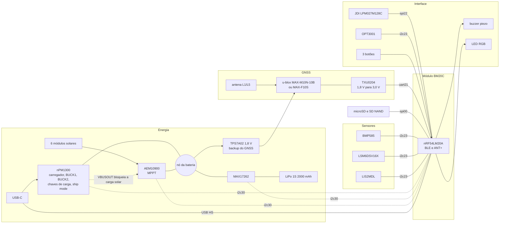
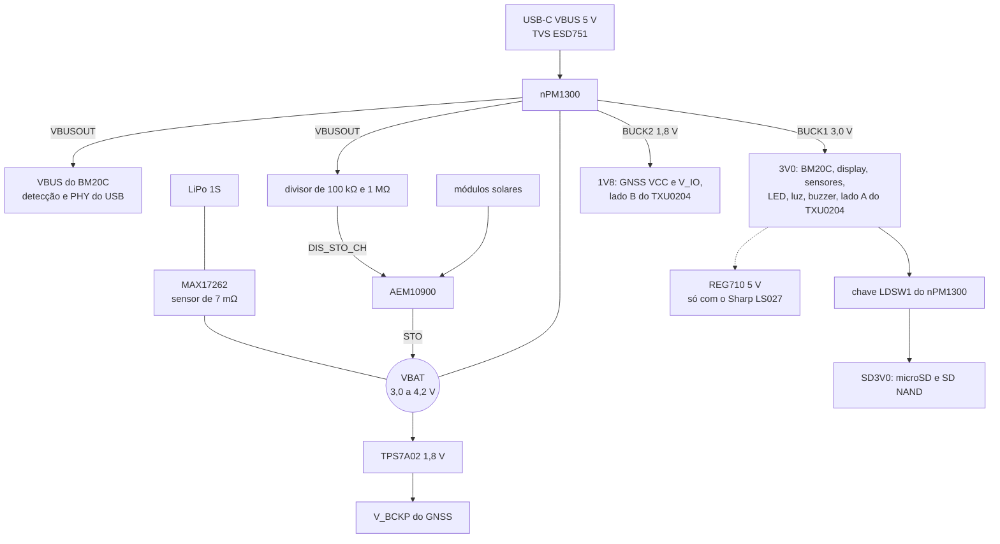

# Arquitetura de hardware da placa nova

Especificação técnica preliminar da placa própria do GNSS Bike Computer: decisões, arquitetura, alimentação, componentes principais, barramentos, alocação de pinos, placa de circuito impresso, empilhamento mecânico, regras de layout e bring-up. A pesquisa de mercado e as alternativas estão em [13-placa-nova.md](13-placa-nova.md); a avaliação que escolheu cada componente, em [15-avaliacao-componentes.md](15-avaliacao-componentes.md); o aparelho desenhado, em [Como fica o aparelho](13-placa-nova.md#como-fica-o-aparelho).

> [!IMPORTANT]
> Especificação de conceito, anterior ao esquemático. Nenhum componente foi montado nem medido. Tensões, correntes e endereços vêm dos datasheets citados em [Referências](#referências); potências médias e autonomia são estimativas de [13](13-placa-nova.md#orçamento-de-energia).

**Nesta página:** [Estado das decisões](#estado-das-decisões) · [Arquitetura](#arquitetura) · [Alimentação](#alimentação) · [Componentes principais](#componentes-principais) · [GNSS](#gnss) · [Barramentos e endereços](#barramentos-e-endereços) · [Alocação de pinos](#alocação-de-pinos) · [Placa de circuito impresso](#placa-de-circuito-impresso) · [Empilhamento mecânico](#empilhamento-mecânico) · [Regras de layout](#regras-de-layout) · [Teste e bring-up](#teste-e-bring-up) · [Pendências](#pendências) · [Referências](#referências)

## Estado das decisões

| Bloco | Escolha | Estado | Como fechar |
|---|---|---|---|
| MCU e rádio | nRF54LM20A no módulo Fanstel BM20C (antena em chip) | MCU decidido; módulo recomendado | datasheet do BM20C: pinagem, USB, NFC, guia de layout da antena e tolerância do cristal de 32,768 kHz (o ANT exige no máximo ±50 ppm) |
| Pilha de rádio | BLE do NCS v3.3.0 e ANT do `sdk-ant` v2.1.1 | decidido | — |
| Display | JDI LPM027M128C: MIP de 8 cores, 2,7", 400 × 240, com luz; a placa aceita também o Sharp LS027B7DH01 no mesmo conector, com os 5 V opcionais | recomendado; compra do JDI em risco | 3 a 5 amostras do JDI antes do layout ([15](15-avaliacao-componentes.md#display)) |
| Painéis solares | 6 módulos de 3 células de 23 × 8 mm (classe ANYSOLAR KXOB25-05X3F) na frente inclinada e nos chanfros laterais | arranjo decidido | fixação, janela e vedação na mecânica |
| GNSS | u-blox MAX-M10N-10B (L1, modo LEAP) no footprint MAX, que aceita também o MAX-F10S (L1 + L5) | recomendado ([15](15-avaliacao-componentes.md#gnss)) | protótipo: C/N0, trajeto e consumo; teste A/B com o F10S no mesmo footprint |
| Carga e medição | nPM1300 (USB e reguladores), AEM10900 (solar), MAX17262 (medidor na célula); o USB bloqueia o solar no hardware | recomendado ([15](15-avaliacao-componentes.md#carga-usb-c-e-painel-solar)) | bancada com as placas de avaliação do nPM1300 e do AEM10900 e o MAX17262 na mesma célula |
| Bateria | LiPo de 1 célula, 2000 mAh, 60 × 36 × 7 mm, com proteção (PCM) e dois NTC de 10 kΩ | recomendado | especificação com o fornecedor do pack (dois NTC, UN38.3) |
| Sensores | BMP585, LSM6DSV16X, LIS2MDL, OPT3001 | recomendado | estoque na compra (alternativas LIS2DW12 e MMC5603NJ) |
| Armazenamento | microSD (Hirose DM3AT-SF-PEJM5) e SD NAND XTX no `spi00` no protótipo; só o SD NAND no produto | recomendado ([15](15-avaliacao-componentes.md#armazenamento)) | validar o modo SPI, o FatFs e o MSC no SD NAND |
| USB | USB-C IPX8 (Amphenol 12402484E512A ou Molex 2036150003), ESD751 no VBUS e TPD4E05U06 nos dados e no CC, USB High Speed | recomendado ([15](15-avaliacao-componentes.md#usb-c-e-proteção)) | altura e furo na parede pelo desenho do fabricante |

O display é um LCD de memória refletivo (MIP), legível ao sol como o e-paper, e não e-paper: o e-paper colorido leva de 11 a 20 s por quadro em cor e gasta cerca de 144 mJ por atualização, contra menos de 0,2 s e cerca de 30 µJ do MIP, e o aparelho redesenha dados a cada segundo ([13](13-placa-nova.md#display)).

## Arquitetura

## Alimentação

### Árvore

| Trilho | Fonte | Tensão | Limite da fonte | Cargas | Observação |
|---|---|---|---|---|---|
| VBUS | USB-C | 4,0 a 5,5 V (o nPM1300 tolera 22 V em transitório) | limite de entrada do nPM1300, de 100 mA a 1,5 A | nPM1300; pela saída VBUSOUT, o VBUS do BM20C e o divisor do DIS_STO_CH do AEM10900 | o USB do nRF54LM20A exige 5 V no pino VBUS além do VDD; a VBUSOUT tem proteção contra sobretensão e subtensão |
| VBAT | célula, através do MAX17262 | 3,0 a 4,2 V | proteção do pack | VBAT do nPM1300, STO do AEM10900, entrada do TPS7A02 | nenhuma carga da aplicação direto no VBAT: o datasheet do nPM1300 proíbe |
| 3V0 | BUCK1 do nPM1300 | 3,0 V | 200 mA | BM20C, display (VDD e VDDA), sensores, LED RGB, luz do display, buzzer, I2C_VDD do AEM10900, lado A do TXU0204 | tensão de partida pelo resistor de VSET1: o MCU depende dele para ligar |
| 1V8 | BUCK2 do nPM1300 | 1,8 V | 200 mA | VCC e V_IO do módulo GNSS, lado B do TXU0204 | filtro LC (ferrite e 10 µF) junto do módulo; ripple abaixo de 50 mV; partida pelo VSET2; a rampa do V_IO fica entre 25 e 35.000 µs/V; o firmware manda `UBX-RXM-PMREQ` antes de desligar o trilho |
| SD3V0 | chave LDSW1 do nPM1300, a partir do 3V0 | 3,0 V | 100 mA | microSD e SD NAND | 22 µF junto do soquete; o SD NAND gasta até 75 mA gravando e 130 µA parado, por isso fica atrás da chave; se os picos medidos passarem de 100 mA, chave dedicada |
| VBCKP | TPS7A02, a partir do VBAT | 1,8 V | 200 mA, 25 nA de consumo próprio | V_BCKP do GNSS (28 a 34 µA em backup de hardware) | mantém efemérides e relógio do GNSS em ship mode, para partidas a quente |
| 5V0 (opcional) | TI REG710 de 5 V, a partir do 3V0 | 5,0 V | 30 mA | VDD e VDDA do Sharp LS027B7DH01 | montado só com o Sharp; o JDI tem máximo absoluto de 3,6 V e queima com 5 V ([15](15-avaliacao-componentes.md#display)) |

Pico estimado no 3V0: rádio a +8 dBm (10,9 mA), CPU (2,6 mA), luz do display (16 mA), LED RGB (até 6 mA), sensores (cerca de 1 mA) e o armazenamento pela LDSW1 (até 100 mA), perto de 140 mA contra os 200 mA do BUCK1. No 1V8, o MAX-M10N consome até 16 mA de VCC na aquisição (31 mA com o MAX-F10S), e os dois podem puxar até 100 mA de pico na partida, segundo as fichas.

### Carga

| Caminho | Parâmetros | Origem |
|---|---|---|
| USB (nPM1300) | 600 mA de carga (0,3C da célula de 2000 mAh; o chip vai de 32 a 800 mA); término em 4,20 V, ou 4,10 V para vida longa; JEITA com o NTC do pack (0, 10, 45 e 60 °C, os padrões dos registradores); CC1 e CC2 ligados direto ao conector, com os resistores Rd internos do nPM1300 | datasheet do nPM1300 |
| Solar (AEM10900) | MPPT a 80 % da tensão em aberto (pinos R_MPP abertos); indutor de 6,8 µH (TDK VLS252012HBX-6R8M-1), com até 85 mA de entrada no modo de alta potência, que vem ligado: o arranjo chega a cerca de 88 mA ao meio-dia, e o footprint aceita 4,7 µH ou 3,3 µH se a bancada pedir; limiar de carga de 3,90 V pelos pinos (perfil Li-ion long life) e cerca de 4,05 V por I2C com a placa ligada (com o keep-alive, o valor por I2C persiste, e o firmware volta a 3,90 V antes do ship mode); corte fora de 0 a 45 °C por um segundo NTC colado na célula; carga bloqueada pelo DIS_STO_CH enquanto houver VBUS | datasheet do AEM10900 e [15](15-avaliacao-componentes.md#carga-usb-c-e-painel-solar) |
| Medição (MAX17262) | corrente líquida de todas as fontes, inclusive a do painel com a placa desligada, pelo sensor de 7 mΩ entre BATT e SYS (1,7 A contínuos); 5,2 µA em hibernação; temperatura pelo sensor interno (TH no BATT) | datasheet do MAX17262 |

### Estados de energia

| Estado | O que fica ligado | Consumo na célula | Entrada | Saída |
|---|---|---|---|---|
| Desligado (ship mode) | MAX17262 em hibernação, TPS7A02 e o backup do GNSS; o AEM10900 continua carregando com sol, sozinho, até 3,90 V | cerca de 40 µA (370 nA do nPM1300, 5,2 µA do MAX17262, cerca de 0,2 µA do AEM10900, 25 nA do TPS7A02 e 34 µA do backup do MAX-M10N, valor da ficha a 3,3 V; 28 µA com o MAX-F10S); sem o backup do GNSS, cerca de 6 µA | `UBX-RXM-PMREQ` ao GNSS e `regulator_parent_ship_mode()` pelo `power_scheduler` ou pelo menu | botão no pino SHPHLD ou VBUS |
| Ligado | todos os trilhos | cerca de 58 mW no uso típico (estimativa de [13](13-placa-nova.md#orçamento-de-energia)) | — | — |
| Ligado com USB | todos os trilhos, carga pelo nPM1300 | — | VBUS | o nPM1300 não entra em ship mode com VBUS presente: o firmware desliga os trilhos e põe o MCU em System OFF |

## Componentes principais

| Função | Peça | Encapsulamento | Dados principais | Driver no NCS v3.3.0 | Estado |
|---|---|---|---|---|---|
| MCU e rádio | Fanstel BM20C (nRF54LM20A) | módulo LGA de 10,0 × 14,8 × 2 mm (90 pinos, segundo a Fanstel) | Cortex-M33 de 128 MHz, 2036 KB de RRAM e 512 KB de RAM; 66 GPIO; USB High Speed; cristais de 32 MHz e de 32,768 kHz; FCC ID X8WBM20C, ISED 4100A-BM20C, TELEC R201-260622 e conformidade europeia | NCS e `sdk-ant` | recomendado; produção prevista para 09/2026, US$ 6,50 |
| Display | JDI LPM027M128C | 61,8 × 40,08 × 1,39 mm, FPC de 10 vias | 400 × 240, 8 cores, 3,0 V, SPI até 2 MHz, 5 µW parado e 30 µW a 1 quadro/s; luz de 16 mA a 2,67 V | `jdi,lpm013m126`, com mudanças | recomendado; compra em risco |
| Display alternativo | Sharp LS027B7DH01 | 62,8 × 42,82 × 1,64 mm, FPC de 10 vias na mesma ordem | monocromático, 400 × 240, VDD e VDDA de 5 V, lógica de 3,0 V | o driver do port | previsto no mesmo conector |
| Conector do display | Hirose FH28-10S-0.5SH(05) (indicado pela JDI) | FPC de 10 vias, passo 0,5 mm | o Sharp indica SMK CFP-4610-0150F ou Molex 51441-1093, com contato por baixo: escolher um que sirva aos dois | — | conferir na amostra |
| Bomba de carga de 5 V (opcional) | TI REG710 de 5 V (a mesma da V3) | — | 30 mA; só montada com o Sharp | — | recomendado |
| GNSS | u-blox MAX-M10N-10B (o MAX-F10S no mesmo footprint) | LCC de 10,1 × 9,7 × 2,5 mm | L1: GPS, Galileo, BeiDou e QZSS; 13,5 mW em LEAP a 1,8 V; SAW, LNA e SAW; flash; ver [GNSS](#gnss) | não há (o `u-blox,m10` entra no Zephyr 4.5) | recomendado |
| Antena GNSS | TE L000670 (protótipo) | chip de 14 × 10,75 × 1 mm, na borda | L1 e L5 numa alimentação: 66 % e 56 % de eficiência num plano de 90 × 41 mm | — | recomendado para o protótipo |
| Tradutor de nível | TI TXU0204 | VQFN-14 de 3,0 × 2,5 mm no protótipo (há UQFN-12 de 2,0 × 1,7 mm) | 4 canais de direção fixa, 2 em cada sentido, 1,1 a 5,5 V de cada lado, 2,5 µA; saídas em alta impedância com qualquer VCC abaixo de 100 mV; pull-down interno de 5 MΩ nas entradas | — | recomendado |
| PMIC | Nordic nPM1300 | QFN32 de 5 × 5 mm | carregador de 32 a 800 mA, 2 bucks de 200 mA, 2 LDO de 50 mA ou chaves de 100 mA, ship mode de 370 nA, VBUSOUT, detecção USB-C | `nordic,npm1300*` | recomendado |
| Indutores dos bucks | 2,2 µH, DCR abaixo de 400 mΩ | 0806 | valores da lista de referência do nPM1300 | — | recomendado |
| LED de carga | LED de 0603 no LED1 do nPM1300, anodo no VSYS | 0603 | 5 mA; o LED1 sai de fábrica como indicador de carga e acende sem firmware | — | recomendado |
| Medidor de carga | Analog Devices MAX17262 | WLP de 9 pinos, 1,5 × 1,5 mm, passo de 0,4 mm | sensor interno de 7 mΩ entre BATT e SYS, 1,7 A contínuos, ModelGauge m5 EZ, 5,2 µA em hibernação | `maxim,max17262` | recomendado |
| Carregador solar | e-peas AEM10900 | QFN28 de 4 × 4 mm | MPPT de 120 mV a 2,73 V, partida a frio com 250 mV, até 85 mA de entrada com 6,8 µH (175,5 mA com 3,3 µH), I2C, NTC, medidor de energia | não há | recomendado; validar a carga dupla |
| Indutor do harvester | TDK VLS252012HBX-6R8M-1 (6,8 µH) | 2,5 × 2,0 × 1,2 mm | 1,15 A; o valor de referência do datasheet do AEM10900 | — | recomendado |
| Módulos solares | ANYSOLAR KXOB25-05X3F (6 unidades) | 23 × 8 × 1,8 mm | 3 células, 2,07 V em aberto, 30,7 mW e 18,4 mA a 1 sol | — | recomendado |
| Bateria | LiPo de 1 célula, 2000 mAh | 60 × 36 × 7 mm | proteção (PCM), dois NTC de 10 kΩ (B3380), um para o nPM1300 e outro para o AEM10900 | — | a especificar com o fornecedor |
| LDO do backup do GNSS | TI TPS7A02, 1,8 V | X2SON de 1 × 1 mm | 25 nA de consumo próprio, 1,5 a 6,0 V de entrada, 200 mA | — | recomendado |
| Barômetro | Bosch BMP585 | LGA de 3,25 × 3,25 × 1,96 mm | ruído abaixo de 0,1 Pa RMS, ±0,5 Pa/K, 1,3 µA a 1 Hz, tampa metálica | `bosch,bmp581` (chip ID 0x51 aceito, não testado) | recomendado |
| IMU | ST LSM6DSV16X | LGA-14 de 2,5 × 3,0 × 0,83 mm | acelerômetro e giroscópio, fusão interna, 0,65 mA em alto desempenho | `st,lsm6dsv16x` | recomendado; conferir estoque |
| Magnetômetro | ST LIS2MDL | LGA de 2,0 × 2,0 × 0,7 mm | I2C em 0x1E | `st,lis2mdl` | recomendado; conferir estoque |
| Luz ambiente | TI OPT3001 | USON de 2,0 × 2,0 × 0,65 mm | 0,01 a 83 mil lux, 1,8 µA, 1,6 a 3,6 V | `ti,opt3001` | recomendado |
| microSD (protótipo) | Hirose DM3AT-SF-PEJM5 | soquete de 1,68 mm de altura | push-push com detecção de cartão; o DM3CS-SF, com tampa e dobradiça, se a vibração pedir | `zephyr,sdhc-spi-slot` | recomendado para o protótipo |
| Armazenamento soldado | XTX XTSDG08GWSIGA (SD NAND SLC de 1 Gbyte) | WSON8 de 8 × 6 mm | SD 2.0 com modo SPI, 2,7 a 3,6 V, 32 mA gravando, 130 µA parado | `zephyr,sdhc-spi-slot` | recomendado; compra fora da DigiKey |
| USB-C | Amphenol 12402484E512A ou Molex 2036150003 | receptáculo IPX8, SMT | USB 2.0, 5 A; corpo vedado e anel contra a parede, sem tampa de borracha | — | recomendado; conferir altura e furo |
| ESD | TI ESD751 no VBUS e TPD4E05U06 nos dados e no CC | SOD-523 e USON-10 | VBUS: não conduz até ±24 V, 1,6 pF; dados e CC: 0,5 pF e ±12 kV | — | recomendado |
| Buzzer | Same Sky CPT-1117-83-SMT-TR | 11 × 9 mm | piezo em ponte por dois PWM | PWM | recomendado |
| LED | RGB de 1,6 × 1,6 mm (a escolher) | — | três canais PWM, cerca de 2 mA por canal | `pwm-leds` | a escolher |
| Botões | 3 chaves táteis seladas (IP67) ou chaves comuns sob membrana vedada | — | a de ligar também no SHPHLD | GPIO | a escolher na mecânica |
| Luz do display | N-MOSFET de sinal e resistor (a escolher) | SOT-723 ou similar | 16 mA com PWM | PWM | a escolher |
| Conector da bateria | JST SH de 4 vias (a confirmar) | passo 1,0 mm | VBAT, GND e os dois NTC; com um NTC só no pack, 3 vias e o segundo NTC colado na célula | — | a confirmar |

## GNSS

- **Módulo:** u-blox MAX-M10N-10B, com o LEAP como modo padrão e a potência plena para sinal fraco. O MAX-F10S (L1 + L5) é pino a pino e serve ao teste A/B e a uma versão de banda dupla ([15](15-avaliacao-componentes.md#gnss)).
- **Footprint único:** o MAX-M10S, o MAX-M10N e o MAX-F10S têm a mesma pinagem de alimentação, UART, RESET_N, EXTINT, TIMEPULSE e RF_IN; o M10N não tem I2C (pinos 16 e 17 reservados), que a placa não usa.
- **Alimentação:** VCC de 1,76 a 3,6 V; V_IO nunca acima do VCC (com VIO_SEL em GND, de 1,76 a 1,98 V). A placa usa VCC e V_IO em 1,8 V, pelo BUCK2, com o TXU0204 entre os domínios de 1,8 V e 3,0 V: o M10N em LEAP gasta 13,5 mW contra 16,5 mW em 3,0 V, e o F10S, 47 contra 57 mW. A rampa do V_IO fica entre 25 e 35.000 µs/V (máximo absoluto). Alternativa sem tradutor: módulo inteiro em 3,0 V, pelo BUCK1.
- **Desligar:** com V_IO em 1,8 V e o backup alimentado, a ficha pede desligar o V_IO 100 ms antes do VCC ou mandar `UBX-RXM-PMREQ` antes. Como os dois saem do BUCK2, o firmware manda o `UBX-RXM-PMREQ` antes de desligar o trilho ou de entrar em ship mode.
- **Sinais:** RXD e EXTINT do MCU para o módulo; TXD e TIMEPULSE do módulo para o MCU, pelos quatro canais do TXU0204, com o OE fixo no VCCA. O RESET_N (ativo baixo, pelo menos 1 ms) vem de um pino do MCU em dreno aberto, que só puxa para baixo e dispensa o tradutor. O TIMEPULSE divide o pino com o SAFEBOOT_N por 1 kΩ interno, e o módulo entra em safeboot se o pino estiver baixo na partida: nada de pull-down externo nessa linha. Com o LEAP ligado, o TIMEPULSE pode falhar (nota da SPG 5.30), e o firmware não depende dele.
- **Backup:** V_BCKP de 1,65 a 3,6 V; 28 a 34 µA em backup de hardware e cerca de 3 µA em operação normal, pelo TPS7A02.
- **Entrada de RF:** o MAX-M10N-10B e o MAX-F10S têm SAW, LNA e SAW internos e dispensam filtro externo; um MAX-M10S ou um MAX-M10N-00B (LNA antes do SAW) pediria um SAW externo, por causa do BLE a +8 dBm do nRF54LM20A. O máximo absoluto do RF_IN é 0 dBm: meça o S21 entre as antenas em 2,44 GHz e limite a potência do rádio se precisar.
- **Antena:** no protótipo, a TE L000670 na borda de cima da placa, com área livre em todas as camadas e rede de casamento em π; numa segunda versão, elementos de L1 e L5 na parede da caixa com contatos de mola e um diplexador na RF_IN, como no [desenho](13-placa-nova.md#como-fica-o-aparelho) e nos produtos do mercado ([13](13-placa-nova.md#antena-gnss-dentro-da-caixa)).
- **Teste A/B no protótipo:** MAX-M10N-10B, em LEAP e em potência plena, contra MAX-F10S, na mesma placa e na caixa real: C/N0 por banda, ruído na banda (`UBX-MON-SPAN`), partida a frio e a quente, trajeto em cidade e em mata contra uma referência, e consumo no PPK2.

## Barramentos e endereços

| Barramento | Instância | Velocidade | Nível | Dispositivos (endereço de 7 bits) | Observação |
|---|---|---|---|---|---|
| I2C dos sensores | `i2c23` | 400 kHz | 3,0 V, pull-ups de 4,7 kΩ | BMP585 0x47 (SDO alto; 0x46 com SDO em GND), LSM6DSV16X 0x6A (SA0 em GND), LIS2MDL 0x1E (fixo), OPT3001 0x44 (ADDR em GND) | sem conflito |
| I2C de energia | `i2c30` | até 400 kHz | 3,0 V | nPM1300 0x6B (fixo), MAX17262 0x36 (fixo), AEM10900 0x41 (I2C_ADDR em I2C_VDD; 0x40 em GND) | sem conflito; com o keep-alive, a configuração por I2C do AEM10900 continua valendo com o 3V0 desligado, e o firmware volta aos pinos antes do ship mode |
| SPI do armazenamento | `spi00` | 16 MHz | 3,0 V | microSD e SD NAND, com chip select separado | 16 MHz fica fora do lóbulo de L1 e dentro dos 25 MHz do modo SPI do cartão |
| SPI do display | `spi22` | 2 MHz (máximo do display) | 3,0 V | JDI LPM027M128C | CS ativo alto |
| UART do GNSS | `uart21` | a configurar por UBX (`CFG-UART1-BAUDRATE`) | 3,0 V no MCU, 1,8 V no módulo | u-blox MAX | pelo TXU0204 |
| USB | USBHS | 480 Mbit/s | par diferencial de 90 Ω | USB-C | VBUS do nRF pela VBUSOUT do nPM1300 |
| PWM | `pwm20` a `pwm22` | — | 3,0 V | luz do display, EXTCOMIN, LED RGB (3), buzzer (2) | — |

## Alocação de pinos

Provisória. Os blocos seriais seguem os domínios de pinos do nRF54LM20A (`spi00` na porta P2; blocos 20 a 24 nas portas P1 e P3; bloco 30 na porta P0), e as funções que já existem no port repetem os pinos do alvo nRF54LM20 DK ([05](05-arquitetura-zephyr.md#nrf54lm20-dk)). O mapeamento final depende da pinagem do BM20C.

| Função | Sinais | Periférico | Porta | Pino no DK (referência) |
|---|---|---|---|---|
| Armazenamento | SCK, MOSI, MISO, CS do microSD, CS do SD NAND, detecção de cartão | `spi00` e GPIO | P2 | SCK P2.01, MOSI P2.02, MISO P2.04, CS P2.03 |
| Display | SCK, MOSI, CS, DISP | `spi22` e GPIO | P3 | SCK P3.03, MOSI P3.00, CS P3.02 |
| Display | EXTCOMIN (cerca de 60 Hz com a luz acesa) e luz | `pwm20` | P1 | — |
| GNSS | TXD, RXD, RESET_N, EXTINT, TIMEPULSE (o OE do tradutor fica fixo no VCCA) | `uart21` e GPIO | P1 | TX P1.04, RX P1.05, RESET P1.06, EXTINT P1.07, TIMEPULSE P1.13 |
| Sensores | SDA, SCL, INT1 e INT2 do IMU, INT do barômetro | `i2c23` e GPIO | P1 e P3 | SDA P1.02, SCL P1.03, INT1 P3.04 |
| Energia | SDA, SCL, interrupção do nPM1300 (GPIO3), ALRT do MAX17262 e IRQ do AEM10900 (o bloqueio da carga solar vem do VBUSOUT, sem pino do MCU) | `i2c30` e GPIO | P0 | — |
| Botões | 3 entradas com despertar | GPIO | P0 ou P1 | P1.26, P1.09, P1.08 |
| LED RGB | 3 canais | `pwm22` | P1 ou P3 | — |
| Buzzer | 2 canais em contrafase | `pwm21` | P1 ou P3 | — |
| Console | TX, RX em pads de teste | `uart30` | P0 | — |
| Dedicados | USB (D+, D−, VBUS), SWD, cristais internos do módulo | — | — | — |

Total: 37 GPIO no protótipo, com o microSD e o SD NAND, e 35 no produto, só com o SD NAND, dos 66 do módulo.

## Placa de circuito impresso

- **Contorno:** 55 × 97 mm, cantos com raio de 4 mm, dentro da caixa de 62 × 104 mm (paredes de cerca de 2 mm e folga de 0,5 mm). Origem no canto de cima à esquerda, com a placa vista pela frente.
- **Espessura e camadas:** 1,0 mm, 4 camadas, controle de impedância.

| Camada | Uso |
|---|---|
| L1 (frente) | componentes da face do display, sinais rápidos curtos, rede em π da antena GNSS |
| L2 | GND sólido, referência de L1 e L3 |
| L3 | 3V0 e 1V8 em áreas, sinais lentos |
| L4 (trás) | componentes da face da bateria, sinais |

As espessuras de dielétrico saem com o fabricante para 90 Ω diferencial no USB e 50 Ω na RF_IN do GNSS.

- **Zonas** (posições do [desenho](13-placa-nova.md#como-fica-o-aparelho), a fechar no layout):

| Zona | x (mm) | y (mm) | Conteúdo | Restrição |
|---|---|---|---|---|
| Antena GNSS | 0 a 55 | 0 a 8 | TE L000670 na borda de cima (protótipo) ou os contatos dos elementos na parede | sem cobre sob a antena em todas as camadas; nada metálico mais alto que 3 mm num raio de 10 mm |
| GNSS | 20 a 35 | 2 a 16 | módulo MAX e filtro do 1V8 | sob o display: altura até 2,6 mm (o módulo tem 2,5 mm) |
| LED | 50 a 53 | 0 a 3 | LED RGB sob o furo de luz | trilhas curtas, fora da área livre da antena |
| IMU e magnetômetro | 8 a 15 | 20 a 23 | LSM6DSV16X e LIS2MDL | longe de correntes altas e de ímãs |
| FPC do display | 3,7 a 7,1 | 29,5 a 39,5 | Hirose FH28 na borda esquerda | longe das antenas |
| Buzzer | 10,5 a 21,5 | 46,5 a 55,5 | piezo, com saída de som na caixa | — |
| Energia | 16 a 38 | 67 a 90 | nPM1300, AEM10900, MAX17262, indutores, conectores da bateria e dos painéis | cobre largo nos caminhos de corrente |
| Armazenamento | 0 a 14 | 67 a 83 | soquete do microSD com a boca na borda esquerda (só no protótipo) e o SD NAND | — |
| Barômetro | 4,5 a 8 | 83 a 86,5 | BMP585 na face de trás, junto do respiro | fora da sombra da bateria |
| BM20C | 45 a 55 | 73 a 88 | módulo e área livre da antena de 2,4 GHz (y 85 a 91) | guia de layout da Fanstel; longe dos painéis e da antena GNSS |
| Botões | 8 a 47 | 88 a 95 | 3 chaves táteis (centros em x 12,5, 27,5 e 42,5, y 91,5) | — |
| USB-C | 23 a 32 | 94 a 97 | receptáculo IPX8 na borda de baixo, com o anel contra a parede | TVS junto do conector |
| Luz ambiente | 0,4 a 2,4 | 88 a 90 | OPT3001 sob a janela de baixo | — |

- **Faces:** na face da frente, sob o display, só peças de até 2,6 mm; na face de trás, na área da bateria (x 9,5 a 45,5, y 22,5 a 82,5), só peças de até 1,2 mm, com fita isolante sobre elas.
- **Fixação:** 4 furos M2 nos cantos, alinhados aos parafusos da traseira; o furo de baixo à direita sai da área livre da antena do BM20C.
- **Conectores:** display (FPC de 10 vias) na borda esquerda; bateria (4 vias) na face de trás; painéis em três grupos (frente, esquerda, direita), por pads de mola ou FPC; USB-C na borda de baixo; microSD na borda esquerda, só no protótipo.

## Empilhamento mecânico

Da frente para trás, na área do display:

| Camada | Espessura (mm) | Observação |
|---|---|---|
| Parede da frente e janela | 1,2 | policarbonato ou vidro sobre o display |
| Display JDI | 1,39 | a versão com luz (C) pode ser mais grossa: medir a amostra |
| Espuma e folga | 0,5 | — |
| Componentes da face da frente | até 2,6 | o módulo GNSS tem 2,5 mm |
| PCB | 1,0 | 4 camadas |
| Componentes da face de trás | até 1,2 | fora da área da bateria, até 2,0 mm |
| Bateria | 7,6 | 7,0 mm e cerca de 8 % de folga para inchaço |
| Parede de trás | 1,5 | o engate de quarto de volta soma 3 mm por fora |
| **Total** | **17,0** | a caixa tem 19 mm: sobram cerca de 2 mm para tolerâncias e para os chanfros com painéis |

## Regras de layout

1. **Antena GNSS:** área livre em todas as camadas, rede em π junto ao ponto de alimentação e sintonia com VNA na caixa final; bateria, soquete microSD, parafusos e painéis fora do caminho entre a antena e o céu ([13](13-placa-nova.md#regras-de-projeto)).
2. **Rádio de 2,4 GHz:** a antena do BM20C no canto oposto ao GNSS, com a área livre do guia do módulo; medir o S21 entre as duas antenas no protótipo.
3. **Clocks e ruído:** microSD e SD NAND a 16 MHz; linhas do display, do cartão e do USB em camada interna entre planos de terra e longe da zona do GNSS. Clocks até cerca de 2 MHz, como o SPI do display, têm harmônicos dentro de L1 e L5: bordas lentas (resistor em série), trilhas curtas e o FPC do display pela esquerda.
4. **Fontes chaveadas:** laços dos bucks do nPM1300 e do boost do AEM10900 curtos, indutores junto dos pinos, no lado oposto e na diagonal da antena GNSS; ripple do 1V8 abaixo de 50 mV no módulo GNSS.
5. **USB:** D+ e D− como par diferencial de 90 Ω, curto, sem vias se possível; TVS junto do conector.
6. **Bateria e temperatura:** NTC do pack no nPM1300 e segundo NTC colado na célula para o AEM10900; célula longe dos painéis e do carregador, porque a caixa ao sol passa de 45 °C.
7. **Vedação:** respiro com membrana para o barômetro; USB-C IPX8, vedado no corpo e por anel na parede; microSD com tampa só no protótipo; botões selados.

## Teste e bring-up

- **Pontos de teste:** VBUS, VBAT, VSYS, 3V0, 1V8, SD3V0, VBCKP e GND, com jumper de 0 Ω em série nos trilhos de cada bloco (BM20C, GNSS, display, sensores, armazenamento) para medir corrente com o PPK2.
- **Depuração:** SWD (SWDIO, SWDCLK, reset, VDD e GND) num footprint Tag-Connect TC2030 e console no `uart30`, em pads.

## Pendências

| Pendência | Como fechar |
|---|---|
| Datasheet e pinagem do BM20C | pedir à Fanstel: pinos de USB e NFC, guia de layout da antena, tolerância do cristal de 32,768 kHz |
| Módulo GNSS | confirmar o MAX-M10N-10B no protótipo (LEAP e potência plena) e fazer o A/B com o MAX-F10S; driver `u-blox,m10` do Zephyr 4.5 ou parser UBX próprio ([13](13-placa-nova.md#impacto-no-firmware)) |
| Carga dupla | nPM1300 e AEM10900 na mesma célula, em bancada: bloqueio pelo VBUSOUT, fim de carga, medição, temperatura, corrente de pico do painel ([15](15-avaliacao-componentes.md#bancada-antes-do-layout)) |
| Display | amostras do JDI (espessura da versão com luz, lado do contato do FPC, tensão da luz), conector que sirva ao JDI e ao Sharp, e mudanças no driver |
| Antena GNSS de parede | fornecedor de antena sob medida para a segunda versão |
| Bateria | pack com NTC de 3 fios, proteção e UN38.3 |
| Mecânica | caixa, janela dos painéis, vedação, fixação da placa e dos painéis |
| Estoque | LSM6DSV16X e LIS2MDL; alternativas LIS2DW12 e MMC5603NJ |
| Armazenamento | SD NAND XTX: compra fora da DigiKey, ficha completa e teste do modo SPI com o `zephyr,sdhc-spi-slot` |
| USB-C | altura, furo na parede e anel do receptáculo IPX8 no projeto mecânico |

## Referências

- [13-placa-nova.md](13-placa-nova.md): pesquisa, alternativas e fontes de cada bloco.
- [15-avaliacao-componentes.md](15-avaliacao-componentes.md): avaliação e escolha de cada componente, com as fontes conferidas.
- Conferidos para esta especificação: u-blox MAX-F10S Data sheet R03 (faixas de VCC, V_IO e V_BCKP, corrente de backup), MAX-M10N-00B Data sheet R05 (pinos 16 e 17 reservados); Nordic nRF54LM20A/B Datasheet v1.0 (USBREG: VBUS de 5 V e VDD para o USB) e nPM1300 Product Specification v1.1 (VBUSOUT, CC1 e CC2 com Rd interno, VSET1 e VSET2, chaves de 100 mA, "VSYS must not be supplied from an external source"); e-peas AEM10900 (endereço 0x40 ou 0x41, corrente de entrada); TI [TXU0204](https://www.ti.com/product/TXU0204), [TPS7A02](https://www.ti.com/product/TPS7A02) e [OPT3001](https://www.ti.com/product/OPT3001).
- NCS v3.3.0: `zephyr/drivers/sensor/bosch/bmp581/bmp581.h` (endereços 0x46 e 0x47 da família BMP5) e os exemplos com `lis2mdl@1e`, `opt3001@44`, `npm1300@6b`, `max17262@36` e `lsm6dsv16x@6b`.
