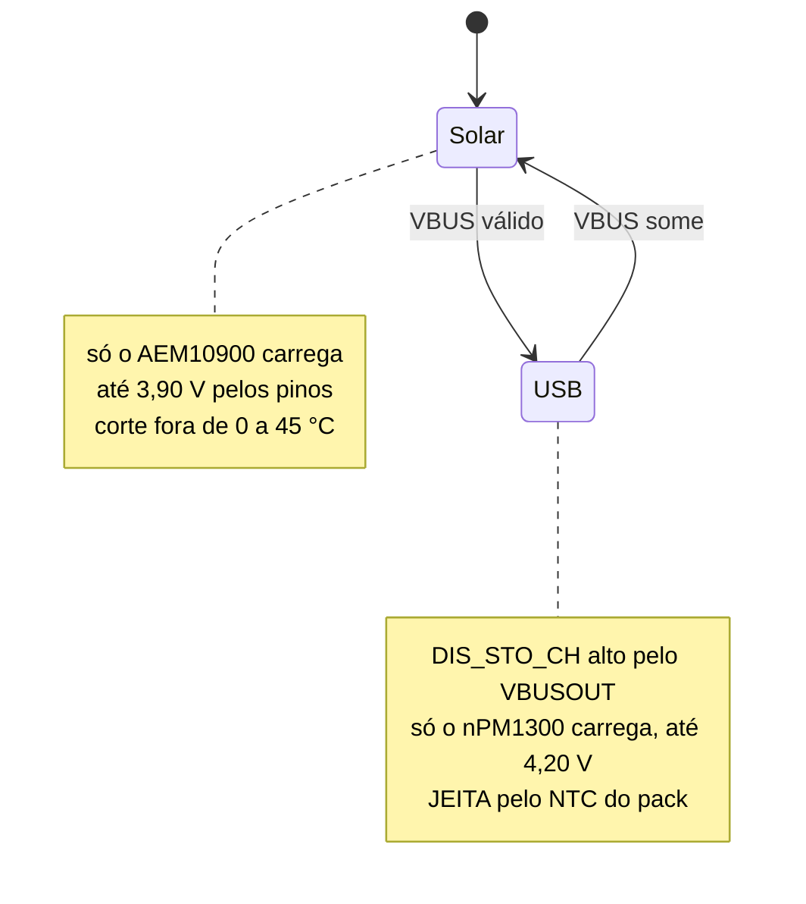
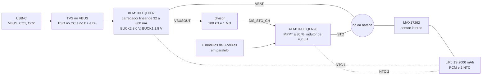
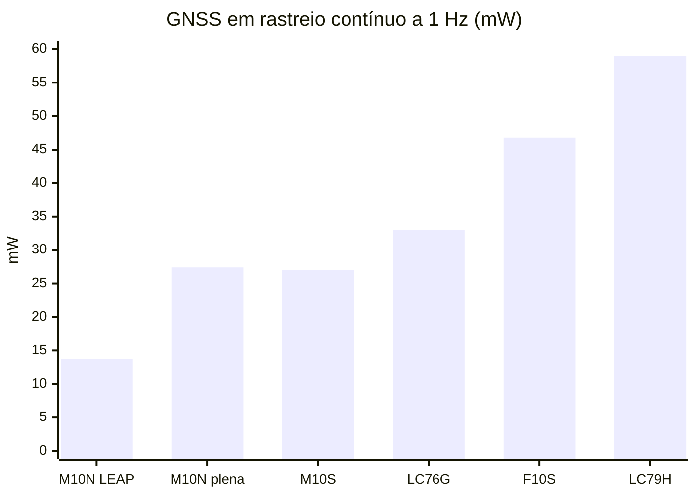

# Avaliação dos componentes da placa nova

Avaliação de engenharia, bloco a bloco, dos componentes principais da placa nova. Para cada bloco: o que ele precisa atender, os candidatos comparados com números de datasheet, os riscos, a escolha e os detalhes que o esquemático precisa. A especificação que resulta daqui está em [14-hardware-placa-nova.md](14-hardware-placa-nova.md); a pesquisa de mercado e as fontes de cada bloco, em [13-placa-nova.md](13-placa-nova.md).

> [!IMPORTANT]
> Avaliação feita sobre datasheets e notas de aplicação, sem bancada: nenhum componente foi montado nem medido. Cada escolha diz qual medida a confirma. Preço e estoque são da DigiKey em 2026-09-18 e mudam rápido.

> [!NOTE]
> A [lista de compras](19-lista-de-compras.md) validou cada peça em duas passagens, compra e integração, e o texto abaixo já traz o que mudou: a tela da lista é a Sharp LS027B7DH01A com luz frontal, porque o JDI não tem canal autorizado de compra; o BMI270 e o MMC5633NJL entram no lugar do LSM6DSV16X e do LIS2MDL, sem estoque; o BUCK2 dá os 3,0 V e o BUCK1, os 1,8 V, pela tabela dos resistores de VSET; o indutor do AEM10900 passa a 4,7 µH; o ESD761, o NTC da TDK, o JST GH e o receptáculo da Molex substituem o ESD751, o NTC da Murata, o JST SH e o Amphenol.

**Nesta página:** [Resumo](#resumo) · [Critérios](#critérios) · [Carga: USB-C e painel solar](#carga-usb-c-e-painel-solar) · [GNSS](#gnss) · [Módulo do MCU](#módulo-do-mcu) · [Display](#display) · [Antena GNSS](#antena-gnss) · [Sensores](#sensores) · [Armazenamento](#armazenamento) · [USB-C e proteção](#usb-c-e-proteção) · [Bateria](#bateria) · [Tradutor de nível e backup do GNSS](#tradutor-de-nível-e-backup-do-gnss) · [Interface](#interface) · [Bancada antes do layout](#bancada-antes-do-layout) · [Referências](#referências)

## Resumo

| Bloco | Escolha | Por quê | Plano B |
|---|---|---|---|
| Carga pelo USB-C | Nordic nPM1300 (QFN32) | carregador de 32 a 800 mA com power path, CC sem resistor externo, 2 bucks, 2 chaves, ship mode de 370 nA e driver no NCS v3.3.0 | nenhum candidato junta tudo isso com driver |
| Carga pelo painel | e-peas AEM10900 (QFN28), indutor de 4,7 µH | o único avaliado com MPPT na faixa das strings de 3 células, cerca de 90 % de rendimento a 1,5–1,7 V e corte térmico sem MCU | nenhum com corte térmico e 80 mA; o BQ25798 pediria strings de 7 células ou mais |
| Convivência das cargas | o USB bloqueia o solar no hardware (DIS_STO_CH pelo VBUSOUT) | os dois carregadores nunca trabalham juntos | bloqueio por registrador, pelo firmware |
| Medição | Analog Devices MAX17262 | vê as duas fontes, também com o aparelho desligado | nRF Fuel Gauge corrigido pelo APM (perde a carga em ship mode) |
| GNSS | u-blox MAX-M10N-10B, em LEAP | 13,7 mW contra 46,8 mW do MAX-F10S: o aparelho gasta cerca de 21 mW contra 58 mW e dura cerca de 310 h contra 115 h, e o painel cobre o consumo num pedal de sol | MAX-F10S no mesmo footprint |
| MCU | Fanstel BM20C (nRF54LM20A) | módulo certificado, 64 GPIO, antena e cristais inclusos; o QFN52 não tem pinos suficientes | chip em CSP98 com antena própria |
| Display | Sharp LS027B7DH01A com a luz frontal Azumo 11103-06_A1; o JDI LPM027M128C no mesmo conector | o JDI (cor e 30 µW a 1 quadro/s) não tem canal autorizado de compra; a Sharp tem estoque e já roda no port | JDI de revendedores, se a cor voltar ao plano |
| Antena GNSS | TE L000670 no protótipo | L1 e L5 numa alimentação só: serve ao M10N e ao F10S | elementos de parede sob medida |
| Barômetro | Bosch BMP585 | robusto a água e produtos químicos (15 bar sem efeito, pela ficha), 1,3 µA a 1 Hz, ±0,5 Pa/K | ST LPS28DFW |
| IMU e magnetômetro | Bosch BMI270 e Memsic MMC5633NJL | em estoque, com driver no NCS v3.3.0 e despertar por movimento; o footprint do IMU aceita o ST LSM6DSV16X | ST LSM6DSV16X e LIS2MDL, quando voltarem ao estoque |
| Luz ambiente | TI OPT3001 | resposta do olho humano, 1,8 µA | Vishay VEML7700 |
| Armazenamento | microSD e SD NAND no protótipo; SD NAND XTX de 1 Gbyte no produto | o mesmo protocolo e o mesmo driver, sem fenda na caixa | microSD em soquete com tampa |
| USB-C | receptáculo IPX8 Molex 2036150003 | dispensa a tampa de borracha; o desenho confirma o anel de vedação | Amphenol 12402484E512A, depois do desenho; GCT USB4105-GF-A com tampa |
| Proteção do USB | TI ESD761 no VBUS, TI TPD4E05U06 no D+, D−, CC1 e CC2 | o TVS do VBUS não conduz até 24 V e preserva os 22 V do nPM1300 | TI TVS2200 no VBUS |
| Bateria | LiPo de 1 célula, 2000 mAh, com PCM e 2 NTC | 60 × 36 × 7 mm; o PCM é obrigatório (o nPM1300 não tem UVLO) | 2500 mAh se a caixa crescer |
| Tradutor e backup do GNSS | TI TXU0204 e TI TPS7A02 | 2 canais em cada sentido e isolação com o 1V8 desligado; 25 nA no backup | GNSS em 3,0 V, sem tradutor (3 mW a mais) |

## Critérios

1. **Energia no uso típico.** O GNSS domina o [orçamento de energia](13-placa-nova.md#orçamento-de-energia): cada miliwatt economizado nele vale mais que em qualquer outro bloco e decide se o painel sustenta o aparelho num pedal de sol.
2. **Funcionar desligado e ao sol.** O painel carrega com o MCU em ship mode, então toda proteção da célula precisa funcionar sem firmware.
3. **Driver no NCS v3.3.0**, ou um esforço conhecido para escrever um.
4. **Montagem do protótipo:** QFN, LGA e módulos com castelação antes de WLCSP de passo fino.
5. **Compra:** estoque em distribuidor autorizado, datasheet público e ciclo de vida ativo.
6. **Robustez:** chuva, vibração e a faixa de 0 a 60 °C da caixa ao sol.
7. **Risco técnico:** comportamento não documentado conta contra e vira item de [bancada](#bancada-antes-do-layout).

## Carga: USB-C e painel solar

### Requisitos

| Requisito | Valor | Origem |
|---|---|---|
| Entrada USB | USB-C de 5 V como sink, sem USB PD; capacidade da fonte lida pelo CC (padrão, 1,5 A ou 3 A) | [14](14-hardware-placa-nova.md#alimentação) |
| Carga pelo USB | 2000 mAh em cerca de 3,5 h (600 mA, 0,3C), JEITA, fim de carga em 4,20 V (ou 4,10 V para vida longa) | [14](14-hardware-placa-nova.md#carga) |
| Painel | 6 módulos ANYSOLAR KXOB25-05X3F em paralelo, em 3 faces com orientações diferentes. Cada módulo é uma string de 3 células: 2,07 V em aberto a 25 °C (cerca de 2,30 V a −20 °C) e 1,67 V com 18,4 mA no ponto de máxima potência a 1 sol | [13](13-placa-nova.md#painel-solar) |
| Corrente do painel | pico de cerca de 80 a 88 mA ao meio-dia, com o aparelho na horizontal; de 1 a 30 mA na maior parte do tempo | cálculo abaixo |
| Carga desligado | o painel carrega com o aparelho em ship mode; o corte térmico não pode depender do MCU, porque a caixa ao sol passa de 45 °C | [13](13-placa-nova.md#dois-carregadores-na-mesma-célula) |
| Medição | estado de carga com as duas fontes, inclusive o que o painel põe com o aparelho desligado | — |

Pico do painel: com o sol a pino e o aparelho na horizontal, os 2 módulos da face da frente (inclinada cerca de 10°, pelo [desenho](13-placa-nova.md#como-fica-o-aparelho)) dão 2 × 18,4 × cos 10° ≈ 36 mA, e os 4 dos chanfros de 45° dão 4 × 18,4 × cos 45° ≈ 52 mA: cerca de 88 mA antes das perdas da janela. Com o sol de lado, um chanfro recebe o sol de frente e o outro só luz difusa, e o total cai para 65 a 72 mA. As 3 faces nunca recebem o sol de frente ao mesmo tempo, então os 110 mA da soma dos 6 módulos nunca acontecem.

### Topologias comparadas

| Topologia | Como funciona | Veredito |
|---|---|---|
| **A. nPM1300 + AEM10900 + MAX17262** | cada fonte com o seu carregador, os dois no nó da bateria; o medidor fica entre esse nó e a célula | **escolhida** |
| B. TI BQ25798 sozinho | um carregador buck-boost com duas entradas e MPPT | descartada. A entrada começa em 3,6 V, o que pede strings de 7 células ou mais em série; a 65 °C, a tensão de máxima potência de 7 células cai para cerca de 3,4 V (−1,74 mV/K por célula) e o carregador para no sol forte. Uma string em série atravessaria faces com sol diferente e ficaria presa à célula mais escura. Consome 17 µA só com a bateria, não tem reguladores nem driver no NCS, e o rendimento com poucos miliwatts não é publicado |
| C. Painel direto no VBUS do nPM1300 | sem harvester | descartada. O VBUS pede de 4,0 a 5,5 V, e o nPM1300 só limita a corrente (100 mA até o firmware mudar) e desliga o SYSREG abaixo do VBUSMIN: sem regulação da tensão de entrada não há MPPT. O carregador é linear, com cerca de 75 % de rendimento de 5 V para 3,7 V |
| D. Harvester no VSYS do nPM1300 | o solar alimentaria o sistema | descartada. O datasheet proíbe ("VSYS must not be supplied from an external source"), e nada carregaria com o aparelho desligado |
| E. A, com outro harvester | BQ25570, ADP5091, MAX20361, AEM10330, AEM10941 | ver [Harvester](#harvester) |
| F. A, sem o MAX17262 | o nRF Fuel Gauge do nPM1300, corrigido pela energia que o APM do AEM10900 informa | descartada. O nRF Fuel Gauge só vê a corrente que passa pelo nPM1300; a correção pede o fator α do APM (a e-peas fornece sob pedido) e perde tudo o que o painel carrega em ship mode. O MAX17262 custa 5,2 µA e um CI |

### Harvester

O corte térmico autônomo é eliminatório: com o aparelho desligado ao sol, só o harvester decide se carrega uma LiPo a 50 °C.

| CI | Entrada (MPPT) | Partida a frio | Corrente de entrada | Corte térmico sem MCU | Encapsulamento | Veredito |
|---|---|---|---|---|---|---|
| **e-peas AEM10900** | 0,12 a 2,73 V (circuito aberto até 3,0 V) | 250 mV, 2,47 µW | 65,5 mA com 6,8 µH e 175,5 mA com 3,3 µH (tabela 6; a fórmula da seção 6.7.2 dá 85 mA com 6,8 µH) | sim (0 e 45 °C por padrão) | QFN28 de 4 × 4 mm | **escolhido** |
| e-peas AEM10941 | 50 mV a 4,5 V | 380 mV, 3 µW | 110 mA | não listado | QFN | sem corte térmico confirmado; os 2 LDOs internos não servem aqui |
| e-peas AEM10330 | 0,1 a 4,5 V | 275 mV, 3 µW | curva publicada até 50 mA | não (só o bloqueio externo EN_STO_CH) | QFN | sem corte térmico |
| TI BQ25570 | 0,1 a 5,1 V depois da partida | 600 mV | 100 mA | não | QFN | sem corte térmico; limiares por resistores |
| ADI ADP5091 | 0,08 a 3,3 V | 380 mV | 6 µW a 600 mW | não confirmado | LFCSP | corte térmico não confirmado |
| ADI MAX20361 | não confirmada | 225 mV | 15 µW a mais de 300 mW | sim (0 e 45 °C) | WLP de 1,63 × 1,23 mm | difícil de montar no protótipo; faixa de entrada não confirmada |

Por que o AEM10900:

- **Faixa certa para strings de 3 células:** MPPT até 2,73 V e circuito aberto até 3,0 V cobrem os 2,30 V das 3 células a −20 °C com folga; 4 células chegariam a 2,97 V a −5 °C, no limite.
- **Rendimento publicado:** a figura 4 do datasheet (com 6,8 µH) dá cerca de 87 a 91 % com 1,5 a 1,7 V na entrada, de 0,1 a 10 mA, com a bateria de 2,85 a 4,5 V.
- **Tudo sem firmware:** limiares de carga pelos pinos, corte térmico por NTC, bloqueio da carga pelo pino DIS_STO_CH, keep-alive pela bateria (162 a 242 nA).
- **Com firmware, se quiser:** I2C para limiares, medidor de energia (APM) e interrupção. Não há driver no Zephyr; são poucos registradores.

### Medição da carga

O nRF Fuel Gauge da Nordic roda no MCU e usa a corrente que o nPM1300 mede no próprio caminho da bateria. A corrente do AEM10900 entra na célula por fora desse caminho, e em ship mode ninguém mede nada. O MAX17262 fica em série com a célula e vê a corrente líquida de todas as fontes, também com o aparelho desligado, com o algoritmo ModelGauge m5 EZ, que dispensa a caracterização da célula.

| Item | Valor (ficha da Maxim) |
|---|---|
| Encapsulamento | WLP de 9 pinos, 1,5 × 1,5 mm, passo de 0,4 mm (a DigiKey lista o MAX17262REWL+T, ativo); não há versão com terminais, então a montagem é por estêncil e forno |
| Ligação | BATT no positivo da célula (depois do PCM), com 0,1 µF; SYS no nó da bateria (VBAT do nPM1300 e STO do AEM10900); o sensor de 7 mΩ fica entre os dois pinos |
| Corrente | 1,7 A contínuos, 2,4 A com 10 % de uso e 3,1 A em pulsos de 250 ms: sobra para os 600 mA de carga e os picos de descarga |
| Consumo | 5,2 µA em hibernação (12 µA no máximo), 16 µA ativo, 0,5 µA desligado |
| Medição de tensão | erro de ±7,5 mV a 25 °C (±20 mV de −40 a 85 °C) |
| Temperatura | TH no BATT, usando o sensor interno de ±1 °C: os dois NTC da célula já estão ocupados; o CI fica junto do conector da bateria. A configuração de fábrica (0x2210) liga o ETHRM, e o firmware grava ETHRM = 0 com TSel = 0 |
| Outros pinos | REG (1,8 V interno) com 0,47 µF, sem carga externa; ALRT em dreno aberto para o MCU |
| I2C | 0x36; binding `maxim,max17262`, que pede capacidade, tensões de projeto, de carga e de vazio, e a corrente de carga |

### Convivência das duas cargas

1. **USB presente bloqueia o solar no hardware.** O pino DIS_STO_CH do AEM10900 recebe o VBUSOUT do nPM1300 por um divisor de 100 kΩ e 1 MΩ: cerca de 4,5 V com 5 V no VBUS, abaixo dos 5,5 V do máximo absoluto do pino. O VBUSOUT só existe com VBUS válido e já desliga acima de 5,5 V. O AEM10900 lê o pino a cada 1 s, e o pino vale mesmo com a configuração por I2C. Assim o nPM1300 nunca carrega junto com outro carregador, e a detecção de fim de carga funciona como a Nordic especifica. O MCU deixa de gastar um pino nisso.
2. **Sem USB, só o AEM10900 carrega**, até 3,90 V pelos pinos (STO_CFG = H, L, H, o perfil "Li-ion long life"). Parada ao sol, a célula fica longe dos 4,2 V, que envelhecem a LiPo no calor. Com o aparelho ligado e a célula fria, o firmware pode subir o limiar para cerca de 4,05 V por I2C.
3. **Dois NTC na célula:** o do pack no nPM1300, com JEITA de 0, 10, 45 e 60 °C, e um segundo no AEM10900, com corte em 0 e 45 °C.
4. **Proteção do pack (PCM) obrigatória:** o nPM1300 não tem proteção contra descarga profunda ("An undervoltage lockout circuit is not included on the device and must be set up on the battery pack").

### Bloco escolhido

### Detalhes para o esquemático

**nPM1300**

- QFN32 de 5 × 5 mm. O WLCSP é sensível à luz, segundo o datasheet, e a caixa tem janelas.
- VBUS com capacitor de 10 µF e 25 V (o CI tolera 22 V em transitório) e a proteção de [USB-C e proteção](#usb-c-e-proteção). CC1 e CC2 direto no conector: o Rd de 5,1 kΩ é interno.
- VBUSOUT com o capacitor de desacoplamento; alimenta o VBUS do BM20C e o divisor do DIS_STO_CH.
- BUCK2 em 3,0 V (RVSET2 de 150 kΩ) e BUCK1 em 1,8 V (RVSET1 de 47 kΩ), resistores de 5 % no máximo: a tabela do VSET1 vai de 1,0 a 2,7 V e não tem 3,0 V, e a do VSET2 vai de 1,8 a 3,3 V (tabelas 18 e 19); é a configuração 1 da referência da Nordic (tabela 39), e nenhum VSET pode ficar aberto. Indutores de 2,2 µH com DCR abaixo de 400 mΩ, em 0806, como na lista de referência (tabela 40): Murata DFE201610E-2R2M=P2, com 140 mΩ. A lista de referência tem ainda dois de 1,0 µF e 10 V, nove de 10 µF e 25 V, um de 2,2 µF e 16 V e um de 100 nF.
- LDSW1 como chave do armazenamento (100 mA), com entrada no 3V0; LDSW2 como LDO de 3,3 V com entrada no VSYS, para a luz do display (até 50 mA; entrada de 2,6 V ao VSYS; tabelas 23 e 24).
- NTC do pack no pino NTC; botão de ligar só no SHPHLD, que tem pull-up interno de 50 kΩ; GPIO3 como interrupção para o MCU, que recebe os eventos `NPM13XX_EVENT_SHIPHOLD_PRESS` e `RELEASE`. Segurar o botão mais de 10 s religa o sistema inteiro (reset por toque longo, ligado de fábrica e desligável pelo registrador LPRESETCONFIG).
- **LED de carga sem firmware:** o LED1 do nPM1300 sai de fábrica como indicador de carga (registrador `LEDDRV1MODESEL` = 1) e o LED0 como indicador de erro do carregador (`LEDDRV0MODESEL` = 0). Cada um afunda 5 mA; com o anodo no VSYS, o LED de carga acende com o aparelho desligado.
- **Firmware:** o limite do VBUS começa em 100 mA e volta a 100 mA a cada reconexão; depois da detecção pelo CC, o firmware sobe para 500 mA, 1,5 A ou 3 A. Carga de 600 mA, limite de descarga alto (1 A).
- **Calor:** o carregador é linear e dissipa (VBUS − VBAT) × ICHG, de 0,7 a 1,0 W na fase de corrente constante a 600 mA. A regulação térmica do CI reduz a corrente se precisar; a temperatura da célula se mede na bancada.

**AEM10900**

- QFN28 de 4 × 4 mm. O WLCSP16 só tem o R_MPP[0] e perde o T_MPP e o ZMPP.
- **Indutor de 4,7 µH:** TDK VLS252012HBX-4R7M-1 (2,5 × 2,0 × 1,2 mm, 1,4 A de saturação, 240 mΩ). No modo de alta potência, que vem ligado, a tabela 6 do datasheet dá 65,5 mA de entrada máxima com 6,8 µH e 175,5 mA com 3,3 µH, e a fórmula da seção 6.7.2 (579 / L) dá 85 mA com 6,8 µH. Os dois números não batem, e o pico estimado do arranjo é de 88 mA: com 4,7 µH, a entrada vai de 95 mA (escalando a tabela) a 123 mA (pela fórmula). O de 6,8 µH (VLS252012HBX-6R8M-1), o valor das curvas de rendimento publicadas, fica para a comparação na bancada; o datasheet pede pico de pelo menos 1 A com 3,3 µH, e menos com indutância maior. A dúvida da tabela vai para a e-peas.
- CSRC e CINT de 22 µF, 0402 e 6,3 V: a lista mínima do datasheet pede o Murata GRM158R60J226ME01, sem estoque, e a [lista de compras](19-lista-de-compras.md#passivos) usa o Samsung CL05A226MQ5N6J8. No CSTO, 22 µF de 10 V em 0603 dá cerca de 9 µF com 4 V aplicados, acima dos 5 µF efetivos que o datasheet pede com a bateria num conector.
- R_MPP[2:0] no VINT (abertos também leem alto): 80 %, a razão do silício monocristalino (1,67 V / 2,07 V = 0,81).
- T_MPP[1:0] no VINT (padrão); o tempo entre medidas do MPP se ajusta na bancada, pedalando sob árvores.
- STO_CFG[2:0] = H, L, H (STO_CFG[2] e STO_CFG[0] no VINT, STO_CFG[1] no GND): 3,90 V de carga e 3,01 V de descarga.
- KEEP_ALIVE no VINT; I2C_ADDR no I2C_VDD (endereço 0x41); I2C_VDD no 3V0; IRQ para o MCU; ST_STO num ponto de teste.
- TH_REF e TH_MON com NTC de 10 kΩ e B3380 e RDIV de 22 kΩ 1 %, os valores dos limites padrão de 0 e 45 °C. O NTC vem do pack (segundo NTC, pelo conector) ou é um TDK NTCG103JF103FT1 na face de trás da placa, sob a célula; o Murata NCP15XH103J03RC da lista do datasheet não é mais recomendado para projetos novos.
- **Layout:** nó SWDCDC curto e sem plano embaixo, indutor e capacitores junto dos pinos, nó TH_REF com pouca capacitância (seção 13 do datasheet).
- **Firmware:** esperar o IRQ subir, gravar os registradores e validar com `CTRL.UPDATE`. Os registradores partem dos valores de fábrica, não dos pinos (o VOVCH de fábrica é 4,1 V), então o firmware grava todos antes de validar, mantendo TMONEN, HPEN e KEEPALEN em 1. Com o keep-alive, a configuração por I2C continua valendo com o 3V0 desligado, até a bateria cair abaixo do limiar de descarga sem luz no painel. Por isso, antes do ship mode, o firmware volta o limiar para 3,90 V ou devolve o controle aos pinos (`CTRL.UPDATE` = 0).

## GNSS

### Requisitos

- **Precisão** em estrada, na cidade e sob árvores: os segmentos do Strava são a razão de ser do legacy.
- **Consumo:** o GNSS é o maior bloco do orçamento.
- **Partida rápida sem celular:** o equivalente do EPO do legacy.
- **Convivência com o rádio de 2,4 GHz** do nRF54LM20A, que transmite até +8 dBm na mesma placa.
- **Footprint e driver.**

### Candidatos

Rastreio contínuo a 1 Hz, GPS + Galileo + BeiDou (o padrão de cada módulo), com os números das fichas. Os do M10N vêm da ficha do MAX-M10N-10B (R05, UBXDOC-304424225-18248), que dá figura de ruído de 3 dB contra 1,5 dB do 00B, por causa do SAW na frente do LNA.

| | u-blox MAX-M10N-10B | u-blox MAX-F10S | u-blox MAX-M10S | Quectel LC76G(PA) | Quectel LC79H(AL) |
|---|---|---|---|---|---|
| Bandas | L1 | L1 + L5 | L1 | L1 | L1 + L5 |
| Sistemas | GPS, Galileo, BeiDou, QZSS e SBAS; sem GLONASS | GPS, Galileo, BeiDou, QZSS, NavIC e SBAS; sem GLONASS | GPS, Galileo, BeiDou, GLONASS, QZSS e SBAS | GPS, GLONASS, Galileo, BeiDou e QZSS | GPS, GLONASS (L1), Galileo, BeiDou, QZSS e NavIC |
| Consumo em rastreio | LEAP: 7,6 mA a 1,8 V (13,7 mW); potência plena: 15,2 mA (27,4 mW) | 26 mA a 1,8 V (46,8 mW) | 15,2 mA a 1,8 V (27 mW) | 10 mA a 3,3 V (33 mW); modo ALP: 5,5 mA (18 mW) | 33 mA a 1,8 V (59 mW) |
| Modo econômico | LEAP, com 1,5 m de CEP | nenhum na ficha; sem modo só L1 | rastreio cíclico | ALP | não levantado |
| CEP em céu aberto | 1,5 m | 1 m | 1,5 m | 1,5 m | 1 m |
| Sensibilidade de rastreio | −167 dBm; −159 dBm em LEAP | −167 dBm | não levantada | −166 dBm | não levantada |
| Entrada de RF | SAW, LNA e SAW | SAW, LNA e SAW | LNA e SAW (pede SAW externo) | LNA com cancelador de interferência | LNA e SAW |
| Firmware | flash, atualizável; AssistNow Live Orbits vitalício | ROM | ROM | EASY e EPO | não levantado |
| Encapsulamento | MAX, 10,1 × 9,7 × 2,5 mm | MAX, pino a pino com o M10N | MAX | L76, 10,1 × 9,7 × 2,4 mm | L76 (pinagem igual à do LC76G não confirmada) |
| Driver no NCS v3.3.0 | não (o `u-blox,m10` entra no Zephyr 4.5) | não | não | `quectel,lc76g` | não |
| Preço (DigiKey) | US$ 14,52 | US$ 13,14 | US$ 11,42 | US$ 9,72 | US$ 14,09 |

### Efeito no aparelho

Resto do aparelho no uso típico do [orçamento](13-placa-nova.md#orçamento-de-energia): 5,5 mW (MCU e rádios, display, sensores e microSD, PMIC; a tela Sharp com o REG710 soma cerca de 0,2 mW ao orçamento feito com o JDI), reguladores a cerca de 90 % e 90 % dos 7,4 Wh da célula de 2000 mAh utilizáveis.

| GNSS | Aparelho, na bateria | Autonomia sem sol | Pedal de sol com os painéis do desenho (22 a 44 mW) |
|---|---|---|---|
| MAX-M10N-10B em LEAP (13,7 mW) | cerca de 21 mW | cerca de 310 h | o painel cobre o consumo e a bateria carrega enquanto se pedala |
| MAX-M10N-10B em potência plena (27,4 mW) | cerca de 37 mW | cerca de 180 h | devolve de 36 a 72 min por hora |
| MAX-F10S (46,8 mW) | cerca de 58 mW | cerca de 115 h | devolve de 23 a 46 min por hora |

### Banda dupla vale o consumo?

- **A favor:** o L5 tem código 10 vezes mais rápido e resiste melhor ao multipercurso de prédios e árvores; a u-blox fala em precisão de metro em ambiente urbano.
- **Contra:**
  - O MAX-F10S gasta 3,5 vezes o M10N em LEAP e não tem modo só L1 ("Single-band operation is not supported", seção 1.3 da ficha) nem modo econômico na ficha.
  - O GPS L5 ainda é pré-operacional e a ficha o deixa fora da solução por padrão; o ganho vem do Galileo E5a, do BeiDou B2a e do QZSS.
  - Numa caixa pequena, o L5 é o ponto fraco da antena: a TE L000670 tem 56 % de eficiência em L5 contra 66 % em L1, num plano de 90 × 41 mm, sem LCD nem bateria. A placa tem 55 mm de largura.
  - O AssistNow do F10S só cobre os sinais de L1.
- **No mercado:** Garmin, COROS e Wahoo têm banda dupla, mas a Garmin a oferece como modo à parte, que "roughly halves your battery" segundo o DC Rainmaker.

### Escolha: MAX-M10N-10B

1. **Energia:** com o M10N em LEAP, o aparelho gasta cerca de 21 mW, contra 58 mW com o F10S. A autonomia sem sol sobe de cerca de 115 h para cerca de 310 h, e o painel passa a sustentar o aparelho num pedal de sol. É a diferença entre o painel ser um enfeite e ser uma função.
2. **Precisão:** 1,5 m de CEP em LEAP, o mesmo da potência plena, e 0,05 m/s de velocidade nos dois modos. O LEAP perde no rumo dinâmico (5° contra 0,3°) e na sensibilidade de rastreio (−159 contra −167 dBm): sob mata fechada, o firmware passa para a potência plena (27,4 mW) e volta ao LEAP quando o sinal melhora.
3. **Rádio na mesma placa:** o 10B tem SAW antes do LNA, a variante de "highest immunity". O 00B é mais sensível (figura de ruído de 1,5 dB), mas pediria um SAW externo por causa do BLE a +8 dBm.
4. **Caminho para a banda dupla:** o MAX-F10S é pino a pino. Com a antena de L1 e L5 do protótipo, uma placa com F10S sai sem mudar o layout, para o teste A/B ou para uma versão "multibanda".
5. **Firmware atualizável** (flash) e AssistNow Live Orbits vitalício; o AssistNow Autonomous dispensa o celular.

O LC76G(PA) fica como terceira opção. Ele tem driver no NCS v3.3.0, GLONASS e EPO, parecido com o que o legacy usa, mas gasta mais (33 mW, ou cerca de 18 mW em ALP). O footprint dele é outro e a imunidade ao rádio de 2,4 GHz não é especificada. O LC76G(PB), de 1,8 V, declara 13,5 mW em ALP, mas aparecia "em desenvolvimento" na ficha v1.1.

### Detalhes para o esquemático

- **Alimentação:** VCC e V_IO em 1,8 V pelo BUCK1 (VIO_SEL em GND), travado em 1,8 V no devicetree: com o VIO_SEL em GND, o V_IO e os pinos digitais têm máximo absoluto de 1,98 V. A 3,0 V o M10N em LEAP gasta 16,8 mW, 3 mW a mais, mas dispensaria o tradutor de nível e o BUCK1.
- **Subida do V_IO:** a ficha limita a rampa entre 25 µs/V e 35.000 µs/V (tabela 12), de 45 µs a 63 ms para 1,8 V; uma rampa fora disso pode danificar o módulo. O buck do nPM1300 parte em cerca de 1,2 ms (3,3 V com 10 µF, na ficha), perto de 360 µs/V, dentro da faixa; confirme com o osciloscópio.
- **Ripple:** com 7,6 mA o BUCK1 fica no modo histerético, que a ficha do nPM1300 dá com até 50 mVpp de ripple, no limite do que o GNSS aceita. O filtro LC junto do módulo (ferrite e 10 µF) é obrigatório; a outra saída é forçar o BUCK1 em PWM (5 mVpp), que consome mais.
- **Desligar com o backup ligado:** com V_IO em 1,8 V e V_BCKP alimentado, a ficha pede desligar o V_IO 100 ms antes do VCC ou mandar `UBX-RXM-PMREQ` antes de cortar os dois. Como VCC e V_IO saem do mesmo BUCK1, o firmware manda o `UBX-RXM-PMREQ` antes de desligar o trilho ou de entrar em ship mode.
- **Backup:** V_BCKP de 1,65 a 3,6 V pelo TPS7A02; 34 µA em backup de hardware (ficha do M10N-10B, com V_BCKP em 3,3 V).
- **TIMEPULSE:** divide o pino com o SAFEBOOT_N por 1 kΩ interno, e o módulo entra em safeboot se o pino estiver baixo na partida. O pull-down de 5 MΩ do TXU0204 não vence o pull-up do módulo (6 a 72 kΩ), mas um resistor externo para o GND venceria: não coloque nenhum.
- **Potência na entrada de RF:** a ficha do 10B dá máximo absoluto de 0 dBm dentro da banda e +15 dBm fora dela (tabela 12). O BLE e o ANT+ a +8 dBm, em 2,4 GHz, ficam fora da banda e não danificam a entrada nem com isolação nenhuma; o risco é o bloqueio. Meça o S21 em 2,44 GHz e o C/N0 com o rádio transmitindo no protótipo, e limite a potência de transmissão se o C/N0 cair.

### Firmware

- Protocolo UBX por `CFG-VALSET`: parser próprio ou o driver `u-blox,m10` do Zephyr 4.5 trazido para fora da árvore; os comandos PMTK do legacy mudam de nome ([13](13-placa-nova.md#impacto-no-firmware)).
- Limitações do LEAP na SPG 5.30 (nota de versão, seção 6): o TIMEPULSE pode falhar com o LEAP ligado, a gravação do AssistNow Live Orbits na flash pode falhar (desligar o LEAP antes de enviar os dados) e o odômetro do módulo fica impreciso (o aparelho calcula a distância por conta própria).
- Outra limitação da SPG 5.30 aumenta o consumo depois de cerca de 49 dias sem reinício. O aparelho religa o módulo a cada uso, então isso não aparece no uso normal.

## Módulo do MCU

O MCU está decidido (nRF54LM20A); a escolha aqui é como montá-lo.

| Opção | Dados | Veredito |
|---|---|---|
| **Fanstel BM20C** | nRF54LM20A (ou B) em 10,0 × 16,2 × 2 mm (a página e o texto da ficha dizem 14,8 mm; a tabela, o desenho e a biblioteca da Fanstel, 16,2 mm), antena em chip, cristais de 32 MHz e de 32,768 kHz integrados; a página da Fanstel cita 90 pinos LGA e 66 GPIO, e a pinagem da ficha, 64 (o cristal de 32,768 kHz ocupa P1.20 e P1.21); FCC ID X8WBM20C, ISED 4100A-BM20C e TELEC R201-260622, conforme na Europa e na Austrália e Nova Zelândia; produção prevista para 09/2026; US$ 6,50 (US$ 5,94 no lote de mil) | **escolhido** |
| Outras variantes da Fanstel | BM20M com antena de PCB (10 × 14 mm), BM20E com conector u.FL, BM20NE e BM20XE (10 × 24 mm) | o BM20E serve se a antena de 2,4 GHz precisar sair do canto da placa |
| Chip na placa, CSP98 | 66 GPIO, mas antena, casamento e certificação ficam por conta do projeto | só com volume que pague a certificação |
| Chip na placa, QFN52 | 32 GPIO, menos que os 35 a 37 da [alocação](14-hardware-placa-nova.md#alocação-de-pinos) | não cabe |
| Outros módulos com o nRF54LM20A | não confirmados na pesquisa | reavaliar antes da compra |

O BM20C tem pinos LGA, não castelados: a montagem é por estêncil e forno, como a do MAX17262. A ficha Draft 0.99 (setembro de 2026) respondeu quase tudo o que o layout precisava:

1. **USB:** D− em G6, D+ em G7 e VBUS de 4,4 a 5,5 V em H7. O aparelho mantém o CDC e o MSC do legacy.
2. **Cristal de 32,768 kHz:** integrado, mas a ficha não dá a tolerância; o ANT exige no máximo ±50 ppm. Pergunta à Fanstel e medida do LFCLK contra o 1 PPS do GNSS no protótipo.
3. **Antena e footprint:** os últimos 5,5 mm do módulo são a área da antena, fora da placa ou sem terra e sem trilhas em todas as camadas; o módulo fica na borda, nunca no meio da placa; metal externo a 30 mm para o melhor alcance; no máximo duas passagens pelo forno. A biblioteca Eagle da Fanstel tem o LGA.
4. **Variante do chip:** o `sdk-ant` e o port compilam para o nRF54LM20A; as placas de avaliação da Fanstel usam o nRF54LM20B.

## Display

| | JDI LPM027M128C | Sharp LS027B7DH01 |
|---|---|---|
| Tela | MIP refletivo de 8 cores, 2,7", 400 × 240, área ativa de 58,8 × 35,28 mm | MIP refletivo monocromático, 2,7", 400 × 240, área ativa de 58,8 × 35,28 mm |
| Contorno | 61,8 × 40,08 × 1,39 mm (a versão C, com luz, é mais grossa: medir) | 62,8 × 42,82 × 1,625 mm na LS027B7DH01A |
| Alimentação | VDD e VDDA de 3,0 V (máximo absoluto de 3,6 V) | VDD e VDDA de 4,8 a 5,5 V |
| Entradas | VIH de 3,0 V | VIH de 2,70 a 3,00 V: aceita a lógica de 3,0 V |
| Consumo | 5 µW parado, 30 µW a 1 quadro/s | 50 µW parado, 175 µW a 1 quadro/s |
| Luz | 16 mA na versão C | não tem; o filme frontal Azumo 11103-06_A1 (0,05 mm, um LED de 10 mA) é laminado sobre a tela |
| FPC | 10 vias, passo de 0,5 mm; conector indicado: Hirose FH28-10S-0.5SH(05) | 10 vias, passo de 0,5 mm, **na mesma ordem**; a ficha atual (LD-28305A, tabela 8-2-1) indica o Hirose FH28-10S-0.5SH, com contato por baixo, e três de contato duplo; a antiga indicava SMK CFP-4610-0150F ou Molex 51441-1093 |
| Compra | sem canal autorizado: a JDI não lista mais MIP, a Switch Science encerrou as vendas, a DigiKey marca como obsoletos os módulos da Azumo com esse painel e a Data Modul não tem JDI | LS027B7DH01A na DigiKey, com 3.180 em estoque; a LS027B7DH01 sem A está sem estoque |
| Firmware | o `jdi,lpm013m126` do Zephyr aceita até 255 px por eixo e precisa de mudanças | o port já desenha nele |

A cor e o consumo fazem do JDI a melhor tela, mas não há canal autorizado de compra, e a [lista de compras](19-lista-de-compras.md#display) fica com a Sharp LS027B7DH01A e o filme de luz da Azumo. Nenhuma MIP colorida de 2 a 3,5" com SPI e 3,0 V está à venda: as coloridas da Sharp (LS021B7DD02 e LS035Q7DD01) têm interface paralela de 6 bits e pedem 3,2 V e 5 V. A placa segue desenhada para as duas telas no mesmo conector:

- **Pinagem:** conferida nas duas fichas, a ordem dos 10 pinos é a mesma (SCLK, SI, SCS, EXTCOMIN, DISP, VDDA, VDD, EXTMODE, VSS, VSSA).
- **Alimentação selecionável:** 3,0 V do BUCK2 para o JDI ou 5 V de uma bomba de carga para a Sharp, com resistores de 0 Ω. A V3 já usa o TI REG710 de 5 V para o LS027 ([02](02-hardware.md)); o footprint dele fica na placa e só é montado com o Sharp. O EXTMODE vai ao VDD do display, qualquer que seja a tensão, e a inversão do VCOM vem do PWM no EXTCOMIN; na V3 o EXTMODE fica em GND e o VCOM se inverte pelo SPI ([02](02-hardware.md)), o que o driver precisa acompanhar. **Um JDI com 5 V queima**: a montagem precisa deixar isso impossível de errar (por exemplo, uma única posição de resistor que escolhe a fonte).
- **Conector:** o Hirose FH28-10S-0.5SH(05), com contato por baixo, aparece nas duas fichas; se a FPC for dobrada na montagem, um de contato duplo (Hirose FH34SRJ-10S-0.5SH(50)) serve à Sharp, e a amostra do JDI confirma.
- **Caixa:** a janela e o apoio seguem o contorno maior, o do Sharp.
- **Compra do JDI:** só amostras de revendedores, sem garantia; voltar à cor é decisão do dono ([19](19-lista-de-compras.md#antes-de-fechar-o-pedido)).

O TFT transflectivo (ST7789, com driver no Zephyr) redesenha a tela o tempo todo e gasta cerca de 20 mW sem a luz: dobraria o consumo do aparelho com o M10N. Por isso fica fora.

## Antena GNSS

- **Protótipo:** TE L000670, antena de chip de 14 × 10,75 × 1 mm na borda de cima, com L1 e L5 numa alimentação só (66 % e 56 % de eficiência num plano de 90 × 41 mm). Serve ao M10N e ao F10S e mantém o teste A/B possível.
- **Uma antena só de L1** poderia render um pouco mais com o M10N, mas fecharia o caminho da banda dupla. Não compensa no protótipo.
- **Rede em π** junto da alimentação, com sintonia por VNA dentro da caixa final; área livre em todas as camadas e nada metálico perto, como em [14](14-hardware-placa-nova.md#regras-de-layout).
- **Segunda versão:** elementos de L1 e L5 na parede da caixa, com contatos de mola, como fazem Garmin, COROS e Wahoo ([13](13-placa-nova.md#antena-gnss-dentro-da-caixa)).

## Sensores

O que o legacy usa, conferido no código: o acelerômetro do FXOS8700 dá a inclinação (`legacy/source/model/Attitude.cpp:173`), a rugosidade da estrada (`legacy/source/model/Attitude.cpp:264`) e o despertar por movimento (`legacy/source/sensors/fxos.cpp:449-519`); o magnetômetro dá o rumo da tela de percurso (`legacy/source/vue/VueCRS.cpp:271-305`), com calibração pelo menu (`legacy/source/vue/Menuable.cpp:241`); o VEML6075 dá o nível de luz (`legacy/source/Model.cpp:92-93`); o BME280 é lido a cada 100 ms (`legacy/source/parameters.h:54`). A umidade do BME280 não é usada fora do driver. A NXP lista o FXOS8700 como "No Longer Manufactured".

| Função | Escolha | Por quê | Plano B |
|---|---|---|---|
| Barômetro | Bosch BMP585 (LGA de tampa metálica, 3,25 × 3,25 × 1,96 mm) | a ficha declara robustez a meios: nenhum efeito depois de armazenamento a 15 bar e nenhuma falha com produtos químicos domésticos (água sanitária, vinagre, acetona, repelente); ruído abaixo de 0,1 Pa RMS; ±0,5 Pa/K; 1,3 µA a 1 Hz. Driver `bosch,bmp581`, que aceita o chip ID 0x51 (não testado com o BMP585) | ST LPS28DFW (10 ATM, driver próprio, mais caro e mais ruidoso, segundo a pesquisa de [13](13-placa-nova.md#sensores)) |
| Umidade | nenhuma | o legacy não usa | — |
| IMU | Bosch BMI270 (LGA-14 de 2,5 × 3,0 mm) | acelerômetro e giroscópio, despertar por movimento (gatilho `SENSOR_TRIG_MOTION` do driver `bosch,bmi270`), 54 mil em estoque; o footprint aceita o ST LSM6DSV16X, sem estoque, que traz a fusão interna (vetor de gravidade) | ST LSM6DSV16X no mesmo footprint, quando voltar |
| Magnetômetro | Memsic MMC5633NJL (WLP de 0,85 × 0,85 mm) | driver `memsic,mmc56x3`, cujo ID (0x10 no registrador 0x39) e mapa de registradores conferem com a ficha; montagem por estêncil e forno, como o MAX17262; o LIS2MDL está sem estoque | Memsic MMC5603NJ (WLP de 0,8 × 0,8 mm, 759 em estoque) |
| Luz ambiente | TI OPT3001 (USON de 2 × 2 mm) | resposta do olho humano, 1,8 µA, driver `ti,opt3001`; faz o papel do VEML6075 do legacy | Vishay VEML7700 |

- **O IMU pesa com o M10N.** Com acelerômetro e giroscópio ligados, o BMI270 consome 685 µA (970 µA em alto desempenho), cerca de 2 mW a 3,0 V: 10 % do aparelho com o M10N em LEAP. O acelerômetro sozinho em baixo consumo gasta 10 µA a 25 Hz. O firmware liga o giroscópio só quando precisa (tela de percurso, inclinação sob aceleração).
- **Sem fusão interna:** a inclinação sai do acelerômetro, como no legacy, com o filtro no firmware; o LSM6DSV16X no mesmo footprint devolveria o vetor de gravidade pronto.
- **Estoque:** o LSM6DSV16X e o LIS2MDL, e todas as IMUs da ST, estavam sem estoque na DigiKey em 2026-09-18; a [lista de compras](19-lista-de-compras.md#sensores) trocou os dois.
- **Posição:** barômetro atrás de um respiro com membrana e fora da sombra da bateria; magnetômetro longe do buzzer, dos indutores e das trilhas de corrente da carga.

## Armazenamento

O legacy grava segmentos, percursos, logs e EPO em FatFs sobre SD (V3) ou flash NOR (V1 e V2), e expõe o sistema de arquivos pelo USB em modo MSC (`$DWN,16`); ver [09](09-armazenamento-usb.md). O cartão não precisa sair do aparelho para o usuário chegar aos arquivos.

| Opção | Dados (fichas e páginas dos fabricantes) | A favor | Contra |
|---|---|---|---|
| microSD, Hirose DM3AT-SF-PEJM5 | push-push, 1,68 mm de altura, chave de detecção, 10 mil ciclos | cartão de qualquer tamanho; sai para ler no PC durante o desenvolvimento | pede tampa e vedação na caixa; contato de mola sob vibração |
| microSD, Hirose DM3CS-SF | tampa metálica com dobradiça, push-pull, 1,83 mm, chave de detecção, 5 mil ciclos | o cartão não salta com impacto | mais alto; a tampa pede espaço |
| **SD NAND soldado, XTX XTSDG08GWSIGA** (há de 1, 2 e 4 Gbit) | SLC de 8 Gbit (1 Gbyte), 2,7 a 3,6 V, WSON8 de 8 × 6 mm; SD 2.0 com modo SPI de 1 bit, 50 MHz; 100 mil ciclos de gravação; −40 a 85 °C; 130 µA parado (até 2,5 mA) e 32 mA lendo ou gravando (até 75 mA) | o mesmo protocolo do cartão, então o mesmo `zephyr,sdhc-spi-slot` e o mesmo FatFs; sem fenda na caixa e sem contato de mola; SLC aguenta muito mais gravações que um cartão comum | sem estoque na DigiKey; o consumo parado pede a chave LDSW1, que a placa já tem |
| SD NAND da CS (Longsys) | CSNP4GCR01-BPW (4 Gbit, SLC, LGA-8 de 6 × 8 mm), compatível com SPI e SD segundo o distribuidor | — | tensão não confirmada; ficha só sob pedido |
| Flash NOR soldada (W25Q256JV ou W25Q512JV) | 32 a 64 Mbytes | o legacy já roda FatFs em NOR | pouca capacidade; outro driver (`jedec,spi-nor`) |

Escolha:

- **Protótipo:** os dois no mesmo `spi00`, com chip select separado. O microSD serve ao desenvolvimento, e o SD NAND valida o modo SPI, o FatFs e o MSC.
- **Produto:** SD NAND soldado. Um aparelho de guidão apanha chuva e vibração, e a fenda do cartão é a maior abertura da caixa depois do USB. Com o log de 19 campos do legacy, perto de 150 bytes por segundo (estimativa), 1 Gbyte guarda cerca de 180 pedais de 10 h.

## USB-C e proteção

| Item | Escolha | Detalhe |
|---|---|---|
| Conector | receptáculo USB-C IPX8: Molex 2036150003 (16 pinos, IPX8, SMT em ângulo reto; o desenho confirma o anel de vedação de silicone e recomenda placa de 0,8 mm) ou Amphenol 12402484E512A (USB 2.0, montagem sobre a placa, SMT, 5 A e 20 V; o desenho não abriu) | na série da Amphenol, silicone líquido colado à carcaça veda o corpo e um anel veda contra a parede da caixa: o aparelho dispensa a tampa de borracha. O GCT USB4105-GF-A da especificação anterior não tem grau de proteção (3,31 mm de altura, 20 mil ciclos) e pediria tampa. Altura e furo na parede saem do desenho de cada fabricante |
| VBUS | TI ESD761 (X1SON de 1,0 × 0,6 mm; o ESD751, da mesma família em SOD-523, está sem estoque até 27/11/2026) | TVS feito para o VBUS de USB PD: não conduz até ±24 V, então sobrevive a um carregador defeituoso de 9 a 20 V, que o nPM1300 aguenta (22 V) e isola pela proteção de sobretensão; 1,1 pF. O TVS fica junto do conector e corta o pico rápido de uma descarga; o capacitor de 10 µF e 25 V junto do nPM1300 absorve a carga |
| Alternativa no VBUS | TI TVS2200 (WSON-6 de 2 × 2 mm) | 22 V de standoff e grampo de 28 V a 40 A: aguenta surto, mas é maior, tem 105 pF e um limite de velocidade de subida (2,5 V/µs a 27 °C) que pede conferência no hot plug |
| Não usar no VBUS | TI TPD1E10B06 | standoff de 5,5 V (ruptura a partir de 6 V): conduziria com um carregador de 9 a 20 V e queimaria, jogando fora os 22 V que o nPM1300 aguenta |
| D+, D−, CC1 e CC2 | TI TPD4E05U06 (USON-10 de 2,5 × 1,0 mm) | 4 canais, 0,5 pF, ±12 kV por contato, standoff de 5,5 V. Um CC em curto com o VBUS de 5 V fica dentro do máximo de 5,5 V dos pinos CC do nPM1300; um curto com 20 V (fonte fora da norma) não é coberto. O TPD4S311 cobre até 24 V, mas é DSBGA de 1,69 × 1,69 mm e não protege o VBUS |

## Bateria

- **LiPo de 1 célula, 2000 mAh, 60 × 36 × 7 mm**, com proteção (PCM) contra sobretensão, subtensão, sobrecorrente e curto: o nPM1300 não tem UVLO de bateria.
- **Dois NTC de 10 kΩ e B3380 no pack**, um para o nPM1300 e outro para o AEM10900, num JST GH de 6 vias (VBAT e GND em dois contatos cada); ou o NTC de 3 fios do pack e um segundo NTC na face de trás da placa, sob a célula. Os limites padrão do AEM10900 (0 e 45 °C) supõem o B3380 com 22 kΩ.
- **Faixas:** carga de 0 a 45 °C e descarga de −20 a 60 °C, a conferir na ficha da célula escolhida; UN38.3 para transporte.
- **Vida longa ao sol:** o painel carrega só até 3,90 V com o aparelho desligado ([Convivência das duas cargas](#convivência-das-duas-cargas)); a carga completa, até 4,20 V, vem do USB.

## Tradutor de nível e backup do GNSS

O nRF54LM20A tem um só VDD, de 1,7 a 3,6 V, para todos os pinos (não há domínio de I/O separado). Com o MCU em 3,0 V por causa do display e o GNSS em 1,8 V, os sinais da UART passam por um tradutor.

| Item | Escolha | Detalhe |
|---|---|---|
| Tradutor | TI TXU0204 | 4 canais de direção fixa, 2 em cada sentido (A1 e A2 para o lado B; B3 e B4 para o lado A); cada lado de 1,1 a 5,5 V; 2,5 µA no máximo a 25 °C |
| Isolação | Ioff-float | com qualquer VCC abaixo de 100 mV, as saídas ficam em alta impedância: com o BUCK1 desligado, o tradutor não alimenta o GNSS pelos pinos, o que a ficha do módulo proíbe em backup de hardware |
| Pull-downs | 5 MΩ internos em cada entrada | fracos demais para vencer os pull-ups do módulo (6 a 72 kΩ): o TIMEPULSE, que divide o pino com o SAFEBOOT_N, continua alto na partida |
| Encapsulamento | VQFN-14 de 3,0 × 2,5 mm no protótipo | há também UQFN-12 de 2,0 × 1,7 mm, X2SON-12 de 1,7 × 1,0 mm e TSSOP-14 |
| Ligação | lado A no 3V0 e lado B no 1V8 | RXD e EXTINT de A para B; TXD e TIMEPULSE de B para A. O OE pode ficar fixo no VCCA, porque o Ioff-float já isola o módulo desligado, e o MCU ganha um pino. O RESET_N não passa pelo tradutor: pino do MCU em dreno aberto, com o pull-up de 7 a 13 kΩ do próprio módulo |
| Backup | TI TPS7A02 de 1,8 V | 25 nA de consumo próprio, entrada de 1,5 a 6,0 V: liga o V_BCKP ao VBAT sem custo. O backup do módulo gasta de 28 a 34 µA (fichas, a 3,3 V), cerca de 25 mAh por mês com o aparelho desligado |

Alternativa sem tradutor: o GNSS inteiro em 3,0 V pelo BUCK2 (VIO_SEL aberto). Custa 3 mW com o M10N em LEAP (10 mW com o F10S) e libera o BUCK1; em compensação, a ficha permite desligar VCC e V_IO juntos, sem o `UBX-RXM-PMREQ` antes.

## Interface

| Item | Escolha | Detalhe |
|---|---|---|
| Botão de ligar | chave no SHPHLD do nPM1300 | o nPM1300 acorda do ship mode pelo SHPHLD e avisa o MCU pelo GPIO3, configurado como saída de interrupção; é o arranjo da amostra `npm13xx_one_button` do NCS, que também cobre o nRF54LM20 DK |
| Os três botões | Omron B3S-1002P, IP67 pela ficha (6 × 6 × 4,3 mm); alternativa E-Switch TL3780AF240QG, IP67 e 0,6 mm de altura | as chaves comuns avaliadas (TL3340, EVP-AA, B3FS) não têm grau IP; o acabamento sai do projeto mecânico |
| LED de carga | Kingbright APT1608SURCK (0603) no LED1 do nPM1300, anodo no VSYS | acende carregando sem firmware (o LED1 sai de fábrica como indicador de carga); 5 mA de corrente constante, sem resistor |
| LED RGB | Kingbright APTF1616SEEZGKQBKC (anodo comum, 1,6 × 1,6 mm), 3 canais PWM do MCU, com um DMG1012T-7 em cada catodo e o anodo no VSYS | o verde e o azul de InGaN têm pouca folga para o resistor em 3,0 V; o WS2812B da V3 pede 5 V, e o port troca o `neopixel.c` pelos `pwm-leds` |
| Buzzer | piezo Same Sky CPT-1117-83-SMT-TR (11 × 9 mm) | dois PWM em contrafase dobram a excursão sobre o piezo |
| Luz do display | DMG1012T-7 com PWM, resistor de 39 Ω, alimentação pela LDSW2 em 3,3 V | 16 mA a 2,67 V na ficha do JDI e 10 mA no filme da Sharp. Com 3,0 V sobrariam só 0,33 V para o resistor; os 3,3 V da LDSW2, tirados do VSYS, dão 0,63 V. O resistor final sai da medida da amostra |

## Bancada antes do layout

Cada item confirma uma escolha deste documento; o que falhar volta para a avaliação.

| Teste | Montagem | O que medir | Confirma |
|---|---|---|---|
| Carga dupla | placa de avaliação do nPM1300, placa de avaliação do AEM10900 e o MAX17262 na célula escolhida, com lâmpada ou sol | carga pelo USB a 600 mA (temperatura do CI e da célula); bloqueio do solar pelo VBUSOUT; limiar de 3,90 V pelos pinos; corte térmico dos dois NTC (soprador e freezer); estado de carga do MAX17262 contra um contador de coulombs; consumo em ship mode | [Carga](#carga-usb-c-e-painel-solar) |
| Painel no modelo da caixa | os 6 módulos na caixa impressa, ao meio-dia e sob árvores | corrente de pico com 4,7 e 6,8 µH (a ficha dá 65,5 ou 85 mA com 6,8 µH); tempo do MPPT pedalando na sombra variável | indutor e T_MPP |
| GNSS | placas de avaliação do MAX-M10N-10B e do MAX-F10S, com a TE L000670 num plano do tamanho da placa | C/N0, `UBX-MON-SPAN`, partida a frio e a quente, trajeto em cidade e em mata contra uma referência, LEAP contra potência plena, consumo no PPK2 | [GNSS](#gnss) |
| Coexistência | as duas antenas nas posições do desenho | S21 entre a antena de 2,4 GHz e a do GNSS em 2,44 GHz; C/N0 com BLE e ANT+ transmitindo | limite de potência do rádio |
| Display | a Sharp LS027B7DH01A com o filme da Azumo e, se houver, amostras do JDI no mesmo conector | brilho e corrente do filme, espessura com o filme, lado do contato do FPC, driver em 1 bit e, com o JDI, em 8 cores | [Display](#display) |
| Sensores | a primeira placa, ou placas de avaliação do BMP585 e do BMI270 | BMP585 no driver `bosch,bmp581` (chip ID 0x51); despertar por movimento do BMI270 com a configuração `base`; MMC5633NJL no `memsic,mmc56x3` | [Sensores](#sensores) |
| Consumo total | primeira placa | corrente por trilho com o PPK2, nos estados de [14](14-hardware-placa-nova.md#estados-de-energia) | o orçamento de energia |

## Referências

Conferidos para esta avaliação (seções e tabelas citadas no texto):

- Nordic, nPM1300 Product Specification v1.1 (4490_483): SYSREG, VBUSOUT e detecção pelo CC (6.1), carregador e power path (6.2), buck e indutores (6.3), valores de fábrica dos LEDs (6.5) e lista de materiais de referência (9.3).
- e-peas, AEM1090x datasheet v2.4.0: pinos (tabelas 1 e 2), máximos absolutos (3.1), características elétricas (3.4), rendimento (3.6.1), APM, alta potência e keep-alive (5.4 a 5.6), configuração por pinos e por I2C (6.1 a 6.7), registrador PWR (9.6), lista mínima (12) e layout (13).
- u-blox, MAX-M10N-00B Data sheet R05 (UBXDOC-963802114-13143): variantes (tabela 1), desempenho (tabelas 2 e 3), pinos (tabela 11), máximos absolutos (tabela 12) e correntes (tabelas 15 a 17).
- u-blox, MAX-F10S Data sheet R03 (UBXDOC-963802114-12732): L5 pré-operacional (1.1), sinais e "single-band operation is not supported" (1.3), desempenho (tabelas 2 e 3), máximos absolutos (tabela 12), E/S digital (tabela 14) e correntes (tabelas 15 a 17).
- u-blox, M10 firmware SPG 5.30 Release note (UBXDOC-304424225-20393): LEAP (3.2.2) e limitações conhecidas (6).
- Quectel, LC76G Series GNSS Specification V1.1: sensibilidade e consumo das variantes PA e PB.
- JDI, LPM027M128B Specification Ver.01 (2017-12-15), e Sharp, LS027B7DH01: pinagem, alimentação, entradas e conectores indicados.
- ST, LSM6DSV16X datasheet: consumo por modo (tabela 4) e pinos (tabela 2); Bosch, BMI270 (BST-BMI270-DS000-08): consumo e pinos (tabela 22); Memsic, MMC5633NJL Rev A: mapa de registradores e I3C.
- u-blox, MAX-M10N-10B Data sheet R05 (UBXDOC-304424225-18248): máximos absolutos (tabela 12), figura de ruído e correntes (tabelas 13, 15 e 16).
- Fanstel, BM20C Product Specifications Draft 0.99: pinagem (p. 11) e montagem (p. 17); Azumo, 2.7" Front Light Panel 11103-xx; Sharp, LS027B7DH01A (LD-28305A); Molex, desenho do 2036150003.
- [19-lista-de-compras.md](19-lista-de-compras.md): a validação em duas passagens e as fontes de cada peça da lista.
- TI, TXU0204 (SCES936A): direção dos canais, Ioff-float e pull-downs de 5 MΩ.
- Maxim, MAX17262 datasheet (espelho da MikroE): pinos, máximos absolutos, correntes de alimentação e resistor de medição.
- TI: TPD1E10B06 (SLLSEB1G), TVS2200 (SLVSED5C), ESD751 e ESD761 (SLVSH10C) e TPDxE05U06 (SLVSBO7O); páginas do TPD1S514 e do TPD4S311.
- Amphenol, folheto "Waterproof USB Type C"; GCT, desenho do USB4105 (rev. B4); DigiKey, fichas dos receptáculos da Molex e da Amphenol e do MAX17262REWL+T.
- XTX, ficha do SD NAND (rev. 1.0, 2026-03-25) e a lista de produtos; páginas da Longsto (CS) e da MK sobre SD NAND.
- Hirose, catálogo da série DM3; GCT, desenhos do MEM2067, MEM2075 e MEM2052.
- Fanstel, página do BM20C (nRF54LM20A e nRF54LM20B).
- Código do legacy citado em [Sensores](#sensores), e o NCS v3.3.0 local: amostra `nrf/samples/pmic/native/npm13xx_one_button` e binding `zephyr/dts/bindings/sensor/maxim,max17262.yaml`.
- [13-placa-nova.md](13-placa-nova.md#fontes): as fontes da pesquisa de mercado (preços, estoque, produtos comerciais, antenas, painéis).
