# Arquitetura do firmware e máquinas de estado

Arquitetura-alvo do firmware para a placa nova (nRF54LM20A, [14-hardware-placa-nova.md](14-hardware-placa-nova.md)): princípios, camadas, serviços, threads, eventos, máquinas de estado, energia, armazenamento, comunicação, atualização de firmware e a migração a partir do port atual ([05-arquitetura-zephyr.md](05-arquitetura-zephyr.md)). O comportamento continua sendo o do legacy ([04](04-arquitetura-legacy.md), [06](06-algoritmos.md), [08](08-interface.md)); o que muda é como o firmware se organiza para o hardware novo.

> [!IMPORTANT]
> Plano, não implementação. Nenhuma parte deste documento foi escrita em código nem testada em placa. Toda diferença de comportamento em relação ao legacy aparece marcada como proposta e, quando aprovada, vai para [06](06-algoritmos.md) e [10](10-status-do-port.md).

**Nesta página:** [Princípios](#princípios) · [Blocos do Zephyr e do NCS](#blocos-do-zephyr-e-do-ncs) · [Camadas](#camadas) · [Serviços](#serviços) · [Threads](#threads) · [Eventos](#eventos) · [Fluxo de dados](#fluxo-de-dados) · [Máquinas de estado](#máquinas-de-estado) · [Partida e desligamento](#partida-e-desligamento) · [Energia por estado](#energia-por-estado) · [Armazenamento](#armazenamento) · [Comunicação](#comunicação) · [Atualização de firmware](#atualização-de-firmware) · [Falhas](#falhas) · [Migração do port](#migração-do-port) · [Ordem de implementação](#ordem-de-implementação) · [Decisões em aberto](#decisões-em-aberto)

## Princípios

1. **O legacy é a especificação.** Modos, ciclo por localização, segmentos, telas, botões, menu e desligamento automático seguem o stravaV10; o que muda é a organização do código.
2. **Um dono por dado.** A thread do modelo é a única que escreve o estado do aparelho, como a `main_loop` de hoje; as outras recebem cópias.
3. **Eventos, não varredura.** Cada serviço publica quando tem dado novo e dorme no resto do tempo. A CPU só acorda por motivo, o que conta num aparelho que gasta cerca de 21 mW ([15](15-avaliacao-componentes.md#efeito-no-aparelho)).
4. **ISR não processa.** A regra do projeto continua: a interrupção copia e acorda uma thread.
5. **Zephyr nativo.** Devicetree, drivers e subsistemas do Zephyr e do NCS: máquinas de estado no SMF, eventos no zbus, interface no LVGL, botões no subsistema de entrada, USB no `device_next`, arquivos no FatFs, configurações no ZMS, atualização pelo MCUboot.
6. **Energia por estado.** Cada estado do aparelho diz quais trilhos, rádios e sensores ficam ligados ([Energia por estado](#energia-por-estado)).
7. **Medido, não suposto.** Pilhas por `CONFIG_STACK_USAGE`, consumo pelo PPK2, watchdog por thread.

## Blocos do Zephyr e do NCS

Conferidos no NCS v3.3.0 local (`C:\ncs\v3.3.0`, Zephyr 4.3.99).

| Bloco | Onde | O que importa para este firmware |
|---|---|---|
| SMF | `zephyr/lib/smf`, `CONFIG_SMF` | estados hierárquicos com `CONFIG_SMF_ANCESTOR_SUPPORT`; ações de entrada, execução e saída; a execução devolve `SMF_EVENT_HANDLED` ou `SMF_EVENT_PROPAGATE` para o estado pai |
| zbus | `zephyr/subsys/zbus`, `CONFIG_ZBUS` | listener (roda no contexto de quem publica), subscriber (fila, `zbus_sub_wait`), message subscriber (cópia da mensagem) e async listener (workqueue) |
| Entrada | `gpio-keys`, `zephyr,input-longpress` | debounce por devicetree; o toque curto sai na soltura, o longo depois do tempo configurado |
| LVGL | `modules/lib/gui/lvgl` (9.5 "dev", instantâneo do master) e `zephyr/modules/lvgl` | teclado pelo `zephyr,lvgl-keypad-input`; o driver de tela é que define o formato de pixel (ver o documento da interface) |
| USB | `device_next`: `CONFIG_USBD_CDC_ACM_CLASS`, `CONFIG_USBD_MSC_CLASS` | o USBHS do nRF54LM20 tem suporte (`nordic,nrf-usbhs-nrf54l`); as amostras `cdc_acm` e `mass` do NCS aceitam o nRF54LM20A |
| Arquivos | FatFs R0.16, `zephyr,sdhc-spi-slot` com `zephyr,sdmmc-disk` | o mesmo caminho serve ao microSD e ao SD NAND; o LittleFS também existe |
| Configurações | `CONFIG_ZMS` e `CONFIG_SETTINGS_ZMS` | a placa do DK não liga o ZMS por padrão; o port liga |
| Atualização | MCUboot pelo sysbuild (`SB_CONFIG_BOOTLOADER_MCUBOOT`), mcumgr | no nRF54L o NCS usa `SWAP_USING_MOVE` e assinatura ED25519; transportes BLE (pede o papel periférico) e UART, que chega ao USB pelo CDC ACM (amostra `usb_mcumgr`) |
| GNSS | `zephyr/include/zephyr/drivers/gnss.h` | posição por `GNSS_DATA_CALLBACK_DEFINE` (graus em nanograus, velocidade em mm/s) e satélites por `CONFIG_GNSS_SATELLITES`; os callbacks rodam no workqueue do modem; não há driver do M10 nesta versão |
| BLE | `CONFIG_BT_MAX_CONN`, clientes do NCS em `nrf/subsys/bluetooth/services` | o NCS traz clientes de FC (`hrs_client`), bateria, NUS e hora; **CSC, CPS, LNS e FTMS não têm cliente pronto**: o port mantém os seus, sobre o `BT_GATT_DM` |
| Energia | drivers `npm13xx` (mfd, regulador, carregador, GPIO, LED, watchdog), `maxim,max17262`, `sys_poweroff()` | o carregador expõe estado, erro e VBUS como canais de sensor; o nRF54L não tem PM de sistema, só PM de dispositivo e o System OFF |
| Sensores | `bosch,bmp581`, `st,lsm6dsv16x`, `st,lis2mdl`, `ti,opt3001` | o BMP581 lê por RTIO e só avisa dado pronto no modo de stream (pede o pino de interrupção); a fusão do LSM6DSV16X (vetor de gravidade) sai só pela FIFO; o LSM6DSV16X lê o LIS2MDL pelo sensor hub; o OPT3001 fica em modo contínuo, sem limiares |
| Watchdog | `CONFIG_TASK_WDT` | 5 canais por padrão: com 6 threads da aplicação, `CONFIG_TASK_WDT_CHANNELS` sobe para 8; o `wdt31` vem desligado no dtsi do SoC, e o overlay do port o liga |

## Camadas

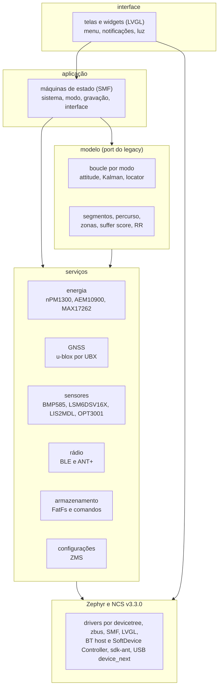

As camadas só se falam para baixo por chamada e para cima por evento: um serviço nunca chama a interface, publica um evento que a interface escuta.

## Serviços

| Serviço | Responsável por | Publica | Hardware |
|---|---|---|---|
| Energia | ligar e desligar, ship mode, trilhos, carga pelo USB e pelo painel, estado de carga, desligamento automático, botão de ligar | estado da bateria e da carga, pedido de desligar | nPM1300, AEM10900, MAX17262 |
| GNSS | configuração por UBX, modos LEAP e potência plena, AssistNow, backup, reinício por falta de dado | uma posição por época (NAV-PVT), satélites | u-blox MAX-M10N-10B pelo TXU0204 |
| Sensores | barômetro a 10 Hz (como o legacy), IMU por FIFO, magnetômetro, luz ambiente | amostras filtradas | BMP585, LSM6DSV16X, LIS2MDL, OPT3001 |
| Rádio | BLE central (sensores e celular), ANT+ (HRM, BSC, FE-C), pareamento, religação | dados de cada sensor, estado de cada ligação | nRF54LM20A |
| Armazenamento | FatFs, formatos do legacy, lotes de gravação, carga de segmentos e percursos, modo MSC, comandos `$LOC`, `$DWN`, `$QRY` | resultados de carga, estado do cartão | SD NAND ou microSD no `spi00` |
| Configurações | FTP, peso, sensores pareados, campos das telas, calibração do magnetômetro | mudanças de configuração | ZMS no RRAM |

## Threads

Prioridade no Zephyr: número menor ganha. Os valores de pilha são estimativas de partida; a regra do projeto pede medir com `CONFIG_STACK_USAGE` e deixar 1 KB de folga.

| Thread | Prioridade | Pilha inicial | Acorda com | Faz |
|---|---|---|---|---|
| `sensors` | 4 | 1536 B | timer de 100 ms e interrupção da FIFO do IMU | lê os sensores e publica |
| `model` | 5 | 4096 B | qualquer evento que o modelo assina | o ciclo do modo (a `main_loop` de hoje), a única que escreve o modelo; publica uma cópia do estado por época |
| `radio` | 6 | 2048 B | eventos do BT e do ANT, timers de religação | máquinas de estado de cada sensor, conversão em eventos |
| `ui` | 7 | 4096 B | cópia nova do modelo, botão, notificação, timer do LVGL | compõe e envia a tela, menu, luz |
| `storage` | 8 | 3072 B | lote de gravação, pedido de carga, comando | FatFs e comandos |
| `power` | 9 | 1536 B | interrupções do nPM1300, do AEM10900 e do MAX17262, timer de 60 s | energia, carga, desligamento |

Ficam por conta do Zephyr e do NCS: as threads do BT host e do MPSL, as do `sdk-ant`, a do subsistema de entrada, o workqueue do modem (onde rodam os callbacks do GNSS), o workqueue do sistema, o log e o idle. Cada thread da aplicação tem o seu canal de 4 s no `task_wdt`, como hoje ([05](05-arquitetura-zephyr.md#watchdog)), com `CONFIG_TASK_WDT_CHANNELS` acima dos 5 do padrão.

## Eventos

O zbus passa mensagens por canais com cópia: quem publica não espera quem lê, e quem lê recebe um retrato consistente, sem a trava que a interface usa hoje (`model_lock()`).

| Canal | Quem publica | Quem assina | Ritmo | Conteúdo |
|---|---|---|---|---|
| `gnss_fix` | GNSS | modelo | 1 Hz | posição, velocidade, rumo, altitude, hora, precisão, satélites |
| `baro` | sensores | modelo | 10 Hz | pressão e temperatura |
| `imu` | sensores | modelo | 1 Hz (lote da FIFO) | inclinação, rugosidade, movimento |
| `mag` | sensores | modelo | 1 Hz | rumo magnético |
| `ambient` | sensores | interface | 1 Hz | lux |
| `ext_sensor` | rádio | modelo | por dado | FC e RR, potência, cadência, velocidade, rolo |
| `phone` | rádio | modelo | por dado | posição do celular (LNS), curva do Komoot |
| `link_status` | rádio | interface | por mudança | estado de cada sensor |
| `model_state` | modelo | interface, armazenamento, rádio | por época | o retrato do modelo que as telas mostram |
| `notif` | modelo, rádio, energia, armazenamento | interface | por evento | notificação com tipo e duração |
| `log_record` | modelo | armazenamento | a cada lote (5 snapshots de 15 m) | registros do log |
| `power_status` | energia | interface, modelo | por mudança e a cada 60 s | tensão, estado de carga, fonte de carga, temperatura |
| `system_cmd` | interface, energia, armazenamento | aplicação | por evento | trocar modo, desligar, entrar em MSC |
| `input` | subsistema de entrada | interface | por botão | botão e tipo de toque |

## Fluxo de dados

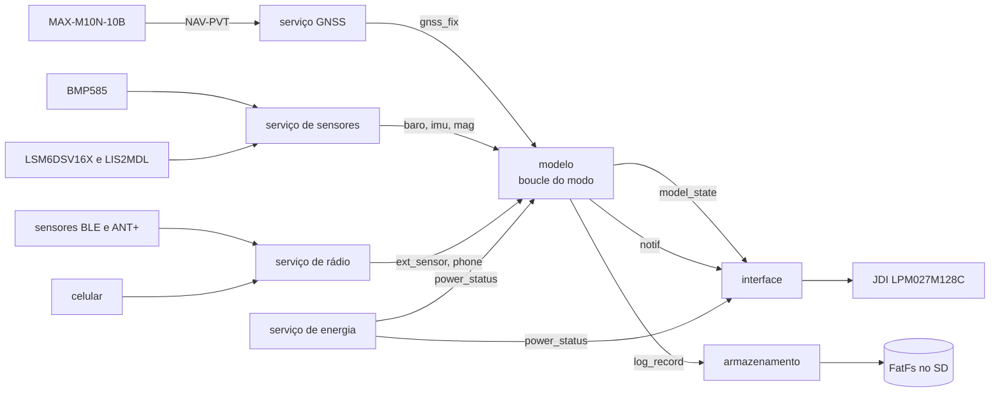

## Máquinas de estado

Todas no SMF do Zephyr, com estados hierárquicos e ações de entrada, execução e saída; cada máquina roda na thread do serviço que a possui. A dos segmentos continua a do legacy ([06](06-algoritmos.md#segmentos)).

| Máquina | Dono | Origem |
|---|---|---|
| Sistema e energia | serviço de energia | nova; desligamento automático do legacy (`legacy/source/scheduling/power_scheduler.cpp:16-46`) |
| Modo | modelo | `boucle__change_mode()` (`legacy/source/model/Boucle.cpp:101-143`) |
| Gravação | modelo | log do legacy (`Attitude::computeDistance`, `legacy/source/model/Attitude.cpp:431-490`) |
| GNSS | serviço GNSS | `GPS_MGMT` (`legacy/source/sensors/GPSMGMT.cpp:143-265`), refeita para UBX |
| Sensor externo | serviço de rádio, uma por sensor | pareamento do `ant_device_manager` e reaberturas do HRM ([07](07-radio-ant-ble.md#ant-no-legacy)) |
| Carga | serviço de energia | nova |
| Interface | interface | telas por modo e menu (`legacy/source/vue/Vue.h:21-26`, `legacy/source/vue/Menuable.cpp:255-294`) |
| Luz do display | interface | nova (a V3 não tem luz) |
| Segmento | modelo | legacy, sem mudança |

### Sistema e energia

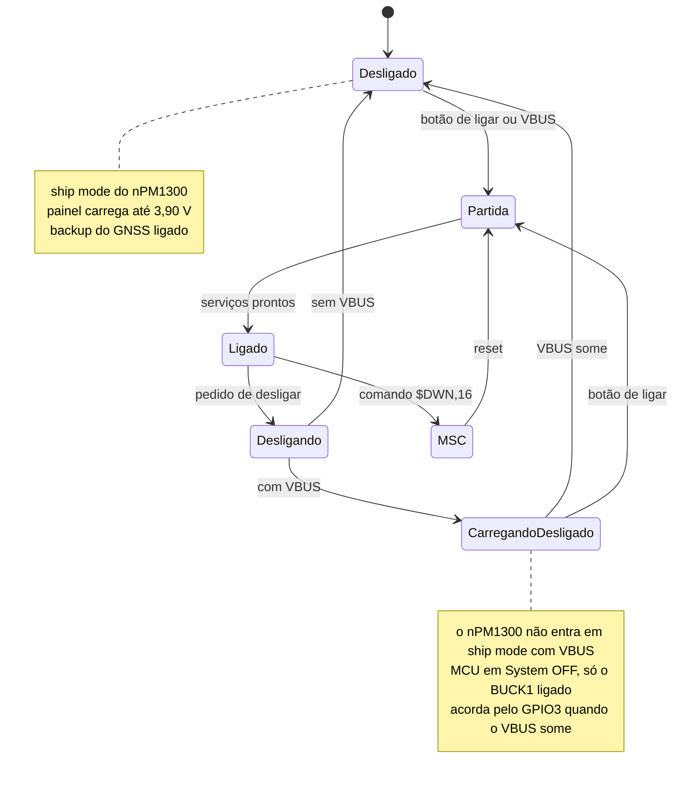

- **Pedido de desligar:** menu, botão de ligar mantido apertado, 15 min sem ping ou bateria crítica.
- **Desligamento automático:** 15 min sem ping desligam, como no legacy. O ping vem de cada localização processada em CRS e PRC (`legacy/source/model/BoucleCRS.cpp:197`) e de cada dado do rolo em FEC (`legacy/source/model/BoucleFEC.cpp:83`). Parado com fix, o legacy nunca desliga; pingar só em movimento é uma **proposta**, a decidir.
- **Bateria crítica:** nova. Quando o MAX17262 marca a bateria no fim, o aparelho grava e desliga antes do PCM cortar a célula.
- **Botão de ligar:** o nPM1300 liga pelo SHPHLD e avisa o MCU pelo GPIO3, como a amostra `npm13xx_one_button`; o desligamento pelo botão longo sai da mesma amostra.

### Modo

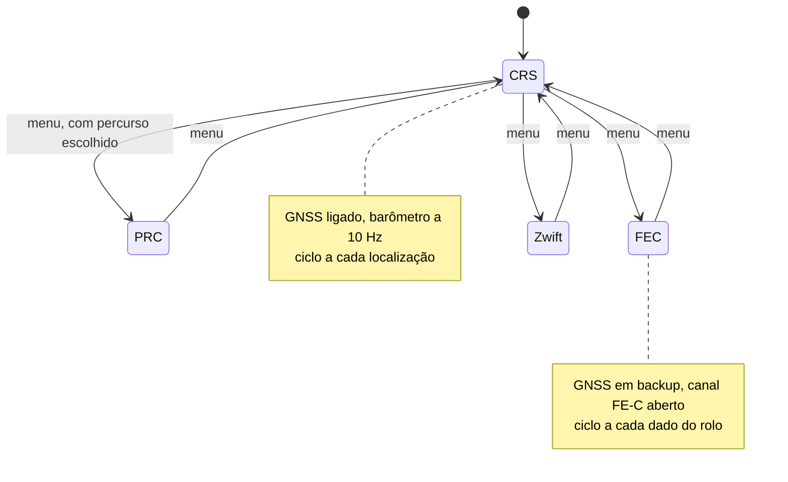

- A troca repete o legacy: libera a espera, invalida o modo antigo e inicia o novo sob demanda (`legacy/source/model/Boucle.cpp:101-143`).
- O GNSS segue o modo: acorda em CRS e PRC (`legacy/source/model/BoucleCRS.cpp:38`) e dorme em FEC e Zwift (`legacy/source/model/BoucleFEC.cpp:45`). No u-blox, dormir é mandar `UBX-RXM-PMREQ` e desligar o BUCK2, com o backup mantido.
- O MSC fica na máquina de sistema, porque desmonta o FatFs e para o modelo.

### Gravação

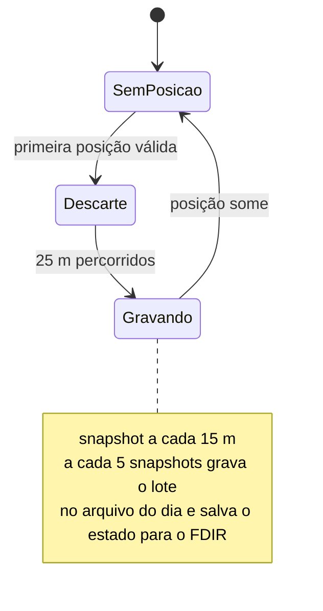

É a gravação do legacy: contínua em CRS e PRC, num arquivo por dia (`@DDMMYY.txt`, [09](09-armazenamento-usb.md#arquivos-do-legacy)), sem início nem fim explícitos. Atividade com início, pausa e fim, e exportação em FIT ou GPX para o Strava, é **proposta** ligada aos formatos no SD, que continuam em aberto.

### GNSS

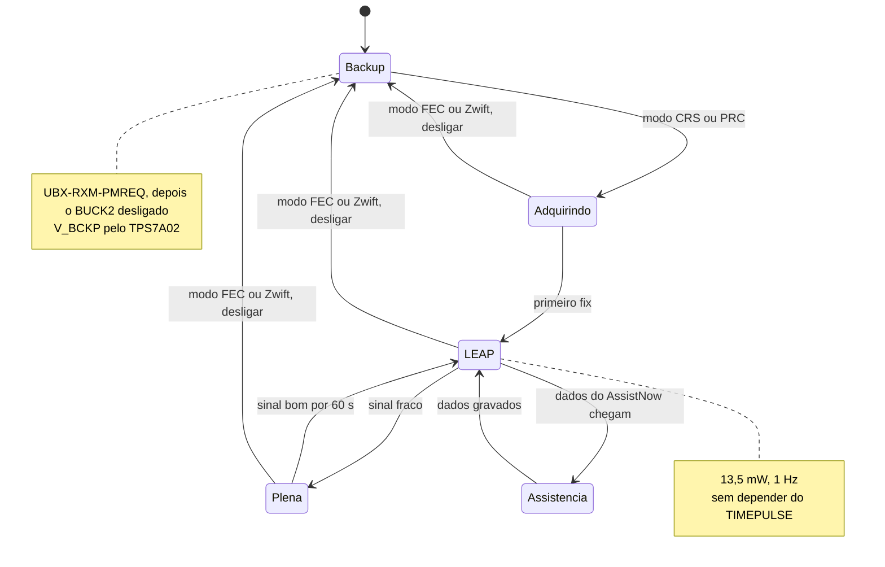

- **Sinal fraco:** fix perdido, ou precisão estimada pior que um limite a ajustar na bancada. O LEAP rastreia até −159 dBm e a potência plena até −167 dBm ([15](15-avaliacao-componentes.md#escolha-max-m10n-10b)).
- **Assistência:** a SPG 5.30 pede o LEAP desligado enquanto os dados do AssistNow Live Orbits vão para a flash do módulo.
- **Vigia:** o legacy reinicia a UART quando passa 3 s sem hora nem satélites (`legacy/source/sensors/GPSMGMT.cpp:143-176`). No u-blox, 3 s sem NAV-PVT com o módulo ligado reiniciam pelo RESET_N e reconfiguram.
- **Ajuda do celular:** o legacy manda a posição do LNS ao GPS depois de 5 posições seguidas (`legacy/source/model/Locator.cpp:217`); no u-blox é o `UBX-MGA-INI-POS_LLH`.

### Sensor externo

Uma máquina por sensor pareado: frequência cardíaca, velocidade e cadência, potência, rolo, e o que o catálogo de dispositivos acrescentar ([07](07-radio-ant-ble.md) tem a base).

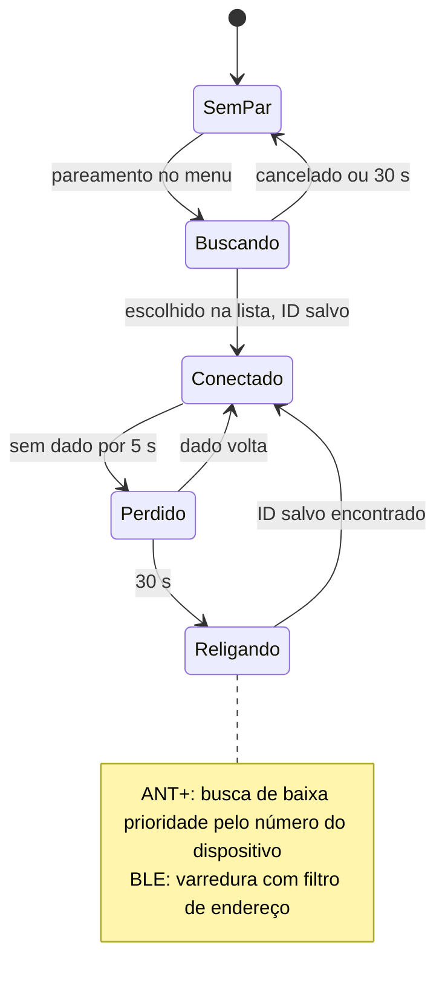

- O pareamento do legacy busca em fundo e lista até 7 sensores com ID e RSSI (`legacy/rf/ant_device_manager.cpp`, [07](07-radio-ant-ble.md#ant-no-legacy)).
- Os tempos (5 s, 30 s) são de partida; o HRM do legacy reabre o canal até 5 vezes.

### Carga

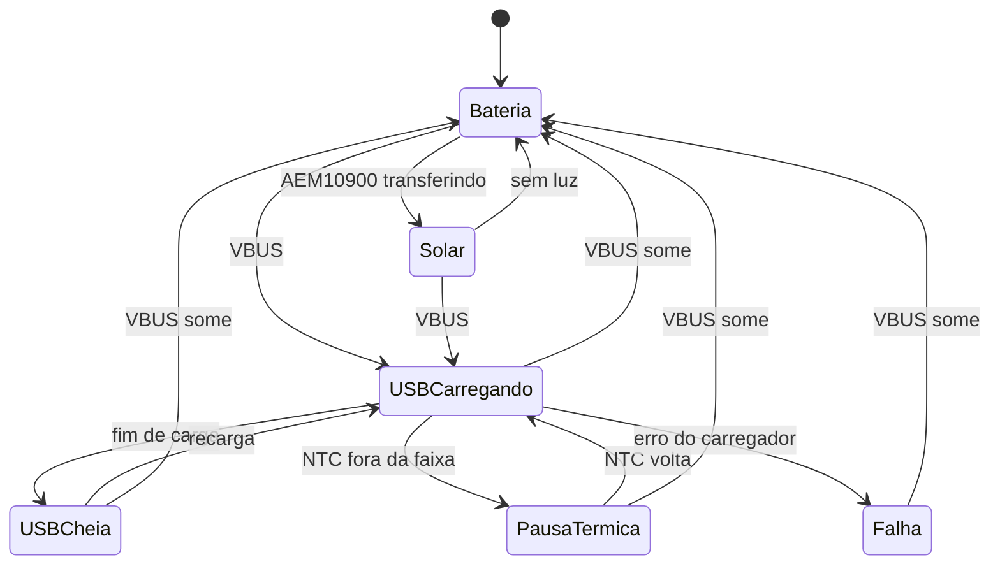

- A máquina só mostra o que os carregadores fazem sozinhos ([15](15-avaliacao-componentes.md#convivência-das-duas-cargas)): com VBUS, o hardware bloqueia o solar e só o nPM1300 carrega.
- Fontes: estado do carregador e erros do nPM1300, interrupção e APM do AEM10900, estado de carga e corrente do MAX17262.

### Interface

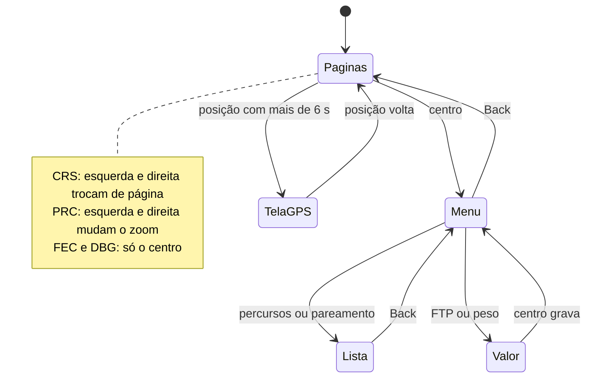

- Botões e menu do legacy ([08](08-interface.md#botões)); nos primeiros 5 s depois da partida o menu não abre (`legacy/source/vue/Menuable.cpp:326`).
- Notificações ficam por cima de qualquer estado: fila de até 10, a primeira por cerca de 6 s ([08](08-interface.md#notificações)).
- As telas de cada estado partem das do legacy ([08](08-interface.md#telas-por-modo)).

### Luz do display

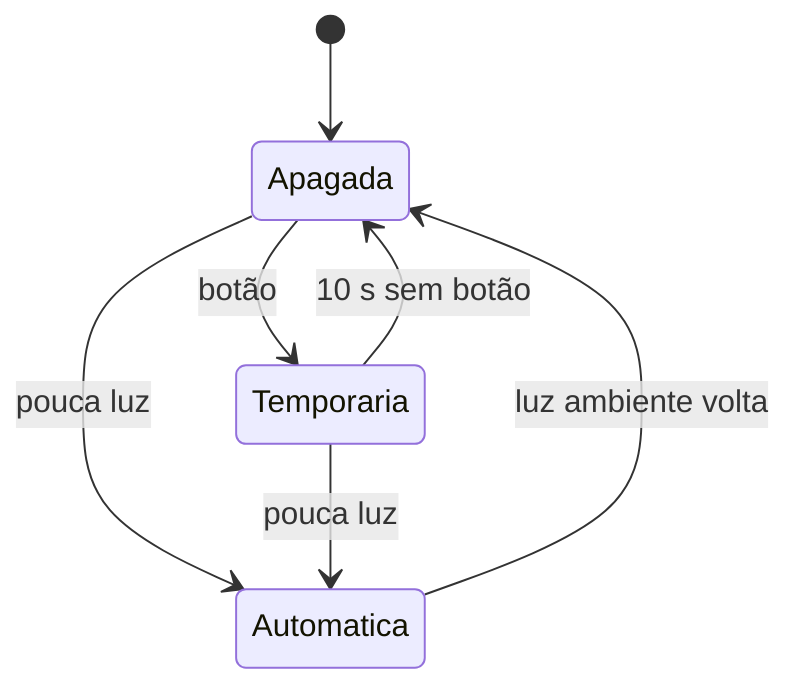

Nova: a V3 não tem luz. O OPT3001 decide "pouca luz", com histerese para não piscar; limite, tempo e brilho (PWM) se ajustam na bancada. Com a luz acesa, a ficha do JDI pede o COM perto de 60 Hz; como o COM é metade do EXTCOMIN (até 70 e 140 Hz na ficha), o EXTCOMIN vai a cerca de 120 Hz, e volta a 1 Hz com a luz apagada.

## Partida e desligamento

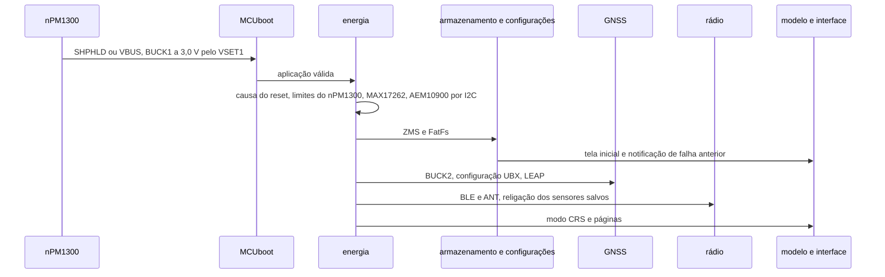

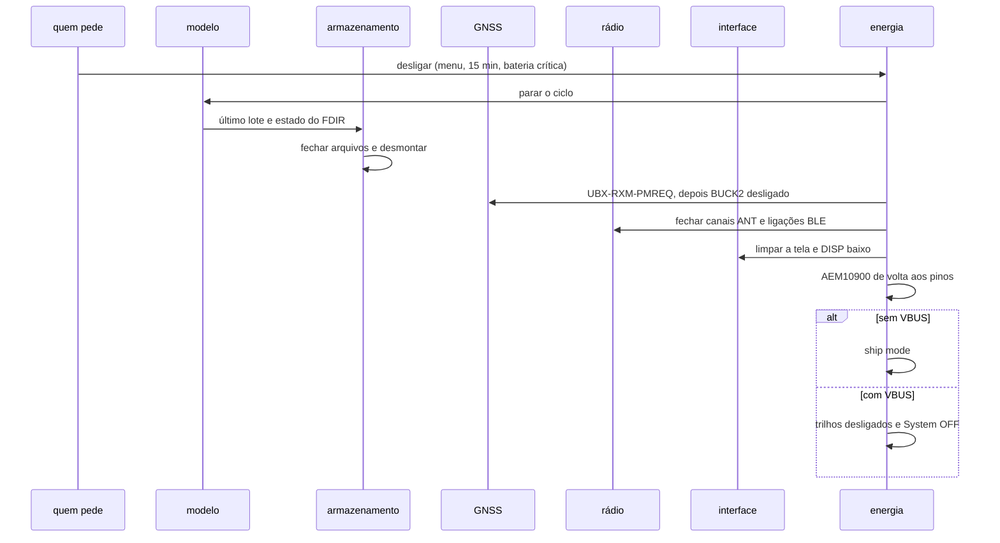

- O legacy zera o estado salvo da atividade antes de desligar (`legacy/source/scheduling/power_scheduler.cpp:36-37`); o port faz o mesmo.
- A tela MIP precisa da inversão do VCOM enquanto mostra imagem: antes de parar o MCU, ela fica limpa e com DISP baixo.

## Energia por estado

| Estado | MCU | BUCK1 3V0 | BUCK2 1V8 | LDSW1 | GNSS | Rádio | Tela | Consumo |
|---|---|---|---|---|---|---|---|---|
| Desligado | sem alimentação | desligado | desligado | desligado | backup | desligado | desligada | cerca de 40 µA ([14](14-hardware-placa-nova.md#estados-de-energia)) |
| Carregando desligado | System OFF | ligado | desligado | desligado | backup | desligado | desligada | do USB |
| CRS ou PRC | ativo entre eventos | ligado | ligado | em lotes | LEAP | ligações e canais abertos | 1 quadro/s | cerca de 21 mW ([15](15-avaliacao-componentes.md#efeito-no-aparelho)) |
| FEC ou Zwift | ativo entre eventos | ligado | desligado | em lotes | backup | canal FE-C e sensores | 1 quadro/s | a medir |
| MSC | ativo | ligado | desligado | ligado | backup | desligado | parada | do USB |

## Armazenamento

- **FatFs** no SD NAND do produto ou no microSD do protótipo, pelo `spi00` ([15](15-avaliacao-componentes.md#armazenamento)); os formatos são os do legacy: segmentos, `*.PAR`, `@DDMMYY.txt` ([09](09-armazenamento-usb.md#arquivos-do-legacy)).
- **Lotes:** o modelo manda 5 snapshots por vez, como o legacy; a thread de armazenamento liga a LDSW1, grava, sincroniza e pode desligar a chave de novo.
- **Carga de segmentos e percursos:** pedido do modelo e resposta por evento, fora da thread do modelo, porque ler o SD pode passar de 4 s ([05](05-arquitetura-zephyr.md#watchdog)).
- **Configurações** no ZMS do RRAM, como o port já faz no nRF54LM20 DK.
- **MSC:** desmonta o FatFs antes de expor o disco pelo USB, como o legacy faz com `$DWN,16`.

## Comunicação

| Canal | Uso | Base |
|---|---|---|
| USB | CDC ACM para comandos e log; MSC para os arquivos | USB `device_next` |
| BLE central | sensores (FC, potência, velocidade e cadência, rolo), celular (LNS, Komoot), ponte com o stravaAP pelo NUS | BT host do Zephyr e clientes do NCS |
| ANT+ | HRM, BSC e FE-C nos canais do legacy, busca em fundo para o pareamento | `sdk-ant` v2.1.1 ([07](07-radio-ant-ble.md#ant-no-ncs-v330)) |
| Comandos | `$LOC`, `$DWN`, `$QRY` pelo USB e pelo NUS | VParser do legacy ([07](07-radio-ant-ble.md#stravaap-e-comandos)) |

O que o legacy usa e o que o `sdk-ant` oferece estão em [07](07-radio-ant-ble.md); a lista completa de dispositivos, com perfis e prioridades, fica num catálogo próprio.

## Atualização de firmware

- **MCUboot** pelo sysbuild. O mapa padrão do nRF54LM20 tem 64 KB para o MCUboot, duas imagens de 920 KB e 36 KB de armazenamento (`nrf54lm20_a_b_cpuapp_partition.dtsi`); o firmware com ANT ocupa cerca de 330 KB hoje ([03](03-ambiente-build.md#resultado-de-referência)), então cabe com folga. O port já compila sem o Partition Manager (`SB_CONFIG_PARTITION_MANAGER=n`), e esse mapa do devicetree vale.
- **Modo e assinatura:** no nRF54L o NCS usa `SWAP_USING_MOVE` e ED25519 por padrão; a chave fica fora do repositório.
- **Transporte:** mcumgr (SMP) pelo USB, pelo transporte UART sobre o CDC ACM (a amostra `usb_mcumgr` do NCS faz isso no nRF54LM20 DK), e pelo BLE, que pede o papel periférico ([decisões em aberto](#decisões-em-aberto)).

## Falhas

- **Watchdog:** um canal de 4 s por thread no `task_wdt`, com o WDT do nRF por trás ([05](05-arquitetura-zephyr.md#watchdog)).
- **FDIR:** o estado salvo da atividade volta depois de um reset, como o `crash_recovery` do port e o FDIR do legacy ([06](06-algoritmos.md#distância-acumulada-e-log)).
- **Queda de tensão:** o comparador de falha de energia (POF) do nPM1300 avisa quando o VSYS cai; o firmware usa o aviso para gravar o lote pendente.
- **Falha anterior:** a causa do reset e o registro de falha aparecem numa notificação na partida, como no legacy ([04](04-arquitetura-legacy.md#boot)).

## Migração do port

| Hoje ([05](05-arquitetura-zephyr.md)) | Alvo |
|---|---|
| `main_loop` a cada 100 ms, com botões por varredura | thread `model` que dorme até um evento; botões pelo subsistema de entrada |
| `display` a cada 50 ms, lendo o modelo sob `model_lock()` | thread `ui` com LVGL, lendo a cópia do `model_state` |
| `hal_gpio`, `hal_i2c`, `hal_spi`, `hal_uart` | drivers do Zephyr direto, pelo devicetree |
| `gps_mgmt`, `nmea_parser`, `gps_epo` (MediaTek) | serviço GNSS por UBX, com AssistNow no lugar do EPO |
| `ls027` | driver do JDI e LVGL; o Sharp no mesmo conector |
| BME280, FXOS8700, STC3100 | BMP585, LSM6DSV16X e LIS2MDL, MAX17262 e nPM1300 |
| `power_scheduler` pelo STC3100 | máquina de sistema no serviço de energia, ship mode do nPM1300 |
| `neopixel` (WS2812) | `pwm-leds` com o LED RGB |
| `user_settings` | ZMS, sem mudança |
| `boucle`, `attitude`, segmentos, zonas | sem mudança de algoritmo; recebem eventos em vez de chamadas |

## Ordem de implementação

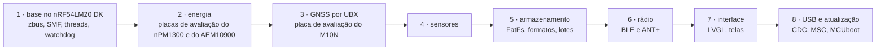

Encaixa no roteiro de [10](10-status-do-port.md#roteiro): os passos 1 e 2 fecham a fase 1 na placa própria, e os demais seguem as fases 2 a 7.

## Decisões em aberto

| Decisão | Opções | Onde pesa |
|---|---|---|
| Desligamento automático parado com fix | como o legacy (não desliga) ou pingar só em movimento | [Sistema e energia](#sistema-e-energia) |
| Atividade e formato de exportação | log contínuo do legacy, ou atividade com início, pausa e fim e arquivo FIT ou GPX | [Gravação](#gravação) |
| Saída do MSC | só com reset, como o legacy, ou ao desconectar o USB | [Sistema e energia](#sistema-e-energia) |
| BLE periférico | só central, como o legacy, ou também periférico para um aplicativo e para atualizar o firmware sem cabo | [Comunicação](#comunicação) e [Atualização de firmware](#atualização-de-firmware) |
