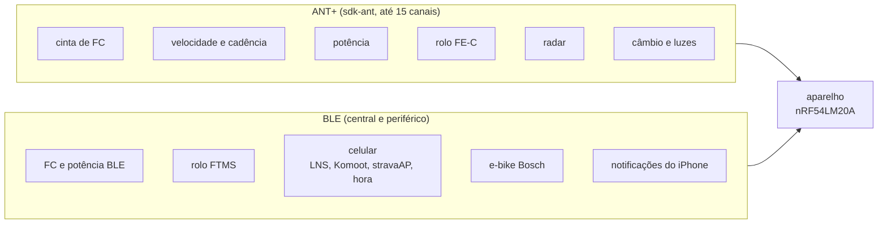

# Dispositivos BLE e ANT+

Catálogo dos dispositivos externos que um computador de bordo de ciclismo encontra, com o protocolo de cada um (perfil ANT+ ou serviço BLE), o que o `sdk-ant` e o NCS já oferecem, a prioridade para o port e o que é fechado. O que o legacy usa e o mapa da API do `sdk-ant` estão em [07-radio-ant-ble.md](07-radio-ant-ble.md); a máquina de estado de cada sensor, em [16](16-arquitetura-firmware.md#sensor-externo).

> [!IMPORTANT]
> Levantamento de 2026-09-18, sobre páginas de fabricantes, o SDK FIT da Garmin, os números atribuídos do Bluetooth SIG e o NCS v3.3.0 e o `sdk-ant` v2.1.1 locais. Nenhum dispositivo foi testado com o port. Os documentos de perfil ANT+ ficam fora do repositório, pelo ANT+ Adopter Agreement ([07](07-radio-ant-ble.md#decisão-ant-e-ble)).

**Nesta página:** [Situação do ANT+](#situação-do-ant) · [Prioridades](#prioridades) · [Topologia](#topologia) · [Catálogo](#catálogo) · [O que já existe](#o-que-já-existe) · [Limites do rádio](#limites-do-rádio) · [Pareamento](#pareamento) · [Decisões](#decisões) · [Referências](#referências)

## Situação do ANT+

- Os programas de membros e de certificação do ANT+ terminaram em 30/06/2025; licenças ANT e IDs de fabricante continuam ([07](07-radio-ant-ble.md#decisão-ant-e-ble)). Perfis novos não vão sair (DC Rainmaker, 2025).
- Os documentos de perfil continuam na página de downloads da Garmin, sob o acordo.
- **Custo da pilha ANT no nRF Connect SDK:** a chave de avaliação é grátis, mas "not to be used for any commercial or revenue-generating purpose"; a licença comercial custa US$ 0,08 por unidade, com mínimo de US$ 800 por semestre (página da Garmin sobre o ANT no NCS).

## Prioridades

| Prioridade | Critério |
|---|---|
| P1 | o legacy já usa: paridade é obrigatória |
| P2 | comum no mercado e barato de fazer com o que o SDK já tem |
| P3 | útil, mas depende de protocolo sem suporte pronto ou de pouco uso |
| Fora | protocolo fechado ou sem documentação pública |

## Topologia

## Catálogo

Os números de tipo de dispositivo ANT+ vêm do SDK FIT da Garmin (enum `antplus_device_type`); os UUIDs BLE, dos números atribuídos do Bluetooth SIG.

| Dispositivo | ANT+ | BLE | Dados | Pronto no SDK | Prioridade |
|---|---|---|---|---|---|
| Cinta de FC, relógio que retransmite | Heart Rate, tipo 120 | Heart Rate, 0x180D | FC e intervalos RR | ANT: `ant_hrm`; BLE: `hrs_client` do NCS | P1 (o legacy usa ANT+) |
| Velocidade e cadência | Bike Speed and Cadence, tipos 121 (combinado), 122 (cadência), 123 (velocidade) | Cycling Speed and Cadence, 0x1816 | voltas da roda e do pedivela com tempo | ANT: `ant_bsc`; BLE: cliente próprio (o port tem um) | P1 (o legacy usa o combinado ANT+) |
| Medidor de potência | Bicycle Power, tipo 11 | Cycling Power, 0x1818 | potência, cadência, torque, balanço entre as pernas, energia | **feito pelo BLE** (`model/cps_parse.c` + `rf/ble_cps_client.c`, 2026-09-22); pelo ANT+, só a tubulação, porque o perfil não pode entrar num repositório público (`rf/power_ant.h`) | P1 no BLE (o legacy lê potência e vetor pelo CPS); P2 no ANT+ |
| Rolo inteligente | Fitness Equipment (FE-C), tipo 17 | Fitness Machine (FTMS), 0x1826 | potência, velocidade, tempo; controle de carga, resistência e inclinação | ANT: não há perfil, o `fec.c` do legacy vai sobre canais crus; BLE: cliente próprio (o port tem um) | P1 (o legacy usa FE-C) |
| Posição do celular | — | Location and Navigation, 0x1819 | posição e velocidade | **feito** em 2026-09-22 (`model/lns_parse.c` + `rf/ble_lns_client.c`); só `LNS_POS_OK` é aceito | P1 (o legacy usa) |
| Navegação do Komoot | — | serviço próprio do Komoot | curva a curva | cliente próprio, ligado ao modelo em 2026-09-22 (`model/komoot_turn.c` traduz as 24 direções nas 9 setas) | P1 (o legacy usa) |
| Ponte com o stravaAP | — | NUS | comandos e arquivos | `nus_client` do NCS | P1 (o legacy usa) |
| Notificações do celular | — | Apple Notification Center Service | chamada, mensagem, agenda | **feito** pelo `ancs_client` do NCS (`rf/ble_ancs_client.c`, 2026-09-22), com o filtro em `model/notif_filter.c`; **só iPhone**, porque o Android não tem serviço equivalente | P2 |
| Hora do celular | — | Current Time, 0x1805 | hora | `cts_client` do NCS | P2 |
| Bateria dos sensores | páginas comuns 80 e 81 | Battery, 0x180F | nível de bateria | ANT: `ant_common`; BLE: `bas_client` | P2 |
| Radar traseiro (Garmin Varia, Wahoo TRACKR, Bryton Gardia, Magene L508) | Bike Radar, tipo 40 | só proprietário | distância, velocidade e ameaça de cada veículo | **feito pelo BLE** (`rf/ble_radar_client.c`); pelo ANT+, só a tubulação, porque o perfil não pode entrar num repositório público ([09](09-armazenamento-usb.md) e `rf/radar_ant.h`) | o formato BLE é de engenharia reversa e **não foi conferido em aparelho** |
| Luzes (Garmin Varia, Bryton) | Bike Lights, tipos 35 e 36 | proprietário | modo e tipo de luz | não há perfil; o perfil não aparece na lista de downloads da Garmin | P3 |
| Câmbio eletrônico SRAM AXS, Campagnolo EPS, FSA | Shifting, tipo 34 | — | marcha e bateria | não há perfil | P3 |
| Câmbio Shimano Di2 | canal ANT privado, sob licença da Shimano | — | marcha e bateria | fechado (a Shimano cassou a licença de um fabricante em 2022) | Fora |
| E-bike genérica | Light Electric Vehicle, tipo 20 | — | autonomia, modo de assistência, potência do motor | não há perfil | P3: nem toda e-bike transmite |
| E-bike Bosch (smart system) | — | Live Data Interface da Bosch (serviço `eb20`) | velocidade, bateria, potência do ciclista, cadência, odômetro, luz | cliente próprio; exige o papel periférico, MTU de 247 e protobuf | P3 |
| E-bike Shimano STEPS, Specialized, Brose | — | — | — | sem documentação pública encontrada | Fora (não confirmado) |
| Temperatura central (CORE) | CoreTemp, fora da lista pública | Health Thermometer, 0x1809, e um serviço próprio documentado pela CORE | temperatura central e da pele | o lado BLE é público | P3 |
| Oxigenação muscular (Moxy) | Muscle Oxygen, tipo 31 | — | SmO2 e hemoglobina total | não há perfil | P3 |
| Temperatura ambiente (Garmin Tempe) | Environment, tipo 25 | Environmental Sensing, 0x181A | temperatura | não há perfil nem cliente | P3 (o aparelho já tem barômetro com temperatura) |
| Controle remoto | Controls, tipo 16 | HID, 0x1812 | botões | ANT: não há perfil; BLE: `hogp` do NCS | P3 |
| Mídia do iPhone | — | AMS da Apple | faixa, artista e controle de reprodução | `ams_client` do NCS; exige o papel periférico, que o port já tem | P3 (as notificações estão feitas, na linha "Notificações do celular") |
| Notificações do Android | — | exige aplicativo próprio | — | — | Fora (sem aplicativo) |
| Pressão do pneu (Quarq TyreWiz) | perfil fora da lista pública | não confirmado | pressão | — | Fora (não confirmado) |
| Suspensão e canote (RockShox Flight Attendant, Reverb) | há perfis na lista, mas o uso por esses produtos não foi confirmado | fechado | — | — | Fora |
| Garmin inReach | canal ANT privado | — | — | — | Fora |
| Sensor de corrida (footpod) | Stride, tipo 124 | Running Speed and Cadence, 0x1814 | passo | — | Fora (não é ciclismo) |

Rolos do mercado, pelas análises do DC Rainmaker: o Wahoo KICKR CORE 2 e o Elite Avanti falam FE-C e FTMS; o Tacx NEO Bike Plus trocou o FE-C sobre BLE proprietário pelo FTMS e aceita uma conexão BLE só. Com FE-C e FTMS, o port cobre os três.

## O que já existe

| Camada | Pronto | A escrever |
|---|---|---|
| `sdk-ant` v2.1.1 | perfis `ant_hrm`, `ant_bsc`, `ant_bpwr` (parcial) e `ant_common`; amostras de recepção e transmissão; busca em fundo (`ant_bgnd_scan`) | FE-C, radar, luzes, câmbio, LEV, oxigenação e ambiente sobre canais crus (`include/ant_interface.h`), a partir dos documentos de perfil |
| Port, lado ANT+ | o firmware **abre canais escravos** desde 2026-09-22: `src/rf/ant/ant_channel.c` abre e fecha um canal, e `ant_sensors.c`, `radar_ant.c` e `power_ant.c` pedem um canal para a cinta, o sensor de velocidade e cadência, o radar e o medidor de potência | **nenhum canal abre de fato neste repositório.** Os `CONFIG_GNSS_ANT_*_DEV_TYPE` valem 0 (`zephyr_app/Kconfig:80-172`), e com zero o `ant_ch_open()` devolve `-ENOTSUP`. Falta a decodificação das páginas, em `src/rf/ant/radar_pages.c`, `power_pages.c` e `sensor_pages.c`, que **não existem no repositório nem na máquina do projeto** e estão no `.gitignore:27-29`: os perfis ANT+ estão sob a ANT+ Shared Source License, o ANT+ Adopter Agreement proíbe redistribuí-los e este repositório é público ([07](07-radio-ant-ble.md#decisão-ant-e-ble)). Sem esses arquivos valem as definições fracas de `ant_sensors.c`, que não decodificam nada; o dono escreve os três na máquina dele e liga os `DEV_TYPE` |
| NCS v3.3.0, clientes BLE | `hrs_client`, `bas_client`, `nus_client`, `cts_client`, `hogp`, `ancs_client`, `ams_client`; `BT_GATT_DM` para descobrir serviços e `BT_SCAN` para filtrar a varredura | CSC, CPS, FTMS, LNS, Komoot (o port tem versões com defeitos conhecidos, [07](07-radio-ant-ble.md#o-que-falta)), Bosch, CORE |

## Limites do rádio

| Item | Valor | Onde |
|---|---|---|
| Canais ANT | até 15 (`CONFIG_ANT_TOTAL_CHANNELS_ALLOCATED`, padrão 15) | `sdk-ant/init/Kconfig` |
| Recursos ANT fora do add-on | PA/LNA, Time Sync, Scanning Channel e busca de alta prioridade; a busca em fundo funciona | notas da versão 2.1.1 |
| Relógio de 32,768 kHz | cristal de ±50 ppm no máximo | `sdk-ant/doc/compatibility.rst` |
| Conexões BLE | `CONFIG_BT_MAX_CONN`; os centrais são o total menos `CONFIG_BT_CTLR_SDC_PERIPHERAL_COUNT` | Zephyr e controlador do NCS |
| Convivência ANT e BLE | testada pela Garmin só na configuração padrão das amostras; a amostra de núcleo único `ble_ant_app_hrm` lista o nRF54LM20 DK, mas só como build (`build_only`), com `CONFIG_BT_MAX_CONN=2` | `sdk-ant/doc/releases`, `samples/ble_ant_app_hrm` |

Orçamento de partida, a medir no DK:

- **ANT:** HRM, BSC (ou velocidade e cadência separados), potência, FE-C, radar, luz, câmbio e LEV, mais a busca em fundo: 9 a 10 dos 15 canais.
- **BLE central:** FC, velocidade e cadência, potência, rolo, celular (LNS, Komoot e NUS no mesmo link): 5 a 6 links.
- **BLE periférico:** 1 a 2 links (Bosch, iPhone, atualização de firmware). O papel entrou: o `prj.conf:185-186` liga `CONFIG_BT_PERIPHERAL=y` e `CONFIG_BT_CENTRAL=y`, com `CONFIG_BT_MAX_CONN=4` ([16](16-arquitetura-firmware.md#decisões-em-aberto)).
- **Risco:** um central BLE com muitos canais ANT no nRF54LM20A não foi testado pela Garmin; o teste de convivência no DK vem antes de prometer o catálogo inteiro.

## Pareamento

- **ANT+:** o sensor fica salvo pelo número do dispositivo, pelo tipo e pelo tipo de transmissão; a religação usa a busca de baixa prioridade, como o legacy ([07](07-radio-ant-ble.md#ant-no-legacy)).
- **BLE:** o sensor fica salvo pelo endereço (`bt_addr_le_t`); a varredura filtra pelo UUID do serviço na busca e pelo endereço na religação.
- **Uma lista só:** a tela de pareamento mostra ANT+ e BLE juntos, com ID e RSSI ([18](18-interface-telas.md#menus)); os pareados ficam no ZMS.
- **Mesmo sensor nos dois rádios:** muitos sensores falam ANT+ e BLE ao mesmo tempo; o aparelho usa um rádio por sensor. **Proposta:** o ANT+ na frente quando os dois aparecem, porque um canal ANT não ocupa uma das conexões BLE.

## Decisões

| Decisão | Proposta | Motivo |
|---|---|---|
| Ordem | P1 na fase 4 do roteiro, P2 logo depois, P3 sob demanda | paridade com o legacy primeiro ([10](10-status-do-port.md#roteiro)) |
| Radar | P2, pelo ANT+ | é o acessório de segurança mais pedido e só abre pelo ANT+ |
| Papel periférico | **feito** | abre a e-bike Bosch, as notificações do iPhone e a atualização sem cabo; ligado no `prj.conf:185-186` e exigido pelo `rf/ble_ancs_client.c`. Não testado com nenhum celular |
| Licença ANT | chave de avaliação no desenvolvimento; comercial antes de vender | a chave de avaliação proíbe uso comercial |

## Referências

- [07-radio-ant-ble.md](07-radio-ant-ble.md): ANT+ e BLE no legacy, a instalação do `sdk-ant` e o mapa da API.
- Garmin: página do ANT no nRF Connect SDK (licença e royalty), perguntas frequentes e downloads do programa ANT+ (lista de perfis), em developer.garmin.com/ant-program.
- Garmin, SDK FIT (`garmin_fit_sdk/profile.py`, enum `antplus_device_type`), em github.com/garmin/fit-python-sdk.
- Bluetooth SIG, números atribuídos (`service_uuids.yaml`, `characteristic_uuids.yaml`), em bitbucket.org/bluetooth-SIG/public.
- Bosch eBike Systems, "The smart system – Live Data Interface", V1.0, 2026-05-01.
- CORE, informações para desenvolvedores e o repositório CoreBodyTemp no GitHub.
- DC Rainmaker: fim do programa ANT+ (2025), radar Varia RearVue 820 (2026), Bryton Gardia (2023), Shimano e Hammerhead (2022), SRAM Red AXS (2024), KICKR CORE 2, Elite Avanti e Tacx NEO Bike Plus.
- Suporte da Hammerhead e da Wahoo: pareamento, radar, luzes, câmbio, e-bike, CORE, TyreWiz, notificações.
- NCS v3.3.0 local: `nrf/subsys/bluetooth/services`, `zephyr/subsys/bluetooth/services`; `sdk-ant` v2.1.1 local: `lib/ant_profiles`, `init/Kconfig`, `doc/compatibility.rst`, `doc/releases/release-notes-2.1.1.rst`, `samples/ble_ant_app_hrm`.
