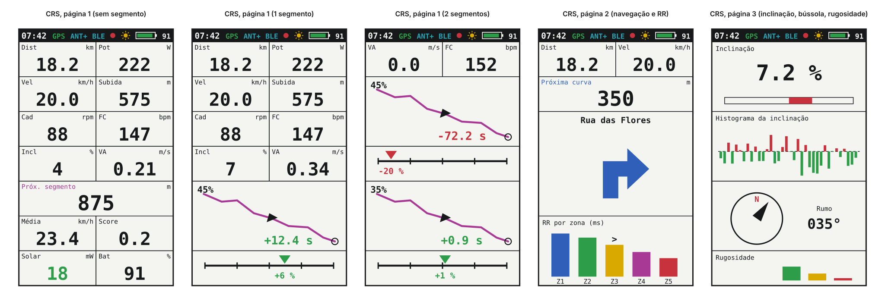
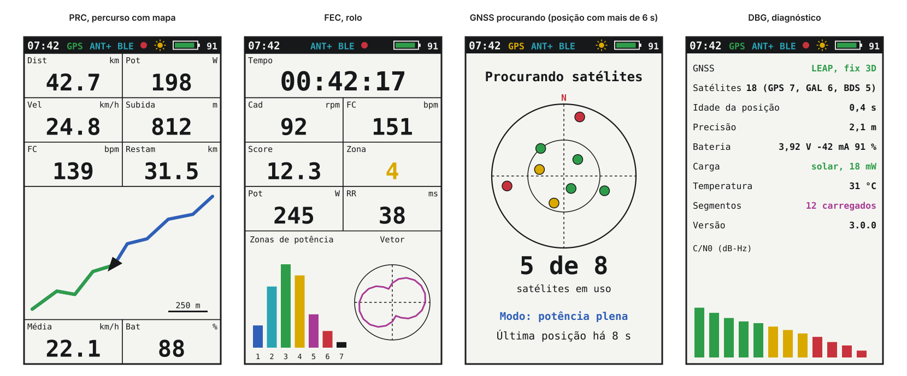
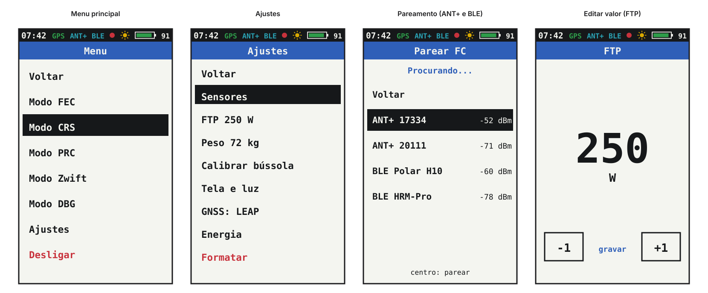
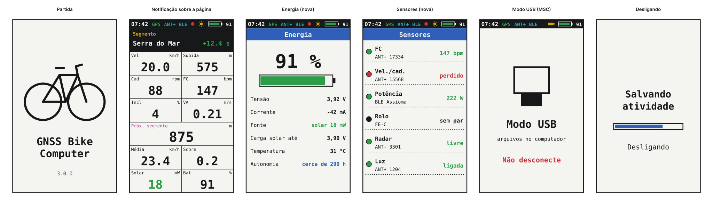

# Interface e telas

Interface gráfica do firmware da placa nova: a tela, o framework de desenho, a paleta de 8 cores, a grade, a barra de estado, as fontes, os botões, a luz e o ritmo de atualização, e todas as telas, com maquetes. As telas partem das do legacy ([08-interface.md](08-interface.md)); a navegação entre elas é a máquina de estado de [16](16-arquitetura-firmware.md#interface).

> [!IMPORTANT]
> Plano, não implementação. As maquetes saem de `tools/docs/screens_drawing.py`, em 240 × 400 e só com as 8 cores da tela, nos tons apagados que um painel refletivo mostra; o texto das maquetes usa a fonte do navegador, e a tela real usa fontes de 1 bit. Nada foi testado em placa.

**Nesta página:** [Tela](#tela) · [Framework](#framework) · [Paleta](#paleta) · [Grade e barra de estado](#grade-e-barra-de-estado) · [Fontes e textos](#fontes-e-textos) · [Telas](#telas) · [Botões](#botões) · [Atualização e luz](#atualização-e-luz) · [Memória](#memória) · [Diferenças para o legacy](#diferenças-para-o-legacy)

## Tela

| Item | Valor | Fonte |
|---|---|---|
| Painel | JDI LPM027M128C, MIP refletivo de 8 cores (1 bit por canal), 2,7", 400 × 240 | [15](15-avaliacao-componentes.md#display) |
| Montagem | retrato, 240 de largura por 400 de altura, como a V3 | [08](08-interface.md#display) |
| Escrita | por linha física, em modos de 1, 3 ou 4 bits por pixel; endereço de linha de 10 bits | ficha LPM027M128B, seção 6 |
| SPI | 1 MHz típico, 2 MHz no máximo | ficha, seção 4.2 |
| Consumo | 5 µW parada e 30 µW atualizando a tela toda a 1 Hz em 3 bits (141 µW no máximo) | ficha, seção 4.1 |
| COM | de 0,5 a 70 Hz; perto de 60 Hz com a luz acesa; o EXTCOMIN vai de 1 a 140 Hz | ficha, seção 4.2 |
| Luz | 16 mA na versão C | [14](14-hardware-placa-nova.md#componentes-principais) |
| Tela da lista de compras | Sharp LS027B7DH01A no mesmo conector, monocromática, com o filme de luz frontal da Azumo (10 mA): o JDI não tem canal autorizado de compra | [19](19-lista-de-compras.md#display) |

Como a tela comprável é a Sharp, **nenhuma informação depende só da cor**: à frente ou atrás do recorde leva o sinal (+ ou −), a zona leva o número, o sensor perdido leva a palavra. Na Sharp, as cores viram preto e branco e a interface continua completa; as maquetes mostram a versão de 8 cores, a do JDI.

## Framework

**Escolha: LVGL sobre um driver de tela próprio.** O LVGL traz o que o legacy fazia à mão e o que falta a ele: fontes com acentos, listas e menus navegados por teclado, gráficos, desenho de mapa em canvas e redesenho só da área que mudou. O driver próprio resolve o que nenhum driver do Zephyr faz para este painel.

| Peça | Situação no NCS v3.3.0 | Consequência |
|---|---|---|
| LVGL | `modules/lib/gui/lvgl`, versão 9.5 "dev" (instantâneo do master) com a integração em `zephyr/modules/lvgl` | trava a versão com o NCS; a API de uma versão de desenvolvimento pode mudar na próxima atualização do NCS |
| Suavização | `lv_display_set_antialiasing()` existe no LVGL 9.5 | desligada: com fontes de 1 bit e sem suavização, o desenho só usa as 8 cores da paleta |
| Driver JDI do Zephyr (`jdi,lpm013m126`) | largura e altura em `uint8_t` (até 255 px), só RGB565 na entrada, só linhas inteiras, cabeçalho de 8 bits de modo e 8 de endereço, sem pausa depois dos dados | não serve ao LPM027M128C, com linhas de 400 pixels, cabeçalho de 6 bits de modo e 10 de endereço e 16 clocks de pausa (ficha, seção 6.1) |
| Driver Sharp do Zephyr (`sharp,ls0xx`) | 1 bit (MONO01, que o LVGL trata como I1), uma instância, linhas inteiras | serve ao Sharp, mas sem retrato |
| Rotação | o LVGL não gira em 1 bit (`lv_draw_sw_rotate` não tem o caso I1) e nenhum dos dois drivers gira a tela | o retrato fica no driver próprio |
| Teclado | `gpio-keys`, `zephyr,input-longpress` e `zephyr,lvgl-keypad-input` | os 3 botões viram teclas de navegação do LVGL (anterior, confirma, próximo, e o toque longo) |

O **driver próprio** (a escrever, derivado do `display_lpm013m126.c`) apresenta ao LVGL uma tela de 240 × 400 em RGB565 e guarda um quadro de 3 bits na orientação do painel:

1. Cada escrita do LVGL entra transposta no quadro, como o `drawPixel` da V3 fazia ([08](08-interface.md#pipeline-de-desenho)), e marca as linhas físicas que mudaram.
2. No fim do quadro, só as linhas marcadas vão para o painel, no formato do LPM027.
3. O mesmo driver atende o Sharp em 1 bit (linhas de 50 B), e a interface troca a paleta por um tema preto e branco.
4. O EXTCOMIN continua num timer, como no driver do Zephyr, com a frequência trocada pela máquina de estado da luz.

**Alternativa descartada:** manter o desenho à mão do legacy (Adafruit GFX com a fonte `Org_01`). É leve e fiel, mas não tem acentos, listas, rolagem nem redesenho parcial, e o port já teria de reescrevê-lo para 8 cores e para o retrato.

## Paleta

| Cor | Uso |
|---|---|
| Branco | fundo: o painel refletivo fica mais claro com branco |
| Preto | texto, contornos, barra de estado, faixa de notificação, item selecionado |
| Vermelho | atrás do recorde, zona alta, alerta, gravação, bateria baixa, itens destrutivos (Desligar, Formatar) |
| Verde | à frente do recorde, fix bom, carga solar, sensor conectado, trecho percorrido do percurso |
| Azul | percurso a percorrer, navegação (próxima curva), barras de título, modo do GNSS |
| Amarelo | só sobre preto: GNSS procurando, sol, título de notificação; sobre branco quase some |
| Ciano | rádio: ANT+ e BLE |
| Magenta | segmentos: trilha e próximo segmento |

## Grade e barra de estado

- **Grade:** a do legacy, 2 colunas por 7 linhas ([08](08-interface.md#cadrans)). Com a barra de estado de 20 px, cada linha tem 54 px (o legacy tinha 57 px sem barra).
- **Cadran:** rótulo pequeno à esquerda, unidade à direita, valor grande no centro; na largura toda, o valor cresce. Os números seguem o legacy: casas decimais truncadas e `---` acima de 100000 (`Screenutils.cpp`).
- **Barra de estado** (nova), da esquerda para a direita:

| Elemento | Estado |
|---|---|
| Hora | a hora do GNSS no fuso configurado |
| GPS | verde com fix, amarelo procurando, apagado com o GNSS desligado (FEC, Zwift) |
| ANT+ e BLE | ciano com pelo menos um sensor conectado |
| Ponto vermelho | gravando ([16](16-arquitetura-firmware.md#gravação)) |
| Sol ou tomada | o AEM10900 carregando, ou USB conectado ([16](16-arquitetura-firmware.md#carga)) |
| Bateria | contorno com preenchimento verde acima de 50 %, amarelo até 20 %, vermelho abaixo; a porcentagem em texto |

## Fontes e textos

- **Fontes de 1 bit:** a tela não tem tons de cinza, então as letras não usam suavização. Tamanhos de partida: 10 px nos rótulos, 12 a 16 px em listas, 28 a 32 px nos valores e 64 px na edição de valor.
- **Acentos:** a interface fala português; as fontes levam os caracteres acentuados, e as mensagens ficam numa tabela, com o inglês como segunda língua.
- **Licença:** fonte de licença livre, gerada em mapa de bits pelo conversor de fontes do framework.

## Telas

Todas no mesmo tamanho da tela, 240 × 400. As que o legacy já tem mantêm o conteúdo; as marcadas "nova" vêm do hardware novo.

### Ciclismo (CRS)

| Tela | Quando | Conteúdo | Legacy |
|---|---|---|---|
| Página 1 sem segmento | CRS | Dist, Pot, Vel, Subida, Cad, FC, Incl, VA, próximo segmento na largura toda, Média, Score, Solar e Bat | os campos do legacy; Solar (mW do painel) no lugar da corrente do STC3100 |
| Página 1 com 1 segmento | segmento ativo | 4 linhas de dados, mini-mapa do segmento (trilha em magenta, ciclista em preto, % percorrido, diferença para o recorde em verde ou vermelho com o sinal) e o `partner` | igual |
| Página 1 com 2 segmentos | dois ativos | VA e FC e os dois segmentos, cada um com mini-mapa e `partner` | igual |
| Página 2 | direita na página 1 | Dist, Vel, próxima curva do Komoot com distância, seta e rua, e o RR por zona com `>` na atual | igual, com a seta em cor |
| Página 3 | direita na página 2 | inclinação com barra, histograma da inclinação, bússola com o rumo e a rugosidade | igual |

### Outros modos

| Tela | Quando | Conteúdo | Legacy |
|---|---|---|---|
| PRC | modo PRC | dados em 3 linhas (Restam no lugar de um campo), mapa do percurso em 3 linhas (azul a percorrer, verde percorrido, ciclista, escala do zoom), Média e Bat | igual, com o percorrido em verde |
| FEC | modo FEC | Tempo, Cad, FC, Score, Zona, Pot, RR, tempo em cada zona de potência e o vetor de potência | igual |
| GNSS procurando | posição com mais de 6 s em CRS ou PRC | céu com os satélites coloridos por C/N0, satélites em uso, modo do GNSS e idade da última posição | a tela GPS do legacy, com o céu |
| DBG | menu, Modo DBG | modo e fix do GNSS, satélites por sistema, idade e precisão da posição, bateria, carga, temperatura, segmentos, versão e o C/N0 de cada satélite | a tela de debug, com os dados do hardware novo |

### Menus

| Tela | Quando | Conteúdo | Legacy |
|---|---|---|---|
| Menu | centro | Voltar, Modo FEC, Modo CRS, Modo PRC, Modo Zwift, Modo DBG, Ajustes, Desligar | a árvore de `Menuable.cpp:255-294`, em português |
| Ajustes | Menu, Ajustes | Voltar, Sensores, FTP, Peso, Calibrar bússola, Tela e luz, GNSS, Energia, Formatar | Settings, com Sensores reunindo os pareamentos e os itens novos |
| Pareamento | Sensores, Parear | busca ANT+ e BLE, lista com ID e RSSI (até 7, como o legacy); regras em [17](17-dispositivos-ble-ant.md#pareamento) | o pareamento ANT+ do legacy, com o BLE |
| Editar valor | FTP ou peso | valor grande, −1 e +1 | igual |

### Sistema

| Tela | Quando | Conteúdo | Legacy |
|---|---|---|---|
| Partida | ao ligar | a bicicleta do splash do legacy e a versão | igual (`ls027_splash.h`) |
| Notificação | evento | faixa preta na primeira linha, título em amarelo, mensagem em branco, valor colorido com sinal, por cerca de 6 s | igual, com cor |
| Energia | Ajustes, Energia | porcentagem, tensão, corrente, fonte de carga, limite da carga solar, temperatura da célula e autonomia estimada | nova |
| Sensores | Ajustes, Sensores | cada sensor pareado com estado (verde conectado, vermelho perdido, preto sem par) e o último dado | nova (o port tem uma página parecida) |
| Modo USB | MSC | aviso para não desconectar | nova (o legacy não mostra nada) |
| Desligando | pedido de desligar | "Salvando atividade" e barra de progresso | nova (o legacy desliga sem aviso) |

## Botões

Os três botões e as funções do legacy ([08](08-interface.md#botões)), com o toque longo como acréscimo.

| Contexto | Esquerda | Centro | Direita | Centro longo |
|---|---|---|---|---|
| CRS | página anterior | menu | próxima página | desligar (novo) |
| PRC | afasta o zoom | menu | aproxima o zoom | desligar (novo) |
| FEC, DBG, GNSS procurando | — | menu | — | desligar (novo) |
| Menu, Ajustes, Pareamento | item anterior | executa | próximo item | volta à página (novo) |
| Editar valor | −1 | grava e volta | +1 | — |
| Notificação | fecha | fecha | fecha | — |

- O botão do centro também vai ao SHPHLD do nPM1300, que liga o aparelho ([14](14-hardware-placa-nova.md#alocação-de-pinos)).
- Nos primeiros 5 s depois da partida o menu não abre, como no legacy (`Menuable.cpp:326`).
- O toque longo e o desligar pelo botão são propostas; o legacy só usa o toque curto e desliga pelo menu.

## Atualização e luz

- **Ritmo:** a tela redesenha a cada época do GNSS (1 Hz) ou a cada dado do rolo, e na hora quando um botão é apertado. Só as linhas físicas que mudaram vão para a tela.
- **Retrato:** montada em retrato, cada coluna da interface é uma linha física do painel, como na V3 ([08](08-interface.md#pipeline-de-desenho)). Um valor que muda na coluna da esquerda reescreve as linhas físicas dessa coluna.
- **COM:** EXTCOMIN a 1 Hz com a luz apagada; com a luz acesa, no JDI, cerca de 120 Hz, para o COM ficar perto dos 60 Hz que a ficha pede no modo transmissivo; na Sharp com o filme frontal, a frequência se acerta na bancada, dentro da faixa da ficha.
- **Luz:** a máquina de estado de [16](16-arquitetura-firmware.md#luz-do-display): acende 10 s depois de um botão e fica acesa com pouca luz ambiente (OPT3001), com brilho por PWM; limites na bancada.
- **Contraste:** fundo branco nas páginas de dados; preto só na barra de estado, nas faixas de notificação e na seleção.

## Memória

| Item | Tamanho | Observação |
|---|---|---|
| Quadro em 3 bits | 36.000 B (240 × 400 × 3 bits) | no driver próprio, na orientação do painel |
| Buffer de desenho do LVGL | 19.200 B (10 % da tela em RGB565, o padrão `LV_Z_VDB_SIZE`) | o dobro com buffer duplo |
| Heap do LVGL | de 32 a 64 KB, a medir | o padrão da integração (`CONFIG_LV_Z_MEM_POOL_SIZE`) é 2048 B, pouco para telas com listas |
| Linha em 3 bits | 150 B de pixels por linha física de 400 pixels, mais os bits de modo e endereço | ficha, seção 6.1 |
| Quadro inteiro pelo SPI | cerca de 36 KB, perto de 150 ms a 2 MHz | só na troca de tela; nas páginas de dados vão as linhas que mudaram |
| RAM do nRF54LM20A | 512 KB | o port usa cerca de 118 KB hoje ([03](03-ambiente-build.md#resultado-de-referência)) |

## Diferenças para o legacy

| Item | Legacy | Placa nova |
|---|---|---|
| Cor | monocromático | 8 cores, sem depender só da cor |
| Barra de estado | não tem | hora, GNSS, rádio, gravação, carga e bateria |
| Idioma | rótulos em inglês | português, com o inglês como opção |
| Campo da linha 7 | STC (corrente em mA) | Solar (mW do painel) |
| Telas novas | — | Energia, Sensores, Modo USB, Desligando |
| Botões | só toque curto | toque longo no centro para desligar e para voltar (proposta) |
| Luz | não tem | automática pelo OPT3001 |

Cada diferença aprovada entra em [10](10-status-do-port.md) quando for implementada.
