# Interface e telas

Interface gráfica do firmware da placa nova: a tela, o framework de desenho, a implementação, a paleta de 8 cores, a grade, a barra de estado, as fontes, os botões, a luz e o ritmo de atualização, e todas as telas. As telas partem das do legacy ([08-interface.md](08-interface.md)); a navegação entre elas é a máquina de estado de [16](16-arquitetura-firmware.md#interface).

> [!IMPORTANT]
> As telas estão escritas em LVGL (`zephyr_app/src/ui`) e testadas no PC: o renderizador de host (`zephyr_app/tests/ui`) desenha cada uma nos dois temas e confere as cores, os textos e a navegação, e as imagens desta página saem dele ([Teste no PC](#teste-no-pc)). Desde 2026-09-19 a interface está no firmware, com o driver próprio da tela, a thread `ui`, as teclas e a luz ([Implementação](#implementação)): build verificado nos dois DKs, mas **nada foi visto em tela de verdade, não testado na placa.** As maquetes do plano, feitas antes do código por `tools/docs/screens_drawing.py`, continuam em `docs/img/telas/`.

**Nesta página:** [Tela](#tela) · [Framework](#framework) · [Implementação](#implementação) · [Teste no PC](#teste-no-pc) · [Paleta](#paleta) · [Grade e barra de estado](#grade-e-barra-de-estado) · [Fontes e textos](#fontes-e-textos) · [Telas](#telas) · [Botões](#botões) · [Atualização e luz](#atualização-e-luz) · [Memória](#memória) · [Diferenças para o legacy](#diferenças-para-o-legacy)

## Tela

| Item | Valor | Fonte |
|---|---|---|
| Painel | JDI LPM027M128B, MIP refletivo de 8 cores (1 bit por canal), 2,7", 400 × 240, sem luz própria: a tela escolhida pelo dono em 2026-09-19, achada no AliExpress | ficha LPM027M128B, seção 1; [15](15-avaliacao-componentes.md#display) |
| Montagem | retrato, 240 de largura por 400 de altura, como a V3 | [08](08-interface.md#display) |
| Escrita | por linha física, em modos de 1, 3 ou 4 bits por pixel; endereço de linha de 10 bits | ficha LPM027M128B, seção 6 |
| SPI | 1 MHz típico, 2 MHz no máximo | ficha, seção 4.2 |
| Consumo | 5 µW parada e 30 µW atualizando a tela toda a 1 Hz em 3 bits (141 µW no máximo) | ficha, seção 4.1 |
| COM | de 0,5 a 70 Hz; perto de 60 Hz com a luz acesa; o EXTCOMIN vai de 1 a 140 Hz | ficha, seção 4.2 |
| Luz | o B não tem; a versão C, com luz, gasta 16 mA; o B aceita luz por trás (modo transmissivo da ficha, 9.1.2) | [14](14-hardware-placa-nova.md#componentes-principais) |
| DISP baixo | preto sólido, com a memória guardada | ficha, seção 1.4 |
| Reserva | a Sharp LS027B7DH01A da lista de compras, no mesmo conector, monocromática, com o filme de luz frontal da Azumo (10 mA) | [19](19-lista-de-compras.md#display) |

Como a reserva é a Sharp, **nenhuma informação depende só da cor**: à frente ou atrás do recorde leva o sinal (+ ou −), a zona leva o número, o sensor perdido leva a palavra. A interface tem dois temas, 8 cores para o JDI e preto e branco para a Sharp, e as imagens desta página mostram os dois.

## Framework

**Escolha: LVGL sobre um driver de tela próprio.** O LVGL traz o que o legacy fazia à mão e o que falta a ele: fontes com acentos, listas e menus navegados por teclado, gráficos, desenho de mapa e redesenho só da área que mudou. O driver próprio resolve o que nenhum driver do Zephyr faz para este painel.

| Peça | Situação no NCS v3.3.0 | Consequência |
|---|---|---|
| LVGL | `modules/lib/gui/lvgl`, versão 9.5 "dev" (instantâneo do master) com a integração em `zephyr/modules/lvgl` | trava a versão com o NCS; a API de uma versão de desenvolvimento pode mudar na próxima atualização do NCS |
| Suavização | o LVGL 9.5 não desliga a suavização das primitivas: `lv_display_set_antialiasing()` só alcança camadas e imagens e avisa "Disabling anti-aliasing is not supported since v9" (conferido no renderizador de host) | as letras não têm suavização (fontes de 1 bit), mas círculos, linhas inclinadas, cantos arredondados e triângulos saem com a borda suavizada; o driver quantiza cada pixel para as cores do painel ([Implementação](#implementação)) |
| Driver JDI do Zephyr (`jdi,lpm013m126`) | largura e altura em `uint8_t` (até 255 px), só RGB565 na entrada, só linhas inteiras, cabeçalho de 8 bits de modo e 8 de endereço, sem pausa depois dos dados | não serve ao LPM027M128B, com linhas de 400 pixels, cabeçalho de 6 bits de modo e 10 de endereço e 16 clocks de pausa (ficha, seção 6.1) |
| Driver Sharp do Zephyr (`sharp,ls0xx`) | 1 bit (MONO01, que o LVGL trata como I1), uma instância, linhas inteiras | serve ao Sharp, mas sem retrato |
| Rotação | o LVGL não gira em 1 bit (`lv_draw_sw_rotate` não tem o caso I1) e nenhum dos dois drivers gira a tela | o retrato fica no driver próprio |
| Teclado | `gpio-keys` e `zephyr,input-longpress` | os 3 botões viram teclas com toque curto e longo; a interface as recebe pelo canal `input` do zbus, e não pelo `zephyr,lvgl-keypad-input`, porque a navegação é dela |

O **driver próprio** (`zephyr_app/modules/gnss_drivers`, [05](05-arquitetura-zephyr.md#tela)) apresenta ao LVGL uma tela de 240 × 400 em RGB565 e guarda o quadro na orientação do painel, já no formato que vai pelo SPI:

1. Cada escrita do LVGL entra girada no quadro, como o `drawPixel` da V3 fazia ([08](08-interface.md#pipeline-de-desenho)), quantizada pela regra de [Implementação](#implementação), e marca as linhas físicas que mudaram.
2. No fim do quadro, só as linhas marcadas vão para o painel, no formato da ficha do LPM027M128B (6.2): trechos de linhas seguidas num envio só.
3. O mesmo driver atende a Sharp em 1 bit (linhas de 50 B), com a interface no tema preto e branco, e o LPM027M128C.
4. O EXTCOMIN troca de nível num timer do kernel, com a frequência trocada pela máquina de estado da luz; sem o pino (V3), o VCOM vai pelo SPI.

**Alternativa descartada:** manter o desenho à mão do legacy (Adafruit GFX com a fonte `Org_01`). É leve e fiel, mas não tem acentos, listas, rolagem nem redesenho parcial, e o port já teria de reescrevê-lo para 8 cores e para o retrato.

## Implementação

A interface é C puro sobre o LVGL, sem nada do Zephyr: o mesmo código compila no firmware e no PC. Ela não lê sensores nem arquivos. Recebe um retrato do estado do aparelho (`ui_model_t`), desenha a tela do modo e devolve ações; quem muda o estado é a aplicação.

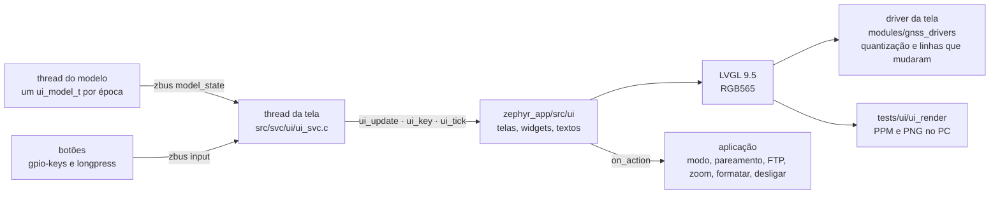

| Arquivo | Conteúdo |
|---|---|
| `zephyr_app/include/ui/ui.h` | a API: `ui_init`, `ui_update`, `ui_key`, `ui_tick`, `ui_notify`, `ui_set_mode`, `ui_show`, `ui_set_progress`, `ui_set_theme`; temas, idiomas, teclas, modos, telas e ações |
| `zephyr_app/include/ui/ui_model.h` | o retrato do estado, sem tipos do Zephyr nem do LVGL; mapas e trilhas chegam projetados pelo modelo em milésimos da janela (`UI_PM`), como o legacy projeta com `regFenLim()` |
| `zephyr_app/include/ui/ui_fmt.h`, `zephyr_app/src/ui/ui_fmt.c` | números como o legacy: `_fmkstr` (casas truncadas, `---` acima de 100000), `_secjmkstr` (`HH:MM:SS`) e os limites do `cadran` (`---` acima de 6 caracteres) e do `cadranH` (`-----` acima de 9) |
| `zephyr_app/src/ui/ui_core.c` | tabela de telas, troca de tela, fila de notificações, teclas, trava do menu nos 5 s iniciais, troca para a tela do GNSS com a posição velha |
| `zephyr_app/src/ui/ui_widgets.c`, `ui_fields.c` | barra de estado, cadran, listas, primitivas de desenho; os campos de dados com o formato de cada um |
| `zephyr_app/src/ui/ui_scr_crs.c`, `ui_scr_modes.c`, `ui_scr_menus.c`, `ui_scr_system.c` | as telas |
| `zephyr_app/src/ui/ui_theme.c`, `ui_text.c` | as cores por papel nos dois temas; os textos em português e inglês |
| `zephyr_app/src/ui/fonts/` | as fontes de 1 bit, geradas por `tools/ui/font_gen.py` ([Fontes e textos](#fontes-e-textos)) |

Regras de uso:

- **Uma thread só** chama as funções `ui_*` (o LVGL não é reentrante): no firmware, a thread da tela.
- `ui_update()` copia o retrato; cada tela atualiza só os textos e os desenhos que mudaram, e a troca de layout (por exemplo, um segmento que começa) remonta a tela.
- As ações saem pelo callback `on_action` do `ui_config_t`: modo, percurso, pareamento, FTP, peso, calibração da bússola, GNSS, luz, tema, formatação, zoom e desligamento. A interface só antecipa o valor editado e a lista de pareamento na cópia local, para responder na hora.
- `ui_key()` recebe a tecla e o tipo de toque (curto ou longo); `ui_tick()` vence as notificações; `ui_show_pages()` sai de uma tela de sistema (USB) para a página do modo.
- No firmware, a thread `ui` (`src/svc/ui/ui_svc.c`) é quem chama tudo isso: o retrato do modelo vai para `ui_update()`, e o primeiro tira a tela de partida; as teclas vão para `ui_key()`; as ações viram comandos do zbus (`system_cmd`), menos a luz e o tema, que a própria thread guarda nas configurações (`ui/prefs`); no desligamento, a tela mostra o progresso dos outros serviços e limpa o painel antes de responder. O tema inicial segue o painel: 8 cores no JDI, preto e branco na Sharp.

**Quantização para o painel.** O driver e o renderizador de host convertem cada pixel RGB565, expandido para 8 bits por canal, pela mesma regra:

1. pixel cinza (diferença entre o maior e o menor canal abaixo de 48), que é a borda suavizada de preto sobre branco: branco se a média dos canais for 128 ou mais, senão preto;
2. pixel colorido: cada canal fica com o bit de cima (128 ou mais), o que dá as 8 cores do JDI.

Sem a regra 1, o arredondamento do RGB565 (6 bits de verde, 5 de vermelho e azul) deixa pontos verdes nas bordas. A regra está em `modules/gnss_drivers/include/drivers/display/memlcd_pixel.h`, incluído pelo driver e pelo renderizador de host; na Sharp, um pixel colorido fica branco ou preto pela luminância. No tema preto e branco, a interface só usa preto e branco, e o teste confere que nenhum pixel colorido sobra depois da quantização.

## Teste no PC

`python tools/ui/render_screens.py` compila o LVGL do NCS e a interface com o GCC do PC (`zephyr_app/tests/ui`, com `-Werror`), roda o `ui_render`, que monta cada tela com os dados de exemplo de `zephyr_app/tests/ui/ui_samples.c`, e gera as folhas de `docs/img/telas-lvgl/`. O `ui_render` termina com erro quando:

- aparece cor no tema preto e branco depois da quantização;
- um texto sai da caixa que o contém;
- a navegação não chega à tela esperada ou uma ação não sai: páginas do CRS em anel, notificação fechada por tecla, tela do GNSS com a posição velha, trava do menu, menu, percursos, falta de percurso, ajustes, sensores, pareamento, FTP, zoom do PRC e desligamento pelo toque longo.

Resultado em 2026-09-19: 29 telas em 2 temas, 58 quadros, 0 problemas; pico de 23,9 KB no heap do LVGL, na tela com notificação, e de 7.359 B de pilha (no PC, x86-64, com ponteiros de 64 bits). O `lv_conf.h` do renderizador espelha o Kconfig do firmware: só os formatos RGB565 e A8 no renderizador, a fonte padrão UNSCII 8 e só rótulos; com os outros formatos cortados, as 58 imagens saíram iguais byte a byte. A formatação dos números tem teste de host próprio, `test_ui_fmt` (10 casos), contra a transcrição de `_fmkstr` e `_secjmkstr` em `zephyr_app/tests/host/support/legacy_ref.h` ([12](12-ferramentas-testes.md#testes-de-host-do-port)).

O teste no PC confere o desenho, não o painel: tempo de SPI, COM, luz e legibilidade ao sol ficam para a bancada.

## Paleta

| Cor | Uso |
|---|---|
| Branco | fundo: o painel refletivo fica mais claro com branco |
| Preto | texto, contornos, barra de estado, faixa de notificação, item selecionado |
| Vermelho | atrás do recorde, subida, zona alta, alerta, gravação, bateria baixa, sensor perdido, itens destrutivos (Desligar, Formatar) |
| Verde | à frente do recorde, descida, fix bom, carga solar, sensor conectado, trecho percorrido do percurso |
| Azul | percurso a percorrer, navegação (próxima curva), barras de título, modo do GNSS |
| Amarelo | só sobre preto ou como preenchimento: GNSS procurando, sol, título de notificação, sensor procurando; sobre branco, o texto quase some |
| Ciano | rádio: ANT+ e BLE |
| Magenta | segmentos: trilha e próximo segmento |

No tema preto e branco, cada papel vira preto sobre branco (ou branco sobre preto nas faixas), e o que a cor dizia fica no texto, no sinal ou na forma (bolinha cheia ou vazia, linha grossa ou fina).

## Grade e barra de estado

- **Grade:** a do legacy, 2 colunas por 7 linhas ([08](08-interface.md#cadrans)). Com a barra de estado de 20 px, cada linha tem cerca de 54 px (o legacy tinha 57 px sem barra).
- **Cadran:** rótulo pequeno à esquerda, unidade à direita, valor grande embaixo, no centro; na largura toda, o valor cresce. Os números seguem o legacy: ponto decimal, casas truncadas e `---` acima de 100000 (`Screenutils.cpp`).
- **Barra de estado** (nova), da esquerda para a direita:

| Elemento | Estado |
|---|---|
| Hora | a hora do GNSS no fuso configurado; `--:--:--` sem hora |
| GPS | verde com fix, amarelo procurando, apagado com o GNSS desligado (FEC, Zwift) |
| ANT+ e BLE | ciano com pelo menos um sensor conectado |
| Ponto vermelho | gravando ([16](16-arquitetura-firmware.md#gravação)) |
| Sol ou tomada | o AEM10900 carregando, ou USB conectado ([16](16-arquitetura-firmware.md#carga)) |
| Bateria | contorno com preenchimento verde acima de 50 %, amarelo até 20 %, vermelho abaixo; a porcentagem em texto |

## Fontes e textos

- **Fontes de 1 bit:** a tela não tem tons de cinza, então as letras não usam suavização. `tools/ui/font_gen.py` rasteriza a DejaVu Sans (regular e negrito) sem suavização e grava no formato de fonte do LVGL 9, com 1 bit por pixel; a regular vem do próprio LVGL do NCS e a negrito do matplotlib (ou `--bold`).
- **Licença:** a das fontes DejaVu, copiada em `zephyr_app/src/ui/fonts/LICENSE-DejaVu.txt`; as fontes geradas se chamam `ui_font_*`, porque a licença pede outro nome para fontes modificadas.
- **Acentos:** as fontes de texto levam o ASCII, os acentos do português e `° µ · – — … − ×`; as de valor, só algarismos e ` .,:-+%°/−`. Somando as 11 fontes, cerca de 24 KB de mapas de bits e descritores de glifo.
- **Textos:** numa tabela em `ui_text.c`, em português, com o inglês como segunda língua.

| Fonte | Uso |
|---|---|
| `ui_font_r10` | rótulos e unidades dos cadrans |
| `ui_font_r12`, `ui_font_b12` | linhas das listas e textos pequenos |
| `ui_font_b14`, `ui_font_b16` | itens de menu e títulos |
| `ui_font_b18`, `ui_font_b22` | notificações e textos grandes |
| `ui_font_b28`, `ui_font_b32` | valores dos cadrans (32 px na largura toda) |
| `ui_font_b44`, `ui_font_b64` | valores grandes e a edição de valor |

## Telas

Todas no tamanho da tela, 240 × 400. As que o legacy tem mantêm o conteúdo e o arranjo; as marcadas "nova" vêm do hardware novo. Em cada seção, a primeira imagem é o tema de 8 cores e a segunda o preto e branco. Cada tela em tamanho real, com o que mostra campo a campo, está em [telas/](telas/README.md).

### Ciclismo (CRS)

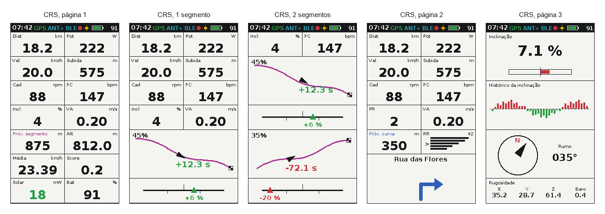

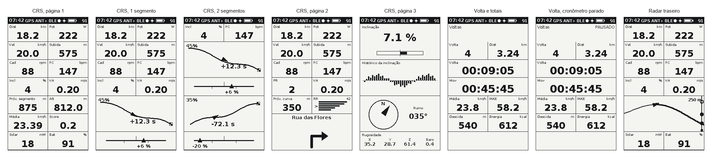

| Tela | Quando | Conteúdo | Legacy |
|---|---|---|---|
| Página 1 sem segmento | CRS | Dist, Pot, Vel, Subida, Cad, FC, Incl, VA, Próx. segmento, Alt, Média, Score, Solar e Bat | `VueCRS.cpp:116-141`, com Solar (mW do painel) no lugar da corrente do STC3100 |
| Página 1 com 1 segmento | um segmento perto ou ativo | 4 linhas de dados; o mini-mapa do segmento nas linhas 5 e 6 (trilha em magenta, círculo no início chegando, bandeira quadriculada no fim correndo, moldura no fim terminado, ciclista, % percorrido e a diferença para o recorde com sinal, em verde ou vermelho); na linha 7, o `partner` com o segmento ativo ou o próximo segmento na largura toda | `VueCRS.cpp:145-171` |
| Página 1 com 2 segmentos | dois perto ou ativos | Incl e FC no topo; com os dois chegando, mais 3 linhas de dados, os dois mapas na mesma faixa e o próximo segmento; com um ativo, Vel e Pot, os dois mapas e o `partner` do ativo; com os dois ativos, cada mapa com o seu `partner` | `VueCRS.cpp:173-231` |
| Página 2 | direita na página 1 | Dist, Pot, Vel, Subida, Cad, FC, PR, VA, próxima curva do Komoot com a distância, o RR por zona com `>` na atual, a rua e a seta da curva | `VueCRS.cpp:239-266`, com a seta desenhada e a rua |
| Página 3 | direita na página 2 | inclinação em número e barra (±24 %), histórico da inclinação (subida em vermelho para cima, descida em verde para baixo), bússola com o rumo em graus e as 4 rugosidades (X, Y e Z do acelerômetro e barômetro) | `VueCRS.cpp:268-319` |

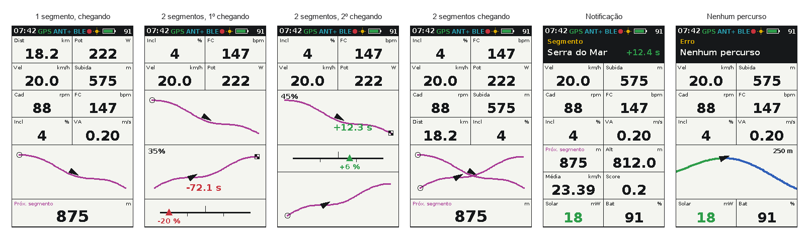

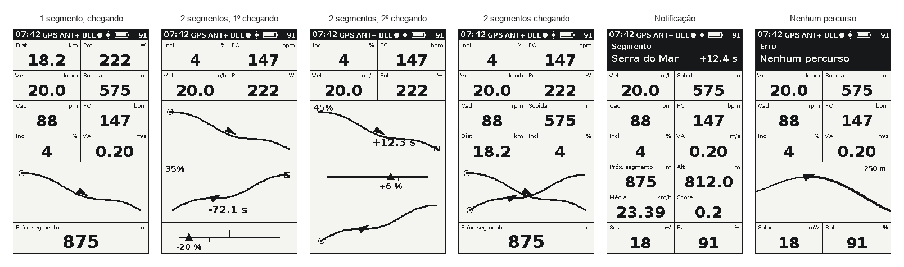

### Outros modos

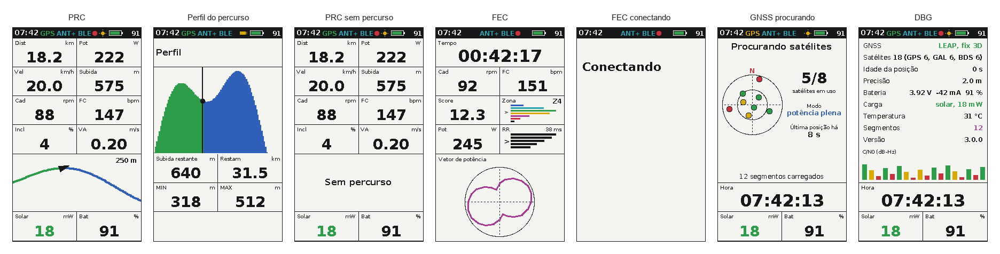

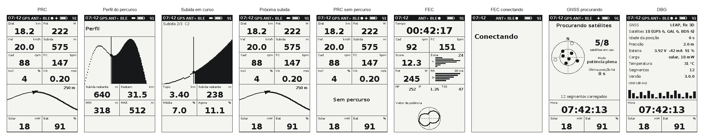

| Tela | Quando | Conteúdo | Legacy |
|---|---|---|---|
| PRC | modo PRC | Dist, Pot, Vel, Subida, Cad, FC, Incl e VA; o mapa do percurso nas linhas 5 e 6 (azul a percorrer, verde percorrido; no preto e branco, o percorrido em linha fina), o primeiro segmento em magenta, o ciclista e o zoom em metros; Solar e Bat | `VuePRC.cpp:61-96` |
| PRC sem percurso | nenhum percurso carregado | "Sem percurso" no lugar do mapa | o legacy só registra no log (`VuePRC.cpp:91`) |
| FEC | modo FEC | Tempo na largura toda, Cad, FC, Score, Zona (tempo em cada zona de potência, com `>` na atual), Pot, RR e o vetor de potência nas 3 últimas linhas; "Conectando" até o rolo mandar o primeiro dado | `VueFEC.cpp:34-90` |
| GNSS procurando | CRS ou PRC sem fix ou com a posição mais velha que 6 s | céu com os satélites (cor pelo C/N0; no preto e branco, cheio em uso e vazio fora), satélites em uso, modo do GNSS, idade da última posição e segmentos carregados; Hora; Solar e Bat | `VueGPS.cpp:18-43`, com o céu no lugar do texto do `displayGPS2`; o limite é `LOCATOR_MAX_DATA_AGE_MS` (`parameters.h:39`) |
| DBG | menu, Modo DBG | modo e fix do GNSS, satélites por sistema, idade e precisão da posição, bateria, carga, temperatura, segmentos, versão e o C/N0 de cada satélite; Hora; Solar e Bat | `VueDebug.cpp`, com os dados do hardware novo |

### Menus

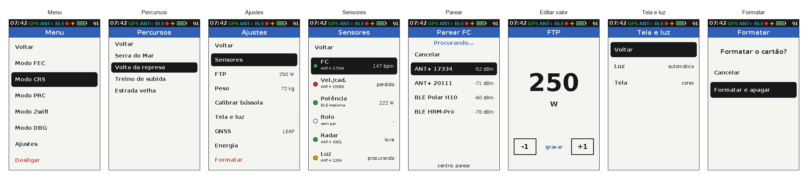

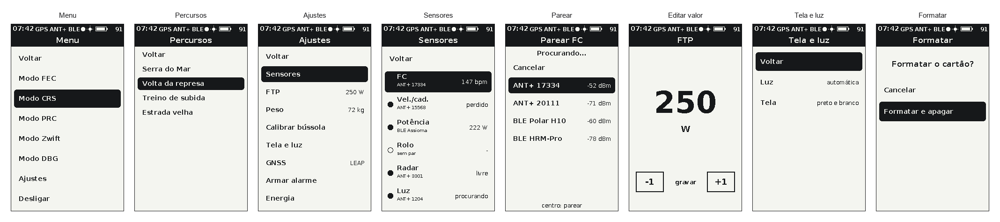

| Tela | Quando | Conteúdo | Legacy |
|---|---|---|---|
| Menu | centro numa página, depois dos 5 s iniciais | Voltar, Modo FEC, Modo CRS, Modo PRC, Modo Zwift, Modo DBG, Ajustes, Desligar | a árvore de `Menuable.cpp:255-289`, em português |
| Percursos | Menu, Modo PRC | Voltar e os percursos do cartão (até 10); o escolhido abre o PRC; sem percurso, a notificação "Erro: Nenhum percurso" | `Menuable.cpp:46-78` |
| Ajustes | Menu, Ajustes | Voltar, Sensores, FTP, Peso, Calibrar bússola, Tela e luz, GNSS, Energia, Formatar, com o valor atual à direita | Settings, com Sensores reunindo os pareamentos e os itens novos |
| Sensores | Ajustes, Sensores | Voltar e cada tipo (FC, velocidade e cadência, potência, rolo, radar, luz) com o estado (bolinha verde conectado, vermelha perdido, amarela procurando, vazia sem par), o dispositivo e o último dado; o centro abre o pareamento do tipo | nova |
| Parear | Sensores, um tipo | "Procurando...", Cancelar e os dispositivos achados, com nome ou ID e RSSI (até 7); regras em [17](17-dispositivos-ble-ant.md#pareamento) | `MenuPagePairing` e `_page1_mode_ant_list`, com o BLE |
| Editar valor | Ajustes, FTP ou Peso | valor grande, −1, +1 e "gravar" | `MenuPageSetting` |
| Tela e luz | Ajustes | Voltar, Luz (automática ou desligada), Tela (cores ou preto e branco) | nova |
| Formatar | Ajustes, Formatar | "Formatar o cartão?", Cancelar e "Formatar e apagar" | o legacy formata na hora (`Menuable.cpp:102-110`) |

### Sistema

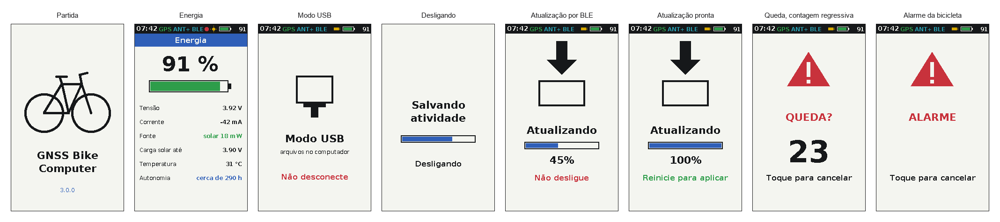

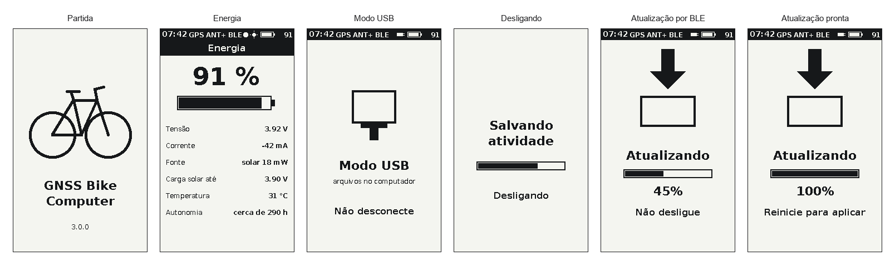

| Tela | Quando | Conteúdo | Legacy |
|---|---|---|---|
| Partida | ao ligar | a bicicleta, o nome e a versão | o bitmap `legacy/drivers/lcd/ls027_splash.h` |
| Notificação | evento | faixa preta no topo com o título em amarelo, a mensagem em branco e o valor com sinal, em verde ou vermelho; fila de até 10, cerca de 5 s cada, qualquer tecla fecha | igual, com cor |
| Energia | Ajustes, Energia | porcentagem, tensão, corrente, fonte de carga, limite da carga solar, temperatura da célula e autonomia estimada | nova |
| Modo USB | MSC | "Modo USB", arquivos no computador, "Não desconecte" | nova (o legacy não mostra nada) |
| Desligando | pedido de desligar | "Salvando atividade", barra de progresso e "Desligando" | nova (o legacy desliga sem aviso) |

## Botões

Os três botões e as funções do legacy ([08](08-interface.md#botões)), com o toque longo como acréscimo.

| Contexto | Esquerda | Centro | Direita | Centro longo |
|---|---|---|---|---|
| CRS | página anterior | menu | próxima página | desligar (novo) |
| PRC | afasta o zoom | menu | aproxima o zoom | desligar (novo) |
| FEC, DBG, GNSS procurando | — | menu | — | desligar (novo) |
| Menu, Percursos, Ajustes, Sensores, Parear, Tela e luz | item anterior | executa | próximo item | volta à página (novo) |
| Editar valor | −1 | grava e volta | +1 | — |
| Formatar | item anterior | executa | próximo item | — |
| Notificação | fecha | fecha | fecha | fecha |

- As listas dão a volta nas pontas, como no legacy (`MenuObjects.cpp:153-166`).
- O botão do centro também vai ao SHPHLD do nPM1300, que liga o aparelho ([14](14-hardware-placa-nova.md#alocação-de-pinos)).
- Nos primeiros 5 s depois da partida o menu não abre, como no legacy (`Menuable.cpp:326`).
- A edição de valor vai de 1 até 2000 W no FTP e até 255 kg no peso; o legacy não tem limite.
- O toque longo e o desligar pelo botão são propostas; o legacy só usa o toque curto e desliga pelo menu.
- No firmware, o `zephyr,input-longpress` (nó `longpress` dos overlays) dá o toque curto ao soltar antes de 1 s e o longo depois de 1 s apertado; o callback de `src/svc/ui/ui_input.c` publica `input`.

## Atualização e luz

- **Ritmo:** a tela redesenha a cada época do GNSS (1 Hz) ou a cada dado do rolo, e na hora quando um botão é apertado. Só as linhas físicas que mudaram vão para a tela. A thread `ui` dorme até a próxima mensagem, o próximo timer do LVGL (o de redesenho para quando nada mudou) ou 1 s.
- **Retrato:** montada em retrato, cada coluna da interface é uma linha física do painel, como na V3 ([08](08-interface.md#pipeline-de-desenho)). Um valor que muda na coluna da esquerda reescreve as linhas físicas dessa coluna.
- **COM:** EXTCOMIN a 1 Hz com a luz apagada; com a luz acesa, no JDI, cerca de 120 Hz, para o COM ficar perto dos 60 Hz que a ficha pede no modo transmissivo (9.1.2); na Sharp com o filme frontal, a frequência se acerta na bancada, dentro da faixa da ficha (até 20 Hz no EXTCOMIN).
- **Luz:** a máquina de estado de [16](16-arquitetura-firmware.md#luz-do-display), em `src/svc/ui/backlight.c` (`test_backlight`): acende 10 s depois de um botão e fica acesa com pouca luz ambiente (OPT3001, abaixo de 20 lux até passar de 50), com brilho por PWM no alias `backlight` (50 %, no DK o LED 1); desligada no menu Tela e luz, nada a acende. O LPM027M128B não tem luz: a máquina fica pronta para uma luz por trás ou um filme frontal. Limites, tempo e brilho na bancada.
- **Contraste:** fundo branco nas páginas de dados; preto só na barra de estado, nas faixas de notificação e na seleção.

## Memória

| Item | Tamanho | Observação |
|---|---|---|
| Quadro em 3 bits | 36.482 B: 240 linhas de 152 B (cabeçalho de 2 B e 150 B de pixels) e 2 B de fim | no driver próprio, na orientação do painel e no formato do fio; a Sharp usa 12.482 B |
| Buffer de desenho do LVGL | 19.200 B (10 % da tela em RGB565, `CONFIG_LV_Z_VDB_SIZE`) | exige `CONFIG_LV_Z_BITS_PER_PIXEL=16`: o padrão da integração é 32, qualquer que seja a cor, e dobraria o buffer |
| Heap do LVGL | 32 KB reservados (`CONFIG_LV_Z_MEM_POOL_SIZE`) | pico de 23,9 KB medido no PC com ponteiros de 64 bits; no nRF, com 32 bits, deve ser menos; medir na placa |
| Pilha da thread `ui` | 6.144 B | cerca de 4,7 KB na cadeia mais funda, medida com `CONFIG_STACK_USAGE` ([05](05-arquitetura-zephyr.md#pilhas)) |
| Flash no nRF54LM20 DK | LVGL 92.467 B, telas 28.753 B, fontes 26.904 B, driver 2.972 B | só os formatos RGB565 e A8 no renderizador e sem o log do LVGL |
| Linha em 3 bits | 150 B de pixels por linha física de 400 pixels, mais os bits de modo e endereço | ficha, seção 6.1 |
| Quadro inteiro pelo SPI | cerca de 36 KB, perto de 150 ms a 2 MHz | só na troca de tela; nas páginas de dados vão as linhas que mudaram |
| RAM do nRF54LM20A | 512 KB | o port usa 247.800 B com a interface ([03](03-ambiente-build.md#resultado-de-referência)) |

## Diferenças para o legacy

| Item | Legacy | Placa nova |
|---|---|---|
| Cor | monocromático | 8 cores no JDI e preto e branco no Sharp, sem depender só da cor |
| Barra de estado | não tem | hora, GNSS, rádio, gravação, carga e bateria; cada linha da grade perde 3 px |
| Idioma | rótulos em inglês | português, com o inglês como opção |
| Fonte | `Org_01` escalada de 1 a 4 | DejaVu Sans de 1 bit em 11 tamanhos, com acentos |
| Linha 7 de CRS, GNSS e DBG | STC (corrente em mA) e SOC (`VueCRS.cpp:140-141`, `VueGPS.cpp:40-41`, `VueDebug.cpp:44-45`) | Solar (mW do painel) e Bat |
| Linha 7 do PRC | Avg (corrente média do STC3100, mA) e SOC (`VuePRC.cpp:94-95`) | Solar e Bat |
| Subida com segmentos | uma casa decimal (`VueCRS.cpp:151`, `:189`); sem segmento, inteira (`:122`) | inteira em todas as páginas |
| FEC | grade de 6 linhas (`VUE_FEC_NB_LINES`), vetor de potência em 2 | grade de 7 linhas com a barra de estado, vetor em 3 |
| Página 2 | ícone Komoot de 110 × 110 (`VueCRS.cpp:259-264`) | seta desenhada e o nome da rua |
| Página 3 | "Pitch" e barra em radianos (±0,24 rad), bússola com agulha e as 4 rugosidades em números soltos (`VueCRS.cpp:268-319`) | inclinação em número e barra em % (±24 %, a mesma escala a menos de 1,4 px), subida e descida em cores, rumo em graus, rugosidades com nome |
| PRC | percurso em preto; sem percurso, só o log | percorrido em verde e a percorrer em azul; "Sem percurso" na tela |
| GNSS procurando e DBG | texto do `displayGPS2` | céu com os satélites (GNSS) e lista com o hardware novo e o C/N0 (DBG) |
| Partida | bitmap do quadro da bicicleta (`ls027_splash.h`) | bicicleta desenhada em linhas, nome e versão |
| Formatar | formata na hora (`Menuable.cpp:102-110`) | pede confirmação |
| Editar valor | sem limites (`MenuObjects.cpp:213-241`) | de 1 a 2000 W (FTP) e de 1 a 255 kg (peso) |
| Pareamento | "Pair HRM", "Pair BSC" e "Pair FEC" em Settings, só ANT+ | tela Sensores com todos os tipos, ANT+ e BLE |
| Telas novas | — | Energia, Sensores, Tela e luz, Modo USB, Desligando |
| Botões | só toque curto | toque longo no centro para desligar e para voltar (proposta) |
| Luz | não tem | automática pelo OPT3001 |

Cada diferença entra em [10](10-status-do-port.md) quando a interface for para o firmware.
