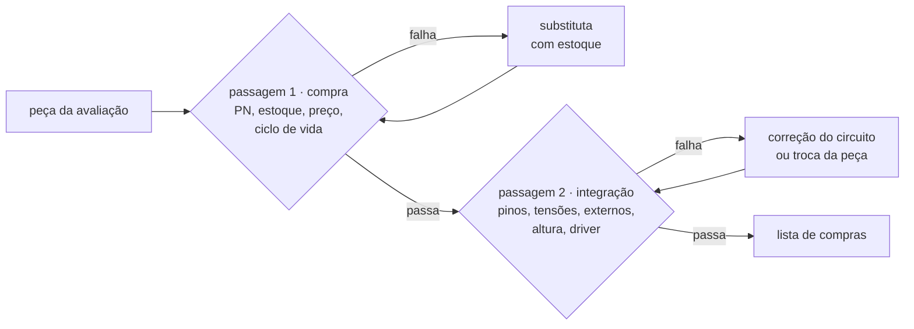
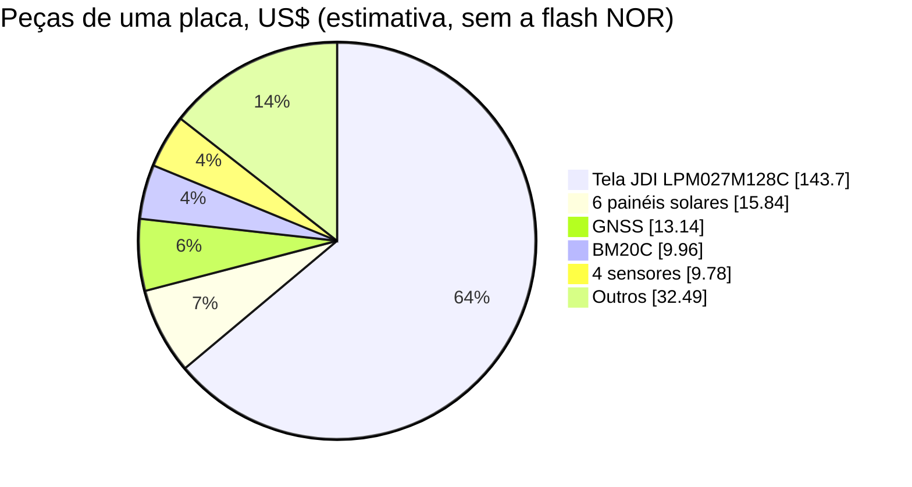

# Lista de compras da placa nova

Lista de materiais do protótipo da placa nova, com cada peça validada em duas passagens: a **compra** (a peça existe, está ativa e tem estoque num distribuidor autorizado) e a **integração** (a peça funciona no circuito da [especificação](14-hardware-placa-nova.md): pinos, tensões, componentes externos, altura, driver e firmware). Onde uma peça falhou, a lista já traz a substituta, e a especificação, a [avaliação](15-avaliacao-componentes.md) e a [arquitetura do firmware](16-arquitetura-firmware.md) seguem as correções.

> [!IMPORTANT]
> Estoque e preço são da DigiKey em 2026-09-18, em US$ por unidade para 1 e 10 peças, e mudam rápido: confira no dia do pedido. A Mouser bloqueia acesso automático, então **nenhum dado da Mouser foi conferido**. Nenhuma peça foi montada nem medida: a validação é sobre datasheets, desenhos e o código do NCS v3.3.0.

> [!NOTE]
> **A tela mudou em 2026-09-23, por decisão do dono:** entra o **JDI
> LPM027M128C**, peça única de 2,7", 400 × 240, MIP de 8 cores e **com luz
> frontal integrada**, e saem do pedido a Sharp LS027B7DH01A, o filme Azumo
> 11103-06_A1, o conector dele (Molex 5034800440) e o REG710NA-5/3K dos 5 V.
> A Sharp com o filme continua na lista como **plano B**, no mesmo conector.
> Custo: **+US$ 54 na tela** e cerca de **+US$ 52 na placa** ([Custo](#custo)),
> **sem canal autorizado de compra e sem garantia** ([Display](#display)).

**Nesta página:** [Como a lista foi validada](#como-a-lista-foi-validada) · [Resultado](#resultado) · [Trocas](#trocas) · [Correções de integração](#correções-de-integração) · [Lista por bloco](#lista-por-bloco) · [Passivos](#passivos) · [Placas de avaliação e ferramentas](#placas-de-avaliação-e-ferramentas) · [Custo](#custo) · [Compras fora da DigiKey](#compras-fora-da-digikey) · [Antes de fechar o pedido](#antes-de-fechar-o-pedido) · [Referências](#referências)

## Como a lista foi validada



- **Passagem 1, compra:** o PN que se encomenda, a página da DigiKey (estoque, preço, situação, prazo de fábrica) e, quando a DigiKey não vende, a página do fabricante ou de outro distribuidor. Passa a peça ativa, com ficha pública e estoque que cubra 5 placas.
- **Passagem 2, integração:** a peça contra o circuito, pino a pino com a ficha; os máximos absolutos contra os trilhos; os componentes externos que a ficha exige; a altura contra o [empilhamento](14-hardware-placa-nova.md#empilhamento-mecânico); o driver no NCS v3.3.0 local; e o que o firmware precisa fazer.
- **Protótipo:** 5 placas. Os CIs têm uma peça de reserva; os passivos saem em múltiplos de 10.

## Resultado

| Bloco | Peças conferidas | Trocadas na compra | Correções de integração |
|---|---|---|---|
| MCU e rádio | 1 | — | tamanho real do módulo, regras da antena, refusões |
| Energia | 14 | NTC, conector da bateria | trilhos dos bucks, pinos do AEM10900, indutor, configuração do MAX17262, luz pela LDSW2 |
| GNSS | 6 | módulo, do MAX-M10N-10B para o MAX-F10S | V_IO travado em 1,8 V, 0 dBm no RF_IN sem exceção fora da banda |
| Sensores | 5 | IMU, magnetômetro | pinos comuns do IMU, CSB do barômetro, nada de varredura no I2C |
| Display | 7 | tela, conectores, REG710 — e a tela **de volta ao JDI** em 2026-09-23 | tela de 8 cores com luz integrada em 3,0 V; o REG710 e os 5 V saíram da montagem |
| Armazenamento | 2 | preço e estoque da NOR ainda não conferidos | MX25R6435F de 8 MB, pull-ups de WP e HOLD, pinos com o trilho desligado |
| USB | 4 | TVS do VBUS, receptáculo | placa de 0,8 mm |
| Interface | 4 | botões sem vedação | LEDs no VSYS, buzzer em alta corrente |
| Passivos | 18 | três capacitores sem estoque ou obsoletos | capacitância efetiva pelo DC bias |

Todas as peças passam na integração, com as ressalvas de cada linha. Na compra ficam **três** pendências: o BM20C, sem estoque hoje, com 1.000 previstos para 12/11/2026 na DigiKey e venda direta pela Fanstel, prazo que cabe no tempo do layout, com o plano B na linha dele; o AEM10900, que a DigiKey não vende e que só a Mouser, não conferida, ou a e-peas fornecem; e, desde 2026-09-23, **o JDI LPM027M128C**, que **nenhum distribuidor autorizado vende** e que a decisão do dono aceita comprar de revendedor, sem garantia. Cinco compras saem da DigiKey: o AEM10900, a flash NOR, a bateria, a ferramenta da Tag-Connect e a tela ([Compras fora da DigiKey](#compras-fora-da-digikey)).

## Trocas

| Peça da avaliação | Problema | Substituta | Consequência |
|---|---|---|---|
| ~~JDI LPM027M128C (tela de 8 cores)~~ | nenhum canal autorizado: a DigiKey não tem a peça e marca como obsoletos os módulos da Azumo com ela; a Switch Science encerrou as vendas; a Data Modul não lista JDI; o site da JDI não tem mais MIP | ~~Sharp **LS027B7DH01A** com o filme de luz frontal **Azumo 11103-06_A1**~~ | **Troca desfeita em 2026-09-23**, por decisão do dono: volta o JDI LPM027M128C, e o risco de compra é aceito. O par Sharp + Azumo vira o plano B, no mesmo conector ([Display](#display)) |
| Sharp LS027B7DH01 | sem estoque (400 previstos para 10/11/2026) | Sharp LS027B7DH01A | mesma pinagem; polarizador novo e 1,625 mm de espessura |
| SMK CFP-4610-0150F e Molex 51441-1093 (conectores da ficha antiga da Sharp) | o primeiro sem venda encontrada, o segundo obsoleto | Hirose FH28-10S-0.5SH(05) | as fichas do JDI e da Sharp atual citam o FH28, com contato por baixo |
| TI REG710NA-5/250 | sem estoque | TI REG710NA-5/3K | a mesma peça em rolo maior, vendida em fita cortada |
| ST LSM6DSV16X | sem estoque, como todas as IMUs da ST na DigiKey | Bosch BMI270 no mesmo footprint | sem a fusão interna (vetor de gravidade); driver `bosch,bmi270` |
| ST LIS2MDL | sem estoque | Memsic MMC5633NJL | WLP de 0,85 mm; driver `memsic,mmc56x3`; o barramento não pode ser varrido |
| Murata NCP15XH103J03RC | não recomendado para projetos novos | TDK NTCG103JF103FT1 | o mesmo B3380 e 10 kΩ ±1 % |
| TI ESD751DYAR | sem estoque até 27/11/2026 | TI ESD761DPYR | a mesma família em X1SON de 1,0 × 0,6 mm |
| JST SH de 4 vias | 1 A por contato e trava por atrito | JST GH de 6 vias | VBAT e GND em dois contatos; trava positiva; 4,25 mm de altura |
| Indutor de 6,8 µH do AEM10900 | a tabela 6 da ficha dá 65,5 mA de entrada, abaixo dos 88 mA do painel ao meio-dia | TDK VLS252012HBX-4R7M-1 (4,7 µH) | de 95 a 123 mA; o de 6,8 µH vai para a bancada |
| Amphenol 12402484E512A | o desenho não abriu (403): o anel de vedação incluso não foi confirmado | Molex 2036150003 | o desenho confirma o anel e o IPX8; pede placa de 0,8 mm |
| Chaves táteis comuns (E-Switch TL3340, Panasonic EVP-AA, Omron B3FS) | sem grau IP | Omron B3S-1002P | IP67 pela ficha; a E-Switch TL3780AF240QG, IP67 e mais baixa, fica de alternativa |
| Tag-Connect TC2030-IDC-NL | termina num conector IDC de 6 vias com passo de 0,1", e não no conector Cortex do J-Link | TC2030-CTX-NL e TC2030-CLIP | conector Cortex de 10 vias do J-Link |
| Molex 503480-0400 (sugerido pela Azumo para o filme) | obsoleto | Molex 5034800440 | — |
| Murata GRM188R61E106KA73D, GRM158R60J226ME01D e GRM155R61A105KE15D | os dois primeiros sem estoque, o terceiro obsoleto | ver [Passivos](#passivos) | — |

## Correções de integração

Achados da segunda passagem que mudam o circuito ou o firmware. A especificação já traz todos; as ligações fixas de cada CI estão em [14](14-hardware-placa-nova.md#ligações-fixas-dos-cis).

1. **Trilhos dos bucks trocados.** O resistor do VSET1 só escolhe de 1,0 a 2,7 V e o do VSET2, de 1,8 a 3,3 V (tabelas 18 e 19 do nPM1300): o 3,0 V, de que o MCU depende para ligar, só sai do BUCK2. Fica BUCK2 em 3,0 V com 150 kΩ e BUCK1 em 1,8 V com 47 kΩ, a mesma configuração 1 da referência da Nordic (tabela 39). Nenhum VSET pode ficar aberto.
2. **1V8 travado.** Com o VIO_SEL em GND, o V_IO do MAX-F10S tem máximo absoluto de 1,98 V (tabela 12 da UBXDOC-963802114-12732 R03, igual à do M10N-10B), e o registrador do BUCK1 aceita até 3,3 V: o devicetree fixa o mínimo e o máximo do BUCK1 em 1,8 V.
3. **Luz da tela pela LDSW2.** A LDSW2 do nPM1300 vira LDO de 3,3 V alimentado pelo VSYS (até 50 mA, entrada de 2,6 V ao VSYS), com resistor e N-MOSFET no PWM. O 3,0 V deixaria só 0,33 V para o resistor do LED de 2,67 V do JDI.
4. **Pinos do AEM10900:** STO_CFG[2] e STO_CFG[0] no VINT e STO_CFG[1] no GND (carga até 3,90 V, corte em 3,01 V); R_MPP[2:0] e T_MPP[1:0] no VINT; KEEP_ALIVE no VINT; I2C_ADDR no I2C_VDD (0x41); DIS_STO_CH pelo divisor de 100 kΩ e 1 MΩ do VBUSOUT.
5. **Indutor do AEM10900 em 4,7 µH.** A tabela 6 e a fórmula da seção 6.7.2 da ficha discordam (65,5 contra 85 mA com 6,8 µH); a pergunta vai para a e-peas, e a bancada compara 4,7 e 6,8 µH.
6. **MAX17262:** a configuração de fábrica (0x2210) já deixa o COMMSH e o THSH em 0; com o TH ligado ao BATT, o firmware grava ETHRM = 0 e mantém TSel = 0 (temperatura interna).
7. **Botão de ligar:** só o botão central vai ao SHPHLD, que tem pull-up interno de 50 kΩ; o nPM1300 avisa o MCU pelo GPIO3 (`NPM13XX_EVENT_SHIPHOLD_PRESS` e `RELEASE`). Segurar mais de 10 s religa o sistema inteiro, recurso ligado de fábrica que serve de reset de emergência.
8. **BM20C:** 10,0 × 16,2 mm, e não 14,8 mm; os últimos 5,5 mm são a área da antena, que fica fora da placa ou sem terra e sem trilhas em todas as camadas, com o módulo na borda. No máximo duas passagens pelo forno, com o lado do módulo por último. USB em G6 (D−), G7 (D+) e H7 (VBUS de 4,4 a 5,5 V). A ficha não dá a tolerância do cristal de 32,768 kHz, que o ANT pede em ±50 ppm.
9. **Entrada de RF do GNSS:** a tabela 12 da ficha do **MAX-F10S** dá um único máximo absoluto de **0 dBm** no RF_IN, sem a exceção de +15 dBm fora da banda que a ficha do 10B traz. Com o BLE a +8 dBm na mesma placa, quem segura o nível é o isolamento entre as antenas: meça o S21 em 2,44 GHz antes de ligar o rádio na potência cheia, e o bloqueio pelo C/N0 com o rádio transmitindo ([14](14-hardware-placa-nova.md#gnss)).
10. **IMU com dois fabricantes no mesmo footprint:** pinos 2 e 3 no VDDIO (a Bosch proíbe GND), 10 e 11 abertos, 12 no VDDIO, 1 no GND; o BMI270 responde em 0x68 e o LSM6DSV16X, em 0x6A. O devicetree declara os dois, e o firmware usa o que responder. O despertar por movimento do BMI270 pede a configuração `base` do driver (8 KB, com o compatível extra `bosch,bmi270-base`), sem exemplo no NCS: a testar.
11. **MMC5633NJL:** o endereço 0x7E no barramento o põe em I3C até faltar energia, então o firmware nunca varre o I2C; o VDD pede pelo menos 2,2 µF junto do pino. O ID 0x10 e o mapa de registradores conferem com o driver `memsic,mmc56x3`.
12. **BMP585:** o CSB precisa estar no VDDIO na partida, ou o I2C fica desligado até o próximo reset de energia; o SDO no VDDIO dá o endereço 0x47.
13. **Flash NOR soldada:** o SD NAND XTX saiu em 2026-09-20 e no lugar dele vai a Macronix **MX25R6435F** de 64 Mbit (8 Mbyte), a mesma peça do nRF54LM20 DK, sozinha no `spi00` com CS em P2.05 e `spi-max-frequency = 8000000`. Ela entra no devicetree como `jedec,spi-nor`, e uma partição que toma a peça inteira vira disco por `zephyr,flash-disk`, montado em `/SD:` com FatFs (`CONFIG_DISK_DRIVER_FLASH=y` e `CONFIG_DISK_DRIVER_SDMMC=n`); **não há cartão nem SD NAND na placa**. WP e HOLD levam pull-up; com o trilho da flash desligado, os pinos do `spi00` ficam em nível baixo ou em alta impedância, para não alimentar o chip pelos pinos. Nada disso foi testado em placa.
14. **USB-C da Molex:** o desenho recomenda placa de 0,8 mm, e a especificação passa de 1,0 para 0,8 mm; o anel de vedação passa da borda da placa (a borda fica 2,73 mm atrás da frente do conector); furo de 9,54 × 3,76 mm numa parede de pelo menos 1,2 mm.
15. **Tela.** Com o **JDI LPM027M128C**, decidido em 2026-09-23: VDD e VDDA em 3,0 V do BUCK2 (máximo absoluto de 3,6 V), EXTMODE no VDD da tela, luz de 16 mA a 2,67 V com o resistor de 39 Ω pela LDSW2, e **o REG710 e o trilho de 5 V deixam de ser montados** — com eles o `DISP_PWR_EN` (P3.07) volta a ficar livre. **Falta uma coisa que nenhum documento do projeto tem:** o FPC de 10 vias não traz par para o LED, de modo que **não se sabe por onde a luz do C se liga**; sai da ficha do C ou de uma amostra, **antes do layout**. No **plano B**, com a Sharp: 5 V do REG710 com o EN num pino do MCU, para a sequência de ligar e para cortar os 65 µA do conversor; entradas com VIH a partir de 2,7 V, que a lógica de 3,0 V atende; e o filme de luz com um LED de 10 mA típicos (25 mA no máximo), no Molex 5034800440.
16. **TPS7A02:** pelo menos 0,5 µF efetivos na saída, EN ligado ao IN.
17. **Capacitância efetiva:** pelas curvas da Taiyo Yuden, o 10 µF de 25 V em 0603 fica com cerca de 4,9 µF a 5 V e 7,2 µF a 3 V, e o 22 µF de 10 V, com cerca de 9,0 µF a 4 V, acima dos 5 µF efetivos que o AEM10900 pede no STO.
18. **LEDs e buzzer:** o LED RGB tem anodo comum no VSYS e um N-MOSFET por cor, porque um pino do MCU em 3,0 V não segura um catodo cujo anodo vai a até 5,5 V (com o USB, o VSYS acompanha o VBUS); o brilho varia com a tensão do VSYS. O buzzer usa dois pinos em alta corrente.

## Lista por bloco

Colunas: função, peça, código da DigiKey, estoque, preço em US$ para 1 e 10 peças, quantidade por placa, compra sugerida para 5 placas e situação depois das duas passagens.

### MCU e rádio

| Função | Peça | DigiKey | Estoque | US$ 1 / 10 | Por placa | Compra | Situação |
|---|---|---|---|---|---|---|---|
| Módulo com o nRF54LM20A | Fanstel BM20C | 1914-BM20CCT-ND | 0; 1.000 previstos para 12/11/2026 | 11,47 / 9,96 | 1 | 6 | aprovada com ressalva: sem estoque até novembro (a Fanstel vende por e-mail a US$ 6,50); tolerância do cristal de 32,768 kHz a confirmar |

Plano B, se o BM20C atrasar: MinewSemi ME54BS13-1Y20TI (6024-ME54BS13-1Y20TITR-ND, 50 peças no Marketplace da DigiKey, US$ 9,00), com o nRF54LM20A, antena de PCB e 16,5 × 12,0 × 2,4 mm. O footprint é outro e a ficha (V0.5.0) não traz certificação.

### Energia

| Função | Peça | DigiKey | Estoque | US$ 1 / 10 | Por placa | Compra | Situação |
|---|---|---|---|---|---|---|---|
| PMIC | Nordic nPM1300-QEAA-R (QFN32) | 4823-NPM1300-QEAA-RCT-ND | 10.710 | 2,95 / 2,21 | 1 | 6 | aprovada; o rolo de 7" (-R7) está sem estoque |
| Indutores dos bucks | Murata DFE201610E-2R2M=P2 | 490-17728-1-ND | 90.749 | 0,25 / 0,206 | 2 | 12 | aprovada; 140 mΩ, 2,4 A; alternativa TDK TFM201610ALM-2R2MTAA (445-174186-1-ND, 54.319) |
| Carregador solar | e-peas AEM10900 (10AEM10900C0002, QFN28) | não vende | — | — | 1 | 6 | fora da DigiKey: Mouser (não conferida) ou e-peas |
| Indutor do AEM10900 | TDK VLS252012HBX-4R7M-1 | 445-173029-1-ND | 897 | 0,25 / — | 1 | 6 | aprovada; 1,4 A de saturação, 240 mΩ |
| Indutor de comparação | TDK VLS252012HBX-6R8M-1 | 445-173030-1-ND | 4.174 | 0,25 / 0,206 | — | 3 | para a bancada |
| Medidor de carga | Analog Devices MAX17262REWL+T | 175-MAX17262REWL+TCT-ND | 20.109 | 4,10 / 3,10 | 1 | 6 | aprovada; WLP, montagem por estêncil e forno |
| LDO do backup do GNSS | TI TPS7A0218PDQNR | 296-TPS7A0218PDQNRCT-ND | 5.793 | 0,84 / 0,601 | 1 | 6 | aprovada |
| NTC do AEM10900 | TDK NTCG103JF103FT1 | 445-2550-1-ND | 1.668.979 | 0,11 / 0,075 | 1 | 10 | aprovada; na face de trás, sob a célula |
| Painéis solares | ANYSOLAR KXOB25-05X3F-TR | KXOB25-05X3FCT-ND | 5.038 | 3,23 / 2,64 | 6 | 36 | aprovada |
| LED de carga | Kingbright APT1608SURCK | 754-1123-1-ND | 1.084.493 | 0,21 / 0,144 | 1 | 10 | aprovada; 1,82 V a 5 mA, no LED1 do nPM1300 |
| Conector da bateria | JST SM06B-GHS-TB | 455-1568-1-ND | 34.778 | 0,49 / 0,42 | 1 | 6 | aprovada |
| Carcaça do cabo | JST GHR-06V-S | 455-1596-ND | 67.681 | 0,16 / 0,136 | 1 | 6 | aprovada |
| Terminais do cabo | JST SSHL-002T-P0.2 | 455-1606-500-ND | 3.500 | fita de 500 a 0,0715 | 6 | 500 | a crimpagem pede o alicate da JST |
| Bateria | LiPo de 1 célula, 2000 mAh, 60 × 36 × 7 mm, com PCM e NTC de 10 kΩ B3380 | — | — | — | 1 | 6 | sob encomenda a um fabricante de packs, com UN38.3 |

### GNSS

| Função | Peça | DigiKey | Estoque | US$ 1 / 10 | Por placa | Compra | Situação |
|---|---|---|---|---|---|---|---|
| Módulo GNSS | u-blox MAX-F10S-00B | 672-MAX-F10S-00BCT-ND | 10.818 | 13,14 / — | 1 | 6 | aprovada; L1 + L5; MSL 4: secar antes do forno se a embalagem ficou aberta |
| Módulo do teste A/B | u-blox MAX-M10N-10B | 672-MAX-M10N-10BCT-ND | 1.571 | 14,52 / — | — | 2 | mesmo footprint; a alternativa econômica, só L1 |
| Tradutor de nível | TI TXU0204BQAR | 296-TXU0204BQARCT-ND | 3.776 | 1,17 / 0,846 | 1 | 6 | aprovada; alternativa TXU0204RUTR (UQFN-12, 767) |
| Antena | TE L000670-01 | 343-L000670-01CT-ND | 2.738 | 1,50 / — | 1 | 6 | aprovada; com o F10S a sintonia tem de fechar **L1 e L5** na mesma rede em π, e não só L1: a TE mede com 0 Ω em série e paralelos vazios, e a sintonia na caixa escolhe os valores |
| Ferrite do 1V8 | Murata BLM15PX601SN1D | 490-9657-1-ND | 370.529 | 0,10 / 0,07 | 1 | 10 | aprovada; 600 Ω a 100 MHz, 900 mA |
| Sintonia da antena | Murata GJM1555C1H2R2BB01D (2,2 pF C0G) e LQW15AN3N9C00D (3,9 nH) | — | 86.930 e 60.715 | 0,11 / 0,057 e 0,11 / — | — | 10 de cada | valores de partida para a rede em π; o VNA decide os valores finais |

### Sensores

| Função | Peça | DigiKey | Estoque | US$ 1 / 10 | Por placa | Compra | Situação |
|---|---|---|---|---|---|---|---|
| Barômetro | Bosch BMP585 | 828-BMP585CT-ND | 11.559 | 4,54 / 3,893 | 1 | 6 | aprovada |
| IMU | Bosch BMI270 | 828-1091-1-ND | 54.091 | 4,23 / 3,624 | 1 | 6 | aprovada |
| Magnetômetro | Memsic MMC5633NJL | 1267-MMC5633NJLCT-ND | 11.095 | 1,14 / 0,951 | 1 | 6 | aprovada; WLP de 0,85 mm |
| Luz ambiente | TI OPT3001DNPR | 296-40474-1-ND | 985 | 1,57 / 1,32 | 1 | 6 | aprovada |
| Respiro do barômetro | Amphenol LTW VENT-PS2NBK-O8001 | 1754-1549-ND | 6.437 | 4,20 / 3,35 | 1 | 6 | aprovada com ressalva: rosca M6 que pede parede de 4,5 mm, ou seja, um ressalto na tampa; o adesivo da Gore (PE130205) só sai em amostra |

### Display

A tela decidida está na primeira linha; as quatro marcadas como **plano B** ficam na lista com código e estoque, e **não entram no pedido** enquanto o JDI for a tela.

| Função | Peça | DigiKey | Estoque | US$ 1 / 10 | Por placa | Compra | Situação |
|---|---|---|---|---|---|---|---|
| **Tela** | **JDI LPM027M128C** (2,7", 400 × 240, 8 cores, 3,0 V, **com luz integrada**) | — | — | R$ 776 no [anúncio escolhido](https://pt.aliexpress.com/item/1005011938384752.html), cerca de US$ 144 | 1 | 3 a 5 amostras | **decidida em 2026-09-23**; **sem canal autorizado e sem garantia**: revendedor apenas. Anúncios confundem o B e o C — conferir a peça que chegar ([15](15-avaliacao-componentes.md#a-luz-da-tela-procurada-em-2026-09-23)) |
| Conector da tela | Hirose FH28-10S-0.5SH(05) | H125752CT-ND | 6.136 | 1,91 / 1,622 | 1 | 6 | aprovada; serve à Sharp e ao JDI; se a FPC for dobrada, um de contato duplo (Hirose FH34SRJ-10S-0.5SH(50)) |
| Chave da luz | Diodes DMG1012T-7 | DMG1012T-7DICT-ND | 150.305 | 1,17 / 0,733 | 1 | ver [Interface](#interface) | aprovada; 0,5 Ω a 2,5 V de porta |
| **Conector da luz do painel** | **a definir**: FPC de **5 vias**, passo de 0,5 mm, tipo ZIF | — | — | — | 1 | 6 | **falta escolher**. A ficha do LPM027M128C dá duas interfaces, 10 vias de sinal e 5 só para a luz ([esquemático](../hardware_gnssbike/06-conectores-e-pontos-de-teste.md#j402--luz-do-lpm027m128c)); o Molex de 4 vias abaixo **não serve** |
| Tela, **plano B** | Sharp LS027B7DH01A | 425-2908-ND | 3.180 | 29,29 / 23,61 | 0 | — | aprovada; monocromática, 400 × 240, 5 V; fora do pedido enquanto o JDI for a tela |
| Luz frontal, **plano B** | Azumo 11103-06_A1 | 2004-11103-06_A1-ND | 1.909 | 79,06 / 66,45 | 0 | — | aprovada com ressalva: filme de 0,05 mm laminado sobre a tela, feito para a LS027B7DH01 (confirmar com a Azumo na 01A) |
| Conector do filme, **plano B** | Molex 5034800440 (4 vias, passo de 0,5 mm) | — | 55.126 | 0,68 / — | 0 | — | aprovada; só volta ao pedido se a montagem voltar para a Sharp |
| 5 V da tela, **plano B** | TI REG710NA-5/3K | 296-26327-1-ND | 2.187 | 1,77 / 1,296 | 0 | — | aprovada; o mesmo CI da V3. O JDI vive em 3,0 V, e com o REG710 saem o trilho de 5 V e o uso do `DISP_PWR_EN` |

### Armazenamento

| Função | Peça | DigiKey | Estoque | US$ 1 / 10 | Por placa | Compra | Situação |
|---|---|---|---|---|---|---|---|
| Flash NOR soldada | **Macronix MX25R6435F** (64 Mbit, 8-WSON ou 8-SOP); alternativa pino a pino: Winbond W25Q128JV (128 Mbit) | a confirmar | a confirmar | a confirmar | 1 | 6 | peça escolhida em 2026-09-20 pela ficha (consumo, tensão de 1,65 a 3,6 V, mesma peça do nRF54LM20 DK); **falta conferir preço e estoque** |
| Soquete microSD, só no protótipo | Hirose DM3AT-SF-PEJM5 | HR1964CT-ND | 27.897 | 3,55 / 3,02 | 1 | 6 | aprovada; 1,68 mm, push-push |

### USB

| Função | Peça | DigiKey | Estoque | US$ 1 / 10 | Por placa | Compra | Situação |
|---|---|---|---|---|---|---|---|
| Receptáculo USB-C IPX8 | Molex 2036150003 | 900-2036150003CT-ND | 10.237 | 3,83 / 3,26 | 1 | 6 | aprovada; placa de 0,8 mm |
| TVS do VBUS | TI ESD761DPYR | 296-ESD761DPYRCT-ND | 22.339 | 0,46 / 0,28 | 1 | 10 | aprovada |
| ESD de D+, D−, CC1 e CC2 | TI TPD4E05U06DQAR | 296-35765-1-ND | 213.253 | 0,82 / 0,509 | 1 | 6 | aprovada |
| Alternativa ao receptáculo | Amphenol 12402484E512A | 664-12402484E512ACT-ND | 5.926 | 2,13 / 1,81 | — | — | falta o desenho |

### Interface

| Função | Peça | DigiKey | Estoque | US$ 1 / 10 | Por placa | Compra | Situação |
|---|---|---|---|---|---|---|---|
| LED RGB | Kingbright APTF1616SEEZGKQBKC | 754-1977-1-ND | 91.149 | 0,81 / 0,56 | 1 | 6 | aprovada; anodo comum, 1,6 × 1,6 mm |
| Chaves do LED RGB e da luz | Diodes DMG1012T-7 | DMG1012T-7DICT-ND | 150.305 | 1,17 / 0,733 | 4 | 25 | aprovada |
| Buzzer | Same Sky CPT-1117-83-SMT-TR | 102-CPT-1117-83-SMT-CT-ND | 18.796 | 1,59 / 1,243 | 1 | 6 | aprovada; 83 dB a 10 cm com 5 Vpp; dois pinos em contrafase dão 6 Vpp |
| Botões | Omron B3S-1002P | SW837CT-ND | 43.245 | 0,99 / 0,84 | 3 | 18 | aprovada; IP67, 6 × 6 × 4,3 mm; alternativa E-Switch TL3780AF240QG (EG5393CT-ND, 8.221, US$ 0,30), IP67 e 0,6 mm de altura |

## Passivos

As quantidades por placa saem do esquemático; a compra sugerida cobre 5 placas com folga. Todos os resistores são de filme espesso, 0402 e ±1 %.

> [!IMPORTANT]
> **O esquemático de 2026-09-23 criou cinco valores que esta tabela não tem.** Eles saem de contas em [`hardware_gnssbike/02-calculos.md`](../hardware_gnssbike/02-calculos.md), não de preferência, e sem eles a placa não se monta como o esquemático a descreve. Ainda **não passaram pela validação de compra** desta lista: falta código, preço e estoque.
>
> | Valor | Quantidade por placa | Para quê |
> |---|---|---|
> | 100 Ω | 3 | série das três teclas, que saem para a caixa e não tinham proteção nenhuma |
> | 1 nF | 3 | ao terra em cada tecla, junto com o resistor acima |
> | 330 Ω | 2 | série do buzzer: sem ele o pico da borda passa de 30 mA no piezo |
> | 33 Ω | 3 | série do `spi00`, para amaciar a borda de 8 MHz, cujo 197º harmônico cai a 0,58 MHz do centro de L1 |
> | 10 kΩ | 3 | pull-up do `ALRT` do MAX17262, do `IRQ` do AEM10900 e do `INT` do OPT3001, que não vão a pino do MCU e não podem flutuar |
> | 0 Ω, **1206**, ≥ 2 A, ≤ 50 mΩ | 1 | o `JP101`, jumper de medição de corrente no caminho da célula: o `ERJ-2GE0R00X` de 0402 **não serve** |
>
> Os cinco primeiros são 0402 e baratos; o trabalho é achar o código e somar ao pedido. O **4,7 µF** do volume do módulo **não** entra nesta lista: a linha de 4,7 µF, 16 V, X5R, 0603 já existe abaixo, comprada para o `VDD` do MMC5633NJL, e as 20 peças cobrem os dois usos em 5 placas.
>
> **Duas quantidades também precisam mudar:** o LED do nPM1300 passa de **1 para 2 por placa** (o `LED1` é o indicador de carga e o `LED0` o de erro, e o esquemático usa os dois), e a linha de **100 kΩ** deixa de ser só o divisor do `DIS_STO_CH`: são **9 por placa**, com os pull-downs das portas dos quatro MOSFET, dos três sinais ativos altos do display e do `NOR_CS`.

| Valor | Uso | Peça | DigiKey | Estoque | US$ 1 / 10 | Compra | Notas |
|---|---|---|---|---|---|---|---|
| 10 µF, 25 V, X5R, 0603 | VBUS, VBUSOUT e saídas do nPM1300 (9 na referência da Nordic), filtro do 1V8; os dois do REG710 só no plano B | Taiyo Yuden TMK107BBJ106MA-T | 587-6023-1-ND | 673.507 | 0,45 / 0,269 | 100 | cerca de 4,9 µF a 5 V e 7,2 µF a 3 V; PN novo MSAST168BB5106MTNA01; alternativa Samsung CL10A106MA8NRNC (1276-1869-1-ND, 278.714) |
| 22 µF, 6,3 V, X5R, 0402 | CSRC e CINT do AEM10900 | Samsung CL05A226MQ5N6J8 | 1276-7090-1-ND | 812.238 | 0,60 / 0,367 | 20 | alternativa Yageo CC0402MRX5R5BB226 |
| 22 µF, 10 V, X5R, 0603 | CSTO do AEM10900, SD3V0 | Taiyo Yuden MSASL168BB5226MTNA01 | 587-MSASL168BB5226MTNA01CT-ND | 5.446 | 0,50 / 0,301 | 20 | cerca de 9,0 µF a 4 V; alternativa KYOCERA AVX 0603YD226MAT2A (16 V) |
| 1 µF, 25 V, X5R, 0402 | nPM1300 (2), TPS7A02 (2) | Samsung CL05A105KA5NQNC | 1276-1445-1-ND | 2.380.423 | 0,19 / 0,109 | 50 | alternativa Murata GRM155R61E105MA12D |
| 2,2 µF, 16 V, X7R, 0603 | C6 da referência do nPM1300 | Taiyo Yuden EMK107BB7225KA-T | 587-5835-1-ND | 167.592 | 0,27 / 0,157 | 10 | PN novo MSASE168BB7225KTNA01 |
| 4,7 µF, 16 V, X5R, 0603 | VDD do MMC5633NJL (pede 2,2 µF no mínimo) | Samsung CL10A475KO8NNNC | 1276-1784-1-ND | 113.878 | 0,14 / 0,079 | 20 | alternativa TDK C1608X5R1C475K080AC |
| 0,47 µF, 10 V, X5R, 0402 | REG do MAX17262 | Murata GRM155R61A474KE15D | 490-3264-1-ND | 1.773.664 | 0,12 / 0,068 | 10 | — |
| 0,22 µF, 25 V, X5R, 0402 | bombeamento do REG710, **só no plano B** | Samsung CL05A224KA5NNNC | 1276-1455-1-ND | 1.498 | 0,17 / 0,096 | 10 | alternativa Murata GRM155R71A224KE01D (343); o 0603 da Murata só volta em 26/10 |
| 100 nF, 10 V, X7R, 0402 | desacoplamento dos CIs | Murata GRM155R71A104KA01D | 490-6321-1-ND | 809.747 | 0,10 / 0,025 | 200 | — |
| 47 kΩ | RVSET1, pull-ups de WP e HOLD da flash NOR | Yageo RC0402FR-0747KL | 311-47.0KLRCT-ND | 2.038.082 | 0,10 / 0,021 | 100 | — |
| 150 kΩ | RVSET2 | Yageo RC0402FR-07150KL | 311-150KLRCT-ND | 219.429 | 0,10 / 0,021 | 10 | — |
| 100 kΩ e 1 MΩ | divisor do DIS_STO_CH | Yageo RC0402FR-07100KL e RC0402FR-071ML | 311-100KLRCT-ND e 311-1.00MLRCT-ND | 6.812.165 e 1.390.456 | 0,10 / 0,021 | 10 de cada | — |
| 22 kΩ | RDIV do AEM10900 | Yageo RC0402FR-0722KL | 311-22.0KLRCT-ND | 1.379.018 | 0,10 / 0,021 | 10 | — |
| 10 kΩ | pull-ups de interrupção e de ALRT | Yageo RC0402FR-0710KL | 311-10.0KLRCT-ND | 11.449.482 | 0,10 / 0,021 | 50 | — |
| 4,7 kΩ | pull-ups dos dois I2C | Panasonic ERJ-2RKF4701X | P4.70KLCT-ND | 685.748 | 0,10 / 0,031 | 50 | — |
| 1 kΩ | LED RGB | Yageo RC0402FR-071KL | 311-1.00KLRTR-ND (fita cortada na mesma página) | 5.428.413 | 0,10 / 0,021 | 50 | cerca de 1,9 mA no vermelho e 1,0 mA no verde e no azul com 3,7 V |
| 39 Ω | luz da tela | Yageo RC0402FR-0739RL | 311-39.0LRCT-ND | 335.302 | 0,10 / 0,021 | 10 | **fechado para o JDI**: 14,9 mA e 8,6 mW com o LED de 16 mA a 2,67 V ([cálculos](../hardware_gnssbike/02-calculos.md#luz-do-display)); no plano B, ajustar na amostra do filme |
| 0 Ω | jumpers de medição de corrente, rede em π | Panasonic ERJ-2GE0R00X | P0.0JCT-ND | 10.407.240 | 0,10 / 0,015 | 100 | o Yageo RC0402JR-070RL está sem estoque até 09/11 |

## Placas de avaliação e ferramentas

| Item | Para quê | DigiKey | Estoque | US$ |
|---|---|---|---|---|
| Nordic nRF54LM20-DK | firmware antes da placa | 1490-NRF54LM20-DK-ND | 678 | 45,00 |
| Nordic nPM1300-EK | carga, bucks e ship mode na bancada | 1490-NPM1300-EK-ND | 118 | 64,35 |
| e-peas 2AAEM10900C002 | carga solar e carga dupla | não vende | — | Mouser ou e-peas |
| Analog Devices MAX17262XEVKIT# | medidor na célula | MAX17262XEVKIT#-ND | 13 | 117,03 |
| u-blox EVK-F101-00 | MAX-F10S, a peça escolhida | — | 11 | 187,50 |
| u-blox EVK-M102-00 | MAX-M10N-10B, o A/B de autonomia (LEAP e potência plena) | — | 9 | 183,75 |
| TE L000670-80 | antena GNSS num plano de referência | — | 12 | 37,80 |
| Tag-Connect TC2030-CTX-NL e TC2030-CLIP | SWD pelo footprint TC2030-NL | na loja da Tag-Connect | — | 42,95 (cabo) |

O J-Link da SEGGER já está na máquina de desenvolvimento ([CLAUDE.md](../CLAUDE.md)). Um Nordic PPK2, para medir consumo por trilho, não foi conferido hoje.

## Custo

Estimativa das peças de uma placa, com os preços de 10 unidades quando existem, **sem** o AEM10900, a bateria, a placa de circuito impresso e a montagem, e **sem a flash NOR**, cujo preço ainda não foi conferido ([Armazenamento](#armazenamento)): cerca de **US$ 225**. Os maiores itens são a tela, os painéis e o GNSS.

**A troca da tela em 2026-09-23 é o que explica o salto**, de US$ 173 para US$ 225 (**conta**, a R$ 5,40 por dólar — ajuste pela cotação do dia):

```
saem:  Sharp 23,61 + filme Azumo 66,45        =  90,06
       REG710 1,296 + conector do filme 0,68  =   1,98
entra: JDI LPM027M128C, R$ 776 ÷ 5,40         = 143,70
total: 173,25 − 90,06 − 1,98 + 143,70         = 224,91
```

São **US$ 54 a mais só na tela** (143,70 contra 90,06) e cerca de **US$ 52 a mais na placa**, porque o REG710 e o conector do filme saem junto. Não é economia: é peça única, sem laminação, com cor e com menos consumo, **sem canal autorizado e sem garantia**.

O SD NAND de 8 Gbit, que sozinho respondia por US$ 40,43, **saiu em 2026-09-20**, trocado pela Macronix MX25R6435F soldada; o total anterior à troca da tela, de US$ 173,25, era a soma de 66,45 + 23,61 + 15,84 + 13,14 + 9,96 + 9,78 + 34,47, e antes do SD NAND sair era US$ 213,68.



A fatia "Outros" junta o resto das tabelas por bloco e os passivos — já sem o REG710 (US$ 1,296) e sem o conector do filme (US$ 0,68), que saíram da montagem — e ainda inclui o soquete microSD do protótipo (US$ 3,02); a flash NOR não está em nenhuma fatia, porque a linha dela ainda traz "a confirmar" no preço. Confirmado esse preço, some-o aos US$ 224,91.

## Compras fora da DigiKey

| Item | Onde | Observação |
|---|---|---|
| e-peas AEM10900 e a placa 2AAEM10900C002 | Mouser (distribuidor mundial da e-peas) ou a própria e-peas | a Mouser não pôde ser conferida; a ficha manda pedir amostras a sales@e-peas.com |
| Flash NOR Macronix MX25R6435F | a definir | o SD NAND XTX que ocupava esta linha saiu em 2026-09-20, trocado pela NOR soldada. Código, preço e estoque ainda **não foram conferidos** em distribuidor nenhum ([Armazenamento](#armazenamento)) |
| Bateria | fabricante de packs | 60 × 36 × 7 mm, PCM, NTC de 10 kΩ B3380 (um segundo NTC opcional), cabo com o GHR-06V-S, UN38.3 |
| Tag-Connect | loja da Tag-Connect | a DigiKey tem só as versões com pernas, que pedem outro footprint |
| BM20C direto | Fanstel, por e-mail | US$ 6,50 (US$ 5,94 no lote de mil), se o prazo da DigiKey não servir |
| **JDI LPM027M128C** | AliExpress, [anúncio escolhido](https://pt.aliexpress.com/item/1005011938384752.html) a **R$ 776**, ou outro revendedor | **é a tela decidida em 2026-09-23**, e não há canal autorizado: sem garantia e sem procedência. Dois dos quatro anúncios achados nomeiam o B e o C no mesmo título, e **o B não tem luz** — conferir a peça que chegar antes de fechar o layout ([15](15-avaliacao-componentes.md#a-luz-da-tela-procurada-em-2026-09-23)) |

## Antes de fechar o pedido

1. **Conferir o dia:** estoque e preço na DigiKey, e a Mouser à mão para as mesmas peças.
2. **BM20C:** entrar na fila da DigiKey ou pedir à Fanstel, e perguntar a tolerância do cristal de 32,768 kHz; sem ela, o ANT fica em risco até a medida do LFCLK contra o 1 PPS do GNSS. Com o F10S a medida fica mais simples: sem LEAP, o TIMEPULSE não tem a limitação da SPG 5.30.
3. **AEM10900:** confirmar a compra e perguntar à e-peas qual corrente de entrada vale.
4. **Tela:** o dono decidiu em 2026-09-23 pelo **JDI LPM027M128C**, com luz integrada, e a lista compra **de revendedor, sem garantia**. Antes de fechar: pedir de 3 a 5 amostras, conferir no anúncio e na peça que é o **C** e não o B (o B não tem luz), e **anotar a ordem das cinco vias da luz**: a ficha já diz que o C tem duas interfaces, o FPC de 10 vias do sinal e um de **5 vias só para a luz**, com 2,67 V e 16 mA, mas **qual via é anodo e qual é catodo não está em fonte nenhuma** — os PDF da JDI respondem 404, e é a amostra que responde ([esquemático · J402](../hardware_gnssbike/06-conectores-e-pontos-de-teste.md#j402--luz-do-lpm027m128c)). Falta também escolher a peça do conector de 5 vias. A única colorida MIP em estoque por canal autorizado é a Sharp LS021B7DD02 (2,13", 240 × 320, 64 cores), de interface paralela de 6 bits e com 3,2 V e 5 V, que pede outra caixa, outro driver e outras telas. Se o plano B for acionado, confirmar com a Azumo o filme sobre a LS027B7DH01A.
5. **Placa de circuito impresso:** 0,8 mm e 4 camadas, com controle de impedância, por causa do receptáculo USB-C.
6. **Bateria:** especificação com o fabricante do pack.
7. **Umidade:** o MAX-F10S é MSL 4 (o MAX-M10N-10B também) e o BMP585, MSL 3; montar logo depois de abrir a embalagem ou secar antes.

## Referências

- DigiKey, páginas de produto e de busca de cada PN da lista, lidas em 2026-09-18; LCSC, página do C25836657 e a API de peças da JLCPCB para as outras capacidades do SD NAND (peça descartada em 2026-09-20).
- Fanstel, BM20C Product Specifications Draft 0.99 (pinagem, p. 11; montagem, p. 17) e biblioteca Eagle BM20C-V7.
- Nordic, nPM1300 Product Specification v1.1: VSET (tabelas 18 e 19), LDSW (tabelas 23 e 24), ship mode (tabela 33), LPRESETCONFIG, configurações e lista de referência (tabelas 39 e 40).
- e-peas, AEM1090x datasheet v2.4.0: corrente de entrada (tabela 6 e seção 6.7.2), pinos e lista de materiais (tabela 43).
- u-blox, MAX-F10S Data sheet R03, UBXDOC-963802114-12732 (tabelas 10, 12, 13, 15, 16 e 17) e F10 SPG 6.00 Interface description, UBX-23002975 R02; MAX-M10N-10B Data sheet R05 (tabelas 12, 13, 15 e 16), para a alternativa.
- Bosch, BMI270 (BST-BMI270-DS000-08, tabela 22) e BMP585 (interface pelo CSB); ST, LSM6DSV16X (tabela 2); Memsic, MMC5633NJL Rev A.
- XTX, SD NAND Rev 1.0 (pinos, comandos dos modos SD e SPI, CSD): leitura da avaliação de 2026-09-18, da peça descartada em 2026-09-20.
- Sharp, LS027B7DH01A (ficha LD-28305A, conectores na tabela 8-2-1); JDI, LPM027M128B Ver.01 (conector, p. 34); Azumo, 2.7" Front Light Panel 11103-xx (12369-01_T4). **A ficha do LPM027M128C, a tela decidida, não foi lida**, e é ela que falta para o caminho da luz.
- Molex, desenho do 2036150003 (rev. A); Amphenol, folheto "Waterproof USB Type C".
- Same Sky, CPT-1117-83-SMT-TR; Kingbright, APTF1616SEEZGKQBKC e APT1608SURCK; Omron, B3S; E-Switch, TL3780; Diodes, DMG1012T (DS31783); TI, REG710, TPS7A02, ESD761 e TPD4E05U06.
- Taiyo Yuden, curvas de DC bias do TMK107BBJ106MA, LMK107BBJ226MA, EMK107BB7225KA e EMK105BJ105KV.
- NCS v3.3.0 local: `zephyr/drivers/sensor/bosch/bmi270/`, `zephyr/drivers/sensor/memsic/mmc56x3/mmc56x3.h` e `zephyr/subsys/sd/sdmmc.c`.
