# As 37 telas da interface

Cada tela da interface da placa nova, nos dois temas: 8 cores, para o JDI LPM027M128C, e preto e branco, para a Sharp LS027B7DH01A da lista de compras. As imagens saem do código de verdade (`zephyr_app/src/ui`, LVGL 9.5), desenhado no PC pelo renderizador de host e reduzido às cores que o painel mostra; os números são dados de exemplo (`zephyr_app/tests/ui/ui_samples.c`). O projeto da interface, as regras e as diferenças para o legacy estão em [18-interface-telas.md](../18-interface-telas.md).

> [!IMPORTANT]
> Desenhadas e conferidas no PC (cores, textos dentro das caixas, navegação dos botões). Ainda não aparecem no firmware, porque falta o driver da tela: **nada foi visto em tela de verdade, não testado na placa.**

Para gerar de novo, depois de mexer na interface: `python tools/ui/render_screens.py` (também refaz as folhas de `docs/img/telas-lvgl/`).

**Nesta página:** [Índice](#índice) · [Barra de estado](#barra-de-estado) · [Ciclismo (CRS)](#ciclismo-crs) · [Outros modos](#outros-modos) · [Menus](#menus) · [Sistema](#sistema) · [Botões](#botões)

## Índice

| Nº | Tela | Quando aparece |
|---|---|---|
| 01 | [Partida](#01-partida) | ao ligar |
| 02 | [CRS, página 1](#02-crs-página-1) | modo CRS, sem segmento por perto |
| 03 | [CRS, 1 segmento em curso](#03-crs-1-segmento-em-curso) | um segmento ativo |
| 04 | [CRS, 1 segmento chegando](#04-crs-1-segmento-chegando) | um segmento perto, ainda não iniciado |
| 05 | [CRS, 2 segmentos em curso](#05-crs-2-segmentos-em-curso) | dois segmentos ativos |
| 06 | [CRS, 2 segmentos, o 1º chegando](#06-crs-2-segmentos-o-1º-chegando) | o 1º perto, o 2º ativo |
| 07 | [CRS, 2 segmentos, o 2º chegando](#07-crs-2-segmentos-o-2º-chegando) | o 1º ativo, o 2º perto |
| 08 | [CRS, 2 segmentos chegando](#08-crs-2-segmentos-chegando) | os dois perto |
| 09 | [CRS, página 2](#09-crs-página-2) | direita na página 1 |
| 10 | [CRS, página 3](#10-crs-página-3) | direita na página 2 |
| 31 | [Voltas e totais](#31-voltas-e-totais) | direita na página 3 do CRS |
| 33 | [Subida em curso](#33-subida-em-curso) | no PRC, ao pé de uma subida do percurso |
| 35 | [Radar traseiro](#35-radar-traseiro) | com um radar pareado, em qualquer página |
| 36 | [Queda e alarme](#36-queda-e-alarme) | contagem regressiva de queda ou alarme tocando |
| 11 | [Notificação](#11-notificação) | um evento (segmento, sensor, erro) |
| 12 | [GNSS procurando](#12-gnss-procurando) | CRS ou PRC sem posição recente |
| 13 | [PRC](#13-prc) | modo PRC, com percurso |
| 14 | [PRC sem percurso](#14-prc-sem-percurso) | modo PRC, sem percurso carregado |
| 15 | [FEC conectando](#15-fec-conectando) | modo FEC, antes do primeiro dado do rolo |
| 16 | [FEC](#16-fec) | modo FEC, com o rolo mandando dados |
| 17 | [DBG](#17-dbg) | menu, Modo DBG |
| 18 | [Menu](#18-menu) | centro numa página |
| 18b | [Percursos](#18b-percursos) | menu, Modo PRC |
| 18c | [Nenhum percurso](#18c-nenhum-percurso) | menu, Modo PRC sem percurso no cartão |
| 19 | [Ajustes](#19-ajustes) | menu, Ajustes |
| 20 | [Sensores](#20-sensores) | Ajustes, Sensores |
| 21 | [Parear](#21-parear) | Sensores, um tipo de sensor |
| 22 | [Editar valor](#22-editar-valor) | Ajustes, FTP ou Peso |
| 23 | [Tela e luz](#23-tela-e-luz) | Ajustes, Tela e luz |
| 24 | [Formatar](#24-formatar) | Ajustes, Formatar |
| 25 | [Energia](#25-energia) | Ajustes, Energia |
| 26 | [Modo USB](#26-modo-usb) | cartão exposto pelo USB |
| 27 | [Desligando](#27-desligando) | pedido de desligar |

## Barra de estado

Aparece em todas as telas, menos na partida e no desligamento. Da esquerda para a direita:

| Elemento | O que diz |
|---|---|
| Hora | a hora do GNSS; `--:--:--` enquanto não há hora |
| GPS | verde com fix, amarelo procurando, apagado com o receptor desligado (FEC e Zwift) |
| ANT+ e BLE | ciano com pelo menos um sensor conectado naquele rádio |
| Ponto vermelho | gravando a atividade |
| Sol ou tomada | carga pelo painel solar ou pelo USB |
| Bateria | contorno com o nível (verde acima de 50 %, amarelo até 20 %, vermelho abaixo) e a porcentagem |

Cada campo de dados é um "cadran" do legacy: rótulo em cima à esquerda, unidade à direita, valor grande embaixo. Os números seguem o legacy: ponto decimal, casas truncadas e `---` acima de 100000.

## Ciclismo (CRS)

### 01 Partida

| 8 cores | Preto e branco |
|---|---|
| 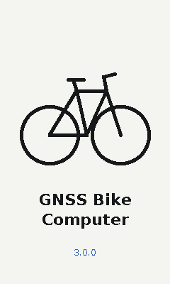 | 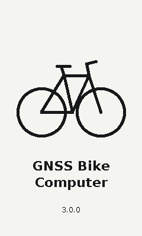 |

- **Quando:** ao ligar, até a primeira página do modo.
- **Mostra:** a bicicleta, o nome do aparelho e a versão do firmware.
- **Legacy:** o bitmap do quadro da bicicleta (`legacy/drivers/lcd/ls027_splash.h`); aqui a bicicleta é desenhada em linhas.

### 02 CRS, página 1

| 8 cores | Preto e branco |
|---|---|
| 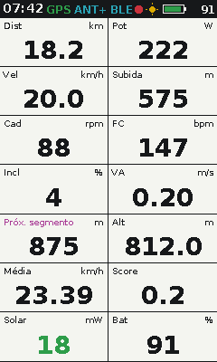 | 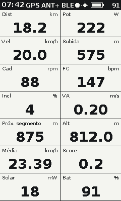 |

- **Quando:** modo CRS, sem segmento por perto.
- **Mostra, em 7 linhas de 2 campos:** Dist (km) e Pot (W); Vel (km/h) e Subida (m); Cad (rpm) e FC (bpm); Incl (%) e VA (velocidade vertical, m/s); Próx. segmento (m até o segmento mais perto) e Alt (m); Média (km/h) e Score (suffer score); Solar (mW do painel, verde carregando) e Bat (%, vermelha abaixo de 20 %).
- **Teclas:** direita vai à página 2, esquerda à página 3, centro abre o menu.
- **Legacy:** `VueCRS.cpp:116-141`, com Solar no lugar da corrente do STC3100.

### 03 CRS, 1 segmento em curso

| 8 cores | Preto e branco |
|---|---|
| 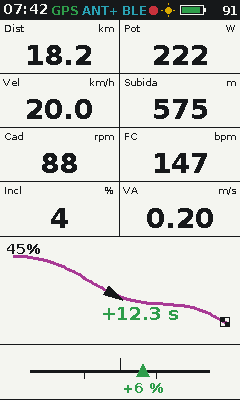 | 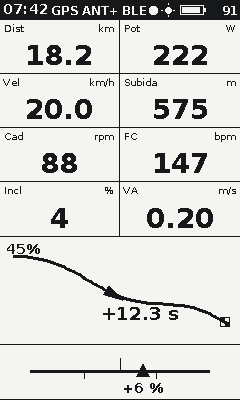 |

- **Quando:** um segmento Strava ativo.
- **Mostra:** as 4 primeiras linhas da página 1; nas linhas 5 e 6, o mini-mapa do segmento: trilha em magenta, bandeira quadriculada no fim, a seta do ciclista, a porcentagem feita no canto e a diferença para o recorde ao lado do ciclista, com sinal (verde à frente, vermelho atrás); na linha 7, o "partner": uma régua com marcas de ±10 % e o triângulo no índice de desempenho (diferença dividida pelo tempo no segmento, com no mínimo 5 s), em verde ou vermelho.
- **Legacy:** `VueCRS.cpp:145-171`, `afficheSegment()` e `partner()`.

### 04 CRS, 1 segmento chegando

| 8 cores | Preto e branco |
|---|---|
| 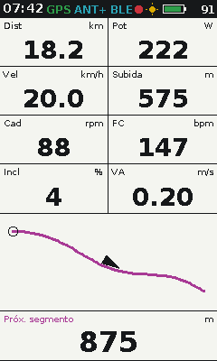 | 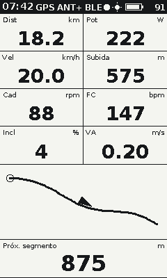 |

- **Quando:** um segmento perto, ainda não iniciado.
- **Mostra:** o mini-mapa com um círculo no início do segmento, sem porcentagem nem diferença; na linha 7, a distância até ele (Próx. segmento) na largura toda.
- **Legacy:** o mesmo `afficheScreen1()`, com o segmento em `SEG_OFF`.

### 05 CRS, 2 segmentos em curso

| 8 cores | Preto e branco |
|---|---|
| 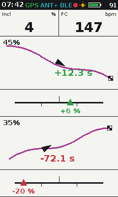 | 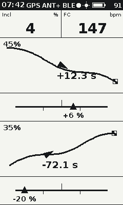 |

- **Quando:** dois segmentos ativos ao mesmo tempo.
- **Mostra:** Incl e FC na primeira linha; depois, para cada segmento, o mini-mapa em 2 linhas e o partner em 1 (o 1º no exemplo à frente, +12.3 s; o 2º atrás, −72.1 s).
- **Legacy:** `VueCRS.cpp:173-231`, caso sem segmento em `SEG_OFF`.

### 06 CRS, 2 segmentos, o 1º chegando

| 8 cores | Preto e branco |
|---|---|
| 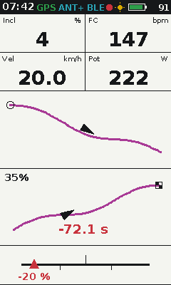 | 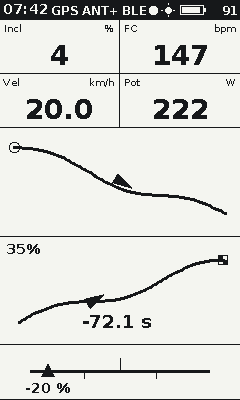 |

- **Mostra:** Incl e FC, Vel e Pot; o mapa do 1º segmento (chegando, com o círculo no início); o mapa do 2º (em curso) e o partner dele.

### 07 CRS, 2 segmentos, o 2º chegando

| 8 cores | Preto e branco |
|---|---|
| 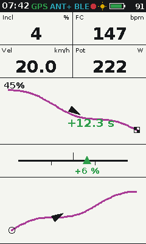 | 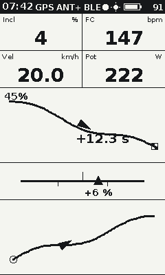 |

- **Mostra:** Incl e FC, Vel e Pot; o mapa do 1º segmento (em curso) e o partner dele; o mapa do 2º (chegando).

### 08 CRS, 2 segmentos chegando

| 8 cores | Preto e branco |
|---|---|
| 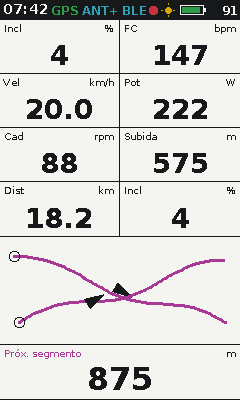 | 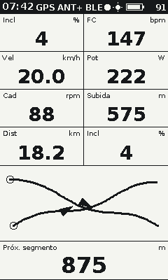 |

- **Mostra:** 4 linhas de dados (Incl e FC, Vel e Pot, Cad e Subida, Dist e Incl: o legacy repete a inclinação), os dois mapas na mesma faixa e o próximo segmento na largura toda.

### 09 CRS, página 2

| 8 cores | Preto e branco |
|---|---|
| 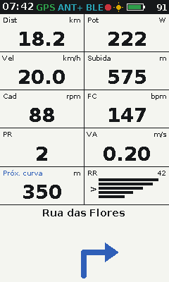 | 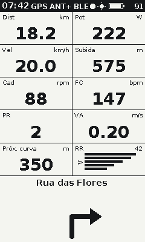 |

- **Quando:** direita na página 1.
- **Mostra:** Dist e Pot, Vel e Subida, Cad e FC, PR (recordes batidos) e VA; Próx. curva (m, da navegação do Komoot no celular) e RR (uma barra por zona de FC, com `>` na atual e o maior valor no canto); nas duas últimas linhas, o nome da rua e a seta da curva.
- **Legacy:** `VueCRS.cpp:239-266`; o legacy mostra o ícone do Komoot de 110 × 110 e não mostra a rua.

### 10 CRS, página 3

| 8 cores | Preto e branco |
|---|---|
| 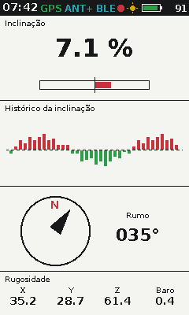 | 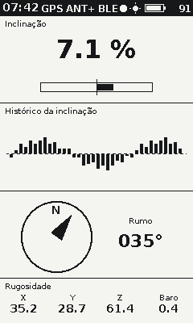 |

- **Quando:** direita na página 2.
- **Mostra:** a inclinação pelo acelerômetro, em número e numa barra de ±24 % (vermelho subindo, verde descendo); o histórico da inclinação, um valor por segundo em volta da linha do zero; a bússola com o N e a agulha, e o rumo em graus; as 4 rugosidades (X, Y e Z do acelerômetro e a do barômetro), na unidade do legacy.
- **Legacy:** `VueCRS.cpp:268-319` (`afficheSensors()`).

### 11 Notificação

| 8 cores | Preto e branco |
|---|---|
| 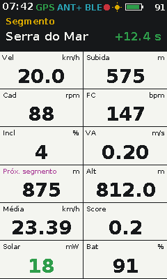 | 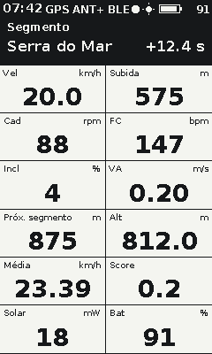 |

- **Quando:** um evento: segmento terminado, sensor conectado ou perdido, erro.
- **Mostra:** uma faixa preta no topo, por cima de qualquer tela, com o título em amarelo, a mensagem em branco e o valor com sinal à direita, em verde ou vermelho.
- **Regras:** fila de até 10; cada uma fica cerca de 5 s; qualquer tecla fecha.
- **Legacy:** `Vue::addNotif()`.

## Outros modos

### 12 GNSS procurando

| 8 cores | Preto e branco |
|---|---|
| 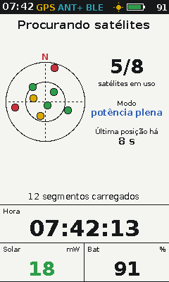 | 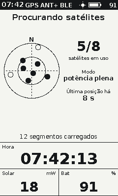 |

- **Quando:** em CRS ou PRC, sem fix ou com a última posição mais velha que 6 s; volta sozinha à página quando a posição volta.
- **Mostra:** o céu com os satélites (norte para cima, horizonte e 45°), coloridos pelo sinal (no preto e branco, cheio em uso e vazio fora); satélites em uso sobre os vistos; o modo do receptor (aquisição, LEAP, potência plena); a idade da última posição; os segmentos carregados; a Hora na largura toda; Solar e Bat.
- **Legacy:** `VueGPS.cpp:18-43`, com o céu no lugar do texto do `displayGPS2()`; o limite de 6 s é o `LOCATOR_MAX_DATA_AGE_MS`.

### 13 PRC

| 8 cores | Preto e branco |
|---|---|
| 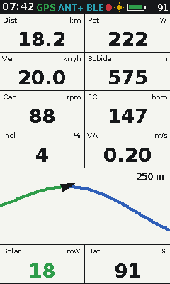 | 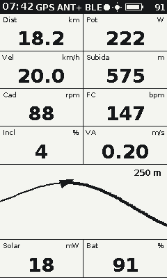 |

- **Quando:** modo PRC, seguindo um percurso escolhido no menu.
- **Mostra:** Dist e Pot, Vel e Subida, Cad e FC, Incl e VA; o mapa do percurso nas linhas 5 e 6: verde o que já foi percorrido, azul o que falta (no preto e branco, linha fina e grossa), o primeiro segmento em magenta, a seta do ciclista e a escala do zoom em metros; Solar e Bat.
- **Teclas:** esquerda afasta o zoom, direita aproxima.
- **Legacy:** `VuePRC.cpp:61-96`.

### 14 PRC sem percurso

| 8 cores | Preto e branco |
|---|---|
| 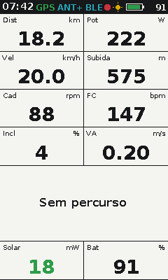 | 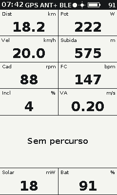 |

- **Mostra:** "Sem percurso" no lugar do mapa; o legacy só registrava no log (`VuePRC.cpp:91`).

### 15 FEC conectando

| 8 cores | Preto e branco |
|---|---|
| 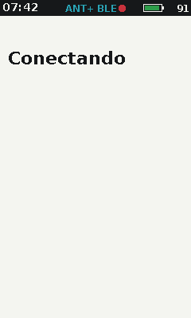 | 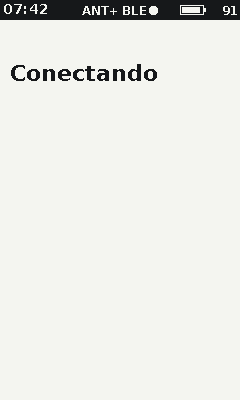 |

- **Quando:** modo FEC (rolo de treino), até o rolo mandar o primeiro dado.
- **Legacy:** "Connecting" em `VueFEC.cpp:43`.

### 16 FEC

| 8 cores | Preto e branco |
|---|---|
| 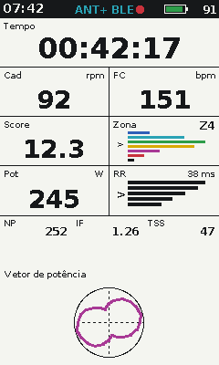 | 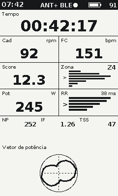 |

- **Mostra:** Tempo decorrido na largura toda; Cad e FC; Score e Zona (uma barra por zona de potência com o tempo em cada uma, `>` na atual e o número da zona); Pot e RR; nas 3 últimas linhas, o vetor de potência de uma volta do pedal.
- **Legacy:** `VueFEC.cpp:34-90`, em 6 linhas; aqui na grade de 7 com a barra de estado.

### 17 DBG

| 8 cores | Preto e branco |
|---|---|
| 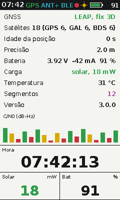 | 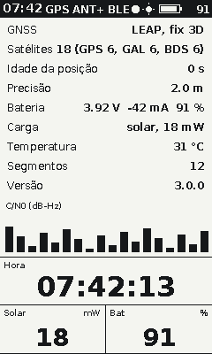 |

- **Quando:** menu, Modo DBG (a tela de depuração sobre o laço do CRS).
- **Mostra:** modo e fix do GNSS, satélites por sistema, idade e precisão da posição, bateria (tensão, corrente, porcentagem), carga, temperatura, segmentos carregados, versão, o C/N0 de cada satélite em barras; a Hora; Solar e Bat.
- **Legacy:** `VueDebug.cpp`, com os dados do hardware novo.

## Menus

Em todas as listas: esquerda e direita mudam o item (dão a volta nas pontas, como no legacy), o centro executa e o centro longo volta à página.

### 18 Menu

| 8 cores | Preto e branco |
|---|---|
| 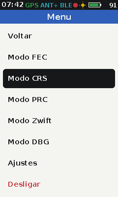 | 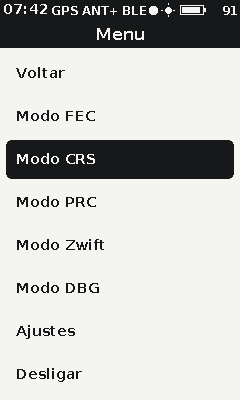 |

- **Quando:** centro numa página, depois dos 5 s iniciais (como o legacy, `Menuable.cpp:326`).
- **Itens:** Voltar, Modo FEC, Modo CRS, Modo PRC, Modo Zwift, Modo DBG, Ajustes, Desligar (em vermelho).
- **Legacy:** `Menuable.cpp:255-289`, em português.

### 18b Percursos

| 8 cores | Preto e branco |
|---|---|
| 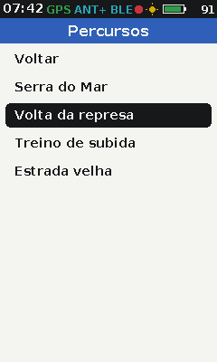 | 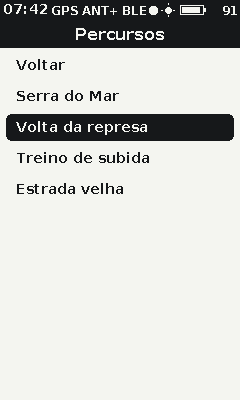 |

- **Quando:** menu, Modo PRC.
- **Itens:** Voltar e os percursos do cartão (até 10); o escolhido abre o modo PRC com ele.
- **Legacy:** `Menuable.cpp:46-78`.

### 18c Nenhum percurso

| 8 cores | Preto e branco |
|---|---|
| 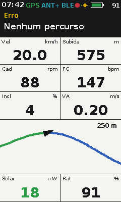 | 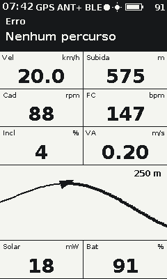 |

- **Quando:** Modo PRC sem nenhum percurso no cartão: a notificação "Erro: Nenhum percurso" aparece sobre a página, e o modo não muda.
- **Legacy:** "Error: No PRC in memory" (`Menuable.cpp:61`).

### 19 Ajustes

| 8 cores | Preto e branco |
|---|---|
| 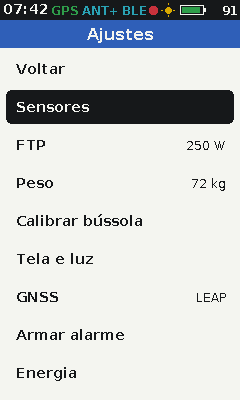 | 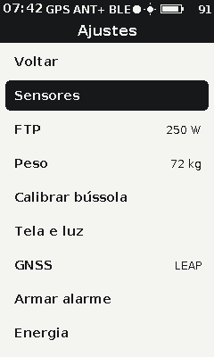 |

- **Itens:** Voltar, Sensores, FTP (com o valor), Peso (com o valor), Calibrar bússola, Tela e luz, GNSS (LEAP ou potência plena), Energia, Formatar (em vermelho).
- **Legacy:** o Settings (`Menuable.cpp`), com os pareamentos reunidos em Sensores e os itens novos da placa nova.

### 20 Sensores

| 8 cores | Preto e branco |
|---|---|
| 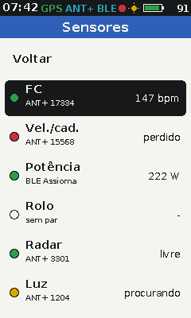 | 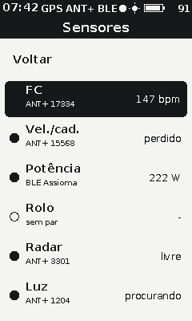 |

- **Itens:** Voltar e um por tipo: FC, velocidade e cadência, potência, rolo, radar e luz; cada um com a bolinha de estado (verde conectado, vermelha perdido, amarela procurando, vazia sem par), o rádio e o dispositivo embaixo e o último dado à direita.
- **Centro:** abre o pareamento daquele tipo.
- **Legacy:** nova; o legacy tinha só "Pair HRM", "Pair BSC" e "Pair FEC".

### 21 Parear

| 8 cores | Preto e branco |
|---|---|
| 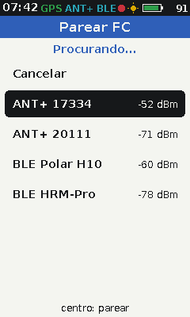 | 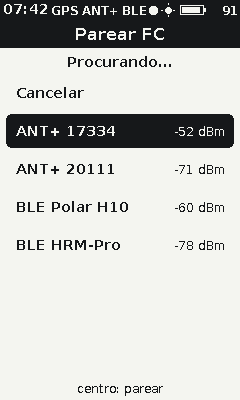 |

- **Mostra:** "Procurando...", Cancelar e os dispositivos achados (ANT+ com o número, BLE com o nome), com o sinal em dBm; até 7, como o legacy.
- **Centro:** pareia o escolhido e volta a Sensores.
- **Legacy:** `MenuPagePairing` e `_page1_mode_ant_list()`, agora também com BLE.

### 22 Editar valor

| 8 cores | Preto e branco |
|---|---|
| 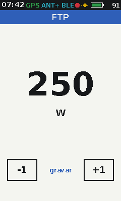 | 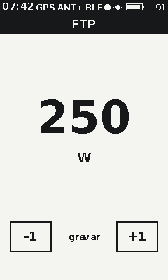 |

- **Mostra:** o valor grande (FTP em W ou peso em kg), −1 sobre a tecla da esquerda, +1 sobre a da direita e "gravar" sobre o centro.
- **Limites:** de 1 a 2000 W e de 1 a 255 kg (o legacy não limitava).
- **Legacy:** `MenuPageSetting`.

### 23 Tela e luz

| 8 cores | Preto e branco |
|---|---|
| 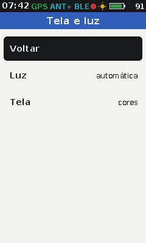 | 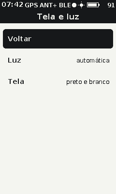 |

- **Itens:** Voltar, Luz (automática ou desligada) e Tela (cores ou preto e branco). Nova: a V3 não tinha luz nem cores.

### 24 Formatar

| 8 cores | Preto e branco |
|---|---|
|  |  |

- **Mostra:** "Formatar o cartão?", Cancelar e "Formatar e apagar".
- **Legacy:** formatava na hora, sem pergunta (`Menuable.cpp:102-110`).

## Sistema

### 25 Energia

| 8 cores | Preto e branco |
|---|---|
|  |  |

- **Mostra:** a carga em % e numa barra; tensão, corrente (negativa descarregando), fonte de carga, até onde o painel carrega, temperatura da célula e a autonomia estimada. Nova.

### 26 Modo USB

| 8 cores | Preto e branco |
|---|---|
|  |  |

- **Quando:** o cartão aparece no computador como disco (MSC); o legacy não mostrava nada. Aviso de não desconectar.

### 27 Desligando

| 8 cores | Preto e branco |
|---|---|
|  |  |

- **Quando:** desligamento pelo menu, pelo centro longo, pela bateria no fim ou depois de 15 min parado.
- **Mostra:** "Salvando atividade", a barra de progresso e "Desligando". Nova: o legacy desligava sem aviso.

### 30 Perfil do percurso

| 8 cores | Preto e branco |
|---|---|
|  |  |

- **Quando:** no modo PRC, com toque longo na tecla direita; o mesmo toque volta para o mapa.
- **Mostra:** o relevo do percurso inteiro, o trecho já pedalado em verde (no tema de uma cor, só o contorno), a posição do ciclista, a subida que falta, o que resta em quilômetros e as altitudes mínima e máxima. Nova: o legacy não tinha perfil.

### 31 Voltas e totais

| 8 cores | Preto e branco |
|---|---|
|  |  |
|  |  |

- **Quando:** quarta página do anel do CRS, com a tecla direita na página 3. O toque longo na tecla **esquerda**, de qualquer página de dados, fecha a volta e começa outra.
- **Mostra:** a volta em curso (número, distância e tempo em movimento), o tempo em movimento do passeio inteiro, a média e a máxima, a descida e a energia gasta. Quando o cronômetro para sozinho porque a bicicleta parou, aparece **PAUSADO** no canto.
- **Nova:** o legacy não tem cronômetro, nem pausa, nem volta, nem descida — ele grava do momento em que liga até desligar ([`model/activity.h`](../../zephyr_app/include/model/activity.h)).

### 33 Subida em curso

| 8 cores | Preto e branco |
|---|---|
|  |  |
|  |  |

- **Quando:** no modo PRC, **sozinha**, assim que o ciclista chega ao pé de uma subida do percurso; o topo devolve o mapa. O toque longo na tecla direita sai antes da hora. É o ponto do recurso: o ciclista não pede a tela, ela aparece.
- **Mostra:** qual subida é e quantas o percurso tem, a categoria pela escala do ciclismo (C4 a C1, FC), o perfil **da subida** com o trecho já pedalado em verde e o resto colorido pela inclinação (azul até 6 %, amarelo até 10 %, vermelho acima), quanto falta de distância e de altimetria, a média do que resta e a inclinação dos próximos 200 m. Entre duas subidas, mostra a distância até o pé da próxima e o tamanho dela.
- **Nova:** o legacy mostra o percurso inteiro e a subida total, e nada sobre a subida em que se está ([`model/climb.h`](../../zephyr_app/include/model/climb.h), [06](../06-algoritmos.md#subidas-do-percurso-climbpro)).

### 35 Radar traseiro

| 8 cores | Preto e branco |
|---|---|
|  |  |

- **Quando:** com um radar traseiro pareado (Garmin Varia e semelhantes). Não é uma página: é uma **faixa** na borda direita das páginas que têm desenho (o mapa do PRC, o perfil e a subida) mais um **ponto** na barra de estado, que aparece em todas as páginas.
- **Mostra:** a faixa é a pista vista de cima — embaixo a bicicleta, em cima o alcance do radar — com uma marca por veículo na distância dele, azul para quem só se aproxima, amarelo para quem vem rápido e vermelho para quem está perto ou muito rápido. Uma marca que parou de ser reportada fica **vazada** em vez de sumir, porque um radar perde quadro e marca piscando é pior que marca parada. O ponto da barra de estado tem a cor do pior veículo atrás.
- **Por que só nas páginas com desenho:** nas páginas de dados as unidades ficam na borda direita, e a faixa cobriria o texto.
- **Nova:** o legacy é anterior ao Varia e não tem radar. O formato BLE do Varia é de engenharia reversa e **não foi conferido em aparelho** ([`model/radar_wire.h`](../../zephyr_app/include/model/radar_wire.h)); pelo ANT+, o perfil não pode entrar neste repositório ([`rf/radar_ant.h`](../../zephyr_app/include/rf/radar_ant.h)).

### 36 Queda e alarme

| 8 cores | Preto e branco |
|---|---|
|  |  |
|  |  |

- **Quando:** toma a tela sozinha, como a atualização, porque enquanto está no ar é a única coisa que importa. Ou porque o aparelho achou que houve queda (pico de aceleração, bicicleta parada e aparelho quieto por 8 s), ou porque o alarme estava armado e a bicicleta se moveu.
- **Mostra:** o triângulo de aviso, o que aconteceu e, na queda, os segundos que faltam para o aparelho dar o alerta por Bluetooth. **Qualquer tecla cancela** e desarma.
- **Como armar o alarme:** menu, Ajustes, "Armar alarme" — o item vira "Desarmar alarme" em vermelho enquanto está armado.
- **Nova, e não é equipamento de segurança:** o legacy não tem nada disso, e isto erra nos dois sentidos — perde quedas e dispara à toa. Ninguém deve pedalar diferente porque está ligado ([`model/incident.h`](../../zephyr_app/include/model/incident.h), [06](../06-algoritmos.md#alarme-da-bicicleta-e-detecção-de-queda)).

### 28 Atualização

| 8 cores | Preto e branco |
|---|---|
|  |  |
|  |  |

- **Quando:** um aplicativo manda firmware novo por Bluetooth ([07](../07-radio-ant-ble.md#atualização-por-ble-dfu)). Toma a frente sozinha e devolve as páginas ao terminar.
- **Mostra:** a seta entrando no aparelho, a porcentagem da imagem recebida e "Não desligue"; no fim, "Reinicie para aplicar". Nova: o legacy não atualizava pelo ar.

## Botões

| Onde | Esquerda | Centro | Direita | Centro longo |
|---|---|---|---|---|
| CRS | página anterior | menu | próxima página | desligar |
| Qualquer página de dados, esquerda longa | marca uma volta | — | — | — |
| PRC | afasta o zoom | menu | aproxima o zoom | desligar |
| FEC, DBG, GNSS procurando | — | menu | — | desligar |
| Listas dos menus | item anterior | executa | próximo item | volta à página |
| Editar valor | −1 | grava e volta | +1 | — |
| Notificação | fecha | fecha | fecha | fecha |

O toque longo é proposta da placa nova; o legacy só tinha o toque curto.
