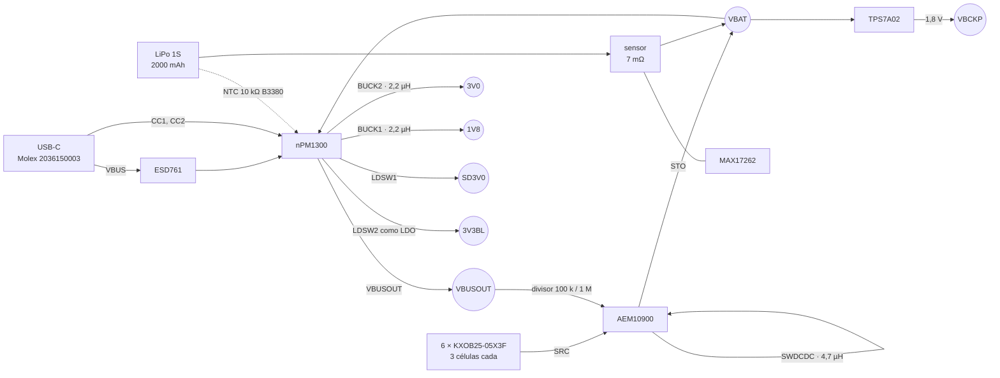
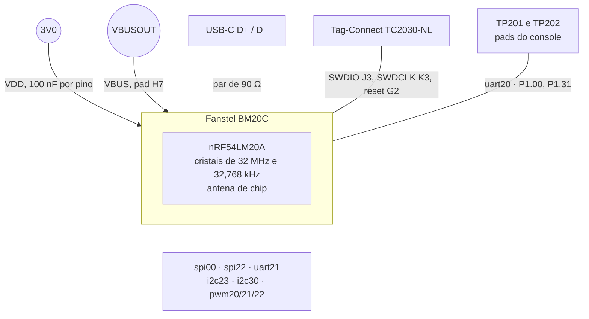
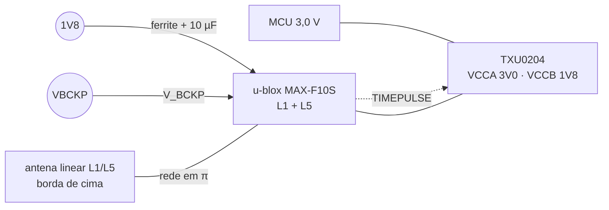
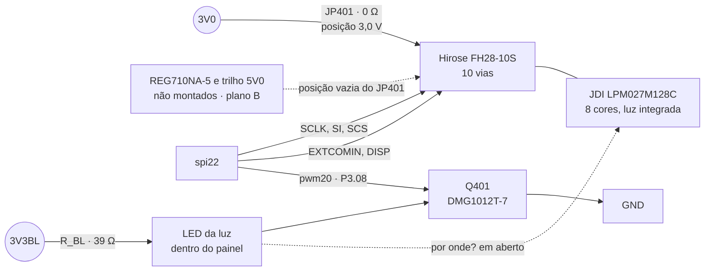
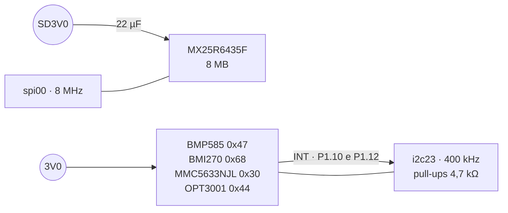
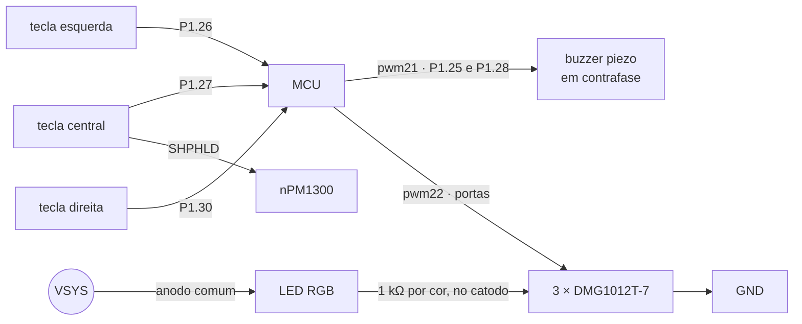

# Folhas do esquemático

As seis folhas, bloco a bloco. Cada uma traz o circuito, as decisões que
não aparecem no desenho e o que fica em aberto. As ligações completas
estão na [lista de nós](03-netlist.md) e os valores, nos
[cálculos](02-calculos.md).

**Nesta página:** [Folha 1 · Energia](#folha-1--energia) · [Folha 2 · MCU](#folha-2--mcu) · [Folha 3 · GNSS](#folha-3--gnss) · [Folha 4 · Display](#folha-4--display) · [Folha 5 · Memória e sensores](#folha-5--memória-e-sensores) · [Folha 6 · Interface](#folha-6--interface)

> [!WARNING]
> Nada aqui foi montado. Não existe placa, não existe layout, nenhum
> componente passou por bancada.

## Folha 1 · Energia

Três fontes entram (USB, painel solar e célula), quatro trilhos saem.



### As decisões desta folha

**O USB bloqueia o painel em hardware.** O divisor de 100 kΩ e 1 MΩ leva
o `VBUSOUT` ao `DIS_STO_CH` do AEM10900, de modo que enquanto houver cabo
o colhedor não carrega. Não passa por pino do MCU nem por firmware: se o
firmware travar com as duas fontes ativas, as duas disputariam a mesma
célula. É a decisão de [15](../docs/15-avaliacao-componentes.md#convivência-das-duas-cargas).

**O `VSET` é resistor, não registrador.** O BUCK2 sai em 3,0 V pelo
`RVSET2` de 150 kΩ e o BUCK1 em 1,8 V pelo `RVSET1` de 47 kΩ. Isso importa
porque **é o BUCK2 que alimenta o MCU**: sem ele o aparelho não liga, e
nenhum firmware conserta um resistor errado. A tabela do VSET1 nem tem
3,0 V; a do VSET2 tem — foi por isso que o trilho do MCU foi para o BUCK2.

**O medidor fica entre a célula e tudo.** O sensor de 7 mΩ do MAX17262 vai
entre `BATT` e `SYS`, e não entre o nPM1300 e o resto: assim ele mede a
corrente líquida de **todas** as fontes, inclusive a do painel com o
aparelho desligado. Sem isso o ciclista veria a bateria subir sozinha sem
que nada contasse quanto.

**Nenhuma fonte externa alimenta o `VSYS`**, que a ficha do nPM1300
proíbe: ele é saída do power path e parece uma entrada, o que torna o
engano fácil.

No `VBAT` a regra é outra e mais estreita do que "nada pendura nele". Ali
estão, além do `VBAT` do nPM1300, o `STO` do AEM10900, o `IN` do TPS7A02 e
o `SYS` do medidor — e é assim de propósito: o colhedor **carrega** a
célula por esse nó e o LDO do `V_BCKP` precisa da célula direto, para
sobreviver ao ship mode. O que não pode é carga da aplicação pendurada
ali, desviando do caminho de medição.

> [!NOTE]
> **Falta conferir de que lado do sensor interno fica cada pino do
> MAX17262.** A [especificação](../docs/14-hardware-placa-nova.md#carga)
> diz "sensor entre `BATT` e `SYS`", e esta lista de nós põe o `BATT` no
> lado da célula e o `SYS` no nó do sistema. Trocar os dois inverte o sinal
> da corrente medida, e é erro que sai do layout sem aparecer na bancada,
> porque o medidor continua respondendo. Fechar contra a ficha.

**O LED de carga não precisa de firmware.** O `LED1` do nPM1300 sai de
fábrica como indicador de carga e o `LED0` como indicador de erro. Com o
anodo no `VSYS`, o LED acende com o aparelho desligado — que é justamente
quando alguém quer saber se está carregando.

**A tecla central liga o aparelho.** Ela vai ao `SHPHLD`, que tem pull-up
interno de 50 kΩ, e **também** a um GPIO, porque o firmware precisa ler a
mesma tecla enquanto o aparelho está ligado. Segurar por mais de 10 s
religa o sistema inteiro, e isso vem ligado de fábrica.

> [!CAUTION]
> **Um termistor para o AEM10900, nunca dois.** A fonte oferece duas
> saídas e a palavra é **ou**: o segundo NTC vem do pack, pelo conector,
> **ou** é um TDK NTCG103JF103FT1 na face de trás da placa, sob a célula
> ([15](../docs/15-avaliacao-componentes.md#detalhes-para-o-esquemático)).
> Montar os dois põe 10 kΩ em paralelo com 10 kΩ no `TH_MON`, e a conta é
> feia (**conta**, com B = 3380):
>
> ```
> 10 kΩ ∥ 10 kΩ = 5 kΩ
> 5 kΩ com B3380 equivale a 44,4 °C
> ```
>
> O corte do AEM10900 é **45 °C**. Com os dois montados, o colhedor
> enxerga 44,4 °C com a célula a 25 °C e **desliga a carga solar com o
> ambiente pouco acima da temperatura de uma sala** — sem nada passar por
> firmware, sem erro, sem aviso. A lista de compras aprova a peça de placa
> e o conector tem via para a do pack: os dois caminhos existem no
> material, e é a montagem que tem de escolher um.

### Em aberto nesta folha

- O indutor do AEM10900: a tabela 6 e a fórmula da ficha não batem ([02](02-calculos.md#colheita-solar)).
- O calor do carregador linear numa caixa vedada ([02](02-calculos.md#calor-do-carregador)).
- O fator θ·L da e-peas, que falta para o firmware informar a potência do painel em mW.
- **O driver do AEM10900 não grava `TMONEN`, `HPEN` nem `KEEPALEN`.** Ele
  escreve `VOVDIS`, `VOVCH`, `APM` e `CTRL`, e valida com `CTRL.UPDATE = 1`.
  A [avaliação](../docs/15-avaliacao-componentes.md#detalhes-para-o-esquemático)
  avisa que os registradores partem dos **valores de fábrica, não dos
  pinos**, e que os três precisam ficar em 1 — o keep-alive, que é o que
  faz a configuração sobreviver ao `3V0` desligado, é um deles.

## Folha 2 · MCU



### As decisões desta folha

**A radiofrequência não é deste projeto.** O casamento, a antena e os dois
cristais vêm dentro do módulo, certificado em FCC, ISED, Europa, Austrália
e Nova Zelândia. O que a placa faz em volta dele é: desacoplar, respeitar
a zona da antena e levar USB, SWD e console para fora. **É por isso que
as diretrizes de projeto de radiofrequência do nRF54LM20 não são
obrigatórias aqui** — e passariam a ser, todas, se o chip fosse direto na
placa.

**O console sai em dois pads, não em conector.** O `uart20` em P1.00 e
P1.31 vai a dois pontos de teste. Um ciclista nunca o vê; quem precisa
dele encosta uma ponta. O plano anterior punha o console no `uart30`, ao
lado do `i2c30` da energia, o que **o silício recusa**: cada bloco serial
do nRF54LM20A tem um periférico só, e `uart30` e `i2c30` são o mesmo
bloco.

**A depuração é sem conector.** O footprint Tag-Connect TC2030-NL só tem
furos e pads; o cabo se encosta com um clipe. Numa placa de 55 × 97 mm
dentro de uma caixa vedada, um conector de dez vias seria volume gasto
para sempre por uma coisa que se usa no protótipo.

### Em aberto nesta folha

- **O pad LGA de cada GPIO.** A ficha do módulo diz que ele expõe 64 dos
  66 GPIO — todos menos P1.20 e P1.21, que ficam com o cristal —, e os 31
  pinos deste esquemático estão fora desse par, de modo que **o mapa cabe**.
  O de-para pino a pino não foi levantado, e o layout precisa dele.
- **A tolerância do cristal de 32,768 kHz.** O ANT+ exige ±50 ppm e a
  ficha do BM20C não informa. Pergunta à Fanstel, e medida do LFCLK contra
  o 1 PPS do receptor no protótipo.

## Folha 3 · GNSS



### As decisões desta folha

**O receptor roda a 1,8 V e o MCU a 3,0 V.** A 1,8 V o MAX-F10S gasta
cerca de 17 % menos que a 3,0 V, e o MCU não pode descer porque o display
pede as entradas no nível do VDD dele. O preço é um tradutor de nível no
meio, e uma regra que não perdoa: o `V_IO` do receptor tem **máximo
absoluto de 1,98 V**, de modo que o BUCK1 fica travado em 1,8 V também no
devicetree, embora o registrador aceitasse até 3,3 V.

**O `V_BCKP` vem de um LDO próprio, não do BUCK1.** O TPS7A02 tira 1,8 V
direto da célula e gasta 25 nA. É ele que mantém as efemérides e o relógio
do receptor com o aparelho em ship mode, e é isso que faz a próxima
partida ser quente em vez de fria. Se o `V_BCKP` saísse do BUCK1, desligar
o aparelho apagaria a memória do receptor.

**O `RESET_N` é dreno aberto e o firmware não o pulsa.** Um reset apaga a
memória de backup, que é exatamente o que o `V_BCKP` existe para preservar.
O driver só segura a linha.

### O tradutor, e um erro que este documento cometeu

O TXU0204 tem **direção fixa**: `A1` e `A2` do lado de 3,0 V para o de
1,8 V, `B3` e `B4` no sentido contrário. Os quatro canais atendem
exatamente os quatro sinais que precisam de tradução:

| Canal | Sinal | Direção |
|---|---|---|
| `A1` → `B1` | `TX` do MCU, `RXD` do módulo | MCU → receptor |
| `A2` → `B2` | `EXTINT` | MCU → receptor |
| `B3` → `A3` | `TXD` do módulo, `RX` do MCU | receptor → MCU |
| `B4` → `A4` | `TIMEPULSE` | receptor → MCU |

O **`RESET_N` não passa pelo tradutor**: o pino do MCU é dreno aberto, só
puxa para baixo, e o pull-up de 7 a 13 kΩ é interno ao módulo. O `OE` fica
fixo no `VCCA`, porque o Ioff-float já isola o módulo desligado e o MCU
ganha um pino.

> [!NOTE]
> **Um rascunho anterior desta folha errou isto de três maneiras ao mesmo
> tempo**, e vale registrar porque é o tipo de erro que só aparece com a
> placa na mão: passou o `RESET_N` pelo tradutor, concluiu daí que "cinco
> sinais não cabem em quatro canais" e deixou o `EXTINT` sem componente; e
> ainda pôs o `RX` num canal que vai do MCU para o receptor e o `RESET_N`
> num que vai do receptor para o MCU — **saída contra saída nos dois
> pares**, de modo que o receptor nunca teria mandado um byte. A
> [especificação](../docs/14-hardware-placa-nova.md#gnss) e a
> [avaliação](../docs/15-avaliacao-componentes.md#gnss) já traziam o
> arranjo certo, sinal por sinal. Inventar o problema custou mais do que
> ler a fonte teria custado.

### Em aberto nesta folha

- **A antena é a TE L000670-01**, aprovada e em estoque na [lista de
  compras](../docs/19-lista-de-compras.md). O que está em aberto não é a
  compra, é o desempenho: 66 % de eficiência em L1 e 56 % em L5 num plano
  de 90 × 41 mm, e o plano desta placa é menor. Garmin, COROS e Wahoo
  usam elementos lineares na parede da caixa, ligados por mola ou cabo
  flexível; nenhum usa patch cerâmica ([13](../docs/13-placa-nova.md#antena-gnss-dentro-da-caixa)).
- **Com o F10S a rede em π tem de sintonizar L1 e L5 na mesma rede**, e
  não só L1: a TE mede a peça com 0 Ω em série e os paralelos vazios, e
  quem escolhe os valores é a sintonia com VNA **dentro da caixa final**.
- O AssistNow não existe no F10S: ele é ROM, e só tem Offline e Autonomous,
  de L1.

## Folha 4 · Display



### As decisões desta folha

**A tela é o JDI LPM027M128C, decidido em 2026-09-23.** Peça única: 2,7",
400 × 240, MIP de 8 cores, **com luz frontal integrada**. Ela substitui o
par que a lista de compras trazia, a Sharp LS027B7DH01A mais o filme Azumo
11103-06_A1 — sem etapa de laminação, mesma resolução (a interface não
muda), consumo menor e cor. **A Sharp continua sendo o plano B**, no mesmo
conector, se o JDI não chegar.

**O caminho de 5 V saiu.** O JDI vive em 3,0 V, de modo que o `U401`
(REG710NA-5), o `C401` de bombeamento e os dois de 10 µF de entrada e de
saída **não são montados**, e o trilho `5V0` deixa de existir na placa
construída. Os footprints ficam no desenho, porque são eles que fazem o
plano B ser uma troca de montagem e não uma placa nova.

**O `DISP_PWR_EN` (P3.07) fica livre.** Ele era o `EN` do REG710; sem o
regulador, o pino volta a ficar disponível para outro uso. **O firmware
ainda o declara** como `power-gpios` do nó do display no
[devicetree](../zephyr_app/boards/gnss/gnssbike/gnssbike_nrf54lm20a_cpuapp.dts),
com o pull-down de 100 kΩ do `R403` segurando o nível: não faz mal, mas é
linha a limpar quando alguém quiser o pino.

**Um conector, duas telas.** Os dez pinos das duas fichas estão na mesma
ordem (`SCLK`, `SI`, `SCS`, `EXTCOMIN`, `DISP`, `VDDA`, `VDD`, `EXTMODE`,
`VSS`, `VSSA`), e o mesmo Hirose FH28-10S-0.5SH(05) aparece nas duas.

> [!CAUTION]
> **Um JDI com 5 V queima**: o máximo absoluto dele é 3,6 V. Com uma tela
> só, o `JP401` deixa de ser um seletor: ele vira um **0 Ω fixo na posição
> do 3,0 V**, e a posição do 5 V fica **sem peça**. O footprint das três
> posições continua no desenho de propósito — é ele que permite montar a
> Sharp do plano B sem redesenhar a folha —, e o pad do meio continua sendo
> **um só**, de modo que nenhuma montagem consegue pôr os dois trilhos no
> painel ao mesmo tempo. Uma alternativa seria apagar o jumper e ligar o
> `3V0` direto ao painel em cobre; ela é mais segura contra erro de
> montagem e custa o plano B, que passaria a exigir corte de trilha.

**O chip select é ativo alto.** Ao contrário de quase todo SPI. Vale
repetir aqui porque é o tipo de coisa que se inverte sem pensar.

**O `EXTMODE` vai ao VDD do display, seja ele qual for.** Com ele alto, o
VCOM inverte nas bordas de subida do `EXTCOMIN`, que é um PWM do MCU —
1 Hz com a luz apagada e cerca de 120 Hz com ela acesa, para o COM ficar
perto dos 60 Hz que a ficha pede. A V3 fazia diferente: `EXTMODE` no GND e
VCOM pelo SPI.

**Com o JDI os 120 Hz passam.** O driver aceita até **140 Hz** no JDI
(`MEMLCD_COM_HZ_MAX_JDI`, em
`zephyr_app/modules/gnss_drivers/drivers/display/memlcd.c:46`) contra
20 Hz na Sharp. Enquanto a placa declarava `sharp,ls027b7dh01`, o pedido de
120 Hz da interface era recusado com `-EINVAL` e o COM ficava em 1 Hz com a
luz acesa, que é justamente o que o `EXTCOMIN` existe para evitar. Com
`jdi,lpm027m128c` no devicetree **esse defeito deixa de existir** — e ele
volta a existir se alguém montar o plano B sem mexer no firmware.

### Em aberto nesta folha

> [!CAUTION]
> **Não se sabe por onde a luz do C se liga, e isso trava a folha 4.** O
> FPC de 10 vias que as duas telas compartilham — `SCLK`, `SI`, `SCS`,
> `EXTCOMIN`, `DISP`, `VDDA`, `VDD`, `EXTMODE`, `VSS`, `VSSA` — **não tem
> par para o LED**, e o `J402` existia justamente porque a luz da Sharp
> vinha num filme separado. O C tem de ter **ou um FPC com mais vias, ou um
> rabicho próprio para a luz**, e **nenhum documento do projeto traz isso**:
> a ficha que o projeto leu é a do **LPM027M128B**, que não tem luz. Sem
> essa informação não dá para desenhar a folha 4 nem posicionar o conector
> da luz no layout. **Alta prioridade, e antes do layout**: sai da ficha do
> LPM027M128C ou de uma amostra na mão.

- **Sem canal autorizado e sem garantia.** O anúncio escolhido é de
  **R$ 776** no AliExpress
  ([link](https://pt.aliexpress.com/item/1005011938384752.html)); a JDI não
  lista mais MIP, a Switch Science encerrou as vendas e nenhum distribuidor
  tem a peça. Comprar é comprar de revendedor, sem procedência
  ([15](../docs/15-avaliacao-componentes.md#a-luz-da-tela-procurada-em-2026-09-23)).
- **A tela é o item mais caro da placa**, e ficou mais cara: R$ 776, ou
  cerca de **US$ 144** a R$ 5,40 por dólar, contra os US$ 23,61 + US$ 66,45
  = **US$ 90,06** do par Sharp + Azumo. São **US$ 54 a mais por placa**
  ([19](../docs/19-lista-de-compras.md#custo)).
- A `LDSW2` sai de regulação com o `VSYS` perto de 3,4 V: a luz enfraquece
  com a bateria baixa, e isso não tem conserto no resistor.
- **No plano B** (Sharp mais filme Azumo) voltam o `U401`, o `C401`, os dois
  de 10 µF, o `DS402`, o `J402` e o `JP401` na posição do 5 V; o `R_BL`
  deixa de ser 39 Ω e passa a depender da tensão direta do filme, que só a
  amostra dá ([02](02-calculos.md#luz-do-display)).

## Folha 5 · Memória e sensores



### As decisões desta folha

**Não há cartão.** O soquete microSD saiu em 2026-09-20: uma peça soldada
custa menos do que o armazenamento inteiro vale. A MX25R6435F fica sozinha
no `spi00`, e os 8 MB dela guardam as atividades, os segmentos e os
percursos, montados em `/SD:` como sempre foi. Quem quiser cartão num
protótipo põe num overlay, no chip select livre de P2.03.

**A flash fica atrás da chave de alimentação.** A `LDSW1` corta o `SD3V0`,
e com o trilho desligado os pinos do `spi00` precisam ficar em nível baixo
ou em alta impedância — senão a peça se alimenta pelos pinos de sinal, que
é um jeito conhecido de uma flash nunca desligar de verdade.

**Nada varre este barramento I²C.** O endereço `0x7E` põe o MMC5633NJL em
I3C, e ele só sai disso faltando energia. O firmware fala com endereços
conhecidos e ponto.

**O `CSB` do BMP585 tem de estar no VDDIO na partida**, ou o I²C fica
desligado até o próximo corte de energia. É condição de partida, não de
firmware.

### Em aberto nesta folha

> [!CAUTION]
> **Ninguém liga a chave de alimentação da flash.** O nó `LDO1` do nPM1300
> (a `LDSW1`, que entrega o `SD3V0`) está declarado no
> [devicetree](../zephyr_app/boards/gnss/gnssbike/gnssbike_nrf54lm20a_cpuapp.dts)
> **sem `regulator-boot-on` e sem apelido**, a `mx25r6435f@0` **não declara
> `supply` nenhum**, e nada em `zephyr_app/src/` referencia o regulador. Na
> placa de verdade isso quer dizer **flash sem energia e armazenamento que
> não funciona**, em silêncio — no DK não aparece, porque lá a flash é
> alimentada pelo próprio kit.
>
> Três saídas, e é decisão de firmware, não de esquemático: dar um `supply`
> à flash, como o GNSS já tem (`vcc-supply = <&npm1300_buck1>`); ligar a
> `LDSW1` no boot; ou tirar a chave do circuito e aceitar a flash sempre
> alimentada, perdendo os nanoampères do deep power down.
>
> **E há um segundo efeito, que só aparece somando os dois defeitos:** com
> o `SD3V0` em 0 V, o serviço de armazenamento aciona um SPI de 8 MHz
> contra uma peça sem alimentação, e ela **se alimenta pelos diodos de
> grampo do `SCK` e do `MOSI`** — agora através dos 33 Ω de série, que
> limitam a corrente mas não impedem o caminho. É o modo de falha que a
> própria folha descreve duas linhas acima, acontecendo hoje. **Achado pelo
> dry-run de 2026-09-23, ao escrever a [sequência de partida](07-sequencias-e-protecao.md).**

- **8 MHz é uma frequência ruim para o L1.** Harmônicos de 8 MHz caem a
  menos de 0,6 MHz do centro de 1575,42 MHz. A flash é a única coisa
  rápida perto do receptor, e a mitigação é de layout: resistor em série
  para amaciar a borda, trilha curta, camada interna entre planos. Está
  registrado em [04](04-pcb-e-caixa.md).
- Os eixos dos sensores na placa ainda precisam ser confirmados contra o
  que o firmware espera.

## Folha 6 · Interface



### As decisões desta folha

**As três teclas são Omron B3S-1002P**, IP67 pela ficha, de 6 × 6 × 4,3 mm
(a C&K PTS526 é a tecla da V3; a lista de compras trocou). Todas ativas em
nível baixo, com pull-up interno do MCU: menos três resistores e o
comportamento certo com o pino em alta impedância.

**O buzzer é acionado em contrafase.** Dois canais de PWM opostos dobram a
tensão sobre o piezo sem nenhuma fonte a mais. Custa um pino.

**O LED RGB passa por um MOSFET por cor, e não direto pelo pino.** O anodo
comum fica no `VSYS`, que **com o cabo USB chega a 5,5 V**: um pino de
3,0 V amarrado ao catodo ficaria com o diodo de proteção polarizado. Vão
três DMG1012T-7, com o pino do MCU na porta de cada um e **1 kΩ** em
série com cada cor, o valor que a especificação já fixava. O preço disso é
que o brilho varia com a tensão do `VSYS` ([02](02-calculos.md#led-rgb)) — o
que se aceita porque o indicador serve a pareamento e a carga, e carga é
justamente quando o `VSYS` está alto.

### Em aberto nesta folha

- O brilho do LED varia com a tensão do `VSYS`: **3,2 vezes no vermelho** e
  **9,6 vezes no verde e no azul** entre a célula vazia e o USB no limite,
  porque o anodo está num trilho não regulado ([02](02-calculos.md#led-rgb));
  com 1 kΩ e o Kingbright APTF1616SEEZGKQBKC, o verde e o azul chegam ao fim
  da bateria com 0,29 mA — fracos, mas acesos.
- O buzzer é o Same Sky CPT-1117-83-SMT-TR, aprovado: 83 dB a 10 cm com
  5 Vpp, e os dois pinos em contrafase dão 6 Vpp.

> [!CAUTION]
> **Nem o buzzer nem o LED RGB têm firmware, e o devicetree só declara um
> canal de cada.** O `rgb_pwm` e o `buzzer_pwm` apontam para o canal 0 do
> seu PWM, os dois com `PWM_POLARITY_NORMAL`, e **nada em
> `zephyr_app/src/` menciona buzzer ou LED**. Como está, das três cores só
> a primeira acenderia, e a contrafase que dá os 6 Vpp **não existe**. O
> `pinctrl` já traz os cinco pinos; o que falta é o segundo canal em cada
> nó, com polaridade invertida no buzzer, e o código que os aciona.
