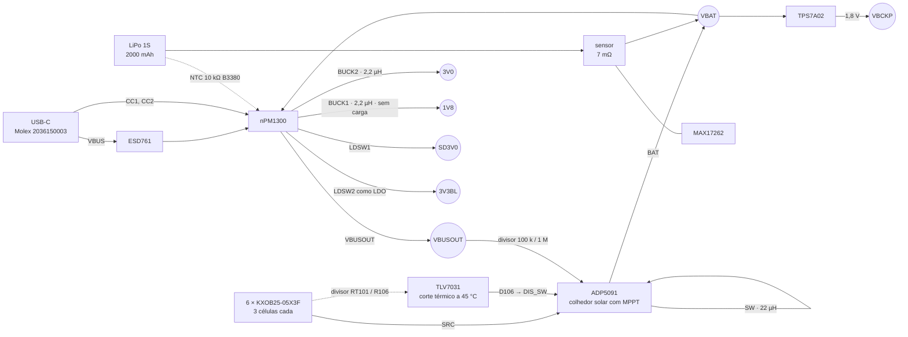
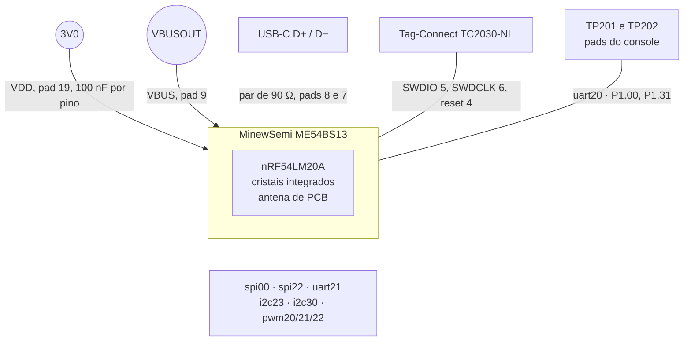
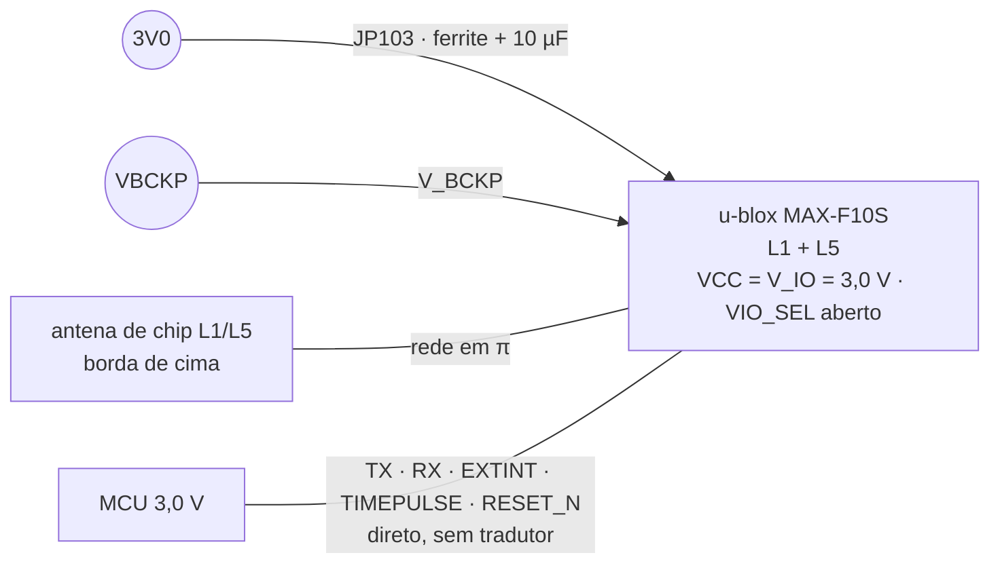
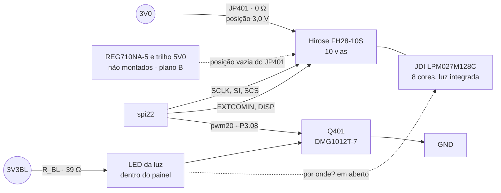
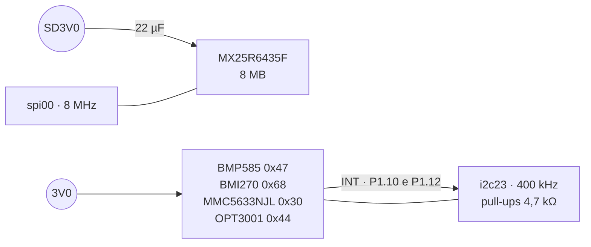
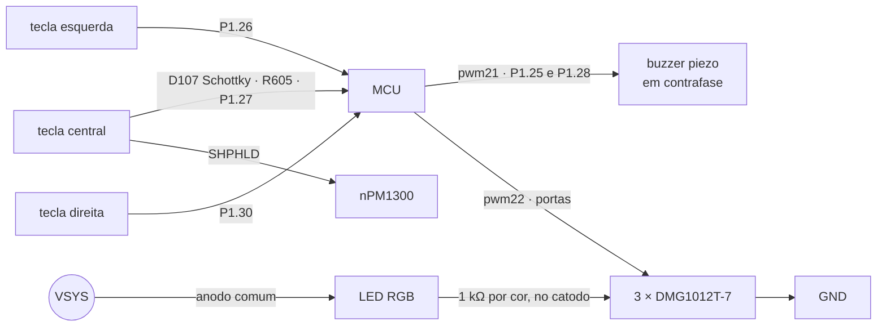

# Folhas do esquemático

As seis folhas, bloco a bloco. Cada uma traz o circuito, as decisões que
não aparecem no desenho e o que fica em aberto. As ligações completas
estão na [lista de nós](03-netlist.md) e os valores, nos
[cálculos](02-calculos.md).

**Nesta página:** [Folha 1 · Energia](#folha-1--energia) · [Folha 2 · MCU](#folha-2--mcu) · [Folha 3 · GNSS](#folha-3--gnss) · [Folha 4 · Display](#folha-4--display) · [Folha 5 · Memória e sensores](#folha-5--memória-e-sensores) · [Folha 6 · Interface](#folha-6--interface)

> [!WARNING]
> Nada aqui foi montado. A placa existe como arquivo de CAD
> ([09](09-dry-run-da-pcb.md)), nenhuma foi fabricada e nenhum
> componente passou por bancada.

## Como as folhas são desenhadas

Desde 2026-09-26 o gerador (`cad/make_sch.py` com `cad/blocos.py`) desenha
cada folha no padrão que o dono pediu, e as regras e a origem de cada uma
estão em [`cad/README.md`](cad/README.md#desenhado-por-bloco-funcional-desde-2026-09-26):

- **blocos funcionais** na ordem em que o sinal flui, cada um numa caixa
  tracejada com título — na folha 1: USB-C e proteção, nPM1300, medidor e
  célula, backup do receptor, colheita solar, corte térmico;
- dentro do bloco, o **passivo ao lado do pino que serve**, do lado para
  onde o pino aponta, e o desacoplamento numa prateleira sob o CI;
- **alimentação e terra por símbolo**; pinos vizinhos do mesmo trilho no
  mesmo lado do CI ganham um fio pelas pontas e um símbolo só;
- sinal que sai do bloco vira **rótulo local**; sinal que sai da folha,
  **rótulo hierárquico**, os dois num toco curto saído do pino — nenhum fio
  atravessa a página;
- folha 1 em **A3**, as outras em **A4**, o tamanho medido pelo próprio
  desenho; grade de 50 mil em tudo.

O `check_sch.py` confere o resultado contra a [lista de nós](03-netlist.md)
pino a pino, pelo ERC do KiCad e pela geometria (fio sobre componente, peça
fora da folha). Duas coisas foram **medidas** no KiCad no caminho e valem
para quem mexer no gerador: `(mirror x)` troca esquerda por direita (não
`mirror y`), e um rótulo local com o nome de um trilho é outra rede, não o
trilho.

## Folha 1 · Energia

Três fontes entram (USB, painel solar e célula), quatro trilhos saem.

```mermaid
flowchart LR
    USB["USB-C<br/>Molex 2036150003"]
    TVS["ESD761"]
    USB -->|"VBUS"| TVS --> NPM
    USB -->|"CC1, CC2"| NPM

    PV["6 × KXOB25-05X3F<br/>3 células cada"] -->|"SRC"| AEM["ADP5091<br/>colhedor solar com MPPT"]
    AEM -->|"SW · 22 µH"| AEM
    AEM -->|"BAT"| VBAT(("VBAT"))
    PV -.->|"divisor RT101 / R106"| CMP["TLV7031<br/>corte térmico a 45 °C"]
    CMP -->|"D106 → DIS_SW"| AEM

    CELL["LiPo 1S<br/>2000 mAh"] --> RS["sensor<br/>7 mΩ"] --> VBAT
    CELL -.->|"NTC 10 kΩ B3380"| NPM
    RS --- GAUGE["MAX17262"]

    VBAT --> NPM["nPM1300"]
    VBAT --> TPS["TPS7A02"] -->|"1,8 V"| VBCKP(("VBCKP"))

    NPM -->|"VBUSOUT"| VOUT(("VBUSOUT"))
    NPM -->|"BUCK2 · 2,2 µH"| R3V0(("3V0"))
    NPM -->|"BUCK1 · 2,2 µH · sem carga"| R1V8(("1V8"))
    NPM -->|"LDSW1"| RSD(("SD3V0"))
    NPM -->|"LDSW2 como LDO"| RBL(("3V3BL"))
    VOUT -->|"divisor 100 k / 1 M"| AEM
```

### As decisões desta folha

**O USB bloqueia o painel em hardware.** O `R104` de 100 kΩ leva o
`VBUSOUT` ao `DIS_SW` do ADP5091, com o `R105` de 180 kΩ ao `AGND`: com o
cabo o pino vê 3,5 V (**conta**), acima do 1 V de nível alto, e enquanto
houver cabo o colhedor não carrega. Não passa por pino do MCU nem por firmware: se o
firmware travar com as duas fontes ativas, as duas disputariam a mesma
célula. É a decisão de [15](../docs/15-avaliacao-componentes.md#convivência-das-duas-cargas).

**O `VSET` é resistor, não registrador.** O BUCK2 sai em 3,0 V pelo
`RVSET2` de 150 kΩ e o BUCK1 em 1,8 V pelo `RVSET1` de 47 kΩ. Isso importa
porque **é o BUCK2 que alimenta o MCU**: sem ele o aparelho não liga, e
nenhum firmware conserta um resistor errado. A tabela do VSET1 nem tem
3,0 V; a do VSET2 tem — foi por isso que o trilho do MCU foi para o BUCK2.

**O medidor fica entre a célula e tudo.** O sensor de 7 mΩ do MAX17262 vai
entre `BATT` e `SYS`, e não entre o nPM1300 e o resto: assim ele mede a
corrente líquida de **todas** as fontes, inclusive a do painel com o
aparelho desligado. Sem isso o ciclista veria a bateria subir sozinha sem
que nada contasse quanto.

**Nenhuma fonte externa alimenta o `VSYS`**, que a ficha do nPM1300
proíbe: ele é saída do power path e parece uma entrada, o que torna o
engano fácil.

No `VBAT` a regra é outra e mais estreita do que "nada pendura nele". Ali
estão, além do `VBAT` do nPM1300, o `BAT` do ADP5091, o `IN` do TPS7A02 e
o `SYS` do medidor — e é assim de propósito: o colhedor **carrega** a
célula por esse nó e o LDO do `V_BCKP` precisa da célula direto, para
sobreviver ao ship mode. O que não pode é carga da aplicação pendurada
ali, desviando do caminho de medição.

> [!NOTE]
> **Falta conferir de que lado do sensor interno fica cada pino do
> MAX17262.** A [especificação](../docs/14-hardware-placa-nova.md#carga)
> diz "sensor entre `BATT` e `SYS`", e esta lista de nós põe o `BATT` no
> lado da célula e o `SYS` no nó do sistema. Trocar os dois inverte o sinal
> da corrente medida, e é erro que sai do layout sem aparecer na bancada,
> porque o medidor continua respondendo. Fechar contra a ficha.

**O LED de carga não precisa de firmware.** O `LED1` do nPM1300 sai de
fábrica como indicador de carga e o `LED0` como indicador de erro. Com o
anodo no `VSYS`, o LED acende com o aparelho desligado — que é justamente
quando alguém quer saber se está carregando.

**A tecla central liga o aparelho.** Ela vai ao `SHPHLD`, que tem pull-up
interno de 50 kΩ, e **também** a um GPIO, porque o firmware precisa ler a
mesma tecla enquanto o aparelho está ligado. Segurar por mais de 10 s
religa o sistema inteiro, e isso vem ligado de fábrica. As duas ligações
não se falam diretamente: o `D107` (BAT54WS) fica entre a tecla e o
P1.27, decisão do dono em 2026-09-26, porque o pull-up do `SHPHLD` vai ao
maior entre `VBAT` e `VBUS` — até 5,5 V com o cabo — e um pino de 3,0 V
amarrado a esse nó ficaria com o diodo de proteção polarizado. Com o
Schottky, a tecla apertada puxa os dois nós para baixo e, solta, o P1.27
sobe pelo pull-up interno do MCU e nunca vê o nó do PMIC
([folha 6](#folha-6--interface)).

**O corte térmico da carga solar é um comparador, porque o ADP5091 não
tem entrada de temperatura.** O AEM10900 que ele substituiu cortava
sozinho fora de 0 a 45 °C; o ADP5091 só tem o `DIS_SW`, que desliga o
boost quando puxado para cima. Decisão do dono em 2026-09-26: o divisor
`RT101` (NTC 10 kΩ, B3380, na face de trás, sob a célula) sobre `R106`
(4,87 kΩ) é alimentado pelo **próprio painel** (`SRC`), o `U105`
(TLV7031, 335 nA) o compara com a metade do `SRC` (`R124`/`R125`, 100 kΩ
cada) e, quente, leva o `DIS_SW` para cima pelo `D106` (BAT54WS): o mesmo
pino que o divisor do `VBUSOUT` (`R104`/`R105`) já usa para bloquear a
carga solar com o cabo ligado, agora em OU de diodos. A conta do limiar
(**conta**, B = 3380): a 45 °C o NTC vale
10 kΩ × e^(3380 × (1/318,15 − 1/298,15)) = 4,90 kΩ, e
4,87 ÷ (4,90 + 4,87) = 0,498 do `SRC` — o comparador vira exatamente
onde a metade está. Alimentar o divisor pelo painel, e não pelo `VSYS`, é
o que faz o circuito não gastar nada sem sol; o painel em vazio dá 2,07 V
([04](04-pcb-e-caixa.md)), dentro do que o `DIS_SW` aceita (6,0 V de
máximo absoluto) e do `VIN` do ADP5091 (3,6 V).

> [!CAUTION]
> **Um termistor para o corte, nunca dois.** O conector da célula tem a
> via 4 reservada ao NTC do pack (`TH_MON`, [06](06-conectores-e-pontos-de-teste.md#j102--bateria)),
> mas ela fica **sem montar**: o NTC do corte é o `RT101` da placa. Montar
> os dois põe 10 kΩ em paralelo com 10 kΩ no mesmo nó, e a conta é feia
> (**conta**, B = 3380): 5 kΩ a 25 °C, e o comparador vira quando o
> paralelo cai abaixo de 4,87 kΩ, ou seja, com **cada NTC a 25,7 °C** —
> o colhedor **desliga a carga solar com o ambiente pouco acima da
> temperatura de uma sala**, sem nada passar por firmware, sem erro, sem
> aviso.

> [!WARNING]
> **O comparador só corta o lado quente.** O AEM10900 também recusava
> carga abaixo de 0 °C, e uma célula de lítio carregada abaixo de zero
> deposita lítio metálico. Com um comparador só, o painel carrega a célula
> numa manhã de inverno abaixo de zero; o carregador do nPM1300, no USB,
> continua protegido pelo JEITA. Registrado em aberto abaixo: a saída é um
> segundo comparador (a outra metade de um TLV7032) com a referência do
> frio, ou aceitar o risco pelo clima em que o aparelho vai rodar.

### Em aberto nesta folha

- O indutor do AEM10900: a tabela 6 e a fórmula da ficha não batem ([02](02-calculos.md#colheita-solar)).
- O calor do carregador linear numa caixa vedada ([02](02-calculos.md#calor-do-carregador)).
- O fator θ·L da e-peas, que falta para o firmware informar a potência do painel em mW.
- **O driver do AEM10900 não grava `TMONEN`, `HPEN` nem `KEEPALEN`.** Ele
  escreve `VOVDIS`, `VOVCH`, `APM` e `CTRL`, e valida com `CTRL.UPDATE = 1`.
  A [avaliação](../docs/15-avaliacao-componentes.md#detalhes-para-o-esquemático)
  avisa que os registradores partem dos **valores de fábrica, não dos
  pinos**, e que os três precisam ficar em 1 — o keep-alive, que é o que
  faz a configuração sobreviver ao `3V0` desligado, é um deles.

## Folha 2 · MCU

```mermaid
flowchart TB
    subgraph MOD["MinewSemi ME54BS13"]
        NRF["nRF54LM20A<br/>cristais integrados<br/>antena de PCB"]
    end
    R3V0(("3V0")) -->|"VDD, pad 19, 100 nF por pino"| MOD
    VOUT(("VBUSOUT")) -->|"VBUS, pad 9"| MOD
    USBD["USB-C D+ / D−"] ---|"par de 90 Ω, pads 8 e 7"| MOD
    TC["Tag-Connect TC2030-NL"] ---|"SWDIO 5, SWDCLK 6, reset 4"| MOD
    TP["TP201 e TP202<br/>pads do console"] ---|"uart20 · P1.00, P1.31"| MOD
    MOD --- BUSES["spi00 · spi22 · uart21<br/>i2c23 · i2c30 · pwm20/21/22"]
```

### As decisões desta folha

**A radiofrequência não é deste projeto.** O casamento, a antena de PCB e
os cristais vêm dentro do módulo. O que a placa faz em volta dele é:
desacoplar, respeitar a zona da antena e levar USB, SWD e console para
fora. **É por isso que as diretrizes de projeto de radiofrequência do
nRF54LM20 não são obrigatórias aqui** — e passariam a ser, todas, se o chip
fosse direto na placa.

**O pad 2 fica aberto.** Ele é a saída para antena externa; o ME54BS13 já
traz a antena de PCB num dos lados de 12 mm, e é ela que este projeto usa.
Ligar os dois seria pôr dois caminhos no mesmo transmissor.

> [!WARNING]
> **A certificação do ME54BS13 não está confirmada.** O módulo que este
> esquemático descrevia antes, o Fanstel BM20C, trazia FCC, ISED, TELEC e
> conformidade europeia; da ficha do ME54BS13, a V0.5.0 **não traz nenhuma
> certificação** e a V1.0.0 não foi lida quanto a isso. Enquanto ninguém
> ler, o aparelho não pode ser tratado como pré-certificado
> ([README](README.md#fichas-que-precisam-ser-lidas)).

**O console sai em dois pads, não em conector.** O `uart20` em P1.00 e
P1.31 vai a dois pontos de teste. Um ciclista nunca o vê; quem precisa
dele encosta uma ponta. O plano anterior punha o console no `uart30`, ao
lado do `i2c30` da energia, o que **o silício recusa**: cada bloco serial
do nRF54LM20A tem um periférico só, e `uart30` e `i2c30` são o mesmo
bloco.

**A depuração é sem conector.** O footprint Tag-Connect TC2030-NL só tem
furos e pads; o cabo se encosta com um clipe. Numa placa de 34 × 90 mm
dentro de uma caixa vedada, um conector de dez vias seria volume gasto
para sempre por uma coisa que se usa no protótipo.

### Em aberto nesta folha

- **O espelhamento do mapa de pads.** O de-para pino a pino **já existe**:
  a ficha V1.0.0 (p. 6 a 9) dá os 80 pads — 20 castelados na borda,
  numerados de 1 a 20, e uma matriz LGA de 60, de `A0` a `F9` —, e eles
  estão transcritos em [`cad/parts.py`](cad/parts.py) (`PADS_ME54BS13`). O
  módulo expõe 64 dos 66 GPIO do chip, todos menos P1.20 e P1.21, que ficam
  com o cristal de 32,768 kHz, e os 31 pinos deste esquemático, mais os dois
  reservados, saem todos fora desse par. O que falta é conferência: **a V1.0.0 e a V0.5.0
  discordam de qual lado é qual**, e antes de fabricar alguém tem de ver num
  módulo real que os `GND` `D0`, `E0` e `F0` ficam do lado do `VDD`
  (pad 19).
- **A tolerância do cristal de 32,768 kHz.** O ANT+ exige ±50 ppm e essa
  tolerância **não está levantada para o ME54BS13**. Pergunta à MinewSemi, e
  medida do LFCLK contra o 1 PPS do receptor no protótipo.

## Folha 3 · GNSS

```mermaid
flowchart LR
    R3V0(("3V0")) -->|"JP103 · ferrite + 10 µF"| MAXF
    VBCKP(("VBCKP")) -->|"V_BCKP"| MAXF["u-blox MAX-F10S<br/>L1 + L5<br/>VCC = V_IO = 3,0 V · VIO_SEL aberto"]
    ANT["antena de chip L1/L5<br/>borda de cima"] ---|"rede em π"| MAXF
    MCU["MCU 3,0 V"] ---|"TX · RX · EXTINT · TIMEPULSE · RESET_N<br/>direto, sem tradutor"| MAXF
```

### As decisões desta folha

**O receptor roda a 3,0 V, no mesmo trilho do MCU** (decisão do dono em
2026-09-26, opção 1 da tabela 35 do manual de integração UBXDOC-963802114-12892:
`VCC` e `V_IO` juntos, `VIO_SEL` aberto, `V_IO` de 2,7 a 3,6 V). Até esse
dia o receptor era de 1,8 V pelo BUCK1, com um tradutor de nível TXU0204
entre ele e o MCU, porque a 1,8 V o MAX-F10S gasta cerca de 18 % menos
(46,8 mW contra 57 mW em rastreio). O que derrubou o arranjo foi a
tolerância: o BUCK1 é de ±5 % e a mesma tabela 35 pede **1,8 V ±2 %** para
o projeto de 1,8 V. A saída pela precisão, um LDO de 1,8 V ±1 % alimentado
do 3V0, custava 35 mW na bateria (o receptor passava a ser pago a 3,0 V,
com 1,2 V queimados no LDO) — mais do que os 10 mW que o receptor a 3,0 V
custa a mais, e ainda com o tradutor. A 3,0 V o receptor gasta 19 mA em
rastreio (57 mW) e 24 mA na aquisição, o BUCK2 (±5 %, 2,85 a 3,15 V) fica
dentro da faixa de 2,7 a 3,6 V do `V_IO`, e saem quatro peças: o tradutor,
o LDO e os dois capacitores de cada um. O BUCK1 fica montado, sem carga, e
o firmware o desliga ([02](02-calculos.md#3v0-do-buck2-limite-de-200-ma-ficha)).

**O `V_BCKP` vem de um LDO próprio, não do BUCK1.** O TPS7A02 tira 1,8 V
direto da célula e gasta 25 nA. É ele que mantém as efemérides e o relógio
do receptor com o aparelho em ship mode, e é isso que faz a próxima
partida ser quente em vez de fria. Se o `V_BCKP` saísse do BUCK1, desligar
o aparelho apagaria a memória do receptor.

**O `RESET_N` é dreno aberto e o firmware não o pulsa.** Um reset apaga a
memória de backup, que é exatamente o que o `V_BCKP` existe para preservar.
O driver só segura a linha.

### As cinco linhas digitais, direto

Receptor e MCU no mesmo 3V0, as linhas vão de pino a pino, sem tradutor:

| Sinal | Pino do MCU | Pino do receptor | Direção |
|---|---|---|---|
| `GNSS_TX` | P1.04 | `RXD` | MCU → receptor |
| `GNSS_EXTINT` | P1.08 | `EXTINT` | MCU → receptor |
| `GNSS_RX` | P1.05 | `TXD` | receptor → MCU |
| `GNSS_TIMEPULSE` | P1.09 | `TIMEPULSE` | receptor → MCU |
| `GNSS_RESET_N` | P1.06, dreno aberto | `RESET_N` | MCU → receptor; o pull-up de 7 a 13 kΩ é interno ao módulo |

O `TIMEPULSE` divide o pino com o `SAFEBOOT_N` por 1 kΩ interno, e o
módulo entra em safeboot se o pino estiver baixo na partida: **nenhum
pull-down** nessa linha, e o pino do MCU fica em entrada até o receptor
subir.

> [!NOTE]
> **O tradutor de nível existiu de 2026-09-23 a 2026-09-26**, e um
> rascunho anterior desta folha errou a direção dele de três maneiras ao
> mesmo tempo (passou o `RESET_N` por ele, concluiu daí que "cinco sinais
> não cabem em quatro canais" e pôs o `RX` num canal que ia do MCU para o
> receptor: **saída contra saída**, e o receptor nunca teria mandado um
> byte). O registro fica no [README](README.md#o-primeiro-em-2026-09-22),
> como história; o componente não existe mais.

### Em aberto nesta folha

- **A antena é a TE L000670-01**, aprovada e em estoque na [lista de
  compras](../docs/19-lista-de-compras.md). O que está em aberto não é a
  compra, é o desempenho: 66 % de eficiência em L1 e 56 % em L5 num plano
  de 90 × 41 mm, e o plano desta placa é menor. Garmin, COROS e Wahoo
  usam elementos lineares na parede da caixa, ligados por mola ou cabo
  flexível; nenhum usa patch cerâmica ([13](../docs/13-placa-nova.md#antena-gnss-dentro-da-caixa)).
- **Com o F10S a rede em π tem de sintonizar L1 e L5 na mesma rede**, e
  não só L1: a TE mede a peça com 0 Ω em série e os paralelos vazios, e
  quem escolhe os valores é a sintonia com VNA **dentro da caixa final**.
- O AssistNow não existe no F10S: ele é ROM, e só tem Offline e Autonomous,
  de L1.

## Folha 4 · Display

```mermaid
flowchart LR
    R3V0(("3V0")) -->|"JP401 · 0 Ω<br/>posição 3,0 V"| FPC["Hirose FH28-10S<br/>10 vias"]
    NM["REG710NA-5 e trilho 5V0<br/>não montados · plano B"] -.->|"posição vazia do JP401"| FPC
    MCU["spi22"] -->|"SCLK, SI, SCS"| FPC
    MCU -->|"EXTCOMIN, DISP"| FPC
    FPC --- PANEL["JDI LPM027M128C<br/>8 cores, luz integrada"]
    RBL(("3V3BL")) -->|"R_BL · 39 Ω"| LED["LED da luz<br/>dentro do painel"] --> MOSFET["Q401<br/>DMG1012T-7"] --> GND["GND"]
    MCU -->|"pwm20 · P3.08"| MOSFET
    LED -.->|"por onde? em aberto"| PANEL
```

### As decisões desta folha

**A tela é o JDI LPM027M128C, decidido em 2026-09-23.** Peça única: 2,7",
400 × 240, MIP de 8 cores, **com luz frontal integrada**. Ela substitui o
par que a lista de compras trazia, a Sharp LS027B7DH01A mais o filme Azumo
11103-06_A1 — sem etapa de laminação, mesma resolução (a interface não
muda), consumo menor e cor. **A Sharp continua sendo o plano B**, no mesmo
conector, se o JDI não chegar.

**O caminho de 5 V saiu.** O JDI vive em 3,0 V, de modo que o `U401`
(REG710NA-5), o `C401` de bombeamento e os dois de 10 µF de entrada e de
saída **não são montados**, e o trilho `5V0` deixa de existir na placa
construída. Os footprints ficam no desenho, porque são eles que fazem o
plano B ser uma troca de montagem e não uma placa nova.

**O `DISP_PWR_EN` (P3.07) fica livre.** Ele era o `EN` do REG710; sem o
regulador, **o pino volta a ficar disponível** para outro uso. O firmware
continua declarando `power-gpios` no nó do display do
[devicetree](../zephyr_app/boards/gnss/gnssbike/gnssbike_nrf54lm20a_cpuapp.dts),
e isso é de propósito: é o que faz o plano B funcionar sem mexer no
firmware. Enquanto o JDI estiver montado, o pino aciona um regulador que
não existe, com o pull-down de 100 kΩ do `R403` segurando o nível — e quem
quiser o pino para outra coisa tira essa linha.

**Um conector, duas telas.** Os dez pinos das duas fichas estão na mesma
ordem (`SCLK`, `SI`, `SCS`, `EXTCOMIN`, `DISP`, `VDDA`, `VDD`, `EXTMODE`,
`VSS`, `VSSA`), e o mesmo Hirose FH28-10S-0.5SH(05) aparece nas duas.

> [!CAUTION]
> **Um JDI com 5 V queima**: o máximo absoluto dele é 3,6 V. Com uma tela
> só, o `JP401` deixa de ser um seletor: ele vira um **0 Ω fixo na posição
> do 3,0 V**, e a posição do 5 V fica **sem peça**. O footprint das três
> posições continua no desenho de propósito — é ele que permite montar a
> Sharp do plano B sem redesenhar a folha —, e o pad do meio continua sendo
> **um só**, de modo que nenhuma montagem consegue pôr os dois trilhos no
> painel ao mesmo tempo. Uma alternativa seria apagar o jumper e ligar o
> `3V0` direto ao painel em cobre; ela é mais segura contra erro de
> montagem e custa o plano B, que passaria a exigir corte de trilha.

**O chip select é ativo alto.** Ao contrário de quase todo SPI. Vale
repetir aqui porque é o tipo de coisa que se inverte sem pensar.

**O `EXTMODE` vai ao VDD do display, seja ele qual for.** Com ele alto, o
VCOM inverte nas bordas de subida do `EXTCOMIN`, que é um PWM do MCU —
1 Hz com a luz apagada e cerca de 120 Hz com ela acesa, para o COM ficar
perto dos 60 Hz que a ficha pede. A V3 fazia diferente: `EXTMODE` no GND e
VCOM pelo SPI.

**Com o JDI os 120 Hz passam.** O driver aceita até **140 Hz** no JDI
(`MEMLCD_COM_HZ_MAX_JDI`, em
`zephyr_app/modules/gnss_drivers/drivers/display/memlcd.c:46`) contra
20 Hz na Sharp. Enquanto a placa declarava `sharp,ls027b7dh01`, o pedido de
120 Hz da interface era recusado com `-EINVAL` e o COM ficava em 1 Hz com a
luz acesa, que é justamente o que o `EXTCOMIN` existe para evitar. Com
`jdi,lpm027m128c` no devicetree **esse defeito deixa de existir** — e ele
volta a existir se alguém montar o plano B sem mexer no firmware.

### Em aberto nesta folha

> [!NOTE]
> **A luz do C tem conector próprio, e ele apareceu em 2026-09-23.** A
> ficha `3LPM027M128C specification ver.02`, pelas especificações que a
> Switch Science publica, dá duas interfaces: o **FPC de 10 vias e passo
> 0,5 mm** dos sinais, o mesmo do B, e um **FPC de 5 vias e passo 0,5 mm**
> só para a luz. O `J402` passou a ser esse segundo conector
> ([06](06-conectores-e-pontos-de-teste.md#j402--luz-do-lpm027m128c)).
>
> A mesma ficha confirma os dois números com que a
> [conta do `R_BL`](02-calculos.md#luz-do-display) foi feita — **2,67 V de
> tensão direta e 16 mA** —, de modo que os 39 Ω param de ser hipótese.
>
> **O que falta é menor:** qual das cinco vias é anodo, qual é catodo e
> quais não se usam. Os dois PDF da JDI respondem 404 e o arquivo histórico
> está bloqueado; sai da ficha em mãos ou de uma amostra.

- **Sem canal autorizado e sem garantia.** O anúncio escolhido é de
  **R$ 776** no AliExpress
  ([link](https://pt.aliexpress.com/item/1005011938384752.html)); a JDI não
  lista mais MIP, a Switch Science encerrou as vendas e nenhum distribuidor
  tem a peça. Comprar é comprar de revendedor, sem procedência
  ([15](../docs/15-avaliacao-componentes.md#a-luz-da-tela-procurada-em-2026-09-23)).
- **A tela é o item mais caro da placa**, e ficou mais cara: R$ 776, ou
  cerca de **US$ 144** a R$ 5,40 por dólar, contra os US$ 23,61 + US$ 66,45
  = **US$ 90,06** do par Sharp + Azumo. São **US$ 54 a mais por placa**
  ([19](../docs/19-lista-de-compras.md#custo)).
- A `LDSW2` sai de regulação com o `VSYS` perto de 3,4 V: a luz enfraquece
  com a bateria baixa, e isso não tem conserto no resistor.
- **No plano B** (Sharp mais filme Azumo) voltam o `U401`, o `C401`, os dois
  de 10 µF, o `DS402`, o `J402` e o `JP401` na posição do 5 V; o `R_BL`
  deixa de ser 39 Ω e passa a depender da tensão direta do filme, que só a
  amostra dá ([02](02-calculos.md#luz-do-display)).

## Folha 5 · Memória e sensores

```mermaid
flowchart LR
    RSD(("SD3V0")) -->|"22 µF"| NOR["MX25R6435F<br/>8 MB"]
    MCU1["spi00 · 8 MHz"] --- NOR
    R3V0(("3V0")) --> SENS
    MCU2["i2c23 · 400 kHz<br/>pull-ups 4,7 kΩ"] --- SENS["BMP585 0x47<br/>BMI270 0x68<br/>MMC5633NJL 0x30<br/>OPT3001 0x44"]
    SENS -->|"INT · P1.10 e P1.12"| MCU2
```

### As decisões desta folha

**Não há cartão.** O soquete microSD saiu em 2026-09-20: uma peça soldada
custa menos do que o armazenamento inteiro vale. A MX25R6435F fica sozinha
no `spi00`, e os 8 MB dela guardam as atividades, os segmentos e os
percursos, montados em `/SD:` como sempre foi. Quem quiser cartão num
protótipo põe num overlay, no chip select livre de P2.03.

**A flash fica atrás da chave de alimentação.** A `LDSW1` corta o `SD3V0`,
e com o trilho desligado os pinos do `spi00` precisam ficar em nível baixo
ou em alta impedância — senão a peça se alimenta pelos pinos de sinal, que
é um jeito conhecido de uma flash nunca desligar de verdade.

**Nada varre este barramento I²C.** O endereço `0x7E` põe o MMC5633NJL em
I3C, e ele só sai disso faltando energia. O firmware fala com endereços
conhecidos e ponto.

**O `CSB` do BMP585 tem de estar no VDDIO na partida**, ou o I²C fica
desligado até o próximo corte de energia. É condição de partida, não de
firmware.

### Em aberto nesta folha

> [!CAUTION]
> **Ninguém liga a chave de alimentação da flash.** O nó `LDO1` do nPM1300
> (a `LDSW1`, que entrega o `SD3V0`) está declarado no
> [devicetree](../zephyr_app/boards/gnss/gnssbike/gnssbike_nrf54lm20a_cpuapp.dts)
> **sem `regulator-boot-on` e sem apelido**, a `mx25r6435f@0` **não declara
> `supply` nenhum**, e nada em `zephyr_app/src/` referencia o regulador. Na
> placa de verdade isso quer dizer **flash sem energia e armazenamento que
> não funciona**, em silêncio — no DK não aparece, porque lá a flash é
> alimentada pelo próprio kit.
>
> Três saídas, e é decisão de firmware, não de esquemático: dar um `supply`
> à flash, como o GNSS já tem (`vcc-supply = <&npm1300_buck1>`); ligar a
> `LDSW1` no boot; ou tirar a chave do circuito e aceitar a flash sempre
> alimentada, perdendo os nanoampères do deep power down.
>
> **E há um segundo efeito, que só aparece somando os dois defeitos:** com
> o `SD3V0` em 0 V, o serviço de armazenamento aciona um SPI de 8 MHz
> contra uma peça sem alimentação, e ela **se alimenta pelos diodos de
> grampo do `SCK` e do `MOSI`** — agora através dos 33 Ω de série, que
> limitam a corrente mas não impedem o caminho. É o modo de falha que a
> própria folha descreve duas linhas acima, acontecendo hoje. **Achado pelo
> dry-run de 2026-09-23, ao escrever a [sequência de partida](07-sequencias-e-protecao.md).**

- **8 MHz é uma frequência ruim para o L1.** Harmônicos de 8 MHz caem a
  menos de 0,6 MHz do centro de 1575,42 MHz. A flash é a única coisa
  rápida perto do receptor, e a mitigação é de layout: resistor em série
  para amaciar a borda, trilha curta, camada interna entre planos. Está
  registrado em [04](04-pcb-e-caixa.md).
- Os eixos dos sensores na placa ainda precisam ser confirmados contra o
  que o firmware espera.

## Folha 6 · Interface

```mermaid
flowchart LR
    K1["tecla esquerda"] -->|"P1.26"| MCU
    K2["tecla central"] -->|"D107 Schottky · R605 · P1.27"| MCU
    K2 -->|"SHPHLD"| NPM["nPM1300"]
    K3["tecla direita"] -->|"P1.30"| MCU["MCU"]
    MCU -->|"pwm21 · P1.25 e P1.28"| BUZ["buzzer piezo<br/>em contrafase"]
    VSYS(("VSYS")) -->|"anodo comum"| RGB["LED RGB"]
    RGB -->|"1 kΩ por cor, no catodo"| FETS["3 × DMG1012T-7"]
    FETS --> GND2["GND"]
    MCU -->|"pwm22 · portas"| FETS
```

### As decisões desta folha

**As três teclas são Omron B3S-1002P**, IP67 pela ficha, de 6 × 6 × 4,3 mm
(a C&K PTS526 é a tecla da V3; a lista de compras trocou). Todas ativas em
nível baixo, com pull-up interno do MCU: menos três resistores e o
comportamento certo com o pino em alta impedância.

**A tecla central chega ao P1.27 por um Schottky.** Ela é também a tecla
do `SHPHLD` do nPM1300, cujo pull-up de 50 kΩ vai ao maior entre `VBAT` e
`VBUS`: com o cabo ligado o nó fica em até 5,5 V, e um pino de 3,0 V
amarrado nele estaria com o diodo de proteção conduzindo o tempo todo. O
`D107` (BAT54WS, decisão do dono em 2026-09-26) fica com o anodo do lado
do MCU (depois do `R605` de 100 Ω) e o catodo no nó da tecla: apertada, a
tecla leva os dois nós ao GND e o MCU lê baixo, com 0,3 a 0,4 V de queda
do Schottky, abaixo dos 0,9 V de `V_IL` a 3,0 V; solta, o catodo fica
acima do anodo e o P1.27 só vê o próprio pull-up. O firmware continua
lendo a tecla pelo GPIO ([10](../docs/10-status-do-port.md#defeitos-abertos)).

**O buzzer é acionado em contrafase.** Dois canais de PWM opostos dobram a
tensão sobre o piezo sem nenhuma fonte a mais. Custa um pino.

**O LED RGB passa por um MOSFET por cor, e não direto pelo pino.** O anodo
comum fica no `VSYS`, que **com o cabo USB chega a 5,5 V**: um pino de
3,0 V amarrado ao catodo ficaria com o diodo de proteção polarizado. Vão
três DMG1012T-7, com o pino do MCU na porta de cada um e **1 kΩ** em
série com cada cor, o valor que a especificação já fixava. O preço disso é
que o brilho varia com a tensão do `VSYS` ([02](02-calculos.md#led-rgb)) — o
que se aceita porque o indicador serve a pareamento e a carga, e carga é
justamente quando o `VSYS` está alto.

### Em aberto nesta folha

- O brilho do LED varia com a tensão do `VSYS`: **3,2 vezes no vermelho** e
  **9,6 vezes no verde e no azul** entre a célula vazia e o USB no limite,
  porque o anodo está num trilho não regulado ([02](02-calculos.md#led-rgb));
  com 1 kΩ e o Kingbright APTF1616SEEZGKQBKC, o verde e o azul chegam ao fim
  da bateria com 0,29 mA — fracos, mas acesos.
- O buzzer é o Same Sky CPT-1117-83-SMT-TR, aprovado: 83 dB a 10 cm com
  5 Vpp, e os dois pinos em contrafase dão 6 Vpp.

> [!CAUTION]
> **Nem o buzzer nem o LED RGB têm firmware, e o devicetree só declara um
> canal de cada.** O `rgb_pwm` e o `buzzer_pwm` apontam para o canal 0 do
> seu PWM, os dois com `PWM_POLARITY_NORMAL`, e **nada em
> `zephyr_app/src/` menciona buzzer ou LED**. Como está, das três cores só
> a primeira acenderia, e a contrafase que dá os 6 Vpp **não existe**. O
> `pinctrl` já traz os cinco pinos; o que falta é o segundo canal em cada
> nó, com polaridade invertida no buzzer, e o código que os aciona.
