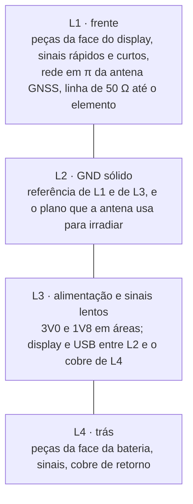
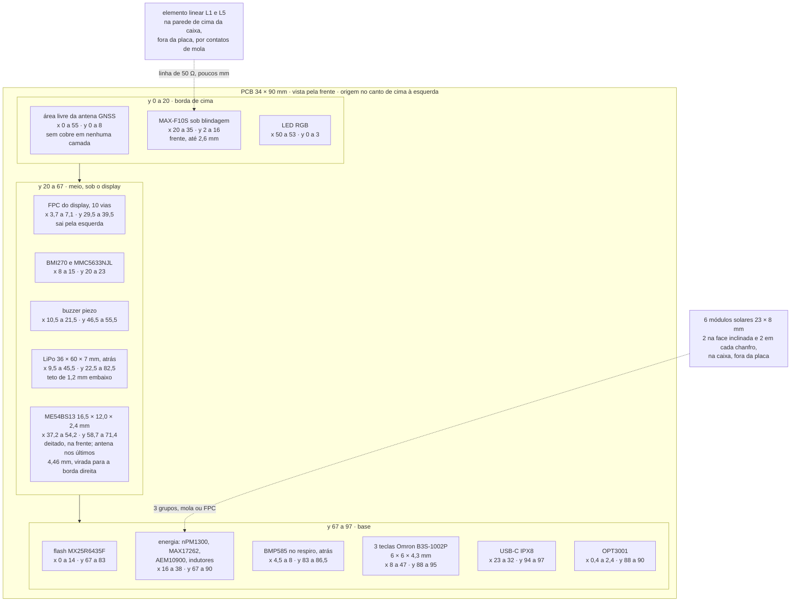

# Placa e caixa

O contorno, a espessura, as camadas, onde cada bloco fica e onde nada pode
ficar. Fecha o que as [folhas do esquemático](01-esquematico.md) deixam em
aberto por natureza: um esquemático diz o que se liga a quê, e é o layout
que decide se a antena
enxerga o céu, se o harmônico da flash cai dentro de L1 e se a placa cabe na
caixa. As posições vêm da tabela de zonas de [`docs/14`](../docs/14-hardware-placa-nova.md#placa-de-circuito-impresso)
e do desenho da caixa em [`tools/docs/case_drawing.py`](../tools/docs/case_drawing.py),
que gera [`docs/img/placa-nova-caixa.svg`](../docs/img/placa-nova-caixa.svg).
Conta feita aqui vem marcada como **conta**; número de ficha ou de desenho
vem marcado como **ficha** ou **desenho**.

**Nesta página:** [O contorno](#o-contorno) · [Orçamento de área](#orçamento-de-área) · [Camadas](#camadas) · [Posicionamento](#posicionamento) · [Zonas proibidas](#zonas-proibidas) · [As duas antenas](#as-duas-antenas) · [Montagem](#montagem) · [O que só a bancada decide](#o-que-só-a-bancada-decide)

> [!WARNING]
> **Não existe placa física e nada foi fabricado nem medido.** Não há
> gerber, não há pilha de camadas de fabricante e ninguém encostou uma ponta
> de prova em nada. O que **passou a existir** desde 2026-09-23 é o projeto
> em KiCad, em [`cad/`](cad/): as 116 peças posicionadas, os planos de terra e
> parte das trilhas, com a verificação de regras do KiCad e o
> [dry-run das regras das fichas](09-dry-run-da-pcb.md).
>
> Esta página continua sendo **a planta**: os retângulos de zona daqui são o
> que o layout deve respeitar, e onde a placa de `cad/` diverge deles, a
> divergência está escrita e medida. Quando os dois discordarem, quem manda
> é o número medido no arquivo, não o retângulo desta tabela.

> [!CAUTION]
> **A placa é 34 × 90 mm desde 2026-09-24, e as tabelas de orçamento de área,
> de sobreposições e de posicionamento abaixo ainda são as de 55 × 97.** Elas
> precisam ser refeitas a partir dos retângulos novos, que estão em
> [`cad/make_dxf.py`](cad/make_dxf.py) (`ZONES`) e agora são **derivados de
> `W` e `H`**, não escritos um a um. Enquanto isso, quando esta página e o CAD
> discordarem, **quem vale é o CAD**.
>
> Uma tentativa anterior de 50 × 86 mm partia da largura do display e da
> altura da caixa. Estava errada pela raiz: **a placa não se mede pela
> caixa.** O tamanho de agora sai das regras das fichas, e a conta está em
> [De onde saem os 34 × 90](#de-onde-saem-os-34--90).
>
> O desenho da caixa em [`tools/docs/case_drawing.py`](../tools/docs/case_drawing.py)
> continua sendo o de 62 × 104, e **isso não é pendência da placa**: a caixa
> tem o tamanho que o display, a bateria e a mão pedem, e a placa encolher não
> muda nenhum dos três.

## O contorno

> [!IMPORTANT]
> **A placa não é dimensionada pela caixa, e a caixa não é dimensionada pela
> placa.** As duas são independentes: o tamanho da placa sai do **circuito**
> — peças, roteamento e as distâncias que as fichas impõem — e o da caixa sai
> do display, da bateria e da ergonomia. Uma placa menor não encolhe a caixa;
> ela apenas ocupa menos espaço dentro dela. Esta página já derivou uma da
> outra e estava errada.

| Item | Medida | Origem |
|---|---|---|
| PCB | **34 × 90 mm**, espessura de 0,8 mm | derivado das regras em [`cad/make_dxf.py`](cad/make_dxf.py) (`W`, `H`) |
| Raio de canto da placa | **3 mm no desenho, 4 mm em [14](../docs/14-hardware-placa-nova.md#placa-de-circuito-impresso)** | as duas fontes discordam, ver abaixo |
| Caixa | 62 × 104 × 19 mm, mais 3 mm do engate de quarto de volta | [`case_drawing.py`](../tools/docs/case_drawing.py) (`W, H, T`, `MOUNT`) |
| Raio de canto da caixa | 7 mm | idem (`R`) |
| Placa da V3, para comparar | 52,35 × 77,47 mm | [13](../docs/13-placa-nova.md#o-que-cabe-numa-caixa-pequena) |

### De onde saem os 34 × 90

Uma regra domina: a **7.2** da ficha do ME54BS13 pede **50 mm entre dois
módulos de rádio** na mesma placa, e esta tem dois — o próprio ME54BS13 e o
MAX-F10S. Com o módulo deitado num canto (contorno de 17,0 × 13,5) e o
receptor no oposto (10,4 × 10,6, abaixo dos 8 mm da zona da antena), os 50 mm
entre os dois contornos fixam o lado longo. Varrendo cada milímetro inteiro
que ainda cumpre a regra **e** ainda cabe a fila de três teclas na largura
(3 × 10,2 mm mais 0,8 de margem de cada lado):

| Contorno | Área | Módulos a |
|---|---|---|
| 32 × 89 | 2.848 mm² | 50,8 mm |
| 33 × 89 | 2.937 mm² | 50,9 mm |
| **34 × 90** | **3.060 mm²** | **51,9 mm** |
| 44 × 86 | 3.784 mm² | 50,2 mm, com as teclas ainda na borda de baixo |

Ficou **34 × 90**. Os 2 mm além dos 88 que a regra sozinha permitiria não são
folga: a 88 o receptor tinha de encostar na borda esquerda para alcançar os
50 mm, e aí os pinos de 1V8 dele, que saem desse lado, ficavam com 1,2 mm de
placa para pôr um capacitor de desacoplamento que a ficha quer a 2 mm.

São **3.060 mm² contra os 5.335 mm² dos 55 × 97 que estavam escritos à mão —
43 % menos placa** — e a ocupação dos contornos das peças sobe de 28 % para
48 %.

> [!IMPORTANT]
> **O raio de canto da placa não bate entre as duas fontes.** O desenho da
> caixa traça a placa com **3 mm** de raio — `xv.rect(3.5, 3.5, W - 7, H - 7, 3, …)`
> em [`case_drawing.py:339`](../tools/docs/case_drawing.py), onde o quarto
> argumento é o raio —, e [14](../docs/14-hardware-placa-nova.md#placa-de-circuito-impresso)
> escreve "cantos com raio de 4 mm". Um milímetro num canto não muda nada
> elétrico, mas muda o contorno que vai para o fabricante e a folga contra
> a parede de 7 mm de raio da caixa. **Qual dos dois vale ainda não foi
> decidido**, e esta página não escolhe por ninguém: registra os dois.

**Sistema de coordenadas** desta página, o mesmo de [14](../docs/14-hardware-placa-nova.md#placa-de-circuito-impresso):
origem no canto de cima à esquerda da **placa**, vista pela frente, x para a
direita (0 a 34 mm) e y para baixo (0 a 90 mm). **Não há mais conversão para
as coordenadas da caixa**: com a placa dimensionada pelo circuito e a caixa
pelo que ela guarda, onde uma fica dentro da outra é decisão do arranjo
mecânico, que não existe.

> [!IMPORTANT]
> **A folga entre a placa e a caixa não bate com o texto de [14](../docs/14-hardware-placa-nova.md#placa-de-circuito-impresso).**
> Lá está escrito "paredes de cerca de 2 mm e folga de 0,5 mm", que somam
> 2,5 mm por lado e dariam uma placa de 57 × 99 mm. O desenho põe a placa
> com 3,5 mm de recuo, o que com parede de 2 mm deixa **1,5 mm de folga
> mecânica por lado**, não 0,5 mm (**conta**: 3,5 − 2,0). Um milímetro por
> lado é a diferença entre apertar e sobrar; **qual dos dois vale é decisão
> do projeto mecânico, que não existe.** Esta página segue o desenho, que é
> executável, e registra a divergência.

## Orçamento de área

A placa tem **5.335 mm²** (**conta**: 55 × 97). A pergunta é se o que
precisa entrar cabe, e a resposta tem duas partes: a área de planta que as
zonas consomem, e a área que fica com **restrição de altura** por causa do
display na frente e da bateria atrás.

### O que cada zona consome em planta

Áreas calculadas a partir dos retângulos de [14](../docs/14-hardware-placa-nova.md#placa-de-circuito-impresso).
Todas são **conta**, menos a linha marcada como **falta**, que não tem
retângulo em documento nenhum.

| Zona | Retângulo (x, y em mm) | Lados | Área (mm²) | % dos 5.335 |
|---|---|---|---|---|
| Antena GNSS (área livre) | 0–55, 0–8 | 55 × 8 | 440,0 | 8,2 % |
| GNSS (MAX-F10S e blindagem) | 20–35, 2–16 | 15 × 14 | 210,0 | 3,9 % |
| LED RGB | 50–53, 0–3 | 3 × 3 | 9,0 | 0,2 % |
| IMU e magnetômetro | 8–15, 20–23 | 7 × 3 | 21,0 | 0,4 % |
| FPC do display | 3,7–7,1, 29,5–39,5 | 3,4 × 10 | 34,0 | 0,6 % |
| Conector do filme de luz (Molex 5034800440) | **sem retângulo em [14](../docs/14-hardware-placa-nova.md#placa-de-circuito-impresso)** | — | **falta** | — |
| Buzzer | 10,5–21,5, 46,5–55,5 | 11 × 9 | 99,0 | 1,9 % |
| Energia (nPM1300, AEM10900, MAX17262, indutores, conectores) | 16–38, 67–90 | 22 × 23 | 506,0 | 9,5 % |
| Armazenamento (flash NOR) | 0–14, 67–83 | 14 × 16 | 224,0 | 4,2 % |
| Barômetro | 4,5–8, 83–86,5 | 3,5 × 3,5 | 12,3 | 0,2 % |
| ME54BS13 **mais a zona proibida da sua antena** | 37,2–54,2, 58,7–71,4 unido a 49,5–55, 54,6–75,4 | ver a conta abaixo | 270,6 | 5,1 % |
| Botões | 8–47, 88–95 | 39 × 7 | 273,0 | 5,1 % |
| USB-C | 23–32, 94–97 | 9 × 3 | 27,0 | 0,5 % |
| Luz ambiente (OPT3001) | 0,4–2,4, 88–90 | 2 × 2 | 4,0 | 0,1 % |
| **Soma bruta** | | | **2.129,9** | **39,9 %** |
| Sobreposições contadas duas vezes | | | −102,5 | −1,9 % |
| **Soma líquida** | | | **2.027,4** | **38,0 %** |

O módulo entra com a **zona proibida**, não só com o retângulo dele: é a
zona que proíbe cobre, e é ela que o layout tem de respeitar
([Zonas proibidas](#zonas-proibidas)). Ela vai da antena até a borda da
placa e sobra 4,4 mm para cima e para baixo do módulo, e por isso a área é
a **união** dos dois retângulos (**conta**):

```
módulo:         x 37,2 a 54,2, y 58,7 a 71,4 = 17,0 × 12,7 = 215,9 mm²
zona proibida:  x 49,5 a 55,0, y 54,6 a 75,4 =  5,5 × 20,8 = 114,4 mm²
comum aos dois: x 49,5 a 54,2, y 58,7 a 71,4 =  4,7 × 12,7 =  59,7 mm²
união = 215,9 + 114,4 − 59,7 = 270,6 mm²       (270,6 ÷ 5.335 = 5,1 %)
```

> [!NOTE]
> **Estes números são novos.** Até 2026-09-23 este documento contava o
> módulo como o **Fanstel BM20C**, de 10,0 × 16,2 mm, no canto de baixo à
> direita (x 45–55, y 71,5–87,7), com a zona proibida em x 40–55, y 82–91:
> união de **240,0 mm², 4,5 %**. O módulo montado é o **MinewSemi
> ME54BS13**, maior (16,5 × 12,0 × 2,4 mm) e deitado acima das teclas, e
> todas as contas desta seção foram refeitas a partir dos retângulos novos.

A soma bruta fecha (**conta**): 440,0 + 210,0 + 9,0 + 21,0 + 34,0 + 99,0 +
506,0 + 224,0 + 12,3 + 270,6 + 273,0 + 27,0 + 4,0 = **2.129,9 mm²**.

As três sobreposições (**conta**) são exatamente os três pontos que o
layout terá de resolver:

| Sobreposição | Retângulo comum | Área |
|---|---|---|
| GNSS dentro da área livre da antena | 20–35, 2–8 | 15 × 6 = 90 mm² |
| LED RGB dentro da área livre da antena | 50–53, 0–3 | 3 × 3 = 9 mm² |
| Zona do **ME54BS13** dentro da zona de energia | 37,2–38, 67–71,4 | 0,8 × 4,4 = **3,5 mm²** |

A terceira sai de cruzar a zona do módulo com a zona de energia
(**conta**):

```
zona de energia: x 16   a 38,0, y 67,0 a 90,0
zona do módulo:  x 37,2 a 54,2, y 58,7 a 71,4
em x: de max(37,2; 16) = 37,2 a min(54,2; 38,0) = 38,0, ou seja 0,8 mm
em y: de max(58,7; 67,0) = 67,0 a min(71,4; 90,0) = 71,4, ou seja 4,4 mm
área = 0,8 × 4,4 = 3,52 mm², 3,5 mm² arredondado
```

Total das sobreposições: 90 + 9 + 3,5 = **102,5 mm²**.

A terceira sobreposição **trocou de lugar com o módulo**. Com o BM20C no
canto de baixo à direita, quem invadia a zona proibida era a faixa dos
botões, em 21 mm². Com o ME54BS13 deitado acima das teclas, a faixa dos
botões (y 88 a 95) e a zona proibida (y 54,6 a 75,4) **não se tocam mais**;
em troca, o canto de baixo à esquerda do módulo entra na zona de energia.
Os 3,5 mm² são pouco em área e **muito em significado**: é um conversor
chaveado encostando no módulo de rádio
([A zona do ME54BS13](#a-zona-do-me54bs13-em-detalhe)).

**Sobram 3.307,6 mm², 62,0 % da placa** (**conta**: 5.335 − 2.027,4), para
os passivos espalhados, as vias, os furos M2, os pontos de teste, o
footprint Tag-Connect TC2030-NL, os dois pads do console (`uart20`, `TP201` e
`TP202` de [06](06-conectores-e-pontos-de-teste.md#pontos-de-teste)) e as trilhas. **Pela planta,
fecha com folga.**

> [!NOTE]
> Os 6 módulos solares de 23 × 8 mm **não consomem área de placa**: ficam na
> face inclinada da caixa e nos dois chanfros de 45°, e chegam à placa por
> pads de mola ou FPC em três grupos. A antena GNSS também não: é um
> elemento na parede da caixa, com contatos de mola. **A área dos contatos e
> dos conectores dos painéis não está dimensionada em lugar nenhum** e não
> entra na soma acima — é um número que falta.

> [!IMPORTANT]
> **O conector do filme de luz não tem zona nem área.**
> [14](../docs/14-hardware-placa-nova.md#placa-de-circuito-impresso) manda
> pôr o Molex 5034800440, de 4 vias e passo de 0,5 mm, "ao lado" do FPC do
> display na borda esquerda, mas a tabela de zonas de lá **não lhe dá
> retângulo**, e a ficha dele não está resumida em nenhum documento deste
> repositório: não há como calcular a área aqui sem inventar uma medida.
> Ele só existe na montagem com a Sharp
> ([05](05-materiais.md#folha-4--display)), o que não o torna opcional no
> layout, porque a placa tem de aceitar as duas montagens. **É um número
> que falta**, e a soma acima está subestimada por ele.

### As duas sombras: display e bateria

O display fica sobre a face da frente e a bateria, sob a face de trás. Não
competem por área de planta, mas **limitam a altura** das peças embaixo
delas: até 2,6 mm sob o display e até 1,2 mm sob a bateria
([14](../docs/14-hardware-placa-nova.md#placa-de-circuito-impresso)).

| Sombra | Retângulo (coordenadas da placa) | Área (mm²) | % dos 5.335 | Altura permitida |
|---|---|---|---|---|
| Display JDI LPM027M128B (contorno 40,08 × 61,8) | 7,46–47,54, 5,1–66,9 | 2.476,9 | 46,4 % | 2,6 mm |
| Display Sharp LS027B7DH01A (contorno 42,82 × 62,8) | — | 2.689,1 | 50,4 % | 2,6 mm |
| Área ativa (35,28 × 58,8), só para referência | 9,86–45,14, 6,6–65,4 | 2.074,5 | 38,9 % | — |
| Bateria LiPo (36 × 60), na face de trás | 9,5–45,5, 22,5–82,5 | 2.160,0 | 40,5 % | 1,2 mm |

Contas de conferência, com o JDI:

```
interseção das duas sombras = 36,0 mm × 44,4 mm = 1.598,4 mm²  (30,0 %)
união das duas sombras = 2.476,9 + 2.160,0 − 1.598,4 = 3.038,5 mm²  (57,0 %)
área sem restrição de altura dos dois lados = 5.335 − 3.038,5 = 2.296,5 mm²  (43,0 %)
```

Ou seja: **30 % da placa tem teto de 2,6 mm na frente e de 1,2 mm atrás ao
mesmo tempo**, e só 43 % está livre das duas. É apertado, mas o inventário
de peças altas é curto: o módulo GNSS (2,5 mm, sob o display, dentro do
limite de 2,6 mm), o **ME54BS13 (2,4 mm, que entra nas duas sombras e por
isso decide a própria face — abaixo)**, os dois indutores dos bucks em 0806
e o do AEM10900, o conector USB-C e o soquete FPC — estes últimos na faixa
de baixo ou na borda, fora da sombra da bateria.

> [!CAUTION]
> **O ME54BS13 vai na face da frente, e agora não há alternativa.** A zona
> dele entra **105,4 mm²** dentro da sombra da bateria (**conta**: x de
> 37,2 a 45,5, 8,3 mm, por y de 58,7 a 71,4, 12,7 mm), onde o teto é 1,2 mm
> e o módulo tem **2,4 mm** de altura. Com o módulo antigo a sobreposição
> era de 5,5 mm² e dava para escapar andando 0,5 mm para a direita; com
> esta, não: **o módulo fica na frente**, o que também decide a ordem do
> forno ([Montagem](#montagem)).
>
> Na frente ele cai na sombra do display: **84,8 mm²** (**conta**: x de
> 37,2 a 47,54, 10,34 mm, por y de 58,7 a 66,9, 8,2 mm), onde o teto é
> 2,6 mm. Os 2,4 mm do módulo cabem, com **0,2 mm de folga** — e essa folga
> sai de ficha, não de peça medida. Não medido: a altura real do módulo e a
> do pack de bateria comprado.

### O aperto que não fecha: a antena GNSS

Entre a borda de cima da placa e o contorno do display sobram **5,1 mm**
(**conta**: 8,6 − 3,5, do desenho), e a zona da antena de
[14](../docs/14-hardware-placa-nova.md#placa-de-circuito-impresso) reserva
8 mm. A peça do protótipo, a **TE L000670, mede 14 × 10,75 × 1 mm**
([15](../docs/15-avaliacao-componentes.md#antena-gnss)).

```
na orientação mais favorável, a peça pede 10,75 mm de profundidade
contra a zona reservada de 8 mm    faltam 10,75 − 8,00 = 2,75 mm
contra a faixa livre de 5,1 mm     faltam 10,75 − 5,10 = 5,65 mm
```

Os 2,75 mm que faltam contra a zona já são um problema; os 5,65 mm contra a
faixa livre são pior, porque o que sobra do outro lado **fica sob o
display**, e [13](../docs/13-placa-nova.md#o-que-cabe-numa-caixa-pequena) é
explícito: "Debaixo do LCD não", porque o LCD deforma o diagrama da antena e
emite ruído de banda larga. Três saídas, nenhuma decidida:

1. **Antena na parede da caixa**, com contatos de mola (a opção A de
   [13](../docs/13-placa-nova.md#o-que-cabe-numa-caixa-pequena), que é o que
   Garmin, COROS e Wahoo fazem): a peça sai da placa e o aperto some. Pede
   fornecedor de antena sob medida, que ainda não existe
   ([14](../docs/14-hardware-placa-nova.md#pendências)).
2. **Display mais para baixo**, roubando dos botões: cada milímetro de
   descida é um milímetro a menos na faixa de baixo, que já tem os botões
   (y 88 a 95) e o USB-C (y 94 a 97).
3. **Caixa mais alta**, que é o que [13](../docs/13-placa-nova.md#o-que-cabe-numa-caixa-pequena)
   já previa como consequência da antena.

Com a Sharp, que é 1,0 mm mais alta que o JDI (**conta**: 62,8 − 61,8), a
faixa livre cai para cerca de **4,6 mm** se o centro for mantido — o aperto
piora.

## Camadas

**4 camadas, 0,8 mm**, com controle de impedância, como já registrado em
[14](../docs/14-hardware-placa-nova.md#placa-de-circuito-impresso).



### Por que 4 e não 2

| Motivo | O número por trás |
|---|---|
| **O plano de terra é a antena.** Numa antena linear quem irradia é o plano; [13](../docs/13-placa-nova.md#o-que-cabe-numa-caixa-pequena) traz o mesmo chip com 43,4 dB-Hz num plano de 80 × 40 mm e **34,7 dB-Hz** num de 24 × 15 mm | 8,7 dB-Hz de diferença, ficha |
| Em 2 camadas o plano da face de baixo é rasgado pelo roteamento: os 31 sinais de [03](03-netlist.md#nós-do-mcu) mais os 12 nós de alimentação teriam de passar por ali | 31 e 12, do netlist |
| **Camada interna para display e USB.** [13](../docs/13-placa-nova.md#regras-de-projeto) e [14](../docs/14-hardware-placa-nova.md#regras-de-layout) pedem essas linhas entre planos de terra; em 2 camadas não existe camada interna | — |
| **Referência contínua para as duas impedâncias controladas:** 50 Ω do `RF_IN` do MAX-F10S até o elemento e 90 Ω diferencial do par `USB_DM`/`USB_DP` | [03](03-netlist.md#dedicados-do-módulo) |
| **Área.** 46,4 % da frente está sob o display e 40,5 % da traseira sob a bateria: sobram poucas regiões boas para peças, e o roteamento tem de descer | **conta**, acima |
| [13](../docs/13-placa-nova.md#regras-de-projeto), regra 6, já manda "placa de 4 camadas, com planos sólidos e moldura de terra com vias" | — |

A linha de 50 Ω fica curta por construção: a zona do GNSS começa em y 2 e a
zona da antena vai de y 0 a 8, de modo que o percurso é de **poucos
milímetros**. O comprimento exato não existe até o footprint do MAX estar
posicionado e o pino `RF_IN` ter coordenada.

### 0,8 mm, e a tensão que isso cria

A espessura de 0,8 mm **não é escolha de layout**: o desenho do receptáculo
USB-C Molex 2036150003 a recomenda, e a especificação do projeto já desceu
de 1,0 para 0,8 mm por causa dele ([15](../docs/15-avaliacao-componentes.md#usb-c-e-proteção)).
Com 4 camadas dentro de 0,8 mm, os dielétricos ficam finos:

```
cobre: 4 folhas de 35 µm (1 oz) = 0,14 mm
dielétrico disponível = 0,80 − 0,14 = 0,66 mm, repartido em 3 vãos
repartição uniforme = 0,66 ÷ 3 = 0,22 mm por vão
```

E aqui a conta para. A largura de uma trilha de 50 Ω em L1 depende do vão
**L1–L2**, e as duas repartições plausíveis de 0,66 mm são muito diferentes:
uma pilha uniforme dá 0,22 mm de vão, e uma pilha com prepreg fino por fora
e núcleo grosso no meio dá algo como 0,10 mm fora e 0,46 mm no meio. **A
largura de 50 Ω e a de 90 Ω diferencial não existem como número até o
fabricante mandar a pilha dele**, e [02](02-calculos.md#o-que-não-foi-calculado)
já registra as duas como não calculadas.

> [!IMPORTANT]
> **Confirmar com o fabricante, antes do layout:** que ele fabrica 4 camadas
> em 0,8 mm acabados, com que repartição de dielétrico, com que cobre
> (35 µm ou 18 µm) e com que largura de trilha para 50 Ω e 90 Ω
> diferencial nessa pilha. Sem esses quatro números o roteamento de RF e de
> USB não começa. **Nenhum fabricante foi consultado.**

Uma placa de 0,8 mm também **empena mais** que uma de 1,6 mm no forno e sob
o calor do carregador, que dissipa até 1,50 W a poucos milímetros da célula
([02](02-calculos.md#calor-do-carregador)). Não medido.

## Posicionamento

Os retângulos abaixo são os de [14](../docs/14-hardware-placa-nova.md#placa-de-circuito-impresso),
nas coordenadas da placa, e batem com o desenho da caixa — **com uma
exceção: o módulo de rádio**, cujo retângulo mudou com a troca do BM20C
pelo ME54BS13 e não é mais o de lá. As três faixas de y correspondem à
borda de cima (antena e GNSS), ao meio (sob o display, com a bateria atrás)
e à base (energia, botões e USB); o módulo fica **a cavalo entre as duas
últimas**, de y 58,7 a 71,4.



O que o arranjo garante, e por quê:

| Escolha | Razão |
|---|---|
| GNSS e sua antena na borda de **cima**, rádio na borda **direita**, acima das teclas | é a borda de cima que aponta para o céu com o aparelho inclinado no guidão ([13](../docs/13-placa-nova.md#antena-gnss-dentro-da-caixa)). O rádio ficava no canto de baixo à direita, em ponta oposta; o ME54BS13, maior e deitado, subiu, e a separação entre as duas antenas caiu de 87,2 para 67,2 mm ([As duas antenas](#as-duas-antenas)) |
| FPC do display pela **esquerda** | longe das duas antenas ([14](../docs/14-hardware-placa-nova.md#regras-de-layout)); as 10 vias estão na [folha 4](01-esquematico.md#folha-4--display) |
| Energia (bucks e boost) na base, na diagonal da antena GNSS | laços de chaveamento longe da antena ([13](../docs/13-placa-nova.md#regras-de-projeto), regra 5) |
| BMP585 na face de trás, junto do respiro, em y 83 a 86,5 | fora da sombra da bateria, que termina em y 82,5 (**conta**) |
| OPT3001 embaixo à esquerda | sob a janela de luz ambiente, longe das antenas |
| USB-C no meio da borda de baixo | o anel veda contra a parede, sem tampa |

## Zonas proibidas

Quatro zonas, com quatro proibições diferentes. **Nenhuma foi verificada em
cobre.**

| Zona | Retângulo (placa) | Área | O que é proibido | Origem |
|---|---|---|---|---|
| **Antena do ME54BS13** | x 49,5–55, y 54,6–75,4 | 114,4 mm² (**conta**: 5,5 × 20,8) | cobre, trilha, plano e via **em todas as camadas**; nenhum componente | ficha MinewSemi ME54BS13 V1.0.0, 7.2 |
| **Antena GNSS** | x 0–55, y 0–8 | 440 mm² (**conta**) | cobre em todas as camadas sob a antena; nada metálico mais alto que 3 mm num raio de 10 mm; a caixa a 3 a 5 mm | [13](../docs/13-placa-nova.md#regras-de-projeto), [14](../docs/14-hardware-placa-nova.md#placa-de-circuito-impresso) |
| **Sombra da bateria** | x 9,5–45,5, y 22,5–82,5 | 2.160 mm² (**conta**) | peças acima de 1,2 mm na face de trás; e a bolsa metálica não pode ficar entre a antena GNSS e o céu | [13](../docs/13-placa-nova.md#regras-de-projeto), [14](../docs/14-hardware-placa-nova.md#placa-de-circuito-impresso) |
| **Conector USB-C** | x 23–32, y 94–97 | 27 mm² (**conta**) | o anel de vedação passa da borda da placa; nada entre o corpo do conector e a parede | desenho Molex 2036150003 |

### A zona do ME54BS13, em detalhe

O módulo tem **16,5 × 12,0 × 2,4 mm** e a antena dele é uma **antena de
PCB** numa das pontas de 12 mm: os últimos **4,46 mm** do comprimento. A
ficha MinewSemi ME54BS13 V1.0.0, na seção 7.2, pede que essa ponta fique
**virada para a borda da placa** e que em volta dela fiquem **4 mm livres**,
sem cobre, trilha, plano ou via em camada nenhuma. Ele fica **deitado**,
acima das teclas, com a antena na borda **direita**, na **face da frente**.

```
zona do módulo:  x 37,2  a 54,2,  y 58,7 a 71,4  (o corpo mais a folga de
                                                  posicionamento)
corpo:           x 37,45 a 53,95, y 59,0 a 71,0  (16,5 × 12,0, centro em
                                                  45,7; 65,0)
área da antena:  x 49,49 a 53,95, y 59,0 a 71,0  (os últimos 4,46 mm)
zona proibida:   x 49,5  a 55,0,  y 54,6 a 75,4  (a área da antena, mais os
                                                  4 mm livres, até a borda)
```

**A troca de módulo desfez um conflito e criou outro.** O que sumiu: com o
BM20C no canto de baixo à direita, a faixa dos botões invadia 21 mm² da
zona proibida. Com o ME54BS13 deitado acima das teclas, a faixa dos botões
(y 88 a 95) e a zona proibida (y 54,6 a 75,4) **não se tocam**, e os quatro
parafusos que o desenho da caixa ainda mostra — em (3,0; 9,0), (52,0; 9,0),
(3,0; 88,0) e (52,0; 88,0) na placa — também ficam todos fora dela.

O que apareceu no lugar é a **regra de isolação da seção 7.2** da mesma
ficha, `Interference Isolation Rule`, que não é uma distância só: é uma
tabela de quatro linhas, medida **do módulo** até a fonte de interferência.

| Fonte de interferência | Distância mínima recomendada | Existe nesta placa? |
|---|---|---|
| Fonte chaveada DC-DC, indutor de potência, transformador | **20 mm** | sim: `U101`, `U103`, `L101`, `L102`, `L103` |
| USB 3.0 / HDMI 2.0 / DDR / SDIO de alta velocidade | 20 mm | não: o USB aqui é 2.0 full speed |
| Clock de alta frequência de MCU, PHY Ethernet | 15 mm | não: o único clock rápido está dentro do próprio módulo |
| **Display, câmera, cabo FPC com fiação** | **25 mm** | sim: o display e os dois cabos planos |

O retângulo da zona de energia desta página termina em x 38 e a antena começa
em x 49,5 (**conta**: 49,5 − 38 = **11,5 mm**) — mas o retângulo é planta, não
é peça. **Na placa montada em [`cad/`](cad/) a linha dos 20 mm é cumprida**: o
posicionador carrega a restrição (`LONGE_DO_MODULO` em `cad/make_pcb.py`) e
a regra `RF9` de [`cad/dry_run_pcb.py`](cad/dry_run_pcb.py) mede
([09](09-dry-run-da-pcb.md)). Sem a restrição, o `L103` fica a **6,8 mm**.

> [!IMPORTANT]
> **A linha dos 25 mm do display deixou de ser questão da placa e virou
> questão do arranjo mecânico.** Enquanto a placa tinha 55 × 97 mm, o display
> de 40,08 × 61,8 ficava por cima dela e a sua sombra chegava a **11,3 mm** do
> módulo, contra os 25 mm da tabela — sem posição na placa que resolvesse.
> Com a placa em **34 × 90**, o display é **mais largo do que ela**: ele não
> fica mais sobre a placa, e o que o `RF9` mede agora é o que de fato está na
> placa, os dois cabos planos — o pior deles, o `J402`, a **31,3 mm** do
> módulo, acima dos 25.
>
> Isso **não declara o problema resolvido**: declara que ele mudou de lugar.
> Quanto o display fica do módulo passa a depender de onde a caixa põe cada
> um, e nenhum documento fixa isso ainda. A saída que a própria ficha dá no
> mesmo parágrafo — *"Isolation using different PCB layers and shielding
> covers is recommended"* — continua valendo se a distância não sair.
> **A consequência no alcance só sai de bancada.**

A bolsa da bateria, atrás, termina em x 45,5, a **4 mm** da zona proibida
(**conta**: 49,5 − 45,5), e isso continua em aberto.

> [!WARNING]
> **Nenhum DRC pega a regra dos 20 mm.** Ela não proíbe cobre, proíbe
> **peça**, e o DRC de um CAD não conhece esse tipo de restrição. Quem a
> cumpre é quem posiciona. Por isso ela é uma restrição do posicionador e uma
> medida do dry-run, em vez de uma boa intenção: o `RF9` falha se alguém
> encostar de novo. O que ela custou foi empurrar o colhedor solar e o
> indutor dele para dentro da zona de energia, e custou **1,3 mm** ao
> desacoplamento do `U104`, que foi de 1,7 para **3,3 mm** contra um limite
> de 2 — a troca está registrada porque é troca, não é acidente. **A
> consequência elétrica continua não medida: só bancada diz se o alcance e o
> ruído ficaram onde se espera.**

> [!WARNING]
> **Esta página já afirmou que a regra dos 20 mm não existia.** Ela existe: é
> a 7.2, `Interference Isolation Rule`, e o que se leu antes foi a 7.3, que
> só traz o qualitativo *"do not place modules adjacent to strong
> interference sources"*. Enquanto a afirmação valeu, a restrição saiu do
> posicionador e um indutor de potência chegou a **6,8 mm** do módulo.
> Corrigido em 2026-09-24, lendo a ficha `ME54BS13-nRF54LM20A_Datasheet_K_EN
> v1.0.0` de novo, página 11.

**O que a ficha do ME54BS13 não responde e a do BM20C respondia:** a regra
dos **30 mm de metal externo** era da Fanstel. Se a MinewSemi tem
equivalente, ninguém leu; até lá, a bateria a 4 mm da zona proibida é um
risco **sem número**, e o alcance do rádio só sai de medida.

### A zona da antena GNSS, em detalhe

Além do cobre, três coisas não podem ficar entre a antena e o céu: a **bolsa
metálica da bateria**, os **parafusos** e o **painel solar**
([13](../docs/13-placa-nova.md#regras-de-projeto), regra 2). Na geometria
atual a bateria termina em y 22,5, a 14,5 mm da zona da antena (**conta**:
22,5 − 8), o que resolve a bateria. Os dois parafusos de cima estão em
(6,5; 12,5) e (55,5; 12,5) nas coordenadas da caixa, ou seja, (3,0; 9,0) e
(52,0; 9,0) na placa: **1 mm abaixo da zona**, com cabeça e ilha que
certamente entram nela. Os módulos solares mais altos são os dos chanfros
laterais, e começam em **y 21,5 na caixa**, ou **y 18 na placa**; a faceta
chanfrada que os recebe começa antes, em **y 17,5 na caixa**, ou **y 14 na
placa** ([`case_drawing.py`](../tools/docs/case_drawing.py), o bisel
`rect(0.6, 17.5, 6.2, 55.0, …)` e os módulos `module(fv, x0, 21.5, 5.5, 23.0, True)`):

```
módulo mais alto:  y 21,5 − 3,5 = 18,0 na placa, a 18,0 − 8 = 10,0 mm da zona
faceta chanfrada:  y 17,5 − 3,5 = 14,0 na placa, a 14,0 − 8 =  6,0 mm da zona
```

Uma versão anterior desta página dizia "y 18 na caixa (y 14,5 na placa)":
os 18 já eram a coordenada da **placa**, e o recuo de 3,5 mm foi descontado
duas vezes. Nenhum dos três foi checado contra o raio de 10 mm que a regra
pede.

### A zona do conector USB-C

O conector é o Molex 2036150003 da [folha 1](01-esquematico.md#folha-1--energia).
O desenho da Molex dá: **placa de 0,8 mm**, furo de **9,54 × 3,76 mm** numa
parede de **pelo menos 1,2 mm**, e a **borda da placa 2,73 mm atrás da
frente do conector**. Com o recuo de 3,5 mm:

```
folga da borda da placa à face externa da caixa = 3,5 mm
a boca do conector fica 3,5 − 2,73 = 0,77 mm atrás da face externa
com parede de 1,2 mm, o conector entra 2,73 − (3,5 − 1,2) = 0,43 mm no furo
com parede de 2,0 mm, o conector entra 2,73 − (3,5 − 2,0) = 1,23 mm no furo
```

Fecha nos dois casos (**conta**), com o anel apertado contra a face interna
da parede. O que sobra em aberto é o **plugue**: ele precisa vencer 0,77 mm
de furo antes de alcançar a boca do conector, e um plugue de capa grossa
pode não entrar. **Nenhum cabo foi provado contra nenhuma caixa.**

## As duas antenas

Uma placa com **duas antenas ligadas a rádios que trabalham ao mesmo
tempo** é o risco de RF deste projeto, e já está registrado como pendência
em [10](../docs/10-status-do-port.md), na
[proposta](../docs/13-placa-nova.md#riscos), nas
[pendências de 14](../docs/14-hardware-placa-nova.md#pendências) e na
[bancada antes do layout de 15](../docs/15-avaliacao-componentes.md#bancada-antes-do-layout).
O que este documento acrescenta é a distância que a geometria dá.

| Antena | Onde | Frequência |
|---|---|---|
| 2,4 GHz (BLE e ANT+) | antena de PCB do ME54BS13, últimos 4,46 mm, x 49,49–53,95, y 59,0–71,0 | 2,40 a 2,48 GHz |
| GNSS L1 e L5 | elementos na parede de cima, fora da placa, x 2,5–25 (L1) e x 30–52,5 (L5), cerca de 2,2 mm à frente da borda de cima ([folha 3](01-esquematico.md#folha-3--gnss)) | 1.575,42 MHz e 1.176,45 MHz |

Distância entre a antena do rádio e o ponto mais próximo do elemento de L5
(**conta**, do centro (51,7; 65,0) ao ponto (52,5; −2,2)):

```
d = raiz de ((52,5 − 51,7)² + (65,0 + 2,2)²) = raiz de (0,64 + 4.515,84) = 67,2 mm
```

Cerca de **67 mm**. Em comprimentos de onda (**conta**, com
c = 3 × 10⁸ m/s):

| Banda | λ | Distância |
|---|---|---|
| 2,44 GHz | 123,0 mm | 0,55 λ |
| L1, 1.575,42 MHz | 190,4 mm | 0,35 λ |

> [!CAUTION]
> **A troca de módulo custou 20 mm de separação.** Com o BM20C no canto de
> baixo à direita a antena ficava em (50; 85) e a conta dava **87,2 mm,
> 0,71 λ** em 2,44 GHz: as duas antenas em pontas opostas da diagonal, que
> é o máximo que uma placa de 55 × 97 mm permite. Com o ME54BS13 deitado
> acima das teclas a antena subiu para y 65 e a distância caiu para
> **67,2 mm, 0,55 λ** (**conta**: 87,2 − 67,2 = 20,0 mm a menos). A
> geometria, que já era o ponto fraco, **piorou**, e o ensaio de S21
> deixou de ser conferência para virar o que decide se o arranjo serve.

> [!CAUTION]
> **Menos de um comprimento de onda não é muita separação.**
> [13](../docs/13-placa-nova.md#regras-de-projeto) dá a faixa esperada num
> aparelho pequeno: **isolação de 6 a 20 dB**, o que com os +8 dBm do
> nRF54LM20A põe **de −12 a +2 dBm na entrada do GNSS**. A defesa deste
> projeto é o MAX-F10S ter SAW, LNA e SAW **dentro do módulo** (a entrada
> aguenta 0 dBm, e a ficha não abre exceção fora da banda). **A isolação
> desta placa não existe como número: ninguém mediu o S21, porque não há
> placa.** O ensaio já está previsto: S21 em 2,44 GHz e C/N0 com o rádio
> transmitindo, antes de ligar o rádio na potência cheia
> ([15](../docs/15-avaliacao-componentes.md#bancada-antes-do-layout)).

### O harmônico de 8 MHz da flash

[13](../docs/13-placa-nova.md#regras-de-projeto) escolheu as frequências do
barramento de armazenamento **de propósito** para fugir de L1: 16 ou
21,33 MHz, "nunca a 8 ou 25 MHz", porque os harmônicos de 1, 2, 4, 8 e
25 MHz caem a menos de 0,6 MHz do centro de L1. Quando o cartão saiu e a
flash NOR entrou, o devicetree ficou com
[`spi-max-frequency = <8000000>`](../zephyr_app/boards/gnss/gnssbike/)
(`gnssbike_nrf54lm20a_cpuapp.dts:463`) — **8 MHz, um dos que a regra
mandava evitar**. A conta confirma:

```
1.575,42 ÷ 8 = 196,93, e o harmônico vizinho é 197 × 8 = 1.576,00 MHz
distância ao centro de L1 = 1.576,00 − 1.575,42 = 0,58 MHz
```

O barramento sai da flash (x 0 a 14, y 67 a 83) e vai ao MCU; a antena está
na borda de cima. **Risco a mitigar no layout**, nas três frentes que
[13](../docs/13-placa-nova.md#regras-de-projeto) e
[14](../docs/14-hardware-placa-nova.md#regras-de-layout) já indicam:

1. **Borda lenta:** **33 Ω** em série no `NOR_SCK` e nos dados, junto do
   pino do MCU, para tirar energia dos harmônicos altos. A conta de
   [02](02-calculos.md#resistor-de-série-no-spi-da-flash) mostra que 33 Ω
   custa cerca de 1 % do meio período a 8 MHz, longe de atrapalhar o
   relógio, e que 100 Ω também caberiam. **O valor final sai de medida**,
   com o espectro na banda (`UBX-MON-SPAN`) e a flash trabalhando: a
   capacitância real da trilha ainda não existe.
2. **Trilha curta:** a flash está a cerca de **67 mm** da área livre da
   antena (**conta**: do meio da zona de armazenamento, y 75, à borda da
   zona da antena, y 8), o que ajuda; manter o laço `SCK`/retorno o mais
   curto possível.
3. **Camada interna** entre planos de terra, como o display e o USB.

Uma quarta saída é de firmware e não de layout: **16 MHz tira o harmônico do
centro de L1** (o valor que [13](../docs/13-placa-nova.md#regras-de-projeto)
tinha escolhido para o mesmo barramento). Trocar o número é uma linha do
devicetree; **a decisão é do dono e não é deste documento**. O que a bancada
tem de fazer é o ensaio: `UBX-MON-SPAN` com a flash escrevendo e apagando,
com e sem os resistores.

## Montagem

Três restrições de processo mandam no layout, e todas vêm do módulo:

| Restrição | Consequência | De onde vem |
|---|---|---|
| **60 ilhas LGA por baixo**, além dos 20 pads castelados da borda | montagem por estêncil e forno. Os castelados se inspecionam e, no limite, se retocam com ferro; **as 60 ilhas do meio, não**. Um erro sob o módulo custa uma estação de ar quente ou a placa | desenho mecânico da ficha ME54BS13 V1.0.0 |
| **No máximo duas passagens pelo forno** | uma face por passagem; nada de retrabalho térmico "de brinde" | **regra herdada da ficha do BM20C**: a do ME54BS13 não foi lida quanto a refusão — **a confirmar** |
| **O lado do módulo por último** | a face do módulo é a **segunda** passagem | idem |

Combinando com a conta da sombra da bateria, que põe o módulo na **face da
frente** (acima), a ordem fica:


O que isso impõe:

- **Tudo o que é pesado vai na segunda passagem**, ou é colado. Na segunda
  passagem a face de trás fica de cabeça para baixo e só a tensão
  superficial da solda a segura: o conector USB-C, o soquete FPC, a
  blindagem do GNSS e os indutores **não** podem ficar na face de trás sem
  cola. A geometria já ajuda: todos esses estão na frente.
- **A face de trás fica com pouca coisa**: o BMP585 junto do respiro, o
  conector da bateria e passivos baixos sob a célula. É o inverso do
  costume, e é consequência direta do módulo.
- **MSL.** O MAX-F10S é MSL 4 e o BMP585, MSL 3
  ([14](../docs/14-hardware-placa-nova.md#regras-de-layout)). Duas passagens
  consomem o orçamento de exposição das duas peças; se a placa parar entre
  as passagens, elas voltam para a estufa.
- **Peças WLP**, o MAX17262 e o MMC5633NJL, pedem estêncil fino e inspeção
  por raio X ou por ótica lateral, que **não estão disponíveis aqui**.

Estas conclusões vêm da regra da ficha e da geometria calculada acima;
**nada foi montado, e a escolha de face de cada peça é do arquivo de
montagem, que não existe.**

## O que só a bancada decide

| Em aberto | Por que não fecha aqui | Onde |
|---|---|---|
| **A pilha do fabricante** | sem as espessuras de dielétrico não há largura de trilha para 50 Ω nem para 90 Ω diferencial; 0,66 mm repartido em 3 vãos admite pilhas muito diferentes | [Camadas](#camadas), [02](02-calculos.md#o-que-não-foi-calculado) |
| **4 camadas em 0,8 mm** | o USB-C manda a espessura e o resto manda as camadas; falta confirmar que o fabricante faz a combinação | [Camadas](#camadas) |
| **A antena GNSS de verdade** | a TE L000670 não cabe: faltam 2,75 mm contra a zona e 5,65 mm contra a faixa livre acima do display | [Orçamento de área](#orçamento-de-área) |
| **Isolação entre as duas antenas** | a conta dá 67,2 mm, 0,55 λ em 2,44 GHz, 20 mm menos do que com o módulo antigo; a isolação real depende do plano, da caixa e das correntes de retorno. Medir o S21 antes de ligar o rádio na potência cheia | [As duas antenas](#as-duas-antenas), [15](../docs/15-avaliacao-componentes.md#bancada-antes-do-layout) |
| **Harmônico de 8 MHz da flash** | 0,58 MHz do centro de L1; só o `UBX-MON-SPAN` com a flash trabalhando diz se aparece | [As duas antenas](#as-duas-antenas) |
| **Alcance do rádio** | a linha de **20 mm** da tabela de isolação (ficha **7.2**) é cumprida na placa de [`cad/`](cad/), mas a de **25 mm do display não é e não pode ser** — 11,3 mm medidos; a bolsa da bateria fica a 4 mm da zona proibida; e se a MinewSemi tem regra de metal externo ninguém a leu | [Zonas proibidas](#zonas-proibidas), [09](09-dry-run-da-pcb.md) |
| **Área do FPC do display** | os **3,4 × 10 mm** da tabela de zonas não saem de ficha nenhuma: o PDF do Hirose FH28 que está em `datasheets/` é só a folha de especificação (ELC4-153887-02), **sem vista, sem corte e sem tabela de cotas**. Falta a folha de desenho da Hirose, ou medir uma amostra | [Orçamento de área](#orçamento-de-área) |
| **Folga entre placa e caixa** | 3,5 mm no desenho contra os 2,5 mm que [14](../docs/14-hardware-placa-nova.md#placa-de-circuito-impresso) descreve | [O contorno](#o-contorno) |
| **Raio de canto da placa** | 3 mm no [desenho](../tools/docs/case_drawing.py) contra os 4 mm de [14](../docs/14-hardware-placa-nova.md#placa-de-circuito-impresso); as duas fontes discordam e nenhuma foi confirmada | [O contorno](#o-contorno) |
| **Face de cada peça e ordem do forno** | a conta põe o ME54BS13 na frente; o arquivo de montagem não existe | [Montagem](#montagem) |
| **Plugue do USB-C na caixa** | a boca do conector fica 0,77 mm atrás da face externa; um plugue de capa grossa pode não entrar | [Zonas proibidas](#zonas-proibidas) |
| **Contatos dos painéis e da antena** | a área dos pads de mola e dos conectores dos três grupos de painéis não está dimensionada em lugar nenhum | [Orçamento de área](#orçamento-de-área) |
| **Zona do conector do filme de luz** | [14](../docs/14-hardware-placa-nova.md#placa-de-circuito-impresso) põe o Molex 5034800440 ao lado do FPC do display, mas não lhe dá retângulo, e a medida do corpo dele não está em nenhum documento daqui | [Orçamento de área](#orçamento-de-área) |
| **Empenamento e calor** | 0,8 mm empena mais, e o carregador linear dissipa até 1,50 W dentro de uma caixa vedada | [02](02-calculos.md#calor-do-carregador) |
| **Altura real das peças** | o empilhamento de [14](../docs/14-hardware-placa-nova.md#empilhamento-mecânico) fecha em 17,1 mm dentro de 19 mm, com 1,9 mm de folga, a partir de fichas e não de peças medidas | [14](../docs/14-hardware-placa-nova.md#empilhamento-mecânico) |
