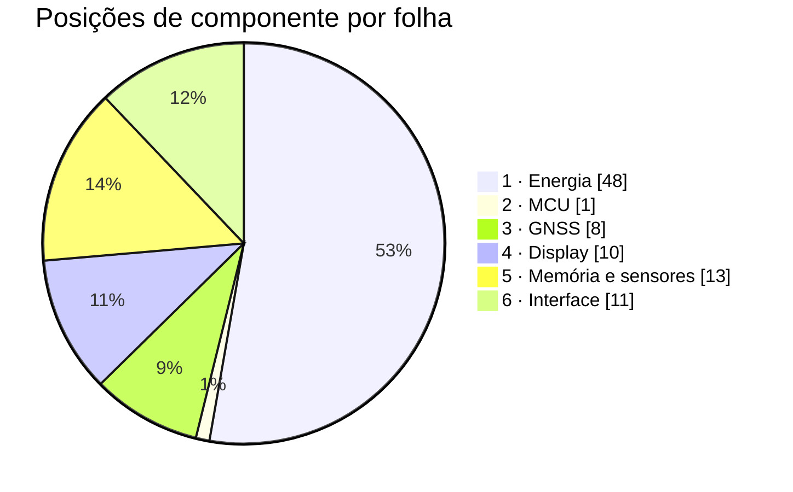

# Materiais por folha

O que cada folha do esquemático consome, ligado à linha correspondente da
[lista de compras](../docs/19-lista-de-compras.md). Esta página **não
repete** a lista de compras: ela diz quantas peças cada folha pede, com
que designador de referência, e aponta para lá, onde estão o código do
distribuidor, o preço e o estoque. Os valores dos passivos são os que os
[cálculos](02-calculos.md) fecharam.

**Nesta página:** [Como ler](#como-ler) · [Folha 1 · Energia](#folha-1--energia) · [Folha 2 · MCU](#folha-2--mcu) · [Folha 3 · GNSS](#folha-3--gnss) · [Folha 4 · Display](#folha-4--display) · [Folha 5 · Memória e sensores](#folha-5--memória-e-sensores) · [Folha 6 · Interface](#folha-6--interface) · [Contagem](#contagem) · [Onde os documentos discordam](#onde-os-documentos-discordam) · [O que ainda não tem código de compra](#o-que-ainda-não-tem-código-de-compra) · [Custo](#custo)

> [!WARNING]
> **Nada foi comprado, nada foi montado.** Nenhum pedido foi feito,
> nenhuma peça chegou, nenhuma placa existe. Todo código de distribuidor
> citado aqui é um apontamento para a [lista de compras](../docs/19-lista-de-compras.md),
> lida da DigiKey em 2026-09-18 e sujeita a mudar no dia do pedido.

## Como ler

- **Referência**: o designador que aparecerá no esquemático. O **primeiro
  dígito é o número da folha**: `U1xx`, `R1xx`, `C1xx` e `L1xx` são da
  folha 1; `U2xx` da folha 2; `U3xx`, `C3xx` da folha 3, e assim por
  diante. As letras seguem a prática usual — `U` integrado, `R` resistor,
  `C` capacitor, `L` indutor, `FB` ferrite, `D` diodo e LED, `Q`
  transistor, `J` conector, `SW` tecla, `DS` display, `LS` transdutor
  sonoro, `E` antena, `BT` bateria, `PV` módulo fotovoltaico, `RT`
  termistor, `JP` jumper, `MP` peça mecânica.
- **Quantidade**: peças **por placa**. A compra sugerida para 5 placas
  está na [lista de compras](../docs/19-lista-de-compras.md#lista-por-bloco),
  não aqui.
- **Onde está na lista de compras**: a seção de [19](../docs/19-lista-de-compras.md)
  que traz o código, o estoque e o preço da peça.
- Os **100 nF de desacoplamento** (um por pino de alimentação de cada CI,
  regra de [02](02-calculos.md#desacoplamento)) aparecem em todas as
  folhas como `a fechar no layout`: o número exato sai da contagem de
  pinos de alimentação no desenho, e a lista de compras já compra 200.

## Folha 1 · Energia

Três entradas (USB, painel e célula), quatro trilhos de saída
([01](01-esquematico.md#folha-1--energia)).

| Referência | Componente | Valor ou código | Quantidade | Onde está na lista de compras |
|---|---|---|---|---|
| J101 | Receptáculo USB-C IPX8 | Molex 2036150003 | 1 | [USB](../docs/19-lista-de-compras.md#usb) |
| D101 | TVS do `VBUS` | TI ESD761DPYR | 1 | [USB](../docs/19-lista-de-compras.md#usb) |
| D102 | ESD de D+, D−, `CC1` e `CC2` | TI TPD4E05U06DQAR | 1 | [USB](../docs/19-lista-de-compras.md#usb) |
| U101 | PMIC, carregador e conversores | Nordic nPM1300-QEAA-R (QFN32) | 1 | [Energia](../docs/19-lista-de-compras.md#energia) |
| L101, L102 | Indutores do BUCK1 e do BUCK2 | Murata DFE201610E-2R2M=P2, 2,2 µH | 2 | [Energia](../docs/19-lista-de-compras.md#energia) |
| U102 | Medidor de carga, **com o sensor de 7 mΩ dentro do CI** | Analog Devices MAX17262REWL+T | 1 | [Energia](../docs/19-lista-de-compras.md#energia) |
| U103 | Colhedor solar com MPPT | e-peas AEM10900 (10AEM10900C0002, QFN28) | 1 | [Energia](../docs/19-lista-de-compras.md#energia) — a DigiKey não vende |
| L103 | Indutor do `SWDCDC` | TDK VLS252012HBX-4R7M-1, 4,7 µH | 1 | [Energia](../docs/19-lista-de-compras.md#energia) |
| U104 | LDO do `VBCKP` do receptor | TI TPS7A0218PDQNR | 1 | [Energia](../docs/19-lista-de-compras.md#energia) |
| PV101 a PV106 | Módulos solares de 3 células, 23 × 8 mm | ANYSOLAR KXOB25-05X3F-TR | 6 | [Energia](../docs/19-lista-de-compras.md#energia) |
| BT101 | Célula LiPo 1S, 2000 mAh, com PCM e NTC | sob encomenda, 60 × 36 × 7 mm | 1 | [Compras fora da DigiKey](../docs/19-lista-de-compras.md#compras-fora-da-digikey) |
| J102 | Conector da bateria na placa | JST SM06B-GHS-TB | 1 | [Energia](../docs/19-lista-de-compras.md#energia) |
| — | Carcaça e terminais do cabo da célula | JST GHR-06V-S e 6 × SSHL-002T-P0.2 | 1 + 6, fora da placa | [Energia](../docs/19-lista-de-compras.md#energia) |
| RT101 | NTC do `TH_MON` do AEM10900 | TDK NTCG103JF103FT1, 10 kΩ B3380 | 1 | [Energia](../docs/19-lista-de-compras.md#energia) |
| RT102 | NTC do pack, para o JEITA do nPM1300 | 10 kΩ B3380, **dentro da bateria** | 1 | [Compras fora da DigiKey](../docs/19-lista-de-compras.md#compras-fora-da-digikey) |
| D103 | LED de carga, no `LED1` | Kingbright APT1608SURCK | 1 | [Energia](../docs/19-lista-de-compras.md#energia) |
| D104 | LED de erro, no `LED0` | Kingbright APT1608SURCK | 1 (**a lista compra 1 LED por placa**) | [Energia](../docs/19-lista-de-compras.md#energia) |
| R102 | `RVSET1`, BUCK1 em 1,8 V | 47 kΩ ([02](02-calculos.md#conversores-do-npm1300)) | 1 | [Passivos](../docs/19-lista-de-compras.md#passivos) |
| R103 | `RVSET2`, BUCK2 em 3,0 V | 150 kΩ ([02](02-calculos.md#conversores-do-npm1300)) | 1 | [Passivos](../docs/19-lista-de-compras.md#passivos) |
| R104, R105 | Divisor do `DIS_STO_CH`, do `VBUSOUT` | 100 kΩ e 1 MΩ | 1 + 1 | [Passivos](../docs/19-lista-de-compras.md#passivos) |
| R106 | `RDIV` do AEM10900 | 22 kΩ | 1 | [Passivos](../docs/19-lista-de-compras.md#passivos) |
| R107, R108 | Pull-ups do `i2c30` (`PWR_SDA`, `PWR_SCL`) | **4,7 kΩ** ([02](02-calculos.md#pull-ups-do-i²c)) | 2 | [Passivos](../docs/19-lista-de-compras.md#passivos), Panasonic ERJ-2RKF4701X |
| R109 | Pull-up do `PMIC_INT` | 10 kΩ | 1 | [Passivos](../docs/19-lista-de-compras.md#passivos) |
| C101 a C109 | Entradas e saídas do nPM1300, `VBUS` | 10 µF, 25 V, X5R, 0603 (lista de referência da Nordic) | 9 | [Passivos](../docs/19-lista-de-compras.md#passivos) |
| C110, C111 | nPM1300, referência da Nordic | 1 µF, 25 V, X5R, 0402 | 2 | [Passivos](../docs/19-lista-de-compras.md#passivos) |
| C112 | `C6` da referência do nPM1300 | 2,2 µF, 16 V, X7R, 0603 | 1 | [Passivos](../docs/19-lista-de-compras.md#passivos) |
| C113, C114 | Entrada e saída do TPS7A02 | 1 µF, 25 V, X5R, 0402 | 2 | [Passivos](../docs/19-lista-de-compras.md#passivos) |
| C115, C116 | `CSRC` e `CINT` do AEM10900 | 22 µF, 6,3 V, X5R, 0402 | 2 | [Passivos](../docs/19-lista-de-compras.md#passivos) |
| C117 | `CSTO` do AEM10900 | 22 µF, 10 V, X5R, 0603 | 1 | [Passivos](../docs/19-lista-de-compras.md#passivos) |
| C118 | `REG` do MAX17262 | 0,47 µF, 10 V, X5R, 0402 | 1 | [Passivos](../docs/19-lista-de-compras.md#passivos) |
| C119 em diante | Desacoplamento dos quatro CIs desta folha | 100 nF, 10 V, X7R, 0402 | a fechar no layout | [Passivos](../docs/19-lista-de-compras.md#passivos) |

**Não existe resistor de medida nesta folha.** O sensor de 7 mΩ entre
`BATT` e `SYS` é **interno ao CI**: o `R` do código `MAX17262REWL+T` é
justamente a versão com o resistor de medida integrado
([13](../docs/13-placa-nova.md#energia),
[14](../docs/14-hardware-placa-nova.md#carga),
[15](../docs/15-avaliacao-componentes.md#medição-da-carga) e
[02](02-calculos.md#medidor-de-bateria)). Um rascunho desta página criou um
`R101` externo, que **não existe**: montado assim, a resistência do caminho
dobraria e o medidor erraria toda corrente e toda estimativa de carga.

Os três pontos de teste da folha (`ST_STO` e os dois pads do console, na
[lista de nós](03-netlist.md#nós-sem-ligação-ao-mcu)) são cobre, não
material.

## Folha 2 · MCU

A folha mais barata em peças: o módulo traz dentro a radiofrequência, os
dois cristais e o casamento ([01](01-esquematico.md#folha-2--mcu)).

| Referência | Componente | Valor ou código | Quantidade | Onde está na lista de compras |
|---|---|---|---|---|
| U201 | Módulo com o nRF54LM20A, 10,0 × 16,2 mm | Fanstel BM20C | 1 | [MCU e rádio](../docs/19-lista-de-compras.md#mcu-e-rádio) — sem estoque até 12/11/2026 |
| J201 | Footprint de depuração SWD | Tag-Connect TC2030-NL, **só furos e pads** | 0 peças | o cabo TC2030-CTX-NL e o clipe estão em [Placas de avaliação e ferramentas](../docs/19-lista-de-compras.md#placas-de-avaliação-e-ferramentas) |
| TP201, TP202 | Pads do console `uart20` | cobre | 0 peças | — |
| C201 em diante | Desacoplamento dos pinos `VDD` do módulo | 100 nF, 10 V, X7R, 0402 | a fechar no layout | [Passivos](../docs/19-lista-de-compras.md#passivos) |

O plano B do módulo, se o BM20C atrasar, é o MinewSemi ME54BS13-1Y20TI,
que **tem outro footprint**: trocar o módulo é refazer a folha e o
layout, não trocar uma linha de lista.

## Folha 3 · GNSS

| Referência | Componente | Valor ou código | Quantidade | Onde está na lista de compras |
|---|---|---|---|---|
| U301 | Receptor GNSS L1 + L5 | u-blox MAX-F10S-00B | 1 | [GNSS](../docs/19-lista-de-compras.md#gnss) |
| U301 (alternativa) | Receptor L1, mesmo footprint | u-blox MAX-M10N-10B | — | [GNSS](../docs/19-lista-de-compras.md#gnss) — 2 peças para o teste A/B |
| U302 | Tradutor de nível de 4 canais, 3V0 ⇄ 1V8 | TI TXU0204BQAR | 1 | [GNSS](../docs/19-lista-de-compras.md#gnss) |
| E301 | Antena linear L1/L5, na borda de cima | TE L000670-01 | 1 | [GNSS](../docs/19-lista-de-compras.md#gnss) — aprovada **com a ressalva de L5** |
| FB301 | Ferrite do `1V8` junto do receptor | Murata BLM15PX601SN1D, 600 Ω a 100 MHz | 1 | [GNSS](../docs/19-lista-de-compras.md#gnss) |
| C301, C302 | Paralelos da rede em π | Murata GJM1555C1H2R2BB01D, 2,2 pF C0G (**valor de partida**) | 2 posições | [GNSS](../docs/19-lista-de-compras.md#gnss) |
| L301 | Série da rede em π | Murata LQW15AN3N9C00D, 3,9 nH, ou 0 Ω (**valor de partida**) | 1 posição | [GNSS](../docs/19-lista-de-compras.md#gnss) |
| C303 | Volume do `1V8` depois do ferrite | 10 µF, 25 V, X5R, 0603 | 1 | [Passivos](../docs/19-lista-de-compras.md#passivos) |
| C304 em diante | Desacoplamento do receptor e do tradutor | 100 nF, 10 V, X7R, 0402 | a fechar no layout | [Passivos](../docs/19-lista-de-compras.md#passivos) |

O `GNSS_EXTINT` fica com o pino reservado no MCU e **sem componente**: o
quinto sinal não coube nos quatro canais do TXU0204
([03](03-netlist.md#nós-do-mcu)). Os três valores da rede em π são de
partida: quem os fecha é o VNA, dentro da caixa final.

## Folha 4 · Display

Duas montagens no mesmo conector, e só uma de cada vez
([01](01-esquematico.md#folha-4--display)).

| Referência | Componente | Valor ou código | Quantidade | Onde está na lista de compras |
|---|---|---|---|---|
| J401 | Conector do painel, 10 vias, passo de 0,5 mm | Hirose FH28-10S-0.5SH(05) | 1 | [Display](../docs/19-lista-de-compras.md#display) |
| DS401 | Painel de 2,7", 400 × 240, retrato | Sharp LS027B7DH01A **ou** JDI LPM027M128B | 1 | [Display](../docs/19-lista-de-compras.md#display) — a linha comprável é a Sharp |
| DS402 | Filme de luz frontal, 0,05 mm | Azumo 11103-06_A1 | 1, **só com a Sharp** | [Display](../docs/19-lista-de-compras.md#display) |
| J402 | Conector do filme, 4 vias, passo de 0,5 mm | Molex 5034800440 | 1, **só com a Sharp** | [Display](../docs/19-lista-de-compras.md#display) |
| U401 | Conversor de 5 V da tela, com `EN` | TI REG710NA-5/3K | 1, **só com a Sharp** | [Display](../docs/19-lista-de-compras.md#display) |
| Q401 | MOSFET de canal N da luz, no PWM | Diodes DMG1012T-7 | 1 | [Display](../docs/19-lista-de-compras.md#display), linha "Chave da luz" |
| R401 | `R_BL`, resistor da luz | **39 Ω** com o JDI; **a definir** com a Sharp, porque depende da tensão direta do filme ([02](02-calculos.md#luz-do-display)) | 1 | [Passivos](../docs/19-lista-de-compras.md#passivos) — a linha de 39 Ω existe |
| JP401 | Jumper de posição única, `3V0` ou `5V0` | 0 Ω, Panasonic ERJ-2GE0R00X | 1 | [Passivos](../docs/19-lista-de-compras.md#passivos) |
| C401 | Bombeamento do REG710 | 0,22 µF, 25 V, X5R, 0402 | 1 | [Passivos](../docs/19-lista-de-compras.md#passivos) |
| C402 | Saída do REG710 | 10 µF, 25 V, X5R, 0603 | 1 | [Passivos](../docs/19-lista-de-compras.md#passivos) |
| C403 em diante | Desacoplamento do painel e do REG710 | 100 nF, 10 V, X7R, 0402 | a fechar no layout | [Passivos](../docs/19-lista-de-compras.md#passivos) |

> [!CAUTION]
> `DS402`, `J402` e `U401` **só existem na montagem com a Sharp**. Com o
> JDI, o painel vem sem filme de luz e é alimentado em 3,0 V: os 5 V do
> REG710 passam do máximo absoluto de 3,6 V dele. É o que o `JP401` de
> posição única impede em hardware.

## Folha 5 · Memória e sensores

| Referência | Componente | Valor ou código | Quantidade | Onde está na lista de compras |
|---|---|---|---|---|
| U501 | Flash NOR de 64 Mbit (8 MB), no `spi00` | Macronix MX25R6435F | 1 | [Armazenamento](../docs/19-lista-de-compras.md#armazenamento) — **código, preço e estoque não conferidos** |
| R501 | Pull-up do `NOR_CS` | 100 kΩ, ao `SD3V0` | 1 | [Passivos](../docs/19-lista-de-compras.md#passivos) |
| R502, R503 | Pull-ups de `WP` e `HOLD` da flash | 47 kΩ | 2 | [Passivos](../docs/19-lista-de-compras.md#passivos) |
| C501 | Volume do `SD3V0` junto da flash | 22 µF, 10 V, X5R, 0603 | 1 | [Passivos](../docs/19-lista-de-compras.md#passivos) |
| U502 | Barômetro, `0x47` | Bosch BMP585 | 1 | [Sensores](../docs/19-lista-de-compras.md#sensores) |
| U503 | IMU, `0x68` | Bosch BMI270 (alternativa ST LSM6DSV16X, `0x6A`, no mesmo footprint) | 1 | [Sensores](../docs/19-lista-de-compras.md#sensores) |
| U504 | Magnetômetro, `0x30` | Memsic MMC5633NJL (WLP de 0,85 mm) | 1 | [Sensores](../docs/19-lista-de-compras.md#sensores) |
| U505 | Luz ambiente, `0x44` | TI OPT3001DNPR | 1 | [Sensores](../docs/19-lista-de-compras.md#sensores) |
| R504, R505 | Pull-ups do `i2c23` (`SENS_SDA`, `SENS_SCL`) | **4,7 kΩ** ([02](02-calculos.md#pull-ups-do-i²c)) | 2 | [Passivos](../docs/19-lista-de-compras.md#passivos), Panasonic ERJ-2RKF4701X |
| C502 | `VDD` do MMC5633NJL, que pede 2,2 µF no mínimo | 4,7 µF, 16 V, X5R, 0603 | 1 | [Passivos](../docs/19-lista-de-compras.md#passivos) |
| MP501 | Respiro do barômetro, na caixa | Amphenol LTW VENT-PS2NBK-O8001 | 1 | [Sensores](../docs/19-lista-de-compras.md#sensores) — rosca M6, pede ressalto na tampa |
| C503 em diante | Desacoplamento da flash e dos quatro sensores | 100 nF, 10 V, X7R, 0402 | a fechar no layout | [Passivos](../docs/19-lista-de-compras.md#passivos) |

**Não há cartão nem soquete de cartão nesta placa** (decisão de
2026-09-20). A lista de compras ainda traz o soquete Hirose
DM3AT-SF-PEJM5 "só no protótipo" em
[Armazenamento](../docs/19-lista-de-compras.md#armazenamento); nenhuma
folha deste esquemático o consome, e o chip select livre de P2.03 é o que
sobra para quem quiser um num protótipo.

## Folha 6 · Interface

| Referência | Componente | Valor ou código | Quantidade | Onde está na lista de compras |
|---|---|---|---|---|
| SW601, SW602, SW603 | Teclas táteis IP67, 6 × 6 × 4,3 mm | Omron B3S-1002P (alternativa E-Switch TL3780AF240QG, 0,6 mm mais baixa) | 3 | [Interface](../docs/19-lista-de-compras.md#interface) |
| LS601 | Buzzer piezo SMD, em contrafase | Same Sky CPT-1117-83-SMT-TR | 1 | [Interface](../docs/19-lista-de-compras.md#interface) |
| D601 | LED RGB de anodo comum, 1,6 × 1,6 mm | Kingbright APTF1616SEEZGKQBKC | 1 | [Interface](../docs/19-lista-de-compras.md#interface) |
| R601, R602, R603 | `R_LEDR`, `R_LEDG` e `R_LEDB`, um por cor | **1 kΩ** ([02](02-calculos.md#led-rgb)) | 3 | [Passivos](../docs/19-lista-de-compras.md#passivos), Yageo RC0402FR-071KL (`311-1.00KLRTR-ND`) |
| Q601, Q602, Q603 | Chaves do LED RGB, uma por cor | Diodes DMG1012T-7 | 3 | [Interface](../docs/19-lista-de-compras.md#interface) — a lista compra **4 por placa**, 3 aqui e 1 da luz (`Q401`) |

O 1 kΩ é o valor da [especificação](../docs/14-hardware-placa-nova.md#componentes-principais)
e da lista de compras, e a conta de [02](02-calculos.md#led-rgb) o confirma
com a tensão direta de ficha do Kingbright APTF1616SEEZGKQBKC (1,83 V no
vermelho e 2,66 V no verde e no azul, a 2 mA): de 3,62 mA no vermelho com
o `VSYS` em 5,5 V a 0,29 mA no verde e no azul com a célula vazia, e
nenhum canal apaga. **O catodo não vai ao pino do MCU**: cada cor
passa pelo dreno do seu MOSFET, porque com o cabo USB o `VSYS` chega a
5,5 V ([01](01-esquematico.md#folha-6--interface),
[03](03-netlist.md#nós-sem-ligação-ao-mcu)). As teclas não levam resistor:
os três pinos usam o pull-up interno do MCU ([03](03-netlist.md#nós-do-mcu)).

## Contagem

Posições de componente por placa, sem contar os 100 nF de desacoplamento
(que ficam para o layout) nem o cabo da célula.

| Folha | Posições | Das quais passivas | O que pesa |
|---|---|---|---|
| 1 · Energia | 48 | 31 | 9 capacitores de 10 µF da referência da Nordic e 6 módulos solares |
| 2 · MCU | 1 | 0 | o módulo, e nada mais |
| 3 · GNSS | 8 | 5 | a rede em π e o filtro do `1V8` |
| 4 · Display | 10 | 4 | três peças só existem na montagem com a Sharp |
| 5 · Memória e sensores | 13 | 7 | cinco CIs e os pull-ups |
| 6 · Interface | 11 | 3 | três teclas, três resistores e três MOSFET do LED |
| **Total** | **91** | **50 (55 %)** | |

A conta de cada folha, somando a coluna **Quantidade** das tabelas acima
(**conta**):

```
folha 1: 1 J + 2 D + 4 U + 3 L + 6 PV + 1 BT + 1 J + 2 RT + 2 D(LED)
         + 8 R + 18 C                                            = 48
folha 2: 1 U (o J201 e os dois pads valem 0 peças)                =  1
folha 3: 2 U + 1 E + 1 FB + 3 posições da rede em π + 1 C         =  8
folha 4: 2 J + 2 DS + 1 U + 1 Q + 1 R + 1 JP + 2 C                = 10
folha 5: 5 U + 5 R + 2 C + 1 MP                                   = 13
folha 6: 3 SW + 1 LS + 1 D + 3 R + 3 Q                            = 11

total = 48 + 1 + 8 + 10 + 13 + 11 = 91
passivas = 31 + 0 + 5 + 4 + 7 + 3 = 50, ou 50 ÷ 91 = 55 %
```



A contagem é de **itens de material**, não de peças soldadas na placa: a
célula (`BT101`), o NTC do pack (`RT102`) e os seis módulos solares entram
nos 91 embora nenhum seja um componente de montagem em superfície. Ficam
**fora** da conta: os 100 nF de desacoplamento de cinco folhas, o cabo da
célula (uma carcaça e seis terminais), o footprint Tag-Connect e os pontos
de teste, que são cobre, e o soquete microSD que a lista de compras ainda
traz e que nenhuma folha usa.

> [!NOTE]
> A contagem anterior desta página dava 89 posições. A diferença são duas
> correções (**conta**: 89 − 1 + 3 = 91): saiu o `R101`, que nunca existiu
> porque o sensor de 7 mΩ é interno ao MAX17262, e entraram os três
> `DMG1012T-7` do LED RGB, que a folha 6 antes deixava "a fechar".

## Onde os documentos discordam

**Nenhuma peça desta página diverge hoje da lista de compras.** As três
divergências que esta seção registrava foram fechadas, e ficam aqui como
histórico para ninguém reabri-las.

| O que divergia | Como fechou |
|---|---|
| **Valor dos resistores do LED RGB** | um rascunho supunha tensão direta de 2,0 V e 3,0 V, que não vinha de fonte nenhuma, e chegava a 470 Ω e 150 Ω. Com a ficha do Kingbright APTF1616SEEZGKQBKC (1,83 V e 2,66 V a 2 mA) o valor é o **1 kΩ** que a [especificação](../docs/14-hardware-placa-nova.md#componentes-principais) e a [lista de compras](../docs/19-lista-de-compras.md#passivos) já traziam, e é o que [02](02-calculos.md#led-rgb) e esta página trazem |
| **Acionamento do LED RGB** | o catodo **não** vai ao pino do MCU: com o cabo USB o `VSYS` chega a 5,5 V e o diodo de proteção do pino ficaria polarizado. Vai um N-MOSFET por cor (Diodes DMG1012T-7), como [01](01-esquematico.md#folha-6--interface), [02](02-calculos.md#led-rgb) e [03](03-netlist.md#nós-sem-ligação-ao-mcu) descrevem e como a correção 18 da lista de compras pedia. Os três entram na [contagem](#contagem) |
| **Peça das teclas** | **Omron B3S-1002P**, IP67, em todos os documentos: no [README](README.md), na [folha 6](01-esquematico.md#folha-6--interface) e na [lista de compras](../docs/19-lista-de-compras.md#interface). A C&K PTS526 é a tecla da **V3** ([docs/02](../docs/02-hardware.md)) e foi trocada justamente por não ter grau IP ([Trocas](../docs/19-lista-de-compras.md#trocas)) |

## O que ainda não tem código de compra

Conferido linha a linha em [19](../docs/19-lista-de-compras.md) antes de
escrever cada item.

| Item | Folha | Situação exata na lista de compras |
|---|---|---|
| **Flash NOR Macronix MX25R6435F** | 5 | a linha traz "a confirmar" em código, estoque e preço; a peça foi escolhida pela ficha em 2026-09-20 e **nenhum distribuidor foi conferido** ([Armazenamento](../docs/19-lista-de-compras.md#armazenamento), [Compras fora da DigiKey](../docs/19-lista-de-compras.md#compras-fora-da-digikey)) |
| **e-peas AEM10900** | 1 | "a DigiKey não vende"; só a Mouser, **que não pôde ser conferida**, ou a própria e-peas por amostra ([Energia](../docs/19-lista-de-compras.md#energia)) |
| **`R_BL` da montagem com a Sharp** | 4 | a linha de 39 Ω existe e serve ao JDI; com a Sharp o valor **depende da tensão direta do filme**, que só a amostra dá ([02](02-calculos.md#luz-do-display)) |
| **Célula LiPo de 2000 mAh** | 1 | sem código: encomenda a um fabricante de packs, com PCM, NTC de 10 kΩ B3380, cabo com o GHR-06V-S e UN38.3 |
| **Painel JDI LPM027M128B** | 4 | a lista só tem o LPM027M128C, "sem canal autorizado; só em revendedores, sem garantia"; a peça comprável é a Sharp LS027B7DH01A ([Display](../docs/19-lista-de-compras.md#display)) |

Quatro itens que costumam ser dados como pendentes **não são**, e vale
dizer para ninguém os procurar de novo:

- **O sensor de 7 mΩ do medidor não é peça**: ele é **interno** ao
  MAX17262REWL+T, e o `R` do código é a versão com o resistor de medida
  integrado ([13](../docs/13-placa-nova.md#energia),
  [14](../docs/14-hardware-placa-nova.md#carga),
  [15](../docs/15-avaliacao-componentes.md#medição-da-carga)). Não há
  resistor externo a comprar, e criar um seria um defeito de projeto
  ([02](02-calculos.md#medidor-de-bateria)).
- **O MOSFET da luz tem código**: Diodes DMG1012T-7, DMG1012T-7DICT-ND,
  150.305 em estoque ([Display](../docs/19-lista-de-compras.md#display)).
  A compra dele e a dos três do LED RGB estão na mesma linha da
  [Interface](../docs/19-lista-de-compras.md#interface): **4 por placa**.
- **O buzzer tem código**: Same Sky CPT-1117-83-SMT-TR,
  102-CPT-1117-83-SMT-CT-ND, 18.796 em estoque
  ([Interface](../docs/19-lista-de-compras.md#interface)), e a
  [folha 6](01-esquematico.md#folha-6--interface) já o traz.
- **A antena tem código**: TE L000670-01, 343-L000670-01CT-ND, 2.738 em
  estoque, aprovada na lista
  ([GNSS](../docs/19-lista-de-compras.md#gnss)). O que está em aberto não
  é a compra, é o desempenho: com o F10S a rede em π precisa fechar **L1
  e L5**, a TE mede num plano de 90 × 41 mm maior que o desta placa, e a
  sintonia final é de bancada, com VNA e dentro da caixa.

## Custo

**Este documento não refaz o total.** A estimativa está em
[19 · Custo](../docs/19-lista-de-compras.md#custo): cerca de **US$ 173
por placa**, com os preços de 10 unidades, **sem** o AEM10900, a bateria,
a placa de circuito impresso, a montagem e **sem a flash NOR**, cujo
preço continua por conferir. Os maiores pedaços são o filme de luz
(US$ 66,45), a tela Sharp (US$ 23,61), os seis painéis solares
(US$ 15,84) e o receptor GNSS (US$ 13,14).

Confirmado o preço da MX25R6435F, ele se soma aos US$ 173,25 — e é a
única linha desta lista de materiais que ainda falta para o total fechar.
