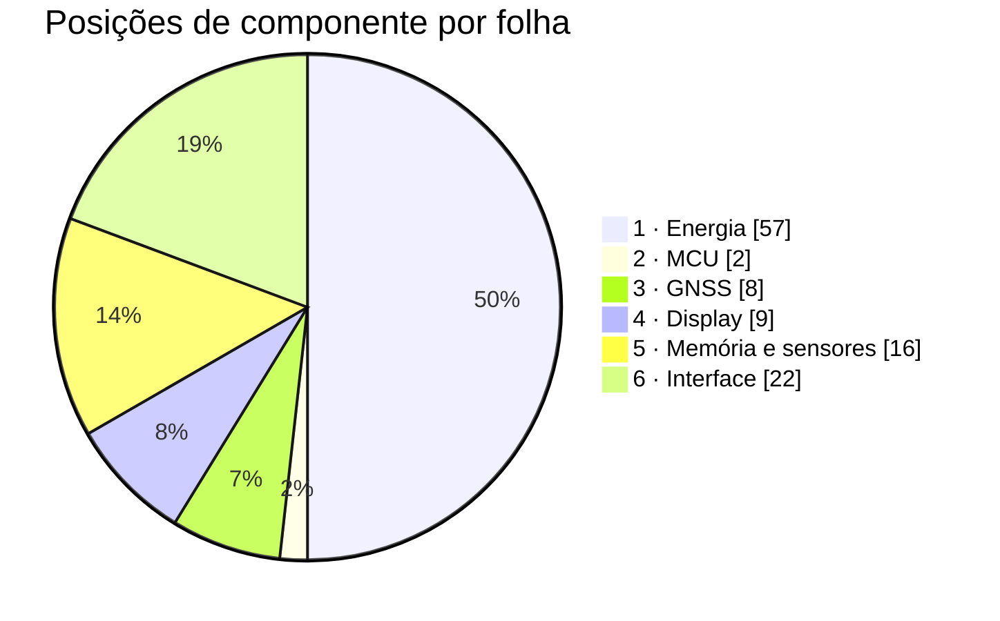

# Materiais por folha

O que cada folha do esquemático consome, ligado à linha correspondente da
[lista de compras](../docs/19-lista-de-compras.md). Esta página **não
repete** a lista de compras: ela diz quantas peças cada folha pede, com
que designador de referência, e aponta para lá, onde estão o código do
distribuidor, o preço e o estoque. Os valores dos passivos são os que os
[cálculos](02-calculos.md) fecharam.

**Nesta página:** [Como ler](#como-ler) · [Folha 1 · Energia](#folha-1--energia) · [Folha 2 · MCU](#folha-2--mcu) · [Folha 3 · GNSS](#folha-3--gnss) · [Folha 4 · Display](#folha-4--display) · [Folha 5 · Memória e sensores](#folha-5--memória-e-sensores) · [Folha 6 · Interface](#folha-6--interface) · [Contagem](#contagem) · [Onde os documentos discordam](#onde-os-documentos-discordam) · [O que ainda não tem código de compra](#o-que-ainda-não-tem-código-de-compra) · [Custo](#custo)

> [!WARNING]
> **Nada foi comprado, nada foi montado.** Nenhum pedido foi feito,
> nenhuma peça chegou, nenhuma placa existe. Todo código de distribuidor
> citado aqui é um apontamento para a [lista de compras](../docs/19-lista-de-compras.md),
> lida da DigiKey em 2026-09-18 e sujeita a mudar no dia do pedido.

## Como ler

- **Referência**: o designador que aparecerá no esquemático. O **primeiro
  dígito é o número da folha**: `U1xx`, `R1xx`, `C1xx` e `L1xx` são da
  folha 1; `U2xx` da folha 2; `U3xx`, `C3xx` da folha 3, e assim por
  diante. As letras seguem a prática usual — `U` integrado, `R` resistor,
  `C` capacitor, `L` indutor, `FB` ferrite, `D` diodo e LED, `Q`
  transistor, `J` conector, `SW` tecla, `DS` display, `LS` transdutor
  sonoro, `E` antena, `BT` bateria, `PV` módulo fotovoltaico, `RT`
  termistor, `JP` jumper, `MP` peça mecânica.
- **Quantidade**: peças **por placa**. A compra sugerida para 5 placas
  está na [lista de compras](../docs/19-lista-de-compras.md#lista-por-bloco),
  não aqui.
- **Onde está na lista de compras**: a seção de [19](../docs/19-lista-de-compras.md)
  que traz o código, o estoque e o preço da peça.
- Os **100 nF de desacoplamento** (um por pino de alimentação de cada CI,
  regra de [02](02-calculos.md#desacoplamento)) aparecem em todas as
  folhas como `a fechar no layout`: o número exato sai da contagem de
  pinos de alimentação no desenho, e a lista de compras já compra 200.

## Folha 1 · Energia

Três entradas (USB, painel e célula), quatro trilhos de saída
([01](01-esquematico.md#folha-1--energia)).

| Referência | Componente | Valor ou código | Quantidade | Onde está na lista de compras |
|---|---|---|---|---|
| J101 | Receptáculo USB-C IPX8 | Molex 2036150003 | 1 | [USB](../docs/19-lista-de-compras.md#usb) |
| D101 | TVS do `VBUS` | TI ESD761DPYR | 1 | [USB](../docs/19-lista-de-compras.md#usb) |
| D102 | ESD de D+, D−, `CC1` e `CC2` | TI TPD4E05U06DQAR | 1 | [USB](../docs/19-lista-de-compras.md#usb) |
| U101 | PMIC, carregador e conversores | Nordic nPM1300-QEAA-R (QFN32) | 1 | [Energia](../docs/19-lista-de-compras.md#energia) |
| L101, L102 | Indutores do BUCK1 e do BUCK2 | Murata DFE201610E-2R2M=P2, 2,2 µH | 2 | [Energia](../docs/19-lista-de-compras.md#energia) |
| U102 | Medidor de carga, **com o sensor de 7 mΩ dentro do CI** | Analog Devices MAX17262REWL+T | 1 | [Energia](../docs/19-lista-de-compras.md#energia) |
| U103 | Colhedor solar com MPPT | e-peas AEM10900 (10AEM10900C0002, QFN28) | 1 | [Energia](../docs/19-lista-de-compras.md#energia) — a DigiKey não vende |
| L103 | Indutor do `SWDCDC` | TDK VLS252012HBX-4R7M-1, 4,7 µH | 1 | [Energia](../docs/19-lista-de-compras.md#energia) |
| U104 | LDO do `VBCKP` do receptor | TI TPS7A0218PDQNR | 1 | [Energia](../docs/19-lista-de-compras.md#energia) |
| PV101 a PV106 | Módulos solares de 3 células, 23 × 8 mm | ANYSOLAR KXOB25-05X3F-TR | 6 | [Energia](../docs/19-lista-de-compras.md#energia) |
| BT101 | Célula LiPo 1S, 2000 mAh, com PCM e NTC | sob encomenda, 60 × 36 × 7 mm | 1 | [Compras fora da DigiKey](../docs/19-lista-de-compras.md#compras-fora-da-digikey) |
| J102 | Conector da bateria na placa | JST SM06B-GHS-TB | 1 | [Energia](../docs/19-lista-de-compras.md#energia) |
| — | Carcaça e terminais do cabo da célula | JST GHR-06V-S e 6 × SSHL-002T-P0.2 | 1 + 6, fora da placa | [Energia](../docs/19-lista-de-compras.md#energia) |
| RT101 | NTC do `TH_MON` do AEM10900, **na face de trás da placa, sob a célula** | TDK NTCG103JF103FT1, 10 kΩ B3380 | 1 | [Energia](../docs/19-lista-de-compras.md#energia). **Este é o caminho escolhido**: montá-lo **e** o segundo NTC do pack põe 10 kΩ em paralelo com 10 kΩ e mata a carga solar ([01](01-esquematico.md#folha-1--energia)) |
| RT102 | NTC do pack, para o JEITA do nPM1300 | 10 kΩ B3380, **dentro da bateria** | 1 | [Compras fora da DigiKey](../docs/19-lista-de-compras.md#compras-fora-da-digikey) |
| D103 | LED de carga, no `LED1` | Kingbright APT1608SURCK | 1 | [Energia](../docs/19-lista-de-compras.md#energia) |
| D104 | LED de erro, no `LED0` | Kingbright APT1608SURCK | 1 (**a lista compra 1 LED por placa**) | [Energia](../docs/19-lista-de-compras.md#energia) |
| R102 | `RVSET1`, BUCK1 em 1,8 V | 47 kΩ ([02](02-calculos.md#conversores-do-npm1300)) | 1 | [Passivos](../docs/19-lista-de-compras.md#passivos) |
| R103 | `RVSET2`, BUCK2 em 3,0 V | 150 kΩ ([02](02-calculos.md#conversores-do-npm1300)) | 1 | [Passivos](../docs/19-lista-de-compras.md#passivos) |
| R104, R105 | Divisor do `DIS_STO_CH`, do `VBUSOUT` | 100 kΩ e 1 MΩ | 1 + 1 | [Passivos](../docs/19-lista-de-compras.md#passivos) |
| R106 | `RDIV` do AEM10900 | 22 kΩ | 1 | [Passivos](../docs/19-lista-de-compras.md#passivos) |
| R107, R108 | Pull-ups do `i2c30` (`PWR_SDA`, `PWR_SCL`) | **4,7 kΩ** ([02](02-calculos.md#pull-ups-do-i²c)) | 2 | [Passivos](../docs/19-lista-de-compras.md#passivos), Panasonic ERJ-2RKF4701X |
| R109 | Pull-up do `PMIC_INT` | 10 kΩ | 1 | [Passivos](../docs/19-lista-de-compras.md#passivos) |
| C101 a C109 | Entradas e saídas do nPM1300, `VBUS` | 10 µF, 25 V, X5R, 0603 (lista de referência da Nordic) | 9 | [Passivos](../docs/19-lista-de-compras.md#passivos) |
| C110, C111 | nPM1300, referência da Nordic | 1 µF, 25 V, X5R, 0402 | 2 | [Passivos](../docs/19-lista-de-compras.md#passivos) |
| C112 | `C6` da referência do nPM1300 | 2,2 µF, 16 V, X7R, 0603 | 1 | [Passivos](../docs/19-lista-de-compras.md#passivos) |
| C113, C114 | Entrada e saída do TPS7A02 | 1 µF, 25 V, X5R, 0402 | 2 | [Passivos](../docs/19-lista-de-compras.md#passivos) |
| C115, C116 | `CSRC` e `CINT` do AEM10900 | 22 µF, 6,3 V, X5R, 0402 | 2 | [Passivos](../docs/19-lista-de-compras.md#passivos) |
| C117 | `CSTO` do AEM10900 | 22 µF, 10 V, X5R, 0603 | 1 | [Passivos](../docs/19-lista-de-compras.md#passivos) |
| C118 | `REG` do MAX17262 | 0,47 µF, 10 V, X5R, 0402 | 1 | [Passivos](../docs/19-lista-de-compras.md#passivos) |
| JP101 | Jumper de medição de corrente, no caminho da célula | 0 Ω, 1206, ≥ 2 A, ≤ 50 mΩ | 1 | **a definir**: o `ERJ-2GE0R00X` 0402 da lista não serve ([06](06-conectores-e-pontos-de-teste.md#jp101--jumper-de-medição-de-corrente)) |
| JP102 a JP106 | Jumpers de corrente por bloco: BM20C, GNSS, display, sensores e armazenamento | 0 Ω, 0402 | 5 | [Passivos](../docs/19-lista-de-compras.md#passivos), `ERJ-2GE0R00X`; pedidos por [14](../docs/14-hardware-placa-nova.md#placa-de-circuito-impresso) e esquecidos até 2026-09-23 |
| R105, R106, R110 | Pull-up do `ALRT` do MAX17262, do `IRQ` do AEM10900 e do `INT` do OPT3001 | 10 kΩ | 3 | [Passivos](../docs/19-lista-de-compras.md#passivos); nenhum dos três vai a pino do MCU, e o pull-up existe para não ficarem flutuando |
| C119 em diante | Desacoplamento dos quatro CIs desta folha | 100 nF, 10 V, X7R, 0402 | a fechar no layout | [Passivos](../docs/19-lista-de-compras.md#passivos) |

**Não existe resistor de medida nesta folha.** O sensor de 7 mΩ entre
`BATT` e `SYS` é **interno ao CI**: o `R` do código `MAX17262REWL+T` é
justamente a versão com o resistor de medida integrado
([13](../docs/13-placa-nova.md#energia),
[14](../docs/14-hardware-placa-nova.md#carga),
[15](../docs/15-avaliacao-componentes.md#medição-da-carga) e
[02](02-calculos.md#medidor-de-bateria)). Um rascunho desta página criou um
`R101` externo, que **não existe**: montado assim, a resistência do caminho
dobraria e o medidor erraria toda corrente e toda estimativa de carga.

Os doze pontos de teste desta folha (`TP101` a `TP112`, em
[06](06-conectores-e-pontos-de-teste.md#pontos-de-teste)) são cobre, não
material; os pads do console são da folha 2.

## Folha 2 · MCU

A folha mais barata em peças: o módulo traz dentro a radiofrequência, os
dois cristais e o casamento ([01](01-esquematico.md#folha-2--mcu)).

| Referência | Componente | Valor ou código | Quantidade | Onde está na lista de compras |
|---|---|---|---|---|
| U201 | Módulo com o nRF54LM20A, 10,0 × 16,2 mm | Fanstel BM20C | 1 | [MCU e rádio](../docs/19-lista-de-compras.md#mcu-e-rádio) — sem estoque até 12/11/2026 |
| J201 | Footprint de depuração SWD | Tag-Connect TC2030-NL, **só furos e pads** | 0 peças | o cabo TC2030-CTX-NL e o clipe estão em [Placas de avaliação e ferramentas](../docs/19-lista-de-compras.md#placas-de-avaliação-e-ferramentas) |
| TP201, TP202, TP203 | Pads do console `uart20` e o `GND` ao lado | cobre | 0 peças | [06](06-conectores-e-pontos-de-teste.md#pontos-de-teste) |
| C201 em diante | Desacoplamento dos pinos `VDD` do módulo | 100 nF, 10 V, X7R, 0402 | a fechar no layout | [Passivos](../docs/19-lista-de-compras.md#passivos) |
| C210 | **Volume do `3V0` junto do módulo** | 4,7 µF ([02](02-calculos.md#capacitor-de-volume-no-módulo)) | 1 | **a definir**: a lista não tem linha de 4,7 µF |

O plano B do módulo, se o BM20C atrasar, é o MinewSemi ME54BS13-1Y20TI,
que **tem outro footprint**: trocar o módulo é refazer a folha e o
layout, não trocar uma linha de lista.

## Folha 3 · GNSS

| Referência | Componente | Valor ou código | Quantidade | Onde está na lista de compras |
|---|---|---|---|---|
| U301 | Receptor GNSS L1 + L5 | u-blox MAX-F10S-00B | 1 | [GNSS](../docs/19-lista-de-compras.md#gnss) |
| U301 (alternativa) | Receptor L1, mesmo footprint | u-blox MAX-M10N-10B | — | [GNSS](../docs/19-lista-de-compras.md#gnss) — 2 peças para o teste A/B |
| U302 | Tradutor de nível de 4 canais, 3V0 ⇄ 1V8 | TI TXU0204BQAR | 1 | [GNSS](../docs/19-lista-de-compras.md#gnss) |
| E301 | Antena linear L1/L5, na borda de cima | TE L000670-01 | 1 | [GNSS](../docs/19-lista-de-compras.md#gnss) — aprovada **com a ressalva de L5** |
| FB301 | Ferrite do `1V8` junto do receptor | Murata BLM15PX601SN1D, 600 Ω a 100 MHz | 1 | [GNSS](../docs/19-lista-de-compras.md#gnss) |
| C301, C302 | Paralelos da rede em π | Murata GJM1555C1H2R2BB01D, 2,2 pF C0G (**valor de partida**) | 2 posições | [GNSS](../docs/19-lista-de-compras.md#gnss) |
| L301 | Série da rede em π | Murata LQW15AN3N9C00D, 3,9 nH, ou 0 Ω (**valor de partida**) | 1 posição | [GNSS](../docs/19-lista-de-compras.md#gnss) |
| C303 | Volume do `1V8` depois do ferrite | 10 µF, 25 V, X5R, 0603 | 1 | [Passivos](../docs/19-lista-de-compras.md#passivos) |
| C304 em diante | Desacoplamento do receptor e do tradutor | 100 nF, 10 V, X7R, 0402 | a fechar no layout | [Passivos](../docs/19-lista-de-compras.md#passivos) |

Os quatro canais do TXU0204 atendem os quatro sinais que precisam de
tradução, **dois em cada sentido**: `TX` e `EXTINT` do MCU para o receptor
(`A1` e `A2`), `RX` e `TIMEPULSE` do receptor para o MCU (`B3` e `B4`).
O `RESET_N` **não passa pelo tradutor** — o pino do MCU é dreno aberto e o
pull-up é interno ao módulo ([03](03-netlist.md#gnss--uart21)).

> [!NOTE]
> Uma versão anterior desta página dizia que "o quinto sinal não coube nos
> quatro canais" e deixava o `GNSS_EXTINT` sem componente. **Era a
> invenção que o dry-run de 2026-09-22 retratou** ([README](README.md#os-dry-runs)),
> e ela sobreviveu aqui, que é o documento que vira pedido e montagem.
> Montar por ela deixaria o `EXTINT` desligado ou, pior, encostaria uma
> saída de 3,0 V do MCU num pino de máximo absoluto de 1,98 V.

Os três valores da rede em π são de partida: quem os fecha é o VNA, dentro
da caixa final.

## Folha 4 · Display

**Uma tela, e não mais duas montagens.** A decisão de 2026-09-23 é o **JDI
LPM027M128C**, de 3,0 V e com luz frontal integrada
([01](01-esquematico.md#folha-4--display)). O par Sharp LS027B7DH01A mais
filme Azumo continua como **plano B**, no mesmo conector, e as peças dele
ficam abaixo marcadas como não montadas — o footprint permanece no desenho,
a peça sai do pedido.

| Referência | Componente | Valor ou código | Quantidade | Onde está na lista de compras |
|---|---|---|---|---|
| J401 | Conector do painel, 10 vias, passo de 0,5 mm | Hirose FH28-10S-0.5SH(05) | 1 | [Display](../docs/19-lista-de-compras.md#display) |
| DS401 | Painel de 2,7", 400 × 240, retrato, 8 cores, **com luz** | JDI LPM027M128C (plano B: Sharp LS027B7DH01A) | 1 | [Display](../docs/19-lista-de-compras.md#display) — **sem canal autorizado**: R$ 776 no AliExpress, sem garantia |
| Q401 | MOSFET de canal N da luz, no PWM | Diodes DMG1012T-7 | 1 | [Display](../docs/19-lista-de-compras.md#display), linha "Chave da luz" |
| R401 | `R_BL`, resistor da luz | **39 Ω**, para o LED de 16 mA a 2,67 V do JDI ([02](02-calculos.md#luz-do-display)); com a Sharp do plano B o valor depende da tensão direta do filme | 1 | [Passivos](../docs/19-lista-de-compras.md#passivos) — a linha de 39 Ω existe |
| R402 | Pull-down da porta do `Q401` | 100 kΩ | 1 | [Passivos](../docs/19-lista-de-compras.md#passivos) |
| R403, R404, R405 | Pull-down de `DISP_PWR_EN`, `DISP_ON` e `DISP_CS` | 100 kΩ | 3 | [Passivos](../docs/19-lista-de-compras.md#passivos) — os três são ativos altos e flutuam do reset até o firmware ([03](03-netlist.md#pinos-de-configuração-amarrados-em-cobre)) |
| JP401 | Jumper do `VDD` do painel: **0 Ω fixo na posição do `3V0`**, com a posição do `5V0` sem peça | 0 Ω, Panasonic ERJ-2GE0R00X | 1 | [Passivos](../docs/19-lista-de-compras.md#passivos) |
| C404 em diante | Desacoplamento do painel | 100 nF, 10 V, X7R, 0402 | a fechar no layout | [Passivos](../docs/19-lista-de-compras.md#passivos) |
| ~~DS402~~ | Filme de luz frontal, 0,05 mm | Azumo 11103-06_A1 | **0** — a luz agora é do painel; volta só no plano B | [Display](../docs/19-lista-de-compras.md#display) |
| ~~J402~~ | Conector do filme, 4 vias, passo de 0,5 mm | Molex 5034800440 | **0** — sem filme, sem conector de filme | [Display](../docs/19-lista-de-compras.md#display) |
| ~~U401~~ | Conversor de 5 V da tela, com `EN` | TI REG710NA-5/3K | **0** — o JDI vive em 3,0 V | [Display](../docs/19-lista-de-compras.md#display) |
| ~~C401~~ | Bombeamento do REG710 | 0,22 µF, 25 V, X5R, 0402 | **0** | [Passivos](../docs/19-lista-de-compras.md#passivos) |
| ~~C402, C403~~ | Saída **e** entrada do REG710 | 10 µF, 25 V, X5R, 0603 | **0** | [Passivos](../docs/19-lista-de-compras.md#passivos) |

> [!IMPORTANT]
> **As cinco peças riscadas saíram porque o JDI tem luz e vive em 3,0 V.**
> Com ele, o painel não precisa de filme laminado nem de 5 V: os 5 V do
> REG710 passariam do máximo absoluto de 3,6 V dele, e é o `JP401` com uma
> posição só populada que impede isso em hardware. **No plano B as cinco
> voltam**, e com elas o `R_BL` a definir na amostra.

> [!CAUTION]
> **Falta saber por onde a luz do C se liga, e sem isso a folha 4 não se
> desenha.** O FPC de 10 vias do `J401` — `SCLK`, `SI`, `SCS`, `EXTCOMIN`,
> `DISP`, `VDDA`, `VDD`, `EXTMODE`, `VSS`, `VSSA` — **não tem par para o
> LED**. O C tem de trazer um FPC com mais vias ou um rabicho próprio, e
> **nenhum documento do projeto registra qual**: a ficha lida foi a do
> LPM027M128**B**, que não tem luz. Enquanto isso não sair da ficha do C ou
> de uma amostra, esta folha **não tem linha de conector para a luz** e o
> layout não pode posicioná-lo. **Alta prioridade, antes do layout**
> ([06](06-conectores-e-pontos-de-teste.md#a-luz-do-lpm027m128c)).

## Folha 5 · Memória e sensores

| Referência | Componente | Valor ou código | Quantidade | Onde está na lista de compras |
|---|---|---|---|---|
| U501 | Flash NOR de 64 Mbit (8 MB), no `spi00` | Macronix MX25R6435F | 1 | [Armazenamento](../docs/19-lista-de-compras.md#armazenamento) — **código, preço e estoque não conferidos** |
| R501 | Pull-up do `NOR_CS` | 100 kΩ, ao `SD3V0` | 1 | [Passivos](../docs/19-lista-de-compras.md#passivos) |
| R502, R503 | Pull-ups de `WP` e `HOLD` da flash | 47 kΩ | 2 | [Passivos](../docs/19-lista-de-compras.md#passivos) |
| C501 | Volume do `SD3V0` junto da flash | 22 µF, 10 V, X5R, 0603 | 1 | [Passivos](../docs/19-lista-de-compras.md#passivos) |
| R506, R507, R508 | Série do `spi00`, junto do pino do MCU | 33 Ω | 3 | **a definir**: a lista não tem linha de 33 Ω. Amaciam a borda de 8 MHz, cujo 197º harmônico cai a 0,58 MHz do centro de L1 ([04](04-pcb-e-caixa.md)) |
| U502 | Barômetro, `0x47` | Bosch BMP585 | 1 | [Sensores](../docs/19-lista-de-compras.md#sensores) |
| U503 | IMU, `0x68` | Bosch BMI270 (alternativa ST LSM6DSV16X, `0x6A`, no mesmo footprint) | 1 | [Sensores](../docs/19-lista-de-compras.md#sensores) |
| U504 | Magnetômetro, `0x30` | Memsic MMC5633NJL (WLP de 0,85 mm) | 1 | [Sensores](../docs/19-lista-de-compras.md#sensores) |
| U505 | Luz ambiente, `0x44` | TI OPT3001DNPR | 1 | [Sensores](../docs/19-lista-de-compras.md#sensores) |
| R504, R505 | Pull-ups do `i2c23` (`SENS_SDA`, `SENS_SCL`) | **4,7 kΩ** ([02](02-calculos.md#pull-ups-do-i²c)) | 2 | [Passivos](../docs/19-lista-de-compras.md#passivos), Panasonic ERJ-2RKF4701X |
| C502 | `VDD` do MMC5633NJL, que pede 2,2 µF no mínimo | 4,7 µF, 16 V, X5R, 0603 | 1 | [Passivos](../docs/19-lista-de-compras.md#passivos) |
| MP501 | Respiro do barômetro, na caixa | Amphenol LTW VENT-PS2NBK-O8001 | 1 | [Sensores](../docs/19-lista-de-compras.md#sensores) — rosca M6, pede ressalto na tampa |
| C503 em diante | Desacoplamento da flash e dos quatro sensores | 100 nF, 10 V, X7R, 0402 | a fechar no layout | [Passivos](../docs/19-lista-de-compras.md#passivos) |

**Não há cartão nem soquete de cartão nesta placa** (decisão de
2026-09-20). A lista de compras ainda traz o soquete Hirose
DM3AT-SF-PEJM5 "só no protótipo" em
[Armazenamento](../docs/19-lista-de-compras.md#armazenamento); nenhuma
folha deste esquemático o consome, e o chip select livre de P2.03 é o que
sobra para quem quiser um num protótipo.

## Folha 6 · Interface

| Referência | Componente | Valor ou código | Quantidade | Onde está na lista de compras |
|---|---|---|---|---|
| SW601, SW602, SW603 | Teclas táteis IP67, 6 × 6 × 4,3 mm | Omron B3S-1002P (alternativa E-Switch TL3780AF240QG, 0,6 mm mais baixa) | 3 | [Interface](../docs/19-lista-de-compras.md#interface) |
| LS601 | Buzzer piezo SMD, em contrafase | Same Sky CPT-1117-83-SMT-TR | 1 | [Interface](../docs/19-lista-de-compras.md#interface) |
| D601 | LED RGB de anodo comum, 1,6 × 1,6 mm | Kingbright APTF1616SEEZGKQBKC | 1 | [Interface](../docs/19-lista-de-compras.md#interface) |
| R601, R602, R603 | `R_LEDR`, `R_LEDG` e `R_LEDB`, um por cor | **1 kΩ** ([02](02-calculos.md#led-rgb)) | 3 | [Passivos](../docs/19-lista-de-compras.md#passivos), Yageo RC0402FR-071KL (`311-1.00KLRTR-ND`) |
| Q601, Q602, Q603 | Chaves do LED RGB, uma por cor | Diodes DMG1012T-7 | 3 | [Interface](../docs/19-lista-de-compras.md#interface) — a lista compra **4 por placa**, 3 aqui e 1 da luz (`Q401`) |
| R604, R605, R606 | Série das teclas | 100 Ω ([02](02-calculos.md#proteção-das-teclas)) | 3 | **a definir**: a lista não tem linha de 100 Ω |
| C601, C602, C603 | Ao `GND` em cada tecla | 1 nF ([02](02-calculos.md#proteção-das-teclas)) | 3 | **a definir**: a lista não tem linha de 1 nF |
| R607, R608 | Série do buzzer, um por pino | 330 Ω ([02](02-calculos.md#buzzer-piezo)) | 2 | **a definir**: a lista não tem linha de 330 Ω |
| R609, R610, R611 | Pull-down das portas dos MOSFET do LED | 100 kΩ ([03](03-netlist.md#pinos-de-configuração-amarrados-em-cobre)) | 3 | [Passivos](../docs/19-lista-de-compras.md#passivos), linha de 100 kΩ |

O 1 kΩ é o valor da [especificação](../docs/14-hardware-placa-nova.md#componentes-principais)
e da lista de compras, e a conta de [02](02-calculos.md#led-rgb) o confirma
com a tensão direta de ficha do Kingbright APTF1616SEEZGKQBKC (1,83 V no
vermelho e 2,66 V no verde e no azul, a 2 mA): de 3,62 mA no vermelho com
o `VSYS` em 5,5 V a 0,29 mA no verde e no azul com a célula vazia, e
nenhum canal apaga. **O catodo não vai ao pino do MCU**: cada cor
passa pelo dreno do seu MOSFET, porque com o cabo USB o `VSYS` chega a
5,5 V ([01](01-esquematico.md#folha-6--interface),
[03](03-netlist.md#nós-sem-ligação-ao-mcu)).

As teclas **ganharam proteção** em 2026-09-23: elas saem para a caixa e são
o que o ciclista toca, e até então iam direto ao pino do MCU sem nada. Os
100 Ω em série e o 1 nF ao terra dão τ de 13 µs com o pull-up interno e
tiram só 23 mV do nível baixo ([02](02-calculos.md#proteção-das-teclas)).
O nível alto continua vindo do pull-up interno, sem resistor externo.

## Contagem

Posições de componente por placa, sem contar os 100 nF de desacoplamento
(que ficam para o layout) nem o cabo da célula.

| Folha | Posições | Das quais passivas | O que pesa |
|---|---|---|---|
| 1 · Energia | 57 | 40 | 9 capacitores de 10 µF da referência da Nordic e 6 módulos solares |
| 2 · MCU | 2 | 1 | o módulo e o capacitor de volume dele |
| 3 · GNSS | 8 | 5 | a rede em π e o filtro do `1V8` |
| 4 · Display | 9 | 6 | a tela com luz integrada tirou seis peças da folha |
| 5 · Memória e sensores | 16 | 10 | cinco CIs, os pull-ups e os três resistores de série do SPI |
| 6 · Interface | 22 | 14 | três teclas com proteção, três MOSFET e os pull-downs |
| **Total** | **114** | **76 (67 %)** | |

A conta, somando a coluna **Quantidade** das tabelas acima (**conta**):

```
57 + 2 + 8 + 9 + 16 + 22 = 114
passivas: 40 + 1 + 5 + 6 + 10 + 14 = 76, ou 76 ÷ 114 = 67 %
```



A contagem é de **itens de material**, não de peças soldadas na placa: a
célula (`BT101`), o NTC do pack (`RT102`) e os seis módulos solares entram
nos 120 embora nenhum seja um componente de montagem em superfície. Ficam
**fora** da conta: os 100 nF de desacoplamento de cinco folhas, o cabo da
célula (uma carcaça e seis terminais), o footprint Tag-Connect e os pontos
de teste, que são cobre, e o soquete microSD que a lista de compras ainda
traz e que nenhuma folha usa.

> [!NOTE]
> Esta página já deu 89, 91 e 120 posições. As diferenças, em ordem
> (**conta**): 89 − 1 (`R101`, que nunca existiu, porque o sensor de 7 mΩ é
> interno ao MAX17262) + 3 (os `DMG1012T-7` do LED RGB) = 91; e 91 + 29
> = **120**, dos componentes que as contas de 2026-09-23 criaram — a
> proteção das três teclas (3 resistores e 3 capacitores), os dois
> resistores de série do buzzer, os sete pull-downs de porta e de sinal
> ativo alto, os três resistores de série do SPI da flash e o capacitor de
> volume do módulo, o jumper de medição de corrente, os cinco jumpers de
> corrente por bloco que a especificação pedia e ninguém tinha trazido, os
> três pull-ups do `ALRT`, do `IRQ` e do `INT`, e o capacitor de entrada do
> REG710. **Nenhum deles é enfeite**: cada um sai de uma conta ou
> de um modo de falha descrito em [02](02-calculos.md).
>
> E 120 − 6 = **114**, da troca da tela em 2026-09-23: o JDI LPM027M128C
> traz a luz dentro do painel e vive em 3,0 V, de modo que saem o filme
> (`DS402`), o conector dele (`J402`), o REG710 (`U401`) e os três
> capacitores do conversor (`C401`, `C402` e `C403`) — três deles passivos,
> daí 79 − 3 = 76.

## Onde os documentos discordam

Duas divergências de **quantidade** continuam abertas, e são do tipo que
para a montagem:

| O que diverge | Esquemático pede | Lista compra |
|---|---|---|
| **LED do nPM1300** | **2** por placa: `D103` no `LED1` (carga) e `D104` no `LED0` (erro) | **1** por placa |
| **100 kΩ** | 9 por placa (`R104` do divisor, `R402`, `R403`-`R405`, `R501`, `R609`-`R611`) | a linha existe, mas com quantidade dimensionada só para o divisor |

Além delas, **seis valores de passivo ainda não têm linha** na lista:
100 Ω, 1 nF, 330 Ω, 33 Ω, 10 kΩ (os três pull-ups de `ALRT`, `IRQ` e
`INT`) e o 0 Ω de 1206 do `JP101`. O de 4,7 µF, que uma versão anterior
desta página dava como faltando, **existe** (16 V, X5R, 0603, comprado
para o `VDD` do MMC5633NJL) e cobre os dois usos.

As três divergências que esta seção registrava antes foram fechadas, e
ficam abaixo como histórico para ninguém reabri-las.

| O que divergia | Como fechou |
|---|---|
| **Valor dos resistores do LED RGB** | um rascunho supunha tensão direta de 2,0 V e 3,0 V, que não vinha de fonte nenhuma, e chegava a 470 Ω e 150 Ω. Com a ficha do Kingbright APTF1616SEEZGKQBKC (1,83 V e 2,66 V a 2 mA) o valor é o **1 kΩ** que a [especificação](../docs/14-hardware-placa-nova.md#componentes-principais) e a [lista de compras](../docs/19-lista-de-compras.md#passivos) já traziam, e é o que [02](02-calculos.md#led-rgb) e esta página trazem |
| **Acionamento do LED RGB** | o catodo **não** vai ao pino do MCU: com o cabo USB o `VSYS` chega a 5,5 V e o diodo de proteção do pino ficaria polarizado. Vai um N-MOSFET por cor (Diodes DMG1012T-7), como [01](01-esquematico.md#folha-6--interface), [02](02-calculos.md#led-rgb) e [03](03-netlist.md#nós-sem-ligação-ao-mcu) descrevem e como a correção 18 da lista de compras pedia. Os três entram na [contagem](#contagem) |
| **Peça das teclas** | **Omron B3S-1002P**, IP67, em todos os documentos: no [README](README.md), na [folha 6](01-esquematico.md#folha-6--interface) e na [lista de compras](../docs/19-lista-de-compras.md#interface). A C&K PTS526 é a tecla da **V3** ([docs/02](../docs/02-hardware.md)) e foi trocada justamente por não ter grau IP ([Trocas](../docs/19-lista-de-compras.md#trocas)) |

## O que ainda não tem código de compra

Conferido linha a linha em [19](../docs/19-lista-de-compras.md) antes de
escrever cada item.

| Item | Folha | Situação exata na lista de compras |
|---|---|---|
| **Flash NOR Macronix MX25R6435F** | 5 | a linha traz "a confirmar" em código, estoque e preço; a peça foi escolhida pela ficha em 2026-09-20 e **nenhum distribuidor foi conferido** ([Armazenamento](../docs/19-lista-de-compras.md#armazenamento), [Compras fora da DigiKey](../docs/19-lista-de-compras.md#compras-fora-da-digikey)) |
| **e-peas AEM10900** | 1 | "a DigiKey não vende"; só a Mouser, **que não pôde ser conferida**, ou a própria e-peas por amostra ([Energia](../docs/19-lista-de-compras.md#energia)) |
| **Painel JDI LPM027M128C** | 4 | **é a tela decidida em 2026-09-23** e **não tem canal autorizado**: a JDI não lista mais MIP, a Switch Science encerrou as vendas e nenhum distribuidor a vende. O anúncio escolhido é de **R$ 776** no AliExpress ([link](https://pt.aliexpress.com/item/1005011938384752.html)), **sem garantia e sem procedência** ([19](../docs/19-lista-de-compras.md#display)) |
| **Caminho da luz do LPM027M128C** | 4 | não é falta de código de compra, é falta de **desenho**: o FPC de 10 vias não tem par de LED e nenhuma fonte do projeto diz por onde a luz do C se liga ([06](06-conectores-e-pontos-de-teste.md#a-luz-do-lpm027m128c)) |
| **`R_BL` do plano B, com a Sharp** | 4 | a linha de 39 Ω existe e é a do JDI, a tela montada; com a Sharp o valor **depende da tensão direta do filme**, que só a amostra dá ([02](02-calculos.md#luz-do-display)) |
| **Célula LiPo de 2000 mAh** | 1 | sem código: encomenda a um fabricante de packs, com PCM, NTC de 10 kΩ B3380, cabo com o GHR-06V-S e UN38.3 |
| **Peças do plano B** | 4 | a Sharp LS027B7DH01A, o filme Azumo 11103-06_A1, o Molex 5034800440 e o REG710NA-5/3K continuam na lista de compras com código e estoque; elas **não entram no pedido** enquanto o JDI for a tela, e é por isso que o plano B é uma troca de montagem ([Display](../docs/19-lista-de-compras.md#display)) |
| **Valores de passivo que as contas de 2026-09-23 criaram** | 1, 2, 5 e 6 | a lista de passivos **não tem linha** para: **100 Ω** e **1 nF** (proteção das três teclas), **330 Ω** (série do buzzer), **33 Ω** (série do `spi00`), **10 kΩ** (os três pull-ups de `ALRT`, `IRQ` e `INT`) e o **0 Ω de 1206** do `JP101`. O **4,7 µF** do volume do módulo **já existe** na lista (16 V, X5R, 0603) e não é pendência ([02](02-calculos.md)) |

Quatro itens que costumam ser dados como pendentes **não são**, e vale
dizer para ninguém os procurar de novo:

- **O sensor de 7 mΩ do medidor não é peça**: ele é **interno** ao
  MAX17262REWL+T, e o `R` do código é a versão com o resistor de medida
  integrado ([13](../docs/13-placa-nova.md#energia),
  [14](../docs/14-hardware-placa-nova.md#carga),
  [15](../docs/15-avaliacao-componentes.md#medição-da-carga)). Não há
  resistor externo a comprar, e criar um seria um defeito de projeto
  ([02](02-calculos.md#medidor-de-bateria)).
- **O MOSFET da luz tem código**: Diodes DMG1012T-7, DMG1012T-7DICT-ND,
  150.305 em estoque ([Display](../docs/19-lista-de-compras.md#display)).
  A compra dele e a dos três do LED RGB estão na mesma linha da
  [Interface](../docs/19-lista-de-compras.md#interface): **4 por placa**.
- **O buzzer tem código**: Same Sky CPT-1117-83-SMT-TR,
  102-CPT-1117-83-SMT-CT-ND, 18.796 em estoque
  ([Interface](../docs/19-lista-de-compras.md#interface)), e a
  [folha 6](01-esquematico.md#folha-6--interface) já o traz.
- **A antena tem código**: TE L000670-01, 343-L000670-01CT-ND, 2.738 em
  estoque, aprovada na lista
  ([GNSS](../docs/19-lista-de-compras.md#gnss)). O que está em aberto não
  é a compra, é o desempenho: com o F10S a rede em π precisa fechar **L1
  e L5**, a TE mede num plano de 90 × 41 mm maior que o desta placa, e a
  sintonia final é de bancada, com VNA e dentro da caixa.

## Custo

**Este documento não refaz o total.** A estimativa está em
[19 · Custo](../docs/19-lista-de-compras.md#custo): cerca de **US$ 225
por placa**, com os preços de 10 unidades, **sem** o AEM10900, a bateria,
a placa de circuito impresso, a montagem e **sem a flash NOR**, cujo
preço continua por conferir. Os maiores pedaços são a tela JDI (cerca de
US$ 144), os seis painéis solares (US$ 15,84) e o receptor GNSS
(US$ 13,14).

A troca da tela em 2026-09-23 subiu o total (**conta**, a R$ 5,40 por
dólar):

```
saem:  Sharp 23,61 + filme Azumo 66,45         = 90,06
       REG710 1,296 + conector do filme 0,68   =  1,98
entra: JDI LPM027M128C, R$ 776 ÷ 5,40          = 143,70
placa: 173,25 − 90,06 − 1,98 + 143,70          = 224,91
```

São **US$ 54 a mais só na tela** (143,70 contra 90,06) e cerca de
**US$ 52 a mais na placa**, porque o REG710 e o conector do filme saem
junto. Confirmado o preço da MX25R6435F, ele se soma aos US$ 224,91 — e é
a única linha desta lista de materiais que ainda falta para o total fechar.
