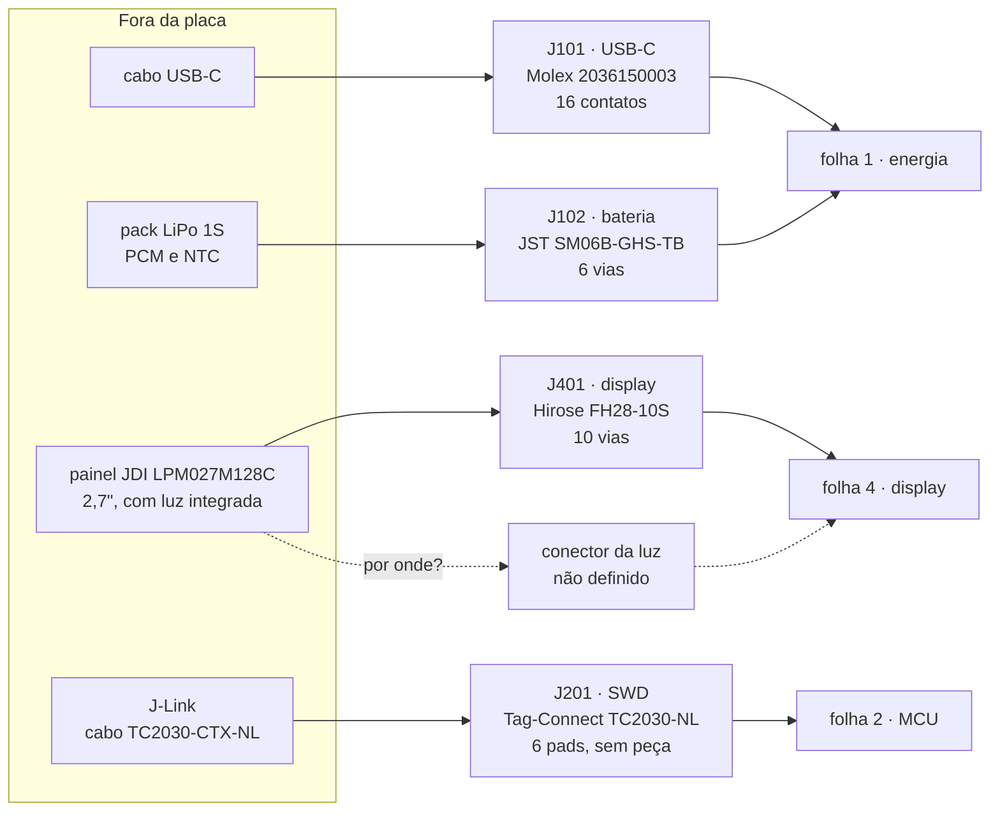
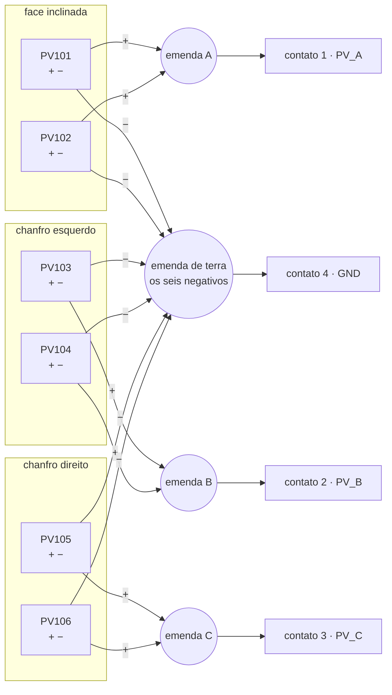
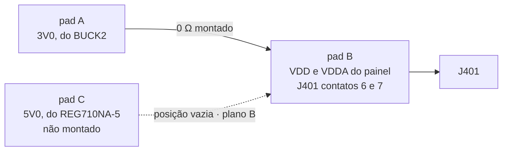
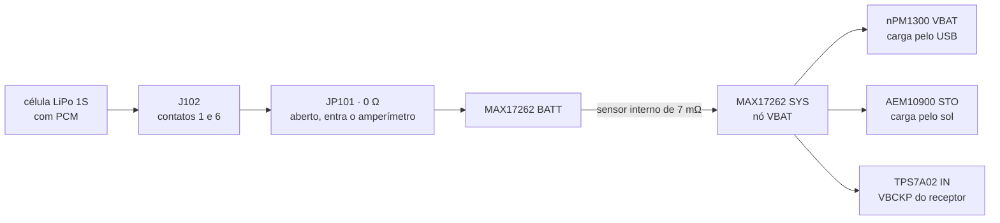

# Conectores e pontos de teste

Todo conector e todo ponto de teste da placa, **contato a contato**. As
[folhas do esquemático](01-esquematico.md) dizem quais sinais existem e a
[lista de nós](03-netlist.md) diz de onde cada um sai e aonde chega;
nenhuma das duas diz **em que contato** de cada conector o sinal entra. É
essa lacuna que este documento fecha, porque ela é a forma clássica de
inverter a polaridade da bateria na primeira montagem — e de descobrir
isso pelo cheiro.

**Nesta página:** [Como ler](#como-ler) · [De onde vem cada pinagem](#de-onde-vem-cada-pinagem) · [J101 · USB-C](#j101--usb-c) · [J102 · Bateria](#j102--bateria) · [J201 · Depuração SWD](#j201--depuração-swd) · [J401 · Display](#j401--display) · [A luz do LPM027M128C](#j402--luz-do-lpm027m128c) · [JP401 · Tensão do display](#jp401--tensão-do-display) · [JP101 · Jumper de medição de corrente](#jp101--jumper-de-medição-de-corrente) · [Pontos de teste](#pontos-de-teste) · [O que falta conferir](#o-que-falta-conferir)

> [!WARNING]
> **Nada disto foi montado, medido ou fabricado.** Não existe placa, não
> existe layout, nenhum conector foi encaixado e nenhum ponto de teste foi
> tocado por ponta de prova. Cada pinagem abaixo vem de uma norma, de uma
> ficha de fabricante ou de uma escolha feita aqui, e **está marcada como
> tal**. O que não foi encontrado em fonte nenhuma está dito como
> faltando, não preenchido por simetria.

## Como ler

- **Contato**: o número do contato como o desenho do fabricante o numera.
  Onde o fabricante usa nome em vez de número (o USB-C usa `A1`, `B5`), o
  nome é o do fabricante.
- **Direção**: do ponto de vista **da placa**. `entrada` é o que chega,
  `saída` é o que a placa aciona, `bidir` é linha compartilhada, `alim` é
  alimentação ou retorno.
- **Origem da pinagem**: cada seção diz, logo no começo, se a ordem dos
  contatos é **padrão da indústria**, veio da **ficha do fabricante** ou é
  **escolha deste projeto**. As três coisas têm graus de confiança
  diferentes e quem for fabricar a placa precisa saber qual é qual.
- Os designadores (`J101`, `JP401`, `TP203`) seguem o esquema por folha
  já usado em [05](05-materiais.md#como-ler): a centena é o número da
  folha do esquemático.



## De onde vem cada pinagem

| Conector | Origem da pinagem | Quem fecha o assunto |
|---|---|---|
| `J101` USB-C | **padrão da indústria**: USB Type-C, receptáculo de 16 contatos (USB 2.0) | a norma define os sinais; o desenho da Molex dá o número do pad no footprint |
| `J102` bateria | **escolha deste projeto** — não existe padrão para isto | o fabricante do pack, antes de fechar o pedido |
| `J201` depuração | **conferido em 2026-09-25** na ficha `TC2030-CTX_1.pdf` da Tag-Connect: 1 `VCC`, 2 `SWDIO`, 3 `nRESET`, 4 `SWCLK`, 5 `GND`, 6 `SWO`. O projeto tinha o reset no 6 e foi corrigido | ficha oficial da Tag-Connect |
| `J401` display | **ficha do fabricante**, e a mesma ordem nas duas telas | fichas JDI LPM027M128B Ver.01 e Sharp LS027B7DH01A (LD-28305A) |
| Conector da luz do JDI | **falta tudo**: não se sabe sequer se ele existe como conector separado ou se o C traz um FPC maior | ficha do **LPM027M128C**, ou uma amostra |
| `JP401` tensão do display | **escolha deste projeto** | este documento |
| `JP101` medição | **escolha deste projeto**, e peça que ainda não existe na lista | o dono |

## J101 · USB-C

**Molex 2036150003**, receptáculo IPX8, SMT, USB 2.0, **16 contatos**
([14](../docs/14-hardware-placa-nova.md#componentes-principais),
[15](../docs/15-avaliacao-componentes.md#usb-c-e-proteção)).

**A pinagem é padrão da indústria.** Ela não é escolha deste projeto nem
da Molex: é a norma do USB Type-C, e todo receptáculo a segue. Um
receptáculo USB 2.0 de 16 contatos é o de 24 contatos **sem os oito da
faixa de alta velocidade** (`A2`, `A3`, `A10`, `A11`, `B2`, `B3`, `B10` e
`B11`), que só existem para USB 3.x. Sobram estes:

| Contato | Sinal | Direção | Nota |
|---|---|---|---|
| `A1` | `GND` | alim | retorno |
| `A4` | `VBUS` | entrada | 4,0 a 5,5 V; ao `VBUS` do nPM1300, com o TVS **ESD761** junto do conector |
| `A5` | `CC1` | bidir | **direto** ao `CC1` do nPM1300, com o **TPD4E05U06**; o Rd de 5,1 kΩ é interno ao PMIC |
| `A6` | `D+` | bidir | unido ao `B6`; par de 90 Ω até o pad 8 do ME54BS13 |
| `A7` | `D−` | bidir | unido ao `B7`; par de 90 Ω até o pad 7 do ME54BS13 |
| `A8` | `SBU1` | — | **não usado**, deixado aberto |
| `A9` | `VBUS` | entrada | mesmo nó do `A4` |
| `A12` | `GND` | alim | retorno |
| `B1` | `GND` | alim | retorno |
| `B4` | `VBUS` | entrada | mesmo nó do `A4` |
| `B5` | `CC2` | bidir | **direto** ao `CC2` do nPM1300, com o TPD4E05U06 |
| `B6` | `D+` | bidir | unido ao `A6` |
| `B7` | `D−` | bidir | unido ao `A7` |
| `B8` | `SBU2` | — | **não usado**, deixado aberto |
| `B9` | `VBUS` | entrada | mesmo nó do `A4` |
| `B12` | `GND` | alim | retorno |
| carcaça | `SHIELD` | alim | ao `GND`, direto, junto com as abas de fixação |

**Os quatro `VBUS` são um nó só e os quatro `GND` também.** Isso não é
economia: é o que faz o cabo funcionar nas duas orientações, e é também o
que divide os até 1,5 A do `VBUS` ([02](02-calculos.md#corrente-por-trilho-e-largura-de-trilha))
por quatro contatos.

**Os dois `D+` são unidos na placa, e os dois `D−` também.** A norma manda
exatamente isso num receptáculo USB 2.0: como o cabo pode entrar de
qualquer lado, o par ativo cai ora na faixa A, ora na B, e o aparelho não
tem como saber qual é. Unir os dois resolve sem multiplexador.

**O `CC1` e o `CC2` vão ao nPM1300 sem nada no meio além do ESD.** O
resistor Rd de 5,1 kΩ que anuncia "sou um consumidor" é **interno** ao
PMIC ([14](../docs/14-hardware-placa-nova.md#ligações-fixas-dos-cis)).

> [!CAUTION]
> **Não acrescente Rd externo no `CC1` e no `CC2`.** É o erro quase
> automático de quem já projetou USB-C com outro CI: os 5,1 kΩ de fora em
> paralelo com os 5,1 kΩ de dentro dão cerca de 2,6 kΩ, que **não é Rd
> nem Ra** — cai no meio da faixa indefinida da norma. O resultado não é
> "carrega mais devagar", é a fonte podendo nunca ligar o `VBUS`, e um
> aparelho que não carrega sem que nada esteja queimado.

**O `SBU1` e o `SBU2` ficam abertos, e não no `GND`.** São as linhas de
banda lateral, que um acessório de áudio ou de vídeo aciona; aterradas,
seriam saída contra terra.

## J102 · Bateria

**JST SM06B-GHS-TB** na placa e **GHR-06V-S** no cabo, com terminais
SSHL-002T-P0.2. Série GH, passo de 1,25 mm, 6 vias, **1 A por contato**,
com trava positiva — que é a razão de a série GH ter substituído a SH
([14](../docs/14-hardware-placa-nova.md#componentes-principais),
[19](../docs/19-lista-de-compras.md#trocas)).

> [!IMPORTANT]
> **A pinagem abaixo é escolha deste projeto.** Não existe padrão de
> indústria para conector de bateria: cada fabricante de pack monta o cabo
> como o cliente pedir, e é o cliente que erra. A proposta abaixo é
> argumentada contato a contato justamente para poder ser discutida com o
> fabricante do pack antes de a placa ir para fabricação.

### O que o conector precisa levar

Quatro sinais, em seis vias:

- **`VBAT+`** e **`GND`**, o par de potência;
- **`NTC_BAT`**, o NTC do pack, que vai ao pino `NTC` do nPM1300 e serve
  ao perfil JEITA de 0, 10, 45 e 60 °C;
- **`TH_MON`**, um **segundo NTC**, que vai ao AEM10900 e corta a carga
  solar fora de 0 a 45 °C ([14](../docs/14-hardware-placa-nova.md#ligações-fixas-dos-cis),
  [15](../docs/15-avaliacao-componentes.md#bateria)).

### Proposta

| Contato | Sinal | Direção | Nota |
|---|---|---|---|
| 1 | `VBAT+` | alim, nos dois sentidos | com o contato 6; positivo da célula, **depois** do PCM do pack |
| 2 | `GND` | alim | com o contato 5; retorno do par 1–2 |
| 3 | `NTC_BAT` | entrada analógica | ao pino `NTC` do nPM1300; 10 kΩ, B3380, referenciado ao negativo da célula |
| 4 | `TH_MON` | entrada analógica | **via reservada e não populada** na montagem escolhida: o NTC do `TH_MON` é o `RT101`, na face de trás da placa ([05](05-materiais.md#folha-1--energia)). Montar os dois mata a carga solar |
| 5 | `GND` | alim | com o contato 2; retorno do par 5–6 |
| 6 | `VBAT+` | alim, nos dois sentidos | com o contato 1 |

### Por que assim

**`VBAT+` e `GND` em dois contatos cada, por causa dos 600 mA de carga.**
O pior caso do nó `VBAT` é a carga pelo USB, 600 mA
([02](02-calculos.md#corrente-por-trilho-e-largura-de-trilha)), e o
contato da série GH vale 1 A. Um contato só daria 1,67 vezes de folga, que
é pouco para uma peça que o usuário vai desconectar e reconectar. Dois dão
3,3 vezes. E há um segundo motivo, menos óbvio: a resistência de contato
fica **em série com a célula**, antes do pino `BATT` do MAX17262, de modo
que a queda sobre ela entra direto na tensão que o medidor usa para
estimar a carga. Dobrar os contatos corta essa queda pela metade.

**A ordem é um palíndromo, de propósito.** Lida ao contrário — que é
exatamente o que acontece quando o fabricante do pack numera o cabo pela
face oposta —, `VBAT+, GND, NTC, NTC, GND, VBAT+` continua sendo
`VBAT+, GND, NTC, NTC, GND, VBAT+`. Um cabo espelhado troca **só os dois
NTC entre si**, e os dois são a mesma peça, 10 kΩ com B3380, na mesma
célula: o nPM1300 passa a ler o NTC do AEM e vice-versa, e os dois
continuam funcionando. Com a ordem "natural"
(`VBAT+, VBAT+, GND, GND, NTC, NTC`), o mesmo cabo espelhado poria **4,2 V
no pino `NTC` do nPM1300 e no `TH_MON` do AEM10900**, e os dois CI
morreriam antes de alguém medir coisa alguma.

**Cada par de potência fica junto.** Os contatos 1–2 e 5–6 são dois pares
`VBAT+`/`GND` adjacentes: duas espiras de corrente estreitas em vez de uma
larga, o que importa porque essa é a única espira de 600 mA da placa.

**Os dois NTC têm de compartilhar o negativo da célula.** É isso que faz
os quatro sinais caberem em seis vias: um fio para cada termistor, com a
outra ponta no negativo do pack. Se o fabricante entregar um pack com os
termistores isolados, cada um passa a precisar de duas vias e **seis não
bastam** — aí o conector muda para oito vias e este documento junto.

> [!CAUTION]
> **O NTC do pack e o NTC de placa não podem conviver.** A [lista de
> compras](../docs/19-lista-de-compras.md#energia) aprovou um **TDK
> NTCG103JF103FT1 na face de trás da placa, sob a célula**, e a
> [avaliação](../docs/15-avaliacao-componentes.md#carga-usb-c-e-painel-solar)
> trata o segundo NTC do pack e o NTC de placa como alternativas — "vem do
> pack **ou** é um TDK". Montar os dois põe dois termistores de 10 kΩ em
> paralelo no `TH_MON`, isto é, 5 kΩ. **Conta feita aqui:** com B3380 e
> 10 kΩ a 25 °C, 5 kΩ correspondem a **44,4 °C**, e o limite superior do
> AEM10900 é 45 °C. O aparelho sairia da bancada com a carga solar
> desligada a qualquer temperatura ambiente acima de uns 25 °C, sem
> mensagem nenhuma, porque **nada disso passa por firmware**. Ou se monta
> o NTC de placa e as vias 4 do conector e do cabo ficam vazias, ou se usa
> o do pack e o footprint do TDK fica sem peça. **Escolher é decisão do
> dono.**

> [!NOTE]
> **O `VBAT+` que chega ao contato 1 já saiu do PCM do pack.** Quando a
> proteção abre por subtensão ou por curto, a placa vê a célula
> desaparecer, não vê a célula descarregada. É o comportamento correto — o
> nPM1300 não tem UVLO de bateria, e é justamente por isso que o PCM é
> obrigatório ([15](../docs/15-avaliacao-componentes.md#bateria)) —, mas
> muda o que se espera na bancada.

## J103 · Painel solar

**JST S4B-ZR-SM4A-TF** na placa e **ZHR-4** no cabo, com terminais
SZH-002T-P0.5. Série ZH, passo de 1,5 mm, 4 vias, SMD lateral, com trava.

> [!IMPORTANT]
> **Os seis módulos não são soldados na placa, e não há um conector por
> módulo.** Eles ficam nas paredes da caixa, virados para o sol — dois na
> face inclinada e dois em cada chanfro —, enquanto a placa fica dentro,
> atrás do display. Entre os dois há **um chicote**, e ele entra na placa
> por **um único conector de 4 vias**. Quem junta os módulos é o chicote,
> não a placa.

### Pinagem

| Contato | Sinal | O que chega nele |
|---|---|---|
| 1 | `PV_A` | o **positivo** dos dois módulos da **face inclinada** (`PV101`, `PV102`), já unidos no chicote |
| 2 | `PV_B` | o **positivo** dos dois módulos do **chanfro esquerdo** (`PV103`, `PV104`), já unidos |
| 3 | `PV_C` | o **positivo** dos dois módulos do **chanfro direito** (`PV105`, `PV106`), já unidos |
| 4 | `GND` | o **negativo dos seis**, todos unidos num fio só |

### Por que quatro vias e não doze

Os seis módulos ficam **em paralelo**, e isso não é escolha de arranjo: é
obrigação. Cada KXOB25-05X3F já tem 3 células em série e abre em **2,07 V**,
e o MPPT do colhedor rastreia de 0,12 a **2,73 V**. Dois módulos em série
dariam 4,14 V, 1,4 V acima do teto
([04](04-pcb-e-caixa.md#como-os-painéis-chegam-à-placa)).

Em paralelo, os seis negativos são **o mesmo nó elétrico**. Levar seis fios
de terra até a placa seria repetir o mesmo nó seis vezes: mais crimpagem,
mais conector, e um corpo de 6 vias que tem 13,5 mm e faria sombra no sensor
de luz ambiente, que pede o dobro da própria altura livre em volta.

Os positivos poderiam ser um só pela mesma lógica, mas são **três**, um por
face, de propósito: na placa cada um passa por um resistor de 0 Ω
(`R113`, `R114`, `R115`) antes de se juntarem. Abrindo um deles, mede-se
**uma face sozinha no sol**. Com um fio só, os seis dariam um número só e
nunca se saberia qual face está rendendo.

### Como montar o chicote

São **12 pontos de solda nos módulos** e **4 terminais crimpados** no
conector.



Passo a passo:

1. **Solde um par de fios em cada módulo**, no `+` e no `−` da serigrafia do
   verso. A ficha do KXOB25-05X3F **não numera os terminais**: ela só marca
   `+` e `−` no desenho do verso, e é essa marca que vale.
2. **Una os dois positivos de cada face** numa emenda, e leve um fio dessa
   emenda ao conector. São três emendas, uma por face.
3. **Una os seis negativos** numa emenda só, e leve um fio dela ao contato 4.
4. **Crimpe os quatro fios** nos terminais SZH-002T-P0.5 e encaixe na
   carcaça ZHR-4, na ordem da tabela acima.

**Fio:** a corrente máxima do arranjo inteiro é **110 mA**, e a de uma face
é 37 mA. O terminal SZH-002T-P0.5 aceita de **AWG 32 a 28**; AWG 28 é o que
usar, com folga de sobra em corrente e a flexibilidade que um fio dentro de
caixa precisa.

> [!WARNING]
> **Confira a polaridade com um multímetro antes de plugar, com os módulos
> no sol.** O conector certo já impede plugar a bateria aqui — a célula usa
> um **JST GH de 1,25 mm** e os dois não entram um no outro, de propósito
> ([J102](#j102--bateria)) —, mas **fio invertido no crimp é erro de
> bancada, não de projeto**. O `D105` na entrada é o grampo que existe para
> esse caso, e **a peça dele ainda não foi escolhida**: até escolher, a
> proteção é o multímetro.

> [!NOTE]
> **A ordem das quatro vias no chicote ainda não foi conferida contra um
> conector real.** A tabela acima é a ordem dos pinos do footprint; confirme
> o contato 1 na marca da carcaça antes de crimpar.

## J201 · Depuração SWD

**Footprint Tag-Connect TC2030-NL**: só furos e pads, **nenhuma peça
montada** ([05](05-materiais.md#folha-2--mcu)). O cabo é o
**TC2030-CTX-NL**, preso pelo **TC2030-CLIP**, e termina no conector
Cortex de 10 vias do J-Link ([14](../docs/14-hardware-placa-nova.md#teste-e-bring-up),
[19](../docs/19-lista-de-compras.md#placas-de-avaliação-e-ferramentas)).

A pinagem abaixo é a da ficha oficial **`TC2030-CTX_1.pdf`** da
Tag-Connect, tabela *Connections*, conferida em 2026-09-25.

| Contato | Sinal | Direção | Nota |
|---|---|---|---|
| 1 | `VCC` / `VTref` | saída | ao **`3V0`**; é o alvo informando à sonda em que tensão falar |
| 2 | `SWDIO` / `TMS` | bidir | pad **5** do ME54BS13 |
| 3 | **`nRESET`** | entrada | pad **4** do ME54BS13; a sonda puxa para baixo |
| 4 | `SWCLK` / `TCK` | entrada | pad **6** do ME54BS13 |
| 5 | `GND` | alim | também é o `GNDDetect` do lado da sonda |
| 6 | `SWO` / `TDO` | saída | **sem ligação hoje.** É trace do alvo para a sonda; levá-lo a um pad do módulo daria `printf` por ITM no bring-up, e falta descobrir qual pad do ME54BS13 expõe o `SWO` |

> [!WARNING]
> **Esta tabela mudou em 2026-09-25, e a versão anterior era um erro de
> placa.** Ela trazia `GND` no contato 3 e `nRESET` no 6 — o arranjo
> `1 VCC, 2 SWDIO, 3 GND, 4 SWCLK, 5 GND, 6 SWO` é a numeração do
> **cabeçalho Cortex de 10 vias, do lado da sonda**, e não a do footprint
> de 6 pinos da placa. Quem mistura as duas chega exatamente ao que estava
> escrito aqui.
>
> Fabricada assim, a placa amarraria o `nRESET` dreno aberto da sonda ao
> **terra em cobre** e o alvo ficaria **travado em reset para sempre**. A
> versão do `parts.py`, que punha o reset no contato 6, era menos grave e
> ainda assim fatal para a depuração: o `nRESET` da sonda não acionaria
> nada e o reset do micro ficaria pendurado numa **entrada** da sonda —
> nada queima, e o depurador nunca reseta o alvo. Num nRF54LM20A que
> reinicia pelo `task_wdt` ou reconfigura os pinos de SWD, isso tira a
> saída de emergência e sobra só o apagamento total por CTRL-AP.
>
> O aviso que estava aqui previa exatamente esta variante. Era ela.

**Sem o `VTref` a maioria das sondas recusa conectar.** Elas o usam para
descobrir a tensão de I/O e, em muitos modelos, como prova de que existe
um alvo alimentado do outro lado. Ele custa um contato e evita uma tarde
de depuração.

> [!IMPORTANT]
> **O `VTref` está no `3V0`, que sai do BUCK2 — e o BUCK2 está desligado
> em ship mode.** Consequência prática para o bring-up: com a placa
> desligada, a sonda não enxerga alvo nenhum. Antes de encostar o clipe é
> preciso acordar o aparelho (tecla central no `SHPHLD`, ou cabo USB). Não
> é defeito; é o que acontece quando se referencia o `VTref` a um trilho
> comutado em vez do `VSYS`, e a alternativa teria o custo de expor a
> sonda a 5,5 V com cabo ligado.

**O footprint pede espaço.** O TC2030-NL não tem pernas de retenção, o que
é o motivo de existir o clipe: a placa precisa da área livre em volta dos
pads e dos três furos de alinhamento, nos dois lados, para o clipe
encaixar ([04](04-pcb-e-caixa.md#posicionamento)).

## J401 · Display

**Hirose FH28-10S-0.5SH(05)**, 10 vias, passo de 0,5 mm, contato por
baixo. O mesmo conector aparece nas fichas das duas telas.

**A ordem dos dez pinos é a mesma nas fichas da Sharp e da JDI**, e está
registrada em [15](../docs/15-avaliacao-componentes.md#display): `SCLK`,
`SI`, `SCS`, `EXTCOMIN`, `DISP`, `VDDA`, `VDD`, `EXTMODE`, `VSS`, `VSSA`.
**É ficha de fabricante, não escolha deste projeto** — e é ela que permite
um conector só para duas telas.

**Repare no que não está nesses dez:** não há par para o LED da luz. Na
Sharp isso não incomodava, porque a luz era um filme separado com cauda
própria; com o **JDI LPM027M128C**, decidido em 2026-09-23, a luz é do
painel e **por onde ela se liga é pendência aberta**
([abaixo](#j402--luz-do-lpm027m128c)).

| Contato | Sinal | Direção | Nota |
|---|---|---|---|
| 1 | `SCLK` | saída | `DISP_SCK`, P3.03, `spi22`; 1 MHz típico, 2 MHz máximo |
| 2 | `SI` | saída | `DISP_MOSI`, P3.00 |
| 3 | `SCS` | saída | `DISP_CS`, P3.02, **ativo alto**; pull-down de 100 kΩ ao `GND` |
| 4 | `EXTCOMIN` | saída | `DISP_EXTCOMIN`, P3.06; 1 Hz sem luz, cerca de 120 Hz com luz |
| 5 | `DISP` | saída | `DISP_ON`, P3.05; liga a matriz; pull-down de 100 kΩ |
| 6 | `VDDA` | alim | do **`JP401`**, que com o JDI é um 0 Ω fixo no `3V0`; `5V0` só no plano B, com a Sharp |
| 7 | `VDD` | alim | do **`JP401`**, mesmo trilho do contato 6 |
| 8 | `EXTMODE` | alim | **ao contato 7 em cobre**, seja qual for a tensão: é isso que põe a inversão do VCOM no `EXTCOMIN` |
| 9 | `VSS` | alim | `GND` |
| 10 | `VSSA` | alim | `GND` |

**Os contatos 6 e 7 são a razão de o `JP401` existir.** Os dois recebem o
mesmo trilho, e qual trilho é isso decide se a tela vive ou morre: o JDI
tem máximo absoluto de 3,6 V.

**O `EXTMODE` no contato 8 vai ao contato 7, não ao `GND`.** Com ele alto,
o VCOM inverte nas bordas do `EXTCOMIN`; com ele baixo, a inversão teria
de sair por comando de SPI, que é o que a V3 faz
([01](01-esquematico.md#folha-4--display)).

> [!CAUTION]
> **Qual face da FPC tem os contatos decide se o pino 1 do painel encontra
> o contato 1 ou o 10.** O FH28-10S-0.5SH(05) tem contato **por baixo**; se
> a cauda do painel for dobrada na montagem, ou se a amostra vier com o
> cobre para o outro lado, o conector inteiro fica espelhado e o `SCLK`
> encosta no `VSSA`. A [avaliação](../docs/15-avaliacao-componentes.md#bancada-antes-do-layout)
> já lista "lado do contato do FPC" como item de bancada, e ele **também é
> item de layout**: é a orientação do conector na placa que resolve, não o
> firmware.

## J402 · Luz do LPM027M128C

**Ficha do fabricante, achada em 2026-09-23.** A JDI tirou as fichas de MIP
do ar (os dois PDF dela respondem 404), mas a Switch Science, que vendia o
módulo, publica as especificações citando a ficha `3LPM027M128C
specification ver.02`:

| Especificação | Valor |
|---|---|
| Interface do display | **FPC de 10 vias, passo 0,5 mm**, compatível com conector ZIF |
| **Interface da luz** | **FPC de 5 vias, passo 0,5 mm**, compatível com conector ZIF |
| Alimentação | 3,0 V |
| **Tensão direta da luz** | **2,67 V** (típica) |
| **Corrente da luz** | **16 mA**, com VDD = VDDA = VIH = 3,0 V |
| Consumo do painel | 5 µW parado · 30 µW a 1 quadro/s · 180 µW a 10 quadros/s |

**É esta a peça que faltava.** A luz do C **não** passa pelo FPC de 10
vias, como se suspeitava: ela tem **um conector próprio, de cinco vias e
passo de 0,5 mm**. O `J402`, que antes existia para o filme da Sharp, passa
a ser o conector da luz do painel — com cinco vias em vez das quatro do
Molex 5034800440.

### O que isso confirma

Os **39 Ω** do `R_BL` que [02](02-calculos.md#luz-do-display) calculou
**estão certos**, e agora com número de ficha e não de hipótese:

```
R = (3,3 − 2,67 − 0,05) / 16 mA = 36,2 Ω  →  39 Ω
com 39 Ω: 14,9 mA, 93 % do nominal
```

E confirma o trilho: a luz é alimentada do **`3V3BL`**, os 3,3 V da
`LDSW2`, e não do `3V0`. Com 3,0 V o resistor cairia para **17,5 Ω** e a
corrente ficaria refém da tolerância da tensão direta — os 300 mV a mais do
`3V3BL` é que dão margem.

### Como se aciona

Um sinal só, com PWM. É o que o
[`pizero_bikecomputer`](https://github.com/hishizuka/pizero_bikecomputer),
um ciclocomputador que usa exatamente este painel, faz: um GPIO com PWM por
hardware a 64 Hz. Na nossa placa é o `BL_PWM` (P3.08) na porta do `Q401`
([03](03-netlist.md#display--spi22-e-pwm20)).

### O que ainda falta

| Em aberto | Por quê |
|---|---|
| **Qual das cinco vias é anodo, qual é catodo e quais não se usam** | os dois PDF da JDI estão 404 e o arquivo histórico está bloqueado; sai da ficha ou de uma amostra |
| **O conector de 5 vias, peça** | o `J402` de hoje é um Molex 5034800440 de **4** vias, do filme da Sharp: não serve. Precisa de um FPC de 5 vias, passo 0,5 mm, tipo ZIF |

> [!NOTE]
> Uma placa de referência para o **LPM027M128B** com luz
> ([`Gbertaz/JDI_MIP_Display`](https://github.com/Gbertaz/JDI_MIP_Display),
> com esquemático, BOM e Gerber públicos) usa um FPC de **4** vias, o
> MINTRON XW05200-04, e um transistor digital com resistor em série. O
> autor registra que os 820 Ω dele deixaram a luz fraca e que trocou por
> 27 Ω — o que é coerente com ele alimentar a luz de 3,3 V **sem** o
> `V_DS` e a margem que a nossa conta tem, e com o painel dele não ser o C.
> Serve de referência de topologia, **não de pinagem**.

### No plano B, o filme e o conector de 4 vias

## JP401 · Tensão do display

**Escolha deste projeto.** Um jumper de 0 Ω (Panasonic ERJ-2GE0R00X) que
liga os contatos 6 e 7 do `J401` ao `3V0` **ou** ao `5V0`. Com o JDI
decidido, **só a posição do `3V0` é montada** e a do `5V0` fica vazia.



**São três pads em linha, com o do meio ligado ao display.** O resistor de
0 Ω ocupa A–B ou B–C, e **não existe montagem em que ocupe os dois**: o
pad do meio é um só. A serigrafia diz `3V0 · JDI` de um lado e
`5V0 · SHARP` do outro.

**Por que manter o footprint do jumper, agora que há uma tela só.** Ele
custa um resistor de 0 Ω e um pad, e é o que faz o plano B ser uma troca de
montagem: o JDI **não tem canal autorizado de compra** e vem de revendedor
sem garantia, de modo que a chance de a Sharp precisar entrar não é
teórica. Apagar o jumper e ligar o `3V0` ao painel em cobre seria mais
seguro contra erro de montagem — e transformaria o plano B em corte de
trilha. **A posição do 5 V fica não montada, não apagada.**

> [!CAUTION]
> **Por que não duas posições independentes de 0 Ω.** É o arranjo que
> parece mais simples e é o perigoso: dois footprints separados, um do
> `3V0` ao display e outro do `5V0` ao display, deixam a montagem com
> **quatro** estados em vez de dois — nenhum resistor, só o do `3V0`, só o
> do `5V0`, e **os dois**. Os dois primeiros são benignos ou corretos, o
> terceiro é correto com a Sharp, e o quarto destrói a placa: o painel
> recebe 5 V — e o **máximo absoluto do JDI é 3,6 V**, de modo que ele
> queima na primeira energização —, e ainda por cima o `5V0` do REG710
> fica em curto com a saída do BUCK2, empurrando corrente para dentro de
> um conversor que não a aceita. A posição única **apaga esse quarto
> estado do mapa**: não é que ele fique improvável, é que deixa de ter
> como acontecer. É a única forma de proteção que não depende de alguém
> prestar atenção. O que ela **não** resolve, e nenhum jumper resolveria,
> é montar o 0 Ω na posição do `5V0` com um painel JDI no `J401`: contra
> isso só a serigrafia e o procedimento de montagem.

## JP101 · Jumper de medição de corrente

**Escolha deste projeto**: o `JP101` nasceu aqui e entrou na
[lista de nós](03-netlist.md#nós-sem-ligação-ao-mcu) e na
[lista de materiais](05-materiais.md#folha-1--energia) na mesma rodada de
2026-09-23. O valor de 0 Ω da lista de compras (`ERJ-2GE0R00X`, 0402)
**não serve**: ver os requisitos abaixo.

**O que ele é:** um resistor de 0 Ω em série no caminho da célula, entre o
`VBAT+` do `J102` e o pino `BATT` do MAX17262. Tirado o resistor, os dois
pads viram os terminais do amperímetro.



As setas mostram o caminho, não o sentido da corrente: ela vai nos dois
sentidos, e é esse o ponto.

**Por que ele vale a peça.** Numa placa que nunca foi montada, subir sem
poder medir a corrente é caro. Tudo o que a célula entrega ou recebe passa
por esse ponto — a carga pelo USB, a carga pelo sol, o consumo do sistema
e o ship mode —, e é o mesmo caminho que o MAX17262 mede, de modo que o
jumper também é como se confere o medidor contra um instrumento, que a
[avaliação](../docs/15-avaliacao-componentes.md#bancada-antes-do-layout)
já lista como trabalho de bancada. Sem ele, medir os 370 nA de ship mode
exige dessoldar o fio da bateria.

**Especificação proposta:** footprint **1206**, 0 Ω, corrente de pelo
menos **2 A**, com a **menor resistência de jumper disponível**. O motivo
do tamanho é a queda: o `JP101` fica antes do pino `BATT`, ou seja,
**dentro** da tensão que o medidor usa. Um jumper de 50 mΩ com os 600 mA
da carga produz 30 mV de erro; um de 20 mΩ produz 12 mV. O `ERJ-2GE0R00X`
0402 que o `JP401` usa vale 1 A e **não serve aqui**.

> [!NOTE]
> **Duas armadilhas de bancada, que fazem a medição falhar sem que a placa
> tenha nada.** A primeira: um multímetro na faixa de corrente tem
> resistência de carga própria, que na faixa de microampères chega a
> volts — o aparelho reinicia ao primeiro pico de rádio ou de tela. O
> remédio é um capacitor grande, de 100 µF ou mais, em paralelo com as
> pontas do instrumento. A segunda: quase todo multímetro **abre o
> circuito ao trocar de faixa**, o que desliga o aparelho no meio da
> medida. Medir consumo em repouso pede instrumento feito para isso, ou
> muita paciência.

> [!CAUTION]
> **Com o `JP101` aberto e o cabo USB ligado, o aparelho funciona e o
> medidor mente.** O nPM1300 continua alimentando tudo pelo `VBUS`, mas o
> pino `BATT` do MAX17262 fica no ar e o `STO` do AEM10900 tenta carregar
> uma célula que não está lá. Qualquer leitura de carga nesse estado é
> lixo. Medir sempre com a célula ligada **através** do amperímetro, nunca
> com o caminho aberto.

## Pontos de teste

**O esquema de numeração é `TP<folha><nn>`**, a mesma centena dos
designadores da folha: `TP1xx` na folha 1 (energia), `TP2xx` na folha 2
(MCU e console), `TP4xx` na folha 4 (display). Bate com o que
[05](05-materiais.md#folha-2--mcu) já usa (`TP201` e `TP202`).

### Folha 1 · Energia

| Ponto | Sinal | O que se vê ali | Nota |
|---|---|---|---|
| `TP101` | `VBUS` | o que a fonte USB entrega | depois do TVS, junto do conector |
| `TP102` | `VBUSOUT` | saída do nPM1300 | alimenta o `VBUS` do módulo e o divisor do `DIS_STO_CH` |
| `TP103` | `VBAT` | lado `SYS` do medidor | 3,0 a 4,2 V |
| `TP104` | `VSYS` | saída do power path | **chega a 5,5 V com cabo**; é a referência do LED RGB |
| `TP105` | `3V0` | BUCK2, o trilho do MCU | sem ele o aparelho não liga |
| `TP106` | `1V8` | BUCK1 | **máximo absoluto de 1,98 V** no `V_IO` do receptor |
| `TP107` | `SD3V0` | `LDSW1` | a flash; desligado, deve estar em 0 V de verdade |
| `TP108` | `3V3BL` | `LDSW2` | a luz; sai de regulação com o `VSYS` perto de 3,4 V |
| `TP109` | `VBCKP` | TPS7A02 | **deve continuar de pé com o aparelho desligado** |
| `TP110` | `VINT` | interno do AEM10900 | é a referência dos pinos de configuração; ponto de leitura, **não** de alimentação |
| `TP111` | `ST_STO` | estado do colhedor | [lista de nós](03-netlist.md#nós-sem-ligação-ao-mcu) |
| `TP112` | `GND` | referência do bloco de energia | via própria ao plano |

### Folha 2 · MCU e console

| Ponto | Sinal | O que se vê ali | Nota |
|---|---|---|---|
| `TP201` | `CON_TX` | console, P1.00, `uart20` | 115200 baud ([03](03-netlist.md#console--uart20)) |
| `TP202` | `CON_RX` | console, P1.31 | [03](03-netlist.md#console--uart20) |
| `TP203` | `GND` | **terra do console** | ao lado dos dois |

**O `TP203` não é enfeite.** Um conversor USB-serial precisa de três
fios, e sem terra comum entre o conversor e a placa o console não
funciona — ou, pior, funciona mal o bastante para parecer defeito de
firmware. Ele fica **junto** do `TP201` e do `TP202`, não do outro lado da
placa, porque o que importa é a distância do laço.

### Folha 4 · Display

| Ponto | Sinal | O que se vê ali | Nota |
|---|---|---|---|
| `TP401` | `5V0` | saída do REG710NA-5 | **sem sinal na placa montada**: o REG710 não é montado com o JDI. O ponto existe para o plano B, e é o trilho que jamais pode chegar a um painel JDI |

### Como os pads são

Escolha deste projeto, para o layout:

- Pad redondo de cerca de 1,0 mm, sem máscara, na face de cima, onde um
  clipe de mola encosta.
- Cada ponto de trilho fica **na ponta do trilho, junto da maior carga**,
  e não ao lado do regulador: um pad colado no conversor esconde
  exatamente a queda que interessa medir.
- Os dois `GND` (`TP112` e `TP203`) com via própria ao plano, curta.

## O que falta conferir

Honesto, item a item:

| Em aberto | Por quê | Quem resolve |
|---|---|---|
| **`J101`: nome do contato contra o número do pad** | a pinagem acima é a norma do USB-C, que não muda; o que muda de fabricante para fabricante é a numeração do footprint. O desenho da Molex **não foi lido nesta sessão** | desenho do 2036150003 rev. A |
| **`J101`: quais oito contatos a Molex omite** | [15](../docs/15-avaliacao-componentes.md#usb-c-e-proteção) diz "16 pinos"; que os ausentes sejam `A2`, `A3`, `A10`, `A11`, `B2`, `B3`, `B10` e `B11` é **dedução da norma**, não leitura do desenho | o mesmo desenho |
| **`J101`: carcaça direto ao `GND` ou por RC** | aqui vai direto, que é o comum num aparelho a bateria e sem terra; há projetos que põem um RC | decisão de layout |
| **`J102`: a pinagem inteira** | é proposta deste documento, e o fabricante do pack é quem monta o cabo. **Conferir antes de fechar o pedido** ([19](../docs/19-lista-de-compras.md#antes-de-fechar-o-pedido)) | fabricante do pack |
| **`J102`: os dois NTC referenciados ao negativo da célula** | é o que faz quatro sinais caberem em seis vias; com termistores isolados o conector muda para oito | especificação do pack |
| **`J102`: NTC do pack ou NTC de placa** | os dois juntos dão 5 kΩ, que o AEM10900 lê como 44,4 °C contra um limite de 45 °C, e a carga solar morre | decisão do dono |
| **`J102`: entrada lateral ou superior** | pela nomenclatura da JST o prefixo `SM` é de entrada lateral e `BM`, de topo; o desenho **não foi lido aqui** e é ele que decide para que lado o cabo sai | catálogo GH da JST |
| **`TH_MON`: ordem do divisor** | [14](../docs/14-hardware-placa-nova.md#ligações-fixas-dos-cis) registra "`RDIV` de 22 kΩ" e o NTC, mas não diz qual perna fica no `TH_REF` e qual no `GND`. Trocar inverte o sentido da leitura de temperatura | ficha do AEM10900 |
| **`J201`: a que pad do ME54BS13 levar o `SWO`** | o contato 6 do TC2030 é o `SWO` e hoje está sem ligação. Levá-lo a um pad de trace daria `printf` por ITM no bring-up, e qual pad do módulo expõe o `SWO` não está na ficha dele | ficha do ME54BS13 |
| **Por onde a luz do LPM027M128C se liga** | **alta prioridade, e bloqueia o layout**: o FPC de 10 vias não tem par de LED, e nenhum documento do projeto diz se o C traz um FPC maior ou um rabicho próprio. A ficha lida é a do **B**, que não tem luz ([acima](#j402--luz-do-lpm027m128c)) | ficha do **LPM027M128C**, ou uma amostra |
| **`J401`: de que lado a FPC do painel tem os contatos** | decide se o pino 1 do painel encontra o contato 1 ou o 10 | amostra, e [15](../docs/15-avaliacao-componentes.md#bancada-antes-do-layout) |
| **`J402`: o que recebe cada uma das quatro vias** | só importa no plano B; **não está em arquivo nenhum do projeto** | desenho 12369-01_T4 da Azumo |
| **`R401` com o filme** | só no plano B: depende da tensão direta da amostra; 25 mA é o máximo do LED. Com o JDI são 39 Ω, fechados | medida na amostra |
| **`JP101`: existir ou não** | é uma junta a mais no caminho da célula, que é o caminho mais crítico da placa; ganha-se medição, perde-se um ponto de falha | decisão do dono |
| **`JP101` e os pontos de teste novos** | o `JP101` e os pontos de teste entraram em [03](03-netlist.md) e em [05](05-materiais.md) na mesma rodada, que estão sendo editados em paralelo | próxima passagem nesses dois |
| **`TP1`, `TP2` e `TP3`** | [03](03-netlist.md) e [04](04-pcb-e-caixa.md) ainda usam a numeração antiga; aqui eles são `TP201`, `TP202` e `TP111`, que é o esquema de [05](05-materiais.md) | próxima passagem nesses dois |
