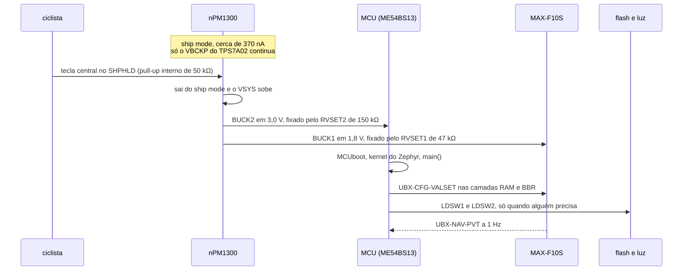
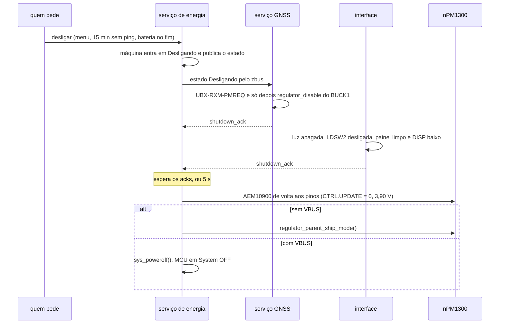
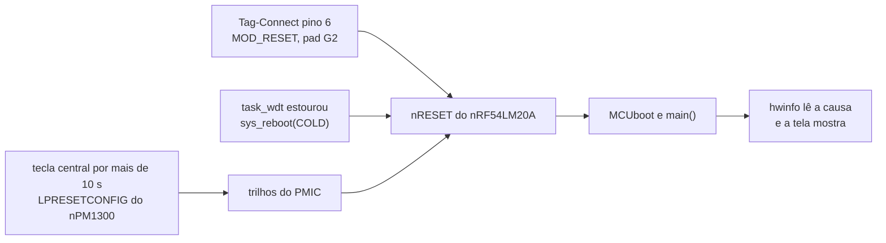

# Sequências e proteção

Duas coisas que o esquemático ainda não tinha: **em que ordem os trilhos
sobem e descem**, e **o que protege cada coisa que sai da caixa**. A
primeira é sequência, não desenho: nenhuma folha de
[esquemático](01-esquematico.md) mostra tempo. A segunda é o que fica
entre o dedo do ciclista, o cabo do carregador e o silício.

**Nesta página:** [Sequência de partida](#sequência-de-partida) · [Sequência de desligamento](#sequência-de-desligamento) · [Reset e queda de tensão](#reset-e-queda-de-tensão) · [Proteção do que sai da caixa](#proteção-do-que-sai-da-caixa) · [O que só a bancada decide](#o-que-só-a-bancada-decide)

> [!WARNING]
> **Nada disto rodou em hardware.** Não existe placa, não existe protótipo,
> nenhuma destas sequências foi observada num osciloscópio. O que vem do
> firmware está conferido **no código**, com arquivo e linha; o que vem de
> ficha técnica está marcado como **ficha**; o resto é conta feita aqui.

## Sequência de partida

### O caminho, do dedo ao primeiro fix

### O que o hardware faz sozinho

O aparelho sai do ship mode **sem firmware nenhum**. A tecla central vai ao
`SHPHLD` do nPM1300, que tem pull-up interno de 50 kΩ
([03](03-netlist.md#nós-sem-ligação-ao-mcu)); puxá-la ao terra tira o PMIC
do ship mode e o `VSYS` sobe. Daí saem, pelos resistores `VSET` e não por
registrador:

| Trilho | Resistor | Tensão | O que depende dele |
|---|---|---|---|
| `3V0` (BUCK2) | `RVSET2`, 150 kΩ | 3,0 V | **o MCU**: sem este trilho o aparelho não liga |
| `1V8` (BUCK1) | `RVSET1`, 47 kΩ | 1,8 V | `VCC` e `V_IO` do MAX-F10S, lado B do TXU0204 |

> [!CAUTION]
> **Nenhum `VSET` pode ficar aberto** (ficha do nPM1300), e é o BUCK2 que
> alimenta o MCU. Um `RVSET2` errado, ausente ou mal soldado é um aparelho
> que não liga, e **nenhum firmware conserta um resistor**. A tabela do
> VSET1 nem tem 3,0 V — a do VSET2 tem, e foi por isso que o trilho do MCU
> foi para o BUCK2 ([02](02-calculos.md#conversores-do-npm1300)).

### O que o firmware faz depois

Conferido no código, não suposto:

| Passo | Onde está | O que faz |
|---|---|---|
| Alimenta o WDT que sobreviveu a um reset por software | [`src/app/main.c:29`](../zephyr_app/src/app/main.c) | `app_wdt_feed_if_running()` antes de qualquer coisa |
| Lê a causa do reset e o registro de falha | [`src/app/main.c:32`](../zephyr_app/src/app/main.c), `model/crash_recovery.c` | vira notificação na tela |
| Sobe os serviços em ordem | [`src/app/main.c:48-57`](../zephyr_app/src/app/main.c) | armazenamento, USB, energia, sensores, GNSS, rádio, modelo, interface |
| Liga e configura o receptor | [`modules/gnss_drivers/drivers/gnss/gnss_ublox_m10.c:836`](../zephyr_app/modules/gnss_drivers/drivers/gnss/gnss_ublox_m10.c) | `regulator_enable(cfg->vcc)` na inicialização do driver, e depois `UBX-CFG-VALSET` |
| Sobe o limiar do AEM10900 | [`modules/gnss_drivers/drivers/charger/aem10900.c:333`](../zephyr_app/modules/gnss_drivers/drivers/charger/aem10900.c) | de 3,90 V (pinos) para os 4.050 mV do devicetree |
| Avisa a máquina que a partida acabou | [`src/app/main.c:59`](../zephyr_app/src/app/main.c) | `power_svc_ready()` leva a máquina de Partida para Ligado ([`sys_fsm.c:73`](../zephyr_app/src/svc/power/sys_fsm.c)) |

O `1V8` **não espera o firmware pedir**: o nó `BUCK1` do devicetree tem
`regulator-boot-on`
([`gnssbike_nrf54lm20a_cpuapp.dts:360`](../zephyr_app/boards/gnss/gnssbike/gnssbike_nrf54lm20a_cpuapp.dts)),
e o `BUCK2`, `regulator-always-on` (linha 367). Os dois sobem na
inicialização dos dispositivos do Zephyr, antes do `main()`.

> [!NOTE]
> **Se o nPM1300 já liga os dois bucks sozinho ao sair do ship mode, eles
> sobem antes ainda**, e o devicetree só confirma o estado. Qual é o
> comportamento de fábrica do `BUCKxEN` é pergunta para a ficha do nPM1300,
> **que não foi lida nesta rodada**. A sequência não muda de forma: muda
> quem a comanda.

### As três restrições de partida

São condições que o desenho tem de cumprir, não coisas que o firmware
resolve depois.

**1 · A rampa do `V_IO` do receptor.** O `V_IO` do MAX-F10S aceita rampa
entre **25 e 35.000 µs/V** (máximo absoluto, tabela 12 da **ficha**;
[`docs/14`](../docs/14-hardware-placa-nova.md#gnss)). Fora dessa faixa a
ficha diz que o módulo pode ser danificado. A conta de
[02](02-calculos.md#rampa-do-v_io-na-partida) mostra que uma partida do
BUCK1 entre 0,5 e 5 ms dá de **278 a 2.778 µs/V**, **dentro da faixa**, com
folga nas duas pontas. E a partida real do nPM1300 **está na ficha**: cerca de
**1,2 ms**, perto de **360 µs/V**
([15](../docs/15-avaliacao-componentes.md#gnss)), bem dentro da faixa.

> [!IMPORTANT]
> Esta restrição **não vale só na partida a frio**. O driver desliga o
> trilho no standby ([`gnss_ublox_m10.c:722`](../zephyr_app/modules/gnss_drivers/drivers/gnss/gnss_ublox_m10.c))
> e o religa ao acordar (linha 739), de modo que a rampa se repete **a cada
> volta de dentro de casa para a rua**. Um aparelho que alterne CRS e FEC
> num pedal de rolo faz isso dezenas de vezes.

**2 · O `V_IO` nunca pode ficar acima do `VCC`.** É regra da
[ficha](../docs/14-hardware-placa-nova.md#gnss): "`V_IO` nunca acima do
`VCC`". **Nesta placa o problema não existe**, e vale dizer por quê em vez
de deixar implícito: os dois saem do **mesmo BUCK1**, são o mesmo nó `1V8`
([03](03-netlist.md#nós-de-alimentação)), sobem juntos e descem juntos, e
não há ordem possível entre eles.

> [!CAUTION]
> **Isto quebra na primeira revisão que separar os trilhos.** Alguém que
> ponha o `VCC` em 3,0 V para ganhar sensibilidade e deixe o `V_IO` em
> 1,8 V, ou que alimente o `V_IO` de um LDO próprio, passa a ter duas
> rampas e **precisa garantir a ordem**. Com o `VIO_SEL` no GND o `V_IO`
> tem máximo absoluto de **1,98 V**, de modo que o erro inverso — `V_IO`
> antes ou acima do `VCC` — não avisa: queima.

**3 · O `CSB` do BMP585 alto na partida.** O barômetro escolhe I²C ou SPI
**no instante em que a alimentação sobe**, e com o `CSB` baixo nesse
instante o I²C fica desligado **até o próximo corte de energia**
([`docs/14`](../docs/14-hardware-placa-nova.md#ligações-fixas-dos-cis)).
Por isso o `CSB` vai ao `VDDIO` em cobre, junto do `SDO`
([03](03-netlist.md#pinos-de-configuração-amarrados-em-cobre)), e **não**
por pino do MCU: um GPIO sai do reset em alta impedância, e "alta
impedância" não é "alto".

## Sequência de desligamento

### O que o código faz, na ordem

| Ordem | O que | Onde, conferido |
|---|---|---|
| 1 | A máquina vai para `S_SHUTDOWN` e publica `APP_SYS_SHUTDOWN` | [`sys_fsm.c:143-150`](../zephyr_app/src/svc/power/sys_fsm.c) |
| 2 | O serviço GNSS vê o estado, manda **`UBX-RXM-PMREQ`** e só então corta o trilho | [`gnss_svc.c:330-340`](../zephyr_app/src/svc/gnss/gnss_svc.c) chama `ublox_m10_standby()`, que monta e envia o quadro em [`gnss_ublox_m10.c:708-714`](../zephyr_app/modules/gnss_drivers/drivers/gnss/gnss_ublox_m10.c) e **depois** faz `regulator_disable` na linha 722 |
| 3 | A interface apaga a luz (o que desliga a `LDSW2`), limpa o painel e baixa o `DISP` | [`ui_svc.c:356-380`](../zephyr_app/src/svc/ui/ui_svc.c), com `regulator_disable(light_supply)` na linha 273 |
| 4 | A máquina espera todos os acks, ou desiste em **5 s** | [`sys_fsm.c:152-167`](../zephyr_app/src/svc/power/sys_fsm.c), `SYS_SHUTDOWN_TIMEOUT_MS` |
| 5 | O AEM10900 volta aos pinos **antes** de cortar a energia | [`power_svc.c:201`](../zephyr_app/src/svc/power/power_svc.c) chama `solar_to_pins()`, que escreve `CTRL = 0` em [`aem10900.c:119`](../zephyr_app/modules/gnss_drivers/drivers/charger/aem10900.c) |
| 6 | Sem `VBUS`, ship mode; com `VBUS`, System OFF | [`power_svc.c:203-221`](../zephyr_app/src/svc/power/power_svc.c) |

### Por que o AEM10900 volta aos pinos

Com o `KEEP_ALIVE` no `VINT`, **a configuração por I²C sobrevive ao `3V0`
desligado** ([`docs/15`](../docs/15-avaliacao-componentes.md#carga-usb-c-e-painel-solar)).
Isso é bom enquanto a placa roda e ruim quando ela desliga: o limiar que o
firmware subiu para **4.050 mV** ficaria valendo no aparelho parado, e o
painel carregaria a célula a 4,05 V ao sol o dia inteiro, que é
exatamente o que o perfil de vida longa existe para evitar. Por isso o
`power_off()` devolve o controle aos pinos — `CTRL.UPDATE` = 0, limiar de
carga de **3,90 V** e corte de descarga de **3,01 V**
([03](03-netlist.md#pinos-de-configuração-amarrados-em-cobre)).

> [!NOTE]
> Enquanto a placa roda, o corte de descarga também é o valor de I²C:
> **3.040 mV**, o degrau de 56,25 mV mais próximo dos 3,01 V dos pinos
> (padrão do binding `e-peas,aem10900`). A diferença de 30 mV não muda
> nada de prático, mas explica por que uma medida na bancada pode não dar
> 3,01 V redondos.

### O que continua ligado depois

| Continua | Consumo | Por quê |
|---|---|---|
| `VBCKP`, do TPS7A02 direto da célula | 25 nA do LDO mais **28 µA** do backup do F10S (**ficha**, a 3,3 V) | efemérides e relógio do receptor, para a próxima partida ser quente |
| MAX17262 em hibernação | 5,2 µA | continua contando a corrente líquida, inclusive a do painel |
| nPM1300 em ship mode | 370 nA | espera o `SHPHLD` ou o `VBUS` |
| AEM10900 | cerca de 0,2 µA | **continua carregando com sol**, sozinho, até 3,90 V |

Total de cerca de **34 µA** ([`docs/14`](../docs/14-hardware-placa-nova.md#estados-de-energia)).

### O toque longo de 10 s

Segurar a tecla central por mais de **10 s** religa o sistema inteiro. É
recurso do nPM1300, **ligado de fábrica** e desligável pelo registrador
`LPRESETCONFIG` ([`docs/15`](../docs/15-avaliacao-componentes.md#carga-usb-c-e-painel-solar)).
Serve de reset de emergência: um firmware travado com o watchdog desligado
não deixa o ciclista sem saída.

> [!IMPORTANT]
> **O firmware não escuta o botão pelo PMIC.** O `pmic_init()` se inscreve
> em `VBUS_DETECTED`, `VBUS_REMOVED`, `CHG_COMPLETED` e `CHG_ERROR`
> ([`power_svc.c:360-362`](../zephyr_app/src/svc/power/power_svc.c)) — e
> **não** em `NPM13XX_EVENT_SHIPHOLD_PRESS`. Hoje ele lê a tecla central
> pelo GPIO P1.27, que é justamente
> [a ligação em conflito com a especificação](03-netlist.md#interface). Se
> essa ligação cair, como a especificação pede, **o firmware fica sem a
> tecla de confirmação** até se inscrever no evento do PMIC. É uma linha de
> código, mas ela não existe ainda.

## Reset e queda de tensão

### O que reinicia o quê

| Fonte | O que ela derruba | O que o firmware vê | Conferido em |
|---|---|---|---|
| Reset do Tag-Connect (pino 6 → `MOD_RESET`, pad G2) | só o MCU; os trilhos continuam | `RESET_PIN` | [03](03-netlist.md#dedicados-do-módulo) e `crash_recovery.c:185` |
| `sys_reboot(SYS_REBOOT_COLD)` do `task_wdt` | só o MCU | `RESET_SOFTWARE`, ou `RESET_WATCHDOG` se o WDT de hardware chegou antes | [`app_svc.c:55`](../zephyr_app/src/app/app_svc.c) |
| Erro fatal do kernel | só o MCU | `RESET_SOFTWARE` ou `RESET_CPU_LOCKUP` | `crash_recovery.c:191-196` |
| `LPRESETCONFIG` do nPM1300 (toque longo) | **os trilhos**, e com eles o MCU | a conferir: ver abaixo | ficha do nPM1300 |
| Ship mode e volta pelo `SHPHLD` | tudo menos o `VBCKP` | `RESET_POWER_ON` | `crash_recovery.c:198` |

> [!NOTE]
> **O que o MCU vê depois do toque longo não foi conferido.** Se o
> nPM1300 cicla os trilhos, a causa é `RESET_POWER_ON` e o registro de
> falha do FDIR continua valendo; se ele pulsa uma saída de reset, a causa
> é `RESET_PIN`. A ficha do nPM1300 responde, e **não foi lida nesta
> rodada**. A diferença importa: a tela de partida mostra a causa, e a
> causa errada manda o ciclista procurar o defeito no lugar errado.

### Quando a célula cai

O aparelho não tem um único ponto de corte: tem quatro, e eles agem em
ordem conforme o `VSYS` desce.

| `VSYS` | O que acontece | Origem |
|---|---|---|
| cerca de **3,4 V** | a `LDSW2` sai de regulação e **a luz enfraquece**; não tem conserto no resistor | [`docs/14`](../docs/14-hardware-placa-nova.md#alimentação) e [02](02-calculos.md#luz-do-display) |
| **3,3 V** | o MAX17262 declara 0 % (tensão de vazio da **ficha**); o firmware grava e desliga | [`docs/16`](../docs/16-arquitetura-firmware.md#sistema-e-energia) e [`battery.c:26`](../zephyr_app/src/svc/power/battery.c) |
| **3,04 V** com a placa ligada, **3,01 V** com o AEM nos pinos | corte de descarga do AEM10900 — **que não protege o sistema aqui**: a sobredescarga dele corta as saídas de carga *dele*, e nesta placa ele não alimenta nada; o sistema vem do nPM1300, direto do `VBAT`. Fica como referência do que o colhedor faz | [03](03-netlist.md#pinos-de-configuração-amarrados-em-cobre) e o binding `e-peas,aem10900` |
| abaixo disso | o PCM do pack corta a célula | [`docs/15`](../docs/15-avaliacao-componentes.md#bateria) |

O aviso de bateria fraca sai antes de tudo isso, a **10 %**, e só rearma
depois de a carga voltar a **15 %** ([`battery.c:18-32`](../zephyr_app/src/svc/power/battery.c)).
O comparador de falha de energia (POF) do nPM1300 existe para avisar a
queda e deixar o firmware gravar o lote pendente
([`docs/16`](../docs/16-arquitetura-firmware.md#falhas)); **nenhum código
do port o usa hoje** — a busca por `VSYSPOF` no `zephyr_app/src/` não
retorna nada.

> [!IMPORTANT]
> **Pendência registrada:** o comportamento de **brown-out do nRF54LM20A**
> e o **`VSYSPOF` do nPM1300** não foram conferidos contra as fichas nesta
> rodada. Falta saber em que tensão o MCU entra em reset por si, se essa
> tensão fica acima ou abaixo do corte do AEM10900, e se o POF chega com
> antecedência suficiente para uma gravação na flash NOR terminar (58 ms
> para apagar um setor de 4 KB, **ficha** da MX25R6435F). Enquanto isso não
> for lido, **a ordem entre o desligamento limpo e o corte bruto é
> suposição**. A mesma pendência está em
> [02](02-calculos.md#o-que-não-foi-calculado).

## Proteção do que sai da caixa

Tudo que atravessa a parede da caixa é caminho de descarga eletrostática.
Esta tabela é a conta do que existe e do que falta.

| O que sai | Risco | Proteção | Estado |
|---|---|---|---|
| USB-C `VBUS` | descarga e sobretensão de um carregador defeituoso | **TVS ESD761** junto do conector, mais 10 µF/25 V junto do nPM1300; o TVS não conduz até ±24 V e o PMIC tolera 22 V em transitório | existe ([03](03-netlist.md#nós-de-alimentação)) |
| USB-C `D+`, `D−`, `CC1`, `CC2` | descarga pelo cabo | **TPD4E05U06**, 4 canais, 0,5 pF, ±12 kV por contato | existe ([03](03-netlist.md#nós-sem-ligação-ao-mcu)) |
| As três teclas | descarga pelo dedo do ciclista | **100 Ω em série e 1 nF ao `GND`** em cada uma, desde 2026-09-23 | [abaixo](#as-teclas-que-até-2026-09-23-não-tinham-nada) |
| Painel solar | sobretensão de entrada | a entrada `SRC` do AEM10900, sem componente externo | ficha do AEM10900 |
| Antena GNSS e antena do rádio | descarga pelo ar e acoplamento entre elas | dentro dos módulos: o MAX-F10S tem SAW, LNA e SAW; o ME54BS13 traz o casamento e a antena de PCB | [01](01-esquematico.md#folha-3--gnss) |

> [!CAUTION]
> As antenas estão protegidas contra descarga, **não contra uma à outra**.
> O máximo absoluto do `RF_IN` do F10S é **0 dBm**, sem a exceção fora de
> banda que o M10N-10B tem, e o rádio transmite a **+8 dBm** a centímetros
> dali. Quem mantém o nível abaixo de 0 dBm é o isolamento entre as duas
> antenas, que só a bancada mede
> ([`docs/14`](../docs/14-hardware-placa-nova.md#gnss),
> [04](04-pcb-e-caixa.md#as-duas-antenas)).

### As teclas, que até 2026-09-23 não tinham nada

As três teclas Omron B3S-1002P vão do pino do MCU ao `GND`, com o pull-up
interno. Até o dry-run, **sem nenhum componente no meio**: era o único
caminho da caixa para o silício sem proteção — e é o que o ciclista toca
com a mão molhada, de luva, depois de descer uma ladeira.

**Agora levam 100 Ω em série e 1 nF ao `GND` em cada uma**
([03](03-netlist.md#pinos-de-configuração-amarrados-em-cobre),
[05](05-materiais.md#folha-6--interface)). A conta está em
[02](02-calculos.md#proteção-das-teclas) e fecha dos dois lados:

- **τ = (13 kΩ + 100 Ω) × 1 nF = 13,1 µs**, com o pull-up interno do nRF em
  cerca de 13 kΩ. Rápido demais para atrapalhar a leitura de uma tecla e
  lento o bastante para achatar a borda de uma descarga.
- **Queda no nível baixo = 3,0 V × 100 / 13.100 = 22,9 mV.** O nível baixo
  continua sendo nível baixo com folga de sobra.
- O capacitor ainda amacia o ressalto do contato, que hoje o firmware trata
  por software.

Custa **seis passivos 0402** e nenhum pino. Os seis entraram na [contagem](05-materiais.md#contagem). Na [lista de compras](../docs/19-lista-de-compras.md#passivos) eles ainda **não têm linha**: aparecem só na caixa que registra os valores que o esquemático criou e que precisam entrar no pedido.

> [!CAUTION]
> **A tecla central é a pior das três.** Ela não vai só ao MCU: vai também
> ao `SHPHLD` do nPM1300 ([01](01-esquematico.md#folha-1--energia)). Uma
> descarga nela entra nos dois caminhos ao mesmo tempo, e o do PMIC é o que
> assusta: um pulso no `SHPHLD` pode ser lido como toque de botão e
> **religar um aparelho que o ciclista acabou de desligar** — ou, com o
> reset de toque longo, reiniciar um em pleno pedal. A rede de proteção
> dela tem de cobrir os dois ramos, e **a ligação dela ainda está em
> disputa** com a especificação ([03](03-netlist.md#interface)): resolver
> uma coisa muda a outra.

## O que só a bancada decide

| Em aberto | Por quê | Como fechar |
|---|---|---|
| Rampa real do BUCK1 na partida | a ficha dá cerca de 1,2 ms (360 µs/V), dentro da faixa, mas isso é com 10 µF e 3,3 V, e aqui são 1,8 V com outro capacitor | osciloscópio no `1V8` na primeira energização, **antes** de soldar o receptor |
| Brown-out do nRF54LM20A e `VSYSPOF` do nPM1300 | fichas não lidas nesta rodada | ler as duas e medir a ordem de corte com fonte programável |
| O que o MCU vê depois do toque longo de 10 s | `RESET_POWER_ON` ou `RESET_PIN` | ler o `LPRESETCONFIG` na ficha e conferir no console |
| Se o POF chega a tempo de fechar uma gravação | o apagamento de um setor leva 58 ms (**ficha**) | provocar queda de tensão gravando, e conferir o arquivo |
| `LDSW1` não é ligada por firmware nenhum | o nó `LDO1` existe no devicetree sem `regulator-boot-on`, sem alias, e a flash `mx25r64` não tem `supply`; nenhum arquivo de `src/` a referencia | decidir se o armazenamento fica sempre ligado (e tirar a chave) ou dar um alias e ligar a chave no serviço de armazenamento |
| `NPM13XX_EVENT_SHIPHOLD_PRESS` não é assinado | o firmware lê a tecla central pelo GPIO em conflito | decidir a ligação da tecla central e então inscrever o evento |
| Proteção das teclas | os 100 Ω e o 1 nF entraram em 2026-09-23 ([03](03-netlist.md#pinos-de-configuração-amarrados-em-cobre), [05](05-materiais.md#folha-6--interface)), mas nenhum foi exercitado | testar com pistola de ESD segundo a IEC 61000-4-2, e conferir que o `SHPHLD` continua enxergando a tecla central através da rede |
| Isolamento entre as antenas | o `RF_IN` do F10S tolera 0 dBm e o rádio transmite a +8 dBm | medir S21 em 2,44 GHz **antes** de ligar o rádio na potência cheia |
