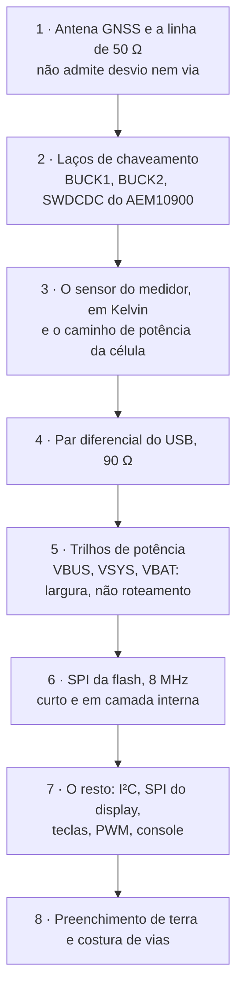

# Plano de layout

O que o layout tem de fazer, na ordem em que tem de fazer, e por quê. Fica
entre o [esquemático](01-esquematico.md), que diz o que liga em quê, e o
CAD, que desenha o cobre. A geometria — contorno, posicionamento e zonas
proibidas — está em [04](04-pcb-e-caixa.md); aqui é o **roteamento**.

**Nesta página:** [Regras de projeto](#regras-de-projeto) · [Ordem de roteamento](#ordem-de-roteamento) · [Terra e retorno](#terra-e-caminhos-de-retorno) · [Os nós críticos](#os-nós-críticos-um-a-um) · [Térmica](#térmica-no-cobre) · [Fabricação](#fabricação) · [Subida da primeira placa](#subida-da-primeira-placa) · [O que o layout não decide](#o-que-o-layout-não-decide)

> [!WARNING]
> **Não existe layout.** Nenhuma trilha foi desenhada, nenhum arquivo de
> CAD existe, nenhuma placa foi fabricada. Este documento é o projeto do
> layout, não o layout.

## Regras de projeto

A pilha é de **quatro camadas em 0,8 mm** ([04](04-pcb-e-caixa.md#camadas)),
e a espessura vem do conector USB-C, não de escolha. Os valores abaixo são
os que um fabricante comum de protótipo entrega sem custo extra; **quem os
confirma é a folha de processo do fabricante escolhido**, que ainda não
existe.

| Regra | Valor de partida | Onde aperta |
|---|---|---|
| Trilha e afastamento mínimos | 0,127 mm (5 mil) | sob o BM20C (LGA de passo fino) e sob o MAX17262 (WLP de 0,4 mm) |
| Via padrão | furo 0,2 mm, ilha 0,45 mm | em qualquer lugar |
| Via na ilha (*via-in-pad*) | tampada e aplainada | **obrigatória** sob o MAX17262 e provavelmente sob o nPM1300 |
| Anel anular mínimo | 0,125 mm | — |
| Afastamento ao contorno | 0,25 mm | borda de cima, onde a antena chega perto |
| Máscara entre ilhas | 0,1 mm | LGA do módulo |

> [!IMPORTANT]
> **A via na ilha muda de fabricante.** O MAX17262 é um WLP de 1,5 × 1,5 mm
> com passo de 0,4 mm: não há como sair das ilhas do meio sem via dentro
> delas, e via não tampada num WLP suga solda e abre junta. Se o fabricante
> escolhido não fizer via tampada e aplainada, **a peça não é montável** — e
> isso decide o fabricante antes de decidir o layout.

## Ordem de roteamento

Roteamento é uma sequência de compromissos, e quem roteia por último fica
com o que sobrou. A ordem abaixo põe primeiro o que não admite
compromisso.

**Por que nesta ordem.** A antena e os laços de chaveamento são os dois
únicos blocos em que o cobre *é* o circuito: uma trilha errada ali não
degrada, **quebra**. O sensor do medidor vem logo depois porque a queda em
qualquer junta dentro dele entra direto na leitura. O USB é par casado e
precisa de espaço contínuo. Os trilhos de potência, ao contrário do que
parece, são os mais fáceis: o que eles exigem é **largura**, e largura se
resolve com cobre, não com posição.

## Terra e caminhos de retorno

**Uma camada de terra inteira, sem cortes.** A camada 2 é terra contínua de
borda a borda, e nada — nem trilha de sinal, nem trilha de alimentação —
atravessa ela. É a regra que mais barato compra desempenho nesta placa, e a
que mais fácil se perde quando falta espaço na camada 1.

**Por que não há divisão de terra.** A tentação clássica é separar "terra
analógica" e "terra digital". Aqui isso seria errado nos dois blocos que
importam: a antena GNSS precisa de um plano **contínuo** sob e ao redor da
linha de 50 Ω, e qualquer divisão obriga a corrente de retorno a contornar,
o que é exatamente o laço que se quer evitar. O mesmo vale para o par do
USB.

| O que | Regra |
|---|---|
| Camada 2 | terra contínua, sem divisão e sem trilha |
| Camada 3 | alimentação, com os trilhos largos como planos parciais |
| Troca de camada de sinal rápido | **via de retorno de terra a menos de 1 mm** da via de sinal |
| Costura de vias | ao longo de todo o contorno e em volta da zona da antena, a cada 3 a 5 mm |
| Sob a antena GNSS e sob a área da antena do BM20C | **cobre nenhum em camada nenhuma** ([04](04-pcb-e-caixa.md#zonas-proibidas)) |

## Os nós críticos, um a um

### Antena GNSS, e a linha de 50 Ω

O que mais importa nesta placa, e o que menos perdoa.

- Linha de **50 Ω** do `RF_IN` do MAX-F10S à rede em π e daí à antena. A
  largura sai da pilha do fabricante; sem a pilha **não há como desenhar
  esta trilha**.
- **Sem via, sem curva viva, sem passar por baixo de nada.** Se a linha
  precisar trocar de camada, o projeto do posicionamento está errado.
- A rede em π (três posições) fica **junto da antena**, não junto do
  módulo.
- A zona livre de cobre da antena vale em **todas as camadas**, inclusive
  na de terra.
- **A antena escolhida não cabe na zona** ([04](04-pcb-e-caixa.md#zonas-proibidas)):
  10,75 mm contra os 8 mm reservados. Isto é decisão pendente e **bloqueia
  o layout da borda de cima**.

### Os três laços de chaveamento

Um conversor chaveado não é um circuito no esquemático: é um **laço de
corrente** no cobre, e a área desse laço é o que ele irradia.

| Conversor | Laço a minimizar | Cuidado próprio |
|---|---|---|
| `BUCK1` (1,8 V, GNSS) | entrada → indutor → capacitor de saída → terra → entrada | é o trilho do receptor: a ondulação dele **vira ruído no C/N0** |
| `BUCK2` (3,0 V, MCU) | idem | é o trilho que liga o aparelho |
| AEM10900, nó `SWDCDC` | indutor e capacitores colados nos pinos | **sem plano de terra por baixo** (seção 13 da ficha) |

**Regras dos três:** o capacitor de entrada encosta no pino, com o retorno
de terra na mesma face; o indutor fica o mais perto possível; o laço fecha
em área mínima; e o nó de chaveamento (o lado do indutor que oscila) é
**pequeno**, porque ele é a antena involuntária do circuito.

> [!CAUTION]
> **O `SWDCDC` do AEM10900 é a exceção que contradiz a regra geral.** Em
> todo o resto da placa a camada de terra é contínua e vem logo abaixo; ali
> a ficha pede o contrário, para não formar capacitância no nó de
> chaveamento. É o tipo de instrução que um roteador automático desfaz sem
> avisar.

### O sensor do medidor de bateria

O sensor de 7 mΩ é **interno** ao MAX17262, entre os pinos `BATT` e `SYS`
([02](02-calculos.md#medidor-de-bateria)). Isso simplifica o layout e
transfere o problema para as **juntas**:

- O caminho da célula ao `BATT` e do `SYS` ao resto é **potência**: 600 mA
  de carga, e cada miliohm de trilha entra no erro de medida.
- O `JP101`, o jumper de medição de corrente, fica **nesse caminho**
  ([06](06-conectores-e-pontos-de-teste.md#jp101--jumper-de-medição-de-corrente)):
  1206 e ≤ 50 mΩ, e mesmo assim são 30 mV a 600 mA.
- **Nenhuma outra carga pendura entre o `BATT` e o `SYS`.**

### Par diferencial do USB

`D+` e `D−` a **90 Ω diferencial**, casados em comprimento, sem via se der,
e com o plano de terra contínuo embaixo o caminho inteiro. Os dois lados do
conector são unidos na placa, como manda a norma para USB 2.0
([06](06-conectores-e-pontos-de-teste.md#j101--usb-c)).

### SPI da flash, e o harmônico de L1

O 197º harmônico de 8 MHz cai a **0,58 MHz do centro de L1**
([04](04-pcb-e-caixa.md)), e a flash é a única coisa rápida perto do
receptor.

- Trilha **curta**: a flash está a cerca de 67 mm da zona da antena, e essa
  distância é a defesa principal.
- **Camada interna**, entre planos, sempre que possível.
- Os **33 Ω** em série ficam junto de quem **aciona**: `SCK` e `MOSI` no
  pino do MCU, **`MISO` no pino `SO` da flash**
  ([02](02-calculos.md#resistor-de-série-no-spi-da-flash)).
- Sem trilha de SPI passando pela borda de cima.

### Os barramentos lentos

O SPI do display (2 MHz no máximo) e os dois I²C (400 kHz) não têm regime
crítico. O que eles pedem é banal e costuma ser esquecido: **os pull-ups do
I²C perto do mestre**, e o FPC do display saindo **pela esquerda**, longe
das duas antenas ([04](04-pcb-e-caixa.md#posicionamento)).

### Largura de trilha

O [cálculo](02-calculos.md#corrente-por-trilho-e-largura-de-trilha) fixa a
corrente de cada nó; a largura sai da IPC-2152 **quando a pilha existir**.
Os três que não podem sair com largura de sinal:

| Nó | Pior caso |
|---|---|
| `VBUS` | 1500 mA |
| `VSYS` | 671 mA |
| `VBAT` | 600 mA |

## Térmica no cobre

O carregador do nPM1300 dissipa até **1,50 W**, e a caixa inteira chega a
44,7 °C a 25 °C de ambiente ([02](02-calculos.md#calor-da-caixa-inteira)) —
**empate com o corte do JEITA a 45 °C, antes de qualquer sol**. O layout é
uma das duas alavancas para isso (a outra é baixar a corrente de carga):

- Preenchimento de cobre generoso no `VSYS` e no terra sob o nPM1300, nas
  quatro camadas, costurado com vias térmicas.
- **A célula fica longe do carregador.** Hoje o desenho a põe atrás da
  placa ([04](04-pcb-e-caixa.md#posicionamento)); o nPM1300 não pode ficar
  do outro lado dela.
- O NTC que o JEITA lê fica **na célula**, não perto do carregador, senão
  ele corta a carga por causa do calor do próprio chip.

## Fabricação

- **Duas passagens pelo forno, no máximo**, com o lado do módulo **por
  último** ([04](04-pcb-e-caixa.md#montagem)).
- O BM20C tem ilhas LGA, não castelo: **estêncil e forno**, sem retrabalho
  manual possível.
- **Fiduciais**: três globais na placa e um par local junto do BM20C e do
  MAX17262.
- Os **16 pontos de teste** ([06](06-conectores-e-pontos-de-teste.md#pontos-de-teste))
  ficam acessíveis com a placa montada, na face oposta à da célula.
- Painelização com abas perfuradas; a borda de cima, onde vai a antena,
  **não leva aba**.

## Subida da primeira placa

Numa placa que nunca existiu, a ordem de montar e ligar vale tanto quanto o
layout. **Nada disto foi feito.**

| Passo | O que montar | O que conferir antes de ligar |
|---|---|---|
| 0 | nada | continuidade e curto de **cada trilho contra o terra**, com a placa nua |
| 1 | só o caminho de energia: nPM1300, MAX17262, passivos, `RVSET1` e `RVSET2` | **medir os dois `RVSET` com o multímetro**: um errado e o MCU nunca liga, ou queima |
| 2 | — | fonte de bancada no lugar da célula, **com limite de corrente**; conferir `VSYS` |
| 3 | — | `3V0` = 3,0 V e `1V8` = 1,8 V, e a **rampa do `1V8` no osciloscópio**: tem de ficar entre 25 e 35.000 µs/V ([07](07-sequencias-e-protecao.md#as-três-restrições-de-partida)) |
| 4 | o módulo BM20C | console no `uart20`, e o aparelho tem de **partir** |
| 5 | o receptor GNSS | **só depois** de a rampa do passo 3 estar confirmada |
| 6 | sensores e flash | barramentos, endereços, e a `LDSW1` de fato cortando |
| 7 | display, teclas, buzzer, LED | — |
| 8 | painéis e antena | `UBX-MON-SPAN` com a flash trabalhando, e o S11 da antena **dentro da caixa** |

> [!CAUTION]
> **O passo 3 vem antes do passo 5, e não é formalidade.** O `V_IO` do
> MAX-F10S tem máximo absoluto de 1,98 V e rampa limitada; a ficha diz que
> fora da faixa o módulo **pode ser danificado**. Soldar o receptor antes
> de medir o trilho é arriscar a peça mais cara da placa depois do módulo.

## O que o layout não decide

| Em aberto | Quem resolve |
|---|---|
| **Pilha do fabricante** — sem ela não há 50 Ω, nem 90 Ω, nem largura de trilha | o fabricante escolhido |
| **Via tampada e aplainada** — sem ela o MAX17262 não é montável | idem |
| **A antena não cabe na zona** — 10,75 mm contra 8 mm | decisão de mecânica, **bloqueia a borda de cima** |
| **Pad LGA de cada GPIO do BM20C** — o esquemático liga por nome de sinal; o layout precisa do pad | ficha da Fanstel |
| **Ordem das cinco vias do conector da luz** — a ficha já diz que são **5 vias, passo 0,5 mm**, num conector à parte do de 10 vias dos sinais; falta qual é anodo e qual é catodo | ficha em mãos ou amostra |
| **Peça do conector de 5 vias** do `J402` | escolha de componente |
| **Orientação do divisor do `DIS_STO_CH`** | ficha do AEM10900 |
| **Onde fica o NTC do JEITA na célula** | fabricante do pack |
