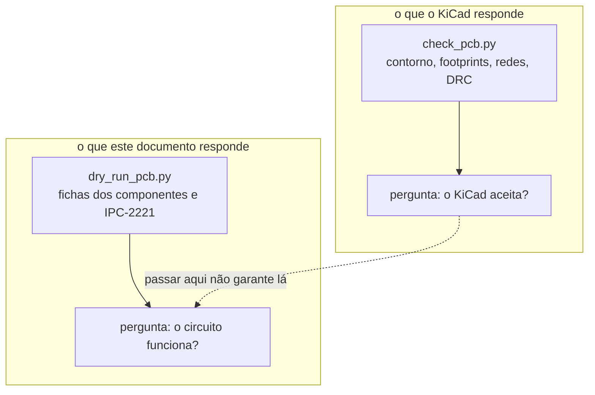

# Dry-run da placa

Este documento é o ensaio a seco da placa: cada regra que as fichas dos
componentes e as normas impõem ao layout, medida no arquivo
[`cad/gnssbike.kicad_pcb`](cad/) e não afirmada de memória. Ele existe porque
a verificação de regras do KiCad responde a uma pergunta diferente — "o KiCad
aceita esta placa?" — e nada nela sabe que uma antena de chip a 6 mm de um
indutor de conversor chaveado não vai irradiar.

**Nesta página:** [O que é medido](#o-que-é-medido) ·
[Como rodar](#como-rodar) · [As regras e a origem de cada uma](#as-regras-e-a-origem-de-cada-uma) ·
[Resultado da posição](#resultado-da-posição) ·
[Resultado do roteamento](#resultado-do-roteamento) ·
[Defeitos achados e corrigidos nesta passagem](#defeitos-achados-e-corrigidos-nesta-passagem) ·
[O que não foi medido](#o-que-não-foi-medido)

> [!WARNING]
> **Nada disto foi montado nem medido em bancada.** Tudo aqui sai de arquivos:
> o esquemático em `cad/nets.py`, a placa em `cad/gnssbike.kicad_pcb` e as
> fichas dos fabricantes, citadas pela seção. Placa física não existe.

## O que é medido



A diferença importa. Antes desta passagem a placa tinha **0 erros de DRC** e,
ao mesmo tempo, o colhedor solar a 16,4 mm da antena do rádio, o receptáculo
USB-C com a boca virada para dentro da placa e as caixas 3D 2,54 vezes maiores
do que as peças. Nenhuma dessas três coisas é uma violação de regra de
projeto, e as três quebram o aparelho.

## Como rodar

Na raiz do repositório:

| Ordem | Comando | O que faz |
|---|---|---|
| 1 | `python hardware_gnssbike/cad/make_pcb.py` | escreve a placa com as peças posicionadas, sem trilha |
| 2 | `python hardware_gnssbike/cad/route.py` | roteia o que consegue e deixa o resto declarado |
| 3 | `python hardware_gnssbike/cad/check_pcb.py --como-esta` | contorno, footprints, redes e a DRC do KiCad, **no arquivo como está** |
| 4 | `python hardware_gnssbike/cad/dry_run_pcb.py` | **este documento**, medido de novo |
| — | `python hardware_gnssbike/cad/orientacao.py` | para que lado olha cada peça que sai da caixa |

Os quatro primeiros formam uma cadeia e a ordem importa. Sem `--como-esta`,
o passo 3 **regera a placa**, o que apaga as trilhas e faz a verificação de
regras olhar uma placa vazia — foi assim que uma passagem inteira de
roteamento pareceu limpa sem nunca ter sido medida. Rodar o 2 sem rodar o 1
antes é seguro (o roteador apaga o cobre da corrida anterior), mas deixa
trilhas de uma colocação que pode já ter mudado.

## As regras e a origem de cada uma

| Id | O que exige | Origem |
|---|---|---|
| RF1 | nenhum componente dentro da área livre da antena do módulo | ficha MinewSemi ME54BS13 V1.0.0, 7.2 |
| RF2 | a antena do módulo olha para fora da borda da placa | ficha MinewSemi ME54BS13 V1.0.0, 7.2 |
| RF3 | 20 mm entre a antena do módulo e conversor chaveado ou indutor | ficha MinewSemi ME54BS13 V1.0.0, 7.3 |
| RF4 | a rede π do GNSS junto ao `RF_IN`, com a trilha mais curta possível | u-blox MAX-F10S Integration Manual UBXDOC-963802114-12892, 2.3 |
| RF5 | separação entre a antena GNSS (1,575 GHz) e a do rádio (2,44 GHz) | prática: um quarto de onda de 2,44 GHz são 30,7 mm |
| AL1 | capacitor de alta frequência (até 1 µF) a 2 mm do pino; de reserva (acima de 1 µF) a 5 mm | fichas do nPM1300, AEM10900, TPS7A02, MAX17262, ME54BS13 |
| AL2 | largura de trilha suficiente para a corrente, com 10 °C de subida | IPC-2221B, 6.2, curva de condutor externo |
| AL3 | laço de chaveamento curto: `SW` ao indutor e ao capacitor de saída | ficha do nPM1300, layout recomendado |
| GN1 | todo pad de terra de superfície ligado ao terra, por via própria ou pelo plano da própria face | prática: o retorno segue por baixo do sinal |
| GN2 | costura de vias de terra na borda a cada 5 mm no máximo | λ/10 a 2,44 GHz em FR-4 são 6,1 mm |
| ME1 | a placa cabe na caixa com folga | [04](04-pcb-e-caixa.md) |
| ME2 | altura dos componentes dentro da sombra da bateria e do display | [04](04-pcb-e-caixa.md#as-duas-sombras-display-e-bateria) |

### Por que RF3 não é uma zona proibida

Uma zona proibida do KiCad proíbe **cobre**. A regra 7.3 da ficha do módulo
proíbe **peça**: um conversor chaveado ou um indutor perto da antena acopla
pelo campo próximo, esteja o cobre dele onde estiver. Verificação de regra
nenhuma vai pegar isso, e por isso a regra mora no posicionador
(`LONGE_DA_ANTENA` em `cad/make_pcb.py`) e é medida aqui.

### A conta da largura de trilha

`dry_run_pcb.py` usa a fórmula da IPC-2221B, 6.2, para condutor externo:

```text
A = (I / (k × ΔT^b))^(1/c)      com k = 0,048, b = 0,44 e c = 0,725
largura = A / espessura
```

com a área `A` em mil², a subida `ΔT` em °C e a espessura do cobre de 35 µm
(cobre de 1 oz), convertida para mil. A corrente de cada
trilho vem da tabela `CORRENTE` do próprio arquivo, com a origem escrita ao
lado de cada número — sem ela a largura seria um chute.

## Resultado da posição

Medido em 2026-09-24, na placa de 112 peças, com 524 segmentos e 250 vias:

| Id | Medida | Situação |
|---|---|---|
| RF1 | a área livre da antena está vazia; a peça mais próxima é o `TP203`, encostando nela a 0,00 mm | cumprida, **no limite** |
| RF3 | o chaveador mais próximo da antena é `U101`, a 20,9 mm | cumprida |
| RF4 | rede π do GNSS: `C302` a 1,6 mm, `L301` a 1,8 mm, `C301` a 3,2 mm do `RF_IN` | cumprida |
| RF5 | as duas antenas estão a 65,8 mm de centro a centro, 2,1 quartos de onda de 2,44 GHz | cumprida |
| AL1 | 1 de 25 capacitores além do limite: `C111` a 2,0 mm de `U101`, contra 2 mm | **quase**: marginal |
| GN1 | os 95 pads de terra de superfície estão ligados; **70 (74 %)** por via própria ao plano interno, os outros 25 pelo plano da própria face | cumprida |
| GN2 | **72 vias** de costura na borda, maior vão **3,5 mm** contra o limite de 5 | cumprida |
| AL2 | nenhum trecho de alimentação abaixo da largura da IPC-2221 | cumprida |
| ME1 | a placa de 55 × 97 deixa 1,5 mm de cada lado na cavidade de 58 × 100 | cumprida |

### O que mudou nesta passagem

| Regra | Antes | Depois | O que fez |
|---|---|---|---|
| RF3 | `U103` a **16,4 mm** e `L103` a 18,1 mm | o pior é `U101` a **20,9 mm** | a regra dos 20 mm entrou no posicionador |
| AL1 | 23 de 40 fora, média 2,70 mm | 1 de 25 fora, média 2,16 mm | limite por valor do capacitor e o menor escolhe lugar primeiro |

> [!NOTE]
> A média caiu de 2,70 para 2,16 mm, mas parte da melhora do **número** veio
> de medir a coisa certa: a régua de 2 mm estava sendo aplicada a resistores
> de *pull-up* e a capacitores de *debounce* de tecla, que não desacoplam pino
> de alimentação nenhum, e a capacitores de reserva de 10 e 22 µF, para os
> quais 2 mm é fisicamente impossível em volta de um QFN de 4 × 4 mm com doze
> deles. O que a régua certa continua cobrando é o de alta frequência.

## Resultado do roteamento

> [!IMPORTANT]
> **O roteamento está pela metade, e isso é o que o número diz.** De 177
> ligações de sinal e alimentação, o roteador fechou **90 (51 %)**; as outras
> **87 ficam para quem abrir o arquivo no KiCad**. O que está desenhado
> passa em todas as regras; o que falta, falta.

| Medida | Valor |
|---|---|
| Camadas de roteamento | **3**: `F.Cu`, `In2.Cu` e `B.Cu`; `In1.Cu` é plano de terra |
| Segmentos | 524 |
| Vias | 250, sendo **67** de pad de terra ao plano interno, **69** de costura na borda e o resto de troca de camada |
| Ligações de sinal e alimentação fechadas | **90 de 177** |
| Redes deixadas de fora de propósito | `RF_IN` e `RF_ANT` |
| **Erros de regra de projeto do KiCad** | **0** |
| Conferência geométrica independente | **0** pares perto demais |

### Por que `RF_IN` e `RF_ANT` não são roteadas

Elas precisam de 50 Ω controlados, e a largura que dá 50 Ω só existe depois
que o fabricante informa o empilhamento — que é item em aberto em
[04](04-pcb-e-caixa.md). Desenhar agora com uma largura qualquer seria pior
que deixar em branco: pareceria pronto.

### O que o KiCad ainda conta como sem ligação

O relatório do KiCad diz **252 ligações sem trilha**, e **165 delas são de
terra**. Não são defeito: as zonas de terra estão declaradas no arquivo, mas
uma zona só é **preenchida** quando a placa é aberta no KiCad, e até lá os
pads de terra aparecem como soltos. Ao abrir e mandar preencher (tecla `B`),
elas somem. Fora do terra restam **87**, que são as ligações realmente não
roteadas.

### Por que metade, e o que fazer com a outra metade

O roteador aqui é um labirinto A\* com ordem fixa e **sem *rip-up***: quando
uma rede fecha o caminho de outra, ele não desfaz nada. Um roteador de
verdade (o FreeRouting, por exemplo) desfaz e refaz até convergir. Duas
saídas, nesta ordem:

1. **Abrir `cad/gnssbike.kicad_pcb` no KiCad e terminar à mão.** O trabalho
   difícil — posição, plano de terra, costura, regras das fichas — já está
   feito e conferido; o que falta são ligações de sinal em área livre.
2. **Exportar Specctra DSN e passar pelo FreeRouting.** Precisa de Java e de
   um download, que é decisão do dono.

### O laço de chaveamento (AL3), que ninguém mediu

O `dry_run_pcb.py` **não** mede o laço `SW` → indutor → capacitor de saída,
porque ele depende do roteamento final e o roteamento não está fechado.
Quando estiver, essa regra entra na medição.

## Defeitos achados e corrigidos nesta passagem

| Defeito | Como apareceu | Correção |
|---|---|---|
| **Boca do USB-C virada para dentro da placa** | o dono viu na imagem: "vejo coisas erradas como o footprints do usb invertido" | `J101` de 180° para 0° e `J102` de 90° para 270°, e `cad/orientacao.py` passou a **medir** para que lado olha cada peça que sai da caixa, a partir da geometria do próprio footprint |
| **Caixas 3D 2,54 vezes maiores** | conferência da unidade contra `R_0402_1005Metric.wrl` da biblioteca do KiCad, cujo corpo de 1,0 × 0,5 mm tem cantos em ±0,197 e ±0,098 | o VRML do KiCad é em unidades de 0,1 polegada: `wrl_caixa()` passou a dividir por 2,54 |
| **Pad `custom` sub-bloqueado no roteador** | varredura dos footprints: no `U104` (TPS7A02 em X2SON) o `size` do pad é 0,148 mm mas o cobre das primitivas chega a 0,46 × 0,31 | o roteador passou a ler as primitivas do pad `custom` |
| **Folga de via não modelada** | a placa roteada falhou 974 regras, com 199 `shorting_items` e 199 `hole_clearance` | duas grades: uma para onde a trilha pode passar, outra para onde o **centro da via** pode cair |
| **Toco de terra sem conferência** | o mesmo episódio: o toco saía do pad numa direção qualquer que estivesse livre **na via**, atravessando o que houvesse no meio | o toco virou axial e o corredor inteiro é conferido antes de desenhar |
| **Pad tratado como círculo** | um pad quadrado ficava descoberto nos cantos | pads marcados como o retângulo que são, com a rotação aplicada |
| **Contorno circular lido pela metade** | o único erro de DRC da placa sem trilhas: `TP201` e `TP203` com os contornos encostados | o contorno de um ponto de teste é um `fp_circle`, e o leitor tomava `center` e `end` como dois pontos soltos, achando raio 0,5 onde era 1,0. Os dois pontos estavam a exatos 2,0 mm |
| **Folga de um pad lembrada só uma vez** | 42 erros de isolamento com trilhas a 0,025 mm de um pad | a marcação usava "quem chegar primeiro": uma célula dentro da folga de **dois** pads guardava só um deles. Agora célula disputada por duas redes fica proibida para as duas — que é o que ela é |
| **Classe USB tratada como a padrão** | trilha de terra a 0,075 mm do `USB_DP`, que pede 0,2 mm | as três classes do `gnssbike.kicad_pro` passaram a ser lidas, não supostas |
| **Rotear duas vezes empilhava as trilhas** | o roteador dizia 534 segmentos e o arquivo tinha **1576**, com 206 cruzamentos que ele nunca desenhou | `route.py` passou a apagar as trilhas e vias anteriores antes de escrever; rodar de novo agora dá o mesmo resultado |

## O que não foi medido

| Id | O que falta | Por quê |
|---|---|---|
| RF2 | a antena do módulo olhando para fora da borda | `orientacao.py` mede a geometria do footprint, mas quem confirma que aquele lado é o da antena é a ficha; **conferir na ficha impressa antes de fabricar** |
| AL3 | laço de chaveamento `SW` → indutor → capacitor de saída | depende do roteamento final, que ainda não está fechado |
| ME2 | altura dos componentes sob a bateria e sob o display | as peças sem modelo do fabricante entram como caixa do encapsulamento, não como o corpo real |
| — | impedância de 50 Ω das linhas de RF | depende do empilhamento do fabricante, que é item em aberto em [04](04-pcb-e-caixa.md) |
| — | isolamento entre as duas antenas | bancada |

---

**Verificação:** os números desta página saem de
`python hardware_gnssbike/cad/dry_run_pcb.py`, que recalcula tudo a cada
execução. Nenhum foi digitado à mão.
