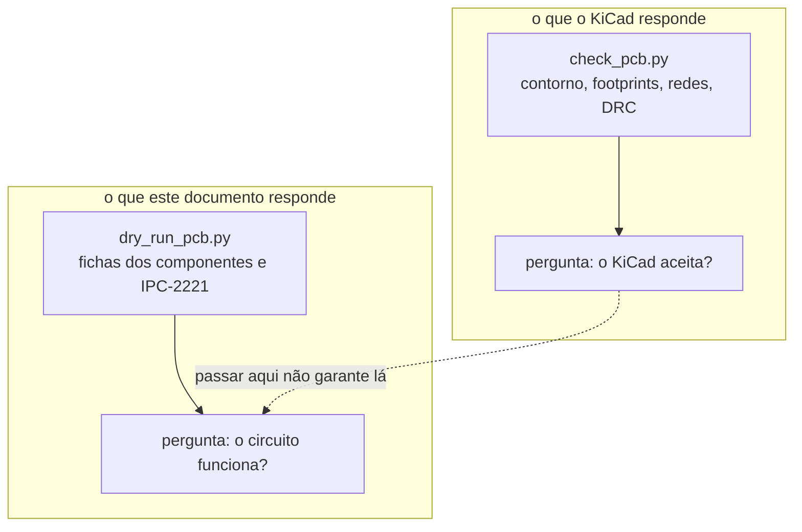

# Dry-run da placa

Este documento é o ensaio a seco da placa: cada regra que as fichas dos
componentes e as normas impõem ao layout, medida no arquivo
[`cad/gnssbike.kicad_pcb`](cad/) e não afirmada de memória. Ele existe porque
a verificação de regras do KiCad responde a uma pergunta diferente — "o KiCad
aceita esta placa?" — e nada nela sabe que uma antena de chip a 6 mm de um
indutor de conversor chaveado não vai irradiar.

**Nesta página:** [O que é medido](#o-que-é-medido) ·
[Como rodar](#como-rodar) · [As regras e a origem de cada uma](#as-regras-e-a-origem-de-cada-uma) ·
[Resultado da posição](#resultado-da-posição) ·
[Resultado do roteamento](#resultado-do-roteamento) ·
[Defeitos achados e corrigidos nesta passagem](#defeitos-achados-e-corrigidos-nesta-passagem) ·
[O que não foi medido](#o-que-não-foi-medido)

> [!WARNING]
> **Nada disto foi montado nem medido em bancada.** Tudo aqui sai de arquivos:
> o esquemático em `cad/nets.py`, a placa em `cad/gnssbike.kicad_pcb` e as
> fichas dos fabricantes, citadas pela seção. Placa física não existe.

## O que é medido



A diferença importa. Antes desta passagem a placa tinha **0 erros de DRC** e,
ao mesmo tempo, o colhedor solar a 16,4 mm da antena do rádio, o receptáculo
USB-C com a boca virada para dentro da placa e as caixas 3D 2,54 vezes maiores
do que as peças. Nenhuma dessas três coisas é uma violação de regra de
projeto, e as três quebram o aparelho.

## Como rodar

Na raiz do repositório:

| Ordem | Comando | O que faz |
|---|---|---|
| 1 | `python hardware_gnssbike/cad/make_pcb.py` | escreve a placa com as peças posicionadas, sem trilha |
| 2 | `python hardware_gnssbike/cad/route.py` | roteia o que consegue e deixa o resto declarado |
| 3 | `python hardware_gnssbike/cad/check_pcb.py --como-esta` | contorno, footprints, redes e a DRC do KiCad, **no arquivo como está** |
| 4 | `python hardware_gnssbike/cad/dry_run_pcb.py` | **este documento**, medido de novo |
| — | `python hardware_gnssbike/cad/orientacao.py` | para que lado olha cada peça que sai da caixa |

Os quatro primeiros formam uma cadeia e a ordem importa. Sem `--como-esta`,
o passo 3 **regera a placa**, o que apaga as trilhas e faz a verificação de
regras olhar uma placa vazia — foi assim que uma passagem inteira de
roteamento pareceu limpa sem nunca ter sido medida. Rodar o 2 sem rodar o 1
antes é seguro (o roteador apaga o cobre da corrida anterior), mas deixa
trilhas de uma colocação que pode já ter mudado.

## As regras e a origem de cada uma

| Id | O que exige | Origem |
|---|---|---|
| RF1 | sem cobre, sem componente e sem caixa metálica fechada sobre a área da antena do módulo | ficha MinewSemi ME54BS13 V1.0.0, **7.3** |
| RF2 | o lado de RF do módulo virado para a borda, nunca para dentro da placa | ficha ME54BS13 V1.0.0, **7.3** |
| RF3 | **3 a 5 mm** em volta da área da antena sem trilha de sinal, sem metal e sem fonte de interferência; módulo na **borda ou no canto** | ficha ME54BS13 V1.0.0, **7.4** |
| RF4 | a placa **vazada** sob a área da antena, deixando-a suspensa | ficha ME54BS13 V1.0.0, **7.4** |
| RF5 | **5 mm** entre o receptor GNSS e qualquer componente de RF | u-blox MAX-F10S Integration Manual UBXDOC-963802114-12892, **4.4** |
| RF6 | terra sob o módulo GNSS na primeira e na segunda camada, sem trilha de sinal cruzando por baixo nessas duas | u-blox MAX-F10S IM, **4.4** |
| RF7 | o **caminho de RF** do pino `RF_IN` até o contato da antena, passando pela rede π, dentro de **λ/10 em L1 (10,5 mm)**; cada shunt a menos de **λ/20 (5,3 mm)** do nó em que pendura | u-blox MAX-F10S IM, **4.4** ("as short as possible"); o limite é λ/10 e λ/20, calculados abaixo |
| RF8 | as duas antenas o mais longe possível uma da outra | u-blox MAX-F10S IM, **4.4** |
| RF9 | a **tabela de isolação** do módulo: **20 mm** de fonte chaveada, indutor de potência ou transformador; 20 mm de USB 3.0/HDMI/DDR/SDIO rápido; 15 mm de clock rápido de MCU ou PHY Ethernet; **25 mm** de display, câmera ou cabo FPC com fiação | ficha ME54BS13 V1.0.0, **7.2**, `Interference Isolation Rule` |
| RF10 | **50 mm** entre dois módulos de rádio na mesma placa | ficha ME54BS13 V1.0.0, **7.2**, `Multiple Modules on the Same PCB` |
| US1 | o par `USB_DP`/`USB_DM` **roteado**, com a largura e o afastamento que dão **90 Ω diferenciais** nesta pilha | USB 2.0, 7.1.6 (90 Ω ±15 %); a geometria sai do empilhamento, calculada em [`cad/route.py`](cad/route.py) |
| AL1 | desacoplamento do **módulo de rádio a 0,5 mm** do pino; dos demais CIs, 2 mm o de alta frequência e 5 mm o de reserva | ficha ME54BS13 V1.0.0, **7.2**; fichas do nPM1300, AEM10900, TPS7A02 |
| AL2 | largura de trilha suficiente para a corrente, com 10 °C de subida | IPC-2221B, 6.2, curva de condutor externo |
| AL3 | laço de chaveamento curto: `SW` ao indutor e ao capacitor de saída | ficha do nPM1300, layout recomendado |
| AL4 | no máximo **0,2 Ω** em série na linha `VCC` do GNSS | u-blox MAX-F10S IM, **4.1.1** |
| AL5 | **footprint de filtro π reservado** junto ao pino de alimentação do módulo de rádio, por ele vir de fonte chaveada | ficha ME54BS13 V1.0.0, **7.2** |
| GN1 | uma via de terra junto de **cada** pad de terra do módulo, e todo pad de terra de superfície ligado ao terra | ficha ME54BS13 V1.0.0, **7.2** |
| GN2 | costura de vias de terra na borda a cada 5 mm no máximo | λ/10 a 2,44 GHz em FR-4 são 6,1 mm |
| ME1 | a placa **cabe** dentro da caixa. Não é o que define o tamanho dela — placa e caixa são independentes —, é só a conferência de que uma entra na outra | [04](04-pcb-e-caixa.md) |
| ME2 | altura dos componentes dentro da sombra da bateria e do display | [04](04-pcb-e-caixa.md#as-duas-sombras-display-e-bateria) |

> [!CAUTION]
> **Este documento já errou duas vezes sobre a mesma ficha, nos dois
> sentidos, e as duas correções estão aqui.**
>
> **Primeiro erro.** Ele afirmava *"20 mm entre a antena do módulo e qualquer
> conversor chaveado ou indutor"* e nada mais, sem a tabela. Com isso mantinha
> a fonte chaveada longe e, ao mesmo tempo, **deixava dez peças a menos de
> 5 mm da antena, uma delas a 0,8 mm** — porque o **3 a 5 mm** da 7.4, que
> vale para **qualquer** peça em volta da área da antena, não estava sendo
> medido. Corrigido: virou o `RF3`.
>
> **Segundo erro, ao corrigir o primeiro.** Ele passou a afirmar que a regra
> dos 20 mm **não existia**, porque foi procurada na 7.3 — que de fato só traz
> o qualitativo *"do not place modules adjacent to strong interference
> sources"*. Ela existe, na **7.2**, `Interference Isolation Rule`, e é uma
> **tabela de quatro linhas**. Enquanto essa afirmação valeu, a restrição saiu
> do posicionador e o indutor `L103` chegou a **6,8 mm** do módulo. Corrigido:
> virou o `RF9`, com as quatro linhas, inclusive a de **25 mm de display ou
> cabo FPC**, que nenhuma versão deste documento tinha.
>
> O que continua valendo da primeira correção: o desacoplamento do módulo é de
> **0,5 mm**, não de 2 — a 7.2 escreve *"the trace length between capacitor
> pads and power pins should be ≤ 0.5 mm"*.
>
> A lição, escrita porque custou duas passagens: **"não achei" não é "não
> existe"**. Medir a coisa errada com rigor não é rigor, e apagar uma regra
> porque ela não estava na seção em que se olhou é pior do que não tê-la
> medido.
>
> Os PDF estão em [`datasheets/`](datasheets/), que o `.gitignore` mantém fora
> deste repositório público; o que é versionado são as citações.

### De onde saem os 10,5 mm do RF7

A ficha não dá número: escreve "as short as possible". Um número tem de sair
de física, e o que decide é quando a linha deixa de ser eletricamente curta.

```text
microstrip de 0,196 mm sobre 0,10 mm de FR-4 (a pilha assimetrica desta placa)
eps_eff = (4,3+1)/2 + (4,3-1)/2 x (1 + 12 x 0,10/0,196)^-0,5 = 3,27
lambda em L1 (1,575 GHz) = c / (f x raiz(eps_eff)) = 105,3 mm
lambda/10 = 10,5 mm   -> o caminho inteiro, do pino ao contato da antena
lambda/20 =  5,3 mm   -> o toco de cada shunt, que tem de se comportar como
                         o capacitor concentrado com que a rede foi calculada
```

> [!WARNING]
> **Este teste já cobrou a coisa errada.** Ele exigia que os **três**
> elementos da rede π estivessem a menos de 5 mm do pino `RF_IN`. O `C301` é
> o shunt do lado da **antena** — é o fim da rede por construção —, de modo
> que uma rede π montada corretamente falhava por estar correta. E o limite
> de 2 mm que os shunts chegaram a carregar era **invenção**: a ficha não dá
> figura nenhuma. Agora o que se mede é o caminho, e o número vem da conta
> acima.

### Por que RF3 não é uma zona proibida

Uma zona proibida do KiCad proíbe **cobre**. A regra 7.4 da ficha do módulo
proíbe **peça**: qualquer componente perto da antena acopla pelo campo
próximo, esteja o cobre dele onde estiver. Verificação de regra nenhuma pega
isso, e por isso a regra mora no posicionador (`DIST_ANTENA` em
[`cad/make_pcb.py`](cad/make_pcb.py)) e é medida aqui.

Com uma exceção, nomeada e medida: o **desacoplamento do próprio módulo**.
As duas regras da mesma ficha se contradizem para ele — 7.2 quer o capacitor
a 0,5 mm do pino de alimentação, e esse pino fica a 2,1 mm da própria antena.
Não existe ponto que satisfaça as duas. O `C201` e o `C210` ficam perto de
propósito, e o dry-run imprime a que distância, em vez de esconder.

### A conta da largura de trilha

`dry_run_pcb.py` usa a fórmula da IPC-2221B, 6.2, para condutor externo:

```text
A = (I / (k × ΔT^b))^(1/c)      com k = 0,048, b = 0,44 e c = 0,725
largura = A / espessura
```

com a área `A` em mil², a subida `ΔT` em °C e a espessura do cobre de 35 µm
(cobre de 1 oz), convertida para mil. A corrente de cada
trilho vem da tabela `CORRENTE` do próprio arquivo, com a origem escrita ao
lado de cada número — sem ela a largura seria um chute.

## Resultado da posição

Medido em 2026-09-24, na placa de **34 × 90 mm** com 116 peças, 744 segmentos
e 256 vias:

| Id | Medida | Situação |
|---|---|---|
| RF1 | a área da antena (**4,46 × 12,50 mm**) está livre de componente | cumprida |
| RF3 | a peça alheia mais próxima da área da antena é o `JP102`, a **5,6 mm**; o desacoplamento do próprio módulo fica mais perto de propósito (`C201` a 1,4 e `C210` a 3,4) | cumprida |
| RF4 | a placa **é vazada** sob a área da antena | cumprida |
| RF5 | o componente de RF alheio mais próximo do receptor está a **51,9 mm** | cumprida |
| RF6 | nenhuma trilha de sinal passa por baixo do receptor na face da frente | cumprida, imposta no roteador |
| RF7 | caminho de RF do pino à antena de **8,2 mm**, dentro de λ/10 em L1 (10,5); `C302` a 1,7 e `C301` a 3,4 mm do seu nó | cumprida |
| RF8 | as duas antenas estão a **75,0 mm** de centro a centro, 2,4 quartos de onda de 2,44 GHz | cumprida |
| RF9 | chaveamento: `U101` a **24,1** de 20 mm. Display e cabo plano: `J402` a **31,3** de 25 mm | cumprida |
| RF10 | os dois módulos de rádio a **51,9 mm**, acima dos 50 da ficha | cumprida |
| AL1 | 24 capacitores dentro do limite; o pior de alta frequência a **1,72 mm** e o pior de reserva a **3,30** | cumprida |
| AL2 | nenhum trecho de alimentação abaixo da largura da IPC-2221 | cumprida |
| AL6 | nenhuma via sobre os 5 pads térmicos | cumprida |
| GN1 | os **99** pads de terra de superfície estão ligados; **71 (72 %)** por via própria ao plano interno | cumprida |
| GN2 | **72 vias** de costura na borda, maior vão **3,0 mm** contra o limite de 5 | cumprida |
| ME1 | a placa de **34 × 90** cabe na cavidade com sobra | cumprida |
| ME2 | nenhuma peça passa do teto da sombra em que está; **0 peças sem altura conhecida** | cumprida |
| OP1 | nenhuma peça a menos de duas alturas do sensor de luz | cumprida |
| **ME3** | **3 encapsulamentos em que a ficha e o footprint discordam** | **violada de propósito** |

> [!CAUTION]
> **O `ME3` falha porque dois land patterns são de outra peça.** O
> `USB_C_Receptacle_Palconn_UTC16-G` desenha 8,94 × 7,32 contra os **9,99 ×
> 8,58** do Molex 2036150003 da lista de compras, e o `Hirose_FH12-10S-0.5SH`
> desenha 8,10 de largura contra os **9,90** do FH28-10S-0.5SH. O terceiro, o
> buzzer, **foi corrigido**: o footprint em uso era do CPT-9019S, redondo de
> 9 mm, no lugar do CPT-1117-83-SMT retangular de 11,0 × 9,0 × 1,7.
>
> Os dois que sobraram não foram consertados de propósito. Reconstruir land
> pattern de USB-C a partir de desenho **renderizado** é o palpite que esta
> conferência existe para pegar, e nenhuma das duas peças está na biblioteca
> do KiCad 8. O que resolve é o arquivo do fabricante.

## Resultado do roteamento

> [!IMPORTANT]
> **O roteamento está pela metade, e isso é o que o número diz.** O roteador
> fechou **121 ligações** e o KiCad ainda conta **105 sem trilha**, agora com
> as malhas preenchidas — ou seja, esse 105 é real, não é o artefato de
> zona vazia que a versão anterior deste documento reportava como 261. O que
> está desenhado passa em todas as regras; o que falta, falta.

| Medida | Valor |
|---|---|
| Camadas de roteamento | **3**: `F.Cu`, `In2.Cu` e `B.Cu`; `In1.Cu` é plano de terra |
| Segmentos | **744** |
| Vias | **256**, sendo 71 de pad de terra ao plano interno, 72 de costura na borda e o resto de troca de camada |
| Ligações fechadas | **121** |
| Ligações sem trilha | **105** |
| Redes deixadas de fora de propósito | `RF_IN` e `RF_ANT` |
| **Erros de regra de projeto do KiCad** | **0** |
| Conferência geométrica independente | **0** pares perto demais |
| Traçado | tronco ortogonal com chanfro de 45° nos cantos |

### Por que `RF_IN` e `RF_ANT` não são roteadas

Elas precisam de 50 Ω controlados, e a largura que dá 50 Ω só existe depois
que o fabricante informa o empilhamento — que é item em aberto em
[04](04-pcb-e-caixa.md). Desenhar agora com uma largura qualquer seria pior
que deixar em branco: pareceria pronto.

### O que o KiCad ainda conta como sem ligação

O relatório do KiCad diz **252 ligações sem trilha**, e **165 delas são de
terra**. Não são defeito: as zonas de terra estão declaradas no arquivo, mas
uma zona só é **preenchida** quando a placa é aberta no KiCad, e até lá os
pads de terra aparecem como soltos. Ao abrir e mandar preencher (tecla `B`),
elas somem. Fora do terra restam **87**, que são as ligações realmente não
roteadas.

### Por que metade, e o que fazer com a outra metade

O roteador aqui é um labirinto A\* com ordem fixa e **sem *rip-up***: quando
uma rede fecha o caminho de outra, ele não desfaz nada. Um roteador de
verdade (o FreeRouting, por exemplo) desfaz e refaz até convergir. Duas
saídas, nesta ordem:

1. **Abrir `cad/gnssbike.kicad_pcb` no KiCad e terminar à mão.** O trabalho
   difícil — posição, plano de terra, costura, regras das fichas — já está
   feito e conferido; o que falta são ligações de sinal em área livre.
2. **Exportar Specctra DSN e passar pelo FreeRouting.** Precisa de Java e de
   um download, que é decisão do dono.

### O laço de chaveamento (AL3), que ninguém mediu

O `dry_run_pcb.py` **não** mede o laço `SW` → indutor → capacitor de saída,
porque ele depende do roteamento final e o roteamento não está fechado.
Quando estiver, essa regra entra na medição.

## Defeitos achados e corrigidos nesta passagem

| Defeito | Como apareceu | Correção |
|---|---|---|
| **Boca do USB-C virada para dentro da placa** | o dono viu na imagem: "vejo coisas erradas como o footprints do usb invertido" | `J101` de 180° para 0° e `J102` de 90° para 270°, e `cad/orientacao.py` passou a **medir** para que lado olha cada peça que sai da caixa, a partir da geometria do próprio footprint |
| **Caixas 3D 2,54 vezes maiores** | conferência da unidade contra `R_0402_1005Metric.wrl` da biblioteca do KiCad, cujo corpo de 1,0 × 0,5 mm tem cantos em ±0,197 e ±0,098 | o VRML do KiCad é em unidades de 0,1 polegada: `wrl_caixa()` passou a dividir por 2,54 |
| **Pad `custom` sub-bloqueado no roteador** | varredura dos footprints: no `U104` (TPS7A02 em X2SON) o `size` do pad é 0,148 mm mas o cobre das primitivas chega a 0,46 × 0,31 | o roteador passou a ler as primitivas do pad `custom` |
| **Folga de via não modelada** | a placa roteada falhou 974 regras, com 199 `shorting_items` e 199 `hole_clearance` | duas grades: uma para onde a trilha pode passar, outra para onde o **centro da via** pode cair |
| **Toco de terra sem conferência** | o mesmo episódio: o toco saía do pad numa direção qualquer que estivesse livre **na via**, atravessando o que houvesse no meio | o toco virou axial e o corredor inteiro é conferido antes de desenhar |
| **Pad tratado como círculo** | um pad quadrado ficava descoberto nos cantos | pads marcados como o retângulo que são, com a rotação aplicada |
| **Contorno circular lido pela metade** | o único erro de DRC da placa sem trilhas: `TP201` e `TP203` com os contornos encostados | o contorno de um ponto de teste é um `fp_circle`, e o leitor tomava `center` e `end` como dois pontos soltos, achando raio 0,5 onde era 1,0. Os dois pontos estavam a exatos 2,0 mm |
| **Folga de um pad lembrada só uma vez** | 42 erros de isolamento com trilhas a 0,025 mm de um pad | a marcação usava "quem chegar primeiro": uma célula dentro da folga de **dois** pads guardava só um deles. Agora célula disputada por duas redes fica proibida para as duas — que é o que ela é |
| **Classe USB tratada como a padrão** | trilha de terra a 0,075 mm do `USB_DP`, que pede 0,2 mm | as três classes do `gnssbike.kicad_pro` passaram a ser lidas, não supostas |
| **Rotear duas vezes empilhava as trilhas** | o roteador dizia 534 segmentos e o arquivo tinha **1576**, com 206 cruzamentos que ele nunca desenhou | `route.py` passou a apagar as trilhas e vias anteriores antes de escrever; rodar de novo agora dá o mesmo resultado |

## O que não foi medido

| Id | O que falta | Por quê |
|---|---|---|
| RF2 | a antena do módulo olhando para fora da borda | `orientacao.py` mede a geometria do footprint, mas quem confirma que aquele lado é o da antena é a ficha; **conferir na ficha impressa antes de fabricar** |
| AL3 | laço de chaveamento `SW` → indutor → capacitor de saída | depende do roteamento final, que ainda não está fechado |
| ME2 | altura dos componentes sob a bateria e sob o display | as peças sem modelo do fabricante entram como caixa do encapsulamento, não como o corpo real |
| — | impedância de 50 Ω das linhas de RF | depende do empilhamento do fabricante, que é item em aberto em [04](04-pcb-e-caixa.md) |
| — | isolamento entre as duas antenas | bancada |

---

**Verificação:** os números desta página saem de
`python hardware_gnssbike/cad/dry_run_pcb.py`, que recalcula tudo a cada
execução. Nenhum foi digitado à mão.
