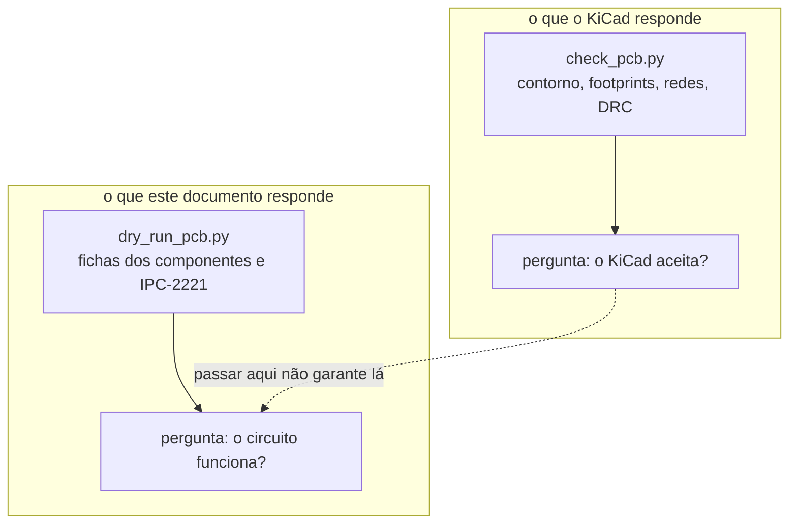

# Dry-run da placa

Este documento é o ensaio a seco da placa: cada regra que as fichas dos
componentes e as normas impõem ao layout, medida no arquivo
[`cad/gnssbike.kicad_pcb`](cad/) e não afirmada de memória. Ele existe porque
a verificação de regras do KiCad responde a uma pergunta diferente — "o KiCad
aceita esta placa?" — e nada nela sabe que uma antena de chip a 6 mm de um
indutor de conversor chaveado não vai irradiar.

**Nesta página:** [O que é medido](#o-que-é-medido) ·
[Como rodar](#como-rodar) · [As regras e a origem de cada uma](#as-regras-e-a-origem-de-cada-uma) ·
[Resultado da posição](#resultado-da-posição) ·
[Resultado do roteamento](#resultado-do-roteamento) ·
[Defeitos achados e corrigidos nesta passagem](#defeitos-achados-e-corrigidos-nesta-passagem) ·
[O que não foi medido](#o-que-não-foi-medido)

> [!WARNING]
> **Nada disto foi montado nem medido em bancada.** Tudo aqui sai de arquivos:
> o esquemático em `cad/nets.py`, a placa em `cad/gnssbike.kicad_pcb` e as
> fichas dos fabricantes, citadas pela seção. Placa física não existe.

## O que é medido


```mermaid
flowchart TB
    subgraph A["o que o KiCad responde"]
        A1["check_pcb.py<br/>contorno, footprints, redes, DRC"]
        A2["pergunta: o KiCad aceita?"]
    end
    subgraph B["o que este documento responde"]
        B1["dry_run_pcb.py<br/>fichas dos componentes e IPC-2221"]
        B2["pergunta: o circuito funciona?"]
    end
    A1 --> A2
    B1 --> B2
    A2 -.->|"passar aqui não garante lá"| B2
```

A diferença importa. Antes desta passagem a placa tinha **0 erros de DRC** e,
ao mesmo tempo, o colhedor solar a 16,4 mm da antena do rádio, o receptáculo
USB-C com a boca virada para dentro da placa e as caixas 3D 2,54 vezes maiores
do que as peças. Nenhuma dessas três coisas é uma violação de regra de
projeto, e as três quebram o aparelho.

## Como rodar

Na raiz do repositório:

| Ordem | Comando | O que faz |
|---|---|---|
| 1 | `python hardware_gnssbike/cad/make_pcb.py` | escreve a placa com as peças posicionadas, sem trilha |
| 2 | `python hardware_gnssbike/cad/route.py` | roteia o que consegue e deixa o resto declarado |
| 3 | `python hardware_gnssbike/cad/check_pcb.py --como-esta` | contorno, footprints, redes e a DRC do KiCad, **no arquivo como está** |
| 4 | `python hardware_gnssbike/cad/dry_run_pcb.py` | **este documento**, medido de novo |
| — | `python hardware_gnssbike/cad/orientacao.py` | para que lado olha cada peça que sai da caixa |

Os quatro primeiros formam uma cadeia e a ordem importa. Sem `--como-esta`,
o passo 3 **regera a placa**, o que apaga as trilhas e faz a verificação de
regras olhar uma placa vazia — foi assim que uma passagem inteira de
roteamento pareceu limpa sem nunca ter sido medida. Rodar o 2 sem rodar o 1
antes é seguro (o roteador apaga o cobre da corrida anterior), mas deixa
trilhas de uma colocação que pode já ter mudado.

## As regras e a origem de cada uma

| Id | O que exige | Origem |
|---|---|---|
| RF1 | sem cobre, sem componente e sem caixa metálica fechada sobre a área da antena do módulo | ficha MinewSemi ME54BS13 V1.0.0, **7.3** |
| RF2 | o lado de RF do módulo virado para a borda, nunca para dentro da placa | ficha ME54BS13 V1.0.0, **7.3** |
| RF3 | **3 a 5 mm** em volta da área da antena sem trilha de sinal, sem metal e sem fonte de interferência; módulo na **borda ou no canto** | ficha ME54BS13 V1.0.0, **7.4** |
| RF4 | a placa **vazada** sob a área da antena, deixando-a suspensa | ficha ME54BS13 V1.0.0, **7.4** |
| RF5 | **5 mm** entre o receptor GNSS e qualquer componente de RF | u-blox MAX-F10S Integration Manual UBXDOC-963802114-12892, **4.4** |
| RF6 | terra sob o módulo GNSS na primeira e na segunda camada, sem trilha de sinal cruzando por baixo nessas duas | u-blox MAX-F10S IM, **4.4** |
| RF7 | o **caminho de RF** do pino `RF_IN` até o contato da antena, passando pela rede π, dentro de **λ/10 em L1 (10,5 mm)**; cada shunt a menos de **λ/20 (5,3 mm)** do nó em que pendura | u-blox MAX-F10S IM, **4.4** ("as short as possible"); o limite é λ/10 e λ/20, calculados abaixo |
| RF8 | as duas antenas o mais longe possível uma da outra | u-blox MAX-F10S IM, **4.4** |
| RF9 | a **tabela de isolação** do módulo: **20 mm** de fonte chaveada, indutor de potência ou transformador; 20 mm de USB 3.0/HDMI/DDR/SDIO rápido; 15 mm de clock rápido de MCU ou PHY Ethernet; **25 mm** de display, câmera ou cabo FPC com fiação | ficha ME54BS13 V1.0.0, **7.2**, `Interference Isolation Rule` |
| RF10 | **50 mm** entre dois módulos de rádio na mesma placa | ficha ME54BS13 V1.0.0, **7.2**, `Multiple Modules on the Same PCB` |
| US1 | o par `USB_DP`/`USB_DM` **roteado**, com a largura e o afastamento que dão **90 Ω diferenciais** nesta pilha | USB 2.0, 7.1.6 (90 Ω ±15 %); a geometria sai do empilhamento, calculada em [`cad/route.py`](cad/route.py) |
| AL1 | desacoplamento do **módulo de rádio a 0,5 mm** do pino; dos demais CIs, 2 mm o de alta frequência e 5 mm o de reserva | ficha ME54BS13 V1.0.0, **7.2**; fichas do nPM1300, AEM10900, TPS7A02 |
| AL2 | largura de trilha suficiente para a corrente, com 10 °C de subida | IPC-2221B, 6.2, curva de condutor externo |
| AL3 | laço de chaveamento curto: `SW` ao indutor e ao capacitor de saída | ficha do nPM1300, layout recomendado |
| AL4 | no máximo **0,2 Ω** em série na linha `VCC` do GNSS | u-blox MAX-F10S IM, **4.1.1** |
| AL5 | **footprint de filtro π reservado** junto ao pino de alimentação do módulo de rádio, por ele vir de fonte chaveada | ficha ME54BS13 V1.0.0, **7.2** |
| GN1 | uma via de terra junto de **cada** pad de terra do módulo, e todo pad de terra de superfície ligado ao terra | ficha ME54BS13 V1.0.0, **7.2** |
| GN2 | costura de vias de terra na borda a cada 5 mm no máximo | λ/10 a 2,44 GHz em FR-4 são 6,1 mm |
| ME1 | a placa **cabe** dentro da caixa. Não é o que define o tamanho dela — placa e caixa são independentes —, é só a conferência de que uma entra na outra | [04](04-pcb-e-caixa.md) |
| ME2 | altura dos componentes dentro da sombra da bateria e do display | [04](04-pcb-e-caixa.md#as-duas-sombras-display-e-bateria) |
| ME4 | as ilhas de solda de uma peça ficam **sob o corpo** do modelo 3D do fabricante | um rabicho de solda fica em cima da sua ilha: se o corpo não as cobre, o modelo está fora de posição ou fora de orientação |

> [!CAUTION]
> **Este documento já errou duas vezes sobre a mesma ficha, nos dois
> sentidos, e as duas correções estão aqui.**
>
> **Primeiro erro.** Ele afirmava *"20 mm entre a antena do módulo e qualquer
> conversor chaveado ou indutor"* e nada mais, sem a tabela. Com isso mantinha
> a fonte chaveada longe e, ao mesmo tempo, **deixava dez peças a menos de
> 5 mm da antena, uma delas a 0,8 mm** — porque o **3 a 5 mm** da 7.4, que
> vale para **qualquer** peça em volta da área da antena, não estava sendo
> medido. Corrigido: virou o `RF3`.
>
> **Segundo erro, ao corrigir o primeiro.** Ele passou a afirmar que a regra
> dos 20 mm **não existia**, porque foi procurada na 7.3 — que de fato só traz
> o qualitativo *"do not place modules adjacent to strong interference
> sources"*. Ela existe, na **7.2**, `Interference Isolation Rule`, e é uma
> **tabela de quatro linhas**. Enquanto essa afirmação valeu, a restrição saiu
> do posicionador e o indutor `L103` chegou a **6,8 mm** do módulo. Corrigido:
> virou o `RF9`, com as quatro linhas, inclusive a de **25 mm de display ou
> cabo FPC**, que nenhuma versão deste documento tinha.
>
> O que continua valendo da primeira correção: o desacoplamento do módulo é de
> **0,5 mm**, não de 2 — a 7.2 escreve *"the trace length between capacitor
> pads and power pins should be ≤ 0.5 mm"*.
>
> A lição, escrita porque custou duas passagens: **"não achei" não é "não
> existe"**. Medir a coisa errada com rigor não é rigor, e apagar uma regra
> porque ela não estava na seção em que se olhou é pior do que não tê-la
> medido.
>
> Os PDF estão em [`datasheets/`](datasheets/), que o `.gitignore` mantém fora
> deste repositório público; o que é versionado são as citações.

### De onde saem os 10,5 mm do RF7

A ficha não dá número: escreve "as short as possible". Um número tem de sair
de física, e o que decide é quando a linha deixa de ser eletricamente curta.

```text
microstrip de 0,196 mm sobre 0,10 mm de FR-4 (a pilha assimetrica desta placa)
eps_eff = (4,3+1)/2 + (4,3-1)/2 x (1 + 12 x 0,10/0,196)^-0,5 = 3,27
lambda em L1 (1,575 GHz) = c / (f x raiz(eps_eff)) = 105,3 mm
lambda/10 = 10,5 mm   -> o caminho inteiro, do pino ao contato da antena
lambda/20 =  5,3 mm   -> o toco de cada shunt, que tem de se comportar como
                         o capacitor concentrado com que a rede foi calculada
```

> [!WARNING]
> **Este teste já cobrou a coisa errada.** Ele exigia que os **três**
> elementos da rede π estivessem a menos de 5 mm do pino `RF_IN`. O `C301` é
> o shunt do lado da **antena** — é o fim da rede por construção —, de modo
> que uma rede π montada corretamente falhava por estar correta. E o limite
> de 2 mm que os shunts chegaram a carregar era **invenção**: a ficha não dá
> figura nenhuma. Agora o que se mede é o caminho, e o número vem da conta
> acima.

### Por que RF3 não é uma zona proibida

Uma zona proibida do KiCad proíbe **cobre**. A regra 7.4 da ficha do módulo
proíbe **peça**: qualquer componente perto da antena acopla pelo campo
próximo, esteja o cobre dele onde estiver. Verificação de regra nenhuma pega
isso, e por isso a regra mora no posicionador (`DIST_ANTENA` em
[`cad/make_pcb.py`](cad/make_pcb.py)) e é medida aqui.

Com uma exceção, nomeada e medida: o **desacoplamento do próprio módulo**.
As duas regras da mesma ficha se contradizem para ele — 7.2 quer o capacitor
a 0,5 mm do pino de alimentação, e esse pino fica a 2,1 mm da própria antena.
Não existe ponto que satisfaça as duas. O `C201` e o `C210` ficam perto de
propósito, e o dry-run imprime a que distância, em vez de esconder.

### A conta da largura de trilha

`dry_run_pcb.py` usa a fórmula da IPC-2221B, 6.2, para condutor externo:

```text
A = (I / (k × ΔT^b))^(1/c)      com k = 0,048, b = 0,44 e c = 0,725
largura = A / espessura
```

com a área `A` em mil², a subida `ΔT` em °C e a espessura do cobre de 35 µm
(cobre de 1 oz), convertida para mil. A corrente de cada
trilho vem da tabela `CORRENTE` do próprio arquivo, com a origem escrita ao
lado de cada número — sem ela a largura seria um chute.

## Resultado da posição

Medido em 2026-09-26, na placa de **34 × 90 mm** com 155 peças, 114 redes,
1.506 segmentos e 544 vias — **18 regras cumpridas, 5 violadas, 4 sem
medida**. A tabela de 2026-09-25 (145 peças, 22 regras, 21 cumpridas) está
no histórico do git; três coisas mudaram nela e vale dizer quais: a `ME2`
passou a medir de verdade (tinha sombra nenhuma para medir), a `RT1`
nasceu, e a `US1` fechou.

| Id | Medida | Situação |
|---|---|---|
| RF1 | a área da antena (**4,46 × 12,50 mm**) está livre de componente | cumprida |
| RF3 | a peça alheia mais próxima da área da antena é o `JP102`, a **5,6 mm**; o desacoplamento do próprio módulo fica mais perto de propósito (`C201` a 1,4 e `C210` a 3,4) | cumprida |
| RF4 | a placa **é vazada** sob a área da antena | cumprida |
| RF5 | o componente de RF alheio mais próximo do receptor é o `E301`, a **6,4 mm** | cumprida |
| RF7 | caminho de RF do pino à antena de **8,1 mm**, dentro de λ/10 em L1 (10,5); `C302` a 2,5 e `C301` a 3,2 mm do seu nó | cumprida |
| RF8 | as duas antenas estão a **74,3 mm** de centro a centro, 2,4 quartos de onda de 2,44 GHz | cumprida |
| **RF9** | display, câmera ou cabo plano com fiação: **a própria sombra do display a 6,8 mm** da área da antena do módulo, e a ficha pede 25. Até 2026-09-26 a regra só via o `J402` (a 33,3 mm), porque a sombra do display não existia em arquivo nenhum | **violada** |
| RF10 | os dois módulos de rádio a **50,8 mm**, acima dos 50 da ficha | cumprida |
| **AL1** | 23 de 25 capacitores dentro do limite (média 2,42 mm); fora: `C117` a **6,7 mm** do `U103` (limite 5) e `C114` a **2,3** do `U104` (limite 2) | **violada** |
| **AL2** | **3 segmentos** do `VBAT_SYS` a 0,40 mm onde a IPC-2221 pede 0,57 (0,8 A); os estreitamentos junto a pad não contam | **violada** |
| AL5 | filtro π do módulo montado como `C129`+`C105`+`C106`+`C107`+`C108` \| `JP102` \| `C201`+`C210`, com o elemento em série a **3,9 mm** do pino de alimentação | cumprida |
| AL6 | nenhuma via sobre os 4 pads térmicos | cumprida |
| GN1 | os **114** pads de terra de superfície estão ligados; **106 (93 %)** por via própria ao plano interno, os outros 8 pelo plano da própria face | cumprida |
| GN2 | **115 vias** de costura na borda, maior vão **4,0 mm** contra o limite de 5 | cumprida |
| ME1 | a placa de **34 × 90** deixa 12,0 mm de cada lado e 5,0 mm em cima e embaixo | cumprida |
| **ME2** | **5 peças mais altas que o teto da sombra em que estão**: `J102` 4,25 e `LS601` 3,00 e `U502` 1,86 contra 1,2 mm sob a célula; `J103` 3,75 e `U301` 2,70 contra 2,6 mm sob o display ([04](04-pcb-e-caixa.md#as-duas-sombras-display-e-bateria)) | **violada** |
| ME3 | os **17** encapsulamentos com cota de ficha cabem no footprint desenhado para eles e batem com o contorno | cumprida |
| ME4 | as ilhas de `J101` (16), `J103` (6) e `J402` (7) ficam sob o corpo do modelo do fabricante | cumprida |
| OP1 | nenhuma peça de altura conhecida a menos de duas alturas do sensor de luz | cumprida |
| US1 | o par `USB_DP`/`USB_DM` está roteado, a 0,150 mm nos pescoços dos dois conectores de 0,5 mm de passo e a **0,207 mm** no resto, que é o que dá 90 Ω nesta pilha | cumprida |
| **RT1** | **44 itens desconectados em 30 redes** no DRC completo (`SRC` 8, `VBAT_SYS` 7, `3V0_SENS` 6, `NTC_SOLAR` 6, `GND` 6, `3V0` 5, `VSYS` 5, `PWR_SCL` 4); e **4 violações de isolamento** de 0,125 contra 0,127 mm (2 µm, arredondamento da grade de 0,15) entre `PWR_SCL` e `VBAT` junto do nPM1300, mais 20 avisos de biblioteca | **violada** |
| RF2, RF6, AL3, AL4 | o lado de RF do módulo para a borda; terra sob o receptor nas duas primeiras camadas; o laço de chaveamento; os 0,2 Ω em série no `VCC` do GNSS | **sem medida**: precisam de bancada, do empilhamento do fabricante ou de modelo |


> [!CAUTION]
> **O `ME3` passou a cumprir, e o que o destravou foi o arquivo do
> fabricante.** Ele falhava em dois land patterns que eram de outra peça: o
> `USB_C_Receptacle_Palconn_UTC16-G` desenhava 8,94 × 7,32 contra os 9,99 ×
> 8,58 do conector da lista, e o `Hirose_FH12-10S-0.5SH` desenhava 8,10 de
> largura contra os 9,90 do FH28-10S-0.5SH. Reconstruir land pattern de
> USB-C a partir de desenho **renderizado** é exatamente o palpite que esta
> conferência existe para pegar; o que resolveu foi trocar as peças por
> outras que o fabricante publica em STEP — o HRO TYPE-C-31-M-12 e o
> HC-FPC-05-10-5RLTAG —, e passar a desenhá-las com esse modelo.
>
> **O `US1` fechou em 2026-09-26, e não foi o roteador que o fechou.** Um
> par de classe USB não sai de uma fileira de contatos a 0,5 mm de passo
> por busca em labirinto — e esta placa tem duas fileiras dessas em série,
> a do receptáculo e a do diodo de proteção. O trecho inteiro é desenhado
> à mão em `route.py` (`ligar_usb()`): os dois contatos de cada sinal
> amarrados por baixo do conector em `In2.Cu` (o USB-C traz D+ e D− duas
> vezes, intercalados, B7 A6 A7 B6), a subida em diagonal ao pino de
> entrada do diodo, a travessia reta do TPD4E05U06 pelos pinos que a ficha
> reserva para isso (tabela 4-2: 6, 7, 9 e 10, "straight-through routing"),
> e um toco de saída; a busca só faz o resto, a 0,207 mm. Os pescoços são
> de 0,150 mm: dentro de um campo de 0,5 mm é a trilha estreita que compra
> o isolamento. O que destravou a busca no resto do par foi outra coisa,
> um defeito do próprio roteador: a reserva de cada ilha arredondava para
> fora nos dois sentidos e fechava toda fileira de 0,5 mm de passo
> (`Grade._ret`, agora com o centro da célula como critério).

> [!WARNING]
> **A regra `ME4` nasceu de dois modelos de fabricante que vêm girados, e de
> três tentativas erradas de consertar o primeiro.** O STEP do receptáculo
> USB-C que a LCSC publica está 180° fora do referencial do footprint: com
> ele como vem, as 16 ilhas de contato caem 1,45 mm **além** do corpo, do
> lado oposto, e a boca do conector aponta para o miolo da placa. O do JST
> ZH tem o mesmo problema, mais 1,61 mm de deslocamento em X.
>
> Verificação nenhuma daqui pegava. O 2D só tem as ilhas, que estão certas;
> o DRC não lê modelo 3D; e as ilhas de um receptáculo USB-C são quase
> simétricas em y, de modo que a peça "cabe" nos dois sentidos. Quem viu foi
> o dono, no desenho 3D, e disse três vezes. Nas duas primeiras eu girei o
> **footprint**, que é o que estava certo, e piorei.
>
> A primeira versão da regra perguntava de que lado ficava a **boca**,
> lançando um raio pela cavidade. Não serve: a traseira de um receptáculo
> USB-C também é oca, e o raio respondeu o que eu queria ouvir. A regra que
> ficou não tem palpite nenhum — um rabicho de solda fica em cima da sua
> ilha, então o corpo do modelo tem de cobrir as ilhas da peça. É a
> assinatura exata do defeito, e foi ela que achou o do `J103`, que ninguém
> tinha visto.
>
> O alvo do conserto também não é palpite: o `F.Fab` do footprint do KiCad
> desenha o corpo do USB-C em X −4,47..+4,47 e **Y −3,65..+3,65**, e o do
> JST em X −4,50..+4,50 e Y −2,00..+4,00. Girados e deslocados
> (`footprints.MODELO_GIRADO`), os dois modelos caem exatamente aí. Com
> isso a boca do USB-C ficou a **0,64 mm** da borda: antes estava 2,74 mm
> para dentro, e o sobremolde do plugue bateria no canto da placa antes de
> o conector assentar.

## Resultado do roteamento

> [!IMPORTANT]
> **O roteamento está a três quartos, e isso é o que o número diz.** Em
> 2026-09-26 o roteador fechou **204 ligações** e deixou **59 sem trilha, em
> 26 redes**; o DRC completo do KiCad, com as malhas preenchidas, conta
> **44 itens desconectados em 30 redes** (a diferença entre os dois números
> é o que a malha de terra fecha sozinha). Os documentos que este substitui
> disseram "0 ligações sem trilha" duas vezes, com 47 e 55 em aberto: o DRC
> rodava com `--severity-error`, que esconde os não roteados porque para o
> KiCad eles são aviso. A regra `RT1` roda com `--severity-all` e é a
> única contagem que vale.

| Medida | Valor |
|---|---|
| Camadas de roteamento | **3**: `F.Cu`, `In2.Cu` e `B.Cu`; `In1.Cu` é plano de terra |
| Segmentos | **1.506** |
| Vias | **544**, sendo 96 de pad de terra ao plano interno, 84 de costura na borda, 127 na malha da área e o resto de troca de camada |
| Ligações fechadas | **204** |
| Ligações sem trilha, pelo roteador | **59**, em 26 redes: 19 de `GND` sem lugar para a via junto de (21,0; 44,7); `VBAT_SYS` 4; `VSYS`, `3V0_SENS` e `3V0` 3 cada; `PWR_SCL`, `PWR_SDA`, `SD3V0`, `DIS_SW`, `VBUS` e `NOR_CS` 2 cada; e uma em cada uma de 15 redes (`BUCK2_SW`, `ANT_T1`, `ANT_T2`, `ALRT`, `BL_K2`, `MPPT`, `3V3BL`, `VBUSOUT`, `SRC`, `CC1`, `CC2`, `VBCKP`, `DISP_CS`, `GNSS_RX`, `RF_CHIP`) |
| Itens desconectados, pelo DRC completo | **44**, em 30 redes (`SRC` 8, `VBAT_SYS` 7, `3V0_SENS` 6, `NTC_SOLAR` 6, `GND` 6, `3V0` 5, `VSYS` 5, `PWR_SCL` 4) |
| Redes deixadas de fora de propósito | `RF_IN`, `RF_ANT`, `RF_CHIP` e `RF_UFL` |
| **Erros de regra de projeto do KiCad** | **4**, todos o mesmo: isolamento de 0,125 contra os 0,127 mm da classe de alimentação (2 µm, arredondamento da grade de 0,15) entre `PWR_SCL` e `VBAT` junto do nPM1300. Mais 20 avisos de biblioteca (`lib_footprint_issues` e `lib_footprint_mismatch`), que são os footprints gerados aqui não baterem com a biblioteca do KiCad, de propósito |
| Conferência geométrica independente | **0** pares perto demais |
| Traçado | tronco ortogonal com chanfro de 45° nos cantos; o par USB à mão ([acima](#resultado-da-posição)) |

### Por que `RF_IN`, `RF_ANT`, `RF_CHIP` e `RF_UFL` não são roteadas

Elas precisam de 50 Ω controlados, e a largura que dá 50 Ω só existe depois
que o fabricante informa o empilhamento — que é item em aberto em
[04](04-pcb-e-caixa.md). A conta de Hammerstad com a pilha de
0,10/0,46/0,10 mm e εr 4,3 dá **0,196 mm** para 50 Ω, mas ignora a
espessura do cobre, e com ela a linha fica em 44 a 46 Ω: é conta de
partida, não de fabricação. Desenhar agora com uma largura qualquer seria
pior que deixar em branco: pareceria pronto.

### O que o KiCad ainda conta como sem ligação

Com as malhas preenchidas pelo `fill_zones.py` (que só roda com o Python
do KiCad: com o do sistema ele avisa e sai, e o DRC passa a contar centenas
de pads de terra "soltos" que não existem), o DRC completo diz **44 itens
desconectados em 30 redes**. Seis são de `GND` — pads que a malha da
própria face não alcança e para os quais o roteador não achou lugar de
via —; os outros 38 são ligações de sinal e de alimentação realmente sem
trilha, e a lista por rede está na tabela acima.

### Por que metade, e o que fazer com a outra metade

O roteador aqui é um labirinto A\* com ordem fixa e **sem *rip-up***: quando
uma rede fecha o caminho de outra, ele não desfaz nada. Um roteador de
verdade (o FreeRouting, por exemplo) desfaz e refaz até convergir. Duas
saídas, nesta ordem:

1. **Abrir `cad/gnssbike.kicad_pcb` no KiCad e terminar à mão.** O trabalho
   difícil — posição, plano de terra, costura, regras das fichas — já está
   feito e conferido; o que falta são ligações de sinal em área livre.
2. **Exportar Specctra DSN e passar pelo FreeRouting.** Precisa de Java e de
   um download, que é decisão do dono.

### O laço de chaveamento (AL3), que ninguém mediu

O `dry_run_pcb.py` **não** mede o laço `SW` → indutor → capacitor de saída,
porque ele depende do roteamento final e o roteamento não está fechado.
Quando estiver, essa regra entra na medição.

## Defeitos achados e corrigidos nesta passagem

| Defeito | Como apareceu | Correção |
|---|---|---|
| **Boca do USB-C virada para dentro da placa** | o dono viu na imagem: "vejo coisas erradas como o footprints do usb invertido" | `J101` de 180° para 0° e `J102` de 90° para 270°, e `cad/orientacao.py` passou a **medir** para que lado olha cada peça que sai da caixa, a partir da geometria do próprio footprint |
| **Caixas 3D 2,54 vezes maiores** | conferência da unidade contra `R_0402_1005Metric.wrl` da biblioteca do KiCad, cujo corpo de 1,0 × 0,5 mm tem cantos em ±0,197 e ±0,098 | o VRML do KiCad é em unidades de 0,1 polegada: `wrl_caixa()` passou a dividir por 2,54 |
| **Pad `custom` sub-bloqueado no roteador** | varredura dos footprints: no `U104` (TPS7A02 em X2SON) o `size` do pad é 0,148 mm mas o cobre das primitivas chega a 0,46 × 0,31 | o roteador passou a ler as primitivas do pad `custom` |
| **Folga de via não modelada** | a placa roteada falhou 974 regras, com 199 `shorting_items` e 199 `hole_clearance` | duas grades: uma para onde a trilha pode passar, outra para onde o **centro da via** pode cair |
| **Toco de terra sem conferência** | o mesmo episódio: o toco saía do pad numa direção qualquer que estivesse livre **na via**, atravessando o que houvesse no meio | o toco virou axial e o corredor inteiro é conferido antes de desenhar |
| **Pad tratado como círculo** | um pad quadrado ficava descoberto nos cantos | pads marcados como o retângulo que são, com a rotação aplicada |
| **Contorno circular lido pela metade** | o único erro de DRC da placa sem trilhas: `TP201` e `TP203` com os contornos encostados | o contorno de um ponto de teste é um `fp_circle`, e o leitor tomava `center` e `end` como dois pontos soltos, achando raio 0,5 onde era 1,0. Os dois pontos estavam a exatos 2,0 mm |
| **Folga de um pad lembrada só uma vez** | 42 erros de isolamento com trilhas a 0,025 mm de um pad | a marcação usava "quem chegar primeiro": uma célula dentro da folga de **dois** pads guardava só um deles. Agora célula disputada por duas redes fica proibida para as duas — que é o que ela é |
| **Classe USB tratada como a padrão** | trilha de terra a 0,075 mm do `USB_DP`, que pede 0,2 mm | as três classes do `gnssbike.kicad_pro` passaram a ser lidas, não supostas |
| **Rotear duas vezes empilhava as trilhas** | o roteador dizia 534 segmentos e o arquivo tinha **1576**, com 206 cruzamentos que ele nunca desenhou | `route.py` passou a apagar as trilhas e vias anteriores antes de escrever; rodar de novo agora dá o mesmo resultado |

## O que não foi medido

| Id | O que falta | Por quê |
|---|---|---|
| RF2 | a antena do módulo olhando para fora da borda | `orientacao.py` mede a geometria do footprint, mas quem confirma que aquele lado é o da antena é a ficha; **conferir na ficha impressa antes de fabricar** |
| AL3 | laço de chaveamento `SW` → indutor → capacitor de saída | depende do roteamento final, que ainda não está fechado |
| ME2 | altura dos componentes sob a bateria e sob o display | as peças sem modelo do fabricante entram como caixa do encapsulamento, não como o corpo real |
| — | impedância de 50 Ω das linhas de RF | depende do empilhamento do fabricante, que é item em aberto em [04](04-pcb-e-caixa.md) |
| — | isolamento entre as duas antenas | bancada |

---

**Verificação:** os números desta página saem de
`python hardware_gnssbike/cad/dry_run_pcb.py`, que recalcula tudo a cada
execução. Nenhum foi digitado à mão.
